## README 


\begin{tikzpicture}
,
    text height = 2ex}]
  \graph { tex -> dvi -> ps -> pdf,
           bib -> bbl,
           bbl -> dvi };
\end{tikzpicture}



\usepackage{pgfplots}
\pgfplotsset{trig format plots=rad}
\begin{tikzpicture}
  \begin{axis}[axis lines = middle, axis equal,
      domain = 0:6*pi, ymin=-18, ymax=18,
      xtick = {-4*pi,-2*pi,pi,3*pi,5*pi},
      ytick = {pi, 2*pi, 3*pi, 4*pi, 5*pi},
      xticklabels = {$-4\pi$, $-2\pi$,
        $\vphantom{1}\pi$, $3\pi$, $5\pi$},
      yticklabels = {$\vphantom{1}\pi$, $2\pi$,
        $3\pi$, $4\pi$, $5\pi$}
    ]
    \addplot[samples=120, smooth, thick, variable=t]
      ( {t*cos(t)}, {t*sin(t)} );
\end{axis}
\end{tikzpicture}




\usetikzlibrary {arrows.meta,trees}
\begin{tikzpicture}
  [edge from parent fork down, sibling distance=15mm, level distance=15mm,
   every node/.style={fill=red!30,rounded corners},
   edge from parent/.style={red,-{Circle[open]},thick,draw}]
  \node {root}
      child {node {left}}
      child {node {right}
        child {node {child}}
        child {node {child}}
      };
\end{tikzpicture}



\usetikzlibrary {shapes.geometric}
\begin{tikzpicture}[fill=blue!20]
  \draw[help lines] (-1,-2) grid (6,3);
  \path (0,0)  node(a) [ellipse,rotate=10,draw,fill]    {An ellipse}
        (3,-1) node(b) [circle,draw,fill]               {A circle}
        (2,2)  node(c) [rectangle,rotate=20,draw,fill]  {A rectangle}
        (5,2)  node(d) [rectangle,rotate=-30,draw,fill] {Another rectangle};
  \draw[thick] (a.south) -- (b) -- (c) -- (d);
  \draw[thick,red,->] (a) |- +(1,3) -| (c) |- (b);
  \draw[thick,blue,<->] (b) .. controls +(right:2cm) and +(down:1cm) .. (d);
\end{tikzpicture}



\usetikzlibrary {shapes.geometric}
\begin{tikzpicture}
  \node (start) [draw,shape=ellipse] {start};
  \foreach \angle in {-90, -80, ..., 90}
    \draw (node cs:name=start,angle=\angle)
      .. controls +(\angle:1cm) and +(-1,0) .. (2.5,0);
  \end{tikzpicture}



\begin{tikzpicture}
  \draw (0,0) circle (1in);
  \draw[red, thick] (-1,0) -- (1,0);
  \draw[blue, thick] (0,-1) -- (0,1);
\end{tikzpicture}



<script type="text/tikz">
  \begin{tikzpicture}
    \draw (0,0) circle (1in);
  \end{tikzpicture}
</script>

只用 tikz语法 画正弦函数

以下是使用 Hugo shortcode 的实现方式：


使用方式：


\begin{tikzpicture}
  \draw (0,0) circle (1in);
  \draw[red, thick] (-1,0) -- (1,0);
  \draw[blue, thick] (0,-1) -- (0,1);
\end{tikzpicture}




\begin{tikzpicture}
  \draw[gray,very thin] (-1.9,-1.9) grid (2.9,3.9)
          [step=0.25cm] (-1,-1) grid (1,1);
  \draw[blue] (1,-2.1) -- (1,4.1); % asymptote

  \draw[->] (-2,0) -- (3,0) node[right] {$x(t)$};
  \draw[->] (0,-2) -- (0,4) node[above] {$y(t)$};

  \foreach \pos in {-1,2}
    \draw[shift={(\pos,0)}] (0pt,2pt) -- (0pt,-2pt) node[below] {$\pos$};

  \foreach \pos in {-1,1,2,3}
    \draw[shift={(0,\pos)}] (2pt,0pt) -- (-2pt,0pt) node[left] {$\pos$};

  \fill (0,0) circle (0.064cm);
  \draw[thick,parametric,domain=0.4:1.5,samples=200]
    % The plot is reparameterised such that there are more samples
    % near the center.
    plot[id=asymptotic-example] function{(t*t*t)*sin(1/(t*t*t)),(t*t*t)*cos(1/(t*t*t))}
    node[right] {$\bigl(x(t),y(t)\bigr) = (t\sin \frac{1}{t}, t\cos \frac{1}{t})$};

  \fill[red] (0.63662,0) circle (2pt)
    node [below right,fill=white,yshift=-4pt] {$(\frac{2}{\pi},0)$};
\end{tikzpicture}


这样您就可以在 Hugo 内容文件中轻松嵌入 TikZ 图形了。





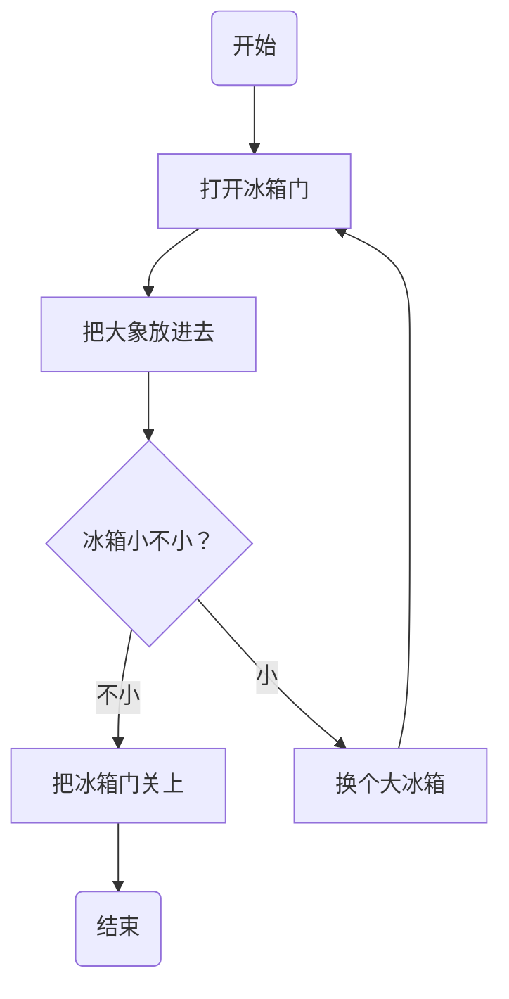


```cpp 
#include <iostream> 
using namespace std;

void area(double a){
    const double PI = 3.14;
    cout << "圆形的面积为：" << PI*a*a;
}

int main(){
    double a = 6;
    area(a);
    return 0;
}

```


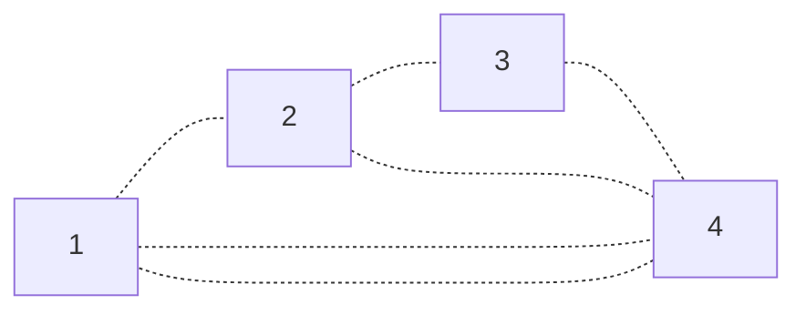

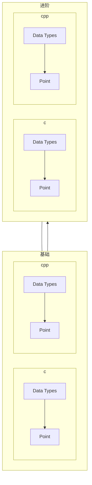

如何使箭头不弯曲
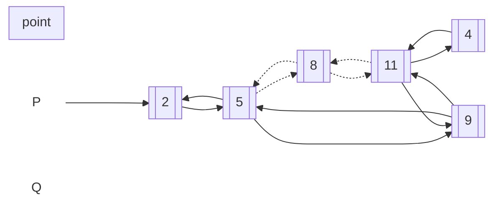

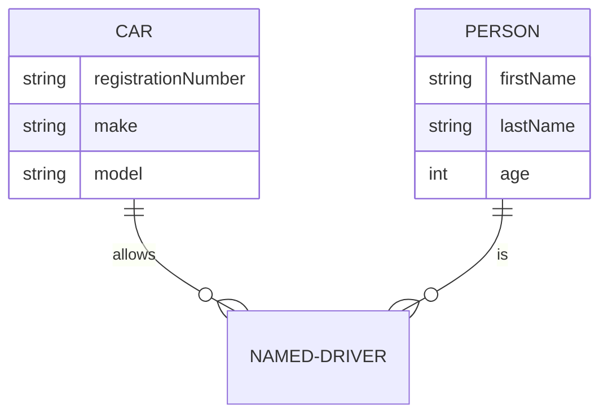

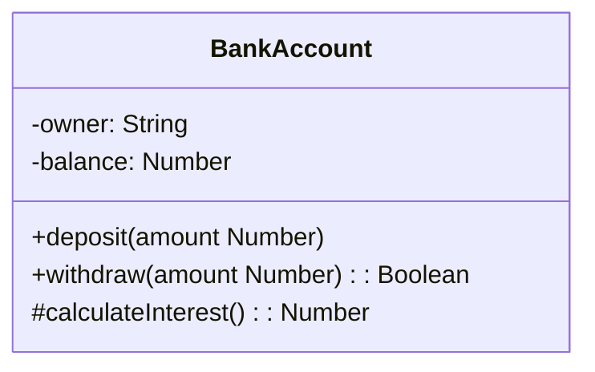
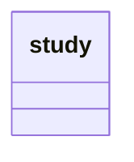

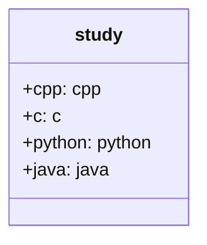

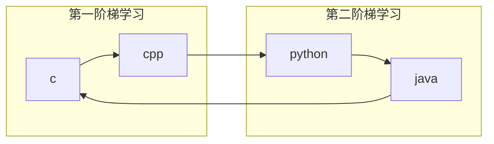

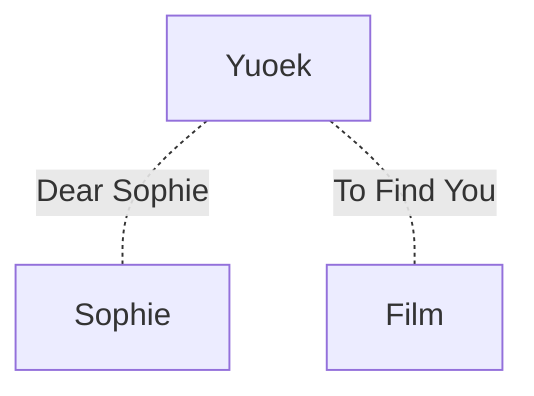

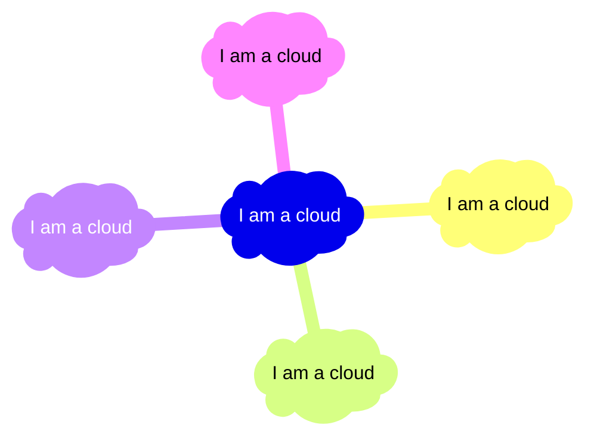

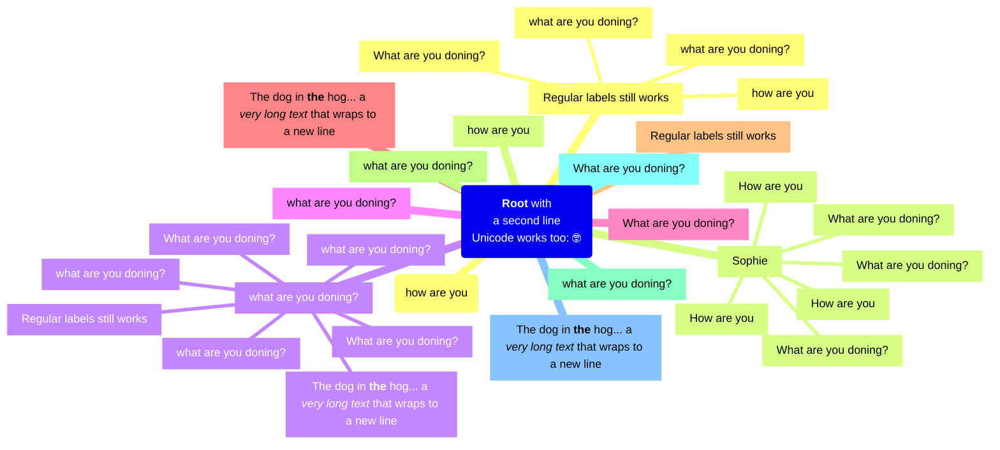

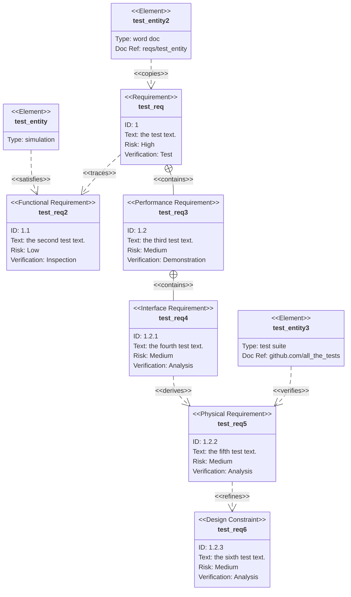


在Mermaid流程图语法中，当出现"多个label"的情况时，通常有以下几种处理方式：

## 1. 使用HTML标签实现多行文本
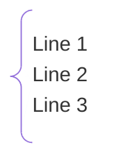

## 2. 使用转义字符
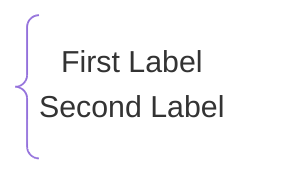

## 3. 使用HTML div标签
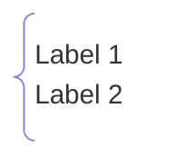

## 4. 多个标签的完整示例
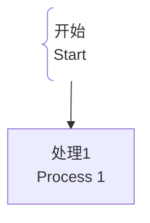

**注意：** 在Mermaid中，换行需要使用HTML的`<br>`标签或转义字符`\n`来实现多行文本效果。


flowchart TD
    A@{ shape: comment, label: "Comment" }


分数：\( \frac{X ^y  }{Z } {4} \) 

\\( \frac{X ^{y + z } }{X _{1 } } \\)   


\\( \lim_{X  \to \infty} \\) 

\\[
 \lim_{x  \to \infty}
\\]

\\[
\lim_{x  \to 100 ^-}
\\]

\\[
 \int_1 ^100  f(x )\,dx 
\\]

\\[
 \int_{1 }^{100 } f(x ) \, dx 
\\]


\[
  \int_a^b \! f(x) \, dx = \lim_{\Delta x \rightarrow 0}
  \sum_{i=1}^{n} f(x_i) \,\Delta x_i
\]

\\[
\iint_D f(x,y)\,dA
\\]


$$
\iint_D f(x,y)\,dA
$$

\\[
\iint_D f(x, y) dB
\\]

\\[
 \int_V f(x, y, z) dC 
\\]


\\[
\binom{i }{j } = \frac{i }{j !(i -j )!}
\\]


您提供的公式有笔误。正确的组合数（二项式系数）公式应为：

\\[
\binom{i}{j} = \frac{i!}{j! \cdot (i - j)!}
\\]

**说明：**

1.  **符号**：`\binom{i}{j}` 表示组合数，也写作 C(i, j) 或 ⁿCᵣ。
2.  **定义**：它表示从 `i` 个不同元素中不计顺序地选取 `j` 个元素的所有不同方法的数量。
3.  **公式修正**：
    *   您原公式中的 `\frack{i }` 应为 `\frac{i!}`。关键是要有 **阶乘符号 `!`**。
    *   分母是 `j!` 和 `(i - j)!` 的乘积。

**使用条件**：
这个公式在 `i` 和 `j` 都是非负整数，且 `0 ≤ j ≤ i` 时成立。


