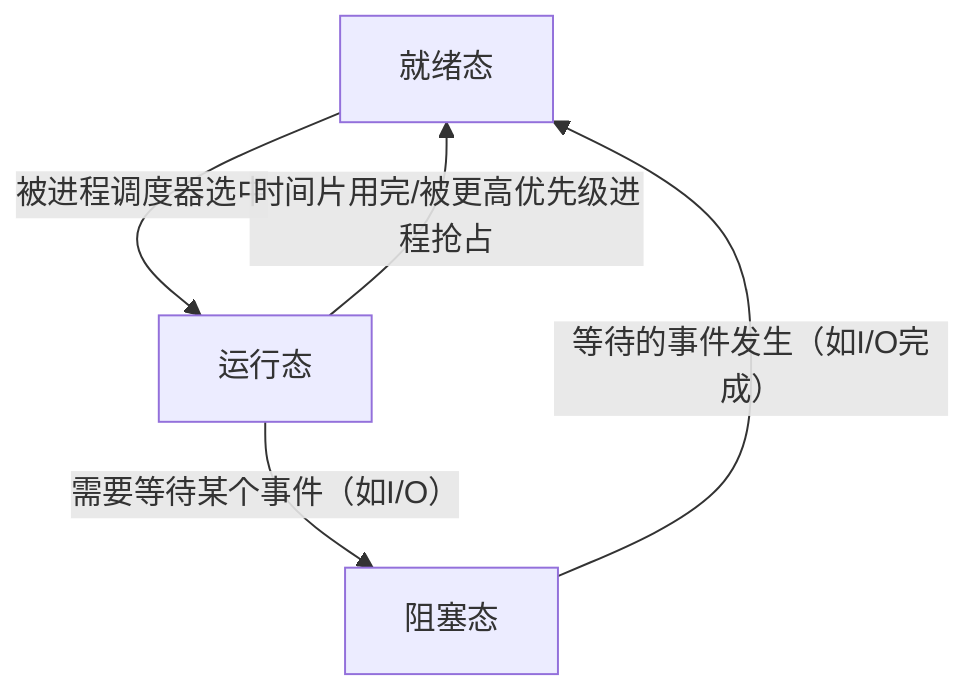

hello, Dear Sophie, I Love You. I some time I very miss you. 


```java 
public class Student  {

    String name; 
    int age; 

    public Student (String name, int age ) {
        this.name = name; 
        this.age = age; 
    }

    System.out.println("Hello\n");
} 
```


## java 构造函数(Constructor)

好的，我们来详细、通俗地讲解一下 Java 中的构造函数。

### 1. 什么是构造函数？

你可以把构造函数想象成一个对象的“出生仪式”。当你使用 `new` 关键字创建一个对象时，Java 会自动调用一个特殊的方法来对这个新对象进行初始化（比如设置初始状态、分配资源等），这个方法就是**构造函数**。

### 2. 构造函数的核心特点

1.  **名字必须与类名完全相同**。
2.  **没有返回类型**，连 `void` 也不能写。这和普通方法有本质区别。
3.  **主要作用**：初始化对象（给对象的成员变量赋初始值）。
4.  **调用时机**：在创建对象时，由 `new` 关键字自动调用。我们无法像普通方法那样直接调用构造函数。
5.  **如果一个类没有显式定义任何构造函数**，Java 编译器会自动为你提供一个**无参构造函数**（也叫默认构造函数）。这个默认构造函数什么都不做。
6.  **一旦你显式定义了一个构造函数（无论有参无参）**，Java 就不再提供默认的无参构造函数。这时如果你还需要无参构造函数，必须自己手动写出来。

---

### 3. 构造函数的类型与示例

#### 示例1：无参构造函数（默认构造函数）

这是最简单的构造函数，不接受任何参数。

```java
public class Student {
    // 成员变量
    String name;
    int age;

    // 1. 无参构造函数（如果我们不写，Java也会默认提供这样一个）
    public Student() {
        System.out.println("一个Student对象被创建了！");
        // 可以在里面设置一些默认值
        this.name = "未知";
        this.age = 0;
    }

    // 普通方法
    public void introduce() {
        System.out.println("你好，我叫" + name + "，今年" + age + "岁。");
    }

    public static void main(String[] args) {
        // 使用 new 关键字调用构造函数 Student()
        Student stu1 = new Student();
        stu1.introduce(); // 输出：你好，我叫未知，今年0岁。
    }
}
```

**运行结果：**
```
一个Student对象被创建了！
你好，我叫未知，今年0岁。
```

#### 示例2：带参构造函数

更常用的情况是，我们在创建对象时就希望给它赋予特定的属性值。

```java
public class Student {
    String name;
    int age;

    // 2. 带参构造函数
    public Student(String studentName, int studentAge) {
        System.out.println("一个带信息的Student对象被创建了！");
        // 使用传入的参数为成员变量赋值
        this.name = studentName; // this.name 指当前对象的name成员变量
        this.age = studentAge;   // studentAge 是传入的参数
    }

    public void introduce() {
        System.out.println("你好，我叫" + name + "，今年" + age + "岁。");
    }

    public static void main(String[] args) {
        // 创建对象时，必须传入与构造函数参数列表匹配的值
        Student stu2 = new Student("张三", 20);
        stu2.introduce(); // 输出：你好，我叫张三，今年20岁。

        // 如果没有无参构造函数，下面这行代码会报错！
        // Student stu3 = new Student(); // 编译错误！
    }
}
```

**运行结果：**
```
一个带信息的Student对象被创建了！
你好，我叫张三，今年20岁。
```

#### 示例3：构造函数重载

一个类可以有多个构造函数，只要它们的**参数列表不同**（参数类型、数量或顺序不同）。这称为**构造函数重载**。它提供了多种初始化对象的灵活方式。

```java
public class Student {
    String name;
    int age;
    String major;

    // 构造函数1：无参构造
    public Student() {
        this.name = "未知";
        this.age = 0;
        this.major = "未定";
    }

    // 构造函数2：只接收名字和年龄
    public Student(String name, int age) {
        this.name = name;
        this.age = age;
        this.major = "未定"; // 为major设置一个默认值
    }

    // 构造函数3：接收所有信息
    public Student(String name, int age, String major) {
        this.name = name;
        this.age = age;
        this.major = major;
    }

    public void introduce() {
        System.out.println("你好，我叫" + name + "，今年" + age + "岁，专业是：" + major);
    }

    public static void main(String[] args) {
        Student stu1 = new Student(); // 调用无参构造
        Student stu2 = new Student("李四", 21); // 调用两个参数的构造
        Student stu3 = new Student("王五", 22, "计算机科学"); // 调用三个参数的构造

        stu1.introduce(); // 输出：你好，我叫未知，今年0岁，专业是：未定
        stu2.introduce(); // 输出：你好，我叫李四，今年21岁，专业是：未定
        stu3.introduce(); // 输出：你好，我叫王五，今年22岁，专业是：计算机科学
    }
}
```

---

### 4. 关键字 `this` 在构造函数中的使用

*   `this.变量名`：用于区分同名的成员变量和局部变量（如参数）。
*   `this(...)`：**在构造函数内部调用本类的其他构造函数**。**必须放在构造函数的第一行**。

```java
// 用 this(...) 优化上面的例子
public class Student {
    String name;
    int age;
    String major;

    public Student() {
        this("未知", 0, "未定"); // 调用下面的三参构造函数
    }

    public Student(String name, int age) {
        this(name, age, "未定"); // 调用下面的三参构造函数
    }

    public Student(String name, int age, String major) {
        this.name = name;
        this.age = age;
        this.major = major;
    }
    // ... 其他代码
}
```
这样做的好处是避免了重复的初始化代码，逻辑更清晰。

---

### 练习题

1.  **选择题**：关于构造函数，以下说法正确的是？（多选）
    A. 构造函数的名称必须与类名相同。
    B. 构造函数可以有返回值，但必须是 `void` 类型。
    C. 构造函数的主要作用是为对象分配内存。
    D. 如果一个类没有定义任何构造函数，编译器会自动生成一个无参构造函数。
    E. 构造函数可以被子类继承。

    <details>
    <summary>点击查看答案与解析</summary>
    <p><strong>答案：A, D</strong></p>
    <p><strong>解析：</strong></p>
    <ul>
        <li><strong>A 正确</strong>，这是构造函数的定义规则。</li>
        <li><strong>B 错误</strong>，构造函数没有任何返回类型，包括 <code>void</code>。</li>
        <li><strong>C 错误</strong>，为对象分配内存是 <code>new</code> 关键字的工作，构造函数的作用是初始化（给分配好的内存赋初值）。</li>
        <li><strong>D 正确</strong>，这是 Java 的默认行为。</li>
        <li><strong>E 错误</strong>，构造函数不能被继承。子类构造函数会通过 <code>super()</code> 调用父类构造函数，但不是继承。</li>
    </ul>
    </details>

2.  **编程题**：请编写一个 `Book` 类。
    *   属性：`title` (书名，String), `author` (作者，String), `price` (价格，double)。
    *   为该类编写三个构造函数：
        1.  无参构造函数，将书名和作者初始化为"未知"，价格初始化为0.0。
        2.  接收书名和作者的构造函数，价格默认为50.0。
        3.  接收所有属性的构造函数。
    *   编写一个 `main` 方法，分别使用这三个构造函数创建三个 `Book` 对象，并打印它们的信息。

    <details>
    <summary>点击查看参考代码</summary>

    ```java
    public class Book {
        String title;
        String author;
        double price;

        // 无参构造
        public Book() {
            this("未知", "未知", 0.0);
        }

        // 接收书名和作者的构造
        public Book(String title, String author) {
            this(title, author, 50.0);
        }

        // 全参构造
        public Book(String title, String author, double price) {
            this.title = title;
            this.author = author;
            this.price = price;
        }

        public void printInfo() {
            System.out.println("书名：《" + title + "》， 作者：" + author + "， 价格：" + price + "元");
        }

        public static void main(String[] args) {
            Book book1 = new Book();
            Book book2 = new Book("Java编程思想", "Bruce Eckel");
            Book book3 = new Book("Effective Java", "Joshua Bloch", 89.9);

            book1.printInfo(); // 书名：《未知》， 作者：未知， 价格：0.0元
            book2.printInfo(); // 书名：《Java编程思想》， 作者：Bruce Eckel， 价格：50.0元
            book3.printInfo(); // 书名：《Effective Java》， 作者：Joshua Bloch， 价格：89.9元
        }
    }
    ```
    </details>

希望这个详细的解释和示例能帮助你彻底理解 Java 构造函数！


## 操作系统 线程

好的，我们来系统地讲解一下操作系统中的“线程”这个概念。我会用通俗易懂的语言、比喻和代码示例来帮助你理解。

### 1. 什么是线程？

**核心定义：** 线程是**进程**中的一个执行单元，是CPU调度和分派的基本单位。

**通俗比喻：**
想象一个进程是一个**工厂**，而线程就是工厂里的**工人**。
*   **工厂（进程）**：拥有独立的资源，比如土地、原材料仓库、资金等。它是一个独立的单位。
*   **工人（线程）**：在工厂里工作，共享工厂的资源（共用同一个仓库），但他们可以**同时**做不同的工作，比如一个工人负责生产，另一个工人负责打包。

一个进程至少有一个线程（主线程），但可以创建多个线程，让它们“齐头并进”地完成任务。

---

### 2. 为什么需要线程？（线程的优点）

与传统的“单线程进程”相比，多线程带来了巨大的优势：

1.  **响应性高**：
    *   **例子**：在一个图形界面程序（如Word）中，主线程负责响应用户的点击、打字等操作。如果你需要执行一个耗时的任务（比如保存一个超大文件或拼写检查），如果只用单线程，整个界面就会“卡住”，直到任务完成。如果创建一个新线程来执行耗时任务，主线程就能继续保持界面的流畅响应。

2.  **资源共享**：
    *   线程默认共享其所属进程的内存空间和资源（如代码段、数据段、打开的文件等）。创建和切换线程比创建进程要快得多、开销小得多，因为不需要分配新的独立内存空间。

3.  **经济高效**：
    *   创建和销毁线程的代价远低于进程。线程的上下文切换（从一个线程切换到另一个线程）也比进程切换更快。

4.  **充分利用多核处理器**：
    *   在现代多核CPU上，多个线程可以真正地**并行**运行在不同的核心上，极大地提高了计算密集型任务的执行速度。例如，一个视频渲染软件可以用多个线程同时处理视频的不同部分。

---

### 3. 线程 vs. 进程

这是一个非常核心的对比，帮助你理解它们的区别。

| 特性 | 进程 | 线程 |
| :--- | :--- | :--- |
| **基本单位** | **资源分配**的基本单位 | **CPU调度和执行**的基本单位 |
| **资源开销** | 大（独立内存空间、文件描述符表等） | 小（共享进程资源） |
| **通信方式** | 复杂（需要IPC，如管道、消息队列、共享内存） | 简单（可直接读写共享的全局变量、内存） |
| **独立性** | 独立，一个进程崩溃不会影响其他进程 | 依赖，一个线程崩溃可能导致整个进程崩溃 |
| **切换代价** | 高（需要切换整个内存地址空间） | 低（只需切换少量寄存器、栈等私有数据） |

**简单总结：进程是“资源”的容器，线程是“计算”的载体。**

---

### 4. 线程的实现方式

操作系统主要通过两种方式实现线程：

1.  **用户级线程**：
    *   线程的管理（创建、调度、同步）完全在**用户空间**的程序库（如Pthreads库）中完成，内核意识不到这些线程的存在。
    *   **优点**：极快，切换不需要陷入内核态。
    *   **缺点**：如果一个线程发起系统调用（如I/O操作）而被阻塞，整个进程（包括所有其他用户级线程）都会被阻塞。**无法利用多核CPU**，因为内核只把整个进程当作一个调度单位。

2.  **内核级线程**：
    *   线程的管理由**操作系统内核**直接负责。内核为每个线程维护线程控制块。
    *   **优点**：一个线程阻塞，不会影响同进程内的其他线程。**能利用多核CPU**实现真正的并行。
    *   **缺点**：线程切换需要陷入内核态，速度比用户级线程慢。

现代操作系统（如Windows, Linux）通常使用**内核级线程**或两者的混合模型，以平衡性能和功能。

---

### 5. 一个简单的代码示例（Java）

Java内置了强大的多线程支持。下面是一个简单的例子，展示一个主线程和一个工作线程同时运行。

```java
public class SimpleThreadExample {
    public static void main(String[] args) {
        // 主线程开始执行

        // 1. 创建一个新线程（工人）
        Thread workerThread = new Thread(new Runnable() {
            @Override
            public void run() {
                // 这是新线程要执行的任务
                for (int i = 0; i < 5; i++) {
                    System.out.println("工作线程正在运行: " + i);
                    try {
                        Thread.sleep(1000); // 休眠1秒，模拟耗时操作
                    } catch (InterruptedException e) {
                        e.printStackTrace();
                    }
                }
            }
        });

        // 2. 启动新线程
        workerThread.start();

        // 3. 主线程继续执行自己的任务（老板也在干活）
        for (int i = 0; i < 3; i++) {
            System.out.println("主线程正在运行: " + i);
            try {
                Thread.sleep(500); // 休眠0.5秒
            } catch (InterruptedException e) {
                e.printStackTrace();
            }
        }

        System.out.println("主线程任务完成，等待工作线程...");
        // 主线程可以等待工作线程结束
        try {
            workerThread.join();
        } catch (InterruptedException e) {
            e.printStackTrace();
        }

        System.out.println("所有任务都完成了！");
    }
}
```

**可能的输出（顺序可能每次运行都不同，体现了并发性）：**
```
主线程正在运行: 0
工作线程正在运行: 0
主线程正在运行: 1
工作线程正在运行: 1
主线程正在运行: 2
主线程任务完成，等待工作线程...
工作线程正在运行: 2
工作线程正在运行: 3
工作线程正在运行: 4
所有任务都完成了！
```

---

### 6. 线程的挑战（需要特别注意！）

多线程编程虽然强大，但也带来了复杂性：

*   **竞态条件**：当多个线程同时访问和修改共享数据时，最终结果取决于线程执行的精确时序，可能导致不确定的错误结果。
*   **死锁**：两个或多个线程互相等待对方释放资源，导致所有线程都无法继续执行。
*   **活锁**：线程不断响应其他线程的动作而无法继续自己的工作。

为了解决这些问题，程序员需要使用**同步机制**，如**互斥锁、信号量、条件变量**等，来协调线程间的执行顺序和对共享资源的访问。

### 总结

*   **线程**是轻量级的进程，是程序执行流的最小单元。
*   它共享进程资源，使得创建、通信和切换都非常高效。
*   多线程能显著提高程序的响应速度、资源利用率和多核性能。
*   但多线程编程需要谨慎处理同步问题，以避免竞态条件和死锁。

希望这个解释能帮助你透彻地理解线程！


## 操作系统 进程

好的，我们来系统地讲解一下操作系统中的核心概念——**进程**。

我会用通俗易懂的语言、生动的比喻和具体的例子来帮助你理解。

---

### 1. 什么是进程？

想象一下，你正在用电脑做作业：
*   你打开了一个Word文档写论文。
*   同时，你开着浏览器查资料。
*   后台还播放着音乐。

这里的 **Word程序、浏览器程序、音乐播放器程序**，每一个在运行时，都不仅仅是一段静态的代码。它们需要占用内存来存放你写的文字、网页内容、歌曲数据，需要CPU时间来执行运算，需要操作文件（保存、打开）等等。

**进程** 就是这样一个 **“正在执行的程序”** 的实例。它是操作系统进行资源分配和调度的基本单位。

**简单比喻：**
*   **程序** 就像一张**菜谱**（例如“西红柿炒鸡蛋的做法”）。它是指令的集合，是静态的。
*   **进程** 就像你**按照菜谱实际下厨炒菜的过程**。这个过程需要占用厨房（CPU）、厨具（I/O设备）、食材（内存数据），是一个动态的、有生命周期的活动。

一个程序（如`chrome.exe`）可以同时启动多个进程（如打开多个Chrome标签页，每个可能是一个独立的进程）。

---

### 2. 进程的组成（进程实体）

一个进程不仅仅是代码，它主要由三部分组成，合称为**进程映像**或**进程实体**：

1.  **程序段**：就是可执行的代码本身，即“菜谱”的步骤。
2.  **数据段**：进程运行过程中需要的数据，比如变量、工作区等。就像你炒菜时切好的西红柿和打好的鸡蛋。
3.  **进程控制块（PCB - Process Control Block）**：**这是进程的灵魂！**
    *   PCB是操作系统为了管理进程而专门设置的一个数据结构。
    *   它就像是这个进程的 **“身份证”** 或 **“病历卡”** ，记录了进程所有的关键信息。
    *   当进程被切换时，CPU现场信息（如寄存器值）就保存在PCB中，以便下次能接着执行。

**PCB中主要包含的信息：**
*   **进程标识符（PID）**：唯一的身份证号码。
*   **进程状态**：是正在运行、准备就绪，还是在等待（阻塞）？
*   **程序计数器（PC）**：下一条要执行的指令的地址。
*   **CPU寄存器**：通用寄存器、栈指针等。
*   **内存管理信息**：如基地址、界限地址（指向程序段和数据段在内存中的位置）。
*   **I/O状态信息**：进程所占用的I/O设备列表、打开的文件列表等。
*   **CPU调度信息**：进程的优先级、调度队列指针等。

**所以，创建进程，实质上是创建了进程的PCB；撤销进程，就是撤销其PCB。**

---

### 3. 进程的状态与切换

一个进程在其生命周期中会经历几种状态。最常见的三状态模型是：

1.  **就绪态**：进程已分配到除CPU以外的所有必要资源，只要获得CPU，就能立即执行。就像运动员在起跑线准备就绪，只等发令枪响。系统中通常有多个进程处于就绪态，它们排成一个“就绪队列”。
2.  **运行态**：进程正在CPU上执行。在单核CPU中，任何时刻最多只有一个进程处于运行态。
3.  **阻塞态（等待态）**：进程正在等待某个事件的发生（如等待I/O操作完成、等待某个信号），即使给它CPU，它也无法执行。就像运动员在比赛中受伤，需要等待医护人员，此时他无法比赛。处于阻塞态的进程会排在“阻塞队列”。

**状态之间的转换：**



*   **就绪 -> 运行**：进程调度程序从就绪队列中选中一个进程，分配CPU给它。
*   **运行 -> 就绪**：最常见的原因是**时间片用完**。CPU时间被分成了小片段，一个进程运行一个时间片后，如果还没结束，会被强制放回就绪队列，等待下一轮。这叫“抢占”。
*   **运行 -> 阻塞**：进程主动请求某个服务，而这个服务不能立即完成（如读取磁盘文件），它就会自我放弃CPU，进入阻塞态。
*   **阻塞 -> 就绪**：当进程等待的事件发生后（如磁盘数据读取完毕），操作系统会把它从阻塞队列移回就绪队列，重新获得被调度的资格。

---

### 4. 进程为什么重要？（进程管理的目的）

操作系统引入进程的概念，主要是为了实现：

1.  **并发性**：让多个程序“看起来”同时运行。通过在不同进程间快速切换CPU，极大地提高了CPU利用率和系统吞吐量。你感觉音乐在播、网页在加载、鼠标还能动，这就是并发。
2.  **独立性**：每个进程都拥有独立的地址空间（内存空间），一个进程崩溃通常不会影响其他进程。这提供了稳定性。
3.  **资源共享**：操作系统管理着CPU、内存、硬盘等资源，并以进程为单位进行分配，避免了混乱。

---

### 练习题/思考题

1.  **判断题**：一个程序一定对应一个进程。（ 错 ）
    *   *解析：一个程序可以对应多个进程（如多个浏览器窗口），一个进程也可以执行多个程序（如通过`exec`系统调用）。*

2.  **选择题**：进程从运行状态进入就绪状态的原因可能是（ C ）。
    *   A. 等待某一事件
    *   B. 被调度程序选中
    *   C. 时间片用完
    *   D. 等待的事件已发生
    *   *解析：A导致进入阻塞态，B导致从就绪态进入运行态，D导致从阻塞态进入就绪态。*

3.  **简答题**：请描述进程控制块（PCB）的作用。
    *   *参考答案：PCB是进程存在的唯一标志。它记录了进程的描述信息和控制信息，使得操作系统能够感知和管理进程。当进程切换时，PCB用于保存和恢复现场，保证进程能断续运行。*

4.  **场景题**：你双击打开了Word软件。请描述一下从双击到Word窗口出现，操作系统在进程管理方面大致做了哪些事？
    *   *参考答案：*
        1.  **创建进程**：操作系统为Word程序创建一个新的进程。
        2.  **分配资源**：为该进程分配内存空间，加载Word的代码和数据。
        3.  **创建PCB**：初始化该进程的PCB，设置初始状态为“就绪”。
        4.  **加入队列**：将新进程的PCB放入就绪队列。
        5.  **调度执行**：进程调度器在某个时刻选中该进程，使其进入“运行”态，开始执行Word的初始化代码。
        6.  **显示界面**：进程执行过程中，可能会因为需要加载资源而进入“阻塞”态，加载完成后再回到“就绪”态，直至窗口完全显示。

希望这个解释能帮助你彻底理解进程！这是理解操作系统如何工作的基石。下一步你可以继续学习**线程**，它是比进程更轻量级的执行单元。


## 操作系统 总线

好的，我们来用通俗易懂的方式，系统地讲解一下操作系统中的“总线”。

### 一、 核心比喻：城市的交通系统

想象一下，你的电脑是一个繁忙的大都市（比如北京或上海）。

*   **CPU（中央处理器）**：是城市的**市政府和指挥中心**，负责思考和下达命令。
*   **内存（RAM）**：是市中心的**核心商务区**，所有正在进行的项目和临时数据都存放在这里，方便指挥中心快速调用。
*   **硬盘（HDD/SSD）**：是城市边缘的**大型仓库/档案馆**，所有长期不用的数据和程序都存放在这里。
*   **显卡、网卡、声卡等**：是城市里的**各个功能部门**，如图像处理局、通信局、文化局等。

现在问题来了：指挥中心（CPU）如何与商务区（内存）、各个部门（显卡、网卡）以及仓库（硬盘）快速、高效地交换信息和物资（数据）呢？

答案就是：**修建道路**。

**总线（Bus）**，就是连接电脑内部所有核心部件的**高速公路系统**。所有的数据、指令和电力都通过这套“公路网”进行传输。

---

### 二、 总线的定义与作用

**定义**：总线是一组**公共的通信导线**，是计算机各种功能部件（CPU、内存、I/O设备等）之间传送信息的公共通道。

**核心作用**：**共享和分时**。
想象一下，如果CPU到内存、CPU到硬盘、显卡到内存都各自修一条专属的直连公路，那电脑主板会变得无比复杂、昂贵且庞大。总线解决了这个问题，它就像一条主干道，大家**分时段**共用这条道路。

*   **共享**：所有设备都连接到这组公共线路上。
*   **分时**：在某一时刻，只允许一对设备（例如CPU和内存）进行通信，避免“交通拥堵”和数据冲突。

---

### 三、 总线的分类（像高速公路的不同车道）

为了更高效，这条“高速公路”被分成了不同功能的“车道”：

1.  **数据总线**
    *   **功能**：负责在部件间**传输实际的数据**。比如CPU从内存读取一个数字，或者向显卡发送一幅图像的数据。
    *   **特点**：数据总线的**宽度（位数）** 非常重要，它好比是车道的数量。64位总线就像一条64车道的高速公路，一次可以并行传输64位（8字节）的数据，比32位（4车道）快一倍。这直接影响了计算机的性能。

2.  **地址总线**
    *   **功能**：负责**指定数据在内存中的“地址”**。当CPU需要读取内存中某个位置的数据时，它先通过地址总线发出“我要XXX号地址的数据”这个指令。
    *   **特点**：地址总线的**宽度**决定了CPU的**寻址能力**，即能管理多大的内存。例如，32位地址总线可以寻址 2³² = 4GB 的内存。这就是为什么老的32位操作系统最大只支持4GB内存的原因。

3.  **控制总线**
    *   **功能**：负责传输**控制信号**，协调各个部件的工作。比如“读信号”（通知内存准备发送数据）、“写信号”（通知内存准备接收数据）、“中断信号”（通知CPU有紧急任务需要处理）等。
    *   **特点**：控制总线是双向的，且由多种不同的控制线组成，像一个复杂的交通信号灯和指挥系统。

**简单总结三者的关系**：
CPU要通过总线读取内存数据时，它：
1.  通过**控制总线**发出一个“读”命令。
2.  通过**地址总线**发出要读取的内存地址（比如“第1000号地址”）。
3.  内存收到命令和地址后，通过**数据总线**将该地址的数据发送给CPU。

---

### 四、 总线与操作系统的关系

操作系统是这座城市的“交通管理局”。它并不直接修建道路（总线是硬件），但它负责**管理和调度**交通，确保数据高效、安全地传输。

1.  **设备驱动与抽象**：
    *   不同的硬件（如不同品牌的显卡）可能使用不同的总线标准或通信协议。操作系统通过**设备驱动程序**来“理解”这些硬件的语言，并对上层应用程序提供一个统一的接口。应用程序只需说“显示一张图片”，操作系统和驱动程序会负责通过总线与显卡完成具体的通信。

2.  **资源分配与仲裁**：
    *   当多个设备（如硬盘和网卡）同时想要使用总线时，会发生“冲突”。操作系统中包含的**总线控制器或仲裁机制**会决定谁先谁后，确保公平和效率，防止系统死锁。

3.  **内存管理**：
    *   操作系统通过地址总线来管理虚拟内存和物理内存的映射关系，为每个程序分配独立的内存空间，避免它们互相干扰。

4.  **即插即用**：
    *   当你插入一个U盘（USB设备）时，操作系统会通过总线检测到新硬件，自动加载合适的驱动程序，并为其分配系统资源（如中断号、I/O地址），这就是即插即用功能，背后离不开总线的支持。

---

### 五、 常见的总线标准举例

*   **系统总线**：连接CPU、内存和北桥芯片（如果存在）的高速总线。
*   **PCI Express总线**：现在主流的显卡、声卡、网卡等扩展卡使用的总线。它采用点对点的串行传输，速度极快，取代了老式的PCI总线。
*   **SATA总线**：专门用于连接硬盘、光驱等存储设备。
*   **USB总线**：通用串行总线，用于连接各种外部设备，如键盘、鼠标、U盘、打印机等，特点是支持热插拔。

### 练习题

1.  **选择题**：计算机中，负责传输数据本身的总线是（ ）。
    A. 地址总线
    B. 数据总线
    C. 控制总线
    D. USB总线

2.  **简答题**：为什么说总线结构是计算机系统的一个重要创新？（请用共享和分时的概念来解释）

3.  **情景题**：当你在电脑上播放一个视频文件时，请描述一下数据大致是如何通过总线在硬盘、内存、CPU和显卡之间流动的。

---
**答案**：
1.  B
2.  总线结构通过“共享”一组公共线路，避免了每个设备之间都建立专用线路，极大地简化了系统结构，降低了成本。通过“分时”复用，在统一调度下有序工作，保证了系统的效率和可靠性。
3.  流程简述：
    *   操作系统通过SATA总线从**硬盘**读取视频文件数据到**内存**。
    *   **CPU** 通过系统总线从**内存**获取视频数据，进行解码运算。
    *   解码后的视频帧数据通过系统总线（或直接通过PCIe总线）发送到**显卡**的显存中。
    *   **显卡** 将最终画面输出到显示器。

希望这个解释能帮助你透彻地理解“总线”这个概念！


## java 抽象类
好的，我们来详细、通俗地讲解一下 Java 中的抽象类。

### 1. 什么是抽象类？

想象一下，你要设计一个“图形”类。你知道世界上有“圆形”、“矩形”、“三角形”这些具体的图形，它们都有“计算面积”和“计算周长”的功能。

但是，**“图形”本身是一个抽象的概念**。你无法计算一个叫“图形”的东西的面积，因为它的形状不确定。只有具体的图形（如圆形）才能有具体的面积计算公式。

在 Java 中，**抽象类** 就是用来描述这种抽象概念的类。它定义了子类应该具备的通用属性和方法（比如“计算面积”这个方法名），但**不提供某些方法的具体实现**（比如“计算面积”的具体公式）。

**核心定义：** 使用 `abstract` 关键字修饰的类就是抽象类。

```java
// 声明一个抽象类
public abstract class Shape {
    // 类的其他部分...
}
```

---

### 2. 抽象类的核心特点

#### 特点 1：可以包含抽象方法

抽象方法是一种**只有方法声明，没有方法体（没有 `{}` ）** 的方法。它使用 `abstract` 关键字修饰，并以分号 `;` 结尾。

**作用：** 强制要求任何继承该抽象类的非抽象子类**必须实现（重写）** 这个抽象方法。

```java
public abstract class Shape {
    // 抽象方法：计算面积（没有方法体）
    public abstract double calculateArea();

    // 抽象方法：计算周长（没有方法体）
    public abstract double calculatePerimeter();
}
```
在上面的例子中，`Shape` 类说：“所有图形都必须有计算面积和周长的功能，但具体怎么算，我不管，由你们具体的图形自己决定。”

#### 特点 2：不能直接实例化

这是最关键的一点。**你不能使用 `new` 关键字来创建一个抽象类的对象。**

```java
public class Main {
    public static void main(String[] args) {
        // 这行代码会报错！编译无法通过。
        // Shape myShape = new Shape(); // 错误: Shape是抽象的; 无法实例化
    }
}
```
**为什么？** 因为抽象类可能包含没有具体实现的抽象方法。如果允许创建对象，那么调用这个抽象方法时，程序就不知道要执行什么代码，这是不合理的。

**正确用法：** 抽象类是用来被继承的。你需要创建一个非抽象的子类来继承它，并实现所有抽象方法，然后创建子类的对象。

```java
// 子类 Circle 继承抽象类 Shape
public class Circle extends Shape {
    private double radius;

    public Circle(double radius) {
        this.radius = radius;
    }

    // 必须实现（重写）抽象方法 calculateArea
    @Override
    public double calculateArea() {
        return Math.PI * radius * radius; // 圆的面积公式
    }

    // 必须实现（重写）抽象方法 calculatePerimeter
    @Override
    public double calculatePerimeter() {
        return 2 * Math.PI * radius; // 圆的周长公式
    }
}

// 现在可以使用了
public class Main {
    public static void main(String[] args) {
        // 创建子类 Circle 的对象
        Circle myCircle = new Circle(5.0);
        System.out.println("面积: " + myCircle.calculateArea());
        System.out.println("周长: " + myCircle.calculatePerimeter());

        // 也可以用父类（Shape）类型的引用来指向子类对象（多态的体现）
        Shape shape = new Circle(3.0);
        System.out.println("面积: " + shape.calculateArea()); // 实际调用的是 Circle 的方法
    }
}
```

#### 特点 3：抽象类可以包含普通类的一切

抽象类并不是只能有抽象方法。它可以和普通类一样，拥有：

*   **普通成员变量**
*   **构造方法**（虽然自己不能直接实例化，但子类的构造方法可以通过 `super()` 调用父类的构造方法）
*   **普通的具体方法**（有方法体）
*   **静态方法和静态变量**
*   **final 方法**

```java
public abstract class Animal {
    // 普通成员变量
    private String name;

    // 构造方法
    public Animal(String name) {
        this.name = name;
    }

    // 具体方法（有方法体）
    public void eat() {
        System.out.println(name + " 正在吃东西。");
    }

    // 抽象方法
    public abstract void makeSound();

    // Getter
    public String getName() {
        return name;
    }
}

public class Dog extends Animal {
    public Dog(String name) {
        super(name); // 调用父类的构造方法
    }

    @Override
    public void makeSound() {
        System.out.println(getName() + " 汪汪叫！");
    }
}
```

---

### 3. 为什么要使用抽象类？（优点）

1.  **代码复用：** 将多个子类共有的属性和行为（如 `name`, `eat()` 方法）放到抽象类中，避免代码重复。
2.  **制定规范/契约：** 通过抽象方法，强制规定子类必须实现哪些功能，保证了子类的一致性。它定义了一个“模板”或“蓝图”。
3.  **实现多态：** 你可以使用抽象父类（如 `Shape`, `Animal`）的类型来引用不同的子类对象，使代码更灵活、更易于扩展。

---

### 4. 抽象类 vs. 接口

这是一个常见的面试题。它们很相似，但有重要区别：

| 特性 | 抽象类 (Abstract Class) | 接口 (Interface) (Java 8+) |
| :--- | :--- | :--- |
| **方法** | 可以包含抽象方法和具体方法 | Java 8 前只能是抽象方法；之后可以有 `default` 和 `static` 方法 |
| **成员变量** | 可以是各种类型的变量 | 只能是 `public static final` 常量（默认省略） |
| **继承** | 一个类只能**继承一个**抽象类（单继承） | 一个类可以**实现多个**接口（多继承） |
| **构造方法** | **有**构造方法 | **没有**构造方法 |
| **设计理念** | **“是什么” (IS-A)**，表示一种本质的、通用的分类。如：Dog **is an** Animal. | **“能做什么” (CAN-DO)**，表示一种能力或契约。如：Plane **can** Fly. |

**简单选择原则：**
*   如果你需要定义一些类的**基本模板**，并且这些类之间有很强的“是一种（IS-A）”关系，用**抽象类**。
*   如果你只是想定义一组**行为规范**，让毫不相干的类都能拥有这些行为，用**接口**。

现代设计中，接口因其灵活性而更受青睐，但抽象类在构建类层次结构时依然非常重要。

---

### 练习题

1.  **判断题：** 抽象类可以有构造方法。（ ）
2.  **判断题：** 我们可以创建抽象类的实例。（ ）
3.  **编码题：** 创建一个抽象类 `Employee`（员工），它有一个抽象方法 `calculateSalary()`（计算薪水）。然后创建两个子类 `FullTimeEmployee`（全职员工）和 `PartTimeEmployee`（兼职员工），分别实现计算薪水的方法（全职月薪固定，兼职按小时计算）。

---

**答案：**
1.  对。抽象类可以有构造方法，供子类调用。
2.  错。抽象类不能直接实例化。
3.  编码题示例：

```java
// 抽象类
abstract class Employee {
    private String name;

    public Employee(String name) {
        this.name = name;
    }

    public String getName() {
        return name;
    }

    // 抽象方法
    public abstract double calculateSalary();
}

// 全职员工子类
class FullTimeEmployee extends Employee {
    private double monthlySalary;

    public FullTimeEmployee(String name, double monthlySalary) {
        super(name);
        this.monthlySalary = monthlySalary;
    }

    @Override
    public double calculateSalary() {
        return monthlySalary;
    }
}

// 兼职员工子类
class PartTimeEmployee extends Employee {
    private double hourlyRate;
    private int hoursWorked;

    public PartTimeEmployee(String name, double hourlyRate, int hoursWorked) {
        super(name);
        this.hourlyRate = hourlyRate;
        this.hoursWorked = hoursWorked;
    }

    @Override
    public double calculateSalary() {
        return hourlyRate * hoursWorked;
    }
}

// 测试类
public class TestCompany {
    public static void main(String[] args) {
        Employee emp1 = new FullTimeEmployee("张三", 10000);
        Employee emp2 = new PartTimeEmployee("李四", 50, 80);

        System.out.println(emp1.getName() + " 的薪水是: " + emp1.calculateSalary());
        System.out.println(emp2.getName() + " 的薪水是: " + emp2.calculateSalary());
    }
}
```

希望这个解释能帮助你彻底理解 Java 抽象类！


## java 接口
好的，我们来通俗易懂地讲解一下 Java 中的接口。

### 1. 什么是接口？

你可以把 **接口** 想象成一个 **完全抽象的“合同”或“能力清单”**。

*   **合同性质**： 一个接口规定了一组方法（即“合同条款”）。任何类如果“签署”了这份合同（即实现了这个接口），就必须提供合同中所有方法的具体实现。
*   **完全抽象**： 在 Java 8 之前，接口中的方法都是抽象的（只有方法名、参数和返回类型，没有方法体）。它只定义“做什么”，不关心“怎么做”。
*   **关键字**： 使用 `interface` 关键字来声明。

### 2. 接口的核心特点

1.  **方法默认是抽象的**： 接口中声明的方法默认是 `public abstract` 的（即使你不写这些关键字，编译器也会自动加上）。
2.  **变量默认是常量**： 接口中声明的变量默认是 `public static final` 的（即公共的、静态的常量）。
3.  **不能实例化**： 你不能用 `new` 关键字来创建一个接口的对象，因为它没有具体的实现。
4.  **类“实现”接口**： 一个类使用 `implements` 关键字来实现一个或多个接口，并必须为接口中的所有抽象方法提供具体实现。

### 3. 为什么要用接口？（接口的作用）

接口的核心目的是实现 **多态** 和 **解耦**，从而让程序更灵活、更易扩展。

*   **定义行为规范**： 让不相关的类能够拥有相同的行为。例如，`Flyable`（可飞的）接口可以被`Bird`（鸟）、`Airplane`（飞机）、`Superman`（超人）这些完全不同的类实现。
*   **实现多态**： “一个接口，多种实现”。程序可以面向接口编程，而不是面向具体的类，从而降低代码的依赖。
*   **突破单继承限制**： Java 中一个类只能继承一个父类，但可以实现多个接口。这使得类可以具备多种不同的能力。

---

### 4. 举例说明

#### 例子1：基础用法 - “可飞”的能力

```java
// 1. 定义一个接口 Flyable
interface Flyable {
    // 抽象方法：飞行
    void fly();
    // 常量：最大高度
    int MAX_HEIGHT = 10000; // 等同于 public static final int MAX_HEIGHT = 10000;
}

// 2. 鸟类实现 Flyable 接口
class Bird implements Flyable {
    // 必须实现 fly() 方法
    @Override
    public void fly() {
        System.out.println("鸟儿用翅膀飞行。");
    }
}

// 3. 飞机类也实现 Flyable 接口
class Airplane implements Flyable {
    // 必须实现 fly() 方法，但实现方式不同
    @Override
    public void fly() {
        System.out.println("飞机用引擎飞行。");
    }
}

// 4. 测试类
public class Test {
    public static void main(String[] args) {
        // 多态的体现：用接口类型引用具体对象
        Flyable bird = new Bird();
        Flyable airplane = new Airplane();

        // 调用同一个 fly() 方法，但表现出不同的行为
        bird.fly();      // 输出：鸟儿用翅膀飞行。
        airplane.fly();  // 输出：飞机用引擎飞行。

        // 访问接口中的常量
        System.out.println("最大飞行高度：" + Flyable.MAX_HEIGHT);
    }
}
```

**输出结果：**
```
鸟儿用翅膀飞行。
飞机用引擎飞行。
最大飞行高度：10000
```

**这个例子的好处**： 如果以后要添加一个`Superman`类，它只需要实现`Flyable`接口，并实现`fly()`方法。`Test`类中的代码几乎不需要修改，体现了程序的扩展性。

---

#### 例子2：实现多个接口 - 一个人可以有多重身份

```java
// 接口1：程序员
interface Programmer {
    void code();
}

// 接口2：运动员
interface Athlete {
    void run();
}

// 一个类可以实现多个接口
class Person implements Programmer, Athlete {
    private String name;

    public Person(String name) {
        this.name = name;
    }

    @Override
    public void code() {
        System.out.println(name + "正在敲代码...");
    }

    @Override
    public void run() {
        System.out.println(name + "正在跑步锻炼...");
    }
}

public class TestMultiple {
    public static void main(String[] args) {
        Person person = new Person("张三");

        // 张三作为程序员
        person.code(); // 输出：张三正在敲代码...
        // 张三作为运动员
        person.run();  // 输出：张三正在跑步锻炼...

        // 也可以用接口类型来引用
        Programmer p = person;
        p.code(); // 仍然调用的是 Person 的 code() 方法

        Athlete a = person;
        a.run(); // 仍然调用的是 Person 的 run() 方法
    }
}
```

---

### 5. Java 8 之后接口的增强

从 Java 8 开始，接口变得更加灵活，不再只是纯粹的抽象。

1.  **默认方法**： 使用 `default` 关键字，可以在接口中提供方法的默认实现。实现类可以选择重写它，也可以直接使用。
    *   **目的**： 当需要给接口添加新方法时，避免破坏所有已有的实现类。

    ```java
    interface Vehicle {
        void start(); // 抽象方法

        // 默认方法
        default void honk() {
            System.out.println("嘀嘀嘀！");
        }
    }

    class Car implements Vehicle {
        @Override
        public void start() {
            System.out.println("汽车启动");
        }
        // 可以选择不重写 honk() 方法，直接使用默认实现
    }
    ```

2.  **静态方法**： 接口中可以定义静态方法，通过接口名直接调用。
    ```java
    interface MathHelper {
        static double pi() {
            return 3.14159;
        }
    }
    // 调用方式：MathHelper.pi()
    ```

### 6. 接口 vs. 抽象类

这是一个常见的面试题。它们很相似，但有关键区别：

| 特性 | 接口 | 抽象类 |
| :--- | :--- | :--- |
| **方法** | 主要是抽象方法（Java 8 后有默认/静态方法） | 可以有抽象方法，也可以有具体实现的方法 |
| **变量** | 只能是常量（`public static final`） | 可以是普通变量 |
| **构造方法** | **没有**构造方法 | **有**构造方法（用于子类初始化） |
| **继承** | 一个类可以**实现多个**接口 | 一个类只能**继承一个**抽象类 |
| **设计目的** | 定义**行为规范**（“可以做什么”） | 表示**“是一个”**的关系，代码复用 |

**简单选择原则**：
*   如果你主要关心的是**对象的特定行为**，并且希望很多不相关的类都拥有这个行为，请使用**接口**（如 `Comparable`, `Serializable`）。
*   如果你要定义一种对象的**基本模板**，其中包含一些公共代码，并且存在清晰的“是一个”的层次关系，请使用**抽象类**（如 `Animal` 作为 `Dog`, `Cat` 的父类）。

### 练习题

1.  **定义一个 `Swimmable`（可游泳的）接口，包含一个 `swim()` 方法。创建 `Fish`（鱼）和 `Duck`（鸭子）类来实现这个接口，并分别给出不同的游泳实现。**
2.  **思考：一个类可以同时继承一个父类并实现多个接口吗？（答案：可以）**

希望这个解释能帮助你彻底理解 Java 接口！


以通俗易懂的方式讲解并举例还有题目 C 语言指针

# C语言指针通俗讲解

## 什么是指针？

**简单理解**：指针就像是"地址条"或者"导航定位"。

想象一下：
- 变量是**房子**（存储数据）
- 指针是**房子的地址**（告诉你房子在哪里）

## 基本概念

### 1. 指针的声明
```c
int *p;  // p是一个指针，指向整数类型的数据
```

### 2. 取地址运算符 &
```c
int a = 10;
int *p = &a;  // &a获取变量a的地址，赋值给指针p
```

### 3. 解引用运算符 *
```c
printf("%d", *p);  // *p表示访问p指向的值（也就是a的值10）
```

## 生活中的例子

**场景**：你想找朋友的家
- 朋友的家 = 变量（存储数据）
- 朋友家的地址 = 指针
- 地址条 = 指针变量

```c
// 朋友的家（变量）
int friendsHouse = 123;

// 地址条（指针）
int *addressNote = &friendsHouse;

// 根据地址找到家（解引用）
printf("朋友家的门牌号：%d", *addressNote);
```

## 实际代码示例

### 示例1：基本指针操作
```c
#include <stdio.h>

int main() {
    int num = 42;       // 定义一个整数变量
    int *ptr = &num;    // 定义指针，指向num的地址
    
    printf("num的值：%d\n", num);        // 输出：42
    printf("num的地址：%p\n", &num);     // 输出地址
    printf("ptr指向的值：%d\n", *ptr);   // 输出：42
    
    *ptr = 100;         // 通过指针修改变量的值
    printf("修改后num的值：%d\n", num);  // 输出：100
    
    return 0;
}
```

### 示例2：指针与数组
```c
#include <stdio.h>

int main() {
    int arr[3] = {10, 20, 30};
    int *p = arr;       // 数组名就是首元素地址
    
    printf("第一个元素：%d\n", *p);        // 输出：10
    printf("第二个元素：%d\n", *(p+1));    // 输出：20
    printf("第三个元素：%d\n", *(p+2));    // 输出：30
    
    return 0;
}
```

## 练习题

### 题目1：指针基础
```c
#include <stdio.h>

int main() {
    int x = 5;
    int y = 10;
    int *p1 = &x;
    int *p2 = &y;
    
    *p1 = *p1 + *p2;
    *p2 = *p1 - *p2;
    *p1 = *p1 - *p2;
    
    printf("x = %d, y = %d\n", x, y);
    return 0;
}
```
**问题**：程序的输出结果是什么？

### 题目2：指针与函数
```c
#include <stdio.h>

void swap(int *a, int *b) {
    int temp = *a;
    *a = *b;
    *b = temp;
}

int main() {
    int m = 15, n = 25;
    swap(&m, &n);
    printf("m = %d, n = %d\n", m, n);
    return 0;
}
```
**问题**：这个程序实现了什么功能？

## 答案与解析

### 题目1答案：
```
x = 10, y = 5
```
**解析**：通过指针交换了两个变量的值，不使用临时变量。

### 题目2答案：
```
m = 25, n = 15
```
**解析**：通过指针传递地址，在函数内部交换了两个变量的值。

## 总结要点

1. **指针是地址**：存储的是内存地址
2. **&取地址**：获取变量的地址
3. ***解引用**：通过地址访问值
4. **指针类型**：必须与指向的变量类型匹配
5. **应用场景**：动态内存分配、函数参数传递、数组操作等

记住：指针就是"导航"，告诉你数据在哪里，让你能够直接找到并操作它！


好的，没问题！我们用一个非常通俗易懂的方式来讲解离散数学中的“闭包”概念。

### 一、核心思想：把事做“完整”

你可以把“闭包”想象成：**给一个关系或集合“查漏补缺”，让它具备某个我们想要的性质，并且是满足这个性质的“最小”、最完整的版本。**

**关键词：**
*   **性质：** 我们想让关系具备什么特点？（比如：传递性）
*   **最小：** 我们只添加必要的东西，不画蛇添足。
*   **完整：** 添加后，这个性质就完全成立了。

在生活中，闭包的思想无处不在：
*   **朋友圈的闭包：** 如果你规定“我朋友的朋友也是我的朋友”，那么你的“朋友关系”一开始可能不满足这个规定。通过不断地把“朋友的朋友”加进来，直到这个规定完全满足，你就得到了“朋友关系”的**传递闭包**。
*   **通关路线的闭包：** 一张地铁线路图，如果有些站之间不能直达，但可以换乘到达。那么它的“可达关系”的传递闭包，就是标出所有站之间（直接或间接）是否可达的完整地图。

在离散数学中，我们主要讨论**关系的闭包**，尤其是**自反闭包、对称闭包和传递闭包**。

---

### 二、三种重要的关系闭包

假设我们有一个集合 A 和定义在 A 上的一个关系 R。

#### 1. 自反闭包 - “认识自己”

*   **性质：** 集合中的每个元素都和自己有关系。即，对于所有 x ∈ A，都有 (x, x) ∈ R。
*   **闭包操作：** 如果 R 缺少一些“自己和自己”的关系，我们就把这些关系加进去。
*   **通俗理解：** 让每个人都“自我关联”起来。
*   **数学定义：** 自反闭包 r(R) = R ∪ { (x, x) | x ∈ A }

**举例：**
集合 A = {1, 2, 3}
关系 R = { (1,2), (2,3) } // 1认识2，2认识3，但谁也不“认识”自己
这个关系 R 是自反的吗？不是，因为缺少 (1,1), (2,2), (3,3)。

那么，**自反闭包 r(R)** 就是把这些缺的加进去：
r(R) = { (1,2), (2,3), **(1,1), (2,2), (3,3)** }

现在，每个元素都和自己有关系了，满足了自反性。

#### 2. 对称闭包 - “礼尚往来”

*   **性质：** 如果 a 和 b 有关系，那么 b 和 a 也必须有关系。即，如果 (a, b) ∈ R，那么 (b, a) ∈ R。
*   **闭包操作：** 如果 R 中只有“单向”关系，我们就把它们的“反向”关系加进去。
*   **通俗理解：** 让所有关系都变成“双向道”。
*   **数学定义：** 对称闭包 s(R) = R ∪ R⁻¹ （其中 R⁻¹ 是 R 的逆关系，即把所有序对颠倒顺序）

**举例：**
还是用上面的例子：
关系 R = { (1,2), (2,3) } // 1认识2，2认识3
这个关系 R 是对称的吗？不是。因为 (1,2) 在 R 里，但 (2,1) 不在；(2,3) 在，但 (3,2) 不在。

那么，**对称闭包 s(R)** 就是把缺的反向关系加进去：
首先，R 的逆关系 R⁻¹ = { (2,1), (3,2) }
所以，s(R) = R ∪ R⁻¹ = { (1,2), (2,3), **(2,1), (3,2)** }

现在，如果 (1,2) 存在， (2,1) 也存在了，满足了对称性。

#### 3. 传递闭包 -“朋友的朋友也是朋友”（最重要！）

*   **性质：** 如果 a 和 b 有关系，并且 b 和 c 有关系，那么 a 和 c 也必须有关系。
*   **闭包操作：** 我们不断地检查，如果可以通过“中间人”建立联系，就把这条“捷径”直接加进去。直到不能再添加新的关系为止。
*   **通俗理解：** 找出所有间接关系，并把它们变成直接关系。
*   **数学定义：** 传递闭包 t(R) = R ∪ R² ∪ R³ ∪ ... （其中 R² 是关系的复合，表示通过一个中间元素相连的关系）

**举例：**
继续用上面的例子：
关系 R = { (1,2), (2,3) } // 1认识2，2认识3
这个关系 R 是传递的吗？不是。因为我们发现：1 -> 2 存在，2 -> 3 存在，但是 1 -> 3 这个直接关系不存在。

那么，**传递闭包 t(R)** 就是把这个缺失的间接关系加进去。
首先，我们看 R²（复合一次）：能通过一个中间人相连的有哪些？
*   从1出发：1->2->3，所以 (1,3) 在 R² 中。
从2出发：2->3->?，后面没了，所以没有新的。
从3出发：3没有出发的路径。
所以 R² = { (1,3) }

我们再算 R³：需要通过两个中间人。从1出发：1->2->3->?，后面没了，所以 R³ 是空集。可以停止了。

因此，t(R) = R ∪ R² = { (1,2), (2,3) } ∪ { (1,3) } = { (1,2), (2,3), **(1,3)** }

现在，这个关系满足了传递性：因为 1->2 和 2->3 存在，而 1->3 也存在了。

---

### 三、小题目来练练手

**题目：**
设集合 A = {a, b, c}，关系 R = { (a,b), (b,c), (c,a) }。
求 R 的 **自反闭包 r(R)**、**对称闭包 s(R)** 和 **传递闭包 t(R)**。

**解答：**

1.  **自反闭包 r(R)：**
    我们需要让每个元素与自己有关系，所以加入 (a,a), (b,b), (c,c)。
    **r(R) = { (a,b), (b,c), (c,a), (a,a), (b,b), (c,c) }**

2.  **对称闭包 s(R)：**
    我们需要为每个关系添加它的反向关系。
    R 中有 (a,b), (b,c), (c,a)。它们的反向分别是 (b,a), (c,b), (a,c)。
    把这些加进去。
    **s(R) = { (a,b), (b,c), (c,a), (b,a), (c,b), (a,c) }**

3.  **传递闭包 t(R)：（这个稍复杂，我们一步步来）**
    初始关系 R = { (a,b), (b,c), (c,a) }。

    *   **第一步：** 找通过一个中间人的关系 (R²)。
        - a -> b -> c，所以有 **(a,c)**
        - b -> c -> a，所以有 **(b,a)**
        - c -> a -> b，所以有 **(c,b)**
        所以 R² = { (a,c), (b,a), (c,b) }。
        现在 R ∪ R² = { (a,b), (b,c), (c,a), (a,c), (b,a), (c,b) }。看，这已经和对称闭包一样了！

    *   **第二步：** 找通过两个中间人的关系 (R³)。用 R 和 R² 复合。
        - a -> ? -> ? -> ?
          例如：a -> (b,c) 来自 R？不，要一步步来。更系统的方法是看 R 和 R² 的复合：
          实际上，因为 R ∪ R² 已经包含了所有双向关系，再复合会产生已经存在的关系。
          例如：a -> b (来自 R) 和 b -> a (来自 R²) 复合得到 (a,a)。
          我们系统地找一下：
            - (a,b) ∈ R 和 (b,a) ∈ R² 复合得到 **(a,a)**
            - (b,c) ∈ R 和 (c,b) ∈ R² 复合得到 **(b,b)**
            - (c,a) ∈ R 和 (a,c) ∈ R² 复合得到 **(c,c)**
            - ... 还会产生其他关系，但都是已有的。
        所以 R³ 至少包含 { (a,a), (b,b), (c,c) }。

    *   **第三步：** 继续合并。t(R) = R ∪ R² ∪ R³ ∪ ...
        我们现在有：
        R ∪ R² = {a,b,c} 中所有有序对！(一共9个)
        因为 A = {a,b,c}，其上的所有可能关系是 A × A，共有 3x3=9 个序对。而我们 R ∪ R² 已经有6个了，加上 R³ 的3个自反关系，正好是9个。

    因此，**传递闭包 t(R) 就是 A × A 本身**，即全集。
    **t(R) = { (a,a), (a,b), (a,c), (b,a), (b,b), (b,c), (c,a), (c,b), (c,c) }**

    **思考：** 为什么传递闭包会是全集？因为在 R 中，a->b->c->a 形成了一个循环。由于传递性，在这个循环里，任何两个元素都可以通过若干步到达，所以任何两个元素之间都必须


好的，没问题！我们用一个“讲故事”的方式来理解汉明码，它其实是一个非常聪明的“错误侦探”。

### 一句话概括汉明码

**汉明码就像一位细心的仓库管理员，他不仅在货箱里放了货物，还额外安排了几个“监督员”。这些监督员自己不装货物，只负责检查其他货箱的位置是否正确。一旦某个货箱在运输中出错（比如0变成1，或1变成0），监督员就能立刻报告：“喂！第X个位置的货箱有问题！”**

---

### 核心思想：奇偶校验位

在深入汉明码之前，我们先要理解它的基础工具：**奇偶校验位**。

*   **作用**：确保一组二进制数中“1”的个数是奇数还是偶数。
*   **种类**：
    *   **偶校验**：让这组数（包括校验位本身）“1”的总个数为**偶数**。
    *   **奇校验**：让这组数“1”的总个数为**奇数**。

**举个例子：**
假设我们要传输数据 `1011`，并使用**偶校验**。

1.  数一下 `1011` 中“1”的个数：有3个（是奇数）。
2.  为了让它变成偶数，我们需要在开头加一个校验位 `1`。
3.  所以，最终发送的数据是 `11011`。现在，“1”的个数是4个（偶数）。

如果接收方收到 `11011`，数一下“1”的个数是4（偶数），他就认为数据正确。如果中途有一位出错了，比如变成了 `10011`，那么“1”的个数变成了3（奇数），接收方就知道“肯定有地方出错了！”。

**但问题来了**：奇偶校验只能告诉你“出错了”，但**不知道是具体哪一位错了**。汉明码就解决了这个问题。

---

### 汉明码是如何工作的？

汉明码的精髓在于，它**不止使用一个**校验位，而是**多个**。并且，这些校验位被巧妙地安插在数据位的特定位置上，每个校验位负责检查一组特定的数据位。

**我们通过一个例子来一步步构建一个能纠正1位错误的汉明码。**

**任务**：传输4位数据 `1101`。

#### 第一步：确定校验位的位置和数量

校验位必须放在2的幂次方的位置上（即第1、2、4、8、16…位）。
我们的数据位将放在剩下的位置上。

对于一个4位的数据，我们需要3个校验位（因为 2³ >= 4+3+1）。所以总长度是 4（数据位） + 3（校验位） = 7位。

我们来安排位置（P代表校验位，D代表数据位）：

| 位置 | 1 | 2 | 3 | 4 | 5 | 6 | 7 |
| :--- | :--- | :--- | :--- | :--- | :--- | :--- | :--- |
| 类型 | **P1** | **P2** | D1 | **P3** | D2 | D3 | D4 |
| 值 | ？ | ？ | 1 | ？ | 1 | 0 | 1 |

我们的数据 `1101` 被依次放到了D1(位置3), D2(位置5), D3(位置6), D4(位置7)。

#### 第二步：确定每个校验位负责检查哪些位置

这是最关键的一步！规则是：**位于第 `i` 位的校验位，负责检查所有那些“位置编号的二进制表示中，第 `i` 位是1”的数据位。**

听起来有点绕，我们看表就明白了：

*   **P1（位置1）**： 检查所有**位置编号二进制表示中，第1位（最低位）是1**的位。
    *   位置：1（二进制`00**1**`）， 3（`01**1**`）， 5（`10**1**`）， 7（`11**1**`）
    *   所以P1负责检查 位置1（它自己），位置3(D1)，位置5(D2)，位置7(D4)。

*   **P2（位置2）**： 检查所有**位置编号二进制表示中，第2位是1**的位。
    *   位置：2（二进制`0**1**0`）， 3（`0**1**1`）， 6（`1**1**0`）， 7（`1**1**1`）
    *   所以P2负责检查 位置2（它自己），位置3(D1)，位置6(D3)，位置7(D4)。

*   **P3（位置4）**： 检查所有**位置编号二进制表示中，第3位是1**的位。
    *   位置：4（二进制`**1**00`）， 5（`**1**01`）， 6（`**1**10`）， 7（`**1**11`）
    *   所以P3负责检查 位置4（它自己），位置5(D2)，位置6(D3)，位置7(D4)。

#### 第三步：计算每个校验位的值（我们使用偶校验）

*   **计算P1**： P1负责位置1(P1), 3(D1=1), 5(D2=1), 7(D4=1)。
    *   现有数据位中“1”的个数：D1=1, D2=1, D4=1 → 有3个“1”（奇数）。
    *   为了凑成偶数，P1必须为 `1`。 (1+3=4个“1”，偶数)。

*   **计算P2**： P2负责位置2(P2), 3(D1=1), 6(D3=0), 7(D4=1)。
    *   现有数据位中“1”的个数：D1=1, D3=0, D4=1 → 有2个“1”（偶数）。
    *   为了保持偶数，P2必须为 `0`。 (0+2=2个“1”，偶数)。

*   **计算P3**： P3负责位置4(P3), 5(D2=1), 6(D3=0), 7(D4=1)。
    *   现有数据位中“1”的个数：D2=1, D3=0, D4=1 → 有2个“1”（偶数）。
    *   为了保持偶数，P3必须为 `0`。 (0+2=2个“1”，偶数)。

#### 第四步：组合成最终的汉明码

现在我们把所有值填进去：

| 位置 | 1 | 2 | 3 | 4 | 5 | 6 | 7 |
| :--- | :--- | :--- | :--- | :--- | :--- | :--- | :--- |
| 值 | **1** | **0** | 1 | **0** | 1 | 0 | 1 |

所以，我们为数据 `1101` 生成的汉明码是：**1010101**。

#### 第五步：检错和纠错（汉明码的威力！）

假设接收方收到了这个汉明码 `1010101`。但在传输过程中，**第5位**出错了，从 `1` 变成了 `0`。所以接收方实际收到的是：`1010**0**01`。

接收方并不知道错了，他会重新计算校验位，看看是否匹配。

1.  **检查P1负责的组**（位置1,3,5,7）： 收到的值是 `1`, `1`, `0`, `1`。
    *   “1”的个数 = 3（奇数）。 **错误！**（我们期望是偶数） → 记下：P1出错，记为 `1`。

2.  **检查P2负责的组**（位置2,3,6,7）： 收到的值是 `0`, `1`, `0`, `1`。
    *   “1”的个数 = 2（偶数）。 **正确！** → 记下：P2正确，记为 `0`。

3.  **检查P3负责的组**（位置4,5,6,7）： 收到的值是 `0`, `0`, `0`, `1`。
    *   “1”的个数 = 1（奇数）。 **错误！** → 记下：P3出错，记为 `1`。

现在，我们把校验结果从P3 P2 P1的顺序排列，得到一个二进制数：`1 0 1`。

**这个二进制数 `101` 换算成十进制是几？答案是 5！**

**神奇的事情发生了：这个数字“5”直接指出了出错的位置！** 接收方只需要把第5位的值翻转（0变成1），就纠正了错误，得到了原始的正确数据 `1010101`。

---

### 题目来巩固一下

**题目1：**
使用汉明码为数据 `1010` 进行编码（能纠正1位错误，使用偶校验）。请写出完整的汉明码。

**题目2：**
接收方收到了一个汉明码 `0111001`（使用偶校验）。请检查它是否有错误。如果有，是哪一位错了？并纠正它。

---

### 答案

**题目1答案：**

1.  **确定位置**：4位数据需要3位校验位，共7位。
    *   位置：P1, P2, D1, P3, D2, D3, D4
    *   填入数据：?, ?, 1, ?, 0, 1, 0

2.  **计算校验位**（偶校验）：
    *   **P1**（检查1,3,5,7）： 数据位是D1=1, D2=0, D4=0 → “1”的个数=1（奇数），所以P1=1。
    *   **P2**（检查2,3,6,7）： 数据位是D1=1, D3=1, D4=0 → “1”的


