cpulsplus

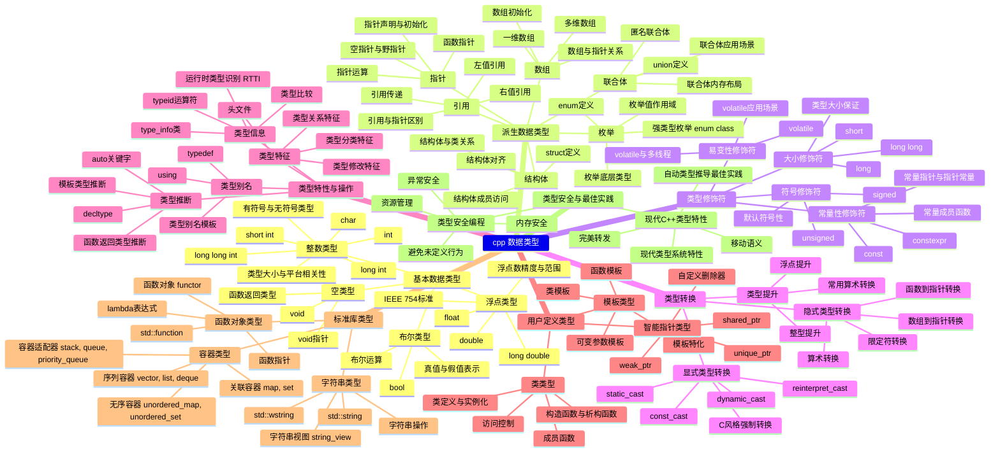

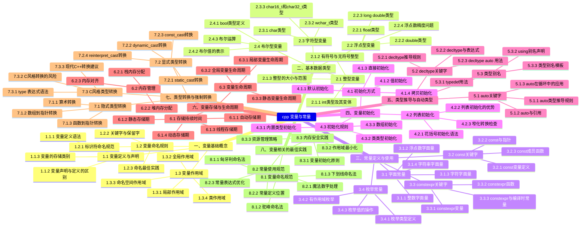


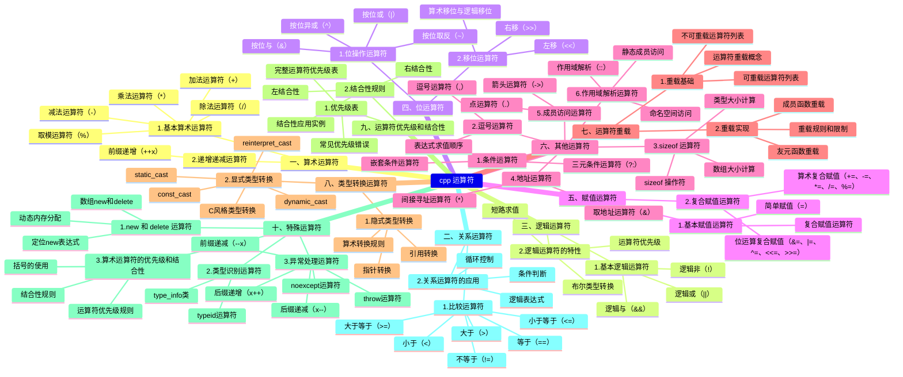

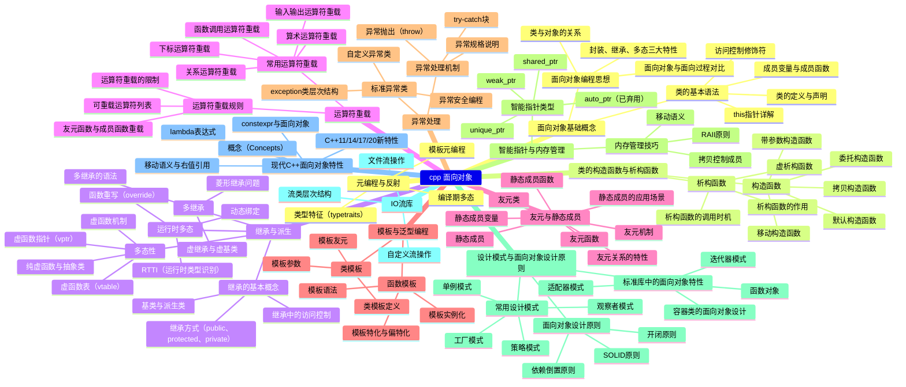

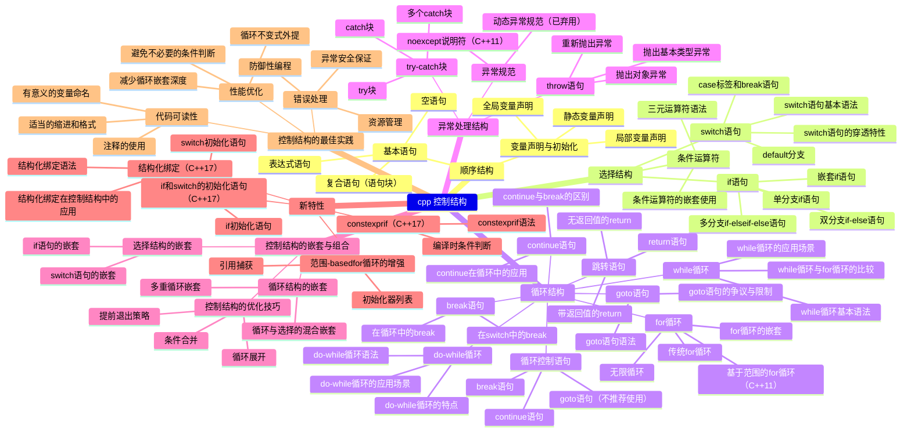

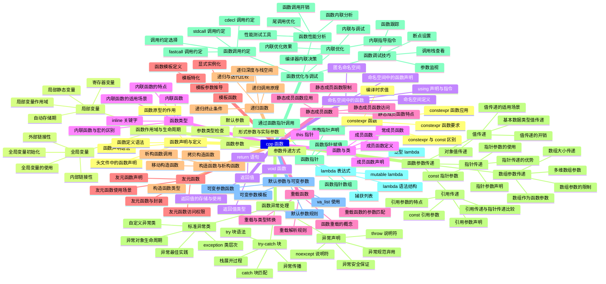


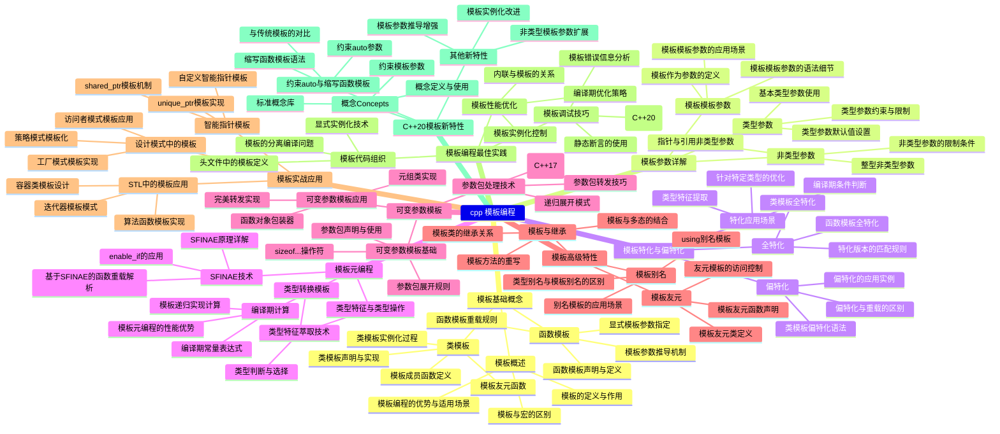

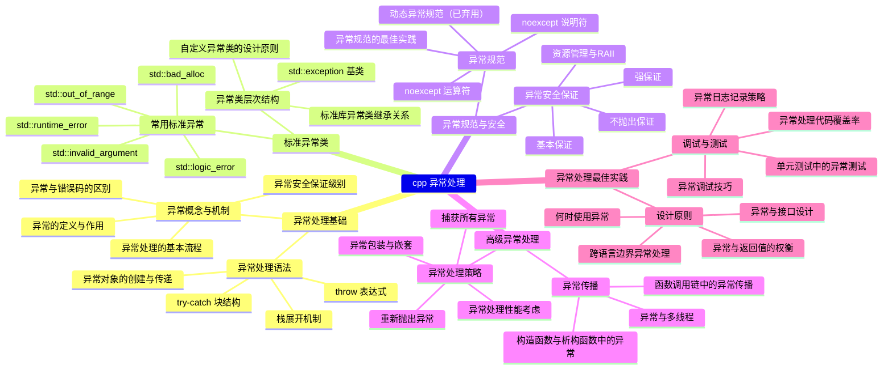

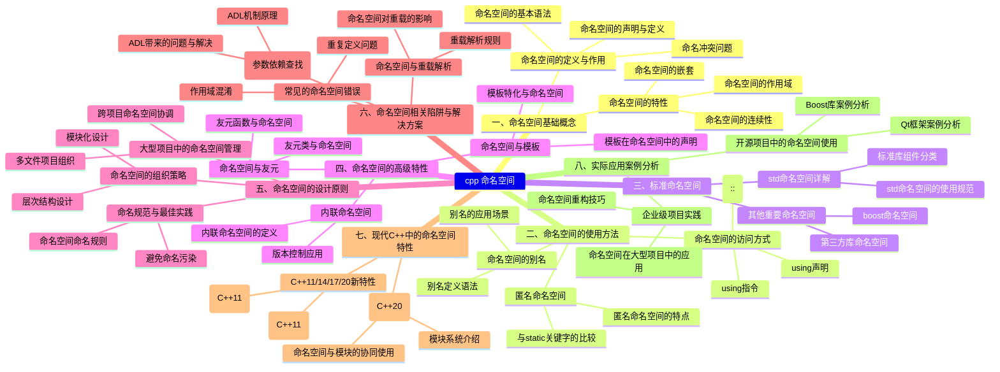

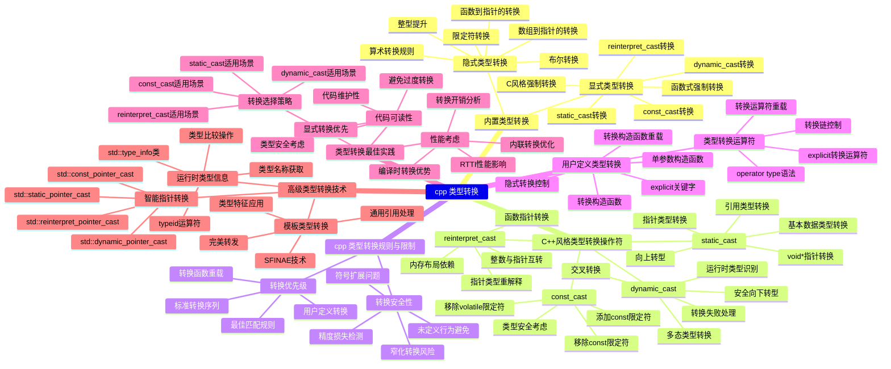

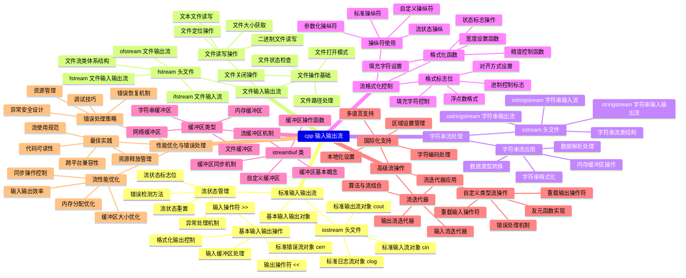

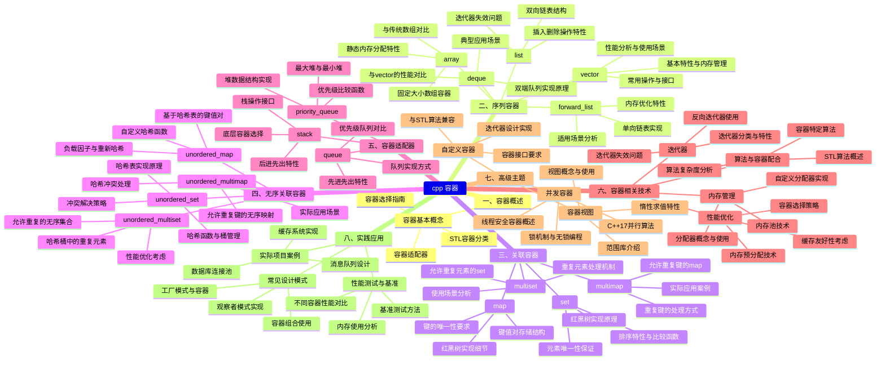

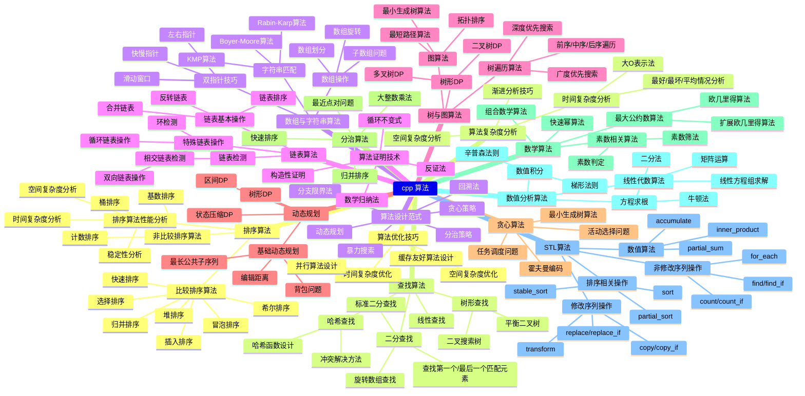

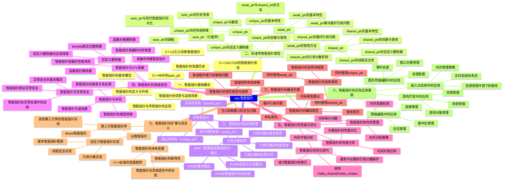

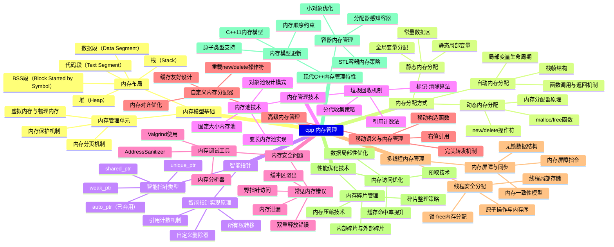

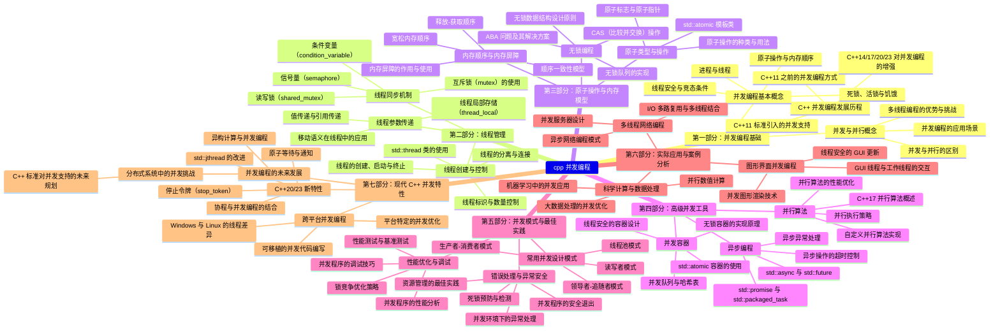


```mermaid
mindmap
cpp 新特性
    一、C++11 新特性
         1. 语言核心特性
            1.1 自动类型推导
                auto 关键字
                decltype 类型推导
                尾置返回类型

            1.2 基于范围的 for 循环
                语法结构
                与标准 for 循环对比
                适用容器类型

            1.3 初始化列表
                统一初始化语法
                std::initializer_list
                列表初始化的优势

            1.4 右值引用和移动语义
                左值与右值概念
                移动构造函数
                移动赋值运算符
                std::move 函数

            1.5 Lambda 表达式
                Lambda 语法结构
                捕获列表详解
                mutable Lambda
                返回类型指定

            1.6 常量表达式
                constexpr 关键字
                constexpr 函数
                constexpr 变量

            1.7 空指针常量
                nullptr 关键字
                与 NULL 的区别
                类型安全特性

            1.8 类型别名
                using 别名声明
                与 typedef 对比
                模板别名

            1.9 委托构造函数
                构造函数委托语法
                初始化顺序
                使用场景

            1.10 继承构造函数
                using 声明继承构造函数
                基类构造函数调用
                重载规则

         2. 标准库增强
            2.1 智能指针
                std::unique_ptr
                std::shared_ptr
                std::weak_ptr
                自定义删除器

            2.2 正则表达式
                std::regex 类
                正则表达式语法
                匹配算法

            2.3 随机数库
                随机数引擎
                随机数分布器
                种子管理

            2.4 时间库
                std::chrono 命名空间
                时间点与时长
                时钟类型

            2.5 元组
                std::tuple 模板
                元组操作函数
                结构化绑定

            2.6 无序容器
                std::unordered_map
                std::unordered_set
                哈希函数定制

            2.7 函数对象包装器
                std::function 模板
                可调用对象包装
                类型擦除机制

    二、C++14 新特性
         1. 语言特性改进
            1.1 泛型 Lambda
                auto 参数类型
                模板参数推导
                可变参数 Lambda

            1.2 返回类型推导
                函数返回类型 auto
                decltype auto 推导
                尾置返回类型简化

            1.3 变量模板
                变量模板定义
                特化与偏特化
                使用场景示例

            1.4 二进制字面量
                0b 和 0B 前缀
                数字分隔符
                字面量类型

            1.5 函数返回类型推导
                多返回语句处理
                递归函数支持
                推导规则限制

         2. 标准库扩展
            2.1 标准库函数改进
                std::make_unique
                用户定义字面量
                编译时整数序列

            2.2 类型特征扩展
                类型特征模板
                变量模板版本
                编译时类型检查

    三、C++17 新特性
         1. 语言核心特性
            1.1 结构化绑定
                声明语法
                元组解包
                自定义类型支持

            1.2 if 和 switch 初始化语句
                if 语句初始化
                switch 语句初始化
                作用域规则

            1.3 内联变量
                头文件中定义变量
                单一定义规则
                静态成员变量

            1.4 折叠表达式
                一元折叠
                二元折叠
                参数包处理

            1.5 constexpr if
                编译时条件判断
                模板元编程应用
                实例化控制

            1.6 模板参数推导增强
                类模板参数推导
                推导指引
                自定义推导规则

            1.7 属性扩展
                nodiscard 属性
                fallthrough 属性
                maybe_unused 属性

         2. 标准库新特性
            2.1 文件系统库
                std::filesystem 命名空间
                路径操作
                目录迭代器

            2.2 可选类型
                std::optional 模板
                值或空状态
                安全访问方法

            2.3 变体类型
                std::variant 模板
                类型安全联合
                访问者模式

            2.4 any 类型
                std::any 容器
                类型擦除机制
                运行时类型信息

            2.5 字符串视图
                std::string_view 类
                非拥有字符串引用
                性能优化

            2.6 并行算法
                执行策略
                并行化标准算法
                线程安全保证

    四、C++20 新特性
         1. 语言核心特性
            1.1 概念 Concepts 
                概念定义语法
                约束表达式
                概念检查

            1.2 模块 Modules 
                模块声明
                模块分区
                头文件替代

            1.3 协程 Coroutines 
                协程框架
                协程句柄
                异步编程支持

            1.4 范围 Ranges 
                范围概念
                视图适配器
                管道操作符

            1.5 三路比较运算符
                <=> 运算符
                比较类别
                自动生成比较

            1.6 指定初始化
                成员初始化语法
                初始化顺序
                与聚合初始化对比

            1.7 consteval 和 constinit
                立即函数
                常量初始化
                编译时求值

         2. 标准库扩展
            2.1 范围库
                范围算法
                视图操作
                惰性求值

            2.2 格式库
                std::format 函数
                格式化字符串语法
                类型安全格式化

            2.3 日历和时区
                日期时间类型
                时区支持
                日历运算

            2.4 原子智能指针
                原子共享指针
                原子弱指针
                线程安全操作

            2.5 位操作
                位操作函数
                字节交换
                位计数操作

    五、C++23 新特性展望
         1. 预期语言特性
            1.1 模式匹配
                匹配表达式语法
                结构化模式
                守卫条件

            1.2 反射
                编译时反射
                元编程支持
                代码生成应用

            1.3 契约
                前置条件
                后置条件
                断言增强

         2. 标准库计划
            2.1 执行器框架
                异步执行模型
                执行器概念
                任务调度

            2.2 网络库
                套接字抽象
                异步I/O操作
                协议支持

            2.3 文本处理
                Unicode 支持
                字符串算法
                文本编码转换

    六、新特性应用实践
         1. 现代 C++ 编程范式
            1.1 资源管理
                RAII 原则
                智能指针使用
                移动语义优化

            1.2 模板元编程
                概念约束
                变参模板
                SFINAE 技术

            1.3 并发编程
                内存模型
                原子操作
                并行算法

         2. 性能优化技巧
            2.1 移动语义优化
                避免不必要的拷贝
                完美转发
                返回值优化

            2.2 编译时计算
                constexpr 应用
                模板元编程
                编译期优化

            2.3 内存布局优化
                缓存友好设计
                数据对齐
                内存访问模式

```


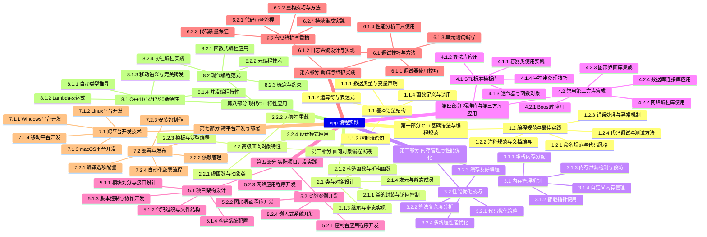

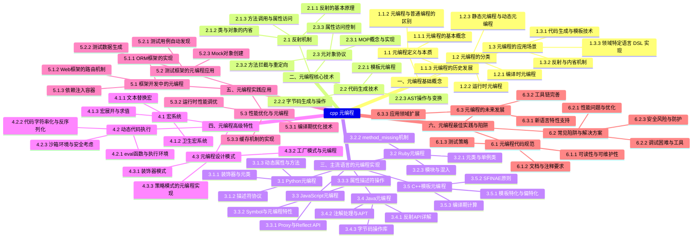

```mermaid
mindmap
cpp 设计模式
    一、设计模式基础概念
         1. 设计模式概述
              1.1 设计模式定义与起源
              1.2 设计模式分类标准
              1.3 设计模式在软件开发中的重要性
              1.4 设计模式与软件架构的关系

         2. 面向对象设计原则
              2.1 SOLID 原则详解
              2.2 开闭原则 OCP 
              2.3 里氏替换原则 LSP 
              2.4 依赖倒置原则 DIP 
              2.5 接口隔离原则 ISP 
              2.6 迪米特法则 LoD 
              2.7 组合优于继承原则

         3. C++ 语言特性与设计模式
              3.1 模板与泛型编程
              3.2 智能指针与资源管理
              3.3 RAII 机制
              3.4 移动语义与完美转发
              3.5 lambda 表达式与函数对象
              3.6 多态与虚函数机制

    二、创建型模式
         1. 单例模式 Singleton 
              1.1 饿汉式单例实现
              1.2 懒汉式单例实现
              1.3 线程安全的单例模式
              1.4 Meyers' Singleton 实现
              1.5 单例模式的优缺点分析

         2. 工厂方法模式 Factory Method 
              2.1 简单工厂模式
              2.2 工厂方法模式实现
              2.3 模板工厂模式
              2.4 工厂模式与多态的结合

         3. 抽象工厂模式 Abstract Factory 
              3.1 抽象工厂模式结构
              3.2 产品族与产品等级结构
              3.3 抽象工厂模式的应用场景
              3.4 抽象工厂与工厂方法的区别

         4. 建造者模式 Builder 
              4.1 建造者模式的结构
              4.2 导演者角色的作用
              4.3 建造者模式的变体
              4.4 建造者模式与工厂模式的区别

         5. 原型模式 Prototype 
              5.1 浅拷贝与深拷贝
              5.2 原型模式的实现方式
              5.3 原型注册表机制
              5.4 原型模式在C++中的特殊考虑

    三、结构型模式
         1. 适配器模式 Adapter 
              1.1 类适配器与对象适配器
              1.2 双向适配器
              1.3 适配器模式与代理模式的区别
              1.4 适配器模式的应用实例

         2. 桥接模式 Bridge 
              2.1 桥接模式的结构分析
              2.2 抽象与实现的分离
              2.3 桥接模式与适配器模式的比较
              2.4 桥接模式的多维度扩展

         3. 组合模式 Composite 
              3.1 透明组合模式与安全组合模式
              3.2 组合模式中的递归结构
              3.3 组合模式的遍历算法
              3.4 组合模式在UI框架中的应用

         4. 装饰器模式 Decorator 
              4.1 装饰器模式的结构特点
              4.2 装饰器链的构建
              4.3 装饰器模式与继承的比较
              4.4 装饰器模式在IO流中的应用

         5. 外观模式 Facade 
              5.1 外观模式的简化接口
              5.2 外观模式与中介者模式的区别
              5.3 外观模式在子系统集成中的应用

         6. 享元模式 Flyweight 
              6.1 内部状态与外部状态
              6.2 享元工厂的实现
              6.3 享元模式在字符串池中的应用
              6.4 享元模式的内存优化效果

         7. 代理模式 Proxy 
              7.1 虚拟代理
              7.2 保护代理
              7.3 远程代理
              7.4 智能指针代理
              7.5 代理模式与装饰器模式的比较

    四、行为型模式
         1. 责任链模式 Chain of Responsibility 
              1.1 责任链的构建与传递
              1.2 纯责任链与不纯责任链
              1.3 责任链模式在事件处理中的应用
              1.4 责任链模式的动态配置

         2. 命令模式 Command 
              2.1 命令接口设计
              2.2 命令的撤销与重做
              2.3 宏命令的实现
              2.4 命令模式在GUI中的应用

         3. 解释器模式 Interpreter 
              3.1 抽象语法树的构建
              3.2 终结符与非终结符表达式
              3.3 解释器模式在表达式求值中的应用
              3.4 解释器模式的性能考虑

         4. 迭代器模式 Iterator 
              4.1 内部迭代器与外部迭代器
              4.2 迭代器失效问题
              4.3 STL迭代器实现原理
              4.4 迭代器模式与foreach循环

         5. 中介者模式 Mediator 
              5.1 中介者模式的通信机制
              5.2 具体中介者与抽象中介者
              5.3 中介者模式在MVC架构中的应用
              5.4 中介者模式的复杂度控制

         6. 备忘录模式 Memento 
              6.1 备忘录的存储与恢复
              6.2 宽接口与窄接口设计
              6.3 备忘录模式在事务处理中的应用
              6.4 备忘录模式的序列化实现

         7. 观察者模式 Observer 
              7.1 推模型与拉模型
              7.2 观察者模式的事件机制
              7.3 观察者模式的线程安全问题
              7.4 Qt信号槽机制实现原理

         8. 状态模式 State 
              8.1 状态转换机制
              8.2 状态模式与条件语句的比较
              8.3 状态模式在有限状态机中的应用
              8.4 状态模式的可扩展性

         9. 策略模式 Strategy 
              9.1 策略接口设计
              9.2 策略模式与模板方法模式的比较
              9.3 策略模式在算法选择中的应用
              9.4 策略模式的可配置性

         10. 模板方法模式 Template Method 
              10.1 模板方法的钩子函数
              10.2 模板方法模式与策略模式的比较
              10.3 模板方法模式在框架设计中的应用
              10.4 模板方法模式的扩展点设计

         11. 访问者模式 Visitor 
              11.1 双分派技术
              11.2 访问者模式的结构特点
              11.3 访问者模式在编译器设计中的应用
              11.4 访问者模式的扩展性分析

    五、并发模式
         1. 主动对象模式 Active Object 
              1.1 方法调用与执行分离
              1.2 调度器设计
              1.3 Future模式实现
              1.4 主动对象模式的线程安全

         2. 监视器模式 Monitor 
              2.1 条件变量与互斥锁
              2.2 生产者-消费者问题
              2.3 读写锁实现
              2.4 监视器模式在并发编程中的应用

         3. 线程池模式 Thread Pool 
              3.1 线程池的创建与管理
              3.2 任务队列设计
              3.3 线程池的性能调优
              3.4 线程池的优雅关闭

         4. 领导者-追随者模式 Leader-Follower 
              4.1 事件分发机制
              4.2 领导者选举算法
              4.3 负载均衡策略
              4.4 领导者-追随者模式在高并发系统中的应用

    六、模式组合与实战应用
         1. 模式组合原则
              1.1 模式之间的协作关系
              1.2 模式组合的最佳实践
              1.3 反模式识别与避免
              1.4 模式的重构技巧

         2. 设计模式在框架中的应用
              2.1 STL中的设计模式
              2.2 Qt框架中的设计模式
              2.3 Boost库中的设计模式
              2.4 游戏引擎中的设计模式

         3. 设计模式在项目实战中的应用
              3.1 大型项目中的模式选择
              3.2 模式驱动的架构设计
              3.3 设计模式的测试策略
              3.4 设计模式的文档化

         4. 现代C++与设计模式
              4.1 C++11/14/17/20新特性对设计模式的影响
              4.2 函数式编程与设计模式的结合
              4.3 元编程技术在模式实现中的应用
              4.4 现代C++设计模式的最佳实践

    七、设计模式进阶专题
         1. 模式语言与模式系统
              1.1 亚历山大模式语言
              1.2 软件模式分类体系
              1.3 模式之间的关系网络
              1.4 模式目录的组织结构

         2. 设计模式的演化与发展
              2.1 经典设计模式的局限性
              2.2 新兴设计模式介绍
              2.3 领域特定设计模式
              2.4 函数式设计模式

         3. 设计模式的质量属性
              3.1 可维护性设计
              3.2 可扩展性设计
              3.3 性能优化考虑
              3.4 安全性设计原则

         4...

```

```mermaid
mindmap
cpp 性能优化
    一、性能分析基础
         1. 性能指标定义
              1.1 时间复杂度分析
              1.2 空间复杂度分析
              1.3 缓存命中率
              1.4 内存带宽利用率
              1.5 CPU指令周期优化

         2. 性能测试方法
              2.1 基准测试框架
              2.2 性能剖析工具使用
              2.3 内存泄漏检测
              2.4 多线程性能分析
              2.5 实时性能监控

    二、编译器优化技术
         1. 编译器优化选项
              1.1 GCC/Clang优化标志
              1.2 MSVC优化参数
              1.3 链接时优化(LTO)
              1.4 配置文件引导优化(PGO)
              1.5 特定架构优化

         2. 代码生成优化
              2.1 内联函数优化
              2.2 循环展开策略
              2.3 尾调用优化
              2.4 常量传播优化
              2.5 死代码消除

    三、内存管理优化
         1. 内存分配策略
              1.1 堆内存分配优化
              1.2 栈内存使用技巧
              1.3 内存池技术
              1.4 自定义分配器设计
              1.5 智能指针性能分析

         2. 缓存友好编程
              2.1 数据局部性原理
              2.2 缓存行对齐
              2.3 预取技术应用
              2.4 数据结构布局优化
              2.5 避免伪共享

    四、算法与数据结构优化
         1. 高效算法选择
              1.1 排序算法性能比较
              1.2 查找算法优化
              1.3 哈希表性能调优
              1.4 图算法优化
              1.5 字符串处理优化

         2. 数据结构设计
              2.1 容器类性能分析
              2.2 自定义数据结构设计
              2.3 内存布局优化
              2.4 数据压缩技术
              2.5 位操作优化

    五、多线程与并发优化
         1. 线程管理优化
              1.1 线程池设计
              1.2 锁粒度控制
              1.3 无锁编程技术
              1.4 原子操作优化
              1.5 线程局部存储

         2. 并发模式优化
              2.1 生产者-消费者模式
              2.2 读写锁优化
              2.3 任务并行化
              2.4 数据并行处理
              2.5 异步编程优化

    六、I/O操作优化
         1. 文件I/O优化
              1.1 缓冲策略优化
              1.2 异步文件操作
              1.3 内存映射文件
              1.4 文件系统缓存
              1.5 批量处理优化

         2. 网络I/O优化
              2.1 TCP/IP协议优化
              2.2 零拷贝技术
              2.3 连接池管理
              2.4 事件驱动模型
              2.5 协议缓冲区优化

    七、系统级优化技术
         1. 操作系统特性利用
              1.1 系统调用优化
              1.2 进程调度优化
              1.3 内存管理单元优化
              1.4 中断处理优化
              1.5 虚拟内存优化

         2. 硬件特性利用
              2.1 CPU特性优化
              2.2 缓存层次优化
              2.3 SIMD指令集使用
              2.4 GPU加速计算
              2.5 专用硬件加速

    八、代码级优化技巧
         1. 语言特性优化
              1.1 内联汇编使用
              1.2 模板元编程
              1.3 移动语义优化
              1.4 异常处理优化
              1.5 类型推导优化

         2. 编码实践优化
              2.1 循环优化技巧
              2.2 分支预测优化
              2.3 函数调用优化
              2.4 表达式求值优化
              2.5 代码重构策略

    九、性能调优方法论
         1. 性能瓶颈分析
              1.1 热点代码识别
              1.2 性能回归测试
              1.3 负载测试分析
              1.4 压力测试优化
              1.5 性能监控体系

         2. 优化策略制定
              2.1 性能目标设定
              2.2 优化优先级确定
              2.3 权衡分析技巧
              2.4 性能测试计划
              2.5 持续优化流程

```

//TODO0

# C Plus Plus 


[](docs.yuoek.icu )



{}
## cpp 数据类型
### 基本数据类型
#### 整数类型
##### char
##### short int
##### int
##### long int
##### long long int
##### 有符号与无符号类型
##### 类型大小与平台相关性

#### 浮点类型
##### float
##### double
##### long double
##### 浮点数精度与范围
##### IEEE 754标准

#### 布尔类型
##### bool
##### 真值与假值表示
##### 布尔运算

#### 空类型
##### void
##### void指针
##### 函数返回类型

### 派生数据类型
#### 数组
##### 一维数组
##### 多维数组
##### 数组初始化
##### 数组与指针关系

#### 指针
##### 指针声明与初始化
##### 指针运算
##### 空指针与野指针
##### 函数指针

#### 引用
##### 左值引用
##### 右值引用
##### 引用与指针区别
##### 引用传递

#### 结构体
##### struct定义
##### 结构体成员访问
##### 结构体对齐
##### 结构体与类关系

#### 联合体
##### union定义
##### 联合体内存布局
##### 匿名联合体
##### 联合体应用场景

#### 枚举
##### enum定义
##### 枚举值作用域
##### 强类型枚举（enum class）
##### 枚举底层类型

### 类型修饰符
#### 符号修饰符
##### signed
##### unsigned
##### 默认符号性

#### 大小修饰符
##### short
##### long
##### long long
##### 类型大小保证

#### 常量性修饰符
##### const
##### constexpr
##### 常量指针与指针常量
##### 常量成员函数

#### 易变性修饰符
##### volatile
##### volatile应用场景
##### volatile与多线程

### 类型转换
#### 隐式类型转换
##### 算术转换
##### 数组到指针转换
##### 函数到指针转换
##### 限定符转换

#### 显式类型转换
##### C风格强制转换
##### static_cast
##### dynamic_cast
##### const_cast
##### reinterpret_cast

#### 类型提升
##### 整型提升
##### 浮点提升
##### 常用算术转换

### 类型特性与操作
#### 类型推断
##### auto关键字
##### decltype
##### 模板类型推断
##### 函数返回类型推断

#### 类型信息
##### typeid运算符
##### type_info类
##### 类型比较
##### 运行时类型识别（RTTI）

#### 类型别名
##### typedef
##### using
##### 类型别名模板

#### 类型特征
##### <type_traits>头文件
##### 类型分类特征
##### 类型关系特征
##### 类型修改特征

### 用户定义类型
#### 类类型
##### 类定义与实例化
##### 访问控制
##### 成员函数
##### 构造函数与析构函数

#### 模板类型
##### 函数模板
##### 类模板
##### 模板特化
##### 可变参数模板

#### 智能指针类型
##### unique_ptr
##### shared_ptr
##### weak_ptr
##### 自定义删除器

### 标准库类型
#### 字符串类型
##### std::string
##### std::wstring
##### 字符串视图（string_view）
##### 字符串操作

#### 容器类型
##### 序列容器（vector, list, deque）
##### 关联容器（map, set）
##### 无序容器（unordered_map, unordered_set）
##### 容器适配器（stack, queue, priority_queue）

#### 函数对象类型
##### 函数指针
##### 函数对象（functor）
##### lambda表达式
##### std::function

### 类型安全与最佳实践
#### 类型安全编程
##### 避免未定义行为
##### 资源管理
##### 异常安全
##### 内存安全

#### 现代C++类型特性
##### 移动语义
##### 完美转发
##### 自动类型推导最佳实践
##### 现代类型系统特性
{}
//TODO2
{}
## cpp 变量与常量
### 一、变量基础概念
#### 1.1 变量定义与声明
##### 1.1.1 变量定义语法
##### 1.1.2 变量声明与定义的区别
##### 1.1.3 变量的存储类别

#### 1.2 变量命名规则
##### 1.2.1 标识符命名规范
##### 1.2.2 关键字与保留字
##### 1.2.3 命名最佳实践

#### 1.3 变量作用域
##### 1.3.1 局部作用域
##### 1.3.2 全局作用域
##### 1.3.3 命名空间作用域
##### 1.3.4 类作用域

### 二、基本数据类型
#### 2.1 整型变量
##### 2.1.1 int类型及其变体
##### 2.1.2 有符号与无符号整型
##### 2.1.3 整型的大小与范围

#### 2.2 浮点型变量
##### 2.2.1 float类型
##### 2.2.2 double类型
##### 2.2.3 long double类型
##### 2.2.4 浮点数精度问题

#### 2.3 字符型变量
##### 2.3.1 char类型
##### 2.3.2 wchar_t类型
##### 2.3.3 char16_t和char32_t类型

#### 2.4 布尔型变量
##### 2.4.1 bool类型定义
##### 2.4.2 布尔值的表示
##### 2.4.3 布尔运算

### 三、常量定义与使用
#### 3.1 字面常量
##### 3.1.1 整数字面量
##### 3.1.2 浮点数字面量
##### 3.1.3 字符字面量
##### 3.1.4 字符串字面量

#### 3.2 const关键字
##### 3.2.1 const变量定义
##### 3.2.2 const与指针
##### 3.2.3 const成员函数

#### 3.3 constexpr关键字
##### 3.3.1 constexpr变量
##### 3.3.2 constexpr函数
##### 3.3.3 constexpr与编译时常量

#### 3.4 枚举常量
##### 3.4.1 枚举类型定义
##### 3.4.2 有作用域枚举
##### 3.4.3 枚举值的操作

### 四、变量初始化
#### 4.1 初始化方式
##### 4.1.1 默认初始化
##### 4.1.2 值初始化
##### 4.1.3 直接初始化
##### 4.1.4 拷贝初始化

#### 4.2 列表初始化
##### 4.2.1 花括号初始化语法
##### 4.2.2 列表初始化的优势
##### 4.2.3 窄化转换检查

#### 4.3 初始化规则
##### 4.3.1 内置类型初始化
##### 4.3.2 类类型初始化
##### 4.3.3 数组初始化

### 五、类型推导与自动类型
#### 5.1 auto关键字
##### 5.1.1 auto类型推导规则
##### 5.1.2 auto与引用
##### 5.1.3 auto在循环中的应用

#### 5.2 decltype关键字
##### 5.2.1 decltype推导规则
##### 5.2.2 decltype与表达式
##### 5.2.3 decltype(auto)用法

#### 5.3 类型别名
##### 5.3.1 typedef用法
##### 5.3.2 using别名声明
##### 5.3.3 类型别名模板

### 六、变量存储与生命周期
#### 6.1 存储持续时间
##### 6.1.1 自动存储期
##### 6.1.2 静态存储期
##### 6.1.3 线程存储期
##### 6.1.4 动态存储期

#### 6.2 内存管理
##### 6.2.1 栈内存分配
##### 6.2.2 堆内存分配
##### 6.2.3 内存对齐

#### 6.3 变量生命周期
##### 6.3.1 局部变量生命周期
##### 6.3.2 全局变量生命周期
##### 6.3.3 静态变量生命周期

### 七、类型转换与强制转换
#### 7.1 隐式类型转换
##### 7.1.1 算术转换
##### 7.1.2 数组到指针转换
##### 7.1.3 函数到指针转换

#### 7.2 显式类型转换
##### 7.2.1 static_cast转换
##### 7.2.2 dynamic_cast转换
##### 7.2.3 const_cast转换
##### 7.2.4 reinterpret_cast转换

#### 7.3 C风格类型转换
##### 7.3.1 (type)表达式语法
##### 7.3.2 C风格转换的风险
##### 7.3.3 现代C++转换建议

### 八、变量相关的最佳实践
#### 8.1 变量命名规范
##### 8.1.1 匈牙利命名法
##### 8.1.2 驼峰命名法
##### 8.1.3 下划线命名法

#### 8.2 常量使用规范
##### 8.2.1 魔法数字处理
##### 8.2.2 常量定义位置
##### 8.2.3 常量表达式优化

#### 8.3 内存安全实践
##### 8.3.1 变量初始化原则
##### 8.3.2 作用域最小化
##### 8.3.3 资源管理策略
{}
//TODO3
{}
## 运算符
### 算术运算符
#### 1. 基本算术运算符
##### 加法运算符（+）
##### 减法运算符（-）
##### 乘法运算符（*）
##### 除法运算符（/）
##### 取模运算符（%）

#### 2. 递增递减运算符
##### 前缀递增（++x）
##### 后缀递增（x++）
##### 前缀递减（--x）
##### 后缀递减（x--）

#### 3. 算术运算符的优先级和结合性
##### 运算符优先级规则
##### 结合性规则
##### 括号的使用

### 二、关系运算符
#### 1. 比较运算符
##### 等于（==）
##### 不等于（!=）
##### 大于（>）
##### 小于（<）
##### 大于等于（>=）
##### 小于等于（<=）

#### 2. 关系运算符的应用
##### 条件判断
##### 循环控制
##### 逻辑表达式

### 三、逻辑运算符
#### 1. 基本逻辑运算符
##### 逻辑与（&&）
##### 逻辑或（||）
##### 逻辑非（!）

#### 2. 逻辑运算符的特性
##### 短路求值
##### 运算符优先级
##### 布尔类型转换

### 四、位运算符
#### 1. 位操作运算符
##### 按位与（&）
##### 按位或（|）
##### 按位异或（^）
##### 按位取反（~）

#### 2. 移位运算符
##### 左移（<<）
##### 右移（>>）
##### 算术移位与逻辑移位

### 五、赋值运算符
#### 1. 基本赋值运算符
##### 简单赋值（=）
##### 复合赋值运算符

#### 2. 复合赋值运算符
##### 算术复合赋值（+=、-=、*=、/=、%=）
##### 位运算复合赋值（&=、|=、^=、<<=、>>=）

### 六、其他运算符
#### 1. 条件运算符
##### 三元条件运算符（?:）
##### 嵌套条件运算符

#### 2. 逗号运算符
##### 逗号运算符（,）
##### 表达式求值顺序

#### 3. sizeof 运算符
##### sizeof 操作符
##### 类型大小计算
##### 数组大小计算

#### 4. 地址运算符
##### 取地址运算符（&）
##### 间接寻址运算符（*）

#### 5. 成员访问运算符
##### 点运算符（.）
##### 箭头运算符（->）

#### 6. 作用域解析运算符
##### 作用域解析（::）
##### 命名空间访问
##### 静态成员访问

### 七、运算符重载
#### 1. 重载基础
##### 运算符重载概念
##### 可重载运算符列表
##### 不可重载运算符列表

#### 2. 重载实现
##### 成员函数重载
##### 友元函数重载
##### 重载规则和限制

### 八、类型转换运算符
#### 1. 隐式类型转换
##### 算术转换规则
##### 指针转换
##### 引用转换

#### 2. 显式类型转换
##### C风格类型转换
##### static_cast
##### dynamic_cast
##### const_cast
##### reinterpret_cast

### 九、运算符优先级和结合性
#### 1. 优先级表
##### 完整运算符优先级表
##### 常见优先级错误

#### 2. 结合性规则
##### 左结合性
##### 右结合性
##### 结合性应用实例

### 十、特殊运算符
#### 1. new 和 delete 运算符
##### 动态内存分配
##### 数组new和delete
##### 定位new表达式

#### 2. 类型识别运算符
##### typeid运算符
##### type_info类

#### 3. 异常处理运算符
##### throw运算符
##### noexcept运算符

{}

{}
## cpp 控制结构
### 顺序结构
#### 基本语句
##### 表达式语句
##### 空语句
##### 复合语句（语句块）

#### 变量声明与初始化
##### 局部变量声明
##### 全局变量声明
##### 静态变量声明

### 选择结构
#### if 语句
##### 单分支 if 语句
##### 双分支 if-else 语句
##### 多分支 if-else if-else 语句
##### 嵌套 if 语句

#### switch 语句
##### switch 语句基本语法
##### case 标签和 break 语句
##### default 分支
##### switch 语句的穿透特性

#### 条件运算符
##### 三元运算符语法
##### 条件运算符的嵌套使用

### 循环结构
#### for 循环
##### 传统 for 循环
##### 基于范围的 for 循环（C++11）
##### for 循环的嵌套
##### 无限循环

#### while 循环
##### while 循环基本语法
##### while 循环的应用场景
##### while 循环与 for 循环的比较

#### do-while 循环
##### do-while 循环语法
##### do-while 循环的特点
##### do-while 循环的应用场景

#### 循环控制语句
##### break 语句
##### continue 语句
##### goto 语句（不推荐使用）

### 跳转语句
#### return 语句
##### 带返回值的 return
##### 无返回值的 return

#### break 语句
##### 在循环中的 break
##### 在 switch 中的 break

#### continue 语句
##### continue 在循环中的应用
##### continue 与 break 的区别

#### goto 语句
##### goto 语句语法
##### goto 语句的争议与限制

### 异常处理结构
#### try-catch 块
##### try 块
##### catch 块
##### 多个 catch 块

#### throw 语句
##### 抛出基本类型异常
##### 抛出对象异常
##### 重新抛出异常

#### 异常规范
##### noexcept 说明符（C++11）
##### 动态异常规范（已弃用）

### 控制结构的嵌套与组合
#### 选择结构的嵌套
##### if 语句的嵌套
##### switch 语句的嵌套

#### 循环结构的嵌套
##### 多重循环嵌套
##### 循环与选择的混合嵌套

#### 控制结构的优化技巧
##### 提前退出策略
##### 循环展开
##### 条件合并

### 新特性
#### 结构化绑定（C++17）
##### 结构化绑定语法
##### 结构化绑定在控制结构中的应用

#### if 和 switch 的初始化语句（C++17）
##### if 初始化语句
##### switch 初始化语句

#### constexpr if（C++17）
##### constexpr if 语法
##### 编译时条件判断

#### 范围-based for 循环的增强
##### 初始化器列表
##### 引用捕获

### 控制结构的最佳实践
#### 代码可读性
##### 适当的缩进和格式
##### 有意义的变量命名
##### 注释的使用

#### 性能优化
##### 减少循环嵌套深度
##### 避免不必要的条件判断
##### 循环不变式外提

#### 错误处理
##### 防御性编程
##### 异常安全保证
##### 资源管理
{}

{}
//TODO
## cpp 函数
### 函数基础
#### 函数声明与定义
##### 函数声明语法
##### 函数定义语法
##### 函数原型的作用
##### 头文件中的函数声明

#### 函数参数
##### 形式参数与实际参数
##### 参数传递方式
##### 默认参数
##### 参数类型检查

#### 返回值
##### return 语句
##### 返回值类型
##### void 函数
##### 返回值的存储与使用

### 函数类型
#### 内联函数
##### inline 关键字
##### 内联函数的特点
##### 内联函数的适用场景
##### 内联函数与宏的区别

#### 重载函数
##### 函数重载的概念
##### 重载解析规则
##### 重载函数的参数匹配
##### 重载与类型转换

#### 模板函数
##### 函数模板定义
##### 模板参数推导
##### 显式实例化
##### 模板特化

#### 递归函数
##### 递归调用原理
##### 递归终止条件
##### 递归与迭代比较
##### 递归深度与栈空间

### 函数参数传递
#### 值传递
##### 基本数据类型值传递
##### 对象值传递
##### 值传递的开销
##### 值传递的适用场景

#### 指针传递
##### 指针参数声明
##### 指针参数的使用
##### const 指针参数
##### 指针传递的优势

#### 引用传递
##### 引用参数声明
##### 引用参数的特点
##### const 引用参数
##### 引用传递与指针传递比较

#### 数组参数传递
##### 数组作为函数参数
##### 多维数组参数
##### 数组大小传递
##### 数组参数的限制

### 函数高级特性
#### 函数指针
##### 函数指针声明
##### 函数指针赋值
##### 通过函数指针调用
##### 函数指针数组

#### lambda 表达式
##### lambda 语法结构
##### 捕获列表
##### mutable lambda
##### 泛型 lambda

#### 默认参数与可变参数
##### 默认参数规则
##### 可变参数函数
##### va_list 使用
##### 可变参数模板

#### constexpr 函数
##### constexpr 函数要求
##### 编译时求值
##### constexpr 与 const 区别
##### constexpr 函数应用

### 函数作用域与生命周期
#### 局部变量
##### 自动存储期
##### 局部变量作用域
##### 局部静态变量
##### 寄存器变量

#### 全局变量
##### 外部链接性
##### 内部链接性
##### 全局变量初始化
##### 全局变量的使用

#### 命名空间中的函数
##### 命名空间定义
##### 命名空间中的函数声明
##### using 声明与指令
##### 匿名命名空间

### 函数与类
#### 成员函数
##### 成员函数声明
##### 成员函数定义
##### this 指针
##### 常成员函数

#### 静态成员函数
##### 静态成员函数特点
##### 静态成员函数访问
##### 静态成员函数限制
##### 静态成员函数应用

#### 友元函数
##### 友元函数声明
##### 友元函数访问权限
##### 友元函数与封装
##### 友元函数使用场景

#### 构造函数与析构函数
##### 构造函数类型
##### 析构函数调用
##### 拷贝构造函数
##### 移动构造函数

### 函数异常处理
#### 异常声明
##### throw 说明符
##### noexcept 说明符
##### 异常规范弃用
##### 异常安全保证

#### try-catch 块
##### try 块语法
##### catch 块匹配
##### 异常传播
##### 栈展开过程

#### 标准异常类
##### exception 类层次
##### 自定义异常类
##### 异常对象生命周期
##### 异常最佳实践

### 函数优化与调试
#### 内联优化
##### 编译器内联决策
##### 内联优化效果
##### 内联指导指令
##### 内联与调试

#### 函数调用约定
##### cdecl 调用约定
##### stdcall 调用约定
##### fastcall 调用约定
##### 调用约定选择

#### 函数性能分析
##### 函数调用开销
##### 尾调用优化
##### 函数内联分析
##### 性能测试工具

#### 函数调试技巧
##### 断点设置
##### 调用栈查看
##### 参数监视
##### 函数跟踪
{}
//TODO3
{}
### 面向对象基础概念
#### 面向对象编程思想
##### 封装、继承、多态三大特性
##### 类与对象的关系
##### 面向对象与面向过程对比

#### 类的基本语法
##### 类的定义与声明
##### 访问控制修饰符
##### 成员变量与成员函数
##### this指针详解

### 类的构造函数与析构函数
#### 构造函数
##### 默认构造函数
##### 带参数构造函数
##### 拷贝构造函数
##### 移动构造函数
##### 委托构造函数

#### 析构函数
##### 析构函数的作用
##### 虚析构函数
##### 析构函数的调用时机

### 继承与派生
#### 继承的基本概念
##### 基类与派生类
##### 继承方式（public、protected、private）
##### 继承中的访问控制

#### 多继承
##### 多继承的语法
##### 菱形继承问题
##### 虚继承与虚基类

### 多态性
#### 虚函数机制
##### 虚函数表（vtable）
##### 虚函数指针（vptr）
##### 纯虚函数与抽象类

#### 运行时多态
##### 函数重写（override）
##### 动态绑定
##### RTTI（运行时类型识别）

### 运算符重载
#### 运算符重载规则
##### 可重载运算符列表
##### 运算符重载的限制
##### 友元函数与成员函数重载

#### 常用运算符重载
##### 算术运算符重载
##### 关系运算符重载
##### 输入输出运算符重载
##### 下标运算符重载
##### 函数调用运算符重载

### 友元与静态成员
#### 友元机制
##### 友元函数
##### 友元类
##### 友元关系的特性

#### 静态成员
##### 静态成员变量
##### 静态成员函数
##### 静态成员的应用场景

### 模板与泛型编程
#### 函数模板
##### 模板语法
##### 模板实例化
##### 模板特化与偏特化

#### 类模板
##### 类模板定义
##### 模板参数
##### 模板友元

### 异常处理
#### 异常处理机制
##### try-catch块
##### 异常抛出（throw）
##### 异常规格说明

#### 标准异常类
##### exception类层次结构
##### 自定义异常类
##### 异常安全编程

### 智能指针与内存管理
#### 智能指针类型
##### unique_ptr
##### shared_ptr
##### weak_ptr
##### auto_ptr（已弃用）

#### 内存管理技巧
##### RAII原则
##### 移动语义
##### 拷贝控制成员

### 设计模式与面向对象设计原则
#### 面向对象设计原则
##### SOLID原则
##### 开闭原则
##### 依赖倒置原则

#### 常用设计模式
##### 工厂模式
##### 单例模式
##### 观察者模式
##### 策略模式

### 标准库中的面向对象特性
#### 容器类的面向对象设计
##### 迭代器模式
##### 适配器模式
##### 函数对象

#### IO流库
##### 流类层次结构
##### 自定义流操作
##### 文件流操作

### 现代C++面向对象特性
#### C++11/14/17/20新特性
##### lambda表达式
##### 移动语义与右值引用
##### constexpr与面向对象
##### 概念（Concepts）

#### 元编程与反射
##### 模板元编程
##### 类型特征（type traits）
##### 编译期多态


{}
//TODO4 
{}
## cpp 模板编程
### 模板基础概念
#### 模板概述
##### 模板的定义与作用
##### 模板编程的优势与适用场景
##### 模板与宏的区别

#### 函数模板
##### 函数模板声明与定义
##### 模板参数推导机制
##### 显式模板参数指定
##### 函数模板重载规则

#### 类模板
##### 类模板声明与实现
##### 模板成员函数定义
##### 类模板实例化过程
##### 模板友元函数

### 模板参数详解
#### 类型参数
##### 基本类型参数使用
##### 类型参数约束与限制
##### 类型参数默认值设置

#### 非类型参数
##### 整型非类型参数
##### 指针与引用非类型参数
##### 非类型参数的限制条件

#### 模板模板参数
##### 模板作为参数的定义
##### 模板模板参数的应用场景
##### 模板模板参数的语法细节

### 模板特化与偏特化
#### 全特化
##### 函数模板全特化
##### 类模板全特化
##### 特化版本的匹配规则

#### 偏特化
##### 类模板偏特化语法
##### 偏特化的应用实例
##### 偏特化与重载的区别

#### 特化应用场景
##### 针对特定类型的优化
##### 类型特征提取
##### 编译期条件判断

### 模板元编程
#### 编译期计算
##### 模板递归实现计算
##### 编译期常量表达式
##### 模板元编程的性能优势

#### 类型特征与类型操作
##### 类型特征萃取技术
##### 类型转换模板
##### 类型判断与选择

#### SFINAE技术
##### SFINAE原理详解
##### enable_if的应用
##### 基于SFINAE的函数重载解析

### 可变参数模板
#### 可变参数模板基础
##### 参数包声明与使用
##### sizeof...操作符
##### 参数包展开规则

#### 参数包处理技术
##### 递归展开模式
##### 折叠表达式(C++17)
##### 参数包转发技巧

#### 可变参数模板应用
##### 完美转发实现
##### 元组类实现
##### 函数对象包装器

### 模板高级特性
#### 模板别名
##### using别名模板
##### 类型别名与模板别名的区别
##### 别名模板的应用场景

#### 模板友元
##### 模板友元函数声明
##### 模板友元类定义
##### 友元模板的访问控制

#### 模板与继承
##### 模板类的继承关系
##### 模板方法的重写
##### 模板与多态的结合

### 模板实战应用
#### STL中的模板应用
##### 容器类模板设计
##### 算法函数模板实现
##### 迭代器模板模式

#### 智能指针模板
##### unique_ptr模板实现
##### shared_ptr模板机制
##### 自定义智能指针模板

#### 设计模式中的模板
##### 策略模式模板化
##### 工厂模式模板实现
##### 访问者模式模板应用

### 模板编程最佳实践
#### 模板代码组织
##### 头文件中的模板定义
##### 模板的分离编译问题
##### 显式实例化技术

#### 模板调试技巧
##### 模板错误信息分析
##### 静态断言的使用
##### 概念约束(C++20)

#### 模板性能优化
##### 内联与模板的关系
##### 编译期优化策略
##### 模板实例化控制

### C++20模板新特性
#### 概念(Concepts)
##### 概念定义与使用
##### 约束模板参数
##### 标准概念库

#### 约束(auto)与缩写函数模板
##### 约束auto参数
##### 缩写函数模板语法
##### 与传统模板的对比

#### 其他新特性
##### 模板参数推导增强
##### 非类型模板参数扩展
##### 模板实例化改进


{}
//TODO5 
{}
## cpp 异常处理

### 异常处理基础
#### 异常概念与机制
##### 异常的定义与作用
##### 异常处理的基本流程
##### 异常与错误码的区别
##### 异常安全保证级别

#### 异常处理语法
##### try-catch 块结构
##### throw 表达式
##### 异常对象的创建与传递
##### 栈展开机制

### 标准异常类
#### 异常类层次结构
##### std::exception 基类
##### 标准库异常类继承关系
##### 自定义异常类的设计原则

#### 常用标准异常
##### std::runtime_error
##### std::logic_error
##### std::bad_alloc
##### std::out_of_range
##### std::invalid_argument

### 异常规范与安全
#### 异常规范
##### 动态异常规范（已弃用）
##### noexcept 说明符
##### noexcept 运算符
##### 异常规范的最佳实践

#### 异常安全保证
##### 基本保证
##### 强保证
##### 不抛出保证
##### 资源管理与RAII

### 高级异常处理
#### 异常传播
##### 函数调用链中的异常传播
##### 构造函数与析构函数中的异常
##### 异常与多线程

#### 异常处理策略
##### 捕获所有异常
##### 重新抛出异常
##### 异常包装与嵌套
##### 异常处理性能考虑

### 异常处理最佳实践
#### 设计原则
##### 何时使用异常
##### 异常与返回值的权衡
##### 异常与接口设计
##### 跨语言边界异常处理

#### 调试与测试
##### 异常调试技巧
##### 单元测试中的异常测试
##### 异常处理代码覆盖率
##### 异常日志记录策略
{}
//TODO6 
{}
### cpp 命名空间

### 一、命名空间基础概念
#### 命名空间的定义与作用
##### 命名冲突问题
##### 命名空间的基本语法
##### 命名空间的声明与定义

#### 命名空间的特性
##### 命名空间的作用域
##### 命名空间的连续性
##### 命名空间的嵌套

### 二、命名空间的使用方法
#### 命名空间的访问方式
##### 作用域解析运算符(::)
##### using声明
##### using指令

#### 命名空间的别名
##### 别名定义语法
##### 别名的应用场景

#### 匿名命名空间
##### 匿名命名空间的特点
##### 与static关键字的比较

### 三、标准命名空间
#### std命名空间详解
##### 标准库组件分类
##### std命名空间的使用规范

#### 其他重要命名空间
##### boost命名空间
##### 第三方库命名空间

### 四、命名空间的高级特性
#### 内联命名空间
##### 内联命名空间的定义
##### 版本控制应用

#### 命名空间与模板
##### 模板在命名空间中的声明
##### 模板特化与命名空间

#### 命名空间与友元
##### 友元函数与命名空间
##### 友元类与命名空间

### 五、命名空间的设计原则
#### 命名空间的组织策略
##### 模块化设计
##### 层次结构设计

#### 命名规范与最佳实践
##### 命名空间命名规则
##### 避免命名污染

#### 大型项目中的命名空间管理
##### 多文件项目组织
##### 跨项目命名空间协调

### 六、命名空间相关陷阱与解决方案
#### 常见的命名空间错误
##### 重复定义问题
##### 作用域混淆

#### 命名空间与ADL(参数依赖查找)
##### ADL机制原理
##### ADL带来的问题与解决

#### 命名空间与重载解析
##### 重载解析规则
##### 命名空间对重载的影响

### 七、现代C++中的命名空间特性
#### C++11/14/17/20新特性
##### 内联命名空间(C++11)
##### 命名空间别名模板(C++11)

#### 命名空间与模块(C++20)
##### 模块系统介绍
##### 命名空间与模块的协同使用

### 八、实际应用案例分析
#### 开源项目中的命名空间使用
##### Boost库案例分析
##### Qt框架案例分析

#### 企业级项目实践
##### 命名空间在大型项目中的应用
##### 命名空间重构技巧
{}
//TODO7
{}
## cpp 类型转换
### 内置类型转换
#### 隐式类型转换
##### 算术转换规则
##### 数组到指针的转换
##### 函数到指针的转换
##### 限定符转换
##### 布尔转换
##### 整型提升

#### 显式类型转换
##### C风格强制转换
##### 函数式强制转换
##### static_cast转换
##### dynamic_cast转换
##### const_cast转换
##### reinterpret_cast转换

### C++风格类型转换操作符
#### static_cast
##### 基本数据类型转换
##### 指针类型转换
##### 引用类型转换
##### 向上转型
##### void*指针转换

#### dynamic_cast
##### 运行时类型识别
##### 多态类型转换
##### 安全向下转型
##### 交叉转换
##### 转换失败处理

#### const_cast
##### 移除const限定符
##### 移除volatile限定符
##### 添加const限定符
##### 类型安全考虑

#### reinterpret_cast
##### 指针类型重解释
##### 整数与指针互转
##### 函数指针转换
##### 内存布局依赖

### 类型转换规则与限制
#### 转换安全性
##### 窄化转换风险
##### 符号扩展问题
##### 精度损失检测
##### 未定义行为避免

#### 转换优先级
##### 标准转换序列
##### 用户定义转换
##### 转换函数重载
##### 最佳匹配规则

### 用户定义类型转换
#### 转换构造函数
##### 单参数构造函数
##### explicit关键字
##### 转换构造函数重载
##### 隐式转换控制

#### 类型转换运算符
##### operator type()语法
##### explicit转换运算符
##### 转换运算符重载
##### 转换链控制

### 类型转换最佳实践
#### 转换选择策略
##### static_cast适用场景
##### dynamic_cast适用场景
##### const_cast适用场景
##### reinterpret_cast适用场景

#### 代码可读性
##### 避免过度转换
##### 显式转换优先
##### 类型安全考虑
##### 代码维护性

#### 性能考虑
##### 转换开销分析
##### RTTI性能影响
##### 内联转换优化
##### 编译时转换优势

### 高级类型转换技术
#### 模板类型转换
##### 类型特征应用
##### SFINAE技术
##### 完美转发
##### 通用引用处理

#### 运行时类型信息
##### typeid运算符
##### std::type_info类
##### 类型比较操作
##### 类型名称获取

#### 智能指针转换
##### std::static_pointer_cast
##### std::dynamic_pointer_cast
##### std::const_pointer_cast
##### std::reinterpret_pointer_cast


{}
//TODO8
{}
## cpp 输入输出流
### 标准输入输出流
#### iostream 头文件
##### 基本输入输出对象
##### 标准输入流对象 cin
##### 标准输出流对象 cout
##### 标准错误流对象 cerr
##### 标准日志流对象 clog

#### 基本输入输出操作
##### 输入操作符 >>
##### 输出操作符 <<
##### 格式化输出控制
##### 输入缓冲区处理

#### 流状态管理
##### 流状态标志位
##### 错误检测方法
##### 流状态重置
##### 异常处理机制

### 文件输入输出流

#### fstream 头文件
##### 文件流类体系结构
##### ifstream 文件输入流
##### ofstream 文件输出流
##### fstream 文件输入输出流

#### 文件操作基础
##### 文件打开模式
##### 文件路径处理
##### 文件状态检查
##### 文件关闭操作

#### 文件读写操作
##### 文本文件读写
##### 二进制文件读写
##### 文件定位操作
##### 文件大小获取

### 字符串流处理

#### sstream 头文件
##### 字符串流类结构
##### istringstream 字符串输入流
##### ostringstream 字符串输出流
##### stringstream 字符串输入输出流

#### 字符串流应用
##### 数据类型转换
##### 字符串格式化
##### 数据解析处理
##### 内存缓冲区操作

### 流格式化控制

#### 格式标志位
##### 进制控制标志
##### 对齐方式设置
##### 浮点数格式
##### 填充字符控制

#### 格式化函数
##### 宽度设置函数
##### 精度控制函数
##### 填充字符设置
##### 状态标志操作

#### 操纵符使用
##### 标准操纵符
##### 参数化操纵符
##### 自定义操纵符
##### 流状态操纵

### 流缓冲区机制

#### streambuf 类
##### 缓冲区基本概念
##### 缓冲区操作函数
##### 缓冲区同步机制
##### 自定义缓冲区

#### 缓冲区类型
##### 文件缓冲区
##### 字符串缓冲区
##### 内存缓冲区
##### 网络缓冲区

### 高级流操作

#### 流迭代器
##### 输入流迭代器
##### 输出流迭代器
##### 流迭代器应用
##### 算法与流结合

#### 自定义类型流操作
##### 重载输入操作符
##### 重载输出操作符
##### 友元函数实现
##### 错误处理机制

#### 国际化支持
##### 本地化设置
##### 字符编码处理
##### 多语言支持
##### 区域设置管理

### 性能优化与错误处理

#### 流性能优化
##### 缓冲区大小优化
##### 同步操作控制
##### 内存分配优化
##### 输入输出效率

#### 错误处理策略
##### 异常安全设计
##### 资源管理
##### 错误恢复机制
##### 调试技巧

#### 最佳实践
##### 流使用规范
##### 资源释放管理
##### 代码可读性
##### 跨平台兼容性
{}
//TODO9
{}
## cpp 容器
### 一、容器概述

#### 容器基本概念
#### STL容器分类
#### 容器适配器
#### 容器选择指南

### 二、序列容器

#### vector
##### 基本特性与内存管理
##### 常用操作与接口
##### 性能分析与使用场景

#### deque
##### 双端队列实现原理
##### 与vector的性能对比
##### 典型应用场景

#### list
##### 双向链表结构
##### 插入删除操作特性
##### 迭代器失效问题

#### forward_list
##### 单向链表实现
##### 内存优化特性
##### 适用场景分析

#### array
##### 固定大小数组容器
##### 与传统数组对比
##### 静态内存分配特性

### 三、关联容器

#### set
##### 红黑树实现原理
##### 元素唯一性保证
##### 排序特性与比较函数

#### multiset
##### 允许重复元素的set
##### 重复元素处理机制
##### 使用场景分析

#### map
##### 键值对存储结构
##### 红黑树实现细节
##### 键的唯一性要求

#### multimap
##### 允许重复键的map
##### 重复键的处理方式
##### 实际应用案例

### 四、无序关联容器

#### unordered_set
##### 哈希表实现原理
##### 哈希函数与桶管理
##### 冲突解决策略

#### unordered_multiset
##### 允许重复的无序集合
##### 哈希桶中的重复元素
##### 性能优化考虑

#### unordered_map
##### 基于哈希表的键值对
##### 自定义哈希函数
##### 负载因子与重新哈希

#### unordered_multimap
##### 允许重复键的无序映射
##### 哈希冲突处理
##### 实际应用场景

### 五、容器适配器

#### stack
##### 后进先出特性
##### 底层容器选择
##### 栈操作接口

#### queue
##### 先进先出特性
##### 队列实现方式
##### 优先级队列对比

#### priority_queue
##### 堆数据结构实现
##### 优先级比较函数
##### 最大堆与最小堆

### 六、容器相关技术

#### 迭代器
##### 迭代器分类与特性
##### 迭代器失效问题
##### 反向迭代器使用

#### 内存管理
##### 分配器概念与使用
##### 自定义分配器实现
##### 内存池技术

#### 算法与容器配合
##### STL算法概述
##### 容器特定算法
##### 算法复杂度分析

#### 性能优化
##### 容器选择策略
##### 内存预分配技术
##### 缓存友好性考虑

### 七、高级主题

#### 自定义容器
##### 容器接口要求
##### 迭代器设计实现
##### 与STL算法兼容

#### 并发容器
##### 线程安全容器概述
##### 锁机制与无锁编程
##### C++17并行算法

#### 容器视图
##### 范围库介绍
##### 视图概念与使用
##### 惰性求值特性

### 八、实践应用

#### 常见设计模式
##### 容器组合使用
##### 工厂模式与容器
##### 观察者模式实现

#### 性能测试与基准
##### 基准测试方法
##### 不同容器性能对比
##### 内存使用分析

#### 实际项目案例
##### 数据库连接池
##### 缓存系统实现
##### 消息队列设计


{}
//TODO10
{}
## cpp 算法
### 排序算法
#### 比较排序算法
##### 冒泡排序
##### 选择排序
##### 插入排序
##### 希尔排序
##### 归并排序
##### 快速排序
##### 堆排序
#### 非比较排序算法
##### 计数排序
##### 桶排序
##### 基数排序
#### 排序算法性能分析
##### 时间复杂度分析
##### 空间复杂度分析
##### 稳定性分析

### 查找算法
#### 线性查找
#### 二分查找
##### 标准二分查找
##### 查找第一个/最后一个匹配元素
##### 旋转数组查找
#### 哈希查找
##### 哈希函数设计
##### 冲突解决方法
#### 树形查找
##### 二叉搜索树
##### 平衡二叉树

### 数组与字符串算法
#### 数组操作
##### 数组旋转
##### 数组划分
##### 子数组问题
#### 字符串匹配
##### KMP算法
##### Boyer-Moore算法
##### Rabin-Karp算法
#### 双指针技巧
##### 快慢指针
##### 左右指针
##### 滑动窗口

### 链表算法
#### 链表基本操作
##### 反转链表
##### 合并链表
##### 链表排序
#### 链表检测
##### 环检测
##### 相交链表检测
#### 特殊链表操作
##### 双向链表操作
##### 循环链表操作

### 树与图算法
#### 树遍历算法
##### 深度优先搜索
##### 广度优先搜索
##### 前序/中序/后序遍历
#### 图算法
##### 最短路径算法
##### 最小生成树算法
##### 拓扑排序
#### 树形DP
##### 二叉树DP
##### 多叉树DP

### 动态规划
#### 基础动态规划
##### 背包问题
##### 最长公共子序列
##### 编辑距离
#### 状态压缩DP
#### 树形DP
#### 区间DP

### 贪心算法
#### 活动选择问题
#### 霍夫曼编码
#### 最小生成树算法
#### 任务调度问题

### 分治算法
#### 归并排序
#### 快速排序
#### 最近点对问题
#### 大整数乘法

### 数学算法
#### 素数相关算法
##### 素数判定
##### 素数筛法
#### 最大公约数算法
##### 欧几里得算法
##### 扩展欧几里得算法
#### 快速幂算法
#### 组合数学算法

### 数值分析算法
#### 数值积分
##### 梯形法则
##### 辛普森法则
#### 方程求根
##### 二分法
##### 牛顿法
#### 线性代数算法
##### 矩阵运算
##### 线性方程组求解

### STL算法
#### 非修改序列操作
##### for_each
##### find/find_if
##### count/count_if
#### 修改序列操作
##### copy/copy_if
##### transform
##### replace/replace_if
#### 排序相关操作
##### sort
##### stable_sort
##### partial_sort
#### 数值算法
##### accumulate
##### inner_product
##### partial_sum

### 算法优化技巧
#### 时间复杂度优化
#### 空间复杂度优化
#### 缓存友好算法设计
#### 并行算法设计

### 算法复杂度分析
#### 时间复杂度分析
##### 大O表示法
##### 最好/最坏/平均情况分析
#### 空间复杂度分析
#### 渐进分析技巧

### 算法设计范式
#### 暴力搜索
#### 分治策略
#### 贪心策略
#### 动态规划
#### 回溯法
#### 分支限界法

### 算法证明技术
#### 循环不变式
#### 数学归纳法
#### 反证法
#### 构造性证明

{}
//TODO11
{}
### cpp 智能指针
### 一、智能指针基础概念
#### 智能指针的定义与作用
##### 智能指针的基本概念
##### 智能指针与传统指针的区别
##### 智能指针的优势与适用场景

#### 智能指针的发展历史
##### C++98中的auto_ptr
##### C++11引入的新智能指针
##### C++14/17/20的智能指针改进

### 二、标准库智能指针类型
#### unique_ptr
##### unique_ptr的基本特性
##### unique_ptr的创建与使用
##### unique_ptr的所有权转移
##### unique_ptr与数组
##### unique_ptr的自定义删除器

#### shared_ptr
##### shared_ptr的基本特性
##### shared_ptr的引用计数机制
##### shared_ptr的创建与使用
##### shared_ptr的循环引用问题
##### shared_ptr的自定义删除器
##### shared_ptr的线程安全性

#### weak_ptr
##### weak_ptr的基本特性
##### weak_ptr与shared_ptr的关系
##### weak_ptr解决循环引用问题
##### weak_ptr的使用方法

#### auto_ptr（已废弃）
##### auto_ptr的历史背景
##### auto_ptr的缺陷
##### auto_ptr与现代智能指针的对比

### 三、智能指针的实现原理
#### RAII（资源获取即初始化）模式
##### RAII的基本概念
##### RAII在智能指针中的应用
##### RAII的优势与实现要点

#### 引用计数机制
##### 引用计数的基本原理
##### 引用计数的实现方式
##### 引用计数的性能考虑

#### 所有权语义
##### 独占所有权（unique_ptr）
##### 共享所有权（shared_ptr）
##### 弱引用所有权（weak_ptr）

### 四、智能指针的高级用法
#### 自定义删除器
##### 函数指针删除器
##### 函数对象删除器
##### lambda表达式删除器
##### 自定义删除器的应用场景

#### 智能指针与多态
##### 智能指针的继承关系处理
##### 智能指针的类型转换
##### 智能指针与虚函数

#### 智能指针与STL容器
##### 容器中存储智能指针
##### 智能指针容器的性能考虑
##### 智能指针容器的内存管理

#### 智能指针与异常安全
##### 异常安全的基本概念
##### 智能指针保证异常安全
##### 智能指针在异常处理中的应用

### 五、智能指针的性能与优化
#### 智能指针的性能分析
##### 内存开销分析
##### 时间开销分析
##### 与裸指针的性能对比

#### 智能指针的优化技巧
##### 减少智能指针的拷贝
##### 使用make_shared/make_unique
##### 避免不必要的引用计数操作

#### 智能指针的内存管理
##### 内存分配策略
##### 内存泄漏检测
##### 内存碎片问题

### 六、智能指针的最佳实践
#### 智能指针的选择准则
##### 何时使用unique_ptr
##### 何时使用shared_ptr
##### 何时使用weak_ptr
##### 智能指针的选择流程图

#### 智能指针的常见错误与陷阱
##### 循环引用问题
##### 错误的所有权转移
##### 多线程环境下的使用问题
##### 与C风格接口的交互问题

#### 智能指针的编码规范
##### 命名规范
##### 使用规范
##### 代码审查要点

### 七、智能指针的扩展与自定义
#### 自定义智能指针实现
##### 基本智能指针框架
##### 引用计数实现
##### 线程安全实现

#### 第三方智能指针库
##### Boost智能指针
##### Qt智能指针
##### 其他第三方库的智能指针实现

#### 智能指针的未来发展
##### C++标准的发展趋势
##### 智能指针的新特性
##### 智能指针在其他语言中的实现

### 八、智能指针的实际应用案例
#### 图形界面编程中的应用
##### 窗口对象管理
##### 资源管理
##### 事件处理

#### 网络编程中的应用
##### 连接管理
##### 缓冲区管理
##### 会话管理

#### 游戏开发中的应用
##### 游戏对象管理
##### 资源管理
##### 场景管理

#### 嵌入式系统中的应用
##### 资源受限环境下的使用
##### 实时系统的考虑
##### 内存管理策略
{}
//TODO12
{}
## cpp 内存管理 
### 内存模型基础
#### 内存布局
##### 代码段（Text Segment）
##### 数据段（Data Segment）
##### BSS段（Block Started by Symbol）
##### 堆（Heap）
##### 栈（Stack）

#### 内存管理单元
##### 虚拟内存与物理内存
##### 内存分页机制
##### 内存保护机制

### 内存分配方式
#### 静态内存分配
##### 全局变量分配
##### 静态局部变量
##### 常量数据区

#### 自动内存分配
##### 栈帧结构
##### 局部变量生命周期
##### 函数调用与返回机制

#### 动态内存分配
##### new/delete操作符
##### malloc/free函数
##### 内存分配器原理

### 智能指针
#### 智能指针类型
##### unique_ptr
##### shared_ptr
##### weak_ptr
##### auto_ptr（已弃用）

#### 智能指针实现原理
##### 引用计数机制
##### 所有权转移
##### 自定义删除器

### 内存管理技术
#### 内存池技术
##### 固定大小内存池
##### 变长内存池实现
##### 对象池设计模式

#### 垃圾回收机制
##### 引用计数法
##### 标记-清除算法
##### 分代收集策略

### 内存安全问题
#### 常见内存错误
##### 内存泄漏
##### 野指针访问
##### 缓冲区溢出
##### 双重释放错误

#### 内存调试工具
##### Valgrind使用
##### AddressSanitizer
##### 内存分析器

### 高级内存管理
#### 自定义内存分配器
##### 重载new/delete操作符
##### 内存对齐优化
##### 缓存友好设计

#### 移动语义与内存管理
##### 右值引用
##### 移动构造函数
##### 完美转发机制

### 多线程内存管理
#### 线程安全分配
##### 线程局部存储
##### 原子操作与内存序
##### 锁-free内存分配

#### 内存屏障与同步
##### 内存一致性模型
##### 内存屏障指令
##### 无锁数据结构

### 性能优化技术
#### 内存访问优化
##### 缓存命中率提升
##### 预取技术
##### 数据局部性优化

#### 内存碎片管理
##### 内部碎片与外部碎片
##### 碎片整理策略
##### 内存压缩技术

### 现代C++内存管理特性
#### 内存模型更新
##### C++11内存模型
##### 原子类型支持
##### 内存顺序约束

#### 容器内存管理
##### STL容器内存策略
##### 小对象优化
##### 分配器感知容器
{}
//TODO13
{}
## cpp 并发编程 
### 第一部分：并发编程基础
#### 并发与并行概念
##### 并发与并行的区别
##### 多线程编程的优势与挑战
##### 并发编程的应用场景

#### C++ 并发编程发展历程
##### C++11 之前的并发编程方式
##### C++11 标准引入的并发支持
##### C++14/17/20/23 对并发编程的增强

#### 并发编程基本概念
##### 进程与线程
##### 线程安全与竞态条件
##### 死锁、活锁与饥饿
##### 原子操作与内存顺序

### 第二部分：线程管理
#### 线程创建与控制
##### std::thread 类的使用
##### 线程的创建、启动与终止
##### 线程的分离与连接
##### 线程标识与数量控制

#### 线程参数传递
##### 值传递与引用传递
##### 移动语义在线程中的应用
##### 线程局部存储（thread_local）

#### 线程同步机制
##### 互斥锁（mutex）的使用
##### 条件变量（condition_variable）
##### 读写锁（shared_mutex）
##### 信号量（semaphore）

### 第三部分：原子操作与内存模型
#### 原子类型与操作
##### std::atomic 模板类
##### 原子操作的种类与用法
##### 原子标志与原子指针

#### 内存顺序与内存屏障
##### 顺序一致性模型
##### 释放-获取顺序
##### 宽松内存顺序
##### 内存屏障的作用与使用

#### 无锁编程
##### 无锁数据结构设计原则
##### CAS（比较并交换）操作
##### 无锁队列的实现
##### ABA 问题及其解决方案

### 第四部分：高级并发工具
#### 异步编程
##### std::async 与 std::future
##### std::promise 与 std::packaged_task
##### 异步异常处理
##### 异步操作的超时控制

#### 并发容器
##### 线程安全的容器设计
##### std::atomic 容器的使用
##### 无锁容器的实现原理
##### 并发队列与哈希表

#### 并行算法
##### C++17 并行算法概述
##### 并行执行策略
##### 并行算法的性能优化
##### 自定义并行算法实现

### 第五部分：并发模式与最佳实践
#### 常用并发设计模式
##### 生产者-消费者模式
##### 读写者模式
##### 线程池模式
##### 领导者-追随者模式

#### 性能优化与调试
##### 并发程序的性能分析
##### 锁竞争优化策略
##### 并发程序的调试技巧
##### 性能测试与基准测试
#### 错误处理与异常安全
##### 并发环境下的异常处理
##### 资源管理的最佳实践
##### 死锁预防与检测
##### 并发程序的安全退出

### 第六部分：实际应用与案例分析
#### 多线程网络编程
##### 并发服务器设计
##### I/O 多路复用与多线程结合
##### 异步网络编程模式

#### 图形界面并发编程
##### GUI 线程与工作线程的交互
##### 线程安全的 GUI 更新
##### 并发图形渲染技术

#### 科学计算与数据处理
##### 并行数值计算
##### 大数据处理的并发优化
##### 机器学习中的并发应用

### 第七部分：现代 C++ 并发特性
#### C++20/23 新特性
##### std::jthread 的改进
##### 原子等待与通知
##### 停止令牌（stop_token）
##### 协程与并发编程的结合

#### 跨平台并发编程
##### Windows 与 Linux 的线程差异
##### 平台特定的并发优化
##### 可移植的并发代码编写

#### 并发编程的未来发展
##### 异构计算与并发编程
##### 分布式系统中的并发挑战
##### C++ 标准对并发支持的未来规划
{}
//TODO14
{}
## C++ 新特性
### 一、C++11 新特性
#### 1. 语言核心特性
##### 1.1 自动类型推导
###### auto 关键字
###### decltype 类型推导
###### 尾置返回类型

##### 1.2 基于范围的 for 循环
###### 语法结构
###### 与标准 for 循环对比
###### 适用容器类型

##### 1.3 初始化列表
###### 统一初始化语法
###### std::initializer_list
###### 列表初始化的优势

##### 1.4 右值引用和移动语义
###### 左值与右值概念
###### 移动构造函数
###### 移动赋值运算符
###### std::move 函数

##### 1.5 Lambda 表达式
###### Lambda 语法结构
###### 捕获列表详解
###### mutable Lambda
###### 返回类型指定

##### 1.6 常量表达式
###### constexpr 关键字
###### constexpr 函数
###### constexpr 变量

##### 1.7 空指针常量
###### nullptr 关键字
###### 与 NULL 的区别
###### 类型安全特性

##### 1.8 类型别名
###### using 别名声明
###### 与 typedef 对比
###### 模板别名

##### 1.9 委托构造函数
###### 构造函数委托语法
###### 初始化顺序
###### 使用场景

##### 1.10 继承构造函数
###### using 声明继承构造函数
###### 基类构造函数调用
###### 重载规则

#### 2. 标准库增强
##### 2.1 智能指针
###### std::unique_ptr
###### std::shared_ptr
###### std::weak_ptr
###### 自定义删除器

##### 2.2 正则表达式
###### std::regex 类
###### 正则表达式语法
###### 匹配算法

##### 2.3 随机数库
###### 随机数引擎
###### 随机数分布器
###### 种子管理

##### 2.4 时间库
###### std::chrono 命名空间
###### 时间点与时长
###### 时钟类型

##### 2.5 元组
###### std::tuple 模板
###### 元组操作函数
###### 结构化绑定

##### 2.6 无序容器
###### std::unordered_map
###### std::unordered_set
###### 哈希函数定制

##### 2.7 函数对象包装器
###### std::function 模板
###### 可调用对象包装
###### 类型擦除机制

### 二、C++14 新特性
#### 1. 语言特性改进
##### 1.1 泛型 Lambda
###### auto 参数类型
###### 模板参数推导
###### 可变参数 Lambda

##### 1.2 返回类型推导
###### 函数返回类型 auto
###### decltype(auto) 推导
###### 尾置返回类型简化

##### 1.3 变量模板
###### 变量模板定义
###### 特化与偏特化
###### 使用场景示例

##### 1.4 二进制字面量
###### 0b 和 0B 前缀
###### 数字分隔符
###### 字面量类型

##### 1.5 函数返回类型推导
###### 多返回语句处理
###### 递归函数支持
###### 推导规则限制

#### 2. 标准库扩展
##### 2.1 标准库函数改进
###### std::make_unique
###### 用户定义字面量
###### 编译时整数序列

##### 2.2 类型特征扩展
###### 类型特征模板
###### 变量模板版本
###### 编译时类型检查

### 三、C++17 新特性
#### 1. 语言核心特性
##### 1.1 结构化绑定
###### 声明语法
###### 元组解包
###### 自定义类型支持

##### 1.2 if 和 switch 初始化语句
###### if 语句初始化
###### switch 语句初始化
###### 作用域规则

##### 1.3 内联变量
###### 头文件中定义变量
###### 单一定义规则
###### 静态成员变量

##### 1.4 折叠表达式
###### 一元折叠
###### 二元折叠
###### 参数包处理

##### 1.5 constexpr if
###### 编译时条件判断
###### 模板元编程应用
###### 实例化控制

##### 1.6 模板参数推导增强
###### 类模板参数推导
###### 推导指引
###### 自定义推导规则

##### 1.7 属性扩展
###### [[nodiscard]] 属性
###### [[fallthrough]] 属性
###### [[maybe_unused]] 属性

#### 2. 标准库新特性
##### 2.1 文件系统库
###### std::filesystem 命名空间
###### 路径操作
###### 目录迭代器

##### 2.2 可选类型
###### std::optional 模板
###### 值或空状态
###### 安全访问方法

##### 2.3 变体类型
###### std::variant 模板
###### 类型安全联合
###### 访问者模式

##### 2.4 any 类型
###### std::any 容器
###### 类型擦除机制
###### 运行时类型信息

##### 2.5 字符串视图
###### std::string_view 类
###### 非拥有字符串引用
###### 性能优化

##### 2.6 并行算法
###### 执行策略
###### 并行化标准算法
###### 线程安全保证

### 四、C++20 新特性
#### 1. 语言核心特性
##### 1.1 概念（Concepts）
###### 概念定义语法
###### 约束表达式
###### 概念检查

##### 1.2 模块（Modules）
###### 模块声明
###### 模块分区
###### 头文件替代

##### 1.3 协程（Coroutines）
###### 协程框架
###### 协程句柄
###### 异步编程支持

##### 1.4 范围（Ranges）
###### 范围概念
###### 视图适配器
###### 管道操作符

##### 1.5 三路比较运算符
###### <=> 运算符
###### 比较类别
###### 自动生成比较

##### 1.6 指定初始化
###### 成员初始化语法
###### 初始化顺序
###### 与聚合初始化对比

##### 1.7 consteval 和 constinit
###### 立即函数
###### 常量初始化
###### 编译时求值

#### 2. 标准库扩展
##### 2.1 范围库
###### 范围算法
###### 视图操作
###### 惰性求值

##### 2.2 格式库
###### std::format 函数
###### 格式化字符串语法
###### 类型安全格式化

##### 2.3 日历和时区
###### 日期时间类型
###### 时区支持
###### 日历运算

##### 2.4 原子智能指针
###### 原子共享指针
###### 原子弱指针
###### 线程安全操作

##### 2.5 位操作
###### 位操作函数
###### 字节交换
###### 位计数操作

### 五、C++23 新特性展望
#### 1. 预期语言特性
##### 1.1 模式匹配
###### 匹配表达式语法
###### 结构化模式
###### 守卫条件

##### 1.2 反射
###### 编译时反射
###### 元编程支持
###### 代码生成应用

##### 1.3 契约
###### 前置条件
###### 后置条件
###### 断言增强

#### 2. 标准库计划
##### 2.1 执行器框架
###### 异步执行模型
###### 执行器概念
###### 任务调度

##### 2.2 网络库
###### 套接字抽象
###### 异步I/O操作
###### 协议支持

##### 2.3 文本处理
###### Unicode 支持
###### 字符串算法
###### 文本编码转换

### 六、新特性应用实践
#### 1. 现代 C++ 编程范式
##### 1.1 资源管理
###### RAII 原则
###### 智能指针使用
###### 移动语义优化

##### 1.2 模板元编程
###### 概念约束
###### 变参模板
###### SFINAE 技术

##### 1.3 并发编程
###### 内存模型
###### 原子操作
###### 并行算法

#### 2. 性能优化技巧
##### 2.1 移动语义优化
###### 避免不必要的拷贝
###### 完美转发
###### 返回值优化

##### 2.2 编译时计算
###### constexpr 应用
###### 模板元编程
###### 编译期优化

##### 2.3 内存布局优化
###### 缓存友好设计
###### 数据对齐
###### 内存访问模式
{}
//TODO15
{}
## cpp 编程实践
### 第一部分 C++基础语法与编程规范
#### 1.1 基本语法结构
##### 1.1.1 数据类型与变量声明
##### 1.1.2 运算符与表达式
##### 1.1.3 控制流语句
##### 1.1.4 函数定义与调用

#### 1.2 编程规范与最佳实践
##### 1.2.1 命名规范与代码风格
##### 1.2.2 注释规范与文档编写
##### 1.2.3 错误处理与异常机制
##### 1.2.4 代码调试与测试方法

### 第二部分 面向对象编程实践
#### 2.1 类与对象设计
##### 2.1.1 类的封装与访问控制
##### 2.1.2 构造函数与析构函数
##### 2.1.3 继承与多态实现
##### 2.1.4 友元与静态成员

#### 2.2 高级面向对象特性
##### 2.2.1 虚函数与抽象类
##### 2.2.2 运算符重载
##### 2.2.3 模板与泛型编程
##### 2.2.4 设计模式应用

### 第三部分 内存管理与性能优化
#### 3.1 内存管理机制
##### 3.1.1 堆栈内存分配
##### 3.1.2 智能指针使用
##### 3.1.3 内存泄漏检测与预防
##### 3.1.4 自定义内存管理

#### 3.2 性能优化技巧
##### 3.2.1 代码优化策略
##### 3.2.2 算法复杂度分析
##### 3.2.3 缓存友好编程
##### 3.2.4 多线程性能优化

### 第四部分 标准库与第三方库应用
#### 4.1 STL标准模板库
##### 4.1.1 容器类使用实践
##### 4.1.2 算法库应用
##### 4.1.3 迭代器与函数对象
##### 4.1.4 字符串处理技巧

#### 4.2 常用第三方库集成
##### 4.2.1 Boost库应用
##### 4.2.2 网络编程库使用
##### 4.2.3 图形界面库集成
##### 4.2.4 数据库连接库应用

### 第五部分 实际项目开发实践
#### 5.1 项目架构设计
##### 5.1.1 模块划分与接口设计
##### 5.1.2 代码组织与文件结构
##### 5.1.3 版本控制与协作开发
##### 5.1.4 构建系统配置

#### 5.2 实战案例开发
##### 5.2.1 控制台应用程序开发
##### 5.2.2 图形界面程序开发
##### 5.2.3 网络应用程序开发
##### 5.2.4 嵌入式系统开发

### 第六部分 调试与维护实践
#### 6.1 调试技巧与方法
##### 6.1.1 调试器使用技巧
##### 6.1.2 日志系统设计与实现
##### 6.1.3 单元测试编写
##### 6.1.4 性能分析工具使用

#### 6.2 代码维护与重构
##### 6.2.1 代码审查流程
##### 6.2.2 重构技巧与方法
##### 6.2.3 代码质量保证
##### 6.2.4 持续集成实践

### 第七部分 跨平台开发与部署
#### 7.1 跨平台开发技术
##### 7.1.1 Windows平台开发
##### 7.1.2 Linux平台开发
##### 7.1.3 macOS平台开发
##### 7.1.4 移动平台开发

#### 7.2 部署与发布
##### 7.2.1 编译选项配置
##### 7.2.2 依赖管理
##### 7.2.3 安装包制作
##### 7.2.4 自动化部署流程

### 第八部分 现代C++特性应用
#### 8.1 C++11/14/17/20新特性
##### 8.1.1 自动类型推导
##### 8.1.2 Lambda表达式
##### 8.1.3 移动语义与完美转发
##### 8.1.4 并发编程特性

#### 8.2 现代编程范式
##### 8.2.1 函数式编程应用
##### 8.2.2 元编程技术
##### 8.2.3 概念与约束
##### 8.2.4 协程编程实践
{}
//TODO16
{}
### 元编程
### 一、元编程基础概念
#### 1.1 元编程定义与本质
##### 1.1.1 元编程的基本概念
##### 1.1.2 元编程与普通编程的区别
##### 1.1.3 元编程的历史发展

#### 1.2 元编程的分类
##### 1.2.1 编译时元编程
##### 1.2.2 运行时元编程
##### 1.2.3 静态元编程与动态元编程

#### 1.3 元编程的应用场景
##### 1.3.1 代码生成与模板技术
##### 1.3.2 反射与内省机制
##### 1.3.3 领域特定语言(DSL)实现

### 二、元编程核心技术
#### 2.1 反射机制
##### 2.1.1 反射的基本原理
##### 2.1.2 类与对象的内省
##### 2.1.3 方法调用与属性访问

#### 2.2 代码生成技术
##### 2.2.1 模板元编程
##### 2.2.2 字节码生成与操作
##### 2.2.3 AST操作与变换

#### 2.3 元对象协议
##### 2.3.1 MOP概念与实现
##### 2.3.2 方法拦截与重定向
##### 2.3.3 属性访问控制

### 三、主流语言的元编程实现
#### 3.1 Python元编程
##### 3.1.1 装饰器与元类
##### 3.1.2 描述符协议
##### 3.1.3 动态属性与方法

#### 3.2 Ruby元编程
##### 3.2.1 元类与单例类
##### 3.2.2 method_missing机制
##### 3.2.3 模块与混入

#### 3.3 JavaScript元编程
##### 3.3.1 Proxy与Reflect API
##### 3.3.2 Symbol与元编程特性
##### 3.3.3 属性描述符操作

#### 3.4 Java元编程
##### 3.4.1 反射API详解
##### 3.4.2 注解处理与APT
##### 3.4.3 字节码操作库

#### 3.5 C++模板元编程
##### 3.5.1 模板特化与偏特化
##### 3.5.2 SFINAE原则
##### 3.5.3 编译期计算

### 四、元编程高级特性
#### 4.1 宏系统
##### 4.1.1 文本替换宏
##### 4.1.2 卫生宏系统
##### 4.1.3 宏展开与求值

#### 4.2 动态代码执行
##### 4.2.1 eval函数与执行环境
##### 4.2.2 代码字符串化与反序列化
##### 4.2.3 沙箱环境与安全考虑

#### 4.3 元编程设计模式
##### 4.3.1 装饰器模式
##### 4.3.2 工厂模式与元编程
##### 4.3.3 策略模式的元编程实现

### 五、元编程实践应用
#### 5.1 框架开发中的元编程
##### 5.1.1 ORM框架的实现
##### 5.1.2 Web框架的路由机制
##### 5.1.3 依赖注入容器

#### 5.2 测试框架的元编程应用
##### 5.2.1 测试用例自动发现
##### 5.2.2 测试数据生成
##### 5.2.3 Mock对象创建

#### 5.3 性能优化与元编程
##### 5.3.1 编译期优化技术
##### 5.3.2 运行时性能调优
##### 5.3.3 缓存机制的实现

### 六、元编程最佳实践与陷阱
#### 6.1 元编程代码规范
##### 6.1.1 可读性与可维护性
##### 6.1.2 文档与注释要求
##### 6.1.3 测试策略

#### 6.2 常见陷阱与解决方案
##### 6.2.1 性能问题与优化
##### 6.2.2 调试困难与工具
##### 6.2.3 安全风险与防护

#### 6.3 元编程的未来发展
##### 6.3.1 新语言特性支持
##### 6.3.2 工具链完善
##### 6.3.3 应用领域扩展
{}
//TODO17
{}
## cpp 设计模式
### 一、设计模式基础概念
#### 1. 设计模式概述
##### 1.1 设计模式定义与起源
##### 1.2 设计模式分类标准
##### 1.3 设计模式在软件开发中的重要性
##### 1.4 设计模式与软件架构的关系

#### 2. 面向对象设计原则
##### 2.1 SOLID 原则详解
##### 2.2 开闭原则（OCP）
##### 2.3 里氏替换原则（LSP）
##### 2.4 依赖倒置原则（DIP）
##### 2.5 接口隔离原则（ISP）
##### 2.6 迪米特法则（LoD）
##### 2.7 组合优于继承原则

#### 3. C++ 语言特性与设计模式
##### 3.1 模板与泛型编程
##### 3.2 智能指针与资源管理
##### 3.3 RAII 机制
##### 3.4 移动语义与完美转发
##### 3.5 lambda 表达式与函数对象
##### 3.6 多态与虚函数机制

### 二、创建型模式
#### 1. 单例模式（Singleton）
##### 1.1 饿汉式单例实现
##### 1.2 懒汉式单例实现
##### 1.3 线程安全的单例模式
##### 1.4 Meyers' Singleton 实现
##### 1.5 单例模式的优缺点分析

#### 2. 工厂方法模式（Factory Method）
##### 2.1 简单工厂模式
##### 2.2 工厂方法模式实现
##### 2.3 模板工厂模式
##### 2.4 工厂模式与多态的结合

#### 3. 抽象工厂模式（Abstract Factory）
##### 3.1 抽象工厂模式结构
##### 3.2 产品族与产品等级结构
##### 3.3 抽象工厂模式的应用场景
##### 3.4 抽象工厂与工厂方法的区别

#### 4. 建造者模式（Builder）
##### 4.1 建造者模式的结构
##### 4.2 导演者角色的作用
##### 4.3 建造者模式的变体
##### 4.4 建造者模式与工厂模式的区别

#### 5. 原型模式（Prototype）
##### 5.1 浅拷贝与深拷贝
##### 5.2 原型模式的实现方式
##### 5.3 原型注册表机制
##### 5.4 原型模式在C++中的特殊考虑

### 三、结构型模式
#### 1. 适配器模式（Adapter）
##### 1.1 类适配器与对象适配器
##### 1.2 双向适配器
##### 1.3 适配器模式与代理模式的区别
##### 1.4 适配器模式的应用实例

#### 2. 桥接模式（Bridge）
##### 2.1 桥接模式的结构分析
##### 2.2 抽象与实现的分离
##### 2.3 桥接模式与适配器模式的比较
##### 2.4 桥接模式的多维度扩展

#### 3. 组合模式（Composite）
##### 3.1 透明组合模式与安全组合模式
##### 3.2 组合模式中的递归结构
##### 3.3 组合模式的遍历算法
##### 3.4 组合模式在UI框架中的应用

#### 4. 装饰器模式（Decorator）
##### 4.1 装饰器模式的结构特点
##### 4.2 装饰器链的构建
##### 4.3 装饰器模式与继承的比较
##### 4.4 装饰器模式在IO流中的应用

#### 5. 外观模式（Facade）
##### 5.1 外观模式的简化接口
##### 5.2 外观模式与中介者模式的区别
##### 5.3 外观模式在子系统集成中的应用

#### 6. 享元模式（Flyweight）
##### 6.1 内部状态与外部状态
##### 6.2 享元工厂的实现
##### 6.3 享元模式在字符串池中的应用
##### 6.4 享元模式的内存优化效果

#### 7. 代理模式（Proxy）
##### 7.1 虚拟代理
##### 7.2 保护代理
##### 7.3 远程代理
##### 7.4 智能指针代理
##### 7.5 代理模式与装饰器模式的比较

### 四、行为型模式
#### 1. 责任链模式（Chain of Responsibility）
##### 1.1 责任链的构建与传递
##### 1.2 纯责任链与不纯责任链
##### 1.3 责任链模式在事件处理中的应用
##### 1.4 责任链模式的动态配置

#### 2. 命令模式（Command）
##### 2.1 命令接口设计
##### 2.2 命令的撤销与重做
##### 2.3 宏命令的实现
##### 2.4 命令模式在GUI中的应用

#### 3. 解释器模式（Interpreter）
##### 3.1 抽象语法树的构建
##### 3.2 终结符与非终结符表达式
##### 3.3 解释器模式在表达式求值中的应用
##### 3.4 解释器模式的性能考虑

#### 4. 迭代器模式（Iterator）
##### 4.1 内部迭代器与外部迭代器
##### 4.2 迭代器失效问题
##### 4.3 STL迭代器实现原理
##### 4.4 迭代器模式与foreach循环

#### 5. 中介者模式（Mediator）
##### 5.1 中介者模式的通信机制
##### 5.2 具体中介者与抽象中介者
##### 5.3 中介者模式在MVC架构中的应用
##### 5.4 中介者模式的复杂度控制

#### 6. 备忘录模式（Memento）
##### 6.1 备忘录的存储与恢复
##### 6.2 宽接口与窄接口设计
##### 6.3 备忘录模式在事务处理中的应用
##### 6.4 备忘录模式的序列化实现

#### 7. 观察者模式（Observer）
##### 7.1 推模型与拉模型
##### 7.2 观察者模式的事件机制
##### 7.3 观察者模式的线程安全问题
##### 7.4 Qt信号槽机制实现原理

#### 8. 状态模式（State）
##### 8.1 状态转换机制
##### 8.2 状态模式与条件语句的比较
##### 8.3 状态模式在有限状态机中的应用
##### 8.4 状态模式的可扩展性

#### 9. 策略模式（Strategy）
##### 9.1 策略接口设计
##### 9.2 策略模式与模板方法模式的比较
##### 9.3 策略模式在算法选择中的应用
##### 9.4 策略模式的可配置性

#### 10. 模板方法模式（Template Method）
##### 10.1 模板方法的钩子函数
##### 10.2 模板方法模式与策略模式的比较
##### 10.3 模板方法模式在框架设计中的应用
##### 10.4 模板方法模式的扩展点设计

#### 11. 访问者模式（Visitor）
##### 11.1 双分派技术
##### 11.2 访问者模式的结构特点
##### 11.3 访问者模式在编译器设计中的应用
##### 11.4 访问者模式的扩展性分析

### 五、并发模式
#### 1. 主动对象模式（Active Object）
##### 1.1 方法调用与执行分离
##### 1.2 调度器设计
##### 1.3 Future模式实现
##### 1.4 主动对象模式的线程安全

#### 2. 监视器模式（Monitor）
##### 2.1 条件变量与互斥锁
##### 2.2 生产者-消费者问题
##### 2.3 读写锁实现
##### 2.4 监视器模式在并发编程中的应用

#### 3. 线程池模式（Thread Pool）
##### 3.1 线程池的创建与管理
##### 3.2 任务队列设计
##### 3.3 线程池的性能调优
##### 3.4 线程池的优雅关闭

#### 4. 领导者-追随者模式（Leader-Follower）
##### 4.1 事件分发机制
##### 4.2 领导者选举算法
##### 4.3 负载均衡策略
##### 4.4 领导者-追随者模式在高并发系统中的应用

### 六、模式组合与实战应用
#### 1. 模式组合原则
##### 1.1 模式之间的协作关系
##### 1.2 模式组合的最佳实践
##### 1.3 反模式识别与避免
##### 1.4 模式的重构技巧

#### 2. 设计模式在框架中的应用
##### 2.1 STL中的设计模式
##### 2.2 Qt框架中的设计模式
##### 2.3 Boost库中的设计模式
##### 2.4 游戏引擎中的设计模式

#### 3. 设计模式在项目实战中的应用
##### 3.1 大型项目中的模式选择
##### 3.2 模式驱动的架构设计
##### 3.3 设计模式的测试策略
##### 3.4 设计模式的文档化

#### 4. 现代C++与设计模式
##### 4.1 C++11/14/17/20新特性对设计模式的影响
##### 4.2 函数式编程与设计模式的结合
##### 4.3 元编程技术在模式实现中的应用
##### 4.4 现代C++设计模式的最佳实践

### 七、设计模式进阶专题
#### 1. 模式语言与模式系统
##### 1.1 亚历山大模式语言
##### 1.2 软件模式分类体系
##### 1.3 模式之间的关系网络
##### 1.4 模式目录的组织结构

#### 2. 设计模式的演化与发展
##### 2.1 经典设计模式的局限性
##### 2.2 新兴设计模式介绍
##### 2.3 领域特定设计模式
##### 2.4 函数式设计模式

#### 3. 设计模式的质量属性
##### 3.1 可维护性设计
##### 3.2 可扩展性设计
##### 3.3 性能优化考虑
##### 3.4 安全性设计原则

#### 4...
{}
//TODO18
{}
## cpp 性能优化
### 一、性能分析基础
#### 1. 性能指标定义
##### 1.1 时间复杂度分析
##### 1.2 空间复杂度分析
##### 1.3 缓存命中率
##### 1.4 内存带宽利用率
##### 1.5 CPU指令周期优化

#### 2. 性能测试方法
##### 2.1 基准测试框架
##### 2.2 性能剖析工具使用
##### 2.3 内存泄漏检测
##### 2.4 多线程性能分析
##### 2.5 实时性能监控

### 二、编译器优化技术
#### 1. 编译器优化选项
##### 1.1 GCC/Clang优化标志
##### 1.2 MSVC优化参数
##### 1.3 链接时优化(LTO)
##### 1.4 配置文件引导优化(PGO)
##### 1.5 特定架构优化

#### 2. 代码生成优化
##### 2.1 内联函数优化
##### 2.2 循环展开策略
##### 2.3 尾调用优化
##### 2.4 常量传播优化
##### 2.5 死代码消除

### 三、内存管理优化
#### 1. 内存分配策略
##### 1.1 堆内存分配优化
##### 1.2 栈内存使用技巧
##### 1.3 内存池技术
##### 1.4 自定义分配器设计
##### 1.5 智能指针性能分析

#### 2. 缓存友好编程
##### 2.1 数据局部性原理
##### 2.2 缓存行对齐
##### 2.3 预取技术应用
##### 2.4 数据结构布局优化
##### 2.5 避免伪共享

### 四、算法与数据结构优化
#### 1. 高效算法选择
##### 1.1 排序算法性能比较
##### 1.2 查找算法优化
##### 1.3 哈希表性能调优
##### 1.4 图算法优化
##### 1.5 字符串处理优化

#### 2. 数据结构设计
##### 2.1 容器类性能分析
##### 2.2 自定义数据结构设计
##### 2.3 内存布局优化
##### 2.4 数据压缩技术
##### 2.5 位操作优化

### 五、多线程与并发优化
#### 1. 线程管理优化
##### 1.1 线程池设计
##### 1.2 锁粒度控制
##### 1.3 无锁编程技术
##### 1.4 原子操作优化
##### 1.5 线程局部存储

#### 2. 并发模式优化
##### 2.1 生产者-消费者模式
##### 2.2 读写锁优化
##### 2.3 任务并行化
##### 2.4 数据并行处理
##### 2.5 异步编程优化

### 六、I/O操作优化
#### 1. 文件I/O优化
##### 1.1 缓冲策略优化
##### 1.2 异步文件操作
##### 1.3 内存映射文件
##### 1.4 文件系统缓存
##### 1.5 批量处理优化

#### 2. 网络I/O优化
##### 2.1 TCP/IP协议优化
##### 2.2 零拷贝技术
##### 2.3 连接池管理
##### 2.4 事件驱动模型
##### 2.5 协议缓冲区优化

### 七、系统级优化技术
#### 1. 操作系统特性利用
##### 1.1 系统调用优化
##### 1.2 进程调度优化
##### 1.3 内存管理单元优化
##### 1.4 中断处理优化
##### 1.5 虚拟内存优化

#### 2. 硬件特性利用
##### 2.1 CPU特性优化
##### 2.2 缓存层次优化
##### 2.3 SIMD指令集使用
##### 2.4 GPU加速计算
##### 2.5 专用硬件加速

### 八、代码级优化技巧
#### 1. 语言特性优化
##### 1.1 内联汇编使用
##### 1.2 模板元编程
##### 1.3 移动语义优化
##### 1.4 异常处理优化
##### 1.5 类型推导优化

#### 2. 编码实践优化
##### 2.1 循环优化技巧
##### 2.2 分支预测优化
##### 2.3 函数调用优化
##### 2.4 表达式求值优化
##### 2.5 代码重构策略

### 九、性能调优方法论
#### 1. 性能瓶颈分析
##### 1.1 热点代码识别
##### 1.2 性能回归测试
##### 1.3 负载测试分析
##### 1.4 压力测试优化
##### 1.5 性能监控体系

#### 2. 优化策略制定
##### 2.1 性能目标设定
##### 2.2 优化优先级确定
##### 2.3 权衡分析技巧
##### 2.4 性能测试计划
##### 2.5 持续优化流程
{}

