

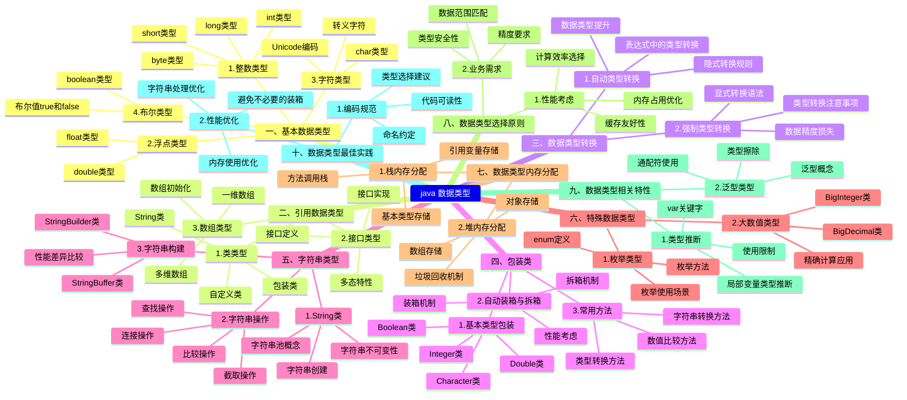

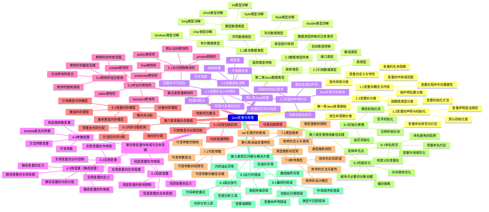

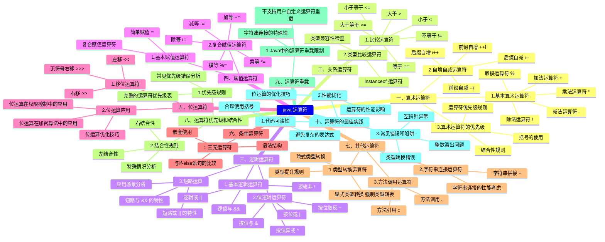

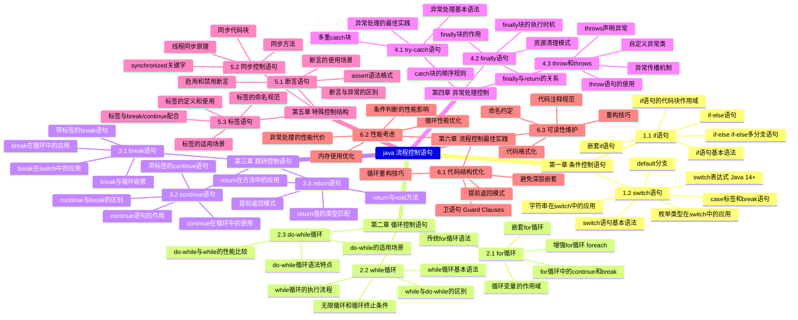
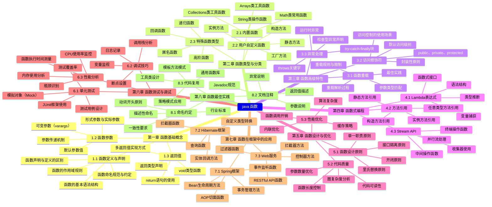


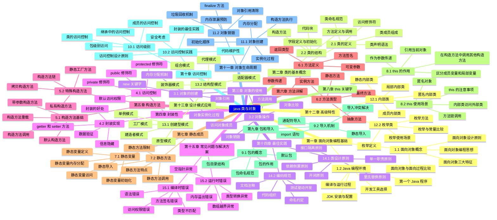

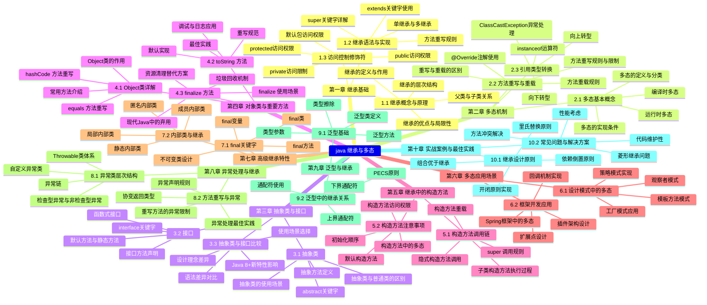

```mermaid
mindmap
java 高级面向对象特性
    第一章 封装与访问控制
         1.1 访问修饰符详解
              public访问级别及应用场景
              protected访问级别及继承关系
              默认包访问级别及包内可见性
              private访问级别及数据隐藏
              访问修饰符的组合使用策略

         1.2 封装的最佳实践
              字段私有化原则
              Getter和Setter方法设计
              方法封装与实现隐藏
              不变性设计与final关键字
              构建器模式与对象创建封装

    第二章 继承与多态
         2.1 继承机制深入
              单继承与多继承限制
              方法重写规则与@Override注解
              super关键字的使用场景
              构造方法调用链
              继承层次设计与is-a关系

         2.2 多态实现原理
              编译时多态与运行时多态
              方法重载与方法重写区别
              动态方法分派机制
              向上转型与向下转型
              instanceof运算符使用

         2.3 抽象类与接口
              抽象类定义与抽象方法
              接口定义与默认方法
              接口的多重实现
              函数式接口与Lambda表达式
              接口与抽象类的选择策略

    第三章 高级类设计
         3.1 内部类与嵌套类
              成员内部类与外部类关系
              局部内部类与匿名内部类
              静态嵌套类使用场景
              Lambda表达式替代匿名类
              内部类的序列化问题

         3.2 枚举类型
              枚举定义与基本用法
              枚举构造方法与字段
              枚举实现接口
              枚举与单例模式
              EnumSet和EnumMap使用

         3.3 注解机制
              元注解类型详解
              自定义注解定义
              注解处理器开发
              运行时注解与编译时注解
              常用框架注解分析

    第四章 泛型编程
         4.1 泛型基础
              类型参数与类型擦除
              泛型类与泛型接口
              泛型方法定义
              通配符类型使用
              类型边界与约束

         4.2 高级泛型特性
              泛型与继承关系
              泛型数组限制与解决方案
              泛型在反射中的应用
              泛型与可变参数
              泛型最佳实践与陷阱

    第五章 异常处理机制
         5.1 异常体系结构
              Throwable类层次结构
              检查异常与非检查异常
              自定义异常类设计
              异常链与原因传递
              异常处理性能考虑

         5.2 异常处理最佳实践
              try-catch-finally块使用
              try-with-resources语句
              异常传播与捕获策略
              日志记录与异常信息
              防御性编程技巧

    第六章 反射机制
         6.1 反射基础
              Class对象获取方式
              字段访问与修改
              方法调用与参数传递
              构造方法实例化
              数组反射操作

         6.2 高级反射应用
              注解反射处理
              泛型类型信息获取
              动态代理机制
              方法句柄与VarHandle
              反射性能优化

    第七章 对象生命周期
         7.1 对象创建与初始化
              构造方法设计原则
              静态初始化块
              实例初始化块
              对象创建模式
              单例模式实现方式

         7.2 垃圾回收与内存管理
              可达性分析算法
              引用类型：强引用、软引用、弱引用、虚引用
              finalize方法使用与限制
              内存泄漏检测与预防
              System.gc 与Runtime.gc 

    第八章 设计模式应用
         8.1 创建型模式
              工厂方法模式
              抽象工厂模式
              建造者模式
              原型模式
              单例模式

         8.2 结构型模式
              适配器模式
              装饰器模式
              代理模式
              外观模式
              组合模式

         8.3 行为型模式
              策略模式
              观察者模式
              模板方法模式
              命令模式
              状态模式

    第九章 函数式编程
         9.1 Lambda表达式
              函数式接口概念
              Lambda语法与类型推断
              方法引用使用
              变量捕获规则
              高阶函数应用

         9.2 Stream API
              流创建与操作
              中间操作与终端操作
              收集器使用
              并行流处理
              自定义收集器实现

    第十章 模块化系统
         10.1 Java模块系统
              模块声明与描述符
              模块路径与类路径
              服务加载机制
              模块化迁移策略
              模块化最佳实践

         10.2 依赖管理
              模块依赖解析
              可读性约束
              封装与导出控制
              模块化测试策略
              第三方库模块化

    第十一章 序列化与反序列化
         11.1 序列化机制
              Serializable接口使用
              序列化版本UID
              自定义序列化过程
              外部化接口Externalizable
              序列化代理模式

         11.2 序列化安全与性能
              序列化安全考虑
              性能优化技巧
              替代序列化方案
              JSON与XML序列化
              协议缓冲区使用

    第十二章 元编程与代码生成
         12.1 注解处理器
              注解处理API
              代码生成技术
              编译时元编程
              Lombok原理分析
              自定义代码生成器

         12.2 动态代码生成
              Java Compiler API
              字节码操作库
              ASM框架使用
              Javassist应用
              运行时代码生成

```

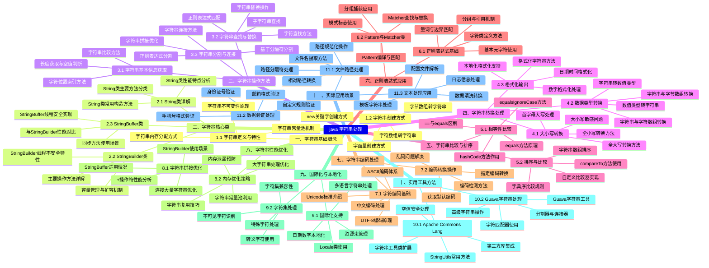

```mermaid
mindmap
java 集合框架
    1. 集合框架概述
         1.1 集合框架体系结构
              1.1.1 Collection接口层次
              1.1.2 Map接口层次
              1.1.3 迭代器模式
         1.2 集合框架设计原则
              1.2.1 接口与实现分离
              1.2.2 算法与数据结构分离
              1.2.3 类型安全与泛型

    2. Collection接口
         2.1 Collection核心方法
              2.1.1 基本操作
              2.1.2 批量操作
              2.1.3 数组转换
         2.2 Collection子接口
              2.2.1 List接口
              2.2.2 Set接口
              2.2.3 Queue接口

    3. List接口及其实现
         3.1 ArrayList
              3.1.1 内部数组实现
              3.1.2 动态扩容机制
              3.1.3 性能分析
         3.2 LinkedList
              3.2.1 双向链表结构
              3.2.2 节点操作
              3.2.3 与ArrayList比较
         3.3 Vector
              3.3.1 线程安全特性
              3.3.2 Stack实现
              3.3.3 与现代集合比较
         3.4 CopyOnWriteArrayList
              3.4.1 写时复制机制
              3.4.2 并发场景应用
              3.4.3 适用场景分析

    4. Set接口及其实现
         4.1 HashSet
              4.1.1 哈希表实现原理
              4.1.2 哈希冲突解决
              4.1.3 元素唯一性保证
         4.2 LinkedHashSet
              4.2.1 链表维护顺序
              4.2.2 访问顺序特性
              4.2.3 性能特点
         4.3 TreeSet
              4.3.1 红黑树数据结构
              4.3.2 自然排序与比较器
              4.3.3 有序集合操作
         4.4 EnumSet
              4.4.1 位向量实现
              4.4.2 枚举类型优化
              4.4.3 性能优势

    5. Queue接口及其实现
         5.1 Queue基本操作
              5.1.1 入队出队方法
              5.1.2 检查方法
              5.1.3 阻塞与非阻塞操作
         5.2 PriorityQueue
              5.2.1 堆数据结构
              5.2.2 优先级排序
              5.2.3 应用场景
         5.3 ArrayDeque
              5.3.1 循环数组实现
              5.3.2 双端队列操作
              5.3.3 性能优化
         5.4 阻塞队列
              5.4.1 ArrayBlockingQueue
              5.4.2 LinkedBlockingQueue
              5.4.3 PriorityBlockingQueue
              5.4.4 SynchronousQueue

    6. Map接口及其实现
         6.1 HashMap
              6.1.1 哈希表结构
              6.1.2 链表转红黑树
              6.1.3 扩容机制
         6.2 LinkedHashMap
              6.2.1 访问顺序与插入顺序
              6.2.2 LRU缓存实现
              6.2.3 链表维护机制
         6.3 TreeMap
              6.3.1 红黑树实现
              6.3.2 键排序特性
              6.3.3 范围查询操作
         6.4 ConcurrentHashMap
              6.4.1 分段锁机制
              6.4.2 CAS操作
              6.4.3 并发性能优化
         6.5 WeakHashMap
              6.5.1 弱引用机制
              6.5.2 垃圾回收影响
              6.5.3 缓存应用

    7. 迭代器与比较器
         7.1 Iterator接口
              7.1.1 迭代器模式
              7.1.2 fail-fast机制
              7.1.3 并发修改异常
         7.2 ListIterator
              7.2.1 双向遍历
              7.2.2 修改操作
              7.2.3 索引访问
         7.3 Comparable接口
              7.3.1 自然排序
              7.3.2 compareTo方法
              7.3.3 实现规范
         7.4 Comparator接口
              7.4.1 定制排序
              7.4.2 多条件排序
              7.4.3 函数式编程应用

    8. 工具类与算法
         8.1 Collections工具类
              8.1.1 排序与搜索
              8.1.2 同步包装器
              8.1.3 不可变集合
         8.2 Arrays工具类
              8.2.1 数组操作
              8.2.2 并行排序
              8.2.3 流操作
         8.3 集合算法
              8.3.1 二分查找
              8.3.2 洗牌算法
              8.3.3 频率统计

    9. 并发集合
         9.1 并发集合概述
              9.1.1 线程安全保证
              9.1.2 性能考虑
              9.1.3 使用场景
         9.2 CopyOnWrite集合
              9.2.1 写时复制原理
              9.2.2 适用场景
              9.2.3 内存开销
         9.3 并发队列
              9.3.1 ConcurrentLinkedQueue
              9.3.2 BlockingQueue实现
              9.3.3 生产者消费者模式

    10. 性能分析与优化
         10.1 时间复杂度分析
              10.1.1 各集合操作复杂度
              10.1.2 实际性能测试
              10.1.3 内存使用分析
         10.2 集合选择策略
              10.2.1 根据需求选择集合
              10.2.2 容量规划
              10.2.3 初始化参数调优
         10.3 最佳实践
              10.3.1 避免装箱拆箱
              10.3.2 合理使用泛型
              10.3.3 并发编程注意事项

    11. Java 8+新特性
         11.1 Stream API与集合
              11.1.1 流操作
              11.1.2 并行流
              11.1.3 收集器
         11.2 函数式接口应用
              11.2.1 forEach方法
              11.2.2 removeIf方法
              11.2.3 compute方法
         11.3 新的集合工厂方法
              11.3.1 List.of 
              11.3.2 Set.of 
              11.3.3 Map.of 

    12. 集合框架扩展
         12.1 自定义集合实现
              12.1.1 扩展抽象类
              12.1.2 实现接口
              12.1.3 装饰器模式
         12.2 第三方集合库
              12.2.1 Google Guava
              12.2.2 Apache Commons Collections
              12.2.3 Eclipse Collections

```


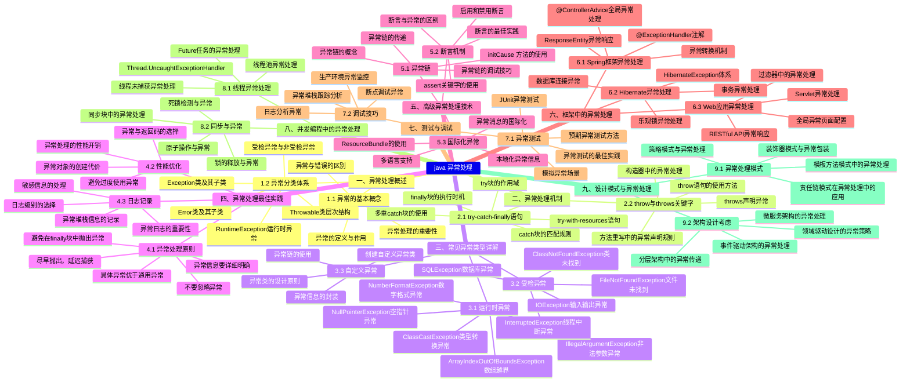

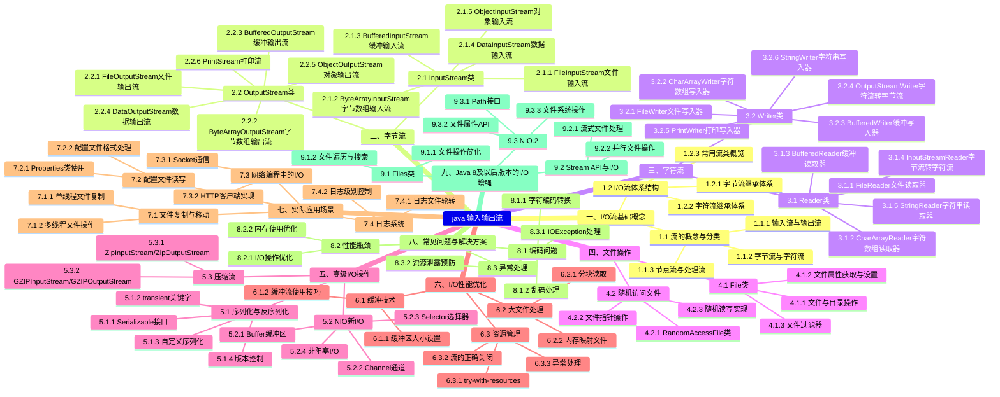


```mermaid
mindmap
java 多线程编程
    第一章 多线程基础概念
         1.1 进程与线程
              1.1.1 进程定义与特征
              1.1.2 线程定义与特征
              1.1.3 进程与线程的区别
              1.1.4 多线程的优势与挑战

         1.2 Java线程模型
              1.2.1 线程生命周期
              1.2.2 线程优先级
              1.2.3 守护线程
              1.2.4 线程组

    第二章 线程创建与管理
         2.1 线程创建方式
              2.1.1 继承Thread类
              2.1.2 实现Runnable接口
              2.1.3 实现Callable接口
              2.1.4 使用线程池创建

         2.2 线程控制方法
              2.2.1 start 方法
              2.2.2 run 方法
              2.2.3 sleep 方法
              2.2.4 yield 方法
              2.2.5 join 方法
              2.2.6 interrupt 方法

         2.3 线程状态管理
              2.3.1 新建状态
              2.3.2 就绪状态
              2.3.3 运行状态
              2.3.4 阻塞状态
              2.3.5 等待状态
              2.3.6 终止状态

    第三章 线程同步与锁机制
         3.1 同步问题概述
              3.1.1 竞态条件
              3.1.2 数据竞争
              3.1.3 死锁
              3.1.4 活锁
              3.1.5 饥饿

         3.2 synchronized关键字
              3.2.1 同步方法
              3.2.2 同步代码块
              3.2.3 静态同步方法
              3.2.4 对象锁与类锁

         3.3 Lock接口
              3.3.1 ReentrantLock
              3.3.2 ReadWriteLock
              3.3.3 StampedLock
              3.3.4 Condition接口

         3.4 原子操作类
              3.4.1 AtomicInteger
              3.4.2 AtomicLong
              3.4.3 AtomicReference
              3.4.4 AtomicBoolean

    第四章 线程间通信
         4.1 等待/通知机制
              4.1.1 wait 方法
              4.1.2 notify 方法
              4.1.3 notifyAll 方法
              4.1.4 生产者-消费者模式

         4.2 线程局部变量
              4.2.1 ThreadLocal原理
              4.2.2 ThreadLocal使用场景
              4.2.3 InheritableThreadLocal

         4.3 阻塞队列
              4.3.1 ArrayBlockingQueue
              4.3.2 LinkedBlockingQueue
              4.3.3 PriorityBlockingQueue
              4.3.4 SynchronousQueue

    第五章 线程池技术
         5.1 线程池概述
              5.1.1 线程池优势
              5.1.2 线程池核心参数
              5.1.3 线程池工作流程

         5.2 Executor框架
              5.2.1 Executor接口
              5.2.2 ExecutorService接口
              5.2.3 ScheduledExecutorService

         5.3 常用线程池
              5.3.1 FixedThreadPool
              5.3.2 CachedThreadPool
              5.3.3 SingleThreadExecutor
              5.3.4 ScheduledThreadPool

         5.4 ThreadPoolExecutor详解
              5.4.1 核心参数配置
              5.4.2 拒绝策略
              5.4.3 线程工厂
              5.4.4 监控与调优

    第六章 并发集合类
         6.1 并发List
              6.1.1 CopyOnWriteArrayList
              6.1.2 Vector

         6.2 并发Set
              6.2.1 CopyOnWriteArraySet
              6.2.2 ConcurrentSkipListSet

         6.3 并发Map
              6.3.1 ConcurrentHashMap
              6.3.2 ConcurrentSkipListMap

         6.4 并发Queue
              6.4.1 ConcurrentLinkedQueue
              6.4.2 BlockingQueue实现类

    第七章 高级并发工具
         7.1 CountDownLatch
              7.1.1 工作原理
              7.1.2 使用场景
              7.1.3 示例代码

         7.2 CyclicBarrier
              7.2.1 工作原理
              7.2.2 与CountDownLatch区别
              7.2.3 使用场景

         7.3 Semaphore
              7.3.1 信号量原理
              7.3.2 公平与非公平
              7.3.3 使用场景

         7.4 Exchanger
              7.4.1 数据交换机制
              7.4.2 使用场景

         7.5 Phaser
              7.5.1 阶段器概念
              7.5.2 多阶段任务处理

    第八章 异步编程
         8.1 Future模式
              8.1.1 Future接口
              8.1.2 FutureTask实现
              8.1.3 异步结果获取

         8.2 CompletableFuture
              8.2.1 创建方式
              8.2.2 组合操作
              8.2.3 异常处理
              8.2.4 回调函数

         8.3 Fork/Join框架
              8.3.1 工作窃取算法
              8.3.2 ForkJoinPool
              8.3.3 RecursiveTask
              8.3.4 RecursiveAction

    第九章 性能优化与最佳实践
         9.1 性能监控
              9.1.1 线程状态监控
              9.1.2 死锁检测
              9.1.3 性能分析工具

         9.2 内存模型
              9.2.1 JMM概述
              9.2.2 主内存与工作内存
              9.2.3 内存屏障
              9.2.4 happens-before原则

         9.3 volatile关键字
              9.3.1 可见性保证
              9.3.2 禁止指令重排序
              9.3.3 使用场景

         9.4 最佳实践
              9.4.1 避免死锁
              9.4.2 减少锁竞争
              9.4.3 合理使用线程池
              9.4.4 异常处理策略

    第十章 实际应用场景
         10.1 Web服务器并发处理
              10.1.1 Servlet多线程
              10.1.2 Spring异步处理

         10.2 数据库连接池
              10.2.1 连接管理
              10.2.2 并发访问控制

         10.3 消息队列处理
              10.3.1 生产者实现
              10.3.2 消费者实现

         10.4 定时任务调度
              10.4.1 Timer与TimerTask
              10.4.2 ScheduledExecutorService
              10.4.3 Quartz框架集成

```

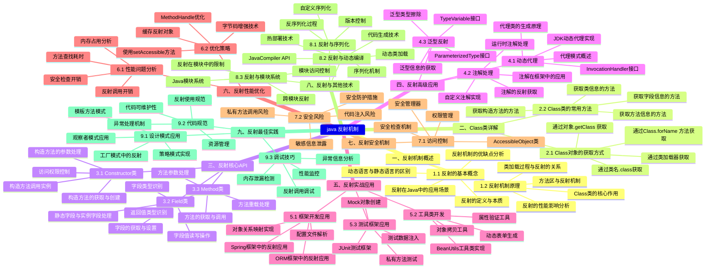
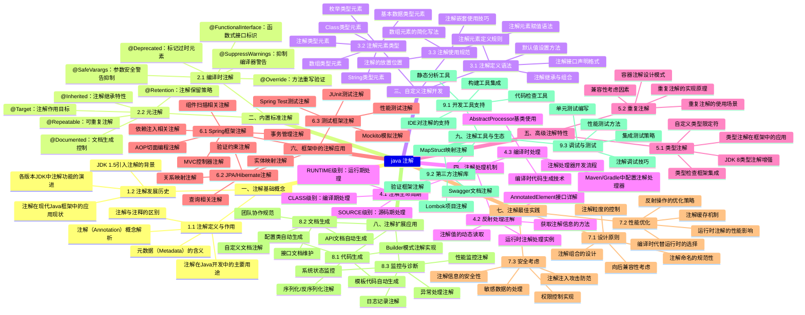

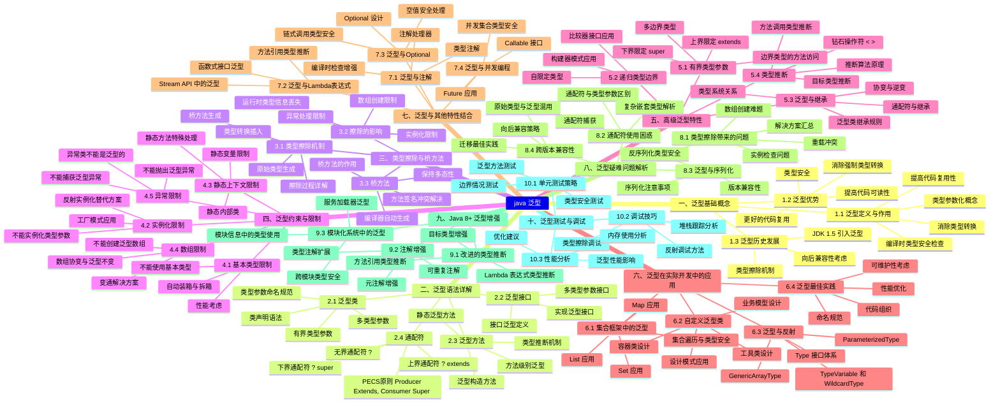

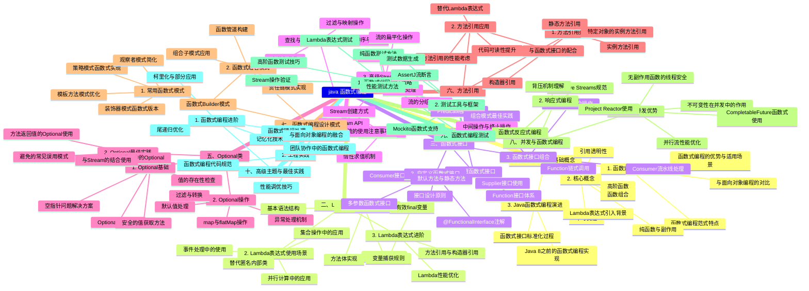

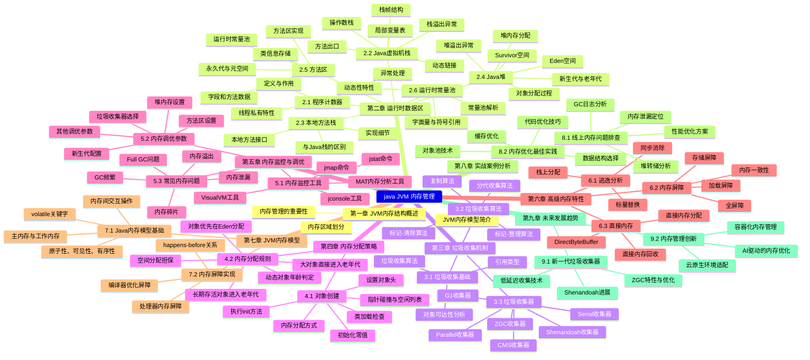

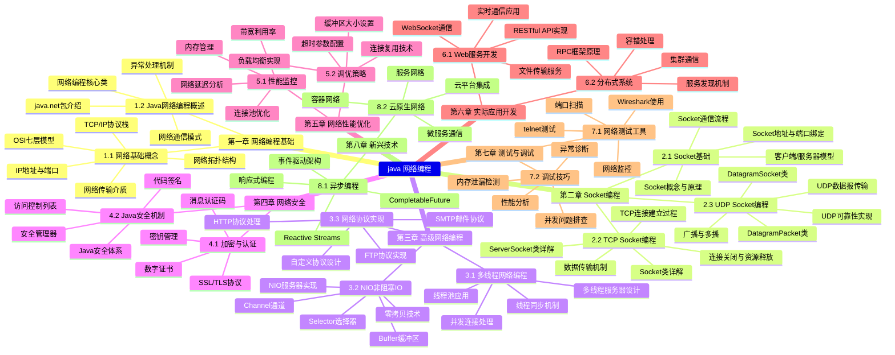

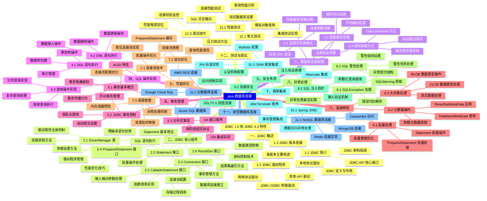

```mermaid
mindmap
java 开发工具
    集成开发环境 IDE 

         IntelliJ IDEA
              社区版与旗舰版功能对比
              智能代码补全与重构功能
              调试器与断点设置
              版本控制集成
              插件生态系统
              性能分析与优化工具

         Eclipse
              工作空间与项目结构
              透视图与视图管理
              Java开发工具包 JDT 
              插件开发环境 PDE 
              团队协作功能
              远程调试配置

         NetBeans
              模块化架构设计
              GUI构建器 Matisse 
              Maven项目支持
              Web服务开发工具
              性能监控工具
              移动应用开发支持

    构建工具

         Maven
              项目对象模型 POM 
              依赖管理机制
              构建生命周期
              插件系统架构
              多模块项目管理
              仓库管理与配置

         Gradle
              Groovy与Kotlin DSL
              增量构建机制
              任务依赖图
              构建缓存优化
              多项目构建配置
              自定义插件开发

         Ant
              构建文件结构
              目标与任务定义
              属性文件管理
              条件执行逻辑
              文件集操作
              自定义任务开发

    版本控制系统

         Git
              分布式版本控制原理
              分支管理与合并策略
              提交历史操作
              标签与发布管理
              钩子脚本配置
              子模块管理

         SVN
              集中式版本控制架构
              分支与标签创建
              属性管理
              外部引用配置
              访问权限控制
              备份与恢复策略

    测试工具

         JUnit
              测试注解详解
              断言方法分类
              测试生命周期
              参数化测试
              测试套件组织
              扩展模型架构

         TestNG
              测试配置方法
              依赖测试管理
              数据驱动测试
              并行测试执行
              测试分组策略
              报告生成机制

         Mockito
              Mock对象创建
              行为验证方法
              参数匹配器
              间谍对象使用
              注解驱动测试
              自定义答案实现

    性能分析工具

         VisualVM
              监控仪表板功能
              线程分析工具
              内存堆分析
              CPU性能分析
              快照比较功能
              插件扩展机制

         JProfiler
              调用树分析
              内存分配跟踪
              数据库查询监控
              JVM遥测数据
              离线分析功能
              企业级功能

         YourKit
              低开销分析技术
              内存泄漏检测
              CPU热点分析
              线程转储分析
              集成开发环境插件
              生产环境监控

    持续集成工具

         Jenkins
              流水线脚本编写
              节点与代理配置
              插件管理系统
              构建触发器设置
              制品管理策略
              分布式构建架构

         TeamCity
              项目配置模板
              构建链管理
              代码质量跟踪
              云集成支持
              权限管理系统
              报告仪表板

    代码质量工具

         SonarQube
              代码质量度量
              技术债务计算
              安全漏洞检测
              重复代码识别
              自定义规则开发
              多语言支持

         Checkstyle
              代码规范检查
              自定义配置规则
              模块化架构
              集成构建工具
              报告生成格式
              排除机制

         PMD
              代码问题检测
              自定义规则编写
              复制粘贴检测
              设计模式验证
              性能规则集
              安全规则检查

    依赖管理工具

         Nexus
              仓库类型分类
              代理配置管理
              组件上传下载
              权限控制系统
              清理策略设置
              高可用配置

         JFrog Artifactory
              通用仓库管理
              元数据管理
              构建信息集成
              分发网络配置
              安全扫描集成
              云原生支持

    文档生成工具

         Javadoc
              文档注释格式
              标签使用规范
              文档生成配置
              自定义文档样式
              链接引用管理
              多版本文档

         Swagger
              API规范定义
              注解驱动文档
              交互式文档界面
              代码生成功能
              验证规则配置
              多格式输出

    部署工具

         Docker
              镜像构建优化
              容器编排管理
              网络配置策略
              存储卷管理
              安全最佳实践
              监控日志集成

         Kubernetes
              Pod生命周期管理
              服务发现机制
              负载均衡配置
              自动扩缩容
              配置管理
              存储编排

    数据库工具

         Hibernate
              对象关系映射
              查询语言 HQL 
              缓存机制
              事务管理
              连接池配置
              二级缓存集成

         MyBatis
              SQL映射配置
              动态SQL语法
              结果集映射
              插件拦截器
              缓存实现机制
              分页插件使用

    消息队列工具

         Apache Kafka
              主题分区管理
              生产者配置
              消费者组管理
              流处理API
              连接器框架
              监控指标收集

         RabbitMQ
              交换机类型
              队列绑定策略
              消息确认机制
              集群配置
              插件管理系统
              监控管理界面

```

```mermaid
mindmap
java 常用框架
    1. Spring框架
         1.1 Spring Core
              依赖注入 DI 原理与实现
              控制反转 IoC 容器
              Bean生命周期管理
              Spring配置方式 XML/注解/Java Config 
              AOP编程与实现机制
              Spring表达式语言 SpEL 

         1.2 Spring MVC
              MVC架构模式解析
              控制器设计与实现
              视图解析器配置
              数据绑定与验证
              拦截器与过滤器
              RESTful API开发

         1.3 Spring Boot
              自动配置原理
              Starter依赖管理
              嵌入式Web服务器
              配置属性与Profile
              Actuator监控端点
              部署与打包策略

         1.4 Spring Data
              JPA集成与配置
              Repository模式实现
              查询方法与命名约定
              事务管理机制
              数据访问异常处理
              多数据源配置

         1.5 Spring Security
              认证与授权机制
              安全过滤器链
              OAuth2集成
              JWT令牌管理
              方法级安全控制
              密码加密策略

    2. 持久层框架
         2.1 MyBatis
              SQL映射文件配置
              动态SQL语法
              结果集映射机制
              缓存策略与实现
              插件开发与扩展
              与Spring集成方式

         2.2 Hibernate
              ORM映射原理
              实体关系映射 一对一、一对多、多对多 
              HQL查询语言
              缓存机制 一级、二级缓存 
              事务管理与并发控制
              性能优化策略

         2.3 JPA规范
              Entity实体定义规范
              实体关系映射注解
              JPQL查询语法
              标准查询API
              实体生命周期管理
              锁机制与并发处理

    3. 微服务框架
         3.1 Spring Cloud
              服务注册与发现 Eureka 
              客户端负载均衡 Ribbon 
              服务容错保护 Hystrix 
              配置中心 Config 
              API网关 Zuul/Gateway 
              服务调用 Feign/OpenFeign 

         3.2 Dubbo
              RPC通信原理
              服务暴露与引用
              集群容错策略
              负载均衡算法
              服务治理机制
              监控与管理

    4. Web框架
         4.1 Struts2
              核心控制器原理
              拦截器栈配置
              值栈与OGNL表达式
              类型转换机制
              输入验证框架
              文件上传处理

         4.2 JSF
              组件树模型
              生命周期管理
              托管Bean配置
              导航规则定义
              自定义组件开发
              与Ajax集成

    5. 测试框架
         5.1 JUnit
              测试用例编写规范
              断言方法使用
              测试套件组织
              参数化测试
              测试运行器配置
              与Mockito集成

         5.2 TestNG
              测试分组管理
              依赖测试配置
              参数化数据驱动
              并行测试执行
              测试报告生成
              与Spring集成测试

    6. 构建工具
         6.1 Maven
              POM文件结构解析
              依赖管理机制
              生命周期与插件
              多模块项目管理
              仓库配置与部署
              与IDE集成

         6.2 Gradle
              构建脚本语法
              任务定义与执行
              依赖配置管理
              多项目构建
              插件开发与使用
              性能优化技巧

    7. 其他重要框架
         7.1 日志框架
              Log4j2配置与使用
              SLF4J门面模式
              日志级别与输出
              异步日志记录
              日志格式自定义
              性能监控集成

         7.2 消息队列集成
              JMS规范与实现
              ActiveMQ配置
              RabbitMQ集成
              Kafka客户端开发
              消息确认机制
              事务消息处理

         7.3 缓存框架
              Redis客户端集成
              Memcached配置
              本地缓存实现
              缓存穿透与雪崩
              数据一致性保证
              性能监控指标

         7.4 任务调度
              Quartz调度器
              Spring Task配置
              分布式任务调度
              任务持久化存储
              集群环境部署
              监控与管理

         7.5 模板引擎
              Thymeleaf语法
              FreeMarker配置
              Velocity模板
              模板缓存机制
              国际化支持
              与Spring集成

```

```mermaid
mindmap
Java 新版本特性
    Java 8 新特性
         Lambda 表达式
              语法与基本用法
              函数式接口
              方法引用与构造器引用
              变量作用域与闭包

         函数式编程
              java.util.function 包
              Stream API
              Optional 类
              接口默认方法与静态方法

         新的日期时间 API
              LocalDate、LocalTime、LocalDateTime
              Instant、Duration、Period
              DateTimeFormatter
              时区处理

         其他重要特性
              重复注解
              类型注解
              Nashorn JavaScript 引擎
              并行数组排序

    Java 9 新特性
         模块系统 Jigsaw 
              模块声明与描述符
              模块路径与类路径
              模块化JDK
              服务加载机制

         JShell
              REPL 环境使用
              命令与快捷键
              脚本执行
              调试功能

         集合工厂方法
              List.of  、Set.of  、Map.of  
              不可变集合
              空集合处理

         接口私有方法
              私有方法定义
              代码复用优化
              接口设计模式

         其他改进
              改进的 Stream API
              多版本 JAR 文件
              HTTP/2 客户端
              进程 API 改进

    Java 10 新特性
         局部变量类型推断
              var 关键字
              使用场景与限制
              编译器处理机制

         垃圾回收改进
              G1 垃圾回收器优化
              并行 Full GC
              垃圾回收接口统一

         其他特性
              应用程序类数据共享
              线程局部管控
              根证书更新

    Java 11 新特性
         HTTP Client API
              同步与异步请求
              WebSocket 支持
              HTTP/2 协议支持

         字符串处理增强
              isBlank  、lines  、repeat   方法
              strip  、stripLeading  、stripTrailing   方法

         新的垃圾回收器
              Epsilon 垃圾回收器
              ZGC 垃圾回收器

         其他重要更新
              局部变量语法扩展
              飞行记录器
              TLS 1.3 支持
              移除 Java EE 和 CORBA 模块

    Java 12 新特性
         Switch 表达式
              箭头语法
              多值匹配
              yield 关键字

         微基准测试套件
              JMH 集成
              性能测试框架

         Shenandoah 垃圾回收器
              低延迟垃圾回收
              并发压缩算法

         其他改进
              默认类数据共享归档文件
              可中止的 G1 Mixed GC

    Java 13 新特性
         文本块
              多行字符串字面量
              格式化控制
              转义序列处理

         动态 CDS 归档
              应用程序类数据共享
              归档文件创建与使用

         其他更新
              重新实现旧版 Socket API
              ZGC 改进

    Java 14 新特性
         instanceof 模式匹配
              模式变量
              类型测试与转换

         记录类 Records 
              数据载体类
              自动生成方法
              构造器验证

         其他特性
              有用的 NullPointerExceptions
              打包工具
              外部内存访问 API

    Java 15 新特性
         密封类
              类层次控制
              permits 子句
              密封接口

         隐藏类
              动态类生成
              反射限制
              框架优化

         其他更新
              文本块正式版
              ZGC 生产就绪
              Shenandoah 生产就绪

    Java 16 新特性
         记录类正式版
              记录类语法
              序列化处理
              模式匹配集成

         instanceof 模式匹配正式版
              模式变量作用域
              编译器优化

         其他特性
              打包工具改进
              外部链接器 API
              向量 API

    Java 17 新特性
         密封类正式版
              密封类语法
              模式匹配增强
              反射 API 支持

         其他长期支持特性
              上下文特定的反序列化过滤器
              伪随机数生成器
              新的 macOS 渲染管道

    Java 18 新特性
         简单 Web 服务器
              jwebserver 工具
              静态文件服务
              HTTP API

         其他改进
              UTF-8 作为默认字符集
              代码片段
              互联网地址解析 SPI

    Java 19 新特性
         虚拟线程
              轻量级线程模型
              结构化并发
              性能优化

         其他特性
              外部函数和内存 API
              Vector API 第四次孵化
              Linux/RISC-V 端口

    Java 21 新特性
         虚拟线程正式版
              线程池管理
              调试支持
              性能监控

         记录模式
              记录解构
              嵌套模式匹配
              类型推断

         其他重要更新
              分代 ZGC
              字符串模板
              有序集合

    Java 新版本发展趋势
         语言特性演进
              模式匹配的持续增强
              数据类别的完善
              并发编程改进

         性能优化方向
              垃圾回收器发展
              即时编译器改进
              内存管理优化

         开发体验提升
              工具链完善
              调试支持增强
              部署简化

         生态系统整合
              云原生支持
              微服务架构
              容器化部署

```

```mermaid
mindmap
java 应用领域
    企业级应用开发
         Java EE 平台
              Servlet 和 JSP 技术
              EJB 企业级 Java Bean
              JMS 消息服务
              JPA 持久化 API
              Web 服务开发

         企业级框架
              Spring Framework 生态系统
              Hibernate ORM 框架
              Struts MVC 框架
              MyBatis 数据持久层

    移动应用开发
         Android 开发
              Android SDK 和开发工具
              Android 应用组件
              移动 UI 设计
              移动数据存储

         跨平台移动开发
              React Native 框架
              Flutter 开发
              混合应用开发技术

    Web 应用开发
         服务器端开发
              Spring Boot 微服务
              RESTful API 设计
              Web 安全技术
              会话管理和认证

         前端技术集成
              JavaScript 交互
              AJAX 异步通信
              模板引擎使用
              单页面应用开发

    大数据处理
         大数据框架
              Hadoop 生态系统
              Spark 计算引擎
              Flink 流处理
              大数据存储技术

         数据分析
              数据挖掘算法
              机器学习库
              数据可视化
              实时数据处理

    云计算和微服务
         云原生开发
              Docker 容器化
              Kubernetes 编排
              云平台部署
              服务网格技术

         微服务架构
              服务发现与注册
              配置管理
              熔断器模式
              API 网关设计

    桌面应用开发
         GUI 开发
              Swing 图形界面
              JavaFX 现代 UI
              AWT 基础组件
              事件处理机制

         桌面应用框架
              Eclipse RCP
              NetBeans 平台
              跨平台桌面应用
              系统集成技术

    嵌入式系统
         物联网应用
              嵌入式 Java
              传感器数据处理
              设备通信协议
              边缘计算

         智能设备
              智能家居系统
              工业自动化
              车载信息系统
              可穿戴设备

    游戏开发
         游戏引擎
              LibGDX 框架
              jMonkeyEngine
              2D/3D 图形渲染
              物理引擎集成

         游戏开发技术
              游戏循环设计
              碰撞检测算法
              音效处理
              多人游戏网络

    科学计算
         数值计算
              矩阵运算库
              统计分析
              数值模拟
              科学可视化

         研究工具
              数据建模
              算法实现
              科研软件
              学术计算

    金融科技
         金融系统
              交易平台开发
              风险管理系统
              支付系统
              区块链应用

         量化分析
              金融算法
              高频交易
              投资分析
              金融数据接口

    教育领域
         教学工具
              在线学习平台
              编程教学软件
              虚拟实验室
              教育管理系统

         学术研究
              计算机科学教育
              算法可视化
              编程竞赛平台
              学术项目开发

```

```mermaid
mindmap
java 最佳实践
    一、代码规范与风格
         1. 命名约定
              类名与接口名使用大驼峰命名法
              变量名与方法名使用小驼峰命名法
              常量名使用全大写加下划线
              包名使用全小写字母

         2. 代码格式
              适当的缩进与空格使用
              大括号放置规范
              行长度限制与换行规则
              注释编写规范

         3. 文档注释
              Javadoc标签使用规范
              类、方法、字段注释要求
              文档生成与维护

    二、面向对象设计原则
         1. SOLID原则
              单一职责原则（SRP）
              开闭原则（OCP）
              里氏替换原则（LSP）
              接口隔离原则（ISP）
              依赖倒置原则（DIP）

         2. 设计模式应用
              创建型模式：单例、工厂、建造者
              结构型模式：适配器、装饰器、代理
              行为型模式：观察者、策略、模板方法

         3. 封装与抽象
              访问控制修饰符合理使用
              接口与抽象类设计
              信息隐藏原则

    三、异常处理
         1. 异常分类与使用
              受检异常与非受检异常
              自定义异常设计
              异常链的使用

         2. 异常处理策略
              try-catch-finally最佳实践
              try-with-resources使用
              异常日志记录规范

         3. 异常性能优化
              避免在循环中抛出异常
              异常创建开销控制
              异常处理性能考量

    四、集合框架使用
         1. 集合选择策略
              List、Set、Map特性对比
              线程安全集合使用
              不可变集合应用

         2. 集合操作优化
              迭代器使用规范
              流式操作与Lambda表达式
              集合初始化与容量设置

         3. 性能考量
              集合遍历性能优化
              内存使用效率
              并发集合使用场景

    五、并发编程
         1. 线程管理
              线程创建与生命周期管理
              线程池配置与使用
              线程安全设计

         2. 同步机制
              synchronized关键字使用
              Lock接口及其实现
              原子操作类应用

         3. 并发工具类
              CountDownLatch、CyclicBarrier
              Semaphore、Exchanger
              Concurrent集合使用

    六、内存管理
         1. 垃圾回收机制
              垃圾回收算法理解
              内存分配策略
              GC调优参数

         2. 内存泄漏预防
              对象引用管理
              缓存使用规范
              资源释放保证

         3. 性能监控
              JVM内存监控工具
              内存分析技术
              性能瓶颈识别

    七、IO与NIO
         1. 传统IO操作
              字节流与字符流选择
              缓冲流使用优化
              资源关闭管理

         2. NIO编程
              Channel与Buffer使用
              Selector多路复用
              非阻塞IO处理

         3. 文件操作
              文件读写最佳实践
              文件锁使用
              大文件处理策略

    八、性能优化
         1. 代码级优化
              循环优化技巧
              字符串操作优化
              对象创建与复用

         2. JVM调优
              堆内存配置
              GC策略选择
              JIT编译器优化

         3. 应用级优化
              数据库连接优化
              缓存策略设计
              算法复杂度控制

    九、测试与调试
         1. 单元测试
              JUnit框架使用
              测试用例设计
              模拟对象应用

         2. 集成测试
              测试环境搭建
              自动化测试实施
              性能测试方法

         3. 调试技巧
              日志系统配置
              断点调试技术
              问题定位方法

    十、安全编程
         1. 输入验证
              SQL注入防护
              XSS攻击预防
              文件上传安全

         2. 认证与授权
              密码安全存储
              会话管理安全
              权限控制设计

         3. 加密与安全传输
              数据加密算法
              SSL/TLS配置
              密钥管理规范

    十一、构建与部署
         1. 构建工具使用
              Maven依赖管理
              Gradle构建配置
              持续集成实践

         2. 部署策略
              环境配置管理
              容器化部署
              监控与告警

         3. 版本控制
              Git工作流规范
              分支管理策略
              代码审查流程

    十二、现代Java特性
         1. 新版本特性应用
              Lambda表达式使用
              Stream API应用
              模块系统使用

         2. 函数式编程
              函数式接口设计
              方法引用使用
              Optional类应用

         3. 响应式编程
              Reactive Streams
              Project Reactor
              异步编程模式

```

```mermaid
mindmap
java 设计模式
    一、设计模式概述
         1. 设计模式概念
              设计模式定义与起源
              设计模式分类体系
              设计模式六大原则
              设计模式应用场景

         2. 设计模式重要性
              代码复用性提升
              系统可维护性增强
              开发效率提高
              团队协作标准化

    二、创建型模式
         1. 单例模式
              饿汉式实现
              懒汉式实现
              双重检查锁定
              静态内部类实现
              枚举单例实现
              单例模式应用场景

         2. 工厂方法模式
              简单工厂模式
              工厂方法模式
              抽象工厂模式
              工厂模式优缺点
              工厂模式应用实例

         3. 建造者模式
              建造者模式结构
              建造者模式实现
              建造者与工厂模式区别
              建造者模式应用场景

         4. 原型模式
              浅拷贝与深拷贝
              Cloneable接口使用
              原型模式实现方式
              原型模式应用实例

    三、结构型模式
         1. 适配器模式
              类适配器
              对象适配器
              接口适配器
              适配器模式应用

         2. 装饰器模式
              装饰器模式结构
              IO流中的装饰器模式
              装饰器与代理模式区别
              装饰器模式应用实例

         3. 代理模式
              静态代理
              动态代理
              CGLIB代理
              代理模式应用场景

         4. 外观模式
              外观模式结构
              外观模式实现
              外观模式优缺点
              外观模式应用实例

         5. 桥接模式
              桥接模式结构
              桥接模式实现
              桥接模式应用场景
              桥接模式与其他模式比较

         6. 组合模式
              组合模式结构
              透明式与安全式
              组合模式应用实例
              组合模式优缺点

         7. 享元模式
              享元模式结构
              享元池实现
              享元模式应用场景
              享元模式性能优化

    四、行为型模式
         1. 策略模式
              策略模式结构
              策略模式实现
              策略模式应用场景
              策略模式优缺点

         2. 观察者模式
              观察者模式结构
              Java内置观察者
              观察者模式实现
              观察者模式应用实例

         3. 责任链模式
              责任链模式结构
              责任链模式实现
              过滤器链应用
              责任链模式应用场景

         4. 命令模式
              命令模式结构
              命令模式实现
              命令模式应用场景
              命令模式优缺点

         5. 状态模式
              状态模式结构
              状态模式实现
              状态模式应用场景
              状态模式与策略模式比较

         6. 模板方法模式
              模板方法模式结构
              模板方法模式实现
              钩子方法使用
              模板方法模式应用

         7. 迭代器模式
              迭代器模式结构
              Java集合迭代器
              迭代器模式实现
              迭代器模式应用

         8. 中介者模式
              中介者模式结构
              中介者模式实现
              中介者模式应用场景
              中介者模式优缺点

         9. 备忘录模式
              备忘录模式结构
              备忘录模式实现
              备忘录模式应用场景
              备忘录模式注意事项

         10. 访问者模式
              访问者模式结构
              访问者模式实现
              访问者模式应用场景
              访问者模式优缺点

         11. 解释器模式
              解释器模式结构
              解释器模式实现
              解释器模式应用场景
              解释器模式性能考虑

    五、设计模式综合应用
         1. 模式组合使用
              多种模式组合应用
              模式选择原则
              模式重构技巧
              实际项目案例分析

         2. 设计模式最佳实践
              模式使用时机判断
              模式过度使用问题
              模式与架构设计
              模式性能优化考虑

         3. 设计模式扩展
              新设计模式探索
              微服务架构中的模式
              响应式编程中的模式
              函数式编程与设计模式

    六、设计模式工具与框架
         1. 设计模式工具
              UML建模工具
              代码生成工具
              设计模式检测工具
              重构工具使用

         2. 框架中的设计模式
              Spring框架中的模式
              MyBatis框架中的模式
              Netty框架中的模式
              其他流行框架模式分析

```

//TODO0


[](docs.yuoek.icu )

# JAVA  



{}
### Java 语言概述
- Java 发展历史与版本演变
- Java 平台体系结构（JVM、JRE、JDK）
- Java 语言特性与优势
- Java 开发环境搭建与配置
- 第一个 Java 程序：Hello World
{}
{}
## java 数据类型
### 一、基本数据类型
#### 1. 整数类型
##### byte类型
##### short类型  
##### int类型
##### long类型

#### 2. 浮点类型
##### float类型
##### double类型

#### 3. 字符类型
##### char类型
##### Unicode编码
##### 转义字符

#### 4. 布尔类型
##### boolean类型
##### 布尔值true和false

### 二、引用数据类型
#### 1. 类类型
##### String类
##### 自定义类
##### 包装类

#### 2. 接口类型
##### 接口定义
##### 接口实现
##### 多态特性

#### 3. 数组类型
##### 一维数组
##### 多维数组
##### 数组初始化

### 三、数据类型转换
#### 1. 自动类型转换
##### 隐式转换规则
##### 数据类型提升
##### 表达式中的类型转换

#### 2. 强制类型转换
##### 显式转换语法
##### 数据精度损失
##### 类型转换注意事项

### 四、包装类
#### 1. 基本类型包装
##### Integer类
##### Double类
##### Character类
##### Boolean类

#### 2. 自动装箱与拆箱
##### 装箱机制
##### 拆箱机制
##### 性能考虑

#### 3. 常用方法
##### 类型转换方法
##### 数值比较方法
##### 字符串转换方法

### 五、字符串类型
#### 1. String类
##### 字符串创建
##### 字符串不可变性
##### 字符串池概念

#### 2. 字符串操作
##### 连接操作
##### 比较操作
##### 查找操作
##### 截取操作

#### 3. 字符串构建
##### StringBuilder类
##### StringBuffer类
##### 性能差异比较

### 六、特殊数据类型
#### 1. 枚举类型
##### enum定义
##### 枚举方法
##### 枚举使用场景

#### 2. 大数值类型
##### BigInteger类
##### BigDecimal类
##### 精确计算应用

### 七、数据类型内存分配
#### 1. 栈内存分配
##### 基本类型存储
##### 引用变量存储
##### 方法调用栈

#### 2. 堆内存分配
##### 对象存储
##### 数组存储
##### 垃圾回收机制

### 八、数据类型选择原则
#### 1. 性能考虑
##### 内存占用优化
##### 计算效率选择
##### 缓存友好性

#### 2. 业务需求
##### 数据范围匹配
##### 精度要求
##### 类型安全性

### 九、数据类型相关特性
#### 1. 类型推断
##### var关键字
##### 局部变量类型推断
##### 使用限制

#### 2. 泛型类型
##### 泛型概念
##### 类型擦除
##### 通配符使用

### 十、数据类型最佳实践
#### 1. 编码规范
##### 命名约定
##### 类型选择建议
##### 代码可读性

#### 2. 性能优化
##### 避免不必要的装箱
##### 字符串处理优化
##### 内存使用优化
{}
//TODO1
{}
### java 变量与常量 

### 第一章 Java变量基础
#### 1.1 变量的概念与作用
##### 变量的定义与特性
##### 变量在程序中的重要性
##### 变量的生命周期
##### 变量的作用域范围

#### 1.2 变量的声明与初始化
##### 变量声明语法规则
##### 变量命名规范与约定
##### 变量初始化方法
##### 默认初始化值

#### 1.3 变量的分类
##### 按数据类型分类
##### 按声明位置分类
##### 按作用域分类
##### 按生命周期分类

### 第二章 Java数据类型
#### 2.1 基本数据类型
##### 整型数据类型
###### byte类型详解
###### short类型详解  
###### int类型详解
###### long类型详解
##### 浮点数据类型
###### float类型详解
###### double类型详解
##### 字符数据类型
###### char类型详解
##### 布尔数据类型
###### boolean类型详解

#### 2.2 引用数据类型
##### 类类型
##### 接口类型
##### 数组类型
##### 枚举类型

#### 2.3 数据类型转换
##### 自动类型转换
##### 强制类型转换
##### 类型提升规则
##### 数据类型转换的注意事项

### 第三章 Java常量
#### 3.1 常量的定义与特性
##### 常量的概念
##### 常量的不可变性
##### 常量的优势与用途
##### 常量与变量的区别

#### 3.2 常量的声明方式
##### final关键字的使用
##### 常量的命名规范
##### 常量的初始化要求
##### 静态常量的声明

#### 3.3 常量类型详解
##### 字面量常量
##### 符号常量
##### 枚举常量
##### 类常量

### 第四章 变量作用域与生命周期
#### 4.1 局部变量
##### 局部变量的定义
##### 局部变量的作用域
##### 局部变量的生命周期
##### 局部变量的使用限制

#### 4.2 实例变量
##### 实例变量的定义
##### 实例变量的作用域
##### 实例变量的生命周期
##### 实例变量的访问控制

#### 4.3 类变量（静态变量）
##### 静态变量的定义
##### 静态变量的作用域
##### 静态变量的生命周期
##### 静态变量的内存分配

#### 4.4 参数变量
##### 方法参数变量
##### 构造器参数变量
##### lambda表达式参数
##### 可变参数

### 第五章 变量修饰符
#### 5.1 访问控制修饰符
##### public修饰符
##### protected修饰符
##### 默认访问修饰符
##### private修饰符

#### 5.2 非访问修饰符
##### static修饰符
##### final修饰符
##### transient修饰符
##### volatile修饰符

#### 5.3 修饰符组合使用
##### 合法修饰符组合
##### 修饰符使用规则
##### 修饰符的作用范围
##### 修饰符的最佳实践

### 第六章 变量内存管理
#### 6.1 内存分配机制
##### 栈内存分配
##### 堆内存分配
##### 方法区内存分配
##### 常量池内存分配

#### 6.2 垃圾回收机制
##### 垃圾回收原理
##### 引用类型与垃圾回收
##### 内存泄漏预防
##### 性能优化建议

#### 6.3 变量内存模型
##### 基本类型内存模型
##### 引用类型内存模型
##### 数组内存模型
##### 对象内存模型

### 第七章 高级变量特性
#### 7.1 可变参数
##### 可变参数语法
##### 可变参数的使用
##### 可变参数的局限性
##### 可变参数的最佳实践

#### 7.2 类型推断
##### var关键字的使用
##### 类型推断规则
##### 类型推断的限制
##### 类型推断的优势

#### 7.3 枚举类型
##### 枚举的定义与使用
##### 枚举的方法与属性
##### 枚举的实现原理
##### 枚举的设计模式

### 第八章 变量使用最佳实践
#### 8.1 命名规范
##### 驼峰命名法
##### 常量命名约定
##### 有意义的变量名
##### 命名避免的陷阱

#### 8.2 初始化策略
##### 延迟初始化
##### 及早初始化
##### 静态初始化块
##### 实例初始化块

#### 8.3 性能优化
##### 变量作用域优化
##### 内存使用优化
##### 缓存策略
##### 避免不必要的对象创建

### 第九章 常见问题与解决方案
#### 9.1 编译时错误
##### 变量未声明错误
##### 类型不匹配错误
##### 作用域冲突错误
##### 初始化问题错误

#### 9.2 运行时错误
##### 空指针异常
##### 数组越界异常
##### 类型转换异常
##### 内存溢出异常

#### 9.3 调试技巧
##### 变量值跟踪
##### 内存分析工具
##### 性能分析工具
##### 代码审查要点
{}
//TODO2
{}
### java 运算符
### 一、算术运算符
#### 1. 基本算术运算符
##### 加法运算符（+）
##### 减法运算符（-）
##### 乘法运算符（*）
##### 除法运算符（/）
##### 取模运算符（%）

#### 2. 自增自减运算符
##### 前缀自增（++i）
##### 后缀自增（i++）
##### 前缀自减（--i）
##### 后缀自减（i--）

#### 3. 算术运算符的优先级
##### 运算符优先级规则
##### 括号的使用
##### 结合性规则

### 二、关系运算符
#### 1. 比较运算符
##### 等于（==）
##### 不等于（!=）
##### 大于（>）
##### 小于（<）
##### 大于等于（>=）
##### 小于等于（<=）

#### 2. 类型比较运算符
##### instanceof 运算符
##### 类型兼容性检查

### 三、逻辑运算符
#### 1. 基本逻辑运算符
##### 逻辑与（&&）
##### 逻辑或（||）
##### 逻辑非（!）

#### 2. 位逻辑运算符
##### 按位与（&）
##### 按位或（|）
##### 按位异或（^）
##### 按位取反（~）

#### 3. 短路运算
##### 短路与（&&）的特性
##### 短路或（||）的特性
##### 应用场景分析

### 四、赋值运算符
#### 1. 基本赋值运算符
##### 简单赋值（=）
##### 复合赋值运算符

#### 2. 复合赋值运算符
##### 加等（+=）
##### 减等（-=）
##### 乘等（*=）
##### 除等（/=）
##### 模等（%=）

### 五、位运算符
#### 1. 移位运算符
##### 左移（<<）
##### 右移（>>）
##### 无符号右移（>>>）

#### 2. 位运算应用
##### 位运算优化技巧
##### 位运算在权限控制中的应用
##### 位运算在加密算法中的应用

### 六、条件运算符
#### 1. 三元运算符
##### 语法结构
##### 嵌套使用
##### 与if-else语句的比较

### 七、其他运算符
#### 1. 类型转换运算符
##### 隐式类型转换
##### 显式类型转换（强制类型转换）
##### 类型提升规则

#### 2. 字符串连接运算符
##### 字符串拼接（+）
##### 字符串连接的性能考虑

#### 3. 方法调用运算符
##### 方法调用（.）
##### 方法引用（::）

### 八、运算符优先级和结合性
#### 1. 优先级规则
##### 完整的运算符优先级表
##### 常见优先级错误分析

#### 2. 结合性规则
##### 左结合性
##### 右结合性
##### 特殊情况分析

### 九、运算符重载
#### 1. Java中的运算符重载限制
##### 字符串连接的特殊性
##### 不支持用户自定义运算符重载

### 十、运算符的最佳实践
#### 1. 代码可读性
##### 合理使用括号
##### 避免复杂的表达式

#### 2. 性能优化
##### 运算符的性能影响
##### 位运算的优化技巧

#### 3. 常见错误和陷阱
##### 空指针异常
##### 类型转换错误
##### 整数溢出问题
{}
//TODO3
{}
## java 流程控制语句
### 第一章 条件控制语句

#### 1.1 if语句
##### if语句基本语法
##### if-else语句
##### if-else if-else多分支语句
##### 嵌套if语句
##### if语句的代码块作用域

#### 1.2 switch语句
##### switch语句基本语法
##### case标签和break语句
##### default分支
##### switch表达式（Java 14+）
##### 枚举类型在switch中的应用
##### 字符串在switch中的应用

### 第二章 循环控制语句

#### 2.1 for循环
##### 传统for循环语法
##### 循环变量的作用域
##### 增强for循环（foreach）
##### 嵌套for循环
##### for循环中的continue和break

#### 2.2 while循环
##### while循环基本语法
##### while循环的执行流程
##### while与do-while的区别
##### 无限循环和循环终止条件

#### 2.3 do-while循环
##### do-while循环语法特点
##### do-while的适用场景
##### do-while与while的性能比较

### 第三章 跳转控制语句

#### 3.1 break语句
##### break在switch中的应用
##### break在循环中的应用
##### 带标签的break语句
##### break与循环嵌套

#### 3.2 continue语句
##### continue语句的作用
##### continue在循环中的使用
##### 带标签的continue语句
##### continue与break的区别

#### 3.3 return语句
##### return在方法中的应用
##### return与void方法
##### return值的类型匹配
##### 提前返回模式

### 第四章 异常处理控制

#### 4.1 try-catch语句
##### 异常处理基本语法
##### 多重catch块
##### catch块的顺序规则
##### 异常处理的最佳实践

#### 4.2 finally语句
##### finally块的作用
##### finally与return的关系
##### finally块的执行时机
##### 资源清理模式

#### 4.3 throw和throws
##### throw语句的使用
##### throws声明异常
##### 自定义异常类
##### 异常传播机制

### 第五章 特殊控制结构

#### 5.1 断言语句
##### assert语法格式
##### 断言的使用场景
##### 断言与异常的区别
##### 启用和禁用断言

#### 5.2 同步控制语句
##### synchronized关键字
##### 同步方法
##### 同步代码块
##### 线程同步原理

#### 5.3 标签语句
##### 标签的定义和使用
##### 标签与break/continue配合
##### 标签的命名规范
##### 标签的适用场景

### 第六章 流程控制最佳实践

#### 6.1 代码结构优化
##### 避免深层嵌套
##### 卫语句（Guard Clauses）
##### 提前返回模式
##### 循环重构技巧

#### 6.2 性能考虑
##### 循环性能优化
##### 条件判断的性能影响
##### 异常处理的性能代价
##### 内存使用优化

#### 6.3 可读性维护
##### 代码注释规范
##### 命名约定
##### 代码格式化
##### 重构技巧
{}
{}
## java 函数
### 第一章 函数基础概念
#### 1.1 函数定义与声明
##### 函数的基本语法结构
##### 函数命名规范与约定
##### 函数声明与定义的区别
##### 函数的作用域规则

#### 1.2 函数参数
##### 形式参数与实际参数
##### 参数传递机制
##### 默认参数值
##### 可变参数（varargs）

#### 1.3 返回值
##### 返回类型声明
##### return语句的使用
##### void类型函数
##### 多返回值实现方式

### 第二章 函数类型与分类
#### 2.1 内置函数
##### Math类常用函数
##### String类操作函数
##### Arrays类工具函数
##### Collections类工具函数

#### 2.2 用户自定义函数
##### 实例方法
##### 静态方法
##### 构造方法
##### 工厂方法

#### 2.3 特殊函数类型
##### 递归函数
##### 回调函数
##### 高阶函数
##### 匿名函数

### 第三章 函数高级特性
#### 3.1 函数重载
##### 重载规则与限制
##### 参数类型匹配
##### 重载解析过程
##### 最佳实践

#### 3.2 访问修饰符
##### public、private、protected
##### 默认访问级别
##### 访问控制的使用场景
##### 封装性原则

#### 3.3 异常处理
##### 检查型异常声明
##### 运行时异常
##### throws关键字
##### try-catch-finally块

### 第四章 函数式编程
#### 4.1 Lambda表达式
##### 语法结构
##### 函数式接口
##### 类型推断
##### 变量捕获

#### 4.2 方法引用
##### 静态方法引用
##### 实例方法引用
##### 构造方法引用
##### 任意类型方法引用

#### 4.3 Stream API
##### 中间操作函数
##### 终端操作函数
##### 并行流处理
##### 收集器使用

### 第五章 函数设计与优化
#### 5.1 函数设计原则
##### 单一职责原则
##### 开闭原则
##### 里氏替换原则
##### 接口隔离原则

#### 5.2 代码质量
##### 函数长度控制
##### 参数数量优化
##### 圈复杂度分析
##### 代码可读性

#### 5.3 性能优化
##### 函数调用开销
##### 内联优化
##### 缓存策略
##### 算法复杂度

### 第六章 函数测试与调试
#### 6.1 单元测试
##### JUnit框架使用
##### 测试用例设计
##### 模拟对象（Mock）
##### 测试覆盖率

#### 6.2 调试技巧
##### 断点设置
##### 变量监视
##### 调用栈分析
##### 日志记录

#### 6.3 性能分析
##### 函数执行时间测量
##### 内存使用分析
##### CPU使用率监控
##### 瓶颈识别

### 第七章 函数在框架中的应用
#### 7.1 Spring框架
##### Bean生命周期方法
##### AOP切面函数
##### 事务管理方法
##### 事件监听函数

#### 7.2 Hibernate框架
##### 实体回调方法
##### 拦截器函数
##### 自定义类型转换
##### 查询函数

#### 7.3 Web服务
##### RESTful API函数
##### 控制器方法
##### 过滤器函数
##### 拦截器方法

### 第八章 函数最佳实践
#### 8.1 命名约定
##### 动词开头原则
##### 描述性命名
##### 一致性要求
##### 行业标准

#### 8.2 文档注释
##### Javadoc规范
##### 参数说明
##### 返回值描述
##### 异常说明

#### 8.3 代码复用
##### 工具类设计
##### 通用函数库
##### 模板方法模式
##### 策略模式应用
{}
//TODO4 
{}
## java 类与对象
### 第一章 面向对象编程基础
#### 1.1 面向对象概念
##### 面向对象编程思想
##### 面向对象与面向过程比较
##### 面向对象三大特征
##### 面向对象设计原则

#### 1.2 Java 编程环境
##### JDK 安装与配置
##### 开发工具选择
##### 第一个 Java 程序
##### 编译与运行过程

### 第二章 类的基本概念
#### 2.1 类的定义
##### 类声明语法
##### 类命名规范
##### 类成员组成
##### 访问修饰符

#### 2.2 类的结构
##### 字段定义与初始化
##### 方法定义与调用
##### 构造方法
##### 代码块

### 第三章 对象的使用
#### 3.1 对象的创建
##### new 关键字
##### 对象实例化过程
##### 内存分配机制
##### 对象引用

#### 3.2 对象操作
##### 访问对象成员
##### 方法调用
##### 对象比较
##### 对象销毁

### 第四章 封装性
#### 4.1 访问控制
##### private 修饰符
##### public 修饰符
##### protected 修饰符
##### 默认访问权限

#### 4.2 封装实现
##### getter 和 setter 方法
##### 数据验证
##### 信息隐藏
##### 封装的好处

### 第五章 构造方法
#### 5.1 构造方法基础
##### 默认构造方法
##### 带参数构造方法
##### 构造方法重载
##### 构造方法调用

#### 5.2 特殊构造方法
##### 拷贝构造方法
##### 私有构造方法
##### 静态工厂方法
##### 构造方法链

### 第六章 方法详解
#### 6.1 方法定义
##### 方法签名
##### 返回类型
##### 参数传递
##### 可变参数

#### 6.2 方法类型
##### 实例方法
##### 静态方法
##### 抽象方法
##### 最终方法

### 第七章 静态成员
#### 7.1 静态变量
##### 静态变量定义
##### 静态变量初始化
##### 静态变量访问
##### 静态变量内存分配

#### 7.2 静态方法
##### 静态方法特点
##### 静态方法调用
##### 静态方法限制
##### 静态导入

### 第八章 this 关键字
#### 8.1 this 的作用
##### 引用当前对象
##### 区分成员变量和局部变量
##### 在构造方法中调用其他构造方法
##### 作为参数传递

#### 8.2 this 使用场景
##### 方法链调用
##### 内部类访问外部类
##### 匿名对象
##### this 的注意事项

### 第九章 包和导入
#### 9.1 包的概念
##### 包的作用
##### 包命名规范
##### 包目录结构
##### 默认包

#### 9.2 导入机制
##### import 语句
##### 静态导入
##### 通配符导入
##### 导入冲突解决

### 第十章 访问控制
#### 10.1 访问级别
##### 类的访问控制
##### 成员的访问控制
##### 包级别访问
##### 继承中的访问控制

#### 10.2 访问控制实践
##### 封装的最佳实践
##### 访问控制设计原则
##### 安全考虑
##### 代码维护性

### 第十一章 对象生命周期
#### 11.1 对象创建
##### 内存分配
##### 初始化顺序
##### 构造方法执行
##### 实例化过程

#### 11.2 对象销毁
##### 垃圾回收机制
##### finalize 方法
##### 对象引用清除
##### 内存泄漏预防

### 第十二章 高级特性
#### 12.1 内部类
##### 成员内部类
##### 局部内部类
##### 匿名内部类
##### 静态内部类

#### 12.2 枚举类
##### 枚举定义
##### 枚举方法
##### 枚举使用场景
##### 枚举与常量比较

### 第十三章 设计模式应用
#### 13.1 创建型模式
##### 单例模式
##### 工厂模式
##### 建造者模式
##### 原型模式

#### 13.2 结构型模式
##### 适配器模式
##### 装饰器模式
##### 代理模式
##### 组合模式

### 第十四章 最佳实践
#### 14.1 类设计原则
##### 单一职责原则
##### 开闭原则
##### 里氏替换原则
##### 接口隔离原则
##### 依赖倒置原则

#### 14.2 编码规范
##### 命名约定
##### 代码组织
##### 文档注释
##### 测试驱动开发

### 第十五章 常见问题与解决方案
#### 15.1 编译时错误
##### 语法错误
##### 类型不匹配
##### 访问权限错误
##### 方法签名错误

#### 15.2 运行时错误
##### 空指针异常
##### 类型转换异常
##### 数组越界异常
##### 内存溢出错误
{}
//TODO5
{}
## java 继承与多态
### 第一章 继承基础
#### 1.1 继承概念与原理
##### 继承的定义与作用
##### 父类与子类关系
##### 继承的层次结构
##### 继承的优点与局限性

#### 1.2 继承语法与实现
##### extends关键字使用
##### 单继承与多继承
##### 方法重写规则
##### super关键字详解

#### 1.3 访问控制修饰符
##### public访问权限
##### protected访问权限
##### 默认包访问权限
##### private访问限制

### 第二章 多态机制
#### 2.1 多态基本概念
##### 多态的定义与分类
##### 编译时多态
##### 运行时多态
##### 多态的实现条件

#### 2.2 方法重写与重载
##### 方法重写规则与限制
##### @Override注解使用
##### 方法重载规则
##### 重写与重载的区别

#### 2.3 引用类型转换
##### 向上转型
##### 向下转型
##### instanceof运算符
##### ClassCastException异常处理

### 第三章 抽象类与接口
#### 3.1 抽象类
##### abstract关键字
##### 抽象方法定义
##### 抽象类的使用场景
##### 抽象类与普通类的区别

#### 3.2 接口
##### interface关键字
##### 接口方法声明
##### 默认方法与静态方法
##### 函数式接口

#### 3.3 抽象类与接口比较
##### 语法差异对比
##### 设计理念差异
##### 使用场景选择
##### Java 8+新特性影响

### 第四章 对象类与重要方法
#### 4.1 Object类详解
##### Object类的作用
##### 常用方法介绍
##### equals()方法重写
##### hashCode()方法重写

#### 4.2 toString()方法
##### 默认实现
##### 重写规范
##### 调试与日志应用
##### 最佳实践

#### 4.3 finalize()方法
##### 垃圾回收机制
##### finalize()使用场景
##### 资源清理替代方案
##### 现代Java中的弃用

### 第五章 继承中的构造方法
#### 5.1 构造方法调用链
##### 子类构造方法执行过程
##### super()调用规则
##### 隐式构造方法调用
##### 构造方法重载

#### 5.2 构造方法注意事项
##### 默认构造方法
##### 构造方法访问权限
##### 构造方法中的多态
##### 初始化顺序

### 第六章 多态应用场景
#### 6.1 设计模式中的多态
##### 工厂模式应用
##### 策略模式实现
##### 模板方法模式
##### 观察者模式

#### 6.2 框架开发应用
##### Spring框架中的多态
##### 回调机制实现
##### 插件架构设计
##### 扩展点设计

### 第七章 高级继承特性
#### 7.1 final关键字
##### final类
##### final方法
##### final变量
##### 不可变类设计

#### 7.2 内部类与继承
##### 成员内部类
##### 局部内部类
##### 匿名内部类
##### 静态内部类

### 第八章 异常处理与继承
#### 8.1 异常类层次结构
##### Throwable类体系
##### 检查型异常与非检查型异常
##### 自定义异常类
##### 异常链

#### 8.2 方法重写与异常
##### 异常声明规则
##### 重写方法的异常限制
##### 协变返回类型
##### 异常处理最佳实践

### 第九章 泛型与继承
#### 9.1 泛型基础
##### 类型参数
##### 泛型类定义
##### 泛型方法
##### 类型擦除

#### 9.2 泛型中的继承关系
##### 通配符使用
##### 上界通配符
##### 下界通配符
##### PECS原则

### 第十章 实战案例与最佳实践
#### 10.1 继承设计原则
##### 里氏替换原则
##### 组合优于继承
##### 开闭原则实现
##### 依赖倒置原则

#### 10.2 常见问题与解决方案
##### 菱形继承问题
##### 方法冲突解决
##### 性能考虑
##### 代码维护性
{}
//TODO6
{}
## java 高级面向对象特性
### 第一章 封装与访问控制
#### 1.1 访问修饰符详解
##### public访问级别及应用场景
##### protected访问级别及继承关系
##### 默认包访问级别及包内可见性
##### private访问级别及数据隐藏
##### 访问修饰符的组合使用策略

#### 1.2 封装的最佳实践
##### 字段私有化原则
##### Getter和Setter方法设计
##### 方法封装与实现隐藏
##### 不变性设计与final关键字
##### 构建器模式与对象创建封装

### 第二章 继承与多态
#### 2.1 继承机制深入
##### 单继承与多继承限制
##### 方法重写规则与@Override注解
##### super关键字的使用场景
##### 构造方法调用链
##### 继承层次设计与is-a关系

#### 2.2 多态实现原理
##### 编译时多态与运行时多态
##### 方法重载与方法重写区别
##### 动态方法分派机制
##### 向上转型与向下转型
##### instanceof运算符使用

#### 2.3 抽象类与接口
##### 抽象类定义与抽象方法
##### 接口定义与默认方法
##### 接口的多重实现
##### 函数式接口与Lambda表达式
##### 接口与抽象类的选择策略

### 第三章 高级类设计
#### 3.1 内部类与嵌套类
##### 成员内部类与外部类关系
##### 局部内部类与匿名内部类
##### 静态嵌套类使用场景
##### Lambda表达式替代匿名类
##### 内部类的序列化问题

#### 3.2 枚举类型
##### 枚举定义与基本用法
##### 枚举构造方法与字段
##### 枚举实现接口
##### 枚举与单例模式
##### EnumSet和EnumMap使用

#### 3.3 注解机制
##### 元注解类型详解
##### 自定义注解定义
##### 注解处理器开发
##### 运行时注解与编译时注解
##### 常用框架注解分析

### 第四章 泛型编程
#### 4.1 泛型基础
##### 类型参数与类型擦除
##### 泛型类与泛型接口
##### 泛型方法定义
##### 通配符类型使用
##### 类型边界与约束

#### 4.2 高级泛型特性
##### 泛型与继承关系
##### 泛型数组限制与解决方案
##### 泛型在反射中的应用
##### 泛型与可变参数
##### 泛型最佳实践与陷阱

### 第五章 异常处理机制
#### 5.1 异常体系结构
##### Throwable类层次结构
##### 检查异常与非检查异常
##### 自定义异常类设计
##### 异常链与原因传递
##### 异常处理性能考虑

#### 5.2 异常处理最佳实践
##### try-catch-finally块使用
##### try-with-resources语句
##### 异常传播与捕获策略
##### 日志记录与异常信息
##### 防御性编程技巧

### 第六章 反射机制
#### 6.1 反射基础
##### Class对象获取方式
##### 字段访问与修改
##### 方法调用与参数传递
##### 构造方法实例化
##### 数组反射操作

#### 6.2 高级反射应用
##### 注解反射处理
##### 泛型类型信息获取
##### 动态代理机制
##### 方法句柄与VarHandle
##### 反射性能优化

### 第七章 对象生命周期
#### 7.1 对象创建与初始化
##### 构造方法设计原则
##### 静态初始化块
##### 实例初始化块
##### 对象创建模式
##### 单例模式实现方式

#### 7.2 垃圾回收与内存管理
##### 可达性分析算法
##### 引用类型：强引用、软引用、弱引用、虚引用
##### finalize方法使用与限制
##### 内存泄漏检测与预防
##### System.gc()与Runtime.gc()

### 第八章 设计模式应用
#### 8.1 创建型模式
##### 工厂方法模式
##### 抽象工厂模式
##### 建造者模式
##### 原型模式
##### 单例模式

#### 8.2 结构型模式
##### 适配器模式
##### 装饰器模式
##### 代理模式
##### 外观模式
##### 组合模式

#### 8.3 行为型模式
##### 策略模式
##### 观察者模式
##### 模板方法模式
##### 命令模式
##### 状态模式

### 第九章 函数式编程
#### 9.1 Lambda表达式
##### 函数式接口概念
##### Lambda语法与类型推断
##### 方法引用使用
##### 变量捕获规则
##### 高阶函数应用

#### 9.2 Stream API
##### 流创建与操作
##### 中间操作与终端操作
##### 收集器使用
##### 并行流处理
##### 自定义收集器实现

### 第十章 模块化系统
#### 10.1 Java模块系统
##### 模块声明与描述符
##### 模块路径与类路径
##### 服务加载机制
##### 模块化迁移策略
##### 模块化最佳实践

#### 10.2 依赖管理
##### 模块依赖解析
##### 可读性约束
##### 封装与导出控制
##### 模块化测试策略
##### 第三方库模块化

### 第十一章 序列化与反序列化
#### 11.1 序列化机制
##### Serializable接口使用
##### 序列化版本UID
##### 自定义序列化过程
##### 外部化接口Externalizable
##### 序列化代理模式

#### 11.2 序列化安全与性能
##### 序列化安全考虑
##### 性能优化技巧
##### 替代序列化方案
##### JSON与XML序列化
##### 协议缓冲区使用

### 第十二章 元编程与代码生成
#### 12.1 注解处理器
##### 注解处理API
##### 代码生成技术
##### 编译时元编程
##### Lombok原理分析
##### 自定义代码生成器

#### 12.2 动态代码生成
##### Java Compiler API
##### 字节码操作库
##### ASM框架使用
##### Javassist应用
##### 运行时代码生成
{}
//TODO7
{}
## java 字符串处理
### 一、字符串基础概念
#### 1.1 字符串定义与特性
##### 字符串不可变性原理
##### 字符串常量池机制
##### 字符串内存分配方式

#### 1.2 字符串创建方式
##### 字面量创建方式
##### new关键字创建方式
##### 字符数组转字符串
##### 字节数组转字符串

### 二、字符串核心类
#### 2.1 String类详解
##### String类常用构造方法
##### String类主要方法分类
##### String类性能特点分析

#### 2.2 StringBuilder类
##### StringBuilder线程不安全特性
##### 主要操作方法详解
##### 容量管理与扩容机制

#### 2.3 StringBuffer类
##### StringBuffer线程安全实现
##### 同步方法使用场景
##### 与StringBuilder性能对比

### 三、字符串操作方法
#### 3.1 字符串基本信息获取
##### 长度获取与空值判断
##### 字符位置索引方法
##### 字符串比较方法

#### 3.2 字符串查找与替换
##### 字符查找方法
##### 子字符串查找
##### 正则表达式匹配
##### 字符串替换操作

#### 3.3 字符串分割与连接
##### 基于分隔符分割
##### 正则表达式分割
##### 字符串连接方法
##### 字符串拼接优化

### 四、字符串转换处理
#### 4.1 大小写转换
##### 全大写转换方法
##### 全小写转换方法
##### 首字母大写处理
##### 大小写敏感问题

#### 4.2 数据类型转换
##### 字符串转数值类型
##### 数值类型转字符串
##### 字符串与字符数组转换
##### 字符串与字节数组转换

#### 4.3 格式化输出
##### 格式化字符串方法
##### 数字格式化处理
##### 日期时间格式化
##### 本地化格式化支持

### 五、字符串比较与排序
#### 5.1 相等性比较
##### equals方法原理
##### equalsIgnoreCase方法
##### ==与equals区别
##### hashCode方法作用

#### 5.2 排序与比较
##### compareTo方法使用
##### 字典序比较规则
##### 自定义比较器实现
##### 字符串数组排序

### 六、正则表达式应用
#### 6.1 正则表达式基础
##### 基本元字符使用
##### 字符类定义方法
##### 量词与边界匹配
##### 分组与引用机制

#### 6.2 Pattern与Matcher类
##### Pattern编译与匹配
##### Matcher查找与替换
##### 分组捕获应用
##### 模式标志使用

### 七、字符串编码处理
#### 7.1 字符编码基础
##### ASCII编码体系
##### Unicode标准介绍
##### UTF-8编码原理
##### 中文编码处理

#### 7.2 编码转换操作
##### 获取默认编码
##### 指定编码转换
##### 乱码问题解决
##### 编码检测方法

### 八、字符串性能优化
#### 8.1 字符串拼接优化
##### +操作符性能分析
##### StringBuilder使用场景
##### StringBuffer适用情况
##### 连接大量字符串优化

#### 8.2 内存优化策略
##### 字符串常量池利用
##### 字符串复用技巧
##### 大字符串处理优化
##### 内存泄漏预防

### 九、国际化与本地化
#### 9.1 国际化支持
##### Locale类使用
##### 资源束管理
##### 多语言字符串处理
##### 日期数字本地化

#### 9.2 字符集处理
##### 特殊字符处理
##### 转义字符使用
##### 不可见字符识别
##### 字符集兼容性

### 十、实用工具方法
#### 10.1 Apache Commons Lang
##### StringUtils常用方法
##### 空值安全处理
##### 字符串工具类扩展
##### 第三方库集成

#### 10.2 Guava字符串处理
##### Guava字符串工具
##### 分割器与连接器
##### 字符匹配器使用
##### 高级字符串操作

### 十一、实际应用场景
#### 11.1 文件路径处理
##### 路径分隔符处理
##### 文件名提取方法
##### 路径规范化操作
##### 相对路径转换

#### 11.2 数据验证处理
##### 邮箱格式验证
##### 手机号格式验证
##### 身份证号验证
##### 自定义规则验证

#### 11.3 文本处理应用
##### 日志信息处理
##### 配置文件解析
##### 数据清洗转换
##### 模板字符串处理
{}
//TODO9
{}
## java 集合框架
### 1. 集合框架概述
#### 1.1 集合框架体系结构
##### 1.1.1 Collection接口层次
##### 1.1.2 Map接口层次
##### 1.1.3 迭代器模式
#### 1.2 集合框架设计原则
##### 1.2.1 接口与实现分离
##### 1.2.2 算法与数据结构分离
##### 1.2.3 类型安全与泛型

### 2. Collection接口
#### 2.1 Collection核心方法
##### 2.1.1 基本操作
##### 2.1.2 批量操作
##### 2.1.3 数组转换
#### 2.2 Collection子接口
##### 2.2.1 List接口
##### 2.2.2 Set接口
##### 2.2.3 Queue接口

### 3. List接口及其实现
#### 3.1 ArrayList
##### 3.1.1 内部数组实现
##### 3.1.2 动态扩容机制
##### 3.1.3 性能分析
#### 3.2 LinkedList
##### 3.2.1 双向链表结构
##### 3.2.2 节点操作
##### 3.2.3 与ArrayList比较
#### 3.3 Vector
##### 3.3.1 线程安全特性
##### 3.3.2 Stack实现
##### 3.3.3 与现代集合比较
#### 3.4 CopyOnWriteArrayList
##### 3.4.1 写时复制机制
##### 3.4.2 并发场景应用
##### 3.4.3 适用场景分析

### 4. Set接口及其实现
#### 4.1 HashSet
##### 4.1.1 哈希表实现原理
##### 4.1.2 哈希冲突解决
##### 4.1.3 元素唯一性保证
#### 4.2 LinkedHashSet
##### 4.2.1 链表维护顺序
##### 4.2.2 访问顺序特性
##### 4.2.3 性能特点
#### 4.3 TreeSet
##### 4.3.1 红黑树数据结构
##### 4.3.2 自然排序与比较器
##### 4.3.3 有序集合操作
#### 4.4 EnumSet
##### 4.4.1 位向量实现
##### 4.4.2 枚举类型优化
##### 4.4.3 性能优势

### 5. Queue接口及其实现
#### 5.1 Queue基本操作
##### 5.1.1 入队出队方法
##### 5.1.2 检查方法
##### 5.1.3 阻塞与非阻塞操作
#### 5.2 PriorityQueue
##### 5.2.1 堆数据结构
##### 5.2.2 优先级排序
##### 5.2.3 应用场景
#### 5.3 ArrayDeque
##### 5.3.1 循环数组实现
##### 5.3.2 双端队列操作
##### 5.3.3 性能优化
#### 5.4 阻塞队列
##### 5.4.1 ArrayBlockingQueue
##### 5.4.2 LinkedBlockingQueue
##### 5.4.3 PriorityBlockingQueue
##### 5.4.4 SynchronousQueue

### 6. Map接口及其实现
#### 6.1 HashMap
##### 6.1.1 哈希表结构
##### 6.1.2 链表转红黑树
##### 6.1.3 扩容机制
#### 6.2 LinkedHashMap
##### 6.2.1 访问顺序与插入顺序
##### 6.2.2 LRU缓存实现
##### 6.2.3 链表维护机制
#### 6.3 TreeMap
##### 6.3.1 红黑树实现
##### 6.3.2 键排序特性
##### 6.3.3 范围查询操作
#### 6.4 ConcurrentHashMap
##### 6.4.1 分段锁机制
##### 6.4.2 CAS操作
##### 6.4.3 并发性能优化
#### 6.5 WeakHashMap
##### 6.5.1 弱引用机制
##### 6.5.2 垃圾回收影响
##### 6.5.3 缓存应用

### 7. 迭代器与比较器
#### 7.1 Iterator接口
##### 7.1.1 迭代器模式
##### 7.1.2 fail-fast机制
##### 7.1.3 并发修改异常
#### 7.2 ListIterator
##### 7.2.1 双向遍历
##### 7.2.2 修改操作
##### 7.2.3 索引访问
#### 7.3 Comparable接口
##### 7.3.1 自然排序
##### 7.3.2 compareTo方法
##### 7.3.3 实现规范
#### 7.4 Comparator接口
##### 7.4.1 定制排序
##### 7.4.2 多条件排序
##### 7.4.3 函数式编程应用

### 8. 工具类与算法
#### 8.1 Collections工具类
##### 8.1.1 排序与搜索
##### 8.1.2 同步包装器
##### 8.1.3 不可变集合
#### 8.2 Arrays工具类
##### 8.2.1 数组操作
##### 8.2.2 并行排序
##### 8.2.3 流操作
#### 8.3 集合算法
##### 8.3.1 二分查找
##### 8.3.2 洗牌算法
##### 8.3.3 频率统计

### 9. 并发集合
#### 9.1 并发集合概述
##### 9.1.1 线程安全保证
##### 9.1.2 性能考虑
##### 9.1.3 使用场景
#### 9.2 CopyOnWrite集合
##### 9.2.1 写时复制原理
##### 9.2.2 适用场景
##### 9.2.3 内存开销
#### 9.3 并发队列
##### 9.3.1 ConcurrentLinkedQueue
##### 9.3.2 BlockingQueue实现
##### 9.3.3 生产者消费者模式

### 10. 性能分析与优化
#### 10.1 时间复杂度分析
##### 10.1.1 各集合操作复杂度
##### 10.1.2 实际性能测试
##### 10.1.3 内存使用分析
#### 10.2 集合选择策略
##### 10.2.1 根据需求选择集合
##### 10.2.2 容量规划
##### 10.2.3 初始化参数调优
#### 10.3 最佳实践
##### 10.3.1 避免装箱拆箱
##### 10.3.2 合理使用泛型
##### 10.3.3 并发编程注意事项

### 11. Java 8+新特性
#### 11.1 Stream API与集合
##### 11.1.1 流操作
##### 11.1.2 并行流
##### 11.1.3 收集器
#### 11.2 函数式接口应用
##### 11.2.1 forEach方法
##### 11.2.2 removeIf方法
##### 11.2.3 compute方法
#### 11.3 新的集合工厂方法
##### 11.3.1 List.of()
##### 11.3.2 Set.of()
##### 11.3.3 Map.of()

### 12. 集合框架扩展
#### 12.1 自定义集合实现
##### 12.1.1 扩展抽象类
##### 12.1.2 实现接口
##### 12.1.3 装饰器模式
#### 12.2 第三方集合库
##### 12.2.1 Google Guava
##### 12.2.2 Apache Commons Collections
##### 12.2.3 Eclipse Collections
{}
//TODO10
{}
## java 异常处理
### 一、异常处理概述
#### 1.1 异常的基本概念
##### 异常的定义与作用
##### 异常与错误的区别
##### 异常处理的重要性

#### 1.2 异常分类体系
##### Throwable类层次结构
##### Error类及其子类
##### Exception类及其子类
##### RuntimeException运行时异常
##### 受检异常与非受检异常

### 二、异常处理机制
#### 2.1 try-catch-finally语句
##### try块的作用域
##### catch块的匹配规则
##### 多重catch块的使用
##### finally块的执行时机
##### try-with-resources语句

#### 2.2 throw与throws关键字
##### throw语句的使用方法
##### throws声明异常
##### 方法重写中的异常声明规则
##### 构造器中的异常处理

### 三、常见异常类型详解
#### 3.1 运行时异常
##### NullPointerException空指针异常
##### ArrayIndexOutOfBoundsException数组越界
##### ClassCastException类型转换异常
##### IllegalArgumentException非法参数异常
##### NumberFormatException数字格式异常

#### 3.2 受检异常
##### IOException输入输出异常
##### SQLException数据库异常
##### FileNotFoundException文件未找到
##### ClassNotFoundException类未找到
##### InterruptedException线程中断异常

#### 3.3 自定义异常
##### 创建自定义异常类
##### 异常类的设计原则
##### 异常链的使用
##### 异常信息的封装

### 四、异常处理最佳实践
#### 4.1 异常处理原则
##### 尽早抛出，延迟捕获
##### 具体异常优于通用异常
##### 不要忽略异常
##### 异常信息要详细明确
##### 避免在finally块中抛出异常

#### 4.2 性能优化
##### 异常处理的性能开销
##### 避免过度使用异常
##### 异常与返回码的选择
##### 异常对象的创建代价

#### 4.3 日志记录
##### 异常日志的重要性
##### 日志级别的选择
##### 异常堆栈信息的记录
##### 敏感信息的处理

### 五、高级异常处理技术
#### 5.1 异常链
##### 异常链的概念
##### initCause 方法的使用
##### 异常链的传递
##### 异常链的调试技巧

#### 5.2 断言机制
##### assert关键字的使用
##### 启用和禁用断言
##### 断言与异常的区别
##### 断言的最佳实践

#### 5.3 国际化异常
##### 异常消息的国际化
##### ResourceBundle的使用
##### 本地化异常信息
##### 多语言支持

### 六、框架中的异常处理
#### 6.1 Spring框架异常处理
##### @ExceptionHandler注解
##### @ControllerAdvice全局异常处理
##### ResponseEntity异常响应
##### 异常转换机制

#### 6.2 Hibernate异常处理
##### HibernateException体系
##### 乐观锁异常处理
##### 事务异常处理
##### 数据库连接异常

#### 6.3 Web应用异常处理
##### Servlet异常处理
##### 过滤器中的异常处理
##### RESTful API异常响应
##### 全局异常页面配置

### 七、测试与调试
#### 7.1 异常测试
##### JUnit异常测试
##### 预期异常测试方法
##### 异常测试的最佳实践
##### 模拟异常场景

#### 7.2 调试技巧
##### 异常堆栈跟踪分析
##### 断点调试异常
##### 日志分析异常
##### 生产环境异常监控

### 八、并发编程中的异常处理
#### 8.1 线程异常处理
##### 线程未捕获异常处理
##### Thread.UncaughtExceptionHandler
##### 线程池异常处理
##### Future任务的异常处理

#### 8.2 同步与异常
##### 同步块中的异常处理
##### 锁的释放与异常
##### 原子操作与异常
##### 死锁检测与异常

### 九、设计模式与异常处理
#### 9.1 异常处理模式
##### 责任链模式在异常处理中的应用
##### 策略模式与异常处理
##### 模板方法模式中的异常处理
##### 装饰器模式与异常包装

#### 9.2 架构设计考虑
##### 分层架构中的异常传递
##### 微服务架构的异常处理
##### 事件驱动架构的异常处理
##### 领域驱动设计的异常策略
{}
//TODO11
{}
## java 输入输出流
### 一、I/O流基础概念
#### 1.1 流的概念与分类
##### 1.1.1 输入流与输出流
##### 1.1.2 字节流与字符流
##### 1.1.3 节点流与处理流

#### 1.2 I/O流体系结构
##### 1.2.1 字节流继承体系
##### 1.2.2 字符流继承体系
##### 1.2.3 常用流类概览

### 二、字节流
#### 2.1 InputStream类
##### 2.1.1 FileInputStream文件输入流
##### 2.1.2 ByteArrayInputStream字节数组输入流
##### 2.1.3 BufferedInputStream缓冲输入流
##### 2.1.4 DataInputStream数据输入流
##### 2.1.5 ObjectInputStream对象输入流

#### 2.2 OutputStream类
##### 2.2.1 FileOutputStream文件输出流
##### 2.2.2 ByteArrayOutputStream字节数组输出流
##### 2.2.3 BufferedOutputStream缓冲输出流
##### 2.2.4 DataOutputStream数据输出流
##### 2.2.5 ObjectOutputStream对象输出流
##### 2.2.6 PrintStream打印流

### 三、字符流
#### 3.1 Reader类
##### 3.1.1 FileReader文件读取器
##### 3.1.2 CharArrayReader字符数组读取器
##### 3.1.3 BufferedReader缓冲读取器
##### 3.1.4 InputStreamReader字节流转字符流
##### 3.1.5 StringReader字符串读取器

#### 3.2 Writer类
##### 3.2.1 FileWriter文件写入器
##### 3.2.2 CharArrayWriter字符数组写入器
##### 3.2.3 BufferedWriter缓冲写入器
##### 3.2.4 OutputStreamWriter字符流转字节流
##### 3.2.5 PrintWriter打印写入器
##### 3.2.6 StringWriter字符串写入器

### 四、文件操作
#### 4.1 File类
##### 4.1.1 文件与目录操作
##### 4.1.2 文件属性获取与设置
##### 4.1.3 文件过滤器

#### 4.2 随机访问文件
##### 4.2.1 RandomAccessFile类
##### 4.2.2 文件指针操作
##### 4.2.3 随机读写实现

### 五、高级I/O操作
#### 5.1 序列化与反序列化
##### 5.1.1 Serializable接口
##### 5.1.2 transient关键字
##### 5.1.3 自定义序列化
##### 5.1.4 版本控制

#### 5.2 NIO新I/O
##### 5.2.1 Buffer缓冲区
##### 5.2.2 Channel通道
##### 5.2.3 Selector选择器
##### 5.2.4 非阻塞I/O

#### 5.3 压缩流
##### 5.3.1 ZipInputStream/ZipOutputStream
##### 5.3.2 GZIPInputStream/GZIPOutputStream

### 六、I/O性能优化
#### 6.1 缓冲技术
##### 6.1.1 缓冲区大小设置
##### 6.1.2 缓冲流使用技巧

#### 6.2 大文件处理
##### 6.2.1 分块读取
##### 6.2.2 内存映射文件

#### 6.3 资源管理
##### 6.3.1 try-with-resources
##### 6.3.2 流的正确关闭
##### 6.3.3 异常处理

### 七、实际应用场景
#### 7.1 文件复制与移动
##### 7.1.1 单线程文件复制
##### 7.1.2 多线程文件操作

#### 7.2 配置文件读写
##### 7.2.1 Properties类使用
##### 7.2.2 配置文件格式处理

#### 7.3 网络编程中的I/O
##### 7.3.1 Socket通信
##### 7.3.2 HTTP客户端实现

#### 7.4 日志系统
##### 7.4.1 日志文件轮转
##### 7.4.2 日志级别控制

### 八、常见问题与解决方案
#### 8.1 编码问题
##### 8.1.1 字符编码转换
##### 8.1.2 乱码处理

#### 8.2 性能瓶颈
##### 8.2.1 I/O操作优化
##### 8.2.2 内存使用优化

#### 8.3 异常处理
##### 8.3.1 IOException处理
##### 8.3.2 资源泄露预防

### 九、Java 8及以后版本的I/O增强
#### 9.1 Files类
##### 9.1.1 文件操作简化
##### 9.1.2 文件遍历与搜索

#### 9.2 Stream API与I/O
##### 9.2.1 流式文件处理
##### 9.2.2 并行文件操作

#### 9.3 NIO.2
##### 9.3.1 Path接口
##### 9.3.2 文件属性API
##### 9.3.3 文件系统操作
{}
//TODO12
{}
## java 多线程编程
### 第一章 多线程基础概念
#### 1.1 进程与线程
##### 1.1.1 进程定义与特征
##### 1.1.2 线程定义与特征
##### 1.1.3 进程与线程的区别
##### 1.1.4 多线程的优势与挑战

#### 1.2 Java线程模型
##### 1.2.1 线程生命周期
##### 1.2.2 线程优先级
##### 1.2.3 守护线程
##### 1.2.4 线程组

### 第二章 线程创建与管理
#### 2.1 线程创建方式
##### 2.1.1 继承Thread类
##### 2.1.2 实现Runnable接口
##### 2.1.3 实现Callable接口
##### 2.1.4 使用线程池创建

#### 2.2 线程控制方法
##### 2.2.1 start()方法
##### 2.2.2 run()方法
##### 2.2.3 sleep()方法
##### 2.2.4 yield()方法
##### 2.2.5 join()方法
##### 2.2.6 interrupt()方法

#### 2.3 线程状态管理
##### 2.3.1 新建状态
##### 2.3.2 就绪状态
##### 2.3.3 运行状态
##### 2.3.4 阻塞状态
##### 2.3.5 等待状态
##### 2.3.6 终止状态

### 第三章 线程同步与锁机制
#### 3.1 同步问题概述
##### 3.1.1 竞态条件
##### 3.1.2 数据竞争
##### 3.1.3 死锁
##### 3.1.4 活锁
##### 3.1.5 饥饿

#### 3.2 synchronized关键字
##### 3.2.1 同步方法
##### 3.2.2 同步代码块
##### 3.2.3 静态同步方法
##### 3.2.4 对象锁与类锁

#### 3.3 Lock接口
##### 3.3.1 ReentrantLock
##### 3.3.2 ReadWriteLock
##### 3.3.3 StampedLock
##### 3.3.4 Condition接口

#### 3.4 原子操作类
##### 3.4.1 AtomicInteger
##### 3.4.2 AtomicLong
##### 3.4.3 AtomicReference
##### 3.4.4 AtomicBoolean

### 第四章 线程间通信
#### 4.1 等待/通知机制
##### 4.1.1 wait()方法
##### 4.1.2 notify()方法
##### 4.1.3 notifyAll()方法
##### 4.1.4 生产者-消费者模式

#### 4.2 线程局部变量
##### 4.2.1 ThreadLocal原理
##### 4.2.2 ThreadLocal使用场景
##### 4.2.3 InheritableThreadLocal

#### 4.3 阻塞队列
##### 4.3.1 ArrayBlockingQueue
##### 4.3.2 LinkedBlockingQueue
##### 4.3.3 PriorityBlockingQueue
##### 4.3.4 SynchronousQueue

### 第五章 线程池技术
#### 5.1 线程池概述
##### 5.1.1 线程池优势
##### 5.1.2 线程池核心参数
##### 5.1.3 线程池工作流程

#### 5.2 Executor框架
##### 5.2.1 Executor接口
##### 5.2.2 ExecutorService接口
##### 5.2.3 ScheduledExecutorService

#### 5.3 常用线程池
##### 5.3.1 FixedThreadPool
##### 5.3.2 CachedThreadPool
##### 5.3.3 SingleThreadExecutor
##### 5.3.4 ScheduledThreadPool

#### 5.4 ThreadPoolExecutor详解
##### 5.4.1 核心参数配置
##### 5.4.2 拒绝策略
##### 5.4.3 线程工厂
##### 5.4.4 监控与调优

### 第六章 并发集合类
#### 6.1 并发List
##### 6.1.1 CopyOnWriteArrayList
##### 6.1.2 Vector

#### 6.2 并发Set
##### 6.2.1 CopyOnWriteArraySet
##### 6.2.2 ConcurrentSkipListSet

#### 6.3 并发Map
##### 6.3.1 ConcurrentHashMap
##### 6.3.2 ConcurrentSkipListMap

#### 6.4 并发Queue
##### 6.4.1 ConcurrentLinkedQueue
##### 6.4.2 BlockingQueue实现类

### 第七章 高级并发工具
#### 7.1 CountDownLatch
##### 7.1.1 工作原理
##### 7.1.2 使用场景
##### 7.1.3 示例代码

#### 7.2 CyclicBarrier
##### 7.2.1 工作原理
##### 7.2.2 与CountDownLatch区别
##### 7.2.3 使用场景

#### 7.3 Semaphore
##### 7.3.1 信号量原理
##### 7.3.2 公平与非公平
##### 7.3.3 使用场景

#### 7.4 Exchanger
##### 7.4.1 数据交换机制
##### 7.4.2 使用场景

#### 7.5 Phaser
##### 7.5.1 阶段器概念
##### 7.5.2 多阶段任务处理

### 第八章 异步编程
#### 8.1 Future模式
##### 8.1.1 Future接口
##### 8.1.2 FutureTask实现
##### 8.1.3 异步结果获取

#### 8.2 CompletableFuture
##### 8.2.1 创建方式
##### 8.2.2 组合操作
##### 8.2.3 异常处理
##### 8.2.4 回调函数

#### 8.3 Fork/Join框架
##### 8.3.1 工作窃取算法
##### 8.3.2 ForkJoinPool
##### 8.3.3 RecursiveTask
##### 8.3.4 RecursiveAction

### 第九章 性能优化与最佳实践
#### 9.1 性能监控
##### 9.1.1 线程状态监控
##### 9.1.2 死锁检测
##### 9.1.3 性能分析工具

#### 9.2 内存模型
##### 9.2.1 JMM概述
##### 9.2.2 主内存与工作内存
##### 9.2.3 内存屏障
##### 9.2.4 happens-before原则

#### 9.3 volatile关键字
##### 9.3.1 可见性保证
##### 9.3.2 禁止指令重排序
##### 9.3.3 使用场景

#### 9.4 最佳实践
##### 9.4.1 避免死锁
##### 9.4.2 减少锁竞争
##### 9.4.3 合理使用线程池
##### 9.4.4 异常处理策略

### 第十章 实际应用场景
#### 10.1 Web服务器并发处理
##### 10.1.1 Servlet多线程
##### 10.1.2 Spring异步处理

#### 10.2 数据库连接池
##### 10.2.1 连接管理
##### 10.2.2 并发访问控制

#### 10.3 消息队列处理
##### 10.3.1 生产者实现
##### 10.3.2 消费者实现

#### 10.4 定时任务调度
##### 10.4.1 Timer与TimerTask
##### 10.4.2 ScheduledExecutorService
##### 10.4.3 Quartz框架集成
{}
//TODO13
{}
## java 反射机制
### 一、反射机制概述
#### 1.1 反射的基本概念
##### 反射的定义与本质
##### 动态语言与静态语言的区别
##### 反射在Java中的应用场景
##### 反射机制的优缺点分析

#### 1.2 反射机制原理
##### Class类的核心作用
##### 类加载过程与反射的关系
##### 方法区与反射机制
##### 反射的性能影响分析

### 二、Class类详解
#### 2.1 Class对象的获取方式
##### 通过类名.class获取
##### 通过对象.getClass()获取
##### 通过Class.forName()方法获取
##### 通过类加载器获取

#### 2.2 Class类的常用方法
##### 获取类信息的方法
##### 获取构造方法的方法
##### 获取字段信息的方法
##### 获取方法信息的方法

### 三、反射核心API
#### 3.1 Constructor类
##### 构造方法的获取与创建
##### 构造方法的参数处理
##### 访问权限控制
##### 构造方法调用实例

#### 3.2 Field类
##### 字段的获取与设置
##### 字段类型识别
##### 字段值读写操作
##### 静态字段与实例字段处理

#### 3.3 Method类
##### 方法的获取与调用
##### 方法参数处理
##### 返回值类型识别
##### 方法重载处理

### 四、反射高级应用
#### 4.1 动态代理
##### 代理模式概述
##### JDK动态代理实现
##### InvocationHandler接口
##### 代理类的生成原理

#### 4.2 注解处理
##### 注解的反射获取
##### 运行时注解处理
##### 自定义注解实现
##### 注解在框架中的应用

#### 4.3 泛型反射
##### 泛型类型擦除
##### ParameterizedType接口
##### TypeVariable接口
##### 泛型信息的获取

### 五、反射实战应用
#### 5.1 框架开发应用
##### Spring框架中的反射应用
##### ORM框架中的反射应用
##### 配置文件解析
##### 对象关系映射实现

#### 5.2 工具类开发
##### BeanUtils工具类实现
##### 对象拷贝工具
##### 属性验证工具
##### 动态表单生成

#### 5.3 测试框架应用
##### JUnit测试框架
##### Mock对象创建
##### 测试数据注入
##### 私有方法测试

### 六、反射性能优化
#### 6.1 性能问题分析
##### 反射调用开销
##### 方法查找耗时
##### 安全检查开销
##### 内存占用分析

#### 6.2 优化策略
##### 缓存反射对象
##### 使用setAccessible方法
##### MethodHandle优化
##### 字节码增强技术

### 七、反射安全机制
#### 7.1 访问控制
##### AccessibleObject类
##### 安全检查机制
##### 权限管理
##### 安全管理器

#### 7.2 安全风险
##### 私有方法调用风险
##### 敏感信息泄露
##### 代码注入风险
##### 安全防护措施

### 八、反射与其他技术
#### 8.1 反射与序列化
##### 序列化机制
##### 反序列化过程
##### 自定义序列化
##### 版本控制

#### 8.2 反射与动态编译
##### JavaCompiler API
##### 动态类加载
##### 热部署技术
##### 代码生成技术

#### 8.3 反射与模块系统
##### Java模块系统
##### 模块访问控制
##### 反射在模块中的限制
##### 跨模块反射

### 九、反射最佳实践
#### 9.1 设计模式应用
##### 工厂模式中的反射
##### 策略模式实现
##### 观察者模式应用
##### 模板方法模式

#### 9.2 代码规范
##### 反射使用规范
##### 异常处理机制
##### 资源管理
##### 代码可维护性

#### 9.3 调试技巧
##### 反射调用调试
##### 异常信息分析
##### 性能监控
##### 内存泄漏检测
{}
//TODO14
{}
## java 注解
### 一、注解基础概念
#### 1.1 注解定义与作用
##### 注解（Annotation）概念解析
##### 元数据（Metadata）的含义
##### 注解在Java开发中的主要用途
##### 注解与注释的区别

#### 1.2 注解发展历史
##### JDK 1.5引入注解的背景
##### 各版本JDK中注解功能的演进
##### 注解在现代Java框架中的应用现状

### 二、内置标准注解
#### 2.1 编译时注解
##### @Override：方法重写验证
##### @Deprecated：标记过时元素
##### @SuppressWarnings：抑制编译器警告
##### @SafeVarargs：参数安全警告抑制
##### @FunctionalInterface：函数式接口标识

#### 2.2 元注解
##### @Target：注解作用目标
##### @Retention：注解保留策略
##### @Documented：文档生成控制
##### @Inherited：注解继承特性
##### @Repeatable：可重复注解

### 三、自定义注解开发
#### 3.1 注解定义语法
##### 注解接口声明格式
##### 注解元素定义规则
##### 默认值设置方法
##### 注解继承与组合

#### 3.2 注解元素类型
##### 基本数据类型元素
##### String类型元素
##### Class类型元素
##### 枚举类型元素
##### 注解类型元素
##### 数组类型元素

#### 3.3 注解使用规范
##### 注解的放置位置
##### 注解元素赋值语法
##### 数组元素的简化写法
##### 注解嵌套使用技巧

### 四、注解处理机制
#### 4.1 注解生命周期
##### SOURCE级别：源码期处理
##### CLASS级别：编译期处理
##### RUNTIME级别：运行期处理

#### 4.2 反射处理注解
##### AnnotatedElement接口详解
##### 获取注解信息的方法
##### 注解值的动态读取
##### 运行时注解处理实例

#### 4.3 编译时处理
##### AbstractProcessor基类使用
##### 注解处理器开发流程
##### 编译时代码生成技术
##### Maven/Gradle中配置注解处理器

### 五、高级注解特性
#### 5.1 类型注解
##### JDK 8类型注解增强
##### 类型检查框架集成
##### 自定义类型限定符
##### 类型注解在框架中的应用

#### 5.2 重复注解
##### 重复注解的实现原理
##### 容器注解设计模式
##### 重复注解的使用场景
##### 兼容性考虑因素

### 六、框架中的注解应用
#### 6.1 Spring框架注解
##### 组件扫描相关注解
##### 依赖注入相关注解
##### AOP切面编程注解
##### 事务管理注解
##### MVC控制器注解

#### 6.2 JPA/Hibernate注解
##### 实体映射注解
##### 关系映射注解
##### 查询相关注解
##### 验证约束注解

#### 6.3 测试框架注解
##### JUnit测试注解
##### Mockito模拟注解
##### Spring Test测试注解
##### 性能测试注解

### 七、注解最佳实践
#### 7.1 设计原则
##### 注解命名的规范性
##### 注解粒度的控制
##### 注解组合的设计
##### 向后兼容性考虑

#### 7.2 性能优化
##### 运行时注解的性能影响
##### 反射操作的优化策略
##### 注解缓存机制
##### 编译时代替运行时的选择

#### 7.3 安全考虑
##### 注解信息的安全性
##### 敏感数据的处理
##### 注解注入攻击防范
##### 权限控制实现

### 八、注解扩展应用
#### 8.1 代码生成
##### 模板代码自动生成
##### Builder模式注解实现
##### 序列化/反序列化注解
##### 配置类自动生成

#### 8.2 文档生成
##### 自定义文档注解
##### API文档自动生成
##### 接口文档维护
##### 团队协作规范

#### 8.3 监控与诊断
##### 性能监控注解
##### 日志记录注解
##### 异常处理注解
##### 系统状态监控

### 九、注解工具与生态
#### 9.1 开发工具支持
##### IDE对注解的支持
##### 静态分析工具
##### 代码检查工具
##### 构建工具集成

#### 9.2 第三方注解库
##### Lombok项目注解
##### MapStruct映射注解
##### Swagger文档注解
##### 验证框架注解

#### 9.3 调试与测试
##### 注解调试技巧
##### 单元测试编写
##### 集成测试策略
##### 性能测试方法
{}
//TODO15
{}
## java 泛型
### 一、泛型基础概念
#### 1.1 泛型定义与作用
##### 类型参数化概念
##### 编译时类型安全检查
##### 消除类型转换
##### 提高代码复用性

#### 1.2 泛型优势
##### 类型安全
##### 消除强制类型转换
##### 提高代码可读性
##### 更好的代码复用

#### 1.3 泛型历史发展
##### JDK 1.5 引入泛型
##### 类型擦除机制
##### 向后兼容性考虑

### 二、泛型语法详解
#### 2.1 泛型类
##### 类声明语法
##### 类型参数命名规范
##### 多类型参数
##### 有界类型参数

#### 2.2 泛型接口
##### 接口泛型定义
##### 实现泛型接口
##### 多类型参数接口

#### 2.3 泛型方法
##### 方法级别泛型
##### 静态泛型方法
##### 泛型构造方法
##### 类型推断机制

#### 2.4 通配符
##### 无界通配符(?)
##### 上界通配符(? extends)
##### 下界通配符(? super)
##### PECS原则(Producer Extends, Consumer Super)

### 三、类型擦除与桥方法
#### 3.1 类型擦除机制
##### 擦除过程详解
##### 原始类型生成
##### 类型转换插入
##### 桥方法生成

#### 3.2 擦除的影响
##### 运行时类型信息丢失
##### 实例化限制
##### 数组创建限制
##### 异常处理限制

#### 3.3 桥方法
##### 桥方法的作用
##### 编译器自动生成
##### 保持多态性
##### 方法签名冲突解决

### 四、泛型约束与限制
#### 4.1 基本类型限制
##### 不能使用基本类型
##### 自动装箱与拆箱
##### 性能考虑

#### 4.2 实例化限制
##### 不能实例化类型参数
##### 反射实例化替代方案
##### 工厂模式应用

#### 4.3 静态上下文限制
##### 静态变量限制
##### 静态方法特殊处理
##### 静态内部类

#### 4.4 数组限制
##### 不能创建泛型数组
##### 数组协变与泛型不变
##### 变通解决方案

#### 4.5 异常限制
##### 不能捕获泛型异常
##### 不能抛出泛型异常
##### 异常类不能是泛型的

### 五、高级泛型特性
#### 5.1 有界类型参数
##### 上界限定(extends)
##### 多边界类型
##### 下界限定(super)
##### 边界类型的方法访问

#### 5.2 递归类型边界
##### 自限定类型
##### 比较器接口应用
##### 构建器模式应用

#### 5.3 泛型与继承
##### 泛型类继承规则
##### 通配符与继承
##### 协变与逆变
##### 类型系统关系

#### 5.4 类型推断
##### 钻石操作符(< >)
##### 方法调用类型推断
##### 目标类型推断
##### 推断算法原理

### 六、泛型在实际开发中的应用
#### 6.1 集合框架中的泛型
##### List<T> 应用
##### Map<K,V> 应用
##### Set<T> 应用
##### 集合遍历与类型安全

#### 6.2 自定义泛型类
##### 容器类设计
##### 工具类设计
##### 业务模型设计
##### 设计模式应用

#### 6.3 泛型与反射
##### Type 接口体系
##### ParameterizedType
##### GenericArrayType
##### TypeVariable 和 WildcardType

#### 6.4 泛型最佳实践
##### 命名规范
##### 代码组织
##### 性能优化
##### 可维护性考虑

### 七、泛型与其他特性结合
#### 7.1 泛型与注解
##### 类型注解
##### 注解处理器
##### 编译时检查增强

#### 7.2 泛型与Lambda表达式
##### 函数式接口泛型
##### 方法引用类型推断
##### Stream API 中的泛型

#### 7.3 泛型与Optional
##### Optional<T> 设计
##### 空值安全处理
##### 链式调用类型安全

#### 7.4 泛型与并发编程
##### Future<T> 应用
##### Callable<T> 接口
##### 并发集合类型安全

### 八、泛型疑难问题解析
#### 8.1 类型擦除带来的问题
##### 重载冲突
##### 实例检查问题
##### 数组创建难题
##### 解决方案汇总

#### 8.2 通配符使用困惑
##### 通配符捕获
##### 通配符与类型参数区别
##### 复杂嵌套类型解析

#### 8.3 泛型与序列化
##### 序列化注意事项
##### 反序列化类型安全
##### 版本兼容性

#### 8.4 跨版本兼容性
##### 原始类型与泛型混用
##### 向后兼容策略
##### 迁移最佳实践

### 九、Java 8+ 泛型增强
#### 9.1 改进的类型推断
##### 目标类型增强
##### Lambda 表达式类型推断
##### 方法引用类型推断

#### 9.2 注解增强
##### 类型注解扩展
##### 可重复注解
##### 元注解增强

#### 9.3 模块化系统中的泛型
##### 模块信息中的类型使用
##### 跨模块类型安全
##### 服务加载器泛型

### 十、泛型测试与调试
#### 10.1 单元测试策略
##### 类型安全测试
##### 边界情况测试
##### 泛型方法测试

#### 10.2 调试技巧
##### 类型擦除调试
##### 堆栈跟踪分析
##### 反射调试方法

#### 10.3 性能分析
##### 泛型性能影响
##### 内存使用分析
##### 优化建议
{}
//TODO16
{}
## java 函数式编程
### 一、函数式编程基础概念
#### 1. 函数式编程概述
##### 函数式编程范式特点
##### 与面向对象编程的对比
##### 函数式编程的优势与适用场景

#### 2. 核心概念
##### 纯函数与副作用
##### 不可变性
##### 高阶函数
##### 函数组合
##### 引用透明性

#### 3. Java函数式编程演进
##### Java 8之前的函数式编程实现
##### Lambda表达式引入背景
##### 函数式接口标准化过程

### 二、Lambda表达式
#### 1. Lambda语法详解
##### 基本语法结构
##### 参数列表写法
##### 方法体实现
##### 类型推断机制

#### 2. Lambda表达式使用场景
##### 替代匿名内部类
##### 集合操作中的应用
##### 事件处理中的使用
##### 并行计算中的应用

#### 3. Lambda表达式进阶
##### 变量捕获规则
##### 方法引用与构造器引用
##### 有效final变量
##### Lambda性能优化

### 三、函数式接口
#### 1. 内置函数式接口
##### Predicate接口详解
##### Function接口体系
##### Consumer接口应用
##### Supplier接口使用

#### 2. 自定义函数式接口
##### @FunctionalInterface注解
##### 接口设计原则
##### 默认方法与静态方法
##### 多参数函数式接口

#### 3. 函数式接口组合
##### Predicate组合操作
##### Function链式调用
##### Consumer流水线处理
##### 组合模式最佳实践

### 四、Stream API
#### 1. Stream基础
##### Stream创建方式
##### 中间操作与终止操作
##### 惰性求值机制
##### 流的使用注意事项

#### 2. Stream操作详解
##### 过滤与映射操作
##### 排序与去重
##### 查找与匹配
##### 归约与收集

#### 3. 高级Stream操作
##### 并行流处理
##### 自定义收集器
##### 流的分组与分区
##### 流的扁平化操作

### 五、Optional类
#### 1. Optional基础
##### 空指针问题解决方案
##### Optional对象创建
##### 值的存在性检查
##### 安全的值获取方法

#### 2. Optional操作
##### map与flatMap操作
##### 过滤与转换
##### 默认值处理
##### 异常处理机制

#### 3. Optional最佳实践
##### 方法返回值的Optional使用
##### 链式调用中的Optional
##### 与Stream的结合使用
##### 避免的常见误用模式

### 六、方法引用
#### 1. 方法引用类型
##### 静态方法引用
##### 实例方法引用
##### 特定对象的实例方法引用
##### 构造器引用

#### 2. 方法引用应用
##### 替代Lambda表达式
##### 代码可读性提升
##### 方法引用的性能考虑
##### 与函数式接口的配合

### 七、函数式编程设计模式
#### 1. 常用函数式模式
##### 策略模式函数式实现
##### 模板方法模式优化
##### 观察者模式简化
##### 装饰器模式函数式版本

#### 2. 函数式组合模式
##### 函数管道构建
##### 责任链模式实现
##### 组合子模式应用
##### 函数式Builder模式

### 八、并发与函数式编程
#### 1. 函数式并发优势
##### 不可变性在并发中的作用
##### 无副作用函数的线程安全
##### 并行流性能优化
##### CompletableFuture函数式使用

#### 2. 响应式编程
##### Reactive Streams规范
##### 背压机制理解
##### 函数式反应式编程
##### Project Reactor使用

### 九、函数式编程测试
#### 1. 函数式代码测试策略
##### 纯函数测试方法
##### 高阶函数测试技巧
##### Lambda表达式测试
##### Stream操作验证

#### 2. 测试工具与框架
##### Mockito函数式支持
##### AssertJ流断言
##### 测试数据生成
##### 性能测试方法

### 十、高级主题与最佳实践
#### 1. 函数式编程进阶
##### 尾递归优化
##### 记忆化技术
##### 柯里化与部分应用
##### 函数式错误处理

#### 2. 工程实践
##### 函数式编程代码规范
##### 性能调优技巧
##### 与面向对象编程的融合
##### 团队协作中的函数式编程
{}
//TODO17
{}
## java JVM 内存管理
### 第一章 JVM内存结构概述
##### JVM内存模型简介
##### 内存管理的重要性
##### 内存区域划分

### 第二章 运行时数据区
#### 2.1 程序计数器
##### 定义与作用
##### 线程私有特性
##### 异常处理

#### 2.2 Java虚拟机栈
##### 栈帧结构
##### 局部变量表
##### 操作数栈
##### 动态链接
##### 方法出口
##### 栈溢出异常

#### 2.3 本地方法栈
##### 本地方法接口
##### 与Java栈的区别
##### 实现细节

#### 2.4 Java堆
##### 堆内存分配
##### 新生代与老年代
##### Eden空间
##### Survivor空间
##### 对象分配过程
##### 堆溢出异常

#### 2.5 方法区
##### 类信息存储
##### 运行时常量池
##### 字段和方法数据
##### 方法区实现
##### 永久代与元空间

#### 2.6 运行时常量池
##### 字面量与符号引用
##### 动态性特性
##### 常量池解析

### 第三章 垃圾收集机制
#### 3.1 垃圾收集基础
##### 对象可达性分析
##### 引用类型
##### 垃圾收集算法

#### 3.2 垃圾收集算法
##### 标记-清除算法
##### 复制算法
##### 标记-整理算法
##### 分代收集算法

#### 3.3 垃圾收集器
##### Serial收集器
##### Parallel收集器
##### CMS收集器
##### G1收集器
##### ZGC收集器
##### Shenandoah收集器

### 第四章 内存分配策略
#### 4.1 对象创建
##### 类加载检查
##### 内存分配方式
##### 指针碰撞与空闲列表
##### 初始化零值
##### 设置对象头
##### 执行init方法

#### 4.2 内存分配规则
##### 对象优先在Eden分配
##### 大对象直接进入老年代
##### 长期存活对象进入老年代
##### 动态对象年龄判定
##### 空间分配担保

### 第五章 内存监控与调优
#### 5.1 内存监控工具
##### jstat命令
##### jmap命令
##### jconsole工具
##### VisualVM工具
##### MAT内存分析工具

#### 5.2 内存调优参数
##### 堆内存设置
##### 新生代配置
##### 方法区设置
##### 垃圾收集器选择
##### 其他调优参数

#### 5.3 常见内存问题
##### 内存泄漏
##### 内存溢出
##### GC频繁
##### Full GC问题
##### 内存碎片

### 第六章 高级内存特性
#### 6.1 逃逸分析
##### 栈上分配
##### 标量替换
##### 同步消除

#### 6.2 内存屏障
##### 加载屏障
##### 存储屏障
##### 全屏障
##### 内存一致性

#### 6.3 直接内存
##### DirectByteBuffer
##### 直接内存分配
##### 直接内存回收

### 第七章 JVM内存模型
#### 7.1 Java内存模型基础
##### 主内存与工作内存
##### 内存间交互操作
##### volatile关键字
##### 原子性、可见性、有序性

#### 7.2 内存屏障实现
##### 编译器优化屏障
##### 处理器内存屏障
##### happens-before关系

### 第八章 实战案例分析
#### 8.1 线上内存问题排查
##### 内存泄漏定位
##### GC日志分析
##### 堆转储分析
##### 性能优化方案

#### 8.2 内存优化最佳实践
##### 对象池技术
##### 缓存优化
##### 数据结构选择
##### 代码优化技巧

### 第九章 未来发展趋势
#### 9.1 新一代垃圾收集器
##### ZGC特性与优化
##### Shenandoah进展
##### 低延迟收集技术

#### 9.2 内存管理创新
##### 云原生环境适配
##### 容器化内存管理
##### AI驱动的内存优化
{}
//TODO18
{}
## java 网络编程
### 第一章 网络编程基础
#### 1.1 网络基础概念
##### OSI七层模型
##### TCP/IP协议栈
##### IP地址与端口
##### 网络拓扑结构
##### 网络传输介质

#### 1.2 Java网络编程概述
##### java.net包介绍
##### 网络编程核心类
##### 网络通信模式
##### 异常处理机制

### 第二章 Socket编程
#### 2.1 Socket基础
##### Socket概念与原理
##### Socket通信流程
##### 客户端/服务器模型
##### Socket地址与端口绑定

#### 2.2 TCP Socket编程
##### ServerSocket类详解
##### Socket类详解
##### TCP连接建立过程
##### 数据传输机制
##### 连接关闭与资源释放

#### 2.3 UDP Socket编程
##### DatagramSocket类
##### DatagramPacket类
##### UDP数据报传输
##### 广播与多播
##### UDP可靠性实现

### 第三章 高级网络编程
#### 3.1 多线程网络编程
##### 多线程服务器设计
##### 线程池应用
##### 并发连接处理
##### 线程同步机制

#### 3.2 NIO非阻塞IO
##### Buffer缓冲区
##### Channel通道
##### Selector选择器
##### NIO服务器实现
##### 零拷贝技术

#### 3.3 网络协议实现
##### HTTP协议处理
##### FTP协议实现
##### SMTP邮件协议
##### 自定义协议设计

### 第四章 网络安全
#### 4.1 加密与认证
##### SSL/TLS协议
##### 数字证书
##### 密钥管理
##### 消息认证码

#### 4.2 Java安全机制
##### Java安全体系
##### 安全管理器
##### 访问控制列表
##### 代码签名

### 第五章 网络性能优化
#### 5.1 性能监控
##### 网络延迟分析
##### 带宽利用率
##### 连接池优化
##### 内存管理

#### 5.2 调优策略
##### 缓冲区大小设置
##### 超时参数配置
##### 连接复用技术
##### 负载均衡实现

### 第六章 实际应用开发
#### 6.1 Web服务开发
##### RESTful API实现
##### WebSocket通信
##### 文件传输服务
##### 实时通信应用

#### 6.2 分布式系统
##### RPC框架原理
##### 服务发现机制
##### 集群通信
##### 容错处理

### 第七章 测试与调试
#### 7.1 网络测试工具
##### Wireshark使用
##### telnet测试
##### 端口扫描
##### 网络监控

#### 7.2 调试技巧
##### 异常诊断
##### 性能分析
##### 内存泄漏检测
##### 并发问题排查

### 第八章 新兴技术
#### 8.1 异步编程
##### CompletableFuture
##### Reactive Streams
##### 响应式编程
##### 事件驱动架构

#### 8.2 云原生网络
##### 容器网络
##### 服务网格
##### 微服务通信
##### 云平台集成
{}
//TODO19
{}
## java 数据库连接
### 一、JDBC 概述
#### 1.1 JDBC 简介
##### JDBC 定义与作用
##### JDBC 架构组成
##### JDBC API 核心接口

#### 1.2 JDBC 驱动程序
##### JDBC-ODBC 桥接驱动
##### 本地 API 驱动
##### 网络协议驱动
##### 本地协议驱动

#### 1.3 JDBC 版本发展
##### JDBC 1.0 到 JDBC 4.3 特性
##### 各版本主要改进

### 二、JDBC 核心组件
#### 2.1 DriverManager 类
##### 驱动程序管理
##### 连接获取方法
##### 驱动程序注册机制

#### 2.2 Connection 接口
##### 数据库连接建立
##### 事务管理方法
##### 连接池配置

#### 2.3 Statement 接口
##### Statement 基本用法
##### SQL 语句执行
##### 批量操作处理

#### 2.4 PreparedStatement 接口
##### 预编译语句优势
##### 参数设置方法
##### 性能优化技巧

#### 2.5 CallableStatement 接口
##### 存储过程调用
##### 输入输出参数处理
##### 函数调用实现

#### 2.6 ResultSet 接口
##### 结果集遍历方法
##### 游标控制技术
##### 数据类型转换

### 三、数据库连接配置
#### 3.1 连接字符串格式
##### 标准 URL 语法
##### 各数据库连接示例
##### 连接参数详解

#### 3.2 连接属性设置
##### 字符编码配置
##### 超时时间设置
##### 连接验证参数

#### 3.3 驱动加载方式
##### Class.forName() 方法
##### 服务提供者机制
##### 自动驱动发现

### 四、SQL 操作实现
#### 4.1 DDL 语句执行
##### 数据库创建
##### 表结构操作
##### 索引管理

#### 4.2 DML 语句执行
##### 数据插入操作
##### 数据更新操作
##### 数据删除操作

#### 4.3 查询操作实现
##### 简单查询执行
##### 复杂查询处理
##### 分页查询实现

### 五、事务管理
#### 5.1 事务基本概念
##### ACID 特性
##### 事务隔离级别
##### 事务传播行为

#### 5.2 JDBC 事务控制
##### 自动提交设置
##### 手动事务管理
##### 保存点使用

#### 5.3 分布式事务
##### XA 接口使用
##### 两阶段提交协议
##### JTA 集成实现

### 六、高级特性
#### 6.1 批量处理
##### Statement 批量操作
##### PreparedStatement 批量处理
##### 批量更新优化

#### 6.2 元数据操作
##### DatabaseMetaData 使用
##### ResultSetMetaData 应用
##### 参数元数据获取

#### 6.3 大对象处理
##### BLOB 数据类型操作
##### CLOB 数据类型处理
##### 流式数据处理

### 七、性能优化
#### 7.1 连接池技术
##### 连接池原理
##### 常见连接池实现
##### 连接池配置优化

#### 7.2 语句优化
##### PreparedStatement 缓存
##### 批量操作优化
##### 查询性能调优

#### 7.3 资源管理
##### 资源及时释放
##### 异常处理机制
##### 内存泄漏预防

### 八、异常处理
#### 8.1 SQLException 处理
##### 异常层次结构
##### 错误代码解析
##### 异常处理最佳实践

#### 8.2 SQL 警告处理
##### SQLWarning 获取
##### 警告信息处理
##### 警告级别设置

### 九、安全考虑
#### 9.1 SQL 注入防护
##### 注入攻击原理
##### 参数化查询使用
##### 输入验证机制

#### 9.2 连接安全
##### SSL/TLS 加密连接
##### 认证机制配置
##### 访问控制实现

### 十、框架集成
#### 10.1 Spring JDBC
##### JdbcTemplate 使用
##### 数据访问异常处理
##### 事务管理集成

#### 10.2 ORM 框架集成
##### Hibernate 集成
##### MyBatis 配置
##### JPA 标准实现

### 十一、新型数据库连接
#### 11.1 NoSQL 数据库连接
##### MongoDB 连接
##### Redis 连接实现
##### Cassandra 访问

#### 11.2 云数据库连接
##### AWS RDS 连接
##### Azure SQL 数据库
##### Google Cloud SQL

### 十二、测试与调试
#### 12.1 单元测试
##### 测试数据库设置
##### 模拟对象使用
##### 集成测试实现

#### 12.2 性能测试
##### 连接性能测试
##### 查询性能分析
##### 压力测试方法

#### 12.3 调试技巧
##### SQL 日志输出
##### 连接状态监控
##### 性能瓶颈定位
{}
//TODO20
{}
## java 开发工具
### 集成开发环境（IDE）

#### IntelliJ IDEA
##### 社区版与旗舰版功能对比
##### 智能代码补全与重构功能
##### 调试器与断点设置
##### 版本控制集成
##### 插件生态系统
##### 性能分析与优化工具

#### Eclipse
##### 工作空间与项目结构
##### 透视图与视图管理
##### Java开发工具包（JDT）
##### 插件开发环境（PDE）
##### 团队协作功能
##### 远程调试配置

#### NetBeans
##### 模块化架构设计
##### GUI构建器（Matisse）
##### Maven项目支持
##### Web服务开发工具
##### 性能监控工具
##### 移动应用开发支持

### 构建工具

#### Maven
##### 项目对象模型（POM）
##### 依赖管理机制
##### 构建生命周期
##### 插件系统架构
##### 多模块项目管理
##### 仓库管理与配置

#### Gradle
##### Groovy与Kotlin DSL
##### 增量构建机制
##### 任务依赖图
##### 构建缓存优化
##### 多项目构建配置
##### 自定义插件开发

#### Ant
##### 构建文件结构
##### 目标与任务定义
##### 属性文件管理
##### 条件执行逻辑
##### 文件集操作
##### 自定义任务开发

### 版本控制系统

#### Git
##### 分布式版本控制原理
##### 分支管理与合并策略
##### 提交历史操作
##### 标签与发布管理
##### 钩子脚本配置
##### 子模块管理

#### SVN
##### 集中式版本控制架构
##### 分支与标签创建
##### 属性管理
##### 外部引用配置
##### 访问权限控制
##### 备份与恢复策略

### 测试工具

#### JUnit
##### 测试注解详解
##### 断言方法分类
##### 测试生命周期
##### 参数化测试
##### 测试套件组织
##### 扩展模型架构

#### TestNG
##### 测试配置方法
##### 依赖测试管理
##### 数据驱动测试
##### 并行测试执行
##### 测试分组策略
##### 报告生成机制

#### Mockito
##### Mock对象创建
##### 行为验证方法
##### 参数匹配器
##### 间谍对象使用
##### 注解驱动测试
##### 自定义答案实现

### 性能分析工具

#### VisualVM
##### 监控仪表板功能
##### 线程分析工具
##### 内存堆分析
##### CPU性能分析
##### 快照比较功能
##### 插件扩展机制

#### JProfiler
##### 调用树分析
##### 内存分配跟踪
##### 数据库查询监控
##### JVM遥测数据
##### 离线分析功能
##### 企业级功能

#### YourKit
##### 低开销分析技术
##### 内存泄漏检测
##### CPU热点分析
##### 线程转储分析
##### 集成开发环境插件
##### 生产环境监控

### 持续集成工具

#### Jenkins
##### 流水线脚本编写
##### 节点与代理配置
##### 插件管理系统
##### 构建触发器设置
##### 制品管理策略
##### 分布式构建架构

#### TeamCity
##### 项目配置模板
##### 构建链管理
##### 代码质量跟踪
##### 云集成支持
##### 权限管理系统
##### 报告仪表板

### 代码质量工具

#### SonarQube
##### 代码质量度量
##### 技术债务计算
##### 安全漏洞检测
##### 重复代码识别
##### 自定义规则开发
##### 多语言支持

#### Checkstyle
##### 代码规范检查
##### 自定义配置规则
##### 模块化架构
##### 集成构建工具
##### 报告生成格式
##### 排除机制

#### PMD
##### 代码问题检测
##### 自定义规则编写
##### 复制粘贴检测
##### 设计模式验证
##### 性能规则集
##### 安全规则检查

### 依赖管理工具

#### Nexus
##### 仓库类型分类
##### 代理配置管理
##### 组件上传下载
##### 权限控制系统
##### 清理策略设置
##### 高可用配置

#### JFrog Artifactory
##### 通用仓库管理
##### 元数据管理
##### 构建信息集成
##### 分发网络配置
##### 安全扫描集成
##### 云原生支持

### 文档生成工具

#### Javadoc
##### 文档注释格式
##### 标签使用规范
##### 文档生成配置
##### 自定义文档样式
##### 链接引用管理
##### 多版本文档

#### Swagger
##### API规范定义
##### 注解驱动文档
##### 交互式文档界面
##### 代码生成功能
##### 验证规则配置
##### 多格式输出

### 部署工具

#### Docker
##### 镜像构建优化
##### 容器编排管理
##### 网络配置策略
##### 存储卷管理
##### 安全最佳实践
##### 监控日志集成

#### Kubernetes
##### Pod生命周期管理
##### 服务发现机制
##### 负载均衡配置
##### 自动扩缩容
##### 配置管理
##### 存储编排

### 数据库工具

#### Hibernate
##### 对象关系映射
##### 查询语言（HQL）
##### 缓存机制
##### 事务管理
##### 连接池配置
##### 二级缓存集成

#### MyBatis
##### SQL映射配置
##### 动态SQL语法
##### 结果集映射
##### 插件拦截器
##### 缓存实现机制
##### 分页插件使用

### 消息队列工具

#### Apache Kafka
##### 主题分区管理
##### 生产者配置
##### 消费者组管理
##### 流处理API
##### 连接器框架
##### 监控指标收集

#### RabbitMQ
##### 交换机类型
##### 队列绑定策略
##### 消息确认机制
##### 集群配置
##### 插件管理系统
##### 监控管理界面
{}
//TODO21
{}
## java 常用框架
### 1. Spring框架
#### 1.1 Spring Core
##### 依赖注入(DI)原理与实现
##### 控制反转(IoC)容器
##### Bean生命周期管理
##### Spring配置方式(XML/注解/Java Config)
##### AOP编程与实现机制
##### Spring表达式语言(SpEL)

#### 1.2 Spring MVC
##### MVC架构模式解析
##### 控制器设计与实现
##### 视图解析器配置
##### 数据绑定与验证
##### 拦截器与过滤器
##### RESTful API开发

#### 1.3 Spring Boot
##### 自动配置原理
##### Starter依赖管理
##### 嵌入式Web服务器
##### 配置属性与Profile
##### Actuator监控端点
##### 部署与打包策略

#### 1.4 Spring Data
##### JPA集成与配置
##### Repository模式实现
##### 查询方法与命名约定
##### 事务管理机制
##### 数据访问异常处理
##### 多数据源配置

#### 1.5 Spring Security
##### 认证与授权机制
##### 安全过滤器链
##### OAuth2集成
##### JWT令牌管理
##### 方法级安全控制
##### 密码加密策略

### 2. 持久层框架
#### 2.1 MyBatis
##### SQL映射文件配置
##### 动态SQL语法
##### 结果集映射机制
##### 缓存策略与实现
##### 插件开发与扩展
##### 与Spring集成方式

#### 2.2 Hibernate
##### ORM映射原理
##### 实体关系映射(一对一、一对多、多对多)
##### HQL查询语言
##### 缓存机制(一级、二级缓存)
##### 事务管理与并发控制
##### 性能优化策略

#### 2.3 JPA规范
##### Entity实体定义规范
##### 实体关系映射注解
##### JPQL查询语法
##### 标准查询API
##### 实体生命周期管理
##### 锁机制与并发处理

### 3. 微服务框架
#### 3.1 Spring Cloud
##### 服务注册与发现(Eureka)
##### 客户端负载均衡(Ribbon)
##### 服务容错保护(Hystrix)
##### 配置中心(Config)
##### API网关(Zuul/Gateway)
##### 服务调用(Feign/OpenFeign)

#### 3.2 Dubbo
##### RPC通信原理
##### 服务暴露与引用
##### 集群容错策略
##### 负载均衡算法
##### 服务治理机制
##### 监控与管理

### 4. Web框架
#### 4.1 Struts2
##### 核心控制器原理
##### 拦截器栈配置
##### 值栈与OGNL表达式
##### 类型转换机制
##### 输入验证框架
##### 文件上传处理

#### 4.2 JSF
##### 组件树模型
##### 生命周期管理
##### 托管Bean配置
##### 导航规则定义
##### 自定义组件开发
##### 与Ajax集成

### 5. 测试框架
#### 5.1 JUnit
##### 测试用例编写规范
##### 断言方法使用
##### 测试套件组织
##### 参数化测试
##### 测试运行器配置
##### 与Mockito集成

#### 5.2 TestNG
##### 测试分组管理
##### 依赖测试配置
##### 参数化数据驱动
##### 并行测试执行
##### 测试报告生成
##### 与Spring集成测试

### 6. 构建工具
#### 6.1 Maven
##### POM文件结构解析
##### 依赖管理机制
##### 生命周期与插件
##### 多模块项目管理
##### 仓库配置与部署
##### 与IDE集成

#### 6.2 Gradle
##### 构建脚本语法
##### 任务定义与执行
##### 依赖配置管理
##### 多项目构建
##### 插件开发与使用
##### 性能优化技巧

### 7. 其他重要框架
#### 7.1 日志框架
##### Log4j2配置与使用
##### SLF4J门面模式
##### 日志级别与输出
##### 异步日志记录
##### 日志格式自定义
##### 性能监控集成

#### 7.2 消息队列集成
##### JMS规范与实现
##### ActiveMQ配置
##### RabbitMQ集成
##### Kafka客户端开发
##### 消息确认机制
##### 事务消息处理

#### 7.3 缓存框架
##### Redis客户端集成
##### Memcached配置
##### 本地缓存实现
##### 缓存穿透与雪崩
##### 数据一致性保证
##### 性能监控指标

#### 7.4 任务调度
##### Quartz调度器
##### Spring Task配置
##### 分布式任务调度
##### 任务持久化存储
##### 集群环境部署
##### 监控与管理

#### 7.5 模板引擎
##### Thymeleaf语法
##### FreeMarker配置
##### Velocity模板
##### 模板缓存机制
##### 国际化支持
##### 与Spring集成
{}
//TODO22
{}
## Java 新版本特性
### Java 8 新特性
#### Lambda 表达式
##### 语法与基本用法
##### 函数式接口
##### 方法引用与构造器引用
##### 变量作用域与闭包

#### 函数式编程
##### java.util.function 包
##### Stream API
##### Optional 类
##### 接口默认方法与静态方法

#### 新的日期时间 API
##### LocalDate、LocalTime、LocalDateTime
##### Instant、Duration、Period
##### DateTimeFormatter
##### 时区处理

#### 其他重要特性
##### 重复注解
##### 类型注解
##### Nashorn JavaScript 引擎
##### 并行数组排序

### Java 9 新特性
#### 模块系统（Jigsaw）
##### 模块声明与描述符
##### 模块路径与类路径
##### 模块化JDK
##### 服务加载机制

#### JShell
##### REPL 环境使用
##### 命令与快捷键
##### 脚本执行
##### 调试功能

#### 集合工厂方法
##### List.of()、Set.of()、Map.of()
##### 不可变集合
##### 空集合处理

#### 接口私有方法
##### 私有方法定义
##### 代码复用优化
##### 接口设计模式

#### 其他改进
##### 改进的 Stream API
##### 多版本 JAR 文件
##### HTTP/2 客户端
##### 进程 API 改进

### Java 10 新特性
#### 局部变量类型推断
##### var 关键字
##### 使用场景与限制
##### 编译器处理机制

#### 垃圾回收改进
##### G1 垃圾回收器优化
##### 并行 Full GC
##### 垃圾回收接口统一

#### 其他特性
##### 应用程序类数据共享
##### 线程局部管控
##### 根证书更新

### Java 11 新特性
#### HTTP Client API
##### 同步与异步请求
##### WebSocket 支持
##### HTTP/2 协议支持

#### 字符串处理增强
##### isBlank()、lines()、repeat() 方法
##### strip()、stripLeading()、stripTrailing() 方法

#### 新的垃圾回收器
##### Epsilon 垃圾回收器
##### ZGC 垃圾回收器

#### 其他重要更新
##### 局部变量语法扩展
##### 飞行记录器
##### TLS 1.3 支持
##### 移除 Java EE 和 CORBA 模块

### Java 12 新特性
#### Switch 表达式
##### 箭头语法
##### 多值匹配
##### yield 关键字

#### 微基准测试套件
##### JMH 集成
##### 性能测试框架

#### Shenandoah 垃圾回收器
##### 低延迟垃圾回收
##### 并发压缩算法

#### 其他改进
##### 默认类数据共享归档文件
##### 可中止的 G1 Mixed GC

### Java 13 新特性
#### 文本块
##### 多行字符串字面量
##### 格式化控制
##### 转义序列处理

#### 动态 CDS 归档
##### 应用程序类数据共享
##### 归档文件创建与使用

#### 其他更新
##### 重新实现旧版 Socket API
##### ZGC 改进

### Java 14 新特性
#### instanceof 模式匹配
##### 模式变量
##### 类型测试与转换

#### 记录类（Records）
##### 数据载体类
##### 自动生成方法
##### 构造器验证

#### 其他特性
##### 有用的 NullPointerExceptions
##### 打包工具
##### 外部内存访问 API

### Java 15 新特性
#### 密封类
##### 类层次控制
##### permits 子句
##### 密封接口

#### 隐藏类
##### 动态类生成
##### 反射限制
##### 框架优化

#### 其他更新
##### 文本块正式版
##### ZGC 生产就绪
##### Shenandoah 生产就绪

### Java 16 新特性
#### 记录类正式版
##### 记录类语法
##### 序列化处理
##### 模式匹配集成

#### instanceof 模式匹配正式版
##### 模式变量作用域
##### 编译器优化

#### 其他特性
##### 打包工具改进
##### 外部链接器 API
##### 向量 API

### Java 17 新特性
#### 密封类正式版
##### 密封类语法
##### 模式匹配增强
##### 反射 API 支持

#### 其他长期支持特性
##### 上下文特定的反序列化过滤器
##### 伪随机数生成器
##### 新的 macOS 渲染管道

### Java 18 新特性
#### 简单 Web 服务器
##### jwebserver 工具
##### 静态文件服务
##### HTTP API

#### 其他改进
##### UTF-8 作为默认字符集
##### 代码片段
##### 互联网地址解析 SPI

### Java 19 新特性
#### 虚拟线程
##### 轻量级线程模型
##### 结构化并发
##### 性能优化

#### 其他特性
##### 外部函数和内存 API
##### Vector API 第四次孵化
##### Linux/RISC-V 端口

### Java 21 新特性
#### 虚拟线程正式版
##### 线程池管理
##### 调试支持
##### 性能监控

#### 记录模式
##### 记录解构
##### 嵌套模式匹配
##### 类型推断

#### 其他重要更新
##### 分代 ZGC
##### 字符串模板
##### 有序集合

### Java 新版本发展趋势
#### 语言特性演进
##### 模式匹配的持续增强
##### 数据类别的完善
##### 并发编程改进

#### 性能优化方向
##### 垃圾回收器发展
##### 即时编译器改进
##### 内存管理优化

#### 开发体验提升
##### 工具链完善
##### 调试支持增强
##### 部署简化

#### 生态系统整合
##### 云原生支持
##### 微服务架构
##### 容器化部署
{}
//TODO23
{}
## java 应用领域
### 企业级应用开发
#### Java EE 平台
##### Servlet 和 JSP 技术
##### EJB 企业级 Java Bean
##### JMS 消息服务
##### JPA 持久化 API
##### Web 服务开发

#### 企业级框架
##### Spring Framework 生态系统
##### Hibernate ORM 框架
##### Struts MVC 框架
##### MyBatis 数据持久层

### 移动应用开发
#### Android 开发
##### Android SDK 和开发工具
##### Android 应用组件
##### 移动 UI 设计
##### 移动数据存储

#### 跨平台移动开发
##### React Native 框架
##### Flutter 开发
##### 混合应用开发技术

### Web 应用开发
#### 服务器端开发
##### Spring Boot 微服务
##### RESTful API 设计
##### Web 安全技术
##### 会话管理和认证

#### 前端技术集成
##### JavaScript 交互
##### AJAX 异步通信
##### 模板引擎使用
##### 单页面应用开发

### 大数据处理
#### 大数据框架
##### Hadoop 生态系统
##### Spark 计算引擎
##### Flink 流处理
##### 大数据存储技术

#### 数据分析
##### 数据挖掘算法
##### 机器学习库
##### 数据可视化
##### 实时数据处理

### 云计算和微服务
#### 云原生开发
##### Docker 容器化
##### Kubernetes 编排
##### 云平台部署
##### 服务网格技术

#### 微服务架构
##### 服务发现与注册
##### 配置管理
##### 熔断器模式
##### API 网关设计

### 桌面应用开发
#### GUI 开发
##### Swing 图形界面
##### JavaFX 现代 UI
##### AWT 基础组件
##### 事件处理机制

#### 桌面应用框架
##### Eclipse RCP
##### NetBeans 平台
##### 跨平台桌面应用
##### 系统集成技术

### 嵌入式系统
#### 物联网应用
##### 嵌入式 Java
##### 传感器数据处理
##### 设备通信协议
##### 边缘计算

#### 智能设备
##### 智能家居系统
##### 工业自动化
##### 车载信息系统
##### 可穿戴设备

### 游戏开发
#### 游戏引擎
##### LibGDX 框架
##### jMonkeyEngine
##### 2D/3D 图形渲染
##### 物理引擎集成

#### 游戏开发技术
##### 游戏循环设计
##### 碰撞检测算法
##### 音效处理
##### 多人游戏网络

### 科学计算
#### 数值计算
##### 矩阵运算库
##### 统计分析
##### 数值模拟
##### 科学可视化

#### 研究工具
##### 数据建模
##### 算法实现
##### 科研软件
##### 学术计算

### 金融科技
#### 金融系统
##### 交易平台开发
##### 风险管理系统
##### 支付系统
##### 区块链应用

#### 量化分析
##### 金融算法
##### 高频交易
##### 投资分析
##### 金融数据接口

### 教育领域
#### 教学工具
##### 在线学习平台
##### 编程教学软件
##### 虚拟实验室
##### 教育管理系统

#### 学术研究
##### 计算机科学教育
##### 算法可视化
##### 编程竞赛平台
##### 学术项目开发
{}
//TODO24
{}
##  java 最佳实践
### 一、代码规范与风格
#### 1. 命名约定
##### 类名与接口名使用大驼峰命名法
##### 变量名与方法名使用小驼峰命名法
##### 常量名使用全大写加下划线
##### 包名使用全小写字母

#### 2. 代码格式
##### 适当的缩进与空格使用
##### 大括号放置规范
##### 行长度限制与换行规则
##### 注释编写规范

#### 3. 文档注释
##### Javadoc标签使用规范
##### 类、方法、字段注释要求
##### 文档生成与维护

### 二、面向对象设计原则
#### 1. SOLID原则
##### 单一职责原则（SRP）
##### 开闭原则（OCP）
##### 里氏替换原则（LSP）
##### 接口隔离原则（ISP）
##### 依赖倒置原则（DIP）

#### 2. 设计模式应用
##### 创建型模式：单例、工厂、建造者
##### 结构型模式：适配器、装饰器、代理
##### 行为型模式：观察者、策略、模板方法

#### 3. 封装与抽象
##### 访问控制修饰符合理使用
##### 接口与抽象类设计
##### 信息隐藏原则

### 三、异常处理
#### 1. 异常分类与使用
##### 受检异常与非受检异常
##### 自定义异常设计
##### 异常链的使用

#### 2. 异常处理策略
##### try-catch-finally最佳实践
##### try-with-resources使用
##### 异常日志记录规范

#### 3. 异常性能优化
##### 避免在循环中抛出异常
##### 异常创建开销控制
##### 异常处理性能考量

### 四、集合框架使用
#### 1. 集合选择策略
##### List、Set、Map特性对比
##### 线程安全集合使用
##### 不可变集合应用

#### 2. 集合操作优化
##### 迭代器使用规范
##### 流式操作与Lambda表达式
##### 集合初始化与容量设置

#### 3. 性能考量
##### 集合遍历性能优化
##### 内存使用效率
##### 并发集合使用场景

### 五、并发编程
#### 1. 线程管理
##### 线程创建与生命周期管理
##### 线程池配置与使用
##### 线程安全设计

#### 2. 同步机制
##### synchronized关键字使用
##### Lock接口及其实现
##### 原子操作类应用

#### 3. 并发工具类
##### CountDownLatch、CyclicBarrier
##### Semaphore、Exchanger
##### Concurrent集合使用

### 六、内存管理
#### 1. 垃圾回收机制
##### 垃圾回收算法理解
##### 内存分配策略
##### GC调优参数

#### 2. 内存泄漏预防
##### 对象引用管理
##### 缓存使用规范
##### 资源释放保证

#### 3. 性能监控
##### JVM内存监控工具
##### 内存分析技术
##### 性能瓶颈识别

### 七、IO与NIO
#### 1. 传统IO操作
##### 字节流与字符流选择
##### 缓冲流使用优化
##### 资源关闭管理

#### 2. NIO编程
##### Channel与Buffer使用
##### Selector多路复用
##### 非阻塞IO处理

#### 3. 文件操作
##### 文件读写最佳实践
##### 文件锁使用
##### 大文件处理策略

### 八、性能优化
#### 1. 代码级优化
##### 循环优化技巧
##### 字符串操作优化
##### 对象创建与复用

#### 2. JVM调优
##### 堆内存配置
##### GC策略选择
##### JIT编译器优化

#### 3. 应用级优化
##### 数据库连接优化
##### 缓存策略设计
##### 算法复杂度控制

### 九、测试与调试
#### 1. 单元测试
##### JUnit框架使用
##### 测试用例设计
##### 模拟对象应用

#### 2. 集成测试
##### 测试环境搭建
##### 自动化测试实施
##### 性能测试方法

#### 3. 调试技巧
##### 日志系统配置
##### 断点调试技术
##### 问题定位方法

### 十、安全编程
#### 1. 输入验证
##### SQL注入防护
##### XSS攻击预防
##### 文件上传安全

#### 2. 认证与授权
##### 密码安全存储
##### 会话管理安全
##### 权限控制设计

#### 3. 加密与安全传输
##### 数据加密算法
##### SSL/TLS配置
##### 密钥管理规范

### 十一、构建与部署
#### 1. 构建工具使用
##### Maven依赖管理
##### Gradle构建配置
##### 持续集成实践

#### 2. 部署策略
##### 环境配置管理
##### 容器化部署
##### 监控与告警

#### 3. 版本控制
##### Git工作流规范
##### 分支管理策略
##### 代码审查流程

### 十二、现代Java特性
#### 1. 新版本特性应用
##### Lambda表达式使用
##### Stream API应用
##### 模块系统使用

#### 2. 函数式编程
##### 函数式接口设计
##### 方法引用使用
##### Optional类应用

#### 3. 响应式编程
##### Reactive Streams
##### Project Reactor
##### 异步编程模式
{}
//TODO25 
{}
## java 设计模式
### 一、设计模式概述
#### 1. 设计模式概念
##### 设计模式定义与起源
##### 设计模式分类体系
##### 设计模式六大原则
##### 设计模式应用场景

#### 2. 设计模式重要性
##### 代码复用性提升
##### 系统可维护性增强
##### 开发效率提高
##### 团队协作标准化

### 二、创建型模式
#### 1. 单例模式
##### 饿汉式实现
##### 懒汉式实现
##### 双重检查锁定
##### 静态内部类实现
##### 枚举单例实现
##### 单例模式应用场景

#### 2. 工厂方法模式
##### 简单工厂模式
##### 工厂方法模式
##### 抽象工厂模式
##### 工厂模式优缺点
##### 工厂模式应用实例

#### 3. 建造者模式
##### 建造者模式结构
##### 建造者模式实现
##### 建造者与工厂模式区别
##### 建造者模式应用场景

#### 4. 原型模式
##### 浅拷贝与深拷贝
##### Cloneable接口使用
##### 原型模式实现方式
##### 原型模式应用实例

### 三、结构型模式
#### 1. 适配器模式
##### 类适配器
##### 对象适配器
##### 接口适配器
##### 适配器模式应用

#### 2. 装饰器模式
##### 装饰器模式结构
##### IO流中的装饰器模式
##### 装饰器与代理模式区别
##### 装饰器模式应用实例

#### 3. 代理模式
##### 静态代理
##### 动态代理
##### CGLIB代理
##### 代理模式应用场景

#### 4. 外观模式
##### 外观模式结构
##### 外观模式实现
##### 外观模式优缺点
##### 外观模式应用实例

#### 5. 桥接模式
##### 桥接模式结构
##### 桥接模式实现
##### 桥接模式应用场景
##### 桥接模式与其他模式比较

#### 6. 组合模式
##### 组合模式结构
##### 透明式与安全式
##### 组合模式应用实例
##### 组合模式优缺点

#### 7. 享元模式
##### 享元模式结构
##### 享元池实现
##### 享元模式应用场景
##### 享元模式性能优化

### 四、行为型模式
#### 1. 策略模式
##### 策略模式结构
##### 策略模式实现
##### 策略模式应用场景
##### 策略模式优缺点

#### 2. 观察者模式
##### 观察者模式结构
##### Java内置观察者
##### 观察者模式实现
##### 观察者模式应用实例

#### 3. 责任链模式
##### 责任链模式结构
##### 责任链模式实现
##### 过滤器链应用
##### 责任链模式应用场景

#### 4. 命令模式
##### 命令模式结构
##### 命令模式实现
##### 命令模式应用场景
##### 命令模式优缺点

#### 5. 状态模式
##### 状态模式结构
##### 状态模式实现
##### 状态模式应用场景
##### 状态模式与策略模式比较

#### 6. 模板方法模式
##### 模板方法模式结构
##### 模板方法模式实现
##### 钩子方法使用
##### 模板方法模式应用

#### 7. 迭代器模式
##### 迭代器模式结构
##### Java集合迭代器
##### 迭代器模式实现
##### 迭代器模式应用

#### 8. 中介者模式
##### 中介者模式结构
##### 中介者模式实现
##### 中介者模式应用场景
##### 中介者模式优缺点

#### 9. 备忘录模式
##### 备忘录模式结构
##### 备忘录模式实现
##### 备忘录模式应用场景
##### 备忘录模式注意事项

#### 10. 访问者模式
##### 访问者模式结构
##### 访问者模式实现
##### 访问者模式应用场景
##### 访问者模式优缺点

#### 11. 解释器模式
##### 解释器模式结构
##### 解释器模式实现
##### 解释器模式应用场景
##### 解释器模式性能考虑

### 五、设计模式综合应用
#### 1. 模式组合使用
##### 多种模式组合应用
##### 模式选择原则
##### 模式重构技巧
##### 实际项目案例分析

#### 2. 设计模式最佳实践
##### 模式使用时机判断
##### 模式过度使用问题
##### 模式与架构设计
##### 模式性能优化考虑

#### 3. 设计模式扩展
##### 新设计模式探索
##### 微服务架构中的模式
##### 响应式编程中的模式
##### 函数式编程与设计模式

### 六、设计模式工具与框架
#### 1. 设计模式工具
##### UML建模工具
##### 代码生成工具
##### 设计模式检测工具
##### 重构工具使用

#### 2. 框架中的设计模式
##### Spring框架中的模式
##### MyBatis框架中的模式
##### Netty框架中的模式
##### 其他流行框架模式分析
{}




