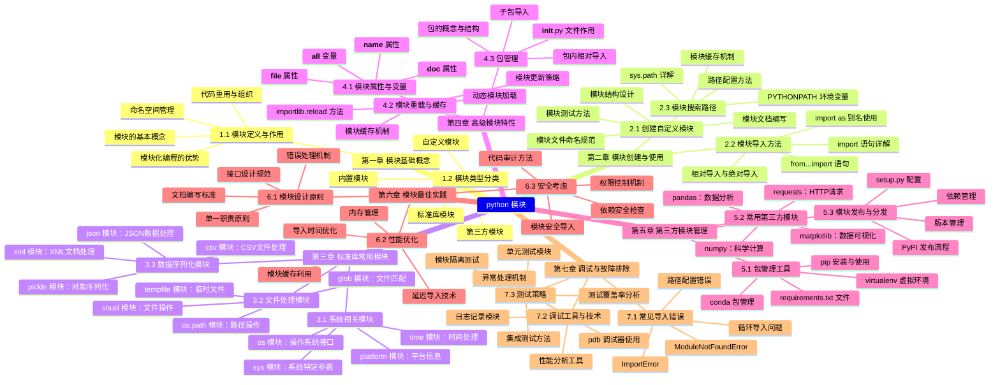

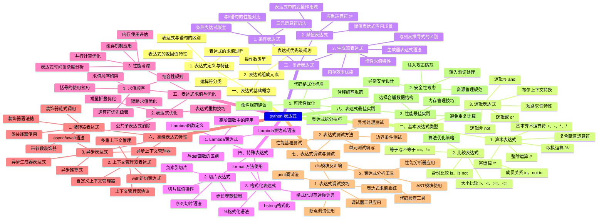

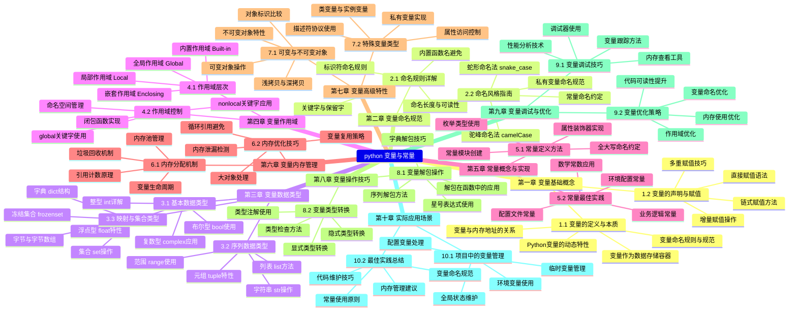

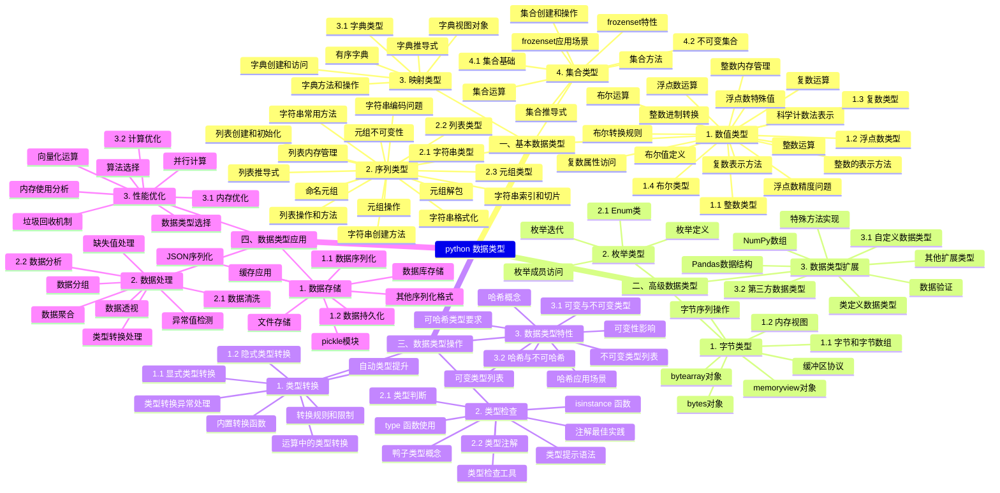

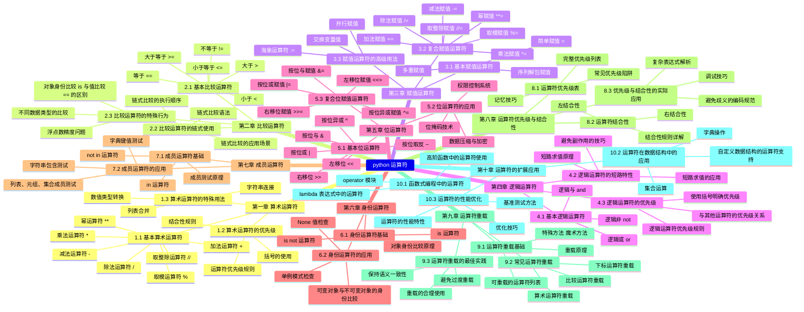

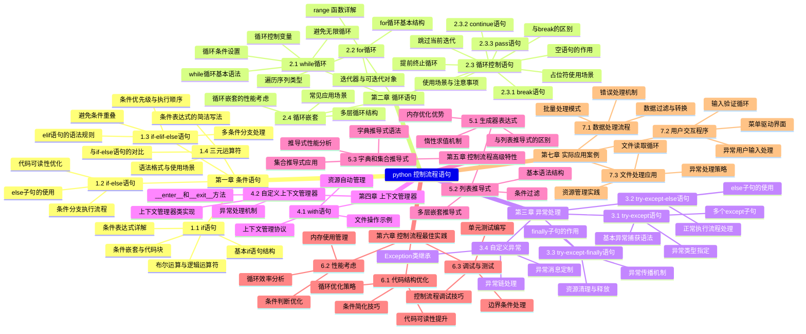

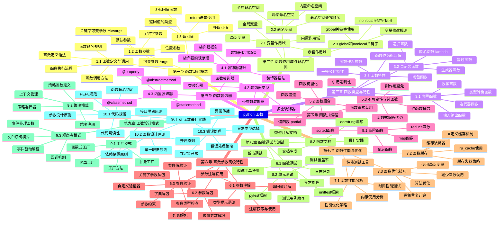

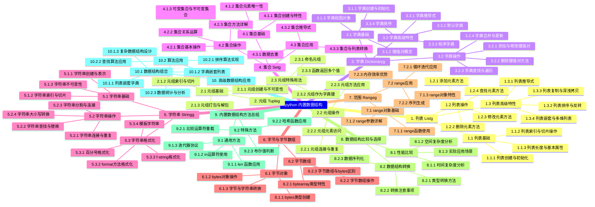

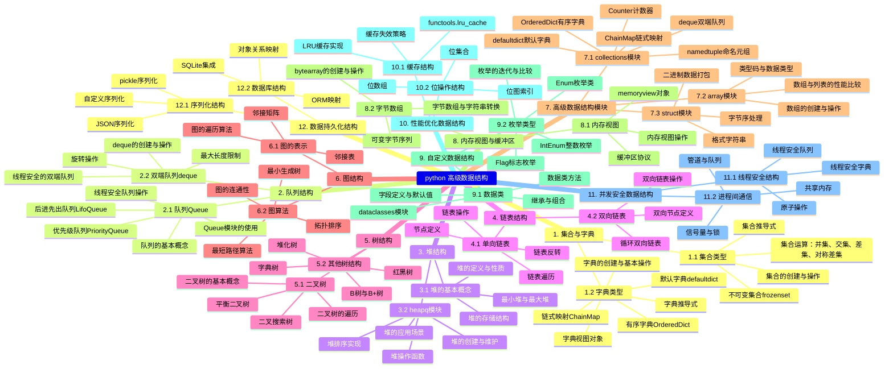

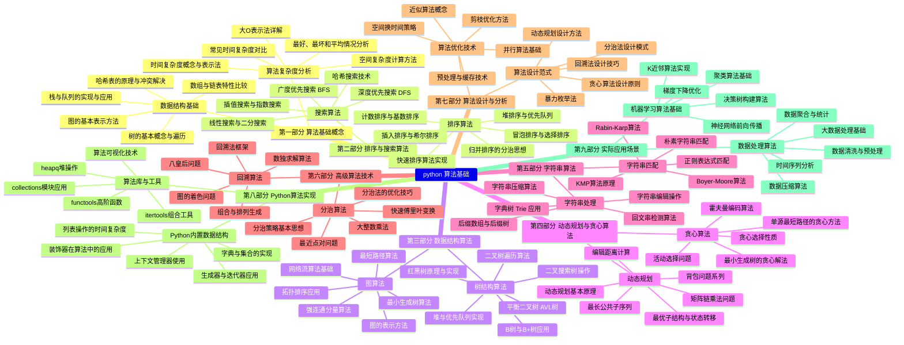

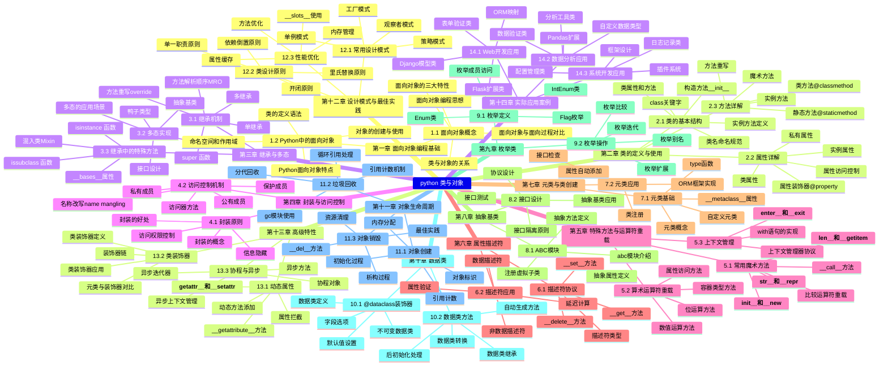

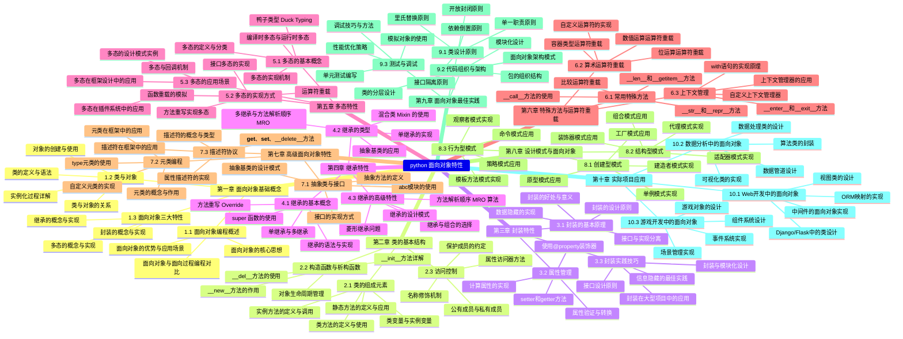

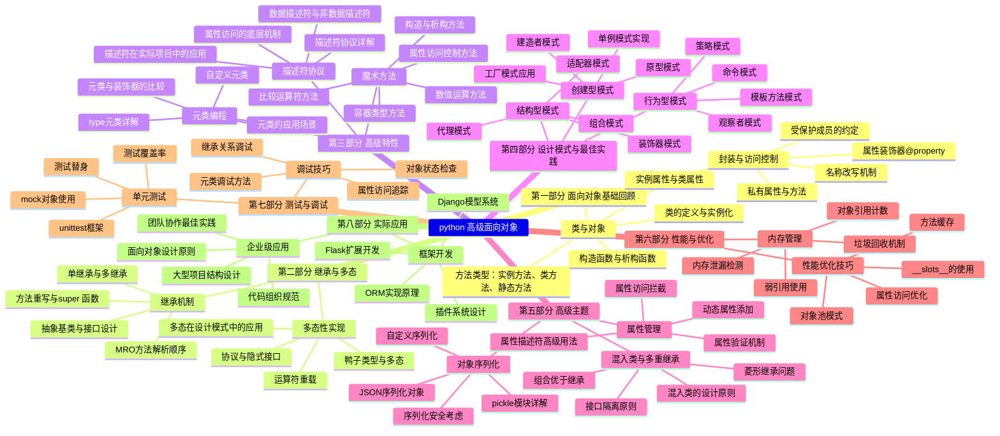


```mermaid
mindmap
python 函数式编程
    第一章 函数式编程基础概念
         1.1 函数式编程范式
              1.1.1 声明式编程与命令式编程
              1.1.2 纯函数概念与特性
              1.1.3 不可变数据结构
              1.1.4 引用透明性
              1.1.5 副作用管理

         1.2 Python函数式编程特点
              1.2.1 Python对函数式编程的支持
              1.2.2 函数作为一等公民
              1.2.3 函数式编程与面向对象编程的融合
              1.2.4 Python函数式编程的优势与局限

    第二章 高阶函数
         2.1 函数作为参数
              2.1.1 map函数详解
              2.1.2 filter函数应用
              2.1.3 reduce函数使用
              2.1.4 sorted函数高级用法

         2.2 函数作为返回值
              2.2.1 闭包概念与实现
              2.2.2 装饰器原理与应用
              2.2.3 函数工厂模式
              2.2.4 柯里化技术

         2.3 匿名函数
              2.3.1 lambda表达式语法
              2.3.2 lambda与def的区别
              2.3.3 lambda的适用场景
              2.3.4 lambda表达式限制

    第三章 函数组合与管道
         3.1 函数组合技术
              3.1.1 函数组合概念
              3.1.2 compose函数实现
              3.1.3 链式函数调用
              3.1.4 函数组合最佳实践

         3.2 数据管道
              3.2.1 管道操作概念
              3.2.2 数据处理流水线
              3.2.3 管道操作符实现
              3.2.4 复杂数据处理流程

    第四章 递归与迭代
         4.1 递归函数
              4.1.1 递归基本原理
              4.1.2 尾递归优化
              4.1.3 递归与迭代对比
              4.1.4 递归深度与性能

         4.2 生成器与迭代器
              4.2.1 生成器表达式
              4.2.2 yield关键字
              4.2.3 迭代器协议
              4.2.4 惰性求值技术

    第五章 不可变数据结构
         5.1 元组与命名元组
              5.1.1 元组的不可变性
              5.1.2 命名元组使用
              5.1.3 元组解包技巧
              5.1.4 不可变序列操作

         5.2 冻结集合与冻结字典
              5.2.1 frozenset特性
              5.2.2 不可变字典实现
              5.2.3 哈希性与不可变性
              5.2.4 不可变数据结构应用场景

    第六章 函数式编程工具库
         6.1 functools模块
              6.1.1 partial函数应用
              6.1.2 reduce函数详解
              6.1.3 lru_cache缓存
              6.1.4 total_ordering装饰器

         6.2 itertools模块
              6.2.1 无限迭代器
              6.2.2 有限迭代器
              6.2.3 组合生成器
              6.2.4 排列组合函数

         6.3 operator模块
              6.3.1 操作符函数
              6.3.2 itemgetter与attrgetter
              6.3.3 methodcaller使用
              6.3.4 函数式操作符应用

    第七章 函数式设计模式
         7.1 单子模式
              7.1.1 Maybe单子实现
              7.1.2 Either单子应用
              7.1.3 单子组合操作
              7.1.4 错误处理模式

         7.2 函子与应用函子
              7.2.1 函子概念
              7.2.2 应用函子实现
              7.2.3 列表函子应用
              7.2.4 函子定律

         7.3 其他函数式模式
              7.3.1 记忆化模式
              7.3.2 策略模式函数式实现
              7.3.3 观察者模式函数式版本
              7.3.4 装饰器模式应用

    第八章 并发与并行编程
         8.1 函数式并发
              8.1.1 无状态函数优势
              8.1.2 不可变数据与线程安全
              8.1.3 纯函数并行化
              8.1.4 并发编程最佳实践

         8.2 异步函数式编程
              8.2.1 async/await与函数式
              8.2.2 异步生成器
              8.2.3 异步迭代器
              8.2.4 异步数据处理管道

    第九章 测试与调试
         9.1 函数式代码测试
              9.1.1 纯函数测试优势
              9.1.2 属性测试应用
              9.1.3 函数组合测试
              9.1.4 高阶函数测试

         9.2 调试技巧
              9.2.1 函数调用跟踪
              9.2.2 惰性求值调试
              9.2.3 递归函数调试
              9.2.4 函数式代码性能分析

    第十章 实际应用案例
         10.1 数据处理应用
              10.1.1 数据清洗管道
              10.1.2 数据转换流程
              10.1.3 数据分析函数式方法
              10.1.4 大数据处理优化

         10.2 Web开发应用
              10.2.1 路由函数组合
              10.2.2 中间件管道
              10.2.3 请求处理函数式
              10.2.4 API设计函数式风格

         10.3 机器学习应用
              10.3.1 特征工程函数式
              10.3.2 模型管道构建
              10.3.3 数据预处理组合
              10.3.4 超参数优化函数式方法

```

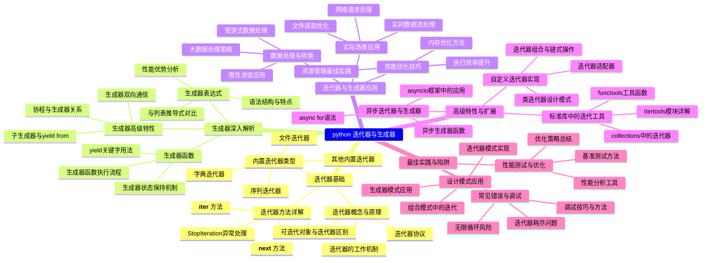

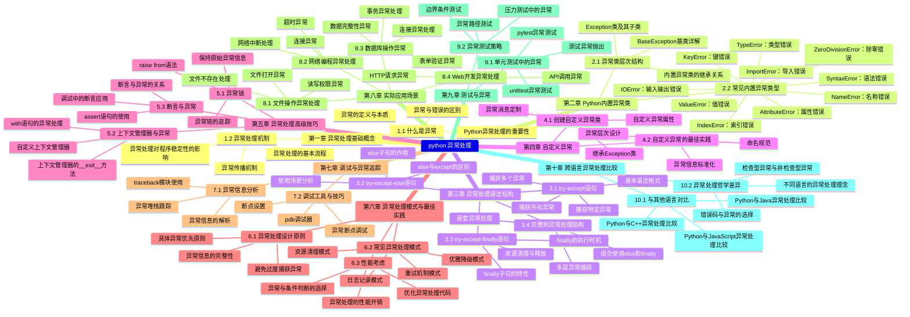

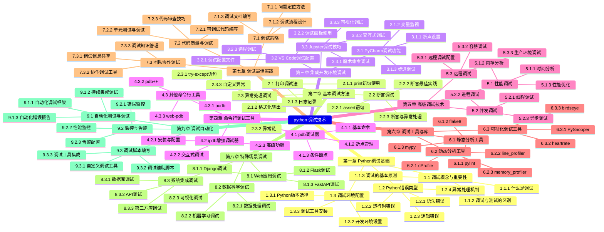

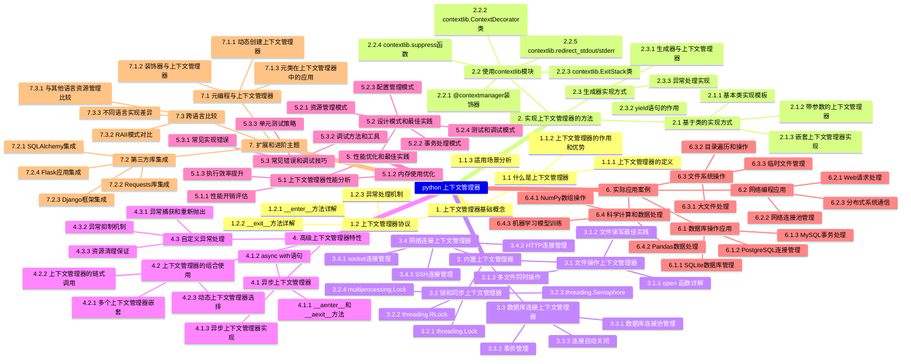

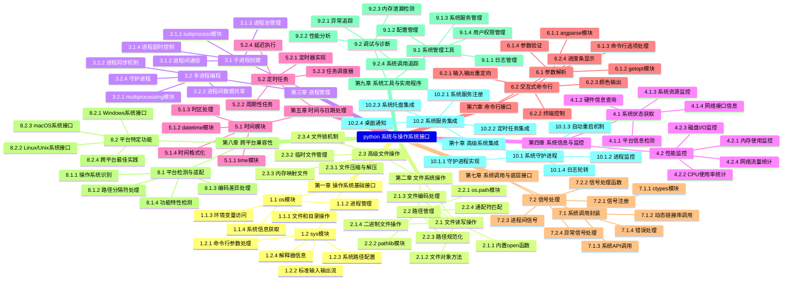

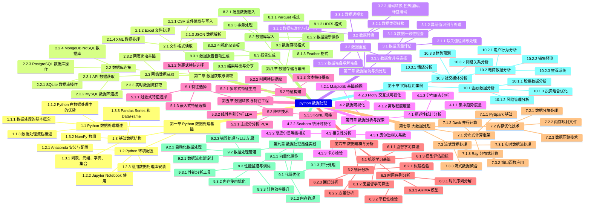

```mermaid
mindmap
python 文件操作
    第一章 文件操作基础
         1.1 文件基本概念
              1.1.1 文件类型与编码
              1.1.2 文件路径表示方法
              1.1.3 文件权限与属性

         1.2 文件打开与关闭
              1.2.1 open  函数详解
              1.2.2 文件打开模式
              1.2.3 with语句自动管理

    第二章 文件读写操作
         2.1 文本文件读写
              2.1.1 read  方法使用
              2.1.2 write  方法使用
              2.1.3 读写位置控制

         2.2 二进制文件操作
              2.2.1 二进制读写模式
              2.2.2 图片文件处理
              2.2.3 音频视频文件操作

         2.3 文件读写进阶
              2.3.1 缓冲区设置
              2.3.2 编码处理
              2.3.3 大文件分块读取

    第三章 文件定位与指针
         3.1 文件指针操作
              3.1.1 tell  方法
              3.1.2 seek  方法
              3.1.3 相对位置与绝对位置

         3.2 文件状态检测
              3.2.1 文件是否存在
              3.2.2 文件大小获取
              3.2.3 文件属性检查

    第四章 文件与目录管理
         4.1 文件操作
              4.1.1 文件重命名
              4.1.2 文件删除
              4.1.3 文件复制与移动

         4.2 目录操作
              4.2.1 目录创建与删除
              4.2.2 目录遍历
              4.2.3 路径拼接与解析

         4.3 文件系统操作
              4.3.1 获取磁盘信息
              4.3.2 文件权限修改
              4.3.3 符号链接处理

    第五章 高级文件操作
         5.1 文件迭代与生成器
              5.1.1 逐行读取文件
              5.1.2 文件迭代器
              5.1.3 生成器表达式应用

         5.2 内存映射文件
              5.2.1 mmap模块使用
              5.2.2 大文件高效处理
              5.2.3 共享内存应用

         5.3 临时文件操作
              5.3.1 tempfile模块
              5.3.2 临时文件创建
              5.3.3 临时目录管理

    第六章 文件格式处理
         6.1 配置文件处理
              6.1.1 configparser模块
              6.1.2 INI文件读写
              6.1.3 配置项管理

         6.2 CSV文件操作
              6.2.1 csv模块详解
              6.2.2 数据读取与写入
              6.2.3 方言与格式控制

         6.3 JSON文件处理
              6.3.1 json模块使用
              6.3.2 序列化与反序列化
              6.3.3 中文编码处理

         6.4 XML文件解析
              6.4.1 xml.etree.ElementTree
              6.4.2 SAX与DOM解析
              6.4.3 XML文件生成

    第七章 文件压缩与归档
         7.1 ZIP文件操作
              7.1.1 zipfile模块
              7.1.2 压缩文件创建
              7.1.3 解压缩操作

         7.2 TAR文件处理
              7.2.1 tarfile模块
              7.2.2 归档文件创建
              7.2.3 压缩格式支持

         7.3 GZIP与BZIP2
              7.3.1 gzip模块
              7.3.2 bz2模块
              7.3.3 流式压缩解压

    第八章 文件操作异常处理
         8.1 常见文件异常
              8.1.1 FileNotFoundError
              8.1.2 PermissionError
              8.1.3 IOError处理

         8.2 异常处理机制
              8.2.1 try-except语句
              8.2.2 异常链处理
              8.2.3 自定义异常

         8.3 文件操作最佳实践
              8.3.1 资源清理
              8.3.2 错误恢复
              8.3.3 日志记录

    第九章 文件操作性能优化
         9.1 读写性能优化
              9.1.1 缓冲区优化
              9.1.2 异步文件操作
              9.1.3 内存映射技术

         9.2 并发文件操作
              9.2.1 多线程文件处理
              9.2.2 多进程文件操作
              9.2.3 文件锁机制

         9.3 缓存策略
              9.3.1 文件缓存实现
              9.3.2 LRU缓存应用
              9.3.3 预读取技术

    第十章 实际应用案例
         10.1 日志文件处理
              10.1.1 日志轮转
              10.1.2 日志分析
              10.1.3 实时日志监控

         10.2 数据文件处理
              10.2.1 数据清洗
              10.2.2 数据转换
              10.2.3 批量处理

         10.3 配置文件管理
              10.3.1 动态配置加载
              10.3.2 配置热更新
              10.3.3 配置版本控制

```

```mermaid
mindmap
python IO流与缓冲区 
    第一章 Python IO流基础概念
         1.1 IO流基本概念
              1.1.1 什么是IO流
              1.1.2 输入流与输出流
              1.1.3 字节流与字符流
              1.1.4 Python中的IO模块概述

         1.2 标准IO流
              1.2.1 sys.stdin标准输入
              1.2.2 sys.stdout标准输出
              1.2.3 sys.stderr标准错误
              1.2.4 重定向标准IO流

    第二章 文件IO操作
         2.1 文件打开与关闭
              2.1.1 open  函数详解
              2.1.2 文件打开模式
              2.1.3 with语句与上下文管理
              2.1.4 文件编码处理

         2.2 文件读写操作
              2.2.1 文本文件读写
              2.2.2 二进制文件读写
              2.2.3 文件定位与seek操作
              2.2.4 文件迭代与行读取

         2.3 文件对象方法
              2.3.1 read  系列方法
              2.3.2 write  系列方法
              2.3.3 文件状态查询方法
              2.3.4 文件刷新与同步

    第三章 缓冲区机制详解
         3.1 缓冲区基本概念
              3.1.1 缓冲区的作用与原理
              3.1.2 缓冲区的类型
              3.1.3 缓冲区大小设置

         3.2 Python中的缓冲区
              3.2.1 全缓冲
              3.2.2 行缓冲
              3.2.3 无缓冲
              3.2.4 缓冲区刷新机制

         3.3 缓冲区控制
              3.3.1 flush  方法
              3.3.2 缓冲区设置参数
              3.3.3 自动刷新条件
              3.3.4 缓冲区异常处理

    第四章 高级IO操作
         4.1 内存IO
              4.1.1 StringIO字符串IO
              4.1.2 BytesIO字节IO
              4.1.3 内存文件操作
              4.1.4 内存缓冲区应用

         4.2 序列化IO
              4.2.1 pickle模块序列化
              4.2.2 json模块序列化
              4.2.3 自定义序列化
              4.2.4 序列化性能优化

         4.3 压缩文件IO
              4.3.1 gzip压缩文件
              4.3.2 zipfile压缩文件
              4.3.3 tarfile归档文件
              4.3.4 压缩流处理

    第五章 网络IO与套接字
         5.1 套接字IO基础
              5.1.1 socket模块概述
              5.1.2 TCP套接字IO
              5.1.3 UDP套接字IO
              5.1.4 网络缓冲区

         5.2 高级网络IO
              5.2.1 select模块
              5.2.2 poll/epoll机制
              5.2.3 异步IO
              5.2.4 非阻塞IO

    第六章 IO性能优化
         6.1 缓冲区优化策略
              6.1.1 缓冲区大小选择
              6.1.2 批量读写操作
              6.1.3 内存映射文件
              6.1.4 IO复用技术

         6.2 异步IO编程
              6.2.1 asyncio模块
              6.2.2 协程与IO
              6.2.3 异步文件操作
              6.2.4 异步网络IO

         6.3 性能监控与调试
              6.3.1 IO性能指标
              6.3.2 性能分析工具
              6.3.3 常见性能问题
              6.3.4 优化案例分析

    第七章 异常处理与安全
         7.1 IO异常处理
              7.1.1 常见IO异常类型
              7.1.2 异常处理策略
              7.1.3 资源清理机制
              7.1.4 上下文管理器异常处理

         7.2 IO安全考虑
              7.2.1 文件权限控制
              7.2.2 路径遍历防护
              7.2.3 缓冲区溢出防护
              7.2.4 安全编码实践

    第八章 实际应用案例
         8.1 日志系统实现
              8.1.1 日志文件轮转
              8.1.2 日志缓冲区设计
              8.1.3 异步日志记录
              8.1.4 日志性能优化

         8.2 数据流处理
              8.2.1 实时数据流
              8.2.2 大数据文件处理
              8.2.3 流式数据处理
              8.2.4 数据管道构建

         8.3 Web应用IO
              8.3.1 文件上传下载
              8.3.2 静态文件服务
              8.3.3 流式响应
              8.3.4 WebSocket通信

```

```mermaid
mindmap
python 数据库 
    第一章 Python数据库编程基础
         1.1 数据库基本概念
              1.1.1 数据库类型与分类
              1.1.2 关系型数据库原理
              1.1.3 非关系型数据库原理
              1.1.4 数据库设计范式

         1.2 Python数据库接口标准
              1.2.1 DB-API规范详解
              1.2.2 连接对象与游标对象
              1.2.3 异常处理机制
              1.2.4 数据类型映射

    第二章 关系型数据库操作
         2.1 SQLite数据库
              2.1.1 SQLite特点与应用场景
              2.1.2 数据库连接与操作
              2.1.3 事务处理与并发控制
              2.1.4 性能优化技巧

         2.2 MySQL数据库
              2.2.1 MySQL连接器配置
              2.2.2 数据库CRUD操作
              2.2.3 存储过程与函数调用
              2.2.4 连接池管理

         2.3 PostgreSQL数据库
              2.3.1 psycopg2驱动使用
              2.3.2 高级数据类型操作
              2.3.3 JSON与数组类型处理
              2.3.4 全文搜索功能

         2.4 Oracle数据库
              2.4.1 cx_Oracle连接配置
              2.4.2 PL/SQL块执行
              2.4.3 大对象数据处理
              2.4.4 性能调优策略

    第三章 非关系型数据库操作
         3.1 MongoDB
              3.1.1 PyMongo驱动使用
              3.1.2 文档CRUD操作
              3.1.3 聚合管道与索引
              3.1.4 地理空间查询

         3.2 Redis
              3.2.1 Redis-py客户端
              3.2.2 数据结构操作
              3.2.3 发布订阅模式
              3.2.4 持久化与集群

         3.3 Cassandra
              3.3.1 数据模型设计
              3.3.2 CQL查询语言
              3.3.3 一致性级别配置
              3.3.4 集群部署管理

    第四章 ORM框架应用
         4.1 SQLAlchemy核心
              4.1.1 引擎与会话管理
              4.1.2 声明式基类定义
              4.1.3 关系映射配置
              4.1.4 查询构建器使用

         4.2 Django ORM
              4.2.1 模型定义与迁移
              4.2.2 查询集API详解
              4.2.3 关联关系处理
              4.2.4 原始SQL执行

         4.3 Peewee ORM
              4.3.1 轻量级ORM特点
              4.3.2 模型定义与操作
              4.3.3 事务与连接管理
              4.3.4 扩展插件使用

    第五章 数据库高级特性
         5.1 事务处理
              5.1.1 ACID特性理解
              5.1.2 隔离级别设置
              5.1.3 分布式事务处理
              5.1.4 死锁检测与避免

         5.2 连接池技术
              5.2.1 连接池原理
              5.2.2 配置参数优化
              5.2.3 连接泄漏检测
              5.2.4 多线程环境使用

         5.3 数据库迁移
              5.3.1 Alembic迁移工具
              5.3.2 版本控制策略
              5.3.3 数据迁移脚本
              5.3.4 回滚机制实现

    第六章 性能优化与安全
         6.1 查询优化
              6.1.1 执行计划分析
              6.1.2 索引设计与使用
              6.1.3 查询重写技巧
              6.1.4 缓存策略实施

         6.2 安全防护
              6.2.1 SQL注入防护
              6.2.2 参数化查询使用
              6.2.3 权限管理配置
              6.2.4 数据加密传输

         6.3 监控与调试
              6.3.1 慢查询日志分析
              6.3.2 连接数监控
              6.3.3 性能指标收集
              6.3.4 调试工具使用

    第七章 实战项目应用
         7.1 Web应用数据库设计
              7.1.1 用户系统设计
              7.1.2 内容管理系统
              7.1.3 电商系统数据库
              7.1.4 日志系统存储

         7.2 大数据处理
              7.2.1 批量数据导入
              7.2.2 数据清洗转换
              7.2.3 并行处理优化
              7.2.4 数据仓库构建

         7.3 云数据库服务
              7.3.1 AWS RDS使用
              7.3.2 阿里云数据库
              7.3.3 数据库即服务
              7.3.4 跨区域复制配置

```

```mermaid
mindmap
python 网络编程
    第一章 网络编程基础
         1.1 网络协议概述
              1.1.1 OSI七层模型
              1.1.2 TCP/IP协议族
              1.1.3 HTTP/HTTPS协议
              1.1.4 FTP/SMTP/POP3协议

         1.2 网络地址与端口
              1.2.1 IP地址分类与子网划分
              1.2.2 IPv4与IPv6
              1.2.3 端口号与知名端口
              1.2.4 域名系统 DNS 解析

         1.3 网络通信模型
              1.3.1 客户端-服务器模型
              1.3.2 对等网络模型
              1.3.3 同步与异步通信
              1.3.4 阻塞与非阻塞I/O

    第二章 Python网络编程核心模块
         2.1 socket模块详解
              2.1.1 socket对象创建与配置
              2.1.2 地址族与套接字类型
              2.1.3 套接字选项设置
              2.1.4 超时与错误处理

         2.2 基础网络通信
              2.2.1 TCP套接字编程
              2.2.2 UDP套接字编程
              2.2.3 原始套接字编程
              2.2.4 多播与广播通信

         2.3 高级socket功能
              2.3.1 非阻塞I/O操作
              2.3.2 select/poll/epoll多路复用
              2.3.3 socket超时控制
              2.3.4 套接字缓冲区管理

    第三章 服务器端编程
         3.1 基础服务器实现
              3.1.1 单线程服务器
              3.1.2 多线程服务器
              3.1.3 多进程服务器
              3.1.4 线程池与进程池

         3.2 异步服务器设计
              3.2.1 asyncio模块详解
              3.2.2 协程与事件循环
              3.2.3 异步TCP服务器
              3.2.4 异步UDP服务器

         3.3 服务器性能优化
              3.3.1 连接池管理
              3.3.2 负载均衡策略
              3.3.3 内存管理与垃圾回收
              3.3.4 性能监控与调优

    第四章 客户端编程
         4.1 基础客户端实现
              4.1.1 TCP客户端编程
              4.1.2 UDP客户端编程
              4.1.3 HTTP客户端实现
              4.1.4 FTP客户端实现

         4.2 高级客户端功能
              4.2.1 连接重试与故障转移
              4.2.2 数据压缩与加密
              4.2.3 代理服务器支持
              4.2.4 认证与授权

         4.3 客户端优化策略
              4.3.1 连接复用与持久连接
              4.3.2 请求批处理
              4.3.3 缓存策略
              4.3.4 超时与重试机制

    第五章 网络协议实现
         5.1 应用层协议
              5.1.1 HTTP协议实现
              5.1.2 WebSocket协议
              5.1.3 SMTP邮件协议
              5.1.4 FTP文件传输协议

         5.2 传输层协议
              5.2.1 TCP可靠传输机制
              5.2.2 UDP数据报传输
              5.2.3 SCTP流控制传输
              5.2.4 QUIC协议实现

         5.3 自定义协议设计
              5.3.1 协议格式设计
              5.3.2 数据序列化
              5.3.3 协议版本控制
              5.3.4 协议兼容性处理

    第六章 网络安全编程
         6.1 加密与认证
              6.1.1 SSL/TLS加密通信
              6.1.2 数字证书与CA
              6.1.3 对称加密算法
              6.1.4 非对称加密算法

         6.2 网络安全防护
              6.2.1 防火墙配置
              6.2.2 入侵检测系统
              6.2.3 DDoS攻击防护
              6.2.4 安全审计与日志

         6.3 安全编程实践
              6.3.1 输入验证与过滤
              6.3.2 SQL注入防护
              6.3.3 XSS攻击防护
              6.3.4 CSRF攻击防护

    第七章 网络编程高级主题
         7.1 并发编程模型
              7.1.1 多线程编程
              7.1.2 多进程编程
              7.1.3 协程与异步编程
              7.1.4 并发控制与同步

         7.2 网络性能优化
              7.2.1 网络I/O优化
              7.2.2 内存管理优化
              7.2.3 CPU使用率优化
              7.2.4 网络延迟优化

         7.3 分布式系统编程
              7.3.1 分布式架构设计
              7.3.2 服务发现与注册
              7.3.3 负载均衡算法
              7.3.4 分布式一致性

    第八章 实战项目与案例分析
         8.1 Web服务器开发
              8.1.1 简单HTTP服务器
              8.1.2 静态文件服务器
              8.1.3 反向代理服务器
              8.1.4 Web应用服务器

         8.2 网络工具开发
              8.2.1 端口扫描器
              8.2.2 网络爬虫
              8.2.3 数据包分析器
              8.2.4 网络监控工具

         8.3 企业级应用
              8.3.1 微服务架构
              8.3.2 API网关实现
              8.3.3 消息队列系统
              8.3.4 实时通信系统

    第九章 调试与测试
         9.1 网络调试工具
              9.1.1 Wireshark抓包分析
              9.1.2 tcpdump使用
              9.1.3 netstat网络状态
              9.1.4 ping与traceroute

         9.2 单元测试与集成测试
              9.2.1 网络功能测试
              9.2.2 性能压力测试
              9.2.3 安全漏洞测试
              9.2.4 兼容性测试

         9.3 日志与监控
              9.3.1 日志系统设计
              9.3.2 性能监控指标
              9.3.3 错误追踪与定位
              9.3.4 系统健康检查

    第十章 部署与运维
         10.1 环境配置
              10.1.1 开发环境搭建
              10.1.2 测试环境配置
              10.1.3 生产环境部署
              10.1.4 容器化部署

         10.2 运维管理
              10.2.1 服务监控
              10.2.2 故障排查
              10.2.3 性能调优
              10.2.4 版本升级

         10.3 最佳实践
              10.3.1 代码规范
              10.3.2 安全规范
              10.3.3 性能优化规范
              10.3.4 文档编写规范

```


```mermaid
mindmap
python web 开发
    第一部分：Web 开发基础
         1.1 HTTP 协议与 Web 架构
              HTTP 请求与响应模型
              RESTful API 设计原则
              Web 服务器与客户端交互机制
              状态管理与会话控制

         1.2 Python Web 开发环境搭建
              Python 虚拟环境配置
              包管理与依赖管理工具
              开发服务器配置与调试
              集成开发环境选择

    第二部分：Web 框架详解
         2.1 Django 框架
              2.1.1 Django 核心概念
              MTV 架构模式
              模型层设计与 ORM
              视图层与 URL 路由
              模板系统与前端集成

              2.1.2 Django 高级特性
              中间件机制
              表单处理与验证
              用户认证与权限管理
              缓存机制与性能优化

         2.2 Flask 框架
              2.2.1 Flask 基础组件
              应用对象与配置管理
              路由系统与视图函数
              请求上下文与响应对象
              模板引擎集成

              2.2.2 Flask 扩展生态
              SQLAlchemy 数据库集成
              Flask-Login 用户认证
              Flask-RESTful API 开发
              Flask-SocketIO 实时通信

         2.3 其他流行框架
              FastAPI 异步 Web 开发
              Tornado 高性能框架
              Pyramid 灵活架构
              Bottle 轻量级框架

    第三部分：数据库与数据持久化
         3.1 关系型数据库
              PostgreSQL 高级特性
              MySQL 优化与配置
              SQLite 轻量级应用
              数据库迁移与版本控制

         3.2 NoSQL 数据库
              MongoDB 文档存储
              Redis 缓存与数据结构
              Cassandra 分布式数据库
              Elasticsearch 全文搜索

         3.3 ORM 与查询优化
              Django ORM 高级查询
              SQLAlchemy 核心与 ORM
              数据库连接池管理
              查询性能分析与优化

    第四部分：前端集成与用户界面
         4.1 模板系统
              Django 模板语言
              Jinja2 模板引擎
              模板继承与组件化
              静态文件管理与 CDN

         4.2 前端框架集成
              React 与 Python 后端集成
              Vue.js 前后端分离架构
              Angular 全栈开发
              单页面应用部署

         4.3 用户交互与体验
              AJAX 与异步请求处理
              WebSocket 实时通信
              文件上传与下载
              响应式设计与移动端适配

    第五部分：API 开发与微服务
         5.1 REST API 设计
              资源建模与端点设计
              认证与授权机制
              API 版本控制策略
              文档生成与测试

         5.2 GraphQL 应用
              GraphQL 架构与原理
              Graphene-Python 实现
              查询优化与性能
              与 REST API 对比

         5.3 微服务架构
              服务拆分与通信
              消息队列与事件驱动
              服务发现与负载均衡
              分布式事务处理

    第六部分：部署与运维
         6.1 生产环境部署
              WSGI/ASGI 服务器配置
              Nginx 反向代理
              容器化部署 Docker 
              云平台部署 AWS、Azure、GCP 

         6.2 性能优化
              代码性能分析
              数据库查询优化
              缓存策略实施
              负载测试与调优

         6.3 监控与日志
              应用性能监控
              错误追踪与调试
              日志收集与分析
              健康检查与告警

    第七部分：安全与最佳实践
         7.1 Web 安全防护
              SQL 注入防护
              XSS 与 CSRF 攻击防范
              身份验证安全
              数据加密与传输安全

         7.2 代码质量与测试
              单元测试与集成测试
              代码覆盖率分析
              持续集成与部署
              代码审查与重构

         7.3 架构设计原则
              设计模式应用
              可扩展性设计
              可维护性考虑
              技术选型策略

    第八部分：新兴技术与趋势
         8.1 异步编程
              asyncio 核心概念
              异步 Web 框架
              并发处理模式
              性能对比分析

         8.2 无服务器架构
              AWS Lambda 部署
              函数即服务设计
              事件驱动架构
              成本优化策略

         8.3 AI 与机器学习集成
              机器学习模型部署
              推荐系统实现
              自然语言处理应用
              计算机视觉集成

```

```mermaid
mindmap
python 科学计算
    第一部分 Python 科学计算基础
         第一章 Python 编程基础
              1.1 Python 语言特性
              1.2 基本数据类型和数据结构
              1.3 控制流和函数
              1.4 面向对象编程
              1.5 文件操作和异常处理

         第二章 科学计算环境配置
              2.1 Anaconda 发行版
              2.2 Jupyter Notebook 使用
              2.3 虚拟环境管理
              2.4 包管理和依赖解决

    第二部分 核心科学计算库
         第三章 NumPy 数值计算
              3.1 数组创建和基本操作
              3.2 数组索引和切片
              3.3 数组运算和广播机制
              3.4 线性代数运算
              3.5 随机数生成和统计函数

         第四章 SciPy 科学计算
              4.1 特殊函数和常数
              4.2 积分和微分方程
              4.3 优化算法
              4.4 插值和拟合
              4.5 信号处理和图像处理

         第五章 Pandas 数据分析
              5.1 Series 和 DataFrame
              5.2 数据清洗和预处理
              5.3 数据分组和聚合
              5.4 时间序列处理
              5.5 数据合并和连接

         第六章 Matplotlib 数据可视化
              6.1 基本绘图函数
              6.2 子图和布局
              6.3 样式和颜色配置
              6.4 3D 绘图
              6.5 动画和交互式绘图

    第三部分 高级科学计算应用
         第七章 符号计算
              7.1 SymPy 基础
              7.2 符号微积分
              7.3 符号代数运算
              7.4 微分方程符号解
              7.5 物理和工程应用

         第八章 机器学习与数据挖掘
              8.1 Scikit-learn 基础
              8.2 监督学习算法
              8.3 无监督学习算法
              8.4 模型评估和选择
              8.5 特征工程

         第九章 图像处理和计算机视觉
              9.1 OpenCV 基础
              9.2 图像滤波和变换
              9.3 特征检测和匹配
              9.4 目标检测和识别
              9.5 深度学习在视觉中的应用

         第十章 信号处理和音频分析
              10.1 信号生成和采样
              10.2 傅里叶变换和频谱分析
              10.3 滤波器和滤波器设计
              10.4 音频信号处理
              10.5 时频分析

    第四部分 专业领域应用
         第十一章 物理科学计算
              11.1 数值模拟方法
              11.2 微分方程数值解
              11.3 蒙特卡洛方法
              11.4 量子力学计算
              11.5 天体物理计算

         第十二章 工程计算
              12.1 控制系统分析
              12.2 电路分析
              12.3 结构力学计算
              12.4 流体力学模拟
              12.5 优化设计

         第十三章 生物信息学和医学
              13.1 基因组数据分析
              13.2 蛋白质结构分析
              13.3 医学图像处理
              13.4 生物统计
              13.5 药物发现计算

         第十四章 金融和经济计算
              14.1 时间序列分析
              14.2 风险管理和评估
              14.3 投资组合优化
              14.4 期权定价模型
              14.5 经济计量分析

    第五部分 性能优化和并行计算
         第十五章 代码性能优化
              15.1 性能分析和调优
              15.2 内存管理和优化
              15.3 算法复杂度分析
              15.4 编译优化技术
              15.5 GPU 加速计算

         第十六章 并行和分布式计算
              16.1 多线程和多进程
              16.2 MPI 并行计算
              16.3 分布式计算框架
              16.4 云计算平台应用
              16.5 大数据处理

    第六部分 项目实践和部署
         第十七章 科学计算项目开发
              17.1 项目结构和组织
              17.2 版本控制和协作
              17.3 测试和调试
              17.4 文档编写
              17.5 代码质量保证

         第十八章 部署和发布
              18.1 打包和分发
              18.2 Web 应用部署
              18.3 桌面应用开发
              18.4 移动端应用
              18.5 持续集成和部署

```

```mermaid
mindmap
python 机器学习 
    第一部分 Python基础与数据处理

         第一章 Python编程基础
              Python环境配置与开发工具
              基本数据类型与数据结构
              控制流程与函数
              面向对象编程
              异常处理与调试

         第二章 数据处理核心库
              NumPy数组操作与数学运算
              Pandas数据框与序列操作
              数据清洗与预处理技术
              数据可视化 Matplotlib、Seaborn 
              时间序列数据处理

         第三章 数据获取与存储
              文件读写操作 CSV、Excel、JSON 
              数据库连接与操作
              Web数据抓取 Requests、BeautifulSoup 
              API接口调用与数据处理
              大数据存储方案

    第二部分 机器学习理论基础

         第四章 机器学习概述
              机器学习基本概念与分类
              监督学习、无监督学习、强化学习
              机器学习工作流程
              模型评估与选择标准
              机器学习应用场景

         第五章 统计学基础
              概率论基础概念
              统计分布与假设检验
              相关性与回归分析
              方差分析与协方差
              统计推断方法

         第六章 线性代数与优化
              向量与矩阵运算
              特征值与特征向量
              奇异值分解
              梯度下降算法
              凸优化理论

    第三部分 监督学习算法

         第七章 线性模型
              线性回归原理与实现
              逻辑回归分类算法
              正则化方法 L1、L2 
              多项式回归
              模型诊断与改进

         第八章 决策树与集成学习
              决策树算法原理
              随机森林与极端随机树
              梯度提升树 GBDT、XGBoost 
              集成学习策略
              特征重要性分析

         第九章 支持向量机
              SVM基本原理
              核函数与非线性SVM
              多分类SVM
              参数调优技巧
              SVM应用实例

         第十章 朴素贝叶斯与K近邻
              贝叶斯定理与朴素贝叶斯
              KNN算法原理
              距离度量方法
              文本分类应用
              算法优缺点分析

    第四部分 无监督学习

         第十一章 聚类分析
              K-means聚类算法
              层次聚类方法
              DBSCAN密度聚类
              聚类效果评估
              聚类应用案例

         第十二章 降维技术
              主成分分析 PCA 
              线性判别分析 LDA 
              t-SNE可视化
              自编码器
              特征选择方法

         第十三章 关联规则与异常检测
              Apriori算法
              FP-growth算法
              孤立森林
              局部异常因子
              异常检测应用

    第五部分 深度学习基础

         第十四章 神经网络入门
              感知机与多层感知机
              激活函数选择
              反向传播算法
              权重初始化策略
              神经网络优化

         第十五章 卷积神经网络
              CNN基本原理
              卷积层与池化层
              经典CNN架构
              图像分类应用
              目标检测技术

         第十六章 循环神经网络
              RNN基本结构
              LSTM与GRU
              序列建模应用
              注意力机制
              时间序列预测

    第六部分 模型部署与优化

         第十七章 模型评估与调优
              交叉验证方法
              超参数优化
              学习曲线分析
              模型融合技术
              性能指标解读

         第十八章 特征工程
              特征编码方法
              特征缩放技术
              特征交叉与组合
              自动化特征工程
              特征工程最佳实践

         第十九章 模型部署
              模型序列化与加载
              Web服务部署
              模型监控与更新
              生产环境优化
              机器学习流水线

    第七部分 高级主题与应用

         第二十章 自然语言处理
              文本预处理技术
              词向量表示
              文本分类与情感分析
              命名实体识别
              机器翻译基础

         第二十一章 推荐系统
              协同过滤算法
              基于内容的推荐
              混合推荐系统
              推荐系统评估
              实时推荐技术

         第二十二章 强化学习
              强化学习基本概念
              Q-learning算法
              深度强化学习
              策略梯度方法
              强化学习应用

         第二十三章 自动化机器学习
              AutoML框架介绍
              自动特征工程
              自动模型选择
              超参数自动优化
              AutoML工具使用

    第八部分 实践项目与案例分析

         第二十四章 综合项目实战
              房价预测项目
              客户流失预测
              图像识别系统
              文本分类应用
              时间序列预测

         第二十五章 行业应用案例
              金融风控模型
              医疗诊断辅助
              电商推荐系统
              智能制造应用
              智慧城市解决方案

         第二十六章 最佳实践与未来发展
              机器学习项目管理
              团队协作与版本控制
              伦理与偏见问题
              可解释AI技术
              机器学习发展趋势

```

```mermaid
mindmap
python 数据分析
    第一部分 数据分析基础
         第1章 Python数据分析概述
              1.1 数据分析的定义与流程
              1.2 Python在数据分析中的优势
              1.3 常用数据分析库介绍
              1.4 数据分析环境搭建

         第2章 Python基础回顾
              2.1 数据类型与结构
              2.2 控制流与函数
              2.3 面向对象编程
              2.4 文件操作与异常处理

    第二部分 数据处理核心库
         第3章 NumPy数值计算
              3.1 NumPy数组创建与属性
              3.2 数组索引与切片
              3.3 数组运算与广播机制
              3.4 线性代数运算
              3.5 随机数生成

         第4章 Pandas数据处理
              4.1 Series与DataFrame
              4.2 数据读取与写入
              4.3 数据清洗与预处理
              4.4 数据合并与重塑
              4.5 分组聚合操作
              4.6 时间序列处理

         第5章 数据可视化
              5.1 Matplotlib基础绘图
              5.2 Seaborn统计可视化
              5.3 Plotly交互式可视化
              5.4 图表定制与美化

    第三部分 数据预处理
         第6章 数据清洗技术
              6.1 缺失值处理
              6.2 异常值检测与处理
              6.3 数据标准化与归一化
              6.4 重复数据处理

         第7章 特征工程
              7.1 特征选择方法
              7.2 特征变换技术
              7.3 特征编码方法
              7.4 特征降维技术

    第四部分 数据分析方法
         第8章 描述性统计分析
              8.1 集中趋势度量
              8.2 离散程度度量
              8.3 分布形态分析
              8.4 相关性分析

         第9章 探索性数据分析
              9.1 单变量分析
              9.2 多变量分析
              9.3 数据分布探索
              9.4 模式识别技术

         第10章 统计推断
              10.1 假设检验
              10.2 置信区间估计
              10.3 方差分析
              10.4 非参数检验

    第五部分 机器学习应用
         第11章 机器学习基础
              11.1 机器学习概述
              11.2 监督学习算法
              11.3 无监督学习算法
              11.4 模型评估方法

         第12章 Scikit-learn应用
              12.1 数据预处理
              12.2 分类算法实现
              12.3 回归算法实现
              12.4 聚类算法实现
              12.5 模型选择与调优

    第六部分 高级数据分析技术
         第13章 时间序列分析
              13.1 时间序列基础
              13.2 平稳性检验
              13.3 时间序列分解
              13.4 预测模型建立

         第14章 文本数据分析
              14.1 文本预处理
              14.2 词袋模型与TF-IDF
              14.3 情感分析
              14.4 主题建模

         第15章 网络数据分析
              15.1 网络图基础
              15.2 网络指标计算
              15.3 社区发现算法
              15.4 网络可视化

    第七部分 实战项目与应用
         第16章 数据分析项目流程
              16.1 业务理解与问题定义
              16.2 数据收集与探索
              16.3 模型构建与验证
              16.4 结果解释与报告

         第17章 行业案例分析
              17.1 电商数据分析
              17.2 金融风险分析
              17.3 医疗健康数据分析
              17.4 社交媒体分析

    第八部分 部署与优化
         第18章 性能优化
              18.1 内存优化技巧
              18.2 计算性能优化
              18.3 并行计算应用
              18.4 大数据处理技术

         第19章 部署与自动化
              19.1 数据分析报告生成
              19.2 自动化分析流程
              19.3 Web应用部署
              19.4 持续集成与交付

    附录
         附录A 常用函数速查
         附录B 常见问题解答
         附录C 数据集资源
         附录D 扩展学习资源

```

```mermaid
mindmap
python 多线程编程 
    第一章 多线程编程基础
         1.1 线程概念与原理
              1.1.1 线程与进程的区别
              1.1.2 线程的生命周期
              1.1.3 多线程的优势与局限

         1.2 Python线程模块
              1.2.1 threading模块概述
              1.2.2 _thread模块简介
              1.2.3 线程创建方法对比

    第二章 线程创建与管理
         2.1 线程创建方式
              2.1.1 继承Thread类
              2.1.2 使用函数创建线程
              2.1.3 线程参数传递

         2.2 线程控制
              2.2.1 线程启动与终止
              2.2.2 线程join方法
              2.2.3 守护线程
              2.2.4 线程命名与标识

    第三章 线程同步机制
         3.1 锁机制
              3.1.1 Lock对象使用
              3.1.2 RLock可重入锁
              3.1.3 死锁预防与解决

         3.2 条件变量
              3.2.1 Condition对象原理
              3.2.2 生产者消费者模式
              3.2.3 条件变量应用场景

         3.3 信号量
              3.3.1 Semaphore信号量
              3.3.2 BoundedSemaphore有界信号量
              3.3.3 信号量控制资源访问

         3.4 事件与屏障
              3.4.1 Event事件对象
              3.4.2 Barrier屏障对象
              3.4.3 线程间通信机制

    第四章 线程安全与数据共享
         4.1 线程安全问题
              4.1.1 竞态条件
              4.1.2 数据竞争
              4.1.3 内存可见性问题

         4.2 线程安全数据结构
              4.2.1 Queue队列模块
              4.2.2 线程安全集合
              4.2.3 原子操作实现

         4.3 线程局部数据
              4.3.1 local线程局部变量
              4.3.2 线程特定数据存储
              4.3.3 线程数据隔离

    第五章 线程池与并发工具
         5.1 线程池实现
              5.1.1 ThreadPoolExecutor
              5.1.2 自定义线程池
              5.1.3 线程池参数配置

         5.2 并发工具类
              5.2.1 concurrent.futures模块
              5.2.2 Future对象使用
              5.2.3 异步任务管理

    第六章 GIL全局解释器锁
         6.1 GIL原理分析
              6.1.1 GIL工作机制
              6.1.2 GIL对性能的影响
              6.1.3 GIL释放时机

         6.2 绕过GIL限制
              6.2.1 多进程替代方案
              6.2.2 C扩展开发
              6.2.3 使用其他解释器

    第七章 多线程应用场景
         7.1 I/O密集型任务
              7.1.1 网络编程多线程
              7.1.2 文件操作并发
              7.1.3 数据库连接池

         7.2 计算密集型任务优化
              7.2.1 任务分解策略
              7.2.2 负载均衡设计
              7.2.3 性能监控与调优

         7.3 图形界面应用
              7.3.1 GUI线程模型
              7.3.2 后台任务处理
              7.3.3 界面响应优化

    第八章 多线程调试与测试
         8.1 线程调试技术
              8.1.1 线程堆栈跟踪
              8.1.2 死锁检测方法
              8.1.3 性能分析工具

         8.2 多线程测试
              8.2.1 单元测试编写
              8.2.2 并发测试策略
              8.2.3 压力测试实施

    第九章 高级多线程编程
         9.1 异步编程模型
              9.1.1 asyncio协程
              9.1.2 异步与多线程对比
              9.1.3 混合编程模式

         9.2 分布式线程
              9.2.1 多机线程通信
              9.2.2 分布式锁实现
              9.2.3 集群任务调度

         9.3 性能优化技巧
              9.3.1 线程数量优化
              9.3.2 内存管理策略
              9.3.3 上下文切换优化

    第十章 实战案例与最佳实践
         10.1 典型应用案例
              10.1.1 Web服务器实现
              10.1.2 数据处理管道
              10.1.3 实时系统开发

         10.2 设计模式应用
              10.2.1 线程安全单例
              10.2.2 工作线程模式
              10.2.3 主从线程架构

         10.3 最佳实践总结
              10.3.1 代码规范建议
              10.3.2 错误处理机制
              10.3.3 性能调优指南

```

```mermaid
mindmap
python 多进程编程 
    第一章 多进程基础概念
         1.1 进程与线程的区别
              进程定义与特征
              线程定义与特征
              进程与线程的资源管理差异
              进程间通信与线程间通信对比
              多进程与多线程的适用场景分析

         1.2 Python全局解释器锁 GIL 
              GIL的概念与工作原理
              GIL对多线程性能的影响
              多进程如何规避GIL限制
              GIL在不同Python版本中的优化

         1.3 多进程编程的优势
              CPU密集型任务性能提升
              内存隔离与稳定性
              充分利用多核CPU
              进程崩溃隔离机制

    第二章 multiprocessing模块详解

         2.1 Process类
              Process类的构造函数参数
              start  方法与run  方法
              join  方法与超时控制
              进程生命周期管理
              进程属性与方法详解

         2.2 进程间通信 IPC 
              Queue队列通信机制
              Pipe管道通信机制
              共享内存 Value, Array 
              Manager管理器对象
              信号量 Semaphore 与事件 Event 

         2.3 进程池 Pool 
              Pool类的创建与配置
              apply与apply_async方法
              map与map_async方法
              imap与imap_unordered方法
              进程池的关闭与等待

    第三章 高级多进程技术

         3.1 进程同步与互斥
              Lock锁机制
              RLock可重入锁
              Condition条件变量
              Barrier屏障同步
              死锁预防与检测

         3.2 进程间数据共享
              共享内存的高级用法
              服务器进程管理器
              命名空间 Namespace 
              自定义可共享对象
              数据序列化与反序列化

         3.3 守护进程与进程监控
              守护进程的设置
              进程状态监控
              进程异常处理
              进程终止与清理
              子进程资源回收

    第四章 多进程编程实践

         4.1 性能优化技巧
              进程数量优化
              任务分配策略
              内存使用优化
              I/O操作优化
              避免进程间竞争

         4.2 错误处理与调试
              进程异常捕获
              超时处理机制
              日志记录与追踪
              调试工具使用
              性能分析工具

         4.3 实际应用场景
              数据处理与计算
              网络服务并发
              文件批量处理
              科学计算加速
              分布式计算基础

    第五章 相关模块与工具

         5.1 concurrent.futures模块
              ProcessPoolExecutor
              Future对象管理
              异步任务调度
              回调函数处理
              异常处理机制

         5.2 第三方库介绍
              joblib并行计算
              celery分布式任务队列
              dask并行计算框架
              ray分布式计算
              各库适用场景对比

         5.3 系统工具集成
              操作系统进程管理
              资源监控工具
              性能分析工具
              调试工具集成
              部署与运维考虑

```

```mermaid
mindmap
python 异步编程 
    第一章 异步编程基础概念
         1.1 同步与异步编程模型
              1.1.1 同步编程的特点与限制
              1.1.2 异步编程的优势与适用场景
              1.1.3 阻塞与非阻塞操作的区别

         1.2 并发与并行
              1.2.1 并发执行的基本原理
              1.2.2 并行计算的概念
              1.2.3 多线程与异步编程的对比

         1.3 事件循环机制
              1.3.1 事件循环的工作原理
              1.3.2 任务调度与执行
              1.3.3 回调函数机制

    第二章 Python异步编程核心组件
         2.1 asyncio模块详解
              2.1.1 asyncio模块架构
              2.1.2 事件循环的创建与管理
              2.1.3 异步任务的生命周期

         2.2 协程 Coroutine 
              2.2.1 协程的定义与声明
              2.2.2 async/await语法详解
              2.2.3 协程的执行与调度

         2.3 Future对象
              2.3.1 Future的概念与作用
              2.3.2 Future的状态管理
              2.3.3 Future与协程的关系

         2.4 Task对象
              2.4.1 Task的创建与使用
              2.4.2 任务取消与异常处理
              2.4.3 任务组管理

    第三章 异步编程实践技巧
         3.1 异步函数编写规范
              3.1.1 异步函数设计原则
              3.1.2 异常处理最佳实践
              3.1.3 资源管理与清理

         3.2 异步上下文管理器
              3.2.1 async with语句使用
              3.2.2 自定义异步上下文管理器
              3.2.3 资源锁与同步机制

         3.3 异步迭代器与生成器
              3.3.1 async for循环
              3.3.2 异步生成器的实现
              3.3.3 异步推导式

    第四章 高级异步编程模式
         4.1 异步队列与通信
              4.1.1 asyncio.Queue的使用
              4.1.2 生产者-消费者模式
              4.1.3 任务间通信机制

         4.2 异步锁与同步原语
              4.2.1 Lock、Event、Condition
              4.2.2 Semaphore与BoundedSemaphore
              4.2.3 死锁预防与处理

         4.3 异步超时与重试
              4.3.1 超时控制机制
              4.3.2 重试策略实现
              4.3.3 熔断器模式

    第五章 异步网络编程
         5.1 异步HTTP客户端
              5.1.1 aiohttp库使用
              5.1.2 会话管理与连接池
              5.1.3 文件上传下载

         5.2 异步Web服务器
              5.2.1 异步Web框架选择
              5.2.2 请求处理流程
              5.2.3 中间件开发

         5.3 异步数据库操作
              5.3.1 异步ORM使用
              5.3.2 连接池管理
              5.3.3 事务处理

    第六章 异步编程性能优化
         6.1 性能监控与分析
              6.1.1 异步程序性能指标
              6.1.2 性能分析工具使用
              6.1.3 瓶颈识别与优化

         6.2 内存管理与优化
              6.2.1 异步程序内存使用特点
              6.2.2 内存泄漏检测
              6.2.3 垃圾回收机制

         6.3 并发控制策略
              6.3.1 并发度控制
              6.3.2 背压机制实现
              6.3.3 负载均衡策略

    第七章 异步编程测试与调试
         7.1 异步测试框架
              7.1.1 pytest-asyncio使用
              7.1.2 异步测试用例编写
              7.1.3 模拟对象与桩程序

         7.2 调试技巧与工具
              7.2.1 异步程序调试方法
              7.2.2 日志记录策略
              7.2.3 错误追踪与分析

         7.3 代码质量保证
              7.3.1 静态代码分析
              7.3.2 类型注解与检查
              7.3.3 代码审查要点

    第八章 异步编程生态系统
         8.1 常用异步库介绍
              8.1.1 网络通信库
              8.1.2 数据处理库
              8.1.3 系统工具库

         8.2 与同步代码的集成
              8.2.1 在同步代码中调用异步函数
              8.2.2 在异步代码中调用同步函数
              8.2.3 混合编程模式

         8.3 部署与运维
              8.3.1 生产环境配置
              8.3.2 监控与告警
              8.3.3 故障排查与恢复

    第九章 实际项目案例分析
         9.1 高并发Web应用
              9.1.1 架构设计与实现
              9.1.2 性能调优经验
              9.1.3 部署方案

         9.2 实时数据处理系统
              9.2.1 数据流处理架构
              9.2.2 消息队列集成
              9.2.3 容错处理机制

         9.3 微服务架构中的异步应用
              9.3.1 服务间通信
              9.3.2 服务发现与负载均衡
              9.3.3 分布式事务处理

```

```mermaid
mindmap
python 单元测试 
    第一章 单元测试基础概念
         1.1 什么是单元测试
            单元测试定义与目的
            单元测试在软件开发中的重要性
            单元测试与集成测试、系统测试的区别
            测试驱动开发 TDD 与行为驱动开发 BDD 简介

         1.2 单元测试原则
            FIRST原则详解
            测试隔离性
            测试可重复性
            测试独立性
            测试覆盖率概念

         1.3 单元测试生命周期
            测试用例设计
            测试执行流程
            测试结果分析
            测试维护与重构

    第二章 Python测试框架
         2.1 unittest框架
            unittest模块概述
            TestCase类详解
            TestSuite与TestLoader
            断言方法全解
            测试装置 setUp/tearDown 
            测试发现机制

         2.2 pytest框架
            pytest安装与配置
            测试函数与测试类
            参数化测试
            固件 fixture 系统
            插件生态系统
            标记 marker 功能

         2.3 其他测试框架
            doctest模块
            nose2框架
            Hypothesis属性测试
            tox多环境测试

    第三章 测试编写技巧
         3.1 测试用例设计
            等价类划分
            边界值分析
            因果图法
            错误推测法
            测试用例命名规范

         3.2 模拟与存根
            Mock对象概念
            patch装饰器使用
            MagicMock高级用法
            模拟属性与方法
            模拟副作用与返回值

         3.3 测试数据管理
            测试数据生成
            数据驱动测试
            测试数据库管理
            临时文件处理
            环境变量管理

    第四章 高级测试技术
         4.1 异步代码测试
            asyncio测试方法
            异步测试装置
            协程测试技巧
            异步Mock对象

         4.2 性能测试
            性能基准测试
            内存使用测试
            执行时间测量
            性能回归检测

         4.3 安全测试
            输入验证测试
            权限控制测试
            数据泄露防护
            安全漏洞检测

    第五章 测试最佳实践
         5.1 测试组织结构
            测试目录结构
            测试模块划分
            测试包管理
            测试代码规范

         5.2 持续集成
            CI/CD集成测试
            自动化测试流程
            测试报告生成
            质量门禁设置

         5.3 测试优化
            测试执行优化
            测试数据优化
            测试覆盖率优化
            测试维护策略

    第六章 测试工具与库
         6.1 覆盖率工具
            coverage.py使用
            覆盖率报告解读
            分支覆盖率分析
            覆盖率阈值设置

         6.2 测试辅助工具
            factory_boy数据工厂
            freezegun时间模拟
            responses HTTP模拟
            vcr.py网络请求录制

         6.3 调试与分析工具
            pdb调试器
            测试失败分析
            性能分析工具
            内存分析工具

    第七章 实际应用场景
         7.1 Web应用测试
            Django测试框架
            Flask应用测试
            API接口测试
            模板测试

         7.2 数据处理测试
            pandas数据处理测试
            numpy数值计算测试
            数据库操作测试
            文件处理测试

         7.3 机器学习测试
            模型训练测试
            数据预处理测试
            预测结果验证
            模型性能评估

    第八章 测试陷阱与解决方案
         8.1 常见测试问题
            脆弱测试
            慢速测试
            测试污染
            误报与漏报

         8.2 测试反模式
            过度测试
            测试重复
            测试耦合
            魔法数字滥用

         8.3 调试技巧
            测试失败诊断
            日志记录策略
            断点调试方法
            测试重现技巧

```

```mermaid
mindmap
python 集成测试 
    第一部分 集成测试基础概念

         集成测试概述
            集成测试定义与目标
            集成测试与单元测试的区别
            集成测试在软件开发生命周期中的位置
            集成测试的重要性与价值

         集成测试策略
            大爆炸集成测试
            自顶向下集成测试
            自底向上集成测试
            三明治集成测试
            持续集成测试

    第二部分 Python 集成测试工具与框架

         主流测试框架
            unittest 框架详解
            pytest 框架深度应用
            nose2 框架特性
            doctest 集成测试应用

         测试运行器与工具
            tox 多环境测试
            pytest-xdist 并行测试
            coverage.py 测试覆盖率分析
            hypothesis 基于属性的测试

         Mock 与 Stub 技术
            unittest.mock 模块详解
            MagicMock 与 Mock 对象
            patch 装饰器应用
            模拟外部依赖的最佳实践

    第三部分 集成测试实践技术

         数据库集成测试
            测试数据库设置与清理
            Django 测试框架
            SQLAlchemy 测试策略
            数据库迁移测试
            事务管理测试

         Web 应用集成测试
            Django 测试客户端
            Flask 测试框架
            FastAPI 测试方法
            REST API 集成测试
            WebSocket 集成测试

         消息队列集成测试
            Celery 任务测试
            Redis 队列测试
            RabbitMQ 集成测试
            异步任务测试策略

         第三方服务集成测试
            HTTP 请求模拟
            外部 API 测试
            支付网关集成测试
            云服务集成测试

    第四部分 测试环境与配置

         测试环境搭建
            虚拟环境配置
            测试数据库配置
            环境变量管理
            配置文件管理

         测试数据管理
            测试数据生成
            数据工厂模式
            测试夹具 fixtures 
            数据清理策略

         持续集成配置
            GitHub Actions 集成
            GitLab CI/CD 配置
            Jenkins 流水线配置
            自动化测试部署

    第五部分 高级集成测试技术

         性能集成测试
            性能基准测试
            负载测试集成
            压力测试策略
            性能监控集成

         安全集成测试
            安全漏洞测试
            认证授权测试
            数据加密测试
            安全扫描集成

         微服务集成测试
            服务间通信测试
            容器化测试环境
            Docker 集成测试
            Kubernetes 环境测试

    第六部分 最佳实践与模式

         测试代码组织
            测试目录结构
            测试模块划分
            测试类设计原则
            测试用例命名规范

         测试质量保证
            测试覆盖率优化
            测试代码审查
            测试性能优化
            测试维护策略

         团队协作实践
            测试代码版本控制
            测试文档编写
            团队测试标准
            代码审查中的测试检查

    第七部分 故障排除与调试

         常见问题解决
            测试环境问题诊断
            测试依赖问题处理
            测试数据问题排查
            并发测试问题解决

         调试技术
            测试日志配置
            调试器使用技巧
            测试失败分析
            性能问题定位

    第八部分 案例研究与实战

         实际项目案例
            Web 应用集成测试案例
            数据管道集成测试案例
            API 服务集成测试案例
            微服务架构集成测试案例

         行业最佳实践
            电商系统集成测试
            金融系统集成测试
            物联网系统集成测试
            大数据平台集成测试

```


//TODO0

python



{}
## Python 概述
- Python 发展历史与版本演变
- Python 语言特点与设计哲学
- Python 应用领域与生态系统
- Python 解释器与运行环境
{}
{}
## 开发环境配置
- Python 安装与配置
- 集成开发环境（IDE）选择与使用
- 虚拟环境管理与包管理工具
- 代码编辑器与调试工具
{}
//TODO1
{}
## python 表达式
### 一、表达式基础概念
#### 1. 表达式定义与特征
##### 表达式与语句的区别
##### 表达式的返回值特性
##### 表达式的求值过程

#### 2. 表达式组成元素
##### 操作数类型
##### 运算符分类
##### 表达式优先级规则

### 二、基本表达式类型
#### 1. 算术表达式
##### 基本算术运算符（+、-、*、/）
##### 取模运算（%）
##### 幂运算（**）
##### 整除运算（//）
##### 复合赋值运算符

#### 2. 比较表达式
##### 等于与不等于（==、!=）
##### 大小比较（>、<、>=、<=）
##### 身份比较（is、is not）
##### 成员关系（in、not in）

#### 3. 逻辑表达式
##### 逻辑与（and）
##### 逻辑或（or）
##### 逻辑非（not）
##### 短路求值特性
##### 布尔上下文转换

### 三、复合表达式
#### 1. 条件表达式
##### 三元运算符语法
##### 条件表达式嵌套
##### 与if语句的性能对比

#### 2. 赋值表达式
##### 海象运算符（:=）
##### 赋值表达式应用场景
##### 表达式中的变量作用域

#### 3. 生成器表达式
##### 生成器表达式语法
##### 与列表推导式的区别
##### 惰性求值特性
##### 内存效率优势

### 四、特殊表达式
#### 1. Lambda表达式
##### Lambda函数定义
##### Lambda表达式语法
##### 高阶函数中的应用
##### 与def函数的区别

#### 2. 切片表达式
##### 序列切片语法
##### 步长参数使用
##### 负索引切片
##### 切片赋值操作

#### 3. 格式化表达式
##### f-string格式化
##### format()方法使用
##### %格式化语法
##### 格式化规范迷你语言

### 五、表达式求值与优化
#### 1. 求值顺序
##### 运算符优先级表
##### 结合性规则
##### 括号的使用技巧
##### 求值顺序陷阱

#### 2. 表达式优化
##### 常量折叠优化
##### 公共子表达式消除
##### 短路求值优化
##### 表达式重构技巧

#### 3. 性能考虑
##### 表达式时间复杂度分析
##### 内存使用评估
##### 缓存机制应用
##### 并行计算优化

### 六、高级表达式特性
#### 1. 装饰器表达式
##### 装饰器语法糖
##### 带参数装饰器
##### 类装饰器使用
##### 装饰器链式调用

#### 2. 上下文管理器表达式
##### with语句表达式
##### 上下文管理器协议
##### 自定义上下文管理器
##### 多重上下文管理

#### 3. 异步表达式
##### async/await语法
##### 异步生成器表达式
##### 异步上下文管理器
##### 异步推导式

### 七、表达式调试与测试
#### 1. 表达式调试技巧
##### print调试法
##### 断点调试使用
##### 表达式求值跟踪
##### 调试器工具应用

#### 2. 表达式测试方法
##### 单元测试编写
##### 边界条件测试
##### 异常处理测试
##### 性能基准测试

#### 3. 表达式分析工具
##### AST模块使用
##### dis模块反汇编
##### 性能分析器应用
##### 代码检查工具

### 八、表达式最佳实践
#### 1. 可读性优化
##### 命名规范建议
##### 表达式拆分技巧
##### 注释编写规范
##### 代码格式化标准

#### 2. 安全性考虑
##### 注入攻击防范
##### 输入验证处理
##### 异常安全设计
##### 资源管理规范

#### 3. 性能最佳实践
##### 避免重复计算
##### 选择合适数据结构
##### 算法优化策略
##### 内存管理技巧
{}
//TODO1
{}
## python 变量与常量
### 第一章 变量基础概念
#### 1.1 变量的定义与本质
##### 变量作为数据存储容器
##### 变量命名规则与规范
##### Python变量的动态特性
##### 变量与内存地址的关系

#### 1.2 变量的声明与赋值
##### 直接赋值语法
##### 多重赋值技巧
##### 链式赋值方法
##### 增量赋值操作

### 第二章 变量命名规范
#### 2.1 命名规则详解
##### 标识符命名规则
##### 关键字与保留字
##### 内置函数名避免
##### 命名长度与可读性

#### 2.2 命名风格指南
##### 蛇形命名法(snake_case)
##### 驼峰命名法(camelCase)
##### 常量命名约定
##### 私有变量命名规范

### 第三章 变量数据类型
#### 3.1 基本数据类型
##### 整型(int)详解
##### 浮点型(float)特性
##### 布尔型(bool)使用
##### 复数型(complex)应用

#### 3.2 序列数据类型
##### 字符串(str)操作
##### 列表(list)方法
##### 元组(tuple)特性
##### 范围(range)使用

#### 3.3 映射与集合类型
##### 字典(dict)结构
##### 集合(set)操作
##### 冻结集合(frozenset)
##### 字节与字节数组

### 第四章 变量作用域
#### 4.1 作用域层次
##### 局部作用域(Local)
##### 嵌套作用域(Enclosing)
##### 全局作用域(Global)
##### 内置作用域(Built-in)

#### 4.2 作用域控制
##### global关键字使用
##### nonlocal关键字应用
##### 闭包函数实现
##### 命名空间管理

### 第五章 常量概念与实现
#### 5.1 常量定义方法
##### 全大写命名约定
##### 常量模块创建
##### 枚举类型使用
##### 属性装饰器实现

#### 5.2 常量最佳实践
##### 配置文件常量
##### 数学常数应用
##### 业务逻辑常量
##### 环境配置常量

### 第六章 变量内存管理
#### 6.1 内存分配机制
##### 引用计数原理
##### 垃圾回收机制
##### 内存池管理
##### 变量生命周期

#### 6.2 内存优化技巧
##### 变量复用策略
##### 大对象处理
##### 循环引用避免
##### 内存泄漏检测

### 第七章 变量高级特性
#### 7.1 可变与不可变对象
##### 不可变对象特性
##### 可变对象操作
##### 浅拷贝与深拷贝
##### 对象标识比较

#### 7.2 特殊变量类型
##### 类变量与实例变量
##### 私有变量实现
##### 属性访问控制
##### 描述符协议使用

### 第八章 变量操作技巧
#### 8.1 变量解包操作
##### 序列解包方法
##### 字典解包技巧
##### 星号表达式使用
##### 解包在函数中的应用

#### 8.2 变量类型转换
##### 显式类型转换
##### 隐式类型转换
##### 类型检查方法
##### 类型注解使用

### 第九章 变量调试与优化
#### 9.1 变量调试技巧
##### 变量跟踪方法
##### 内存查看工具
##### 性能分析技术
##### 调试器使用

#### 9.2 变量优化策略
##### 变量命名优化
##### 作用域优化
##### 内存使用优化
##### 代码可读性提升

### 第十章 实际应用场景
#### 10.1 项目中的变量管理
##### 配置变量处理
##### 环境变量使用
##### 临时变量管理
##### 全局状态维护

#### 10.2 最佳实践总结
##### 变量命名规范
##### 常量使用原则
##### 内存管理建议
##### 代码维护技巧
{}
//TODO1
{}
## python 数据类型
### 一、基本数据类型
#### 1. 数值类型
##### 1.1 整数类型
##### 整数的表示方法
##### 整数运算
##### 整数进制转换
##### 整数内存管理

##### 1.2 浮点数类型
##### 浮点数精度问题
##### 浮点数运算
##### 科学计数法表示
##### 浮点数特殊值

##### 1.3 复数类型
##### 复数表示方法
##### 复数运算
##### 复数属性访问

##### 1.4 布尔类型
##### 布尔值定义
##### 布尔运算
##### 布尔转换规则

#### 2. 序列类型
##### 2.1 字符串类型
##### 字符串创建方法
##### 字符串索引和切片
##### 字符串常用方法
##### 字符串格式化
##### 字符串编码问题

##### 2.2 列表类型
##### 列表创建和初始化
##### 列表操作和方法
##### 列表推导式
##### 列表内存管理

##### 2.3 元组类型
##### 元组不可变性
##### 元组操作
##### 元组解包
##### 命名元组

#### 3. 映射类型
##### 3.1 字典类型
##### 字典创建和访问
##### 字典方法和操作
##### 字典推导式
##### 字典视图对象
##### 有序字典

#### 4. 集合类型
##### 4.1 集合基础
##### 集合创建和操作
##### 集合运算
##### 集合方法
##### 集合推导式

##### 4.2 不可变集合
##### frozenset特性
##### frozenset应用场景

### 二、高级数据类型
#### 1. 字节类型
##### 1.1 字节和字节数组
##### bytes对象
##### bytearray对象
##### 字节序列操作

##### 1.2 内存视图
##### memoryview对象
##### 缓冲区协议

#### 2. 枚举类型
##### 2.1 Enum类
##### 枚举定义
##### 枚举成员访问
##### 枚举迭代

#### 3. 数据类型扩展
##### 3.1 自定义数据类型
##### 类定义数据类型
##### 特殊方法实现
##### 数据验证

##### 3.2 第三方数据类型
##### NumPy数组
##### Pandas数据结构
##### 其他扩展类型

### 三、数据类型操作
#### 1. 类型转换
##### 1.1 显式类型转换
##### 内置转换函数
##### 转换规则和限制
##### 类型转换异常处理

##### 1.2 隐式类型转换
##### 自动类型提升
##### 运算中的类型转换

#### 2. 类型检查
##### 2.1 类型判断
##### type()函数使用
##### isinstance()函数
##### 鸭子类型概念

##### 2.2 类型注解
##### 类型提示语法
##### 类型检查工具
##### 注解最佳实践

#### 3. 数据类型特性
##### 3.1 可变与不可变类型
##### 可变类型列表
##### 不可变类型列表
##### 可变性影响

##### 3.2 哈希与不可哈希
##### 哈希概念
##### 可哈希类型要求
##### 哈希应用场景

### 四、数据类型应用
#### 1. 数据存储
##### 1.1 数据序列化
##### pickle模块
##### JSON序列化
##### 其他序列化格式

##### 1.2 数据持久化
##### 文件存储
##### 数据库存储
##### 缓存应用

#### 2. 数据处理
##### 2.1 数据清洗
##### 类型转换处理
##### 缺失值处理
##### 异常值检测

##### 2.2 数据分析
##### 数据聚合
##### 数据分组
##### 数据透视

#### 3. 性能优化
##### 3.1 内存优化
##### 数据类型选择
##### 内存使用分析
##### 垃圾回收机制

##### 3.2 计算优化
##### 向量化运算
##### 并行计算
##### 算法选择
{}
//TODO1
{}
## python 运算符
### 第一章 算术运算符
#### 1.1 基本算术运算符
##### 加法运算符 + 
##### 减法运算符 - 
##### 乘法运算符 * 
##### 除法运算符 / 
##### 取模运算符 % 
##### 幂运算符 ** 
##### 取整除运算符 // 

#### 1.2 算术运算符的优先级
##### 运算符优先级规则
##### 括号的使用
##### 结合性规则

#### 1.3 算术运算符的特殊用法
##### 字符串连接
##### 列表合并
##### 数值类型转换

### 第二章 比较运算符
#### 2.1 基本比较运算符
##### 等于 == 
##### 不等于 != 
##### 大于 > 
##### 小于 < 
##### 大于等于 >= 
##### 小于等于 <= 

#### 2.2 比较运算符的链式使用
##### 链式比较语法
##### 链式比较的执行顺序
##### 链式比较的应用场景

#### 2.3 比较运算符的特殊行为
##### 不同数据类型的比较
##### 浮点数精度问题
##### 对象身份比较 is 与值比较 == 的区别

### 第三章 赋值运算符
#### 3.1 基本赋值运算符
##### 简单赋值 = 
##### 多重赋值
##### 序列解包赋值

#### 3.2 复合赋值运算符
##### 加法赋值 += 
##### 减法赋值 -= 
##### 乘法赋值 *= 
##### 除法赋值 /= 
##### 取模赋值 %= 
##### 幂赋值 **= 
##### 取整除赋值 //= 

#### 3.3 赋值运算符的高级用法
##### 海象运算符 := 
##### 并行赋值
##### 交换变量值

### 第四章 逻辑运算符
#### 4.1 基本逻辑运算符
##### 逻辑与 and 
##### 逻辑或 or 
##### 逻辑非 not 

#### 4.2 逻辑运算符的短路特性
##### 短路求值原理
##### 短路求值的应用
##### 避免副作用的技巧

#### 4.3 逻辑运算符的优先级
##### 逻辑运算符优先级规则
##### 与其他运算符的优先级关系
##### 使用括号明确优先级

### 第五章 位运算符
#### 5.1 基本位运算符
##### 按位与 & 
##### 按位或 | 
##### 按位异或 ^ 
##### 按位取反 ~ 
##### 左移位 << 
##### 右移位 >> 

#### 5.2 位运算符的应用
##### 位掩码技术
##### 权限控制系统
##### 数据压缩与加密

#### 5.3 复合位赋值运算符
##### 按位与赋值 &= 
##### 按位或赋值 |= 
##### 按位异或赋值 ^= 
##### 左移位赋值 <<= 
##### 右移位赋值 >>= 

### 第六章 身份运算符
#### 6.1 身份运算符基础
##### is 运算符
##### is not 运算符
##### 对象身份比较原理

#### 6.2 身份运算符的应用
##### 单例模式检查
##### None 值检查
##### 可变对象与不可变对象的身份比较

### 第七章 成员运算符
#### 7.1 成员运算符基础
##### in 运算符
##### not in 运算符
##### 成员测试原理

#### 7.2 成员运算符的应用
##### 字符串包含测试
##### 列表、元组、集合成员测试
##### 字典键值测试

### 第八章 运算符优先级与结合性
#### 8.1 运算符优先级表
##### 完整优先级列表
##### 常见优先级陷阱
##### 记忆技巧

#### 8.2 运算符结合性
##### 左结合性
##### 右结合性
##### 结合性规则详解

#### 8.3 优先级与结合性的实际应用
##### 复杂表达式解析
##### 避免歧义的编码规范
##### 调试技巧

### 第九章 运算符重载
#### 9.1 运算符重载基础
##### 特殊方法 魔术方法 
##### 重载原理
##### 可重载的运算符列表

#### 9.2 常见运算符重载
##### 算术运算符重载
##### 比较运算符重载
##### 下标运算符重载

#### 9.3 运算符重载的最佳实践
##### 重载的合理使用
##### 避免过度重载
##### 保持语义一致性

### 第十章 运算符的扩展应用
#### 10.1 函数式编程中的运算符
##### operator 模块
##### 高阶函数中的运算符使用
##### lambda 表达式中的运算符

#### 10.2 运算符在数据结构中的应用
##### 集合运算
##### 字典操作
##### 自定义数据结构的运算符支持

#### 10.3 运算符的性能优化
##### 运算符的性能特性
##### 优化技巧
##### 基准测试方法
{}
///TODO1
{}
## python 控制流程语句
### 第一章 条件语句
#### 1.1 if语句
##### 基本if语句结构
##### 条件表达式详解
##### 布尔运算与逻辑运算符
##### 条件嵌套与代码块

#### 1.2 if-else语句
##### else子句的使用
##### 条件分支执行流程
##### 代码可读性优化

#### 1.3 if-elif-else语句
##### 多条件分支处理
##### elif语句的语法规则
##### 条件优先级与执行顺序
##### 避免条件重叠

#### 1.4 三元运算符
##### 条件表达式的简洁写法
##### 语法格式与使用场景
##### 与if-else语句的对比

### 第二章 循环语句
#### 2.1 while循环
##### while循环基本语法
##### 循环条件设置
##### 循环控制变量
##### 避免无限循环

#### 2.2 for循环
##### for循环基本结构
##### 迭代器与可迭代对象
##### range()函数详解
##### 遍历序列类型

#### 2.3 循环控制语句
##### 2.3.1 break语句
##### 提前终止循环
##### 使用场景与注意事项

##### 2.3.2 continue语句
##### 跳过当前迭代
##### 与break的区别

##### 2.3.3 pass语句
##### 空语句的作用
##### 占位符使用场景

#### 2.4 循环嵌套
##### 多层循环结构
##### 循环嵌套的性能考虑
##### 常见应用场景

### 第三章 异常处理
#### 3.1 try-except语句
##### 基本异常捕获语法
##### 异常类型指定
##### 多个except子句

#### 3.2 try-except-else语句
##### else子句的使用
##### 正常执行流程处理

#### 3.3 try-except-finally语句
##### finally子句的作用
##### 资源清理与释放
##### 异常传播机制

#### 3.4 自定义异常
##### Exception类继承
##### 异常消息定制
##### 异常链处理

### 第四章 上下文管理器
#### 4.1 with语句
##### 上下文管理协议
##### 资源自动管理
##### 文件操作示例

#### 4.2 自定义上下文管理器
##### __enter__和__exit__方法
##### 上下文管理器类实现
##### 异常处理机制

### 第五章 控制流程高级特性
#### 5.1 生成器表达式
##### 惰性求值机制
##### 内存优化优势
##### 与列表推导式的区别

#### 5.2 列表推导式
##### 基本语法结构
##### 条件过滤
##### 多层嵌套推导式

#### 5.3 字典和集合推导式
##### 字典推导式语法
##### 集合推导式应用
##### 推导式性能分析

### 第六章 控制流程最佳实践
#### 6.1 代码结构优化
##### 条件简化技巧
##### 循环优化策略
##### 代码可读性提升

#### 6.2 性能考虑
##### 循环效率分析
##### 条件判断优化
##### 内存使用管理

#### 6.3 调试与测试
##### 控制流程调试技巧
##### 单元测试编写
##### 边界条件处理

### 第七章 实际应用案例
#### 7.1 数据处理流程
##### 数据过滤与转换
##### 批量处理模式
##### 错误处理机制

#### 7.2 用户交互程序
##### 输入验证循环
##### 菜单驱动界面
##### 异常用户输入处理

#### 7.3 文件处理应用
##### 文件读取循环
##### 异常处理策略
##### 资源管理实践
{}
//TODO1
{}
## python 函数
### 第一章 函数基础概念
#### 1.1 函数定义与调用
##### 函数定义语法
##### 函数命名规则
##### 函数调用方法
##### 函数执行流程

#### 1.2 函数参数
##### 位置参数
##### 关键字参数
##### 默认参数
##### 可变参数(*args)
##### 关键字可变参数(**kwargs)

#### 1.3 返回值
##### return语句使用
##### 多返回值
##### 无返回值函数
##### 返回值的类型

### 第二章 函数作用域与命名空间
#### 2.1 变量作用域
##### 局部变量
##### 全局变量
##### 嵌套作用域
##### 内置作用域

#### 2.2 命名空间
##### 局部命名空间
##### 全局命名空间
##### 内置命名空间
##### 命名空间查找顺序

#### 2.3 global和nonlocal关键字
##### global关键字使用
##### nonlocal关键字使用
##### 变量修改规则

### 第三章 函数类型与特性
#### 3.1 内置函数
##### 数学函数
##### 类型转换函数
##### 输入输出函数
##### 迭代器函数

#### 3.2 自定义函数
##### 普通函数
##### 匿名函数(lambda)
##### 递归函数
##### 生成器函数

#### 3.3 函数特性
##### 一等公民特性
##### 函数作为参数
##### 函数作为返回值
##### 闭包函数

### 第四章 函数装饰器
#### 4.1 装饰器基础
##### 装饰器概念
##### 装饰器语法
##### 装饰器实现原理
##### 装饰器使用场景

#### 4.2 装饰器类型
##### 函数装饰器
##### 类装饰器
##### 带参数装饰器
##### 多重装饰器

#### 4.3 内置装饰器
##### @staticmethod
##### @classmethod
##### @property
##### @abstractmethod

### 第五章 函数式编程
#### 5.1 高阶函数
##### map函数
##### filter函数
##### reduce函数
##### sorted函数

#### 5.2 函数组合
##### 函数链式调用
##### 函数柯里化
##### 偏函数(partial)
##### 函数管道

#### 5.3 不可变性与纯函数
##### 纯函数概念
##### 副作用避免
##### 引用透明性
##### 函数式编程优势

### 第六章 函数参数高级特性
#### 6.1 参数注解
##### 类型提示语法
##### 参数注解使用
##### 返回值注解
##### 注解获取与使用

#### 6.2 参数解包
##### 位置参数解包
##### 关键字参数解包
##### 字典解包
##### 列表解包

#### 6.3 参数验证
##### 参数类型检查
##### 参数值验证
##### 自定义验证器
##### 参数约束

### 第七章 函数性能与优化
#### 7.1 函数性能分析
##### 时间性能测试
##### 内存使用分析
##### 性能优化策略
##### 性能测试工具

#### 7.2 函数缓存
##### 缓存装饰器
##### lru_cache使用
##### 自定义缓存机制
##### 缓存失效策略

#### 7.3 函数优化技巧
##### 避免重复计算
##### 减少函数调用
##### 使用局部变量
##### 算法优化

### 第八章 函数调试与测试
#### 8.1 函数调试
##### 断点调试
##### 日志记录
##### 异常处理
##### 调试工具使用

#### 8.2 单元测试
##### unittest框架
##### pytest框架
##### 测试用例编写
##### 测试覆盖率

#### 8.3 函数文档
##### docstring编写
##### 文档生成
##### 类型注解文档
##### 最佳实践

### 第九章 函数设计模式
#### 9.1 工厂模式
##### 简单工厂
##### 工厂方法
##### 抽象工厂
##### 函数式工厂

#### 9.2 策略模式
##### 策略函数定义
##### 策略选择器
##### 上下文管理
##### 策略注册

#### 9.3 观察者模式
##### 事件处理函数
##### 回调机制
##### 发布订阅模式
##### 事件驱动编程

### 第十章 函数最佳实践
#### 10.1 代码规范
##### PEP8规范
##### 函数命名约定
##### 参数设计原则
##### 代码可读性

#### 10.2 函数设计原则
##### 单一职责原则
##### 开闭原则
##### 接口隔离原则
##### 依赖倒置原则

#### 10.3 错误处理
##### 异常类型选择
##### 异常传播
##### 自定义异常
##### 错误处理策略
{}
//TODO1
{}
## python 模块
### 第一章 模块基础概念
#### 1.1 模块定义与作用
##### 模块的基本概念
##### 模块化编程的优势
##### 代码重用与组织
##### 命名空间管理

#### 1.2 模块类型分类
##### 内置模块
##### 第三方模块
##### 自定义模块
##### 标准库模块

### 第二章 模块创建与使用
#### 2.1 创建自定义模块
##### 模块文件命名规范
##### 模块结构设计
##### 模块文档编写
##### 模块测试方法

#### 2.2 模块导入方法
##### import 语句详解
##### from...import 语句
##### import as 别名使用
##### 相对导入与绝对导入

#### 2.3 模块搜索路径
##### sys.path 详解
##### PYTHONPATH 环境变量
##### 模块缓存机制
##### 路径配置方法

### 第三章 标准库常用模块
#### 3.1 系统相关模块
##### os 模块：操作系统接口
##### sys 模块：系统特定参数
##### platform 模块：平台信息
##### time 模块：时间处理

#### 3.2 文件处理模块
##### os.path 模块：路径操作
##### shutil 模块：文件操作
##### glob 模块：文件匹配
##### tempfile 模块：临时文件

#### 3.3 数据序列化模块
##### pickle 模块：对象序列化
##### json 模块：JSON数据处理
##### csv 模块：CSV文件处理
##### xml 模块：XML文档处理

### 第四章 高级模块特性
#### 4.1 模块属性与变量
##### __name__ 属性
##### __file__ 属性
##### __doc__ 属性
##### __all__ 变量

#### 4.2 模块重载与缓存
##### importlib.reload() 方法
##### 模块缓存机制
##### 动态模块加载
##### 模块更新策略

#### 4.3 包管理
##### 包的概念与结构
##### __init__.py 文件作用
##### 子包导入
##### 包内相对导入

### 第五章 第三方模块管理
#### 5.1 包管理工具
##### pip 安装与使用
##### virtualenv 虚拟环境
##### conda 包管理
##### requirements.txt 文件

#### 5.2 常用第三方模块
##### requests：HTTP请求
##### numpy：科学计算
##### pandas：数据分析
##### matplotlib：数据可视化

#### 5.3 模块发布与分发
##### setup.py 配置
##### PyPI 发布流程
##### 版本管理
##### 依赖管理

### 第六章 模块最佳实践
#### 6.1 模块设计原则
##### 单一职责原则
##### 接口设计规范
##### 错误处理机制
##### 文档编写标准

#### 6.2 性能优化
##### 延迟导入技术
##### 模块缓存利用
##### 内存管理
##### 导入时间优化

#### 6.3 安全考虑
##### 模块安全导入
##### 代码审计方法
##### 依赖安全检查
##### 权限控制机制

### 第七章 调试与故障排除
#### 7.1 常见导入错误
##### ModuleNotFoundError
##### ImportError
##### 循环导入问题
##### 路径配置错误

#### 7.2 调试工具与技术
##### pdb 调试器使用
##### 日志记录模块
##### 异常处理机制
##### 性能分析工具

#### 7.3 测试策略
##### 单元测试模块
##### 集成测试方法
##### 模块隔离测试
##### 测试覆盖率分析
{}
//TODO2
{}
## python 内置数据结构
### 1. 列表（List）
#### 1.1 列表基础
##### 1.1.1 列表创建与初始化
##### 1.1.2 列表索引与切片操作
##### 1.1.3 列表长度与基本属性
#### 1.2 列表操作
##### 1.2.1 添加元素方法
##### 1.2.2 删除元素方法
##### 1.2.3 修改元素方法
##### 1.2.4 查找元素方法
#### 1.3 列表高级特性
##### 1.3.1 列表推导式
##### 1.3.2 列表排序与反转
##### 1.3.3 列表复制与深浅拷贝
##### 1.3.4 列表嵌套与多维列表

### 2. 元组（Tuple）
#### 2.1 元组基础
##### 2.1.1 元组创建与不可变性
##### 2.1.2 元组索引与切片
##### 2.1.3 元组打包与解包
#### 2.2 元组操作
##### 2.2.1 元组连接与重复
##### 2.2.2 元组元素访问
##### 2.2.3 元组方法应用
#### 2.3 元组特殊用法
##### 2.3.1 命名元组
##### 2.3.2 元组作为字典键
##### 2.3.3 函数返回多个值

### 3. 字典（Dictionary）
#### 3.1 字典基础
##### 3.1.1 字典创建与初始化
##### 3.1.2 键值对概念
##### 3.1.3 字典视图对象
#### 3.2 字典操作
##### 3.2.1 添加与修改键值对
##### 3.2.2 删除键值对方法
##### 3.2.3 字典查找与遍历
##### 3.2.4 字典合并与更新
#### 3.3 字典高级特性
##### 3.3.1 字典推导式
##### 3.3.2 默认字典
##### 3.3.3 有序字典
##### 3.3.4 字典排序

### 4. 集合（Set）
#### 4.1 集合基础
##### 4.1.1 集合创建与特性
##### 4.1.2 集合元素唯一性
##### 4.1.3 可变集合与不可变集合
#### 4.2 集合操作
##### 4.2.1 集合基本操作
##### 4.2.2 集合关系运算
##### 4.2.3 集合方法详解
#### 4.3 集合应用
##### 4.3.1 数据去重
##### 4.3.2 集合推导式
##### 4.3.3 集合与列表转换

### 5. 字符串（String）
#### 5.1 字符串基础
##### 5.1.1 字符串创建与表示
##### 5.1.2 字符串索引与切片
##### 5.1.3 字符串不可变性
#### 5.2 字符串操作
##### 5.2.1 字符串连接与重复
##### 5.2.2 字符串查找与替换
##### 5.2.3 字符串分割与连接
##### 5.2.4 字符串大小写转换
#### 5.3 字符串格式化
##### 5.3.1 百分号格式化
##### 5.3.2 format方法格式化
##### 5.3.3 f-string格式化
##### 5.3.4 模板字符串

### 6. 字节与字节数组
#### 6.1 字节对象
##### 6.1.1 bytes类型创建
##### 6.1.2 bytes对象操作
##### 6.1.3 字节与字符串转换
#### 6.2 字节数组
##### 6.2.1 bytearray类型特性
##### 6.2.2 字节数组操作
##### 6.2.3 字节数组与bytes区别

### 7. 范围（Range）
#### 7.1 range对象基础
##### 7.1.1 range函数使用
##### 7.1.2 range参数详解
##### 7.1.3 range对象特性
#### 7.2 range应用
##### 7.2.1 循环迭代应用
##### 7.2.2 序列生成
##### 7.2.3 内存效率优势

### 8. 数据结构比较与选择
#### 8.1 性能比较
##### 8.1.1 时间复杂度分析
##### 8.1.2 空间复杂度分析
##### 8.1.3 实际应用场景
#### 8.2 数据结构转换
##### 8.2.1 类型转换方法
##### 8.2.2 转换注意事项
##### 8.2.3 数据序列化

### 9. 内置数据结构方法总结
#### 9.1 通用方法
##### 9.1.1 len()函数应用
##### 9.1.2 in运算符使用
##### 9.1.3 迭代器协议
#### 9.2 特殊方法
##### 9.2.1 比较运算符重载
##### 9.2.2 哈希函数应用
##### 9.2.3 布尔值判断

### 10. 高级数据结构应用
#### 10.1 数据结构组合
##### 10.1.1 列表嵌套字典
##### 10.1.2 字典嵌套列表
##### 10.1.3 复杂数据结构设计
#### 10.2 算法应用
##### 10.2.1 排序算法实现
##### 10.2.2 查找算法应用
##### 10.2.3 数据统计与分析
{}
//TODO3
{}
## python 高级数据结构
### 1. 集合与字典
#### 1.1 集合类型
##### 集合的创建与操作
##### 集合运算：并集、交集、差集、对称差集
##### 集合推导式
##### 不可变集合frozenset

#### 1.2 字典类型
##### 字典的创建与基本操作
##### 字典推导式
##### 字典视图对象
##### 有序字典OrderedDict
##### 默认字典defaultdict
##### 链式映射ChainMap

### 2. 队列结构
#### 2.1 队列Queue
##### 队列的基本概念
##### Queue模块的使用
##### 线程安全队列操作
##### 优先级队列PriorityQueue
##### 后进先出队列LifoQueue

#### 2.2 双端队列deque
##### deque的创建与操作
##### 线程安全的双端队列
##### 最大长度限制
##### 旋转操作

### 3. 堆结构
#### 3.1 堆的基本概念
##### 堆的定义与性质
##### 最小堆与最大堆
##### 堆的存储结构

#### 3.2 heapq模块
##### 堆的创建与维护
##### 堆操作函数
##### 堆排序实现
##### 堆的应用场景

### 4. 链表结构
#### 4.1 单向链表
##### 节点定义
##### 链表操作
##### 链表遍历
##### 链表反转

#### 4.2 双向链表
##### 双向节点定义
##### 双向链表操作
##### 循环双向链表

### 5. 树结构
#### 5.1 二叉树
##### 二叉树的基本概念
##### 二叉树的遍历
##### 二叉搜索树
##### 平衡二叉树

#### 5.2 其他树结构
##### 红黑树
##### B树与B+树
##### 字典树
##### 堆化树

### 6. 图结构
#### 6.1 图的表示
##### 邻接矩阵
##### 邻接表
##### 图的遍历算法

#### 6.2 图算法
##### 最短路径算法
##### 最小生成树
##### 拓扑排序
##### 图的连通性

### 7. 高级数据结构模块
#### 7.1 collections模块
##### namedtuple命名元组
##### Counter计数器
##### deque双端队列
##### defaultdict默认字典
##### OrderedDict有序字典
##### ChainMap链式映射

#### 7.2 array模块
##### 数组的创建与操作
##### 类型码与数据类型
##### 数组与列表的性能比较

#### 7.3 struct模块
##### 二进制数据打包
##### 格式字符串
##### 字节序处理

### 8. 内存视图与缓冲区
#### 8.1 内存视图
##### memoryview对象
##### 缓冲区协议
##### 内存视图操作

#### 8.2 字节数组
##### bytearray的创建与操作
##### 可变字节序列
##### 字节数组与字符串转换

### 9. 自定义数据结构
#### 9.1 数据类
##### dataclasses模块
##### 字段定义与默认值
##### 数据类方法
##### 继承与组合

#### 9.2 枚举类型
##### Enum枚举类
##### IntEnum整数枚举
##### Flag标志枚举
##### 枚举的迭代与比较

### 10. 性能优化数据结构
#### 10.1 缓存结构
##### LRU缓存实现
##### functools.lru_cache
##### 缓存失效策略

#### 10.2 位操作结构
##### 位数组
##### 位集合
##### 位图索引

### 11. 并发安全数据结构
#### 11.1 线程安全结构
##### 线程安全队列
##### 线程安全字典
##### 原子操作

#### 11.2 进程间通信
##### 共享内存
##### 管道与队列
##### 信号量与锁

### 12. 数据持久化结构
#### 12.1 序列化结构
##### pickle序列化
##### JSON序列化
##### 自定义序列化

#### 12.2 数据库结构
##### SQLite集成
##### ORM映射
##### 对象关系映射
{}
//TODO4
{}
## python 算法基础
### 第一部分 算法基础概念

#### 算法复杂度分析
##### 时间复杂度概念与表示法
##### 空间复杂度计算方法
##### 大O表示法详解
##### 最好、最坏和平均情况分析
##### 常见时间复杂度对比

#### 数据结构基础
##### 数组与链表特性比较
##### 栈与队列的实现与应用
##### 哈希表的原理与冲突解决
##### 树的基本概念与遍历
##### 图的基本表示方法

### 第二部分 排序与搜索算法

#### 排序算法
##### 冒泡排序与选择排序
##### 插入排序与希尔排序
##### 快速排序算法实现
##### 归并排序的分治思想
##### 堆排序与优先队列
##### 计数排序与基数排序

#### 搜索算法
##### 线性搜索与二分搜索
##### 深度优先搜索(DFS)
##### 广度优先搜索(BFS)
##### 哈希搜索技术
##### 插值搜索与指数搜索

### 第三部分 数据结构算法

#### 树结构算法
##### 二叉树遍历算法
##### 二叉搜索树操作
##### 平衡二叉树(AVL树)
##### 红黑树原理与实现
##### B树与B+树应用
##### 堆与优先队列实现

#### 图算法
##### 图的表示方法
##### 最短路径算法
##### 最小生成树算法
##### 拓扑排序应用
##### 强连通分量算法
##### 网络流算法基础

### 第四部分 动态规划与贪心算法

#### 动态规划
##### 动态规划基本原理
##### 最优子结构与状态转移
##### 背包问题系列
##### 最长公共子序列
##### 矩阵链乘法问题
##### 编辑距离计算

#### 贪心算法
##### 贪心选择性质
##### 活动选择问题
##### 霍夫曼编码算法
##### 最小生成树的贪心解法
##### 单源最短路径的贪心方法

### 第五部分 字符串算法

#### 字符串匹配
##### 朴素字符串匹配
##### KMP算法原理
##### Boyer-Moore算法
##### Rabin-Karp算法
##### 正则表达式匹配

#### 字符串处理
##### 字符串编辑操作
##### 回文串检测算法
##### 字符串压缩算法
##### 字典树(Trie)应用
##### 后缀数组与后缀树

### 第六部分 高级算法技术

#### 分治算法
##### 分治策略基本思想
##### 大整数乘法
##### 最近点对问题
##### 快速傅里叶变换
##### 分治法的优化技巧

#### 回溯算法
##### 回溯法框架
##### 八皇后问题
##### 数独求解算法
##### 组合与排列生成
##### 图的着色问题

### 第七部分 算法设计与分析

#### 算法设计范式
##### 暴力枚举法
##### 分治法设计模式
##### 动态规划设计方法
##### 贪心算法设计原则
##### 回溯法设计技巧

#### 算法优化技术
##### 空间换时间策略
##### 预处理与缓存技术
##### 剪枝优化方法
##### 并行算法基础
##### 近似算法概念

### 第八部分 Python算法实现

#### Python内置数据结构
##### 列表操作的时间复杂度
##### 字典与集合的实现
##### 生成器与迭代器应用
##### 装饰器在算法中的应用
##### 上下文管理器使用

#### 算法库与工具
##### collections模块应用
##### heapq堆操作
##### itertools组合工具
##### functools高阶函数
##### 算法可视化技术

### 第九部分 实际应用场景

#### 数据处理算法
##### 数据清洗与预处理
##### 数据聚合与统计
##### 时间序列分析
##### 数据压缩算法
##### 大数据处理基础

#### 机器学习算法基础
##### K近邻算法实现
##### 聚类算法基础
##### 决策树构建算法
##### 神经网络前向传播
##### 梯度下降优化
{}
//TODO5
{}
## python 类与对象
### 第一章 面向对象编程基础

#### 1.1 面向对象概念
##### 面向对象编程思想
##### 类与对象的关系
##### 面向对象的三大特性
##### 面向对象与面向过程对比

#### 1.2 Python中的面向对象
##### Python面向对象特点
##### 类的定义语法
##### 对象的创建与使用
##### 命名空间和作用域

### 第二章 类的定义与使用

#### 2.1 类的基本结构
##### class关键字
##### 类名命名规范
##### 类属性和方法
##### 构造方法__init__
##### 实例方法定义

#### 2.2 属性详解
##### 实例属性
##### 类属性
##### 私有属性
##### 属性访问控制
##### 属性装饰器@property

#### 2.3 方法详解
##### 实例方法
##### 类方法@classmethod
##### 静态方法@staticmethod
##### 魔术方法
##### 方法重写

### 第三章 继承与多态

#### 3.1 继承机制
##### 单继承
##### 多继承
##### 方法解析顺序MRO
##### super()函数
##### 方法重写override

#### 3.2 多态实现
##### 鸭子类型
##### 抽象基类
##### 接口设计
##### 多态的应用场景

#### 3.3 继承中的特殊方法
##### __bases__属性
##### issubclass()函数
##### isinstance()函数
##### 混入类Mixin

### 第四章 封装与访问控制

#### 4.1 封装原则
##### 封装的概念
##### 信息隐藏
##### 访问权限控制
##### 封装的好处

#### 4.2 访问控制机制
##### 公有成员
##### 保护成员
##### 私有成员
##### 名称改写name mangling
##### 访问器方法

### 第五章 特殊方法与运算符重载

#### 5.1 常用魔术方法
##### __init__和__new__
##### __str__和__repr__
##### __len__和__getitem__
##### __call__方法
##### 比较运算符重载

#### 5.2 算术运算符重载
##### 数值运算方法
##### 位运算方法
##### 容器类型方法
##### 属性访问方法

#### 5.3 上下文管理
##### __enter__和__exit__
##### with语句的实现
##### 上下文管理器协议

### 第六章 属性描述符

#### 6.1 描述符协议
##### __get__方法
##### __set__方法
##### __delete__方法
##### 描述符类型

#### 6.2 描述符应用
##### 数据描述符
##### 非数据描述符
##### 属性验证
##### 延迟计算

### 第七章 元类与类创建

#### 7.1 元类基础
##### type函数
##### 元类概念
##### 自定义元类
##### __metaclass__属性

#### 7.2 元类应用
##### 类注册
##### 接口检查
##### 属性自动添加
##### ORM框架实现

### 第八章 抽象基类

#### 8.1 ABC模块
##### abc模块介绍
##### 抽象方法定义
##### 抽象属性定义
##### 注册虚拟子类

#### 8.2 接口设计
##### 接口隔离原则
##### 抽象基类应用
##### 协议设计
##### 接口测试

### 第九章 枚举类

#### 9.1 枚举定义
##### Enum类
##### IntEnum类
##### Flag枚举
##### 枚举成员访问

#### 9.2 枚举操作
##### 枚举迭代
##### 枚举比较
##### 枚举别名
##### 枚举扩展

### 第十章 数据类

#### 10.1 @dataclass装饰器
##### 数据类定义
##### 字段选项
##### 默认值设置
##### 不可变数据类

#### 10.2 数据类方法
##### 自动生成方法
##### 后初始化处理
##### 数据类继承
##### 数据类转换

### 第十一章 对象生命周期

#### 11.1 对象创建
##### 内存分配
##### 初始化过程
##### 对象标识
##### 引用计数

#### 11.2 垃圾回收
##### 引用计数机制
##### 循环引用处理
##### 分代回收
##### gc模块使用

#### 11.3 对象销毁
##### __del__方法
##### 析构过程
##### 资源清理
##### 最佳实践

### 第十二章 设计模式与最佳实践

#### 12.1 常用设计模式
##### 工厂模式
##### 单例模式
##### 观察者模式
##### 策略模式

#### 12.2 类设计原则
##### 单一职责原则
##### 开闭原则
##### 里氏替换原则
##### 依赖倒置原则

#### 12.3 性能优化
##### __slots__使用
##### 属性缓存
##### 方法优化
##### 内存管理

### 第十三章 高级特性

#### 13.1 动态属性
##### __getattr__和__setattr__
##### __getattribute__方法
##### 属性拦截
##### 动态方法添加

#### 13.2 类装饰器
##### 类装饰器定义
##### 类装饰器应用
##### 装饰器链
##### 元类与装饰器对比

#### 13.3 协程与异步
##### 异步方法
##### 协程对象
##### 异步上下文管理
##### 异步迭代器

### 第十四章 实际应用案例

#### 14.1 Web开发应用
##### Django模型类
##### Flask扩展类
##### ORM映射
##### 表单验证类

#### 14.2 数据分析应用
##### Pandas扩展
##### 自定义数据类型
##### 数据验证类
##### 分析工具类

#### 14.3 系统开发应用
##### 日志记录类
##### 配置管理类
##### 插件系统
##### 框架设计
{}
//TODO6
{}
## python 面向对象特性

### 第一章 面向对象基础概念
#### 1.1 面向对象编程概述
##### 面向对象与面向过程编程对比
##### 面向对象的核心思想
##### 面向对象的优势与应用场景

#### 1.2 类与对象
##### 类的定义与语法
##### 对象的创建与使用
##### 类与对象的关系
##### 实例化过程详解

#### 1.3 面向对象三大特性
##### 封装的概念与实现
##### 继承的概念与实现
##### 多态的概念与实现

### 第二章 类的基本结构
#### 2.1 类的组成元素
##### 类变量与实例变量
##### 实例方法的定义与调用
##### 类方法的定义与使用
##### 静态方法的定义与应用

#### 2.2 构造函数与析构函数
##### __init__方法详解
##### __new__方法的作用
##### __del__方法的使用
##### 对象生命周期管理

#### 2.3 访问控制
##### 公有成员与私有成员
##### 保护成员的约定
##### 属性访问器方法
##### 名称修饰机制

### 第三章 封装特性
#### 3.1 封装的基本原理
##### 数据隐藏的实现
##### 接口与实现分离
##### 封装的好处与意义
##### 封装的设计原则

#### 3.2 属性管理
##### 使用@property装饰器
##### setter和getter方法
##### 属性验证与转换
##### 计算属性的实现

#### 3.3 封装实践技巧
##### 信息隐藏的最佳实践
##### 接口设计原则
##### 封装与模块化设计
##### 封装在大型项目中的应用

### 第四章 继承特性
#### 4.1 继承的基本概念
##### 单继承与多继承
##### 继承的语法与实现
##### 方法重写(Override)
##### super()函数的使用

#### 4.2 继承的类型
##### 单继承的实现
##### 多继承与方法解析顺序(MRO)
##### 混合类(Mixin)的使用
##### 抽象基类的应用

#### 4.3 继承的高级特性
##### 方法解析顺序(MRO)算法
##### 菱形继承问题
##### 继承与组合的选择
##### 继承的设计模式

### 第五章 多态特性
#### 5.1 多态的基本概念
##### 多态的定义与分类
##### 编译时多态与运行时多态
##### 鸭子类型(Duck Typing)
##### 多态的实现机制

#### 5.2 多态的实现方式
##### 方法重写实现多态
##### 运算符重载
##### 函数重载的模拟
##### 接口多态的实现

#### 5.3 多态的应用场景
##### 多态在框架设计中的应用
##### 多态与回调机制
##### 多态在插件系统中的应用
##### 多态的设计模式实例

### 第六章 特殊方法与运算符重载
#### 6.1 常用特殊方法
##### __str__和__repr__方法
##### __len__和__getitem__方法
##### __call__方法的使用
##### 比较运算符重载

#### 6.2 算术运算符重载
##### 数值运算运算符重载
##### 位运算运算符重载
##### 容器类型运算符重载
##### 自定义运算符的实现

#### 6.3 上下文管理
##### __enter__和__exit__方法
##### with语句的实现原理
##### 上下文管理器的应用
##### 自定义上下文管理器

### 第七章 高级面向对象特性
#### 7.1 抽象类与接口
##### abc模块的使用
##### 抽象方法的定义
##### 接口的实现方式
##### 抽象基类的设计模式

#### 7.2 元类编程
##### 元类的概念与作用
##### type元类的使用
##### 自定义元类的实现
##### 元类在框架中的应用

#### 7.3 描述符协议
##### 描述符的概念与类型
##### __get__、__set__、__delete__方法
##### 属性描述符的实现
##### 描述符在框架中的应用

### 第八章 设计模式与面向对象
#### 8.1 创建型模式
##### 单例模式实现
##### 工厂模式应用
##### 建造者模式实现
##### 原型模式应用

#### 8.2 结构型模式
##### 适配器模式实现
##### 装饰器模式应用
##### 代理模式实现
##### 组合模式应用

#### 8.3 行为型模式
##### 观察者模式实现
##### 策略模式应用
##### 模板方法模式实现
##### 命令模式应用

### 第九章 面向对象最佳实践
#### 9.1 类设计原则
##### 单一职责原则
##### 开放封闭原则
##### 里氏替换原则
##### 接口隔离原则
##### 依赖倒置原则

#### 9.2 代码组织与架构
##### 模块化设计
##### 包的组织结构
##### 类的分层设计
##### 面向对象架构模式

#### 9.3 测试与调试
##### 单元测试编写
##### 模拟对象的使用
##### 调试技巧与方法
##### 性能优化策略

### 第十章 实际项目应用
#### 10.1 Web开发中的面向对象
##### Django/Flask中的类设计
##### ORM映射的实现
##### 视图类的设计
##### 中间件的面向对象实现

#### 10.2 数据分析中的面向对象
##### 数据处理类的设计
##### 算法类的封装
##### 可视化类的实现
##### 数据管道设计

#### 10.3 游戏开发中的面向对象
##### 游戏对象的设计
##### 场景管理实现
##### 组件系统设计
##### 事件系统实现
{}
//TODO7
{}
## python 高级面向对象
### 第一部分 面向对象基础回顾
#### 类与对象
##### 类的定义与实例化
##### 构造函数与析构函数
##### 实例属性与类属性
##### 方法类型：实例方法、类方法、静态方法

#### 封装与访问控制
##### 私有属性与方法
##### 属性装饰器@property
##### 名称改写机制
##### 受保护成员的约定

### 第二部分 继承与多态
#### 继承机制
##### 单继承与多继承
##### 方法重写与super()函数
##### MRO方法解析顺序
##### 抽象基类与接口设计

#### 多态性实现
##### 鸭子类型与多态
##### 运算符重载
##### 协议与隐式接口
##### 多态在设计模式中的应用

### 第三部分 高级特性
#### 魔术方法
##### 构造与析构方法
##### 属性访问控制方法
##### 容器类型方法
##### 数值运算方法
##### 比较运算符方法

#### 描述符协议
##### 描述符协议详解
##### 数据描述符与非数据描述符
##### 属性访问的底层机制
##### 描述符在实际项目中的应用

#### 元类编程
##### type元类详解
##### 自定义元类
##### 元类的应用场景
##### 元类与装饰器的比较

### 第四部分 设计模式与最佳实践
#### 创建型模式
##### 单例模式实现
##### 工厂模式应用
##### 建造者模式
##### 原型模式

#### 结构型模式
##### 适配器模式
##### 装饰器模式
##### 代理模式
##### 组合模式

#### 行为型模式
##### 观察者模式
##### 策略模式
##### 模板方法模式
##### 命令模式

### 第五部分 高级主题
#### 混入类与多重继承
##### 混入类的设计原则
##### 菱形继承问题
##### 接口隔离原则
##### 组合优于继承

#### 属性管理
##### 属性描述符高级用法
##### 属性访问拦截
##### 动态属性添加
##### 属性验证机制

#### 对象序列化
##### pickle模块详解
##### 自定义序列化
##### JSON序列化对象
##### 序列化安全考虑

### 第六部分 性能与优化
#### 内存管理
##### 对象引用计数
##### 垃圾回收机制
##### 弱引用使用
##### 内存泄漏检测

#### 性能优化技巧
##### __slots__的使用
##### 方法缓存
##### 属性访问优化
##### 对象池模式

### 第七部分 测试与调试
#### 单元测试
##### unittest框架
##### mock对象使用
##### 测试替身
##### 测试覆盖率

#### 调试技巧
##### 对象状态检查
##### 继承关系调试
##### 属性访问追踪
##### 元类调试方法

### 第八部分 实际应用
#### 框架开发
##### Django模型系统
##### Flask扩展开发
##### ORM实现原理
##### 插件系统设计

#### 企业级应用
##### 大型项目结构设计
##### 代码组织规范
##### 团队协作最佳实践
##### 面向对象设计原则
{}
//TODO8
{}
## python 函数式编程
### 第一章 函数式编程基础概念
#### 1.1 函数式编程范式
##### 1.1.1 声明式编程与命令式编程
##### 1.1.2 纯函数概念与特性
##### 1.1.3 不可变数据结构
##### 1.1.4 引用透明性
##### 1.1.5 副作用管理

#### 1.2 Python函数式编程特点
##### 1.2.1 Python对函数式编程的支持
##### 1.2.2 函数作为一等公民
##### 1.2.3 函数式编程与面向对象编程的融合
##### 1.2.4 Python函数式编程的优势与局限

### 第二章 高阶函数
#### 2.1 函数作为参数
##### 2.1.1 map函数详解
##### 2.1.2 filter函数应用
##### 2.1.3 reduce函数使用
##### 2.1.4 sorted函数高级用法

#### 2.2 函数作为返回值
##### 2.2.1 闭包概念与实现
##### 2.2.2 装饰器原理与应用
##### 2.2.3 函数工厂模式
##### 2.2.4 柯里化技术

#### 2.3 匿名函数
##### 2.3.1 lambda表达式语法
##### 2.3.2 lambda与def的区别
##### 2.3.3 lambda的适用场景
##### 2.3.4 lambda表达式限制

### 第三章 函数组合与管道
#### 3.1 函数组合技术
##### 3.1.1 函数组合概念
##### 3.1.2 compose函数实现
##### 3.1.3 链式函数调用
##### 3.1.4 函数组合最佳实践

#### 3.2 数据管道
##### 3.2.1 管道操作概念
##### 3.2.2 数据处理流水线
##### 3.2.3 管道操作符实现
##### 3.2.4 复杂数据处理流程

### 第四章 递归与迭代
#### 4.1 递归函数
##### 4.1.1 递归基本原理
##### 4.1.2 尾递归优化
##### 4.1.3 递归与迭代对比
##### 4.1.4 递归深度与性能

#### 4.2 生成器与迭代器
##### 4.2.1 生成器表达式
##### 4.2.2 yield关键字
##### 4.2.3 迭代器协议
##### 4.2.4 惰性求值技术

### 第五章 不可变数据结构
#### 5.1 元组与命名元组
##### 5.1.1 元组的不可变性
##### 5.1.2 命名元组使用
##### 5.1.3 元组解包技巧
##### 5.1.4 不可变序列操作

#### 5.2 冻结集合与冻结字典
##### 5.2.1 frozenset特性
##### 5.2.2 不可变字典实现
##### 5.2.3 哈希性与不可变性
##### 5.2.4 不可变数据结构应用场景

### 第六章 函数式编程工具库
#### 6.1 functools模块
##### 6.1.1 partial函数应用
##### 6.1.2 reduce函数详解
##### 6.1.3 lru_cache缓存
##### 6.1.4 total_ordering装饰器

#### 6.2 itertools模块
##### 6.2.1 无限迭代器
##### 6.2.2 有限迭代器
##### 6.2.3 组合生成器
##### 6.2.4 排列组合函数

#### 6.3 operator模块
##### 6.3.1 操作符函数
##### 6.3.2 itemgetter与attrgetter
##### 6.3.3 methodcaller使用
##### 6.3.4 函数式操作符应用

### 第七章 函数式设计模式
#### 7.1 单子模式
##### 7.1.1 Maybe单子实现
##### 7.1.2 Either单子应用
##### 7.1.3 单子组合操作
##### 7.1.4 错误处理模式

#### 7.2 函子与应用函子
##### 7.2.1 函子概念
##### 7.2.2 应用函子实现
##### 7.2.3 列表函子应用
##### 7.2.4 函子定律

#### 7.3 其他函数式模式
##### 7.3.1 记忆化模式
##### 7.3.2 策略模式函数式实现
##### 7.3.3 观察者模式函数式版本
##### 7.3.4 装饰器模式应用

### 第八章 并发与并行编程
#### 8.1 函数式并发
##### 8.1.1 无状态函数优势
##### 8.1.2 不可变数据与线程安全
##### 8.1.3 纯函数并行化
##### 8.1.4 并发编程最佳实践

#### 8.2 异步函数式编程
##### 8.2.1 async/await与函数式
##### 8.2.2 异步生成器
##### 8.2.3 异步迭代器
##### 8.2.4 异步数据处理管道

### 第九章 测试与调试
#### 9.1 函数式代码测试
##### 9.1.1 纯函数测试优势
##### 9.1.2 属性测试应用
##### 9.1.3 函数组合测试
##### 9.1.4 高阶函数测试

#### 9.2 调试技巧
##### 9.2.1 函数调用跟踪
##### 9.2.2 惰性求值调试
##### 9.2.3 递归函数调试
##### 9.2.4 函数式代码性能分析

### 第十章 实际应用案例
#### 10.1 数据处理应用
##### 10.1.1 数据清洗管道
##### 10.1.2 数据转换流程
##### 10.1.3 数据分析函数式方法
##### 10.1.4 大数据处理优化

#### 10.2 Web开发应用
##### 10.2.1 路由函数组合
##### 10.2.2 中间件管道
##### 10.2.3 请求处理函数式
##### 10.2.4 API设计函数式风格

#### 10.3 机器学习应用
##### 10.3.1 特征工程函数式
##### 10.3.2 模型管道构建
##### 10.3.3 数据预处理组合
##### 10.3.4 超参数优化函数式方法
{}
//TODO9
{}
## python 迭代器与生成器
### 迭代器基础
#### 迭代器概念与原理
##### 迭代器协议
##### 可迭代对象与迭代器区别
##### 迭代器的工作机制

#### 内置迭代器类型
##### 序列迭代器
##### 字典迭代器
##### 文件迭代器
##### 其他内置迭代器

#### 迭代器方法详解
##### __iter__()方法
##### __next__()方法
##### StopIteration异常处理

### 生成器深入解析
#### 生成器函数
##### yield关键字用法
##### 生成器函数执行流程
##### 生成器状态保持机制

#### 生成器表达式
##### 语法结构与特点
##### 与列表推导式对比
##### 性能优势分析

#### 生成器高级特性
##### 生成器双向通信
##### 子生成器与yield from
##### 协程与生成器关系

### 迭代器与生成器应用
#### 数据处理与转换
##### 惰性求值应用
##### 大数据处理策略
##### 管道式数据处理

#### 性能优化技巧
##### 内存优化方法
##### 执行效率提升
##### 资源管理最佳实践

#### 实际场景应用
##### 文件读取优化
##### 网络请求处理
##### 实时数据流处理

### 高级特性与扩展
#### 自定义迭代器实现
##### 类迭代器设计模式
##### 迭代器组合与链式操作
##### 迭代器适配器

#### 异步迭代器与生成器
##### async for语法
##### 异步生成器函数
##### asyncio框架中的应用

#### 标准库中的迭代工具
##### itertools模块详解
##### functools工具函数
##### collections中的迭代器

### 最佳实践与陷阱
#### 常见错误与调试
##### 迭代器耗尽问题
##### 无限循环风险
##### 调试技巧与方法

#### 设计模式应用
##### 迭代器模式实现
##### 生成器模式应用
##### 组合模式中的迭代

#### 性能测试与优化
##### 基准测试方法
##### 性能分析工具
##### 优化策略总结
{}
//TODO10
{}
## python 异常处理
### 第一章 异常处理基础概念
#### 1.1 什么是异常
##### 异常的定义与本质
##### 异常与错误的区别
##### Python异常处理的重要性

#### 1.2 异常处理机制
##### 异常处理的基本流程
##### 异常传播机制
##### 异常处理对程序稳定性的影响

### 第二章 Python内置异常类
#### 2.1 异常类层次结构
##### BaseException基类详解
##### Exception类及其子类
##### 内置异常类的继承关系

#### 2.2 常见内置异常类型
##### SyntaxError：语法错误
##### NameError：名称错误
##### TypeError：类型错误
##### ValueError：值错误
##### IndexError：索引错误
##### KeyError：键错误
##### AttributeError：属性错误
##### IOError：输入输出错误
##### ImportError：导入错误
##### ZeroDivisionError：除零错误

### 第三章 异常处理语法结构
#### 3.1 try-except语句
##### 基本语法格式
##### 捕获特定异常
##### 捕获多个异常
##### 捕获所有异常

#### 3.2 try-except-else语句
##### else子句的作用
##### else与except的区别
##### 使用场景分析

#### 3.3 try-except-finally语句
##### finally子句的特性
##### 资源清理与释放
##### finally的执行时机

#### 3.4 完整的异常处理结构
##### 组合使用else和finally
##### 嵌套异常处理
##### 多层异常捕获

### 第四章 自定义异常
#### 4.1 创建自定义异常类
##### 继承Exception类
##### 自定义异常属性
##### 异常消息定制

#### 4.2 自定义异常的最佳实践
##### 命名规范
##### 异常层次设计
##### 异常信息标准化

### 第五章 异常处理高级技巧
#### 5.1 异常链
##### raise from语法
##### 异常链的追踪
##### 保持原始异常信息

#### 5.2 上下文管理器与异常
##### with语句的异常处理
##### 上下文管理器的__exit__方法
##### 自定义上下文管理器

#### 5.3 断言与异常
##### assert语句的使用
##### 断言与异常的关系
##### 调试中的断言应用

### 第六章 异常处理模式与最佳实践
#### 6.1 异常处理设计原则
##### 具体异常优先原则
##### 避免过度捕获异常
##### 异常信息的完整性

#### 6.2 常见异常处理模式
##### 日志记录模式
##### 重试机制模式
##### 优雅降级模式
##### 资源清理模式

#### 6.3 性能考虑
##### 异常处理的性能开销
##### 异常与条件判断的选择
##### 优化异常处理代码

### 第七章 调试与异常追踪
#### 7.1 异常信息分析
##### 异常堆栈跟踪
##### traceback模块使用
##### 异常信息的解析

#### 7.2 调试工具与技巧
##### pdb调试器
##### 断点设置
##### 异常断点调试

### 第八章 实际应用场景
#### 8.1 文件操作异常处理
##### 文件打开异常
##### 读写权限异常
##### 文件不存在处理

#### 8.2 网络编程异常处理
##### 连接异常
##### 超时异常
##### 网络中断处理

#### 8.3 数据库操作异常
##### 连接异常处理
##### 事务异常处理
##### 数据完整性异常

#### 8.4 Web开发异常处理
##### HTTP请求异常
##### 表单验证异常
##### API调用异常

### 第九章 测试与异常
#### 9.1 单元测试中的异常
##### 测试异常抛出
##### pytest异常测试
##### unittest异常测试

#### 9.2 异常测试策略
##### 边界条件测试
##### 异常路径测试
##### 压力测试中的异常

### 第十章 跨语言异常处理比较
#### 10.1 与其他语言对比
##### Python与Java异常处理比较
##### Python与C++异常处理比较
##### Python与JavaScript异常处理比较

#### 10.2 异常处理哲学差异
##### 检查型异常与非检查型异常
##### 错误码与异常的选择
##### 不同语言的异常处理理念
{}
//TODO11
{}
## python 调试技术
### 第一章 Python调试基础
#### 1.1 调试概念与重要性
##### 1.1.1 什么是调试
##### 1.1.2 调试与测试的区别
##### 1.1.3 调试的基本原则

#### 1.2 Python错误类型
##### 1.2.1 语法错误
##### 1.2.2 运行时错误
##### 1.2.3 逻辑错误
##### 1.2.4 异常处理机制

#### 1.3 调试环境配置
##### 1.3.1 Python版本选择
##### 1.3.2 开发环境设置
##### 1.3.3 调试工具安装

### 第二章 基本调试方法
#### 2.1 打印调试法
##### 2.1.1 print语句使用
##### 2.1.2 格式化输出
##### 2.1.3 日志记录

#### 2.2 断言调试
##### 2.2.1 assert语句
##### 2.2.2 断言最佳实践
##### 2.2.3 断言与异常处理

#### 2.3 异常处理调试
##### 2.3.1 try-except语句
##### 2.3.2 异常链
##### 2.3.3 自定义异常

### 第三章 集成开发环境调试
#### 3.1 PyCharm调试功能
##### 3.1.1 断点设置
##### 3.1.2 变量监视
##### 3.1.3 步进调试

#### 3.2 VS Code调试配置
##### 3.2.1 调试配置文件
##### 3.2.2 调试面板使用
##### 3.2.3 远程调试

#### 3.3 Jupyter调试技巧
##### 3.3.1 魔术命令调试
##### 3.3.2 交互式调试
##### 3.3.3 可视化调试

### 第四章 命令行调试工具
#### 4.1 pdb调试器
##### 4.1.1 基本命令
##### 4.1.2 断点管理
##### 4.1.3 条件断点

#### 4.2 ipdb增强调试器
##### 4.2.1 安装与配置
##### 4.2.2 交互式调试
##### 4.2.3 高级功能

#### 4.3 其他命令行工具
##### 4.3.1 pudb
##### 4.3.2 pdb++
##### 4.3.3 web-pdb

### 第五章 高级调试技术
#### 5.1 性能调试
##### 5.1.1 时间分析
##### 5.1.2 内存分析
##### 5.1.3 性能优化

#### 5.2 并发调试
##### 5.2.1 线程调试
##### 5.2.2 进程调试
##### 5.2.3 异步调试

#### 5.3 远程调试
##### 5.3.1 远程调试配置
##### 5.3.2 容器调试
##### 5.3.3 生产环境调试

### 第六章 调试工具与库
#### 6.1 静态分析工具
##### 6.1.1 pylint
##### 6.1.2 flake8
##### 6.1.3 mypy

#### 6.2 动态分析工具
##### 6.2.1 cProfile
##### 6.2.2 line_profiler
##### 6.2.3 memory_profiler

#### 6.3 可视化调试工具
##### 6.3.1 PySnooper
##### 6.3.2 heartrate
##### 6.3.3 birdseye

### 第七章 调试最佳实践
#### 7.1 调试策略
##### 7.1.1 问题定位方法
##### 7.1.2 调试流程设计
##### 7.1.3 调试文档编写

#### 7.2 代码质量与调试
##### 7.2.1 可调试代码编写
##### 7.2.2 单元测试与调试
##### 7.2.3 代码审查技巧

#### 7.3 团队协作调试
##### 7.3.1 调试信息共享
##### 7.3.2 协作调试工具
##### 7.3.3 调试知识管理

### 第八章 特殊场景调试
#### 8.1 Web应用调试
##### 8.1.1 Django调试
##### 8.1.2 Flask调试
##### 8.1.3 FastAPI调试

#### 8.2 数据科学调试
##### 8.2.1 数据处理调试
##### 8.2.2 机器学习调试
##### 8.2.3 可视化调试

#### 8.3 系统集成调试
##### 8.3.1 数据库调试
##### 8.3.2 API调试
##### 8.3.3 第三方库调试

### 第九章 调试自动化
#### 9.1 自动化测试与调试
##### 9.1.1 自动化调试框架
##### 9.1.2 持续集成调试
##### 9.1.3 自动化错误报告

#### 9.2 监控与告警
##### 9.2.1 错误监控
##### 9.2.2 性能监控
##### 9.2.3 告警配置

#### 9.3 调试脚本编写
##### 9.3.1 自定义调试工具
##### 9.3.2 调试辅助脚本
##### 9.3.3 调试工具集成
{}
//TODO12
{}
## python 上下文管理器
### 1. 上下文管理器基础概念
#### 1.1 什么是上下文管理器
##### 1.1.1 上下文管理器的定义
##### 1.1.2 上下文管理器的作用和优势
##### 1.1.3 适用场景分析

#### 1.2 上下文管理器协议
##### 1.2.1 __enter__方法详解
##### 1.2.2 __exit__方法详解
##### 1.2.3 异常处理机制

### 2. 实现上下文管理器的方法
#### 2.1 基于类的实现方式
##### 2.1.1 基本类实现模板
##### 2.1.2 带参数的上下文管理器
##### 2.1.3 嵌套上下文管理器实现

#### 2.2 使用contextlib模块
##### 2.2.1 @contextmanager装饰器
##### 2.2.2 contextlib.ContextDecorator类
##### 2.2.3 contextlib.ExitStack类
##### 2.2.4 contextlib.suppress函数
##### 2.2.5 contextlib.redirect_stdout/stderr

#### 2.3 生成器实现方式
##### 2.3.1 生成器与上下文管理器
##### 2.3.2 yield语句的作用
##### 2.3.3 异常处理实现

### 3. 内置上下文管理器
#### 3.1 文件操作上下文管理器
##### 3.1.1 open()函数详解
##### 3.1.2 文件读写最佳实践
##### 3.1.3 多文件同时操作

#### 3.2 锁和同步上下文管理器
##### 3.2.1 threading.Lock
##### 3.2.2 threading.RLock
##### 3.2.3 threading.Semaphore
##### 3.2.4 multiprocessing.Lock

#### 3.3 数据库连接上下文管理器
##### 3.3.1 数据库连接池管理
##### 3.3.2 事务管理
##### 3.3.3 连接自动关闭

#### 3.4 网络连接上下文管理器
##### 3.4.1 socket连接管理
##### 3.4.2 HTTP连接管理
##### 3.4.3 SSH连接管理

### 4. 高级上下文管理器特性
#### 4.1 异步上下文管理器
##### 4.1.1 __aenter__和__aexit__方法
##### 4.1.2 async with语句
##### 4.1.3 异步上下文管理器实现

#### 4.2 上下文管理器的组合使用
##### 4.2.1 多个上下文管理器嵌套
##### 4.2.2 上下文管理器的链式调用
##### 4.2.3 动态上下文管理器选择

#### 4.3 自定义异常处理
##### 4.3.1 异常捕获和重新抛出
##### 4.3.2 异常抑制机制
##### 4.3.3 资源清理保证

### 5. 性能优化和最佳实践
#### 5.1 上下文管理器性能分析
##### 5.1.1 性能开销评估
##### 5.1.2 内存使用优化
##### 5.1.3 执行效率提升

#### 5.2 设计模式和最佳实践
##### 5.2.1 资源管理模式
##### 5.2.2 事务处理模式
##### 5.2.3 配置管理模式
##### 5.2.4 测试和调试模式

#### 5.3 常见错误和调试技巧
##### 5.3.1 常见实现错误
##### 5.3.2 调试方法和工具
##### 5.3.3 单元测试策略

### 6. 实际应用案例
#### 6.1 数据库操作应用
##### 6.1.1 SQLite数据库管理
##### 6.1.2 PostgreSQL连接管理
##### 6.1.3 MySQL事务处理

#### 6.2 网络编程应用
##### 6.2.1 Web请求处理
##### 6.2.2 网络连接池管理
##### 6.2.3 分布式系统通信

#### 6.3 文件系统操作
##### 6.3.1 大文件处理
##### 6.3.2 目录遍历和操作
##### 6.3.3 临时文件管理

#### 6.4 科学计算和数据处理
##### 6.4.1 NumPy数组操作
##### 6.4.2 Pandas数据处理
##### 6.4.3 机器学习模型训练

### 7. 扩展和进阶主题
#### 7.1 元编程与上下文管理器
##### 7.1.1 动态创建上下文管理器
##### 7.1.2 装饰器与上下文管理器
##### 7.1.3 元类在上下文管理器中的应用

#### 7.2 第三方库集成
##### 7.2.1 SQLAlchemy集成
##### 7.2.2 Requests库集成
##### 7.2.3 Django框架集成
##### 7.2.4 Flask应用集成

#### 7.3 跨语言比较
##### 7.3.1 与其他语言资源管理比较
##### 7.3.2 RAII模式对比
##### 7.3.3 不同语言实现差异
{}
//TODO13
{}
## python 系统与操作系统接口
### 第一章 操作系统基础接口

#### 1.1 os模块
##### 1.1.1 文件和目录操作
##### 1.1.2 进程管理
##### 1.1.3 环境变量访问
##### 1.1.4 系统信息获取

#### 1.2 sys模块
##### 1.2.1 命令行参数处理
##### 1.2.2 标准输入输出流
##### 1.2.3 系统路径配置
##### 1.2.4 解释器信息

### 第二章 文件系统操作

#### 2.1 文件读写操作
##### 2.1.1 内置open函数
##### 2.1.2 文件对象方法
##### 2.1.3 文件编码处理
##### 2.1.4 二进制文件操作

#### 2.2 路径管理
##### 2.2.1 os.path模块
##### 2.2.2 pathlib模块
##### 2.2.3 路径规范化
##### 2.2.4 通配符匹配

#### 2.3 高级文件操作
##### 2.3.1 文件压缩与解压
##### 2.3.2 临时文件管理
##### 2.3.3 内存映射文件
##### 2.3.4 文件锁机制

### 第三章 进程管理

#### 3.1 子进程创建
##### 3.1.1 subprocess模块
##### 3.1.2 进程间通信
##### 3.1.3 进程池管理
##### 3.1.4 进程超时控制

#### 3.2 多进程编程
##### 3.2.1 multiprocessing模块
##### 3.2.2 进程同步机制
##### 3.2.3 进程间数据共享
##### 3.2.4 守护进程

### 第四章 系统信息与监控

#### 4.1 系统状态获取
##### 4.1.1 平台信息检测
##### 4.1.2 硬件信息查询
##### 4.1.3 系统资源监控
##### 4.1.4 网络接口信息

#### 4.2 性能监控
##### 4.2.1 内存使用监控
##### 4.2.2 CPU使用率统计
##### 4.2.3 磁盘I/O监控
##### 4.2.4 网络流量统计

### 第五章 时间与日期处理

#### 5.1 时间模块
##### 5.1.1 time模块
##### 5.1.2 datetime模块
##### 5.1.3 时区处理
##### 5.1.4 时间格式化

#### 5.2 定时任务
##### 5.2.1 定时器实现
##### 5.2.2 周期性任务
##### 5.2.3 任务调度器
##### 5.2.4 延迟执行

### 第六章 命令行接口

#### 6.1 参数解析
##### 6.1.1 argparse模块
##### 6.1.2 getopt模块
##### 6.1.3 命令行选项处理
##### 6.1.4 参数验证

#### 6.2 交互式命令行
##### 6.2.1 输入输出重定向
##### 6.2.2 终端控制
##### 6.2.3 颜色输出
##### 6.2.4 进度条显示

### 第七章 系统调用与底层接口

#### 7.1 系统调用封装
##### 7.1.1 ctypes模块
##### 7.1.2 动态链接库调用
##### 7.1.3 系统API调用
##### 7.1.4 错误处理

#### 7.2 信号处理
##### 7.2.1 信号注册
##### 7.2.2 信号处理函数
##### 7.2.3 进程间信号
##### 7.2.4 异常信号处理

### 第八章 跨平台兼容性

#### 8.1 平台检测与适配
##### 8.1.1 操作系统识别
##### 8.1.2 路径分隔符处理
##### 8.1.3 编码差异处理
##### 8.1.4 功能特性检测

#### 8.2 平台特定功能
##### 8.2.1 Windows系统接口
##### 8.2.2 Linux/Unix系统接口
##### 8.2.3 macOS系统接口
##### 8.2.4 跨平台最佳实践

### 第九章 系统工具与实用程序

#### 9.1 系统管理工具
##### 9.1.1 日志管理
##### 9.1.2 配置管理
##### 9.1.3 系统服务管理
##### 9.1.4 用户权限管理

#### 9.2 调试与诊断
##### 9.2.1 异常追踪
##### 9.2.2 性能分析
##### 9.2.3 内存泄漏检测
##### 9.2.4 系统调用追踪

### 第十章 高级系统集成

#### 10.1 系统守护进程
##### 10.1.1 守护进程实现
##### 10.1.2 进程监控
##### 10.1.3 自动重启机制
##### 10.1.4 日志轮转

#### 10.2 系统服务集成
##### 10.2.1 系统服务注册
##### 10.2.2 定时任务集成
##### 10.2.3 系统托盘集成
##### 10.2.4 桌面通知
{}
//TODO14
{}
## python 数据处理
### 第一章 Python 数据处理基础
#### 1.1 Python 数据处理概述
##### 1.1.1 数据处理的基本概念
##### 1.1.2 Python 在数据处理中的优势
##### 1.1.3 数据处理流程概述

#### 1.2 Python 环境配置
##### 1.2.1 Anaconda 安装与配置
##### 1.2.2 Jupyter Notebook 使用
##### 1.2.3 常用数据处理库安装

#### 1.3 基础数据结构
##### 1.3.1 列表、元组、字典、集合
##### 1.3.2 NumPy 数组
##### 1.3.3 Pandas Series 和 DataFrame

### 第二章 数据获取与读取
#### 2.1 文件格式读取
##### 2.1.1 CSV 文件读取与写入
##### 2.1.2 Excel 文件处理
##### 2.1.3 JSON 数据解析
##### 2.1.4 XML 数据处理

#### 2.2 数据库连接
##### 2.2.1 SQLite 数据库操作
##### 2.2.2 MySQL 数据库连接
##### 2.2.3 PostgreSQL 数据库操作
##### 2.2.4 MongoDB NoSQL 数据库

#### 2.3 网络数据获取
##### 2.3.1 API 数据获取
##### 2.3.2 网页爬虫基础
##### 2.3.3 实时数据流获取

### 第三章 数据清洗与预处理
#### 3.1 数据质量评估
##### 3.1.1 缺失值检测与处理
##### 3.1.2 异常值识别与处理
##### 3.1.3 数据一致性检查

#### 3.2 数据转换
##### 3.2.1 数据类型转换
##### 3.2.2 数据标准化与归一化
##### 3.2.3 编码转换（独热编码、标签编码）

#### 3.3 数据重塑
##### 3.3.1 数据透视表
##### 3.3.2 数据堆叠与解堆叠
##### 3.3.3 数据合并与连接

### 第四章 数据分析与探索
#### 4.1 描述性统计分析
##### 4.1.1 集中趋势度量
##### 4.1.2 离散程度度量
##### 4.1.3 分布形态分析

#### 4.2 数据可视化
##### 4.2.1 Matplotlib 基础绘图
##### 4.2.2 Seaborn 统计可视化
##### 4.2.3 Plotly 交互式可视化

#### 4.3 相关性分析
##### 4.3.1 皮尔逊相关系数
##### 4.3.2 斯皮尔曼等级相关
##### 4.3.3 卡方检验

### 第五章 数据转换与特征工程
#### 5.1 特征选择
##### 5.1.1 过滤式特征选择
##### 5.1.2 包裹式特征选择
##### 5.1.3 嵌入式特征选择

#### 5.2 特征构建
##### 5.2.1 多项式特征生成
##### 5.2.2 时间特征提取
##### 5.2.3 文本特征提取

#### 5.3 降维技术
##### 5.3.1 主成分分析（PCA）
##### 5.3.2 线性判别分析（LDA）
##### 5.3.3 t-SNE 降维

### 第六章 数据建模与分析
#### 6.1 机器学习基础
##### 6.1.1 监督学习算法
##### 6.1.2 无监督学习算法
##### 6.1.3 模型评估指标

#### 6.2 统计分析
##### 6.2.1 假设检验
##### 6.2.2 方差分析
##### 6.2.3 回归分析

#### 6.3 时间序列分析
##### 6.3.1 时间序列分解
##### 6.3.2 平稳性检验
##### 6.3.3 ARIMA 模型

### 第七章 大数据处理
#### 7.1 分布式计算框架
##### 7.1.1 PySpark 基础
##### 7.1.2 Dask 并行计算
##### 7.1.3 Ray 分布式计算

#### 7.2 内存优化技术
##### 7.2.1 数据分块处理
##### 7.2.2 内存映射文件
##### 7.2.3 数据压缩技术

#### 7.3 流式数据处理
##### 7.3.1 实时数据流处理
##### 7.3.2 窗口函数应用
##### 7.3.3 流式数据聚合

### 第八章 数据存储与输出
#### 8.1 数据存储格式
##### 8.1.1 Parquet 格式
##### 8.1.2 HDF5 格式
##### 8.1.3 Feather 格式

#### 8.2 数据库写入
##### 8.2.1 批量数据插入
##### 8.2.2 数据更新操作
##### 8.2.3 事务处理

#### 8.3 报告生成
##### 8.3.1 数据报告自动生成
##### 8.3.2 可视化仪表板
##### 8.3.3 结果导出与分享

### 第九章 数据处理最佳实践
#### 9.1 代码优化
##### 9.1.1 向量化操作
##### 9.1.2 内存管理
##### 9.1.3 并行处理

#### 9.2 数据处理管道
##### 9.2.1 数据流水线设计
##### 9.2.2 自动化数据处理
##### 9.2.3 错误处理与日志记录

#### 9.3 性能监控与调优
##### 9.3.1 性能分析工具
##### 9.3.2 内存使用优化
##### 9.3.3 计算效率提升

### 第十章 实际应用案例
#### 10.1 金融数据分析
##### 10.1.1 股票数据分析
##### 10.1.2 风险管理分析
##### 10.1.3 投资组合优化

#### 10.2 电商数据分析
##### 10.2.1 用户行为分析
##### 10.2.2 销售预测
##### 10.2.3 推荐系统

#### 10.3 社交媒体分析
##### 10.3.1 情感分析
##### 10.3.2 网络关系分析
##### 10.3.3 趋势预测
{}
//TODO15
{}
## python 文件操作
### 第一章 文件操作基础
#### 1.1 文件基本概念
##### 1.1.1 文件类型与编码
##### 1.1.2 文件路径表示方法
##### 1.1.3 文件权限与属性

#### 1.2 文件打开与关闭
##### 1.2.1 open()函数详解
##### 1.2.2 文件打开模式
##### 1.2.3 with语句自动管理

### 第二章 文件读写操作
#### 2.1 文本文件读写
##### 2.1.1 read()方法使用
##### 2.1.2 write()方法使用
##### 2.1.3 读写位置控制

#### 2.2 二进制文件操作
##### 2.2.1 二进制读写模式
##### 2.2.2 图片文件处理
##### 2.2.3 音频视频文件操作

#### 2.3 文件读写进阶
##### 2.3.1 缓冲区设置
##### 2.3.2 编码处理
##### 2.3.3 大文件分块读取

### 第三章 文件定位与指针
#### 3.1 文件指针操作
##### 3.1.1 tell()方法
##### 3.1.2 seek()方法
##### 3.1.3 相对位置与绝对位置

#### 3.2 文件状态检测
##### 3.2.1 文件是否存在
##### 3.2.2 文件大小获取
##### 3.2.3 文件属性检查

### 第四章 文件与目录管理
#### 4.1 文件操作
##### 4.1.1 文件重命名
##### 4.1.2 文件删除
##### 4.1.3 文件复制与移动

#### 4.2 目录操作
##### 4.2.1 目录创建与删除
##### 4.2.2 目录遍历
##### 4.2.3 路径拼接与解析

#### 4.3 文件系统操作
##### 4.3.1 获取磁盘信息
##### 4.3.2 文件权限修改
##### 4.3.3 符号链接处理

### 第五章 高级文件操作
#### 5.1 文件迭代与生成器
##### 5.1.1 逐行读取文件
##### 5.1.2 文件迭代器
##### 5.1.3 生成器表达式应用

#### 5.2 内存映射文件
##### 5.2.1 mmap模块使用
##### 5.2.2 大文件高效处理
##### 5.2.3 共享内存应用

#### 5.3 临时文件操作
##### 5.3.1 tempfile模块
##### 5.3.2 临时文件创建
##### 5.3.3 临时目录管理

### 第六章 文件格式处理
#### 6.1 配置文件处理
##### 6.1.1 configparser模块
##### 6.1.2 INI文件读写
##### 6.1.3 配置项管理

#### 6.2 CSV文件操作
##### 6.2.1 csv模块详解
##### 6.2.2 数据读取与写入
##### 6.2.3 方言与格式控制

#### 6.3 JSON文件处理
##### 6.3.1 json模块使用
##### 6.3.2 序列化与反序列化
##### 6.3.3 中文编码处理

#### 6.4 XML文件解析
##### 6.4.1 xml.etree.ElementTree
##### 6.4.2 SAX与DOM解析
##### 6.4.3 XML文件生成

### 第七章 文件压缩与归档
#### 7.1 ZIP文件操作
##### 7.1.1 zipfile模块
##### 7.1.2 压缩文件创建
##### 7.1.3 解压缩操作

#### 7.2 TAR文件处理
##### 7.2.1 tarfile模块
##### 7.2.2 归档文件创建
##### 7.2.3 压缩格式支持

#### 7.3 GZIP与BZIP2
##### 7.3.1 gzip模块
##### 7.3.2 bz2模块
##### 7.3.3 流式压缩解压

### 第八章 文件操作异常处理
#### 8.1 常见文件异常
##### 8.1.1 FileNotFoundError
##### 8.1.2 PermissionError
##### 8.1.3 IOError处理

#### 8.2 异常处理机制
##### 8.2.1 try-except语句
##### 8.2.2 异常链处理
##### 8.2.3 自定义异常

#### 8.3 文件操作最佳实践
##### 8.3.1 资源清理
##### 8.3.2 错误恢复
##### 8.3.3 日志记录

### 第九章 文件操作性能优化
#### 9.1 读写性能优化
##### 9.1.1 缓冲区优化
##### 9.1.2 异步文件操作
##### 9.1.3 内存映射技术

#### 9.2 并发文件操作
##### 9.2.1 多线程文件处理
##### 9.2.2 多进程文件操作
##### 9.2.3 文件锁机制

#### 9.3 缓存策略
##### 9.3.1 文件缓存实现
##### 9.3.2 LRU缓存应用
##### 9.3.3 预读取技术

### 第十章 实际应用案例
#### 10.1 日志文件处理
##### 10.1.1 日志轮转
##### 10.1.2 日志分析
##### 10.1.3 实时日志监控

#### 10.2 数据文件处理
##### 10.2.1 数据清洗
##### 10.2.2 数据转换
##### 10.2.3 批量处理

#### 10.3 配置文件管理
##### 10.3.1 动态配置加载
##### 10.3.2 配置热更新
##### 10.3.3 配置版本控制
{}
//TODO17
{}
## python IO流与缓冲区 
### 第一章 Python IO流基础概念
#### 1.1 IO流基本概念
##### 1.1.1 什么是IO流
##### 1.1.2 输入流与输出流
##### 1.1.3 字节流与字符流
##### 1.1.4 Python中的IO模块概述

#### 1.2 标准IO流
##### 1.2.1 sys.stdin标准输入
##### 1.2.2 sys.stdout标准输出
##### 1.2.3 sys.stderr标准错误
##### 1.2.4 重定向标准IO流

### 第二章 文件IO操作
#### 2.1 文件打开与关闭
##### 2.1.1 open()函数详解
##### 2.1.2 文件打开模式
##### 2.1.3 with语句与上下文管理
##### 2.1.4 文件编码处理

#### 2.2 文件读写操作
##### 2.2.1 文本文件读写
##### 2.2.2 二进制文件读写
##### 2.2.3 文件定位与seek操作
##### 2.2.4 文件迭代与行读取

#### 2.3 文件对象方法
##### 2.3.1 read()系列方法
##### 2.3.2 write()系列方法
##### 2.3.3 文件状态查询方法
##### 2.3.4 文件刷新与同步

### 第三章 缓冲区机制详解
#### 3.1 缓冲区基本概念
##### 3.1.1 缓冲区的作用与原理
##### 3.1.2 缓冲区的类型
##### 3.1.3 缓冲区大小设置

#### 3.2 Python中的缓冲区
##### 3.2.1 全缓冲
##### 3.2.2 行缓冲
##### 3.2.3 无缓冲
##### 3.2.4 缓冲区刷新机制

#### 3.3 缓冲区控制
##### 3.3.1 flush()方法
##### 3.3.2 缓冲区设置参数
##### 3.3.3 自动刷新条件
##### 3.3.4 缓冲区异常处理

### 第四章 高级IO操作
#### 4.1 内存IO
##### 4.1.1 StringIO字符串IO
##### 4.1.2 BytesIO字节IO
##### 4.1.3 内存文件操作
##### 4.1.4 内存缓冲区应用

#### 4.2 序列化IO
##### 4.2.1 pickle模块序列化
##### 4.2.2 json模块序列化
##### 4.2.3 自定义序列化
##### 4.2.4 序列化性能优化

#### 4.3 压缩文件IO
##### 4.3.1 gzip压缩文件
##### 4.3.2 zipfile压缩文件
##### 4.3.3 tarfile归档文件
##### 4.3.4 压缩流处理

### 第五章 网络IO与套接字
#### 5.1 套接字IO基础
##### 5.1.1 socket模块概述
##### 5.1.2 TCP套接字IO
##### 5.1.3 UDP套接字IO
##### 5.1.4 网络缓冲区

#### 5.2 高级网络IO
##### 5.2.1 select模块
##### 5.2.2 poll/epoll机制
##### 5.2.3 异步IO
##### 5.2.4 非阻塞IO

### 第六章 IO性能优化
#### 6.1 缓冲区优化策略
##### 6.1.1 缓冲区大小选择
##### 6.1.2 批量读写操作
##### 6.1.3 内存映射文件
##### 6.1.4 IO复用技术

#### 6.2 异步IO编程
##### 6.2.1 asyncio模块
##### 6.2.2 协程与IO
##### 6.2.3 异步文件操作
##### 6.2.4 异步网络IO

#### 6.3 性能监控与调试
##### 6.3.1 IO性能指标
##### 6.3.2 性能分析工具
##### 6.3.3 常见性能问题
##### 6.3.4 优化案例分析

### 第七章 异常处理与安全
#### 7.1 IO异常处理
##### 7.1.1 常见IO异常类型
##### 7.1.2 异常处理策略
##### 7.1.3 资源清理机制
##### 7.1.4 上下文管理器异常处理

#### 7.2 IO安全考虑
##### 7.2.1 文件权限控制
##### 7.2.2 路径遍历防护
##### 7.2.3 缓冲区溢出防护
##### 7.2.4 安全编码实践

### 第八章 实际应用案例
#### 8.1 日志系统实现
##### 8.1.1 日志文件轮转
##### 8.1.2 日志缓冲区设计
##### 8.1.3 异步日志记录
##### 8.1.4 日志性能优化

#### 8.2 数据流处理
##### 8.2.1 实时数据流
##### 8.2.2 大数据文件处理
##### 8.2.3 流式数据处理
##### 8.2.4 数据管道构建

#### 8.3 Web应用IO
##### 8.3.1 文件上传下载
##### 8.3.2 静态文件服务
##### 8.3.3 流式响应
##### 8.3.4 WebSocket通信
{}
//TODO18
{}
## python 数据库 
### 第一章 Python数据库编程基础
#### 1.1 数据库基本概念
##### 1.1.1 数据库类型与分类
##### 1.1.2 关系型数据库原理
##### 1.1.3 非关系型数据库原理
##### 1.1.4 数据库设计范式

#### 1.2 Python数据库接口标准
##### 1.2.1 DB-API规范详解
##### 1.2.2 连接对象与游标对象
##### 1.2.3 异常处理机制
##### 1.2.4 数据类型映射

### 第二章 关系型数据库操作
#### 2.1 SQLite数据库
##### 2.1.1 SQLite特点与应用场景
##### 2.1.2 数据库连接与操作
##### 2.1.3 事务处理与并发控制
##### 2.1.4 性能优化技巧

#### 2.2 MySQL数据库
##### 2.2.1 MySQL连接器配置
##### 2.2.2 数据库CRUD操作
##### 2.2.3 存储过程与函数调用
##### 2.2.4 连接池管理

#### 2.3 PostgreSQL数据库
##### 2.3.1 psycopg2驱动使用
##### 2.3.2 高级数据类型操作
##### 2.3.3 JSON与数组类型处理
##### 2.3.4 全文搜索功能

#### 2.4 Oracle数据库
##### 2.4.1 cx_Oracle连接配置
##### 2.4.2 PL/SQL块执行
##### 2.4.3 大对象数据处理
##### 2.4.4 性能调优策略

### 第三章 非关系型数据库操作
#### 3.1 MongoDB
##### 3.1.1 PyMongo驱动使用
##### 3.1.2 文档CRUD操作
##### 3.1.3 聚合管道与索引
##### 3.1.4 地理空间查询

#### 3.2 Redis
##### 3.2.1 Redis-py客户端
##### 3.2.2 数据结构操作
##### 3.2.3 发布订阅模式
##### 3.2.4 持久化与集群

#### 3.3 Cassandra
##### 3.3.1 数据模型设计
##### 3.3.2 CQL查询语言
##### 3.3.3 一致性级别配置
##### 3.3.4 集群部署管理

### 第四章 ORM框架应用
#### 4.1 SQLAlchemy核心
##### 4.1.1 引擎与会话管理
##### 4.1.2 声明式基类定义
##### 4.1.3 关系映射配置
##### 4.1.4 查询构建器使用

#### 4.2 Django ORM
##### 4.2.1 模型定义与迁移
##### 4.2.2 查询集API详解
##### 4.2.3 关联关系处理
##### 4.2.4 原始SQL执行

#### 4.3 Peewee ORM
##### 4.3.1 轻量级ORM特点
##### 4.3.2 模型定义与操作
##### 4.3.3 事务与连接管理
##### 4.3.4 扩展插件使用

### 第五章 数据库高级特性
#### 5.1 事务处理
##### 5.1.1 ACID特性理解
##### 5.1.2 隔离级别设置
##### 5.1.3 分布式事务处理
##### 5.1.4 死锁检测与避免

#### 5.2 连接池技术
##### 5.2.1 连接池原理
##### 5.2.2 配置参数优化
##### 5.2.3 连接泄漏检测
##### 5.2.4 多线程环境使用

#### 5.3 数据库迁移
##### 5.3.1 Alembic迁移工具
##### 5.3.2 版本控制策略
##### 5.3.3 数据迁移脚本
##### 5.3.4 回滚机制实现

### 第六章 性能优化与安全
#### 6.1 查询优化
##### 6.1.1 执行计划分析
##### 6.1.2 索引设计与使用
##### 6.1.3 查询重写技巧
##### 6.1.4 缓存策略实施

#### 6.2 安全防护
##### 6.2.1 SQL注入防护
##### 6.2.2 参数化查询使用
##### 6.2.3 权限管理配置
##### 6.2.4 数据加密传输

#### 6.3 监控与调试
##### 6.3.1 慢查询日志分析
##### 6.3.2 连接数监控
##### 6.3.3 性能指标收集
##### 6.3.4 调试工具使用

### 第七章 实战项目应用
#### 7.1 Web应用数据库设计
##### 7.1.1 用户系统设计
##### 7.1.2 内容管理系统
##### 7.1.3 电商系统数据库
##### 7.1.4 日志系统存储

#### 7.2 大数据处理
##### 7.2.1 批量数据导入
##### 7.2.2 数据清洗转换
##### 7.2.3 并行处理优化
##### 7.2.4 数据仓库构建

#### 7.3 云数据库服务
##### 7.3.1 AWS RDS使用
##### 7.3.2 阿里云数据库
##### 7.3.3 数据库即服务
##### 7.3.4 跨区域复制配置
{}
//TODO19
{}
## python 网络编程
### 第一章 网络编程基础
#### 1.1 网络协议概述
##### 1.1.1 OSI七层模型
##### 1.1.2 TCP/IP协议族
##### 1.1.3 HTTP/HTTPS协议
##### 1.1.4 FTP/SMTP/POP3协议

#### 1.2 网络地址与端口
##### 1.2.1 IP地址分类与子网划分
##### 1.2.2 IPv4与IPv6
##### 1.2.3 端口号与知名端口
##### 1.2.4 域名系统(DNS)解析

#### 1.3 网络通信模型
##### 1.3.1 客户端-服务器模型
##### 1.3.2 对等网络模型
##### 1.3.3 同步与异步通信
##### 1.3.4 阻塞与非阻塞I/O

### 第二章 Python网络编程核心模块
#### 2.1 socket模块详解
##### 2.1.1 socket对象创建与配置
##### 2.1.2 地址族与套接字类型
##### 2.1.3 套接字选项设置
##### 2.1.4 超时与错误处理

#### 2.2 基础网络通信
##### 2.2.1 TCP套接字编程
##### 2.2.2 UDP套接字编程
##### 2.2.3 原始套接字编程
##### 2.2.4 多播与广播通信

#### 2.3 高级socket功能
##### 2.3.1 非阻塞I/O操作
##### 2.3.2 select/poll/epoll多路复用
##### 2.3.3 socket超时控制
##### 2.3.4 套接字缓冲区管理

### 第三章 服务器端编程
#### 3.1 基础服务器实现
##### 3.1.1 单线程服务器
##### 3.1.2 多线程服务器
##### 3.1.3 多进程服务器
##### 3.1.4 线程池与进程池

#### 3.2 异步服务器设计
##### 3.2.1 asyncio模块详解
##### 3.2.2 协程与事件循环
##### 3.2.3 异步TCP服务器
##### 3.2.4 异步UDP服务器

#### 3.3 服务器性能优化
##### 3.3.1 连接池管理
##### 3.3.2 负载均衡策略
##### 3.3.3 内存管理与垃圾回收
##### 3.3.4 性能监控与调优

### 第四章 客户端编程
#### 4.1 基础客户端实现
##### 4.1.1 TCP客户端编程
##### 4.1.2 UDP客户端编程
##### 4.1.3 HTTP客户端实现
##### 4.1.4 FTP客户端实现

#### 4.2 高级客户端功能
##### 4.2.1 连接重试与故障转移
##### 4.2.2 数据压缩与加密
##### 4.2.3 代理服务器支持
##### 4.2.4 认证与授权

#### 4.3 客户端优化策略
##### 4.3.1 连接复用与持久连接
##### 4.3.2 请求批处理
##### 4.3.3 缓存策略
##### 4.3.4 超时与重试机制

### 第五章 网络协议实现
#### 5.1 应用层协议
##### 5.1.1 HTTP协议实现
##### 5.1.2 WebSocket协议
##### 5.1.3 SMTP邮件协议
##### 5.1.4 FTP文件传输协议

#### 5.2 传输层协议
##### 5.2.1 TCP可靠传输机制
##### 5.2.2 UDP数据报传输
##### 5.2.3 SCTP流控制传输
##### 5.2.4 QUIC协议实现

#### 5.3 自定义协议设计
##### 5.3.1 协议格式设计
##### 5.3.2 数据序列化
##### 5.3.3 协议版本控制
##### 5.3.4 协议兼容性处理

### 第六章 网络安全编程
#### 6.1 加密与认证
##### 6.1.1 SSL/TLS加密通信
##### 6.1.2 数字证书与CA
##### 6.1.3 对称加密算法
##### 6.1.4 非对称加密算法

#### 6.2 网络安全防护
##### 6.2.1 防火墙配置
##### 6.2.2 入侵检测系统
##### 6.2.3 DDoS攻击防护
##### 6.2.4 安全审计与日志

#### 6.3 安全编程实践
##### 6.3.1 输入验证与过滤
##### 6.3.2 SQL注入防护
##### 6.3.3 XSS攻击防护
##### 6.3.4 CSRF攻击防护

### 第七章 网络编程高级主题
#### 7.1 并发编程模型
##### 7.1.1 多线程编程
##### 7.1.2 多进程编程
##### 7.1.3 协程与异步编程
##### 7.1.4 并发控制与同步

#### 7.2 网络性能优化
##### 7.2.1 网络I/O优化
##### 7.2.2 内存管理优化
##### 7.2.3 CPU使用率优化
##### 7.2.4 网络延迟优化

#### 7.3 分布式系统编程
##### 7.3.1 分布式架构设计
##### 7.3.2 服务发现与注册
##### 7.3.3 负载均衡算法
##### 7.3.4 分布式一致性

### 第八章 实战项目与案例分析
#### 8.1 Web服务器开发
##### 8.1.1 简单HTTP服务器
##### 8.1.2 静态文件服务器
##### 8.1.3 反向代理服务器
##### 8.1.4 Web应用服务器

#### 8.2 网络工具开发
##### 8.2.1 端口扫描器
##### 8.2.2 网络爬虫
##### 8.2.3 数据包分析器
##### 8.2.4 网络监控工具

#### 8.3 企业级应用
##### 8.3.1 微服务架构
##### 8.3.2 API网关实现
##### 8.3.3 消息队列系统
##### 8.3.4 实时通信系统

### 第九章 调试与测试
#### 9.1 网络调试工具
##### 9.1.1 Wireshark抓包分析
##### 9.1.2 tcpdump使用
##### 9.1.3 netstat网络状态
##### 9.1.4 ping与traceroute

#### 9.2 单元测试与集成测试
##### 9.2.1 网络功能测试
##### 9.2.2 性能压力测试
##### 9.2.3 安全漏洞测试
##### 9.2.4 兼容性测试

#### 9.3 日志与监控
##### 9.3.1 日志系统设计
##### 9.3.2 性能监控指标
##### 9.3.3 错误追踪与定位
##### 9.3.4 系统健康检查

### 第十章 部署与运维
#### 10.1 环境配置
##### 10.1.1 开发环境搭建
##### 10.1.2 测试环境配置
##### 10.1.3 生产环境部署
##### 10.1.4 容器化部署

#### 10.2 运维管理
##### 10.2.1 服务监控
##### 10.2.2 故障排查
##### 10.2.3 性能调优
##### 10.2.4 版本升级

#### 10.3 最佳实践
##### 10.3.1 代码规范
##### 10.3.2 安全规范
##### 10.3.3 性能优化规范
##### 10.3.4 文档编写规范
{}
//TODO20
{}
## python web 开发
### 第一部分：Web 开发基础
#### 1.1 HTTP 协议与 Web 架构
##### HTTP 请求与响应模型
##### RESTful API 设计原则
##### Web 服务器与客户端交互机制
##### 状态管理与会话控制

#### 1.2 Python Web 开发环境搭建
##### Python 虚拟环境配置
##### 包管理与依赖管理工具
##### 开发服务器配置与调试
##### 集成开发环境选择

### 第二部分：Web 框架详解
#### 2.1 Django 框架
##### 2.1.1 Django 核心概念
##### MTV 架构模式
##### 模型层设计与 ORM
##### 视图层与 URL 路由
##### 模板系统与前端集成

##### 2.1.2 Django 高级特性
##### 中间件机制
##### 表单处理与验证
##### 用户认证与权限管理
##### 缓存机制与性能优化

#### 2.2 Flask 框架
##### 2.2.1 Flask 基础组件
##### 应用对象与配置管理
##### 路由系统与视图函数
##### 请求上下文与响应对象
##### 模板引擎集成

##### 2.2.2 Flask 扩展生态
##### SQLAlchemy 数据库集成
##### Flask-Login 用户认证
##### Flask-RESTful API 开发
##### Flask-SocketIO 实时通信

#### 2.3 其他流行框架
##### FastAPI 异步 Web 开发
##### Tornado 高性能框架
##### Pyramid 灵活架构
##### Bottle 轻量级框架

### 第三部分：数据库与数据持久化
#### 3.1 关系型数据库
##### PostgreSQL 高级特性
##### MySQL 优化与配置
##### SQLite 轻量级应用
##### 数据库迁移与版本控制

#### 3.2 NoSQL 数据库
##### MongoDB 文档存储
##### Redis 缓存与数据结构
##### Cassandra 分布式数据库
##### Elasticsearch 全文搜索

#### 3.3 ORM 与查询优化
##### Django ORM 高级查询
##### SQLAlchemy 核心与 ORM
##### 数据库连接池管理
##### 查询性能分析与优化

### 第四部分：前端集成与用户界面
#### 4.1 模板系统
##### Django 模板语言
##### Jinja2 模板引擎
##### 模板继承与组件化
##### 静态文件管理与 CDN

#### 4.2 前端框架集成
##### React 与 Python 后端集成
##### Vue.js 前后端分离架构
##### Angular 全栈开发
##### 单页面应用部署

#### 4.3 用户交互与体验
##### AJAX 与异步请求处理
##### WebSocket 实时通信
##### 文件上传与下载
##### 响应式设计与移动端适配

### 第五部分：API 开发与微服务
#### 5.1 REST API 设计
##### 资源建模与端点设计
##### 认证与授权机制
##### API 版本控制策略
##### 文档生成与测试

#### 5.2 GraphQL 应用
##### GraphQL 架构与原理
##### Graphene-Python 实现
##### 查询优化与性能
##### 与 REST API 对比

#### 5.3 微服务架构
##### 服务拆分与通信
##### 消息队列与事件驱动
##### 服务发现与负载均衡
##### 分布式事务处理

### 第六部分：部署与运维
#### 6.1 生产环境部署
##### WSGI/ASGI 服务器配置
##### Nginx 反向代理
##### 容器化部署（Docker）
##### 云平台部署（AWS、Azure、GCP）

#### 6.2 性能优化
##### 代码性能分析
##### 数据库查询优化
##### 缓存策略实施
##### 负载测试与调优

#### 6.3 监控与日志
##### 应用性能监控
##### 错误追踪与调试
##### 日志收集与分析
##### 健康检查与告警

### 第七部分：安全与最佳实践
#### 7.1 Web 安全防护
##### SQL 注入防护
##### XSS 与 CSRF 攻击防范
##### 身份验证安全
##### 数据加密与传输安全

#### 7.2 代码质量与测试
##### 单元测试与集成测试
##### 代码覆盖率分析
##### 持续集成与部署
##### 代码审查与重构

#### 7.3 架构设计原则
##### 设计模式应用
##### 可扩展性设计
##### 可维护性考虑
##### 技术选型策略

### 第八部分：新兴技术与趋势
#### 8.1 异步编程
##### asyncio 核心概念
##### 异步 Web 框架
##### 并发处理模式
##### 性能对比分析

#### 8.2 无服务器架构
##### AWS Lambda 部署
##### 函数即服务设计
##### 事件驱动架构
##### 成本优化策略

#### 8.3 AI 与机器学习集成
##### 机器学习模型部署
##### 推荐系统实现
##### 自然语言处理应用
##### 计算机视觉集成
{}
//TODO21
{}
## python 科学计算
### 第一部分 Python 科学计算基础
#### 第一章 Python 编程基础
##### 1.1 Python 语言特性
##### 1.2 基本数据类型和数据结构
##### 1.3 控制流和函数
##### 1.4 面向对象编程
##### 1.5 文件操作和异常处理

#### 第二章 科学计算环境配置
##### 2.1 Anaconda 发行版
##### 2.2 Jupyter Notebook 使用
##### 2.3 虚拟环境管理
##### 2.4 包管理和依赖解决

### 第二部分 核心科学计算库
#### 第三章 NumPy 数值计算
##### 3.1 数组创建和基本操作
##### 3.2 数组索引和切片
##### 3.3 数组运算和广播机制
##### 3.4 线性代数运算
##### 3.5 随机数生成和统计函数

#### 第四章 SciPy 科学计算
##### 4.1 特殊函数和常数
##### 4.2 积分和微分方程
##### 4.3 优化算法
##### 4.4 插值和拟合
##### 4.5 信号处理和图像处理

#### 第五章 Pandas 数据分析
##### 5.1 Series 和 DataFrame
##### 5.2 数据清洗和预处理
##### 5.3 数据分组和聚合
##### 5.4 时间序列处理
##### 5.5 数据合并和连接

#### 第六章 Matplotlib 数据可视化
##### 6.1 基本绘图函数
##### 6.2 子图和布局
##### 6.3 样式和颜色配置
##### 6.4 3D 绘图
##### 6.5 动画和交互式绘图

### 第三部分 高级科学计算应用
#### 第七章 符号计算
##### 7.1 SymPy 基础
##### 7.2 符号微积分
##### 7.3 符号代数运算
##### 7.4 微分方程符号解
##### 7.5 物理和工程应用

#### 第八章 机器学习与数据挖掘
##### 8.1 Scikit-learn 基础
##### 8.2 监督学习算法
##### 8.3 无监督学习算法
##### 8.4 模型评估和选择
##### 8.5 特征工程

#### 第九章 图像处理和计算机视觉
##### 9.1 OpenCV 基础
##### 9.2 图像滤波和变换
##### 9.3 特征检测和匹配
##### 9.4 目标检测和识别
##### 9.5 深度学习在视觉中的应用

#### 第十章 信号处理和音频分析
##### 10.1 信号生成和采样
##### 10.2 傅里叶变换和频谱分析
##### 10.3 滤波器和滤波器设计
##### 10.4 音频信号处理
##### 10.5 时频分析

### 第四部分 专业领域应用
#### 第十一章 物理科学计算
##### 11.1 数值模拟方法
##### 11.2 微分方程数值解
##### 11.3 蒙特卡洛方法
##### 11.4 量子力学计算
##### 11.5 天体物理计算

#### 第十二章 工程计算
##### 12.1 控制系统分析
##### 12.2 电路分析
##### 12.3 结构力学计算
##### 12.4 流体力学模拟
##### 12.5 优化设计

#### 第十三章 生物信息学和医学
##### 13.1 基因组数据分析
##### 13.2 蛋白质结构分析
##### 13.3 医学图像处理
##### 13.4 生物统计
##### 13.5 药物发现计算

#### 第十四章 金融和经济计算
##### 14.1 时间序列分析
##### 14.2 风险管理和评估
##### 14.3 投资组合优化
##### 14.4 期权定价模型
##### 14.5 经济计量分析

### 第五部分 性能优化和并行计算
#### 第十五章 代码性能优化
##### 15.1 性能分析和调优
##### 15.2 内存管理和优化
##### 15.3 算法复杂度分析
##### 15.4 编译优化技术
##### 15.5 GPU 加速计算

#### 第十六章 并行和分布式计算
##### 16.1 多线程和多进程
##### 16.2 MPI 并行计算
##### 16.3 分布式计算框架
##### 16.4 云计算平台应用
##### 16.5 大数据处理

### 第六部分 项目实践和部署
#### 第十七章 科学计算项目开发
##### 17.1 项目结构和组织
##### 17.2 版本控制和协作
##### 17.3 测试和调试
##### 17.4 文档编写
##### 17.5 代码质量保证

#### 第十八章 部署和发布
##### 18.1 打包和分发
##### 18.2 Web 应用部署
##### 18.3 桌面应用开发
##### 18.4 移动端应用
##### 18.5 持续集成和部署
{}
//TODO22
{}
## python 机器学习 
### 第一部分 Python基础与数据处理

#### 第一章 Python编程基础
##### Python环境配置与开发工具
##### 基本数据类型与数据结构
##### 控制流程与函数
##### 面向对象编程
##### 异常处理与调试

#### 第二章 数据处理核心库
##### NumPy数组操作与数学运算
##### Pandas数据框与序列操作
##### 数据清洗与预处理技术
##### 数据可视化（Matplotlib、Seaborn）
##### 时间序列数据处理

#### 第三章 数据获取与存储
##### 文件读写操作（CSV、Excel、JSON）
##### 数据库连接与操作
##### Web数据抓取（Requests、BeautifulSoup）
##### API接口调用与数据处理
##### 大数据存储方案

### 第二部分 机器学习理论基础

#### 第四章 机器学习概述
##### 机器学习基本概念与分类
##### 监督学习、无监督学习、强化学习
##### 机器学习工作流程
##### 模型评估与选择标准
##### 机器学习应用场景

#### 第五章 统计学基础
##### 概率论基础概念
##### 统计分布与假设检验
##### 相关性与回归分析
##### 方差分析与协方差
##### 统计推断方法

#### 第六章 线性代数与优化
##### 向量与矩阵运算
##### 特征值与特征向量
##### 奇异值分解
##### 梯度下降算法
##### 凸优化理论

### 第三部分 监督学习算法

#### 第七章 线性模型
##### 线性回归原理与实现
##### 逻辑回归分类算法
##### 正则化方法（L1、L2）
##### 多项式回归
##### 模型诊断与改进

#### 第八章 决策树与集成学习
##### 决策树算法原理
##### 随机森林与极端随机树
##### 梯度提升树（GBDT、XGBoost）
##### 集成学习策略
##### 特征重要性分析

#### 第九章 支持向量机
##### SVM基本原理
##### 核函数与非线性SVM
##### 多分类SVM
##### 参数调优技巧
##### SVM应用实例

#### 第十章 朴素贝叶斯与K近邻
##### 贝叶斯定理与朴素贝叶斯
##### KNN算法原理
##### 距离度量方法
##### 文本分类应用
##### 算法优缺点分析

### 第四部分 无监督学习

#### 第十一章 聚类分析
##### K-means聚类算法
##### 层次聚类方法
##### DBSCAN密度聚类
##### 聚类效果评估
##### 聚类应用案例

#### 第十二章 降维技术
##### 主成分分析（PCA）
##### 线性判别分析（LDA）
##### t-SNE可视化
##### 自编码器
##### 特征选择方法

#### 第十三章 关联规则与异常检测
##### Apriori算法
##### FP-growth算法
##### 孤立森林
##### 局部异常因子
##### 异常检测应用

### 第五部分 深度学习基础

#### 第十四章 神经网络入门
##### 感知机与多层感知机
##### 激活函数选择
##### 反向传播算法
##### 权重初始化策略
##### 神经网络优化

#### 第十五章 卷积神经网络
##### CNN基本原理
##### 卷积层与池化层
##### 经典CNN架构
##### 图像分类应用
##### 目标检测技术

#### 第十六章 循环神经网络
##### RNN基本结构
##### LSTM与GRU
##### 序列建模应用
##### 注意力机制
##### 时间序列预测

### 第六部分 模型部署与优化

#### 第十七章 模型评估与调优
##### 交叉验证方法
##### 超参数优化
##### 学习曲线分析
##### 模型融合技术
##### 性能指标解读

#### 第十八章 特征工程
##### 特征编码方法
##### 特征缩放技术
##### 特征交叉与组合
##### 自动化特征工程
##### 特征工程最佳实践

#### 第十九章 模型部署
##### 模型序列化与加载
##### Web服务部署
##### 模型监控与更新
##### 生产环境优化
##### 机器学习流水线

### 第七部分 高级主题与应用

#### 第二十章 自然语言处理
##### 文本预处理技术
##### 词向量表示
##### 文本分类与情感分析
##### 命名实体识别
##### 机器翻译基础

#### 第二十一章 推荐系统
##### 协同过滤算法
##### 基于内容的推荐
##### 混合推荐系统
##### 推荐系统评估
##### 实时推荐技术

#### 第二十二章 强化学习
##### 强化学习基本概念
##### Q-learning算法
##### 深度强化学习
##### 策略梯度方法
##### 强化学习应用

#### 第二十三章 自动化机器学习
##### AutoML框架介绍
##### 自动特征工程
##### 自动模型选择
##### 超参数自动优化
##### AutoML工具使用

### 第八部分 实践项目与案例分析

#### 第二十四章 综合项目实战
##### 房价预测项目
##### 客户流失预测
##### 图像识别系统
##### 文本分类应用
##### 时间序列预测

#### 第二十五章 行业应用案例
##### 金融风控模型
##### 医疗诊断辅助
##### 电商推荐系统
##### 智能制造应用
##### 智慧城市解决方案

#### 第二十六章 最佳实践与未来发展
##### 机器学习项目管理
##### 团队协作与版本控制
##### 伦理与偏见问题
##### 可解释AI技术
##### 机器学习发展趋势
{}
//TODO23
{}
### python 数据分析
### 第一部分 数据分析基础
#### 第1章 Python数据分析概述
##### 1.1 数据分析的定义与流程
##### 1.2 Python在数据分析中的优势
##### 1.3 常用数据分析库介绍
##### 1.4 数据分析环境搭建

#### 第2章 Python基础回顾
##### 2.1 数据类型与结构
##### 2.2 控制流与函数
##### 2.3 面向对象编程
##### 2.4 文件操作与异常处理

### 第二部分 数据处理核心库
#### 第3章 NumPy数值计算
##### 3.1 NumPy数组创建与属性
##### 3.2 数组索引与切片
##### 3.3 数组运算与广播机制
##### 3.4 线性代数运算
##### 3.5 随机数生成

#### 第4章 Pandas数据处理
##### 4.1 Series与DataFrame
##### 4.2 数据读取与写入
##### 4.3 数据清洗与预处理
##### 4.4 数据合并与重塑
##### 4.5 分组聚合操作
##### 4.6 时间序列处理

#### 第5章 数据可视化
##### 5.1 Matplotlib基础绘图
##### 5.2 Seaborn统计可视化
##### 5.3 Plotly交互式可视化
##### 5.4 图表定制与美化

### 第三部分 数据预处理
#### 第6章 数据清洗技术
##### 6.1 缺失值处理
##### 6.2 异常值检测与处理
##### 6.3 数据标准化与归一化
##### 6.4 重复数据处理

#### 第7章 特征工程
##### 7.1 特征选择方法
##### 7.2 特征变换技术
##### 7.3 特征编码方法
##### 7.4 特征降维技术

### 第四部分 数据分析方法
#### 第8章 描述性统计分析
##### 8.1 集中趋势度量
##### 8.2 离散程度度量
##### 8.3 分布形态分析
##### 8.4 相关性分析

#### 第9章 探索性数据分析
##### 9.1 单变量分析
##### 9.2 多变量分析
##### 9.3 数据分布探索
##### 9.4 模式识别技术

#### 第10章 统计推断
##### 10.1 假设检验
##### 10.2 置信区间估计
##### 10.3 方差分析
##### 10.4 非参数检验

### 第五部分 机器学习应用
#### 第11章 机器学习基础
##### 11.1 机器学习概述
##### 11.2 监督学习算法
##### 11.3 无监督学习算法
##### 11.4 模型评估方法

#### 第12章 Scikit-learn应用
##### 12.1 数据预处理
##### 12.2 分类算法实现
##### 12.3 回归算法实现
##### 12.4 聚类算法实现
##### 12.5 模型选择与调优

### 第六部分 高级数据分析技术
#### 第13章 时间序列分析
##### 13.1 时间序列基础
##### 13.2 平稳性检验
##### 13.3 时间序列分解
##### 13.4 预测模型建立

#### 第14章 文本数据分析
##### 14.1 文本预处理
##### 14.2 词袋模型与TF-IDF
##### 14.3 情感分析
##### 14.4 主题建模

#### 第15章 网络数据分析
##### 15.1 网络图基础
##### 15.2 网络指标计算
##### 15.3 社区发现算法
##### 15.4 网络可视化

### 第七部分 实战项目与应用
#### 第16章 数据分析项目流程
##### 16.1 业务理解与问题定义
##### 16.2 数据收集与探索
##### 16.3 模型构建与验证
##### 16.4 结果解释与报告

#### 第17章 行业案例分析
##### 17.1 电商数据分析
##### 17.2 金融风险分析
##### 17.3 医疗健康数据分析
##### 17.4 社交媒体分析

### 第八部分 部署与优化
#### 第18章 性能优化
##### 18.1 内存优化技巧
##### 18.2 计算性能优化
##### 18.3 并行计算应用
##### 18.4 大数据处理技术

#### 第19章 部署与自动化
##### 19.1 数据分析报告生成
##### 19.2 自动化分析流程
##### 19.3 Web应用部署
##### 19.4 持续集成与交付

### 附录
#### 附录A 常用函数速查
#### 附录B 常见问题解答
#### 附录C 数据集资源
#### 附录D 扩展学习资源
{}
//TODO24
{}
## python 多线程编程 
### 第一章 多线程编程基础
#### 1.1 线程概念与原理
##### 1.1.1 线程与进程的区别
##### 1.1.2 线程的生命周期
##### 1.1.3 多线程的优势与局限

#### 1.2 Python线程模块
##### 1.2.1 threading模块概述
##### 1.2.2 _thread模块简介
##### 1.2.3 线程创建方法对比

### 第二章 线程创建与管理
#### 2.1 线程创建方式
##### 2.1.1 继承Thread类
##### 2.1.2 使用函数创建线程
##### 2.1.3 线程参数传递

#### 2.2 线程控制
##### 2.2.1 线程启动与终止
##### 2.2.2 线程join方法
##### 2.2.3 守护线程
##### 2.2.4 线程命名与标识

### 第三章 线程同步机制
#### 3.1 锁机制
##### 3.1.1 Lock对象使用
##### 3.1.2 RLock可重入锁
##### 3.1.3 死锁预防与解决

#### 3.2 条件变量
##### 3.2.1 Condition对象原理
##### 3.2.2 生产者消费者模式
##### 3.2.3 条件变量应用场景

#### 3.3 信号量
##### 3.3.1 Semaphore信号量
##### 3.3.2 BoundedSemaphore有界信号量
##### 3.3.3 信号量控制资源访问

#### 3.4 事件与屏障
##### 3.4.1 Event事件对象
##### 3.4.2 Barrier屏障对象
##### 3.4.3 线程间通信机制

### 第四章 线程安全与数据共享
#### 4.1 线程安全问题
##### 4.1.1 竞态条件
##### 4.1.2 数据竞争
##### 4.1.3 内存可见性问题

#### 4.2 线程安全数据结构
##### 4.2.1 Queue队列模块
##### 4.2.2 线程安全集合
##### 4.2.3 原子操作实现

#### 4.3 线程局部数据
##### 4.3.1 local线程局部变量
##### 4.3.2 线程特定数据存储
##### 4.3.3 线程数据隔离

### 第五章 线程池与并发工具
#### 5.1 线程池实现
##### 5.1.1 ThreadPoolExecutor
##### 5.1.2 自定义线程池
##### 5.1.3 线程池参数配置

#### 5.2 并发工具类
##### 5.2.1 concurrent.futures模块
##### 5.2.2 Future对象使用
##### 5.2.3 异步任务管理

### 第六章 GIL全局解释器锁
#### 6.1 GIL原理分析
##### 6.1.1 GIL工作机制
##### 6.1.2 GIL对性能的影响
##### 6.1.3 GIL释放时机

#### 6.2 绕过GIL限制
##### 6.2.1 多进程替代方案
##### 6.2.2 C扩展开发
##### 6.2.3 使用其他解释器

### 第七章 多线程应用场景
#### 7.1 I/O密集型任务
##### 7.1.1 网络编程多线程
##### 7.1.2 文件操作并发
##### 7.1.3 数据库连接池

#### 7.2 计算密集型任务优化
##### 7.2.1 任务分解策略
##### 7.2.2 负载均衡设计
##### 7.2.3 性能监控与调优

#### 7.3 图形界面应用
##### 7.3.1 GUI线程模型
##### 7.3.2 后台任务处理
##### 7.3.3 界面响应优化

### 第八章 多线程调试与测试
#### 8.1 线程调试技术
##### 8.1.1 线程堆栈跟踪
##### 8.1.2 死锁检测方法
##### 8.1.3 性能分析工具

#### 8.2 多线程测试
##### 8.2.1 单元测试编写
##### 8.2.2 并发测试策略
##### 8.2.3 压力测试实施

### 第九章 高级多线程编程
#### 9.1 异步编程模型
##### 9.1.1 asyncio协程
##### 9.1.2 异步与多线程对比
##### 9.1.3 混合编程模式

#### 9.2 分布式线程
##### 9.2.1 多机线程通信
##### 9.2.2 分布式锁实现
##### 9.2.3 集群任务调度

#### 9.3 性能优化技巧
##### 9.3.1 线程数量优化
##### 9.3.2 内存管理策略
##### 9.3.3 上下文切换优化

### 第十章 实战案例与最佳实践
#### 10.1 典型应用案例
##### 10.1.1 Web服务器实现
##### 10.1.2 数据处理管道
##### 10.1.3 实时系统开发

#### 10.2 设计模式应用
##### 10.2.1 线程安全单例
##### 10.2.2 工作线程模式
##### 10.2.3 主从线程架构

#### 10.3 最佳实践总结
##### 10.3.1 代码规范建议
##### 10.3.2 错误处理机制
##### 10.3.3 性能调优指南
{}
//TODO25
{}
## python 多进程编程 
### 第一章 多进程基础概念
#### 1.1 进程与线程的区别
##### 进程定义与特征
##### 线程定义与特征
##### 进程与线程的资源管理差异
##### 进程间通信与线程间通信对比
##### 多进程与多线程的适用场景分析

#### 1.2 Python全局解释器锁(GIL)
##### GIL的概念与工作原理
##### GIL对多线程性能的影响
##### 多进程如何规避GIL限制
##### GIL在不同Python版本中的优化

#### 1.3 多进程编程的优势
##### CPU密集型任务性能提升
##### 内存隔离与稳定性
##### 充分利用多核CPU
##### 进程崩溃隔离机制

### 第二章 multiprocessing模块详解

#### 2.1 Process类
##### Process类的构造函数参数
##### start()方法与run()方法
##### join()方法与超时控制
##### 进程生命周期管理
##### 进程属性与方法详解

#### 2.2 进程间通信(IPC)
##### Queue队列通信机制
##### Pipe管道通信机制
##### 共享内存(Value, Array)
##### Manager管理器对象
##### 信号量(Semaphore)与事件(Event)

#### 2.3 进程池(Pool)
##### Pool类的创建与配置
##### apply与apply_async方法
##### map与map_async方法
##### imap与imap_unordered方法
##### 进程池的关闭与等待

### 第三章 高级多进程技术

#### 3.1 进程同步与互斥
##### Lock锁机制
##### RLock可重入锁
##### Condition条件变量
##### Barrier屏障同步
##### 死锁预防与检测

#### 3.2 进程间数据共享
##### 共享内存的高级用法
##### 服务器进程管理器
##### 命名空间(Namespace)
##### 自定义可共享对象
##### 数据序列化与反序列化

#### 3.3 守护进程与进程监控
##### 守护进程的设置
##### 进程状态监控
##### 进程异常处理
##### 进程终止与清理
##### 子进程资源回收

### 第四章 多进程编程实践

#### 4.1 性能优化技巧
##### 进程数量优化
##### 任务分配策略
##### 内存使用优化
##### I/O操作优化
##### 避免进程间竞争

#### 4.2 错误处理与调试
##### 进程异常捕获
##### 超时处理机制
##### 日志记录与追踪
##### 调试工具使用
##### 性能分析工具

#### 4.3 实际应用场景
##### 数据处理与计算
##### 网络服务并发
##### 文件批量处理
##### 科学计算加速
##### 分布式计算基础

### 第五章 相关模块与工具

#### 5.1 concurrent.futures模块
##### ProcessPoolExecutor
##### Future对象管理
##### 异步任务调度
##### 回调函数处理
##### 异常处理机制

#### 5.2 第三方库介绍
##### joblib并行计算
##### celery分布式任务队列
##### dask并行计算框架
##### ray分布式计算
##### 各库适用场景对比

#### 5.3 系统工具集成
##### 操作系统进程管理
##### 资源监控工具
##### 性能分析工具
##### 调试工具集成
##### 部署与运维考虑
{}
//TODO26
{}
## python 异步编程 
### 第一章 异步编程基础概念
#### 1.1 同步与异步编程模型
##### 1.1.1 同步编程的特点与限制
##### 1.1.2 异步编程的优势与适用场景
##### 1.1.3 阻塞与非阻塞操作的区别

#### 1.2 并发与并行
##### 1.2.1 并发执行的基本原理
##### 1.2.2 并行计算的概念
##### 1.2.3 多线程与异步编程的对比

#### 1.3 事件循环机制
##### 1.3.1 事件循环的工作原理
##### 1.3.2 任务调度与执行
##### 1.3.3 回调函数机制

### 第二章 Python异步编程核心组件
#### 2.1 asyncio模块详解
##### 2.1.1 asyncio模块架构
##### 2.1.2 事件循环的创建与管理
##### 2.1.3 异步任务的生命周期

#### 2.2 协程（Coroutine）
##### 2.2.1 协程的定义与声明
##### 2.2.2 async/await语法详解
##### 2.2.3 协程的执行与调度

#### 2.3 Future对象
##### 2.3.1 Future的概念与作用
##### 2.3.2 Future的状态管理
##### 2.3.3 Future与协程的关系

#### 2.4 Task对象
##### 2.4.1 Task的创建与使用
##### 2.4.2 任务取消与异常处理
##### 2.4.3 任务组管理

### 第三章 异步编程实践技巧
#### 3.1 异步函数编写规范
##### 3.1.1 异步函数设计原则
##### 3.1.2 异常处理最佳实践
##### 3.1.3 资源管理与清理

#### 3.2 异步上下文管理器
##### 3.2.1 async with语句使用
##### 3.2.2 自定义异步上下文管理器
##### 3.2.3 资源锁与同步机制

#### 3.3 异步迭代器与生成器
##### 3.3.1 async for循环
##### 3.3.2 异步生成器的实现
##### 3.3.3 异步推导式

### 第四章 高级异步编程模式
#### 4.1 异步队列与通信
##### 4.1.1 asyncio.Queue的使用
##### 4.1.2 生产者-消费者模式
##### 4.1.3 任务间通信机制

#### 4.2 异步锁与同步原语
##### 4.2.1 Lock、Event、Condition
##### 4.2.2 Semaphore与BoundedSemaphore
##### 4.2.3 死锁预防与处理

#### 4.3 异步超时与重试
##### 4.3.1 超时控制机制
##### 4.3.2 重试策略实现
##### 4.3.3 熔断器模式

### 第五章 异步网络编程
#### 5.1 异步HTTP客户端
##### 5.1.1 aiohttp库使用
##### 5.1.2 会话管理与连接池
##### 5.1.3 文件上传下载

#### 5.2 异步Web服务器
##### 5.2.1 异步Web框架选择
##### 5.2.2 请求处理流程
##### 5.2.3 中间件开发

#### 5.3 异步数据库操作
##### 5.3.1 异步ORM使用
##### 5.3.2 连接池管理
##### 5.3.3 事务处理

### 第六章 异步编程性能优化
#### 6.1 性能监控与分析
##### 6.1.1 异步程序性能指标
##### 6.1.2 性能分析工具使用
##### 6.1.3 瓶颈识别与优化

#### 6.2 内存管理与优化
##### 6.2.1 异步程序内存使用特点
##### 6.2.2 内存泄漏检测
##### 6.2.3 垃圾回收机制

#### 6.3 并发控制策略
##### 6.3.1 并发度控制
##### 6.3.2 背压机制实现
##### 6.3.3 负载均衡策略

### 第七章 异步编程测试与调试
#### 7.1 异步测试框架
##### 7.1.1 pytest-asyncio使用
##### 7.1.2 异步测试用例编写
##### 7.1.3 模拟对象与桩程序

#### 7.2 调试技巧与工具
##### 7.2.1 异步程序调试方法
##### 7.2.2 日志记录策略
##### 7.2.3 错误追踪与分析

#### 7.3 代码质量保证
##### 7.3.1 静态代码分析
##### 7.3.2 类型注解与检查
##### 7.3.3 代码审查要点

### 第八章 异步编程生态系统
#### 8.1 常用异步库介绍
##### 8.1.1 网络通信库
##### 8.1.2 数据处理库
##### 8.1.3 系统工具库

#### 8.2 与同步代码的集成
##### 8.2.1 在同步代码中调用异步函数
##### 8.2.2 在异步代码中调用同步函数
##### 8.2.3 混合编程模式

#### 8.3 部署与运维
##### 8.3.1 生产环境配置
##### 8.3.2 监控与告警
##### 8.3.3 故障排查与恢复

### 第九章 实际项目案例分析
#### 9.1 高并发Web应用
##### 9.1.1 架构设计与实现
##### 9.1.2 性能调优经验
##### 9.1.3 部署方案

#### 9.2 实时数据处理系统
##### 9.2.1 数据流处理架构
##### 9.2.2 消息队列集成
##### 9.2.3 容错处理机制

#### 9.3 微服务架构中的异步应用
##### 9.3.1 服务间通信
##### 9.3.2 服务发现与负载均衡
##### 9.3.3 分布式事务处理
{}
//TODO27
{}
## python 单元测试 
### 第一章 单元测试基础概念
#### 1.1 什么是单元测试
##### 单元测试定义与目的
##### 单元测试在软件开发中的重要性
##### 单元测试与集成测试、系统测试的区别
##### 测试驱动开发(TDD)与行为驱动开发(BDD)简介

#### 1.2 单元测试原则
##### FIRST原则详解
##### 测试隔离性
##### 测试可重复性
##### 测试独立性
##### 测试覆盖率概念

#### 1.3 单元测试生命周期
##### 测试用例设计
##### 测试执行流程
##### 测试结果分析
##### 测试维护与重构

### 第二章 Python测试框架
#### 2.1 unittest框架
##### unittest模块概述
##### TestCase类详解
##### TestSuite与TestLoader
##### 断言方法全解
##### 测试装置(setUp/tearDown)
##### 测试发现机制

#### 2.2 pytest框架
##### pytest安装与配置
##### 测试函数与测试类
##### 参数化测试
##### 固件(fixture)系统
##### 插件生态系统
##### 标记(marker)功能

#### 2.3 其他测试框架
##### doctest模块
##### nose2框架
##### Hypothesis属性测试
##### tox多环境测试

### 第三章 测试编写技巧
#### 3.1 测试用例设计
##### 等价类划分
##### 边界值分析
##### 因果图法
##### 错误推测法
##### 测试用例命名规范

#### 3.2 模拟与存根
##### Mock对象概念
##### patch装饰器使用
##### MagicMock高级用法
##### 模拟属性与方法
##### 模拟副作用与返回值

#### 3.3 测试数据管理
##### 测试数据生成
##### 数据驱动测试
##### 测试数据库管理
##### 临时文件处理
##### 环境变量管理

### 第四章 高级测试技术
#### 4.1 异步代码测试
##### asyncio测试方法
##### 异步测试装置
##### 协程测试技巧
##### 异步Mock对象

#### 4.2 性能测试
##### 性能基准测试
##### 内存使用测试
##### 执行时间测量
##### 性能回归检测

#### 4.3 安全测试
##### 输入验证测试
##### 权限控制测试
##### 数据泄露防护
##### 安全漏洞检测

### 第五章 测试最佳实践
#### 5.1 测试组织结构
##### 测试目录结构
##### 测试模块划分
##### 测试包管理
##### 测试代码规范

#### 5.2 持续集成
##### CI/CD集成测试
##### 自动化测试流程
##### 测试报告生成
##### 质量门禁设置

#### 5.3 测试优化
##### 测试执行优化
##### 测试数据优化
##### 测试覆盖率优化
##### 测试维护策略

### 第六章 测试工具与库
#### 6.1 覆盖率工具
##### coverage.py使用
##### 覆盖率报告解读
##### 分支覆盖率分析
##### 覆盖率阈值设置

#### 6.2 测试辅助工具
##### factory_boy数据工厂
##### freezegun时间模拟
##### responses HTTP模拟
##### vcr.py网络请求录制

#### 6.3 调试与分析工具
##### pdb调试器
##### 测试失败分析
##### 性能分析工具
##### 内存分析工具

### 第七章 实际应用场景
#### 7.1 Web应用测试
##### Django测试框架
##### Flask应用测试
##### API接口测试
##### 模板测试

#### 7.2 数据处理测试
##### pandas数据处理测试
##### numpy数值计算测试
##### 数据库操作测试
##### 文件处理测试

#### 7.3 机器学习测试
##### 模型训练测试
##### 数据预处理测试
##### 预测结果验证
##### 模型性能评估

### 第八章 测试陷阱与解决方案
#### 8.1 常见测试问题
##### 脆弱测试
##### 慢速测试
##### 测试污染
##### 误报与漏报

#### 8.2 测试反模式
##### 过度测试
##### 测试重复
##### 测试耦合
##### 魔法数字滥用

#### 8.3 调试技巧
##### 测试失败诊断
##### 日志记录策略
##### 断点调试方法
##### 测试重现技巧
{}
//TODO28
{}
## python 集成测试 
### 第一部分 集成测试基础概念

#### 集成测试概述
##### 集成测试定义与目标
##### 集成测试与单元测试的区别
##### 集成测试在软件开发生命周期中的位置
##### 集成测试的重要性与价值

#### 集成测试策略
##### 大爆炸集成测试
##### 自顶向下集成测试
##### 自底向上集成测试
##### 三明治集成测试
##### 持续集成测试

### 第二部分 Python 集成测试工具与框架

#### 主流测试框架
##### unittest 框架详解
##### pytest 框架深度应用
##### nose2 框架特性
##### doctest 集成测试应用

#### 测试运行器与工具
##### tox 多环境测试
##### pytest-xdist 并行测试
##### coverage.py 测试覆盖率分析
##### hypothesis 基于属性的测试

#### Mock 与 Stub 技术
##### unittest.mock 模块详解
##### MagicMock 与 Mock 对象
##### patch 装饰器应用
##### 模拟外部依赖的最佳实践

### 第三部分 集成测试实践技术

#### 数据库集成测试
##### 测试数据库设置与清理
##### Django 测试框架
##### SQLAlchemy 测试策略
##### 数据库迁移测试
##### 事务管理测试

#### Web 应用集成测试
##### Django 测试客户端
##### Flask 测试框架
##### FastAPI 测试方法
##### REST API 集成测试
##### WebSocket 集成测试

#### 消息队列集成测试
##### Celery 任务测试
##### Redis 队列测试
##### RabbitMQ 集成测试
##### 异步任务测试策略

#### 第三方服务集成测试
##### HTTP 请求模拟
##### 外部 API 测试
##### 支付网关集成测试
##### 云服务集成测试

### 第四部分 测试环境与配置

#### 测试环境搭建
##### 虚拟环境配置
##### 测试数据库配置
##### 环境变量管理
##### 配置文件管理

#### 测试数据管理
##### 测试数据生成
##### 数据工厂模式
##### 测试夹具（fixtures）
##### 数据清理策略

#### 持续集成配置
##### GitHub Actions 集成
##### GitLab CI/CD 配置
##### Jenkins 流水线配置
##### 自动化测试部署

### 第五部分 高级集成测试技术

#### 性能集成测试
##### 性能基准测试
##### 负载测试集成
##### 压力测试策略
##### 性能监控集成

#### 安全集成测试
##### 安全漏洞测试
##### 认证授权测试
##### 数据加密测试
##### 安全扫描集成

#### 微服务集成测试
##### 服务间通信测试
##### 容器化测试环境
##### Docker 集成测试
##### Kubernetes 环境测试

### 第六部分 最佳实践与模式

#### 测试代码组织
##### 测试目录结构
##### 测试模块划分
##### 测试类设计原则
##### 测试用例命名规范

#### 测试质量保证
##### 测试覆盖率优化
##### 测试代码审查
##### 测试性能优化
##### 测试维护策略

#### 团队协作实践
##### 测试代码版本控制
##### 测试文档编写
##### 团队测试标准
##### 代码审查中的测试检查

### 第七部分 故障排除与调试

#### 常见问题解决
##### 测试环境问题诊断
##### 测试依赖问题处理
##### 测试数据问题排查
##### 并发测试问题解决

#### 调试技术
##### 测试日志配置
##### 调试器使用技巧
##### 测试失败分析
##### 性能问题定位

### 第八部分 案例研究与实战

#### 实际项目案例
##### Web 应用集成测试案例
##### 数据管道集成测试案例
##### API 服务集成测试案例
##### 微服务架构集成测试案例

#### 行业最佳实践
##### 电商系统集成测试
##### 金融系统集成测试
##### 物联网系统集成测试
##### 大数据平台集成测试
{}
//TODO29
{}
## 代码质量 
{}
//TODO30
{}
## 应用打包
{}
//TODO31
{}
## 部署策略
{}
//TODO31
{}
### 性能优化
{}
//TODO32
{}
### 拓展开发 
{}
//TODO33
{}
## 领域应用 
{}
//TODO34
{}
## 新兴技术 
{}


//TODO2
