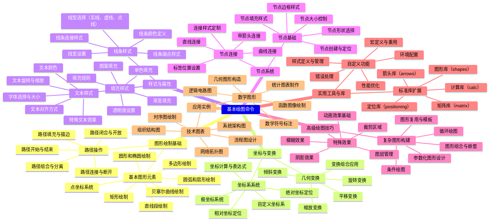
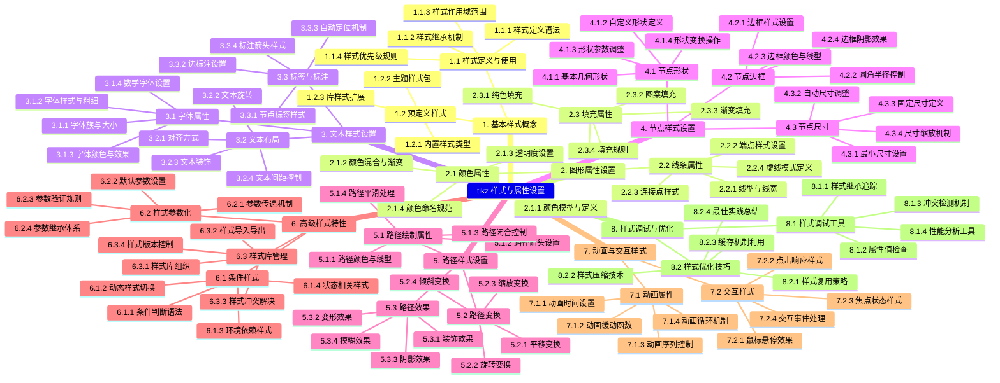
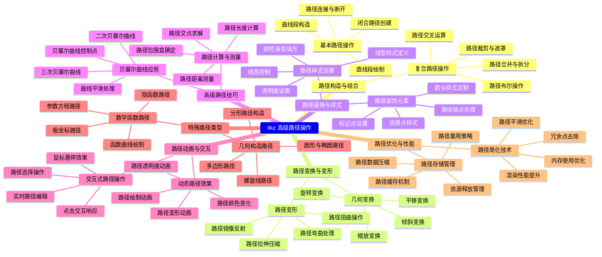
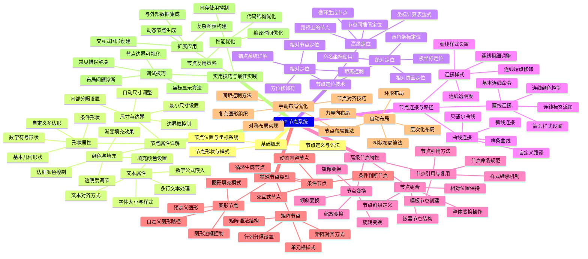
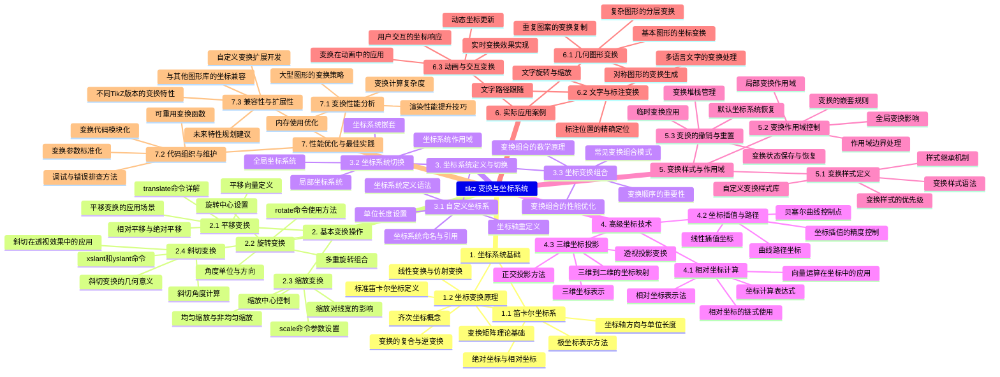
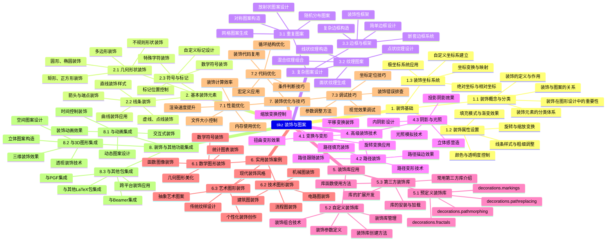

















```mermaid
mindmap
tikz 动画与交互 
    1. TikZ 动画基础
         1.1 动画概念与原理
              关键帧动画原理
              时间轴控制方法
              插值算法与平滑过渡
              动画循环与重复模式

         1.2 基本动画命令
              `\animate` 命令详解
              `\animatevalue` 参数动画
              `\begin{animateinline}` 环境
              帧率控制与时间参数

         1.3 动画属性设置
              颜色渐变动画
              位置移动动画
              缩放变换动画
              旋转动画效果

    2. 交互功能实现
         2.1 鼠标交互事件
              鼠标点击响应
              鼠标悬停效果
              拖拽交互实现
              区域选择交互

         2.2 键盘交互控制
              按键事件处理
              快捷键绑定
              方向键控制
              功能键响应

         2.3 交互状态管理
              状态切换机制
              条件判断交互
              交互状态保存
              多状态转换

    3. 高级动画技术
         3.1 路径动画
              沿路径运动动画
              贝塞尔曲线动画
              自定义轨迹动画
              路径跟随效果

         3.2 变形动画
              形状变形技术
              节点变形动画
              网格变形效果
              自由变形实现

         3.3 物理模拟动画
              重力模拟效果
              碰撞检测动画
              弹性运动模拟
              粒子系统动画

    4. 多媒体集成
         4.1 声音集成
              音效触发机制
              背景音乐控制
              声音同步动画
              音频文件格式支持

         4.2 视频集成
              视频嵌入技术
              视频播放控制
              视频与动画同步
              视频格式兼容性

    5. 实用案例与应用
         5.1 教育演示动画
              数学函数可视化
              物理过程演示
              化学反应动画
              生物过程模拟

         5.2 数据可视化动画
              图表动态更新
              数据流动画
              统计图表动画
              实时数据可视化

         5.3 用户界面动画
              按钮交互效果
              菜单展开动画
              页面切换过渡
              加载动画设计

    6. 性能优化与调试
         6.1 动画性能优化
              帧率优化技巧
              内存使用优化
              渲染性能提升
              文件大小控制

         6.2 调试与测试
              动画调试工具
              交互测试方法
              兼容性测试
              性能分析工具

    7. 扩展与集成
         7.1 与其他包集成
              与 Beamer 集成
              与 PGFPlots 结合
              JavaScript 集成
              Web 应用集成

         7.2 自定义扩展开发
              自定义动画命令
              交互组件开发
              插件开发指南
              扩展包发布

```


//TODO0


tikz



{}
## 基本绘图命令
### 图形绘制基础

#### 基本图形元素
##### 点坐标系统
##### 直线段绘制
##### 矩形绘制
##### 圆形和椭圆绘制
##### 圆弧和扇形绘制
##### 多边形绘制
##### 贝塞尔曲线绘制

#### 路径操作
##### 路径开始与结束
##### 路径连接与断开
##### 路径填充与描边
##### 路径闭合与开放
##### 路径组合与分离

### 坐标与变换

#### 坐标系系统
##### 绝对坐标定位
##### 相对坐标定位
##### 极坐标系统
##### 自定义坐标系
##### 坐标计算与表达式

#### 几何变换
##### 平移变换
##### 旋转变换
##### 缩放变换
##### 倾斜变换
##### 变换组合应用

### 样式与属性

#### 线条样式
##### 线宽设置
##### 线型选择（实线、虚线、点线）
##### 线条颜色定义
##### 线条端点样式
##### 线条连接样式

#### 填充样式
##### 单色填充
##### 渐变填充
##### 图案填充
##### 透明度设置
##### 填充规则

#### 文本样式
##### 字体选择与大小
##### 文本颜色
##### 文本对齐方式
##### 文本旋转与缩放
##### 特殊文本效果

### 节点系统

#### 节点基础
##### 节点创建与定位
##### 节点形状选择
##### 节点大小控制
##### 节点边框样式
##### 节点填充样式

#### 节点连接
##### 直线连接
##### 曲线连接
##### 带箭头连接
##### 标签位置设置
##### 连接样式定制

### 高级绘图技巧

#### 复杂图形构建
##### 图形组合与嵌套
##### 图形复用与模板
##### 参数化图形设计
##### 条件绘图
##### 循环绘图

#### 特殊效果
##### 阴影效果
##### 模糊效果
##### 裁剪区域
##### 图层管理
##### 动画效果基础

### 实用工具与库

#### 标准库扩展
##### 图形库（shapes）
##### 箭头库（arrows）
##### 定位库（positioning）
##### 矩阵库（matrix）
##### 计算库（calc）

#### 自定义功能
##### 宏定义与重用
##### 样式定义与管理
##### 环境配置
##### 错误处理
##### 性能优化

### 应用实例

#### 数学图形
##### 函数图像绘制
##### 几何图形构造
##### 统计图表制作
##### 逻辑电路图
##### 数学符号标注

#### 技术图表
##### 流程图设计
##### 组织结构图
##### 网络拓扑图
##### 时序图绘制
##### 系统架构图
{}
//TODO2
{}
## tikz 样式与属性设置
### 1. 基本样式概念
#### 1.1 样式定义与使用
##### 1.1.1 样式定义语法
##### 1.1.2 样式继承机制
##### 1.1.3 样式作用域范围
##### 1.1.4 样式优先级规则

#### 1.2 预定义样式
##### 1.2.1 内置样式类型
##### 1.2.2 主题样式包
##### 1.2.3 库样式扩展

### 2. 图形属性设置
#### 2.1 颜色属性
##### 2.1.1 颜色模型与定义
##### 2.1.2 颜色混合与渐变
##### 2.1.3 透明度设置
##### 2.1.4 颜色命名规范

#### 2.2 线条属性
##### 2.2.1 线型与线宽
##### 2.2.2 端点样式设置
##### 2.2.3 连接点样式
##### 2.2.4 虚线模式定义

#### 2.3 填充属性
##### 2.3.1 纯色填充
##### 2.3.2 图案填充
##### 2.3.3 渐变填充
##### 2.3.4 填充规则

### 3. 文本样式设置
#### 3.1 字体属性
##### 3.1.1 字体族与大小
##### 3.1.2 字体样式与粗细
##### 3.1.3 字体颜色与效果
##### 3.1.4 数学字体设置

#### 3.2 文本布局
##### 3.2.1 对齐方式
##### 3.2.2 文本旋转
##### 3.2.3 文本装饰
##### 3.2.4 文本间距控制

#### 3.3 标签与标注
##### 3.3.1 节点标签样式
##### 3.3.2 边标注设置
##### 3.3.3 自动定位机制
##### 3.3.4 标注箭头样式

### 4. 节点样式设置
#### 4.1 节点形状
##### 4.1.1 基本几何形状
##### 4.1.2 自定义形状定义
##### 4.1.3 形状参数调整
##### 4.1.4 形状变换操作

#### 4.2 节点边框
##### 4.2.1 边框样式设置
##### 4.2.2 圆角半径控制
##### 4.2.3 边框颜色与线型
##### 4.2.4 边框阴影效果

#### 4.3 节点尺寸
##### 4.3.1 最小尺寸设置
##### 4.3.2 自动尺寸调整
##### 4.3.3 固定尺寸定义
##### 4.3.4 尺寸缩放机制

### 5. 路径样式设置
#### 5.1 路径绘制属性
##### 5.1.1 路径颜色与线型
##### 5.1.2 路径箭头设置
##### 5.1.3 路径闭合控制
##### 5.1.4 路径平滑处理

#### 5.2 路径变换
##### 5.2.1 平移变换
##### 5.2.2 旋转变换
##### 5.2.3 缩放变换
##### 5.2.4 倾斜变换

#### 5.3 路径效果
##### 5.3.1 装饰效果
##### 5.3.2 变形效果
##### 5.3.3 阴影效果
##### 5.3.4 模糊效果

### 6. 高级样式特性
#### 6.1 条件样式
##### 6.1.1 条件判断语法
##### 6.1.2 动态样式切换
##### 6.1.3 环境依赖样式
##### 6.1.4 状态相关样式

#### 6.2 样式参数化
##### 6.2.1 参数传递机制
##### 6.2.2 默认参数设置
##### 6.2.3 参数验证规则
##### 6.2.4 参数继承体系

#### 6.3 样式库管理
##### 6.3.1 样式库组织
##### 6.3.2 样式导入导出
##### 6.3.3 样式冲突解决
##### 6.3.4 样式版本控制

### 7. 动画与交互样式
#### 7.1 动画属性
##### 7.1.1 动画时间设置
##### 7.1.2 动画缓动函数
##### 7.1.3 动画序列控制
##### 7.1.4 动画循环机制

#### 7.2 交互样式
##### 7.2.1 鼠标悬停效果
##### 7.2.2 点击响应样式
##### 7.2.3 焦点状态样式
##### 7.2.4 交互事件处理

### 8. 样式调试与优化
#### 8.1 样式调试工具
##### 8.1.1 样式继承追踪
##### 8.1.2 属性值检查
##### 8.1.3 冲突检测机制
##### 8.1.4 性能分析工具

#### 8.2 样式优化技巧
##### 8.2.1 样式复用策略
##### 8.2.2 样式压缩技术
##### 8.2.3 缓存机制利用
##### 8.2.4 最佳实践总结
{}
//TODO3 
{}
## tikz 高级路径操作
### 路径构造与组合
#### 基本路径操作
##### 直线段绘制
##### 曲线段构造
##### 闭合路径创建
##### 路径连接与断开

#### 复合路径操作
##### 路径合并与拆分
##### 路径交叉运算
##### 路径布尔操作
##### 路径裁剪与遮罩

### 路径变换与变形
#### 几何变换
##### 平移变换
##### 旋转变换
##### 缩放变换
##### 倾斜变换

#### 路径变形
##### 路径扭曲操作
##### 路径弯曲处理
##### 路径拉伸压缩
##### 路径镜像反射

### 路径装饰与样式
#### 路径样式设置
##### 线型样式定义
##### 颜色渐变填充
##### 透明度设置
##### 线宽控制

#### 路径装饰元素
##### 箭头样式定制
##### 标记点设置
##### 路径端点处理
##### 连接点样式

### 高级路径技巧
#### 贝塞尔曲线应用
##### 三次贝塞尔曲线
##### 二次贝塞尔曲线
##### 贝塞尔曲线控制点
##### 曲线平滑处理

#### 路径计算与测量
##### 路径长度计算
##### 路径交点求解
##### 路径包围盒确定
##### 路径距离测量

### 路径动画与交互
#### 动态路径效果
##### 路径绘制动画
##### 路径变形动画
##### 路径颜色变化
##### 路径透明度动画

#### 交互式路径操作
##### 鼠标悬停效果
##### 点击交互响应
##### 路径选择操作
##### 实时路径编辑

### 特殊路径类型
#### 数学函数路径
##### 函数曲线绘制
##### 参数方程路径
##### 极坐标路径
##### 隐函数路径

#### 几何构造路径
##### 多边形路径
##### 圆形与椭圆路径
##### 螺旋线路径
##### 分形路径构造

### 路径优化与性能
#### 路径简化技术
##### 冗余点去除
##### 路径平滑优化
##### 内存使用优化
##### 渲染性能提升

#### 路径存储管理
##### 路径数据压缩
##### 路径缓存机制
##### 路径重用策略
##### 资源释放管理
{}
//TODO4 
{}
## tikz 节点系统 
### 基础概念
##### 节点定义与语法
##### 节点形状与样式
##### 节点位置与坐标系统

### 节点属性详解
#### 形状属性
##### 基本几何形状
##### 自定义多边形
##### 条件形状
##### 数学符号形状

#### 尺寸与边界
##### 最小尺寸设置
##### 内部分隔设置
##### 边界框控制
##### 自动尺寸调整

#### 颜色与填充
##### 填充颜色设置
##### 边框颜色控制
##### 透明度调节
##### 渐变填充效果

#### 文本属性
##### 文本对齐方式
##### 字体大小与样式
##### 多行文本处理
##### 数学公式嵌入

### 节点定位技术
#### 绝对定位
##### 直角坐标定位
##### 极坐标定位
##### 命名坐标使用
##### 相对页面定位

#### 相对定位
##### 相对节点定位
##### 锚点系统详解
##### 方位修饰符
##### 距离控制

#### 高级定位
##### 路径上的节点
##### 节点间插值定位
##### 坐标计算表达式
##### 循环生成节点

### 节点连接与路径
#### 直线连接
##### 基本连线命令
##### 箭头样式设置
##### 连线标签添加
##### 连线颜色控制

#### 曲线连接
##### 贝塞尔曲线
##### 样条曲线
##### 弧线连接
##### 自定义路径

#### 连接样式
##### 连线粗细调整
##### 虚线样式设置
##### 连线端点修饰
##### 连线透明度

### 高级节点特性
#### 节点引用与复用
##### 节点命名规范
##### 节点引用方法
##### 样式继承机制
##### 模板节点创建

#### 节点变换
##### 旋转变换
##### 缩放变换
##### 倾斜变换
##### 镜像变换

#### 节点组合
##### 节点群组定义
##### 相对位置保持
##### 整体变换操作
##### 嵌套节点结构

### 特殊节点类型
#### 矩阵节点
##### 矩阵语法结构
##### 行列分隔设置
##### 单元格样式
##### 矩阵对齐方式

#### 图形节点
##### 预定义图形
##### 自定义图形路径
##### 图形填充模式
##### 图形边框控制

#### 条件节点
##### 条件判断节点
##### 循环生成节点
##### 动态内容节点
##### 交互式节点

### 节点布局算法
#### 自动布局
##### 树状布局算法
##### 力导向布局
##### 层次化布局
##### 环形布局

#### 手动布局优化
##### 节点对齐技巧
##### 间距控制方法
##### 对称布局实现
##### 复杂图形组织

### 实用技巧与最佳实践
#### 性能优化
##### 节点复用策略
##### 编译时间优化
##### 内存使用控制
##### 代码结构优化

#### 调试技巧
##### 节点边界可视化
##### 坐标显示方法
##### 布局问题诊断
##### 常见错误解决

#### 扩展应用
##### 与外部数据集成
##### 动态节点生成
##### 交互式图形创建
##### 复杂图表构建
{}
//TODO5 
{}
## tikz 变换与坐标系统 
### 1. 坐标系统基础
#### 1.1 笛卡尔坐标系
##### 标准笛卡尔坐标定义
##### 坐标轴方向与单位长度
##### 绝对坐标与相对坐标
##### 极坐标表示方法

#### 1.2 坐标变换原理
##### 齐次坐标概念
##### 变换矩阵理论基础
##### 线性变换与仿射变换
##### 变换的复合与逆变换

### 2. 基本变换操作
#### 2.1 平移变换
##### translate命令详解
##### 平移向量定义
##### 相对平移与绝对平移
##### 平移变换的应用场景

#### 2.2 旋转变换
##### rotate命令使用方法
##### 旋转中心设置
##### 角度单位与方向
##### 多重旋转组合

#### 2.3 缩放变换
##### scale命令参数设置
##### 均匀缩放与非均匀缩放
##### 缩放中心控制
##### 缩放对线宽的影响

#### 2.4 斜切变换
##### xslant和yslant命令
##### 斜切角度计算
##### 斜切变换的几何意义
##### 斜切在透视效果中的应用

### 3. 坐标系统定义与切换
#### 3.1 自定义坐标系
##### 坐标系统定义语法
##### 坐标轴重定义
##### 单位长度设置
##### 坐标系统命名与引用

#### 3.2 坐标系统切换
##### 局部坐标系统
##### 全局坐标系统
##### 坐标系统嵌套
##### 坐标系统作用域

#### 3.3 坐标变换组合
##### 变换顺序的重要性
##### 变换组合的数学原理
##### 常见变换组合模式
##### 变换组合的性能优化

### 4. 高级坐标技术
#### 4.1 相对坐标计算
##### 相对坐标表示法
##### 坐标计算表达式
##### 向量运算在坐标中的应用
##### 相对坐标的链式使用

#### 4.2 坐标插值与路径
##### 线性插值坐标
##### 曲线路径坐标
##### 贝塞尔曲线控制点
##### 坐标插值的精度控制

#### 4.3 三维坐标投影
##### 三维坐标表示
##### 透视投影变换
##### 正交投影方法
##### 三维到二维的坐标映射

### 5. 变换样式与作用域
#### 5.1 变换样式定义
##### 变换样式语法
##### 样式继承机制
##### 变换样式的优先级
##### 自定义变换样式库

#### 5.2 变换作用域控制
##### 局部变换作用域
##### 全局变换影响
##### 变换的嵌套规则
##### 作用域边界处理

#### 5.3 变换的撤销与重置
##### 变换堆栈管理
##### 临时变换应用
##### 变换状态保存与恢复
##### 默认坐标系统恢复

### 6. 实际应用案例
#### 6.1 几何图形变换
##### 基本图形的坐标变换
##### 复杂图形的分层变换
##### 对称图形的变换生成
##### 重复图案的变换复制

#### 6.2 文字与标注变换
##### 文字旋转与缩放
##### 标注位置的精确定位
##### 文字路径跟随
##### 多语言文字的变换处理

#### 6.3 动画与交互变换
##### 变换在动画中的应用
##### 动态坐标更新
##### 用户交互的坐标响应
##### 实时变换效果实现

### 7. 性能优化与最佳实践
#### 7.1 变换性能分析
##### 变换计算复杂度
##### 内存使用优化
##### 渲染性能提升技巧
##### 大型图形的变换策略

#### 7.2 代码组织与维护
##### 变换代码模块化
##### 可重用变换函数
##### 变换参数标准化
##### 调试与错误排查方法

#### 7.3 兼容性与扩展性
##### 不同TikZ版本的变换特性
##### 与其他图形库的坐标兼容
##### 自定义变换扩展开发
##### 未来特性规划建议
{}
//TODO6 
{}
### tikz 装饰与图案
### 1. 装饰基础
#### 1.1 装饰概念与分类
##### 装饰的定义与作用
##### 装饰元素的分类体系
##### 装饰与图案的关系
##### 装饰在图形设计中的重要性

#### 1.2 装饰属性设置
##### 颜色与透明度控制
##### 线条样式与粗细调整
##### 填充模式与渐变效果
##### 旋转与缩放变换

#### 1.3 装饰坐标系统
##### 绝对坐标与相对坐标
##### 极坐标系统应用
##### 自定义坐标系建立
##### 坐标变换与映射

### 2. 基本装饰元素
#### 2.1 几何形状装饰
##### 圆形、椭圆装饰
##### 矩形、正方形装饰
##### 多边形装饰
##### 不规则形状装饰

#### 2.2 线条装饰
##### 直线装饰样式
##### 曲线装饰应用
##### 虚线、点线装饰
##### 箭头与端点装饰

#### 2.3 符号与标记
##### 数学符号装饰
##### 特殊字符装饰
##### 自定义标记设计
##### 标记位置控制

### 3. 复杂图案设计
#### 3.1 重复图案
##### 网格图案生成
##### 放射状图案设计
##### 对称图案构造
##### 随机分布图案

#### 3.2 纹理图案
##### 点状纹理设计
##### 线状纹理构造
##### 面状纹理生成
##### 混合纹理组合

#### 3.3 边框与框架
##### 简单边框设计
##### 复杂边框构造
##### 装饰性框架
##### 嵌套边框系统

### 4. 高级装饰技术
#### 4.1 变换与变形
##### 平移变换装饰
##### 旋转变换应用
##### 缩放变换控制
##### 扭曲变形效果

#### 4.2 路径装饰
##### 路径跟随装饰
##### 路径变形技术
##### 路径填充装饰
##### 路径描边效果

#### 4.3 阴影与光照
##### 投影阴影效果
##### 内阴影设计
##### 光照模拟技术
##### 立体感营造

### 5. 装饰库应用
#### 5.1 预定义装饰库
##### decorations.pathmorphing
##### decorations.pathreplacing
##### decorations.markings
##### decorations.fractals

#### 5.2 自定义装饰库
##### 装饰库创建方法
##### 装饰参数定义
##### 装饰组合技术
##### 装饰库管理

#### 5.3 第三方装饰库
##### 常用第三方库介绍
##### 库的安装与加载
##### 库函数使用方法
##### 库的扩展开发

### 6. 实用装饰案例
#### 6.1 数学图形装饰
##### 函数图像装饰
##### 几何图形美化
##### 统计图表装饰
##### 数学符号装饰

#### 6.2 技术图形装饰
##### 电路图装饰
##### 机械图装饰
##### 建筑图装饰
##### 流程图装饰

#### 6.3 艺术图形装饰
##### 抽象艺术图案
##### 传统纹样设计
##### 现代装饰风格
##### 个性化装饰创作

### 7. 装饰优化与技巧
#### 7.1 性能优化
##### 装饰计算效率
##### 内存使用优化
##### 渲染速度提升
##### 文件大小控制

#### 7.2 代码优化
##### 装饰代码复用
##### 宏定义应用
##### 循环结构优化
##### 条件判断技巧

#### 7.3 调试技巧
##### 装饰错误排查
##### 视觉效果调试
##### 坐标定位技巧
##### 参数调整方法

### 8. 装饰与其他功能集成
#### 8.1 与动画集成
##### 装饰动画效果
##### 动态图案设计
##### 交互式装饰
##### 时间控制装饰

#### 8.2 与3D图形集成
##### 三维装饰效果
##### 空间图案设计
##### 透视装饰技术
##### 立体图案构造

#### 8.3 与其他包集成
##### 与PGF集成
##### 与Beamer集成
##### 与其他LaTeX包集成
##### 跨平台装饰应用
{}
//TODO7 
{}
## tikz 动画与交互 
### 1. TikZ 动画基础
#### 1.1 动画概念与原理
##### 关键帧动画原理
##### 时间轴控制方法
##### 插值算法与平滑过渡
##### 动画循环与重复模式

#### 1.2 基本动画命令
##### `\animate` 命令详解
##### `\animatevalue` 参数动画
##### `\begin{animateinline}` 环境
##### 帧率控制与时间参数

#### 1.3 动画属性设置
##### 颜色渐变动画
##### 位置移动动画
##### 缩放变换动画
##### 旋转动画效果

### 2. 交互功能实现
#### 2.1 鼠标交互事件
##### 鼠标点击响应
##### 鼠标悬停效果
##### 拖拽交互实现
##### 区域选择交互

#### 2.2 键盘交互控制
##### 按键事件处理
##### 快捷键绑定
##### 方向键控制
##### 功能键响应

#### 2.3 交互状态管理
##### 状态切换机制
##### 条件判断交互
##### 交互状态保存
##### 多状态转换

### 3. 高级动画技术
#### 3.1 路径动画
##### 沿路径运动动画
##### 贝塞尔曲线动画
##### 自定义轨迹动画
##### 路径跟随效果

#### 3.2 变形动画
##### 形状变形技术
##### 节点变形动画
##### 网格变形效果
##### 自由变形实现

#### 3.3 物理模拟动画
##### 重力模拟效果
##### 碰撞检测动画
##### 弹性运动模拟
##### 粒子系统动画

### 4. 多媒体集成
#### 4.1 声音集成
##### 音效触发机制
##### 背景音乐控制
##### 声音同步动画
##### 音频文件格式支持

#### 4.2 视频集成
##### 视频嵌入技术
##### 视频播放控制
##### 视频与动画同步
##### 视频格式兼容性

### 5. 实用案例与应用
#### 5.1 教育演示动画
##### 数学函数可视化
##### 物理过程演示
##### 化学反应动画
##### 生物过程模拟

#### 5.2 数据可视化动画
##### 图表动态更新
##### 数据流动画
##### 统计图表动画
##### 实时数据可视化

#### 5.3 用户界面动画
##### 按钮交互效果
##### 菜单展开动画
##### 页面切换过渡
##### 加载动画设计

### 6. 性能优化与调试
#### 6.1 动画性能优化
##### 帧率优化技巧
##### 内存使用优化
##### 渲染性能提升
##### 文件大小控制

#### 6.2 调试与测试
##### 动画调试工具
##### 交互测试方法
##### 兼容性测试
##### 性能分析工具

### 7. 扩展与集成
#### 7.1 与其他包集成
##### 与 Beamer 集成
##### 与 PGFPlots 结合
##### JavaScript 集成
##### Web 应用集成

#### 7.2 自定义扩展开发
##### 自定义动画命令
##### 交互组件开发
##### 插件开发指南
##### 扩展包发布
{}
//TODO8 
{}
## 外部数据集成 
{}
//TODO9
{}
## 数学图形绘
{}
//TODO10 
{}
## 技术图表 
{}
//TODO11 
{}
## 艺术创作
{}
{}
## 代码优化 
{}
{}
## 性能优化 
{}
{}
## 输出与发布
{}
{}
## 官方拓展库 
{}
{}
## 第三方工具 
{}
{}
## 开发工具
{}


//TODO1

