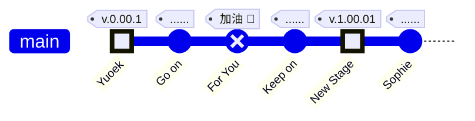

# Yuoek Docs

     

{}
**為虞十载，我心万宁** For you
{}

```mermaid 
gitGraph
   commit id: "Yuoek" type: HIGHLIGHT tag: "v.0.00.1"
   commit id: "Go on" tag: "......"
   commit id: "For You" type: REVERSE tag: "加油 🙂"
   commit id: "Keep on" tag: "......"
   commit id: "New Stage" type: HIGHLIGHT tag: "v.1.00.01"
   commit id: "Sophie" tag: "......"

```

{}

1.     
    

    🏷完成了基本目录构成，下面就开始学习、收集资料吧！

{}

