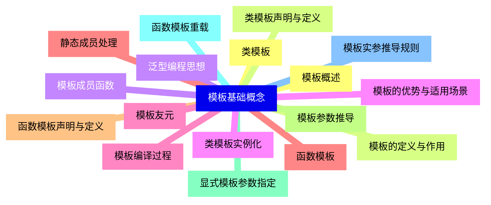
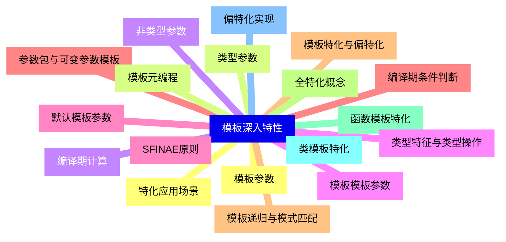
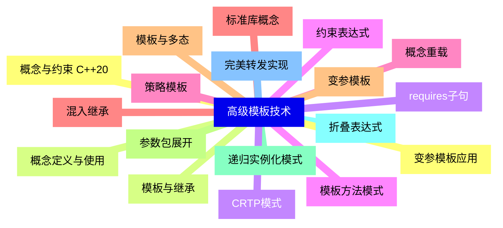
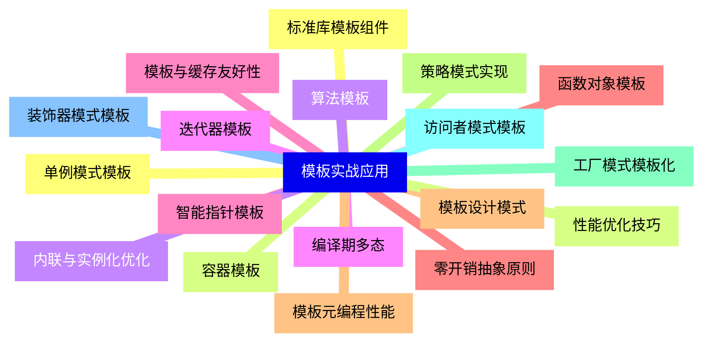
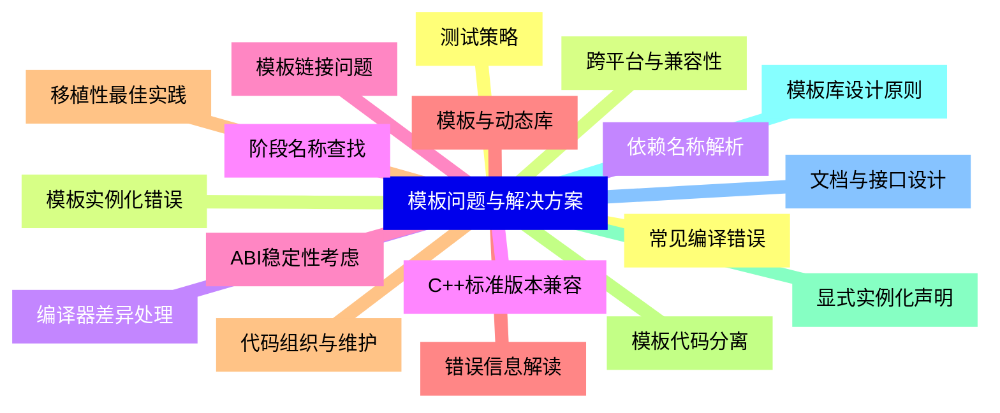
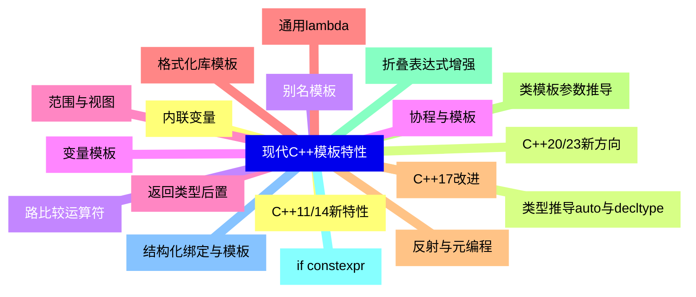
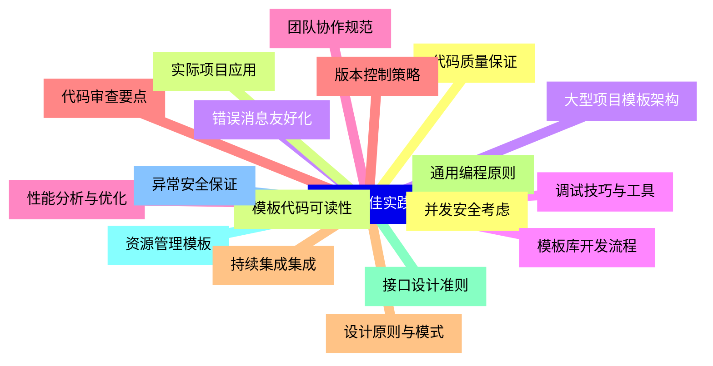


### 1 [模板基础概念](#1)
#### 1.1 [模板概述](#1)
#### 1.2 [模板的定义与作用](#1)
#### 1.3 [泛型编程思想](#1)
#### 1.4 [模板的优势与适用场景](#1)
#### 1.5 [模板编译过程](#1)
#### 1.6 [函数模板](#1)
#### 1.7 [函数模板声明与定义](#1)
#### 1.8 [模板参数推导](#1)
#### 1.9 [显式模板参数指定](#1)
#### 1.10 [函数模板重载](#1)
#### 1.11 [模板实参推导规则](#1)
#### 1.12 [类模板](#1)
#### 1.13 [类模板声明与定义](#1)
#### 1.14 [模板成员函数](#1)
#### 1.15 [类模板实例化](#1)
#### 1.16 [模板友元](#1)
#### 1.17 [静态成员处理](#1)
### 2 [模板深入特性](#2)
#### 2.1 [模板参数](#2)
#### 2.2 [类型参数](#2)
#### 2.3 [非类型参数](#2)
#### 2.4 [模板模板参数](#2)
#### 2.5 [默认模板参数](#2)
#### 2.6 [参数包与可变参数模板](#2)
#### 2.7 [模板特化与偏特化](#2)
#### 2.8 [全特化概念](#2)
#### 2.9 [函数模板特化](#2)
#### 2.10 [类模板特化](#2)
#### 2.11 [偏特化实现](#2)
#### 2.12 [特化应用场景](#2)
#### 2.13 [模板元编程](#2)
#### 2.14 [编译期计算](#2)
#### 2.15 [类型特征与类型操作](#2)
#### 2.16 [SFINAE原则](#2)
#### 2.17 [编译期条件判断](#2)
#### 2.18 [模板递归与模式匹配](#2)
### 3 [高级模板技术](#3)
#### 3.1 [概念与约束 C++20](#3)
#### 3.2 [概念定义与使用](#3)
#### 3.3 [requires子句](#3)
#### 3.4 [约束表达式](#3)
#### 3.5 [概念重载](#3)
#### 3.6 [标准库概念](#3)
#### 3.7 [变参模板](#3)
#### 3.8 [参数包展开](#3)
#### 3.9 [递归实例化模式](#3)
#### 3.10 [折叠表达式](#3)
#### 3.11 [完美转发实现](#3)
#### 3.12 [变参模板应用](#3)
#### 3.13 [模板与继承](#3)
#### 3.14 [CRTP模式](#3)
#### 3.15 [模板方法模式](#3)
#### 3.16 [策略模板](#3)
#### 3.17 [混入继承](#3)
#### 3.18 [模板与多态](#3)
### 4 [模板实战应用](#4)
#### 4.1 [标准库模板组件](#4)
#### 4.2 [容器模板](#4)
#### 4.3 [算法模板](#4)
#### 4.4 [迭代器模板](#4)
#### 4.5 [智能指针模板](#4)
#### 4.6 [函数对象模板](#4)
#### 4.7 [模板设计模式](#4)
#### 4.8 [策略模式实现](#4)
#### 4.9 [工厂模式模板化](#4)
#### 4.10 [访问者模式模板](#4)
#### 4.11 [装饰器模式模板](#4)
#### 4.12 [单例模式模板](#4)
#### 4.13 [性能优化技巧](#4)
#### 4.14 [内联与实例化优化](#4)
#### 4.15 [编译期多态](#4)
#### 4.16 [模板与缓存友好性](#4)
#### 4.17 [零开销抽象原则](#4)
#### 4.18 [模板元编程性能](#4)
### 5 [模板问题与解决方案](#5)
#### 5.1 [常见编译错误](#5)
#### 5.2 [模板实例化错误](#5)
#### 5.3 [依赖名称解析](#5)
#### 5.4 [阶段名称查找](#5)
#### 5.5 [模板链接问题](#5)
#### 5.6 [错误信息解读](#5)
#### 5.7 [代码组织与维护](#5)
#### 5.8 [模板代码分离](#5)
#### 5.9 [显式实例化声明](#5)
#### 5.10 [模板库设计原则](#5)
#### 5.11 [文档与接口设计](#5)
#### 5.12 [测试策略](#5)
#### 5.13 [跨平台与兼容性](#5)
#### 5.14 [编译器差异处理](#5)
#### 5.15 [C++标准版本兼容](#5)
#### 5.16 [ABI稳定性考虑](#5)
#### 5.17 [模板与动态库](#5)
#### 5.18 [移植性最佳实践](#5)
### 6 [现代C++模板特性](#6)
#### 6.1 [C++11/14新特性](#6)
#### 6.2 [类型推导auto与decltype](#6)
#### 6.3 [别名模板](#6)
#### 6.4 [变量模板](#6)
#### 6.5 [返回类型后置](#6)
#### 6.6 [通用lambda](#6)
#### 6.7 [C++17改进](#6)
#### 6.8 [类模板参数推导](#6)
#### 6.9 [折叠表达式增强](#6)
#### 6.10 [if constexpr](#6)
#### 6.11 [结构化绑定与模板](#6)
#### 6.12 [内联变量](#6)
#### 6.13 [C++20/23新方向](#6)
#### 6.14 [路比较运算符](#6)
#### 6.15 [协程与模板](#6)
#### 6.16 [范围与视图](#6)
#### 6.17 [格式化库模板](#6)
#### 6.18 [反射与元编程](#6)
### 7 [模板最佳实践](#7)
#### 7.1 [代码质量保证](#7)
#### 7.2 [模板代码可读性](#7)
#### 7.3 [错误消息友好化](#7)
#### 7.4 [调试技巧与工具](#7)
#### 7.5 [性能分析与优化](#7)
#### 7.6 [代码审查要点](#7)
#### 7.7 [设计原则与模式](#7)
#### 7.8 [通用编程原则](#7)
#### 7.9 [接口设计准则](#7)
#### 7.10 [资源管理模板](#7)
#### 7.11 [异常安全保证](#7)
#### 7.12 [并发安全考虑](#7)
#### 7.13 [实际项目应用](#7)
#### 7.14 [大型项目模板架构](#7)
#### 7.15 [模板库开发流程](#7)
#### 7.16 [团队协作规范](#7)
#### 7.17 [版本控制策略](#7)
#### 7.18 [持续集成集成](#7)




### 1 模板基础概念

---
### 1 模板基础概念
___
#### 1.1 模板概述
___
#### 1.2 模板的定义与作用
___
#### 1.3 泛型编程思想
___
#### 1.4 模板的优势与适用场景
___
#### 1.5 模板编译过程
___
#### 1.6 函数模板
___
#### 1.7 函数模板声明与定义
___
#### 1.8 模板参数推导
___
#### 1.9 显式模板参数指定
___
#### 1.10 函数模板重载
___
#### 1.11 模板实参推导规则
___
#### 1.12 类模板
___
#### 1.13 类模板声明与定义
___
#### 1.14 模板成员函数
___
#### 1.15 类模板实例化
___
#### 1.16 模板友元
___
#### 1.17 静态成员处理
### 2 模板深入特性

---
### 2 模板深入特性
___
#### 2.1 模板参数
___
#### 2.2 类型参数
___
#### 2.3 非类型参数
___
#### 2.4 模板模板参数
___
#### 2.5 默认模板参数
___
#### 2.6 参数包与可变参数模板
___
#### 2.7 模板特化与偏特化
___
#### 2.8 全特化概念
___
#### 2.9 函数模板特化
___
#### 2.10 类模板特化
___
#### 2.11 偏特化实现
___
#### 2.12 特化应用场景
___
#### 2.13 模板元编程
___
#### 2.14 编译期计算
___
#### 2.15 类型特征与类型操作
___
#### 2.16 SFINAE原则
___
#### 2.17 编译期条件判断
___
#### 2.18 模板递归与模式匹配
### 3 高级模板技术

---
### 3 高级模板技术
___
#### 3.1 概念与约束 C++20
___
#### 3.2 概念定义与使用
___
#### 3.3 requires子句
___
#### 3.4 约束表达式
___
#### 3.5 概念重载
___
#### 3.6 标准库概念
___
#### 3.7 变参模板
___
#### 3.8 参数包展开
___
#### 3.9 递归实例化模式
___
#### 3.10 折叠表达式
___
#### 3.11 完美转发实现
___
#### 3.12 变参模板应用
___
#### 3.13 模板与继承
___
#### 3.14 CRTP模式
___
#### 3.15 模板方法模式
___
#### 3.16 策略模板
___
#### 3.17 混入继承
___
#### 3.18 模板与多态
### 4 模板实战应用

---
### 4 模板实战应用
___
#### 4.1 标准库模板组件
___
#### 4.2 容器模板
___
#### 4.3 算法模板
___
#### 4.4 迭代器模板
___
#### 4.5 智能指针模板
___
#### 4.6 函数对象模板
___
#### 4.7 模板设计模式
___
#### 4.8 策略模式实现
___
#### 4.9 工厂模式模板化
___
#### 4.10 访问者模式模板
___
#### 4.11 装饰器模式模板
___
#### 4.12 单例模式模板
___
#### 4.13 性能优化技巧
___
#### 4.14 内联与实例化优化
___
#### 4.15 编译期多态
___
#### 4.16 模板与缓存友好性
___
#### 4.17 零开销抽象原则
___
#### 4.18 模板元编程性能
### 5 模板问题与解决方案

---
### 5 模板问题与解决方案
___
#### 5.1 常见编译错误
___
#### 5.2 模板实例化错误
___
#### 5.3 依赖名称解析
___
#### 5.4 阶段名称查找
___
#### 5.5 模板链接问题
___
#### 5.6 错误信息解读
___
#### 5.7 代码组织与维护
___
#### 5.8 模板代码分离
___
#### 5.9 显式实例化声明
___
#### 5.10 模板库设计原则
___
#### 5.11 文档与接口设计
___
#### 5.12 测试策略
___
#### 5.13 跨平台与兼容性
___
#### 5.14 编译器差异处理
___
#### 5.15 C++标准版本兼容
___
#### 5.16 ABI稳定性考虑
___
#### 5.17 模板与动态库
___
#### 5.18 移植性最佳实践
### 6 现代C++模板特性

---
### 6 现代C++模板特性
___
#### 6.1 C++11/14新特性
___
#### 6.2 类型推导auto与decltype
___
#### 6.3 别名模板
___
#### 6.4 变量模板
___
#### 6.5 返回类型后置
___
#### 6.6 通用lambda
___
#### 6.7 C++17改进
___
#### 6.8 类模板参数推导
___
#### 6.9 折叠表达式增强
___
#### 6.10 if constexpr
___
#### 6.11 结构化绑定与模板
___
#### 6.12 内联变量
___
#### 6.13 C++20/23新方向
___
#### 6.14 路比较运算符
___
#### 6.15 协程与模板
___
#### 6.16 范围与视图
___
#### 6.17 格式化库模板
___
#### 6.18 反射与元编程
### 7 模板最佳实践

---
### 7 模板最佳实践
___
#### 7.1 代码质量保证
___
#### 7.2 模板代码可读性
___
#### 7.3 错误消息友好化
___
#### 7.4 调试技巧与工具
___
#### 7.5 性能分析与优化
___
#### 7.6 代码审查要点
___
#### 7.7 设计原则与模式
___
#### 7.8 通用编程原则
___
#### 7.9 接口设计准则
___
#### 7.10 资源管理模板
___
#### 7.11 异常安全保证
___
#### 7.12 并发安全考虑
___
#### 7.13 实际项目应用
___
#### 7.14 大型项目模板架构
___
#### 7.15 模板库开发流程
___
#### 7.16 团队协作规范
___
#### 7.17 版本控制策略
___
#### 7.18 持续集成集成


### 1 模板基础概念{#1}

{}

<--->
{}
{}
{}
{}
{}
{}
{}
{}
{}
{}
{}
{}
{}
{}
{}
{}
{}
{}
{}
{}
{}
{}
{}
{}
{}
{}
{}
{}
{}
{}
{}
{}
{}
{}
{}

### 2 模板深入特性{#2}

{}
{}
{}
{}
{}
{}
{}
{}
{}
{}
{}
{}
{}
{}
{}
{}
{}
{}
{}
{}
{}
{}
{}
{}
{}
{}
{}
{}
{}
{}
{}
{}
{}
{}
{}
{}
{}
<--->

{}

### 3 高级模板技术{#3}

{}

<--->
{}
{}
{}
{}
{}
{}
{}
{}
{}
{}
{}
{}
{}
{}
{}
{}
{}
{}
{}
{}
{}
{}
{}
{}
{}
{}
{}
{}
{}
{}
{}
{}
{}
{}
{}
{}
{}

### 4 模板实战应用{#4}

{}
{}
{}
{}
{}
{}
{}
{}
{}
{}
{}
{}
{}
{}
{}
{}
{}
{}
{}
{}
{}
{}
{}
{}
{}
{}
{}
{}
{}
{}
{}
{}
{}
{}
{}
{}
{}
<--->

{}

### 5 模板问题与解决方案{#5}

{}

<--->
{}
{}
{}
{}
{}
{}
{}
{}
{}
{}
{}
{}
{}
{}
{}
{}
{}
{}
{}
{}
{}
{}
{}
{}
{}
{}
{}
{}
{}
{}
{}
{}
{}
{}
{}
{}
{}

### 6 现代C++模板特性{#6}

{}
{}
{}
{}
{}
{}
{}
{}
{}
{}
{}
{}
{}
{}
{}
{}
{}
{}
{}
{}
{}
{}
{}
{}
{}
{}
{}
{}
{}
{}
{}
{}
{}
{}
{}
{}
{}
<--->

{}

### 7 模板最佳实践{#7}

{}

<--->
{}
{}
{}
{}
{}
{}
{}
{}
{}
{}
{}
{}
{}
{}
{}
{}
{}
{}
{}
{}
{}
{}
{}
{}
{}
{}
{}
{}
{}
{}
{}
{}
{}
{}
{}
{}
{}
