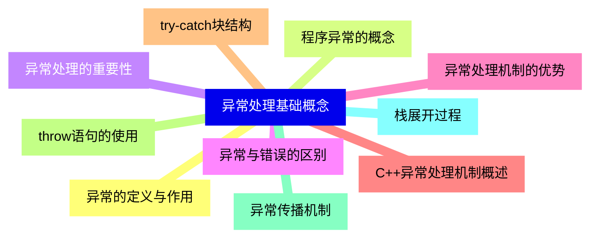
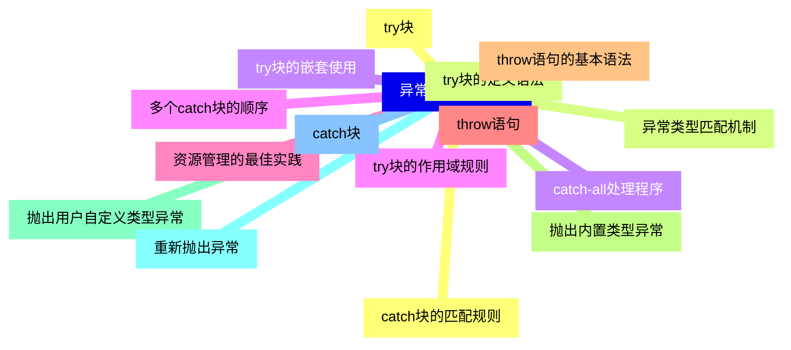
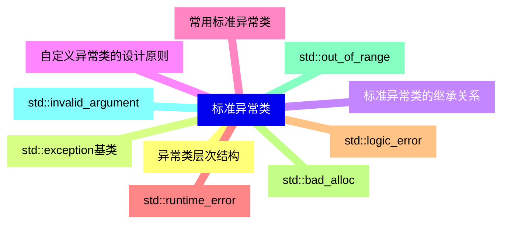
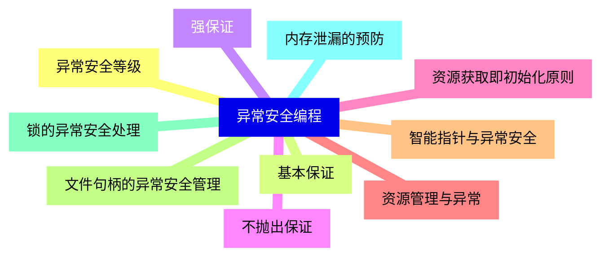
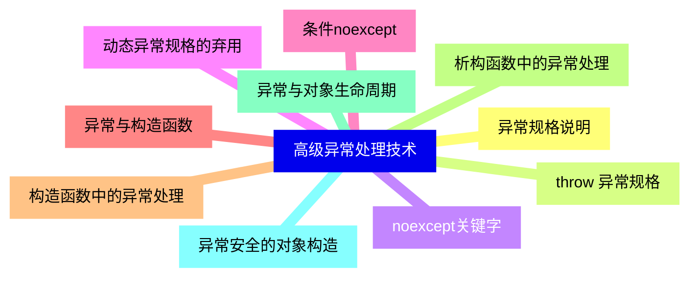
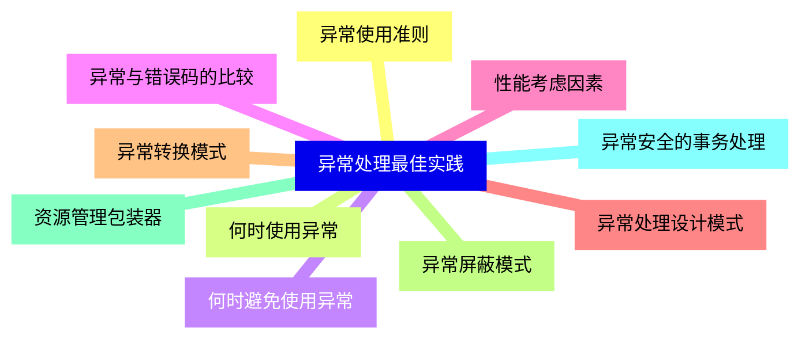
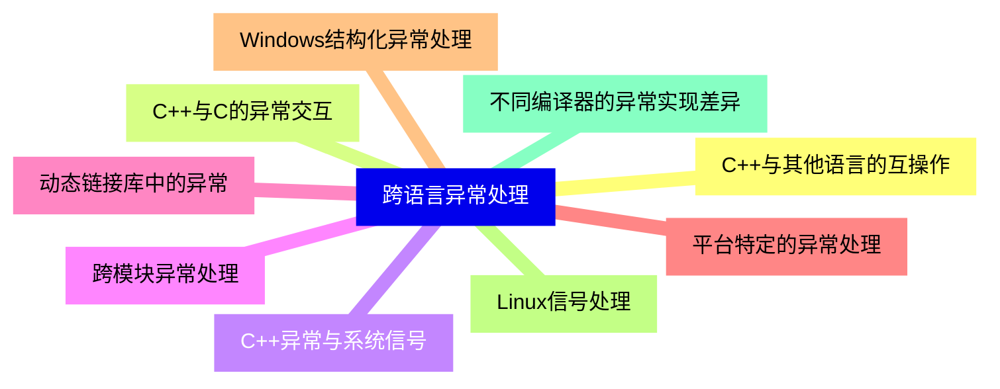
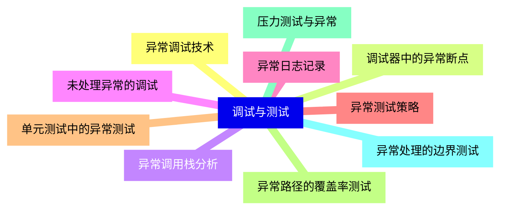
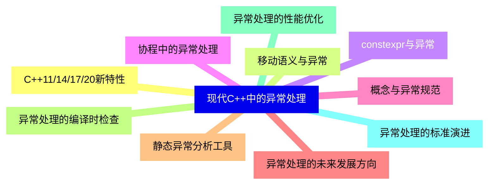


### 1 [异常处理基础概念](#1)
#### 1.1 [异常的定义与作用](#1)
#### 1.2 [程序异常的概念](#1)
#### 1.3 [异常处理的重要性](#1)
#### 1.4 [异常与错误的区别](#1)
#### 1.5 [异常处理机制的优势](#1)
#### 1.6 [C++异常处理机制概述](#1)
#### 1.7 [try-catch块结构](#1)
#### 1.8 [throw语句的使用](#1)
#### 1.9 [异常传播机制](#1)
#### 1.10 [栈展开过程](#1)
### 2 [异常处理语法详解](#2)
#### 2.1 [try块](#2)
#### 2.2 [try块的定义语法](#2)
#### 2.3 [try块的嵌套使用](#2)
#### 2.4 [try块的作用域规则](#2)
#### 2.5 [资源管理的最佳实践](#2)
#### 2.6 [throw语句](#2)
#### 2.7 [throw语句的基本语法](#2)
#### 2.8 [抛出内置类型异常](#2)
#### 2.9 [抛出用户自定义类型异常](#2)
#### 2.10 [重新抛出异常](#2)
#### 2.11 [catch块](#2)
#### 2.12 [catch块的匹配规则](#2)
#### 2.13 [异常类型匹配机制](#2)
#### 2.14 [catch-all处理程序](#2)
#### 2.15 [多个catch块的顺序](#2)
### 3 [标准异常类](#3)
#### 3.1 [异常类层次结构](#3)
#### 3.2 [std::exception基类](#3)
#### 3.3 [标准异常类的继承关系](#3)
#### 3.4 [自定义异常类的设计原则](#3)
#### 3.5 [常用标准异常类](#3)
#### 3.6 [std::runtime_error](#3)
#### 3.7 [std::logic_error](#3)
#### 3.8 [std::bad_alloc](#3)
#### 3.9 [std::out_of_range](#3)
#### 3.10 [std::invalid_argument](#3)
### 4 [异常安全编程](#4)
#### 4.1 [异常安全等级](#4)
#### 4.2 [基本保证](#4)
#### 4.3 [强保证](#4)
#### 4.4 [不抛出保证](#4)
#### 4.5 [资源获取即初始化原则](#4)
#### 4.6 [资源管理与异常](#4)
#### 4.7 [智能指针与异常安全](#4)
#### 4.8 [文件句柄的异常安全管理](#4)
#### 4.9 [锁的异常安全处理](#4)
#### 4.10 [内存泄漏的预防](#4)
### 5 [高级异常处理技术](#5)
#### 5.1 [异常规格说明](#5)
#### 5.2 [throw  异常规格](#5)
#### 5.3 [noexcept关键字](#5)
#### 5.4 [动态异常规格的弃用](#5)
#### 5.5 [条件noexcept](#5)
#### 5.6 [异常与构造函数](#5)
#### 5.7 [构造函数中的异常处理](#5)
#### 5.8 [析构函数中的异常处理](#5)
#### 5.9 [异常与对象生命周期](#5)
#### 5.10 [异常安全的对象构造](#5)
### 6 [异常处理最佳实践](#6)
#### 6.1 [异常使用准则](#6)
#### 6.2 [何时使用异常](#6)
#### 6.3 [何时避免使用异常](#6)
#### 6.4 [异常与错误码的比较](#6)
#### 6.5 [性能考虑因素](#6)
#### 6.6 [异常处理设计模式](#6)
#### 6.7 [异常转换模式](#6)
#### 6.8 [异常屏蔽模式](#6)
#### 6.9 [资源管理包装器](#6)
#### 6.10 [异常安全的事务处理](#6)
### 7 [跨语言异常处理](#7)
#### 7.1 [C++与其他语言的互操作](#7)
#### 7.2 [C++与C的异常交互](#7)
#### 7.3 [C++异常与系统信号](#7)
#### 7.4 [跨模块异常处理](#7)
#### 7.5 [动态链接库中的异常](#7)
#### 7.6 [平台特定的异常处理](#7)
#### 7.7 [Windows结构化异常处理](#7)
#### 7.8 [Linux信号处理](#7)
#### 7.9 [不同编译器的异常实现差异](#7)
### 8 [调试与测试](#8)
#### 8.1 [异常调试技术](#8)
#### 8.2 [调试器中的异常断点](#8)
#### 8.3 [异常调用栈分析](#8)
#### 8.4 [未处理异常的调试](#8)
#### 8.5 [异常日志记录](#8)
#### 8.6 [异常测试策略](#8)
#### 8.7 [单元测试中的异常测试](#8)
#### 8.8 [异常路径的覆盖率测试](#8)
#### 8.9 [压力测试与异常](#8)
#### 8.10 [异常处理的边界测试](#8)
### 9 [现代C++中的异常处理](#9)
#### 9.1 [C++11/14/17/20新特性](#9)
#### 9.2 [移动语义与异常](#9)
#### 9.3 [constexpr与异常](#9)
#### 9.4 [协程中的异常处理](#9)
#### 9.5 [概念与异常规范](#9)
#### 9.6 [异常处理的未来发展方向](#9)
#### 9.7 [静态异常分析工具](#9)
#### 9.8 [异常处理的编译时检查](#9)
#### 9.9 [异常处理的性能优化](#9)
#### 9.10 [异常处理的标准演进](#9)




### 1 异常处理基础概念

---
### 1 异常处理基础概念
___
#### 1.1 异常的定义与作用
___
#### 1.2 程序异常的概念
___
#### 1.3 异常处理的重要性
___
#### 1.4 异常与错误的区别
___
#### 1.5 异常处理机制的优势
___
#### 1.6 C++异常处理机制概述
___
#### 1.7 try-catch块结构
___
#### 1.8 throw语句的使用
___
#### 1.9 异常传播机制
___
#### 1.10 栈展开过程
### 2 异常处理语法详解

---
### 2 异常处理语法详解
___
#### 2.1 try块
___
#### 2.2 try块的定义语法
___
#### 2.3 try块的嵌套使用
___
#### 2.4 try块的作用域规则
___
#### 2.5 资源管理的最佳实践
___
#### 2.6 throw语句
___
#### 2.7 throw语句的基本语法
___
#### 2.8 抛出内置类型异常
___
#### 2.9 抛出用户自定义类型异常
___
#### 2.10 重新抛出异常
___
#### 2.11 catch块
___
#### 2.12 catch块的匹配规则
___
#### 2.13 异常类型匹配机制
___
#### 2.14 catch-all处理程序
___
#### 2.15 多个catch块的顺序
### 3 标准异常类

---
### 3 标准异常类
___
#### 3.1 异常类层次结构
___
#### 3.2 std::exception基类
___
#### 3.3 标准异常类的继承关系
___
#### 3.4 自定义异常类的设计原则
___
#### 3.5 常用标准异常类
___
#### 3.6 std::runtime_error
___
#### 3.7 std::logic_error
___
#### 3.8 std::bad_alloc
___
#### 3.9 std::out_of_range
___
#### 3.10 std::invalid_argument
### 4 异常安全编程

---
### 4 异常安全编程
___
#### 4.1 异常安全等级
___
#### 4.2 基本保证
___
#### 4.3 强保证
___
#### 4.4 不抛出保证
___
#### 4.5 资源获取即初始化原则
___
#### 4.6 资源管理与异常
___
#### 4.7 智能指针与异常安全
___
#### 4.8 文件句柄的异常安全管理
___
#### 4.9 锁的异常安全处理
___
#### 4.10 内存泄漏的预防
### 5 高级异常处理技术

---
### 5 高级异常处理技术
___
#### 5.1 异常规格说明
___
#### 5.2 throw  异常规格
___
#### 5.3 noexcept关键字
___
#### 5.4 动态异常规格的弃用
___
#### 5.5 条件noexcept
___
#### 5.6 异常与构造函数
___
#### 5.7 构造函数中的异常处理
___
#### 5.8 析构函数中的异常处理
___
#### 5.9 异常与对象生命周期
___
#### 5.10 异常安全的对象构造
### 6 异常处理最佳实践

---
### 6 异常处理最佳实践
___
#### 6.1 异常使用准则
___
#### 6.2 何时使用异常
___
#### 6.3 何时避免使用异常
___
#### 6.4 异常与错误码的比较
___
#### 6.5 性能考虑因素
___
#### 6.6 异常处理设计模式
___
#### 6.7 异常转换模式
___
#### 6.8 异常屏蔽模式
___
#### 6.9 资源管理包装器
___
#### 6.10 异常安全的事务处理
### 7 跨语言异常处理

---
### 7 跨语言异常处理
___
#### 7.1 C++与其他语言的互操作
___
#### 7.2 C++与C的异常交互
___
#### 7.3 C++异常与系统信号
___
#### 7.4 跨模块异常处理
___
#### 7.5 动态链接库中的异常
___
#### 7.6 平台特定的异常处理
___
#### 7.7 Windows结构化异常处理
___
#### 7.8 Linux信号处理
___
#### 7.9 不同编译器的异常实现差异
### 8 调试与测试

---
### 8 调试与测试
___
#### 8.1 异常调试技术
___
#### 8.2 调试器中的异常断点
___
#### 8.3 异常调用栈分析
___
#### 8.4 未处理异常的调试
___
#### 8.5 异常日志记录
___
#### 8.6 异常测试策略
___
#### 8.7 单元测试中的异常测试
___
#### 8.8 异常路径的覆盖率测试
___
#### 8.9 压力测试与异常
___
#### 8.10 异常处理的边界测试
### 9 现代C++中的异常处理

---
### 9 现代C++中的异常处理
___
#### 9.1 C++11/14/17/20新特性
___
#### 9.2 移动语义与异常
___
#### 9.3 constexpr与异常
___
#### 9.4 协程中的异常处理
___
#### 9.5 概念与异常规范
___
#### 9.6 异常处理的未来发展方向
___
#### 9.7 静态异常分析工具
___
#### 9.8 异常处理的编译时检查
___
#### 9.9 异常处理的性能优化
___
#### 9.10 异常处理的标准演进


### 1 异常处理基础概念{#1}

{}

<--->
{}
{}
{}
{}
{}
{}
{}
{}
{}
{}
{}
{}
{}
{}
{}
{}
{}
{}
{}
{}
{}

### 2 异常处理语法详解{#2}

{}
{}
{}
{}
{}
{}
{}
{}
{}
{}
{}
{}
{}
{}
{}
{}
{}
{}
{}
{}
{}
{}
{}
{}
{}
{}
{}
{}
{}
{}
{}
<--->

{}

### 3 标准异常类{#3}

{}

<--->
{}
{}
{}
{}
{}
{}
{}
{}
{}
{}
{}
{}
{}
{}
{}
{}
{}
{}
{}
{}
{}

### 4 异常安全编程{#4}

{}
{}
{}
{}
{}
{}
{}
{}
{}
{}
{}
{}
{}
{}
{}
{}
{}
{}
{}
{}
{}
<--->

{}

### 5 高级异常处理技术{#5}

{}

<--->
{}
{}
{}
{}
{}
{}
{}
{}
{}
{}
{}
{}
{}
{}
{}
{}
{}
{}
{}
{}
{}

### 6 异常处理最佳实践{#6}

{}
{}
{}
{}
{}
{}
{}
{}
{}
{}
{}
{}
{}
{}
{}
{}
{}
{}
{}
{}
{}
<--->

{}

### 7 跨语言异常处理{#7}

{}

<--->
{}
{}
{}
{}
{}
{}
{}
{}
{}
{}
{}
{}
{}
{}
{}
{}
{}
{}
{}

### 8 调试与测试{#8}

{}
{}
{}
{}
{}
{}
{}
{}
{}
{}
{}
{}
{}
{}
{}
{}
{}
{}
{}
{}
{}
<--->

{}

### 9 现代C++中的异常处理{#9}

{}

<--->
{}
{}
{}
{}
{}
{}
{}
{}
{}
{}
{}
{}
{}
{}
{}
{}
{}
{}
{}
{}
{}
