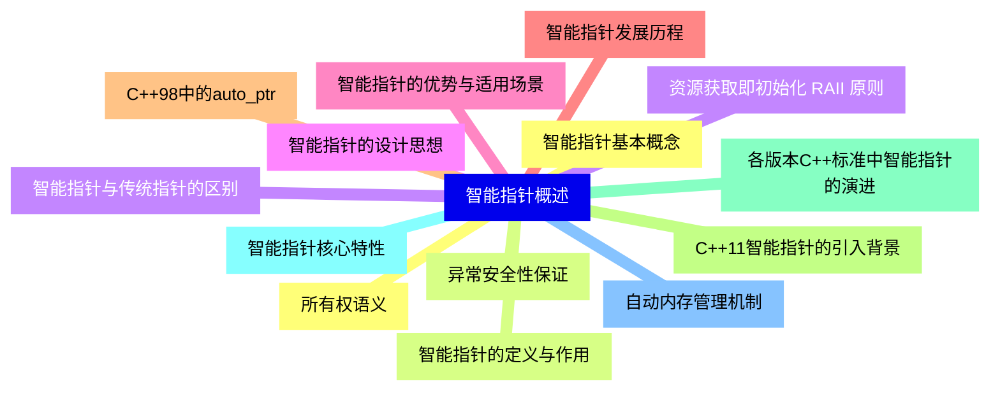
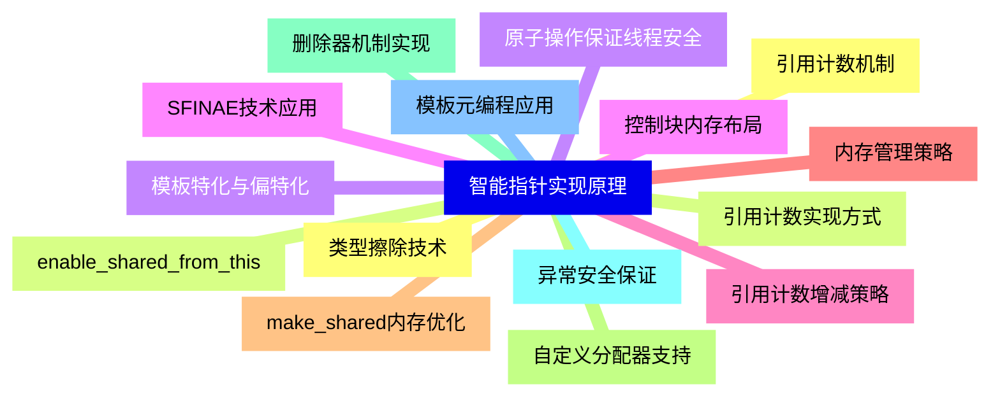
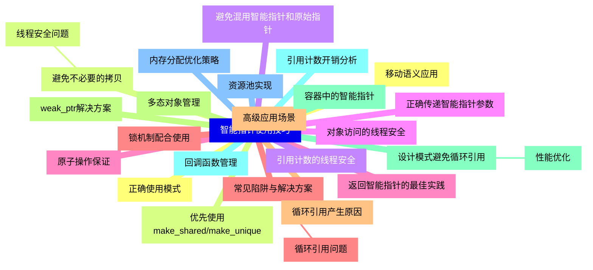
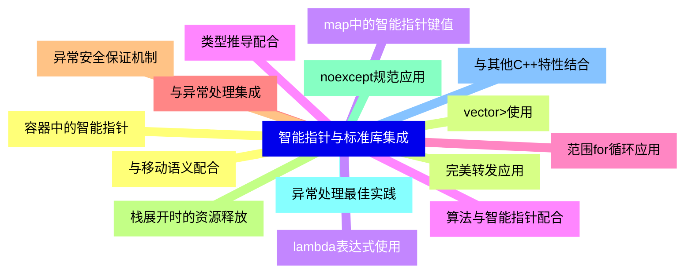
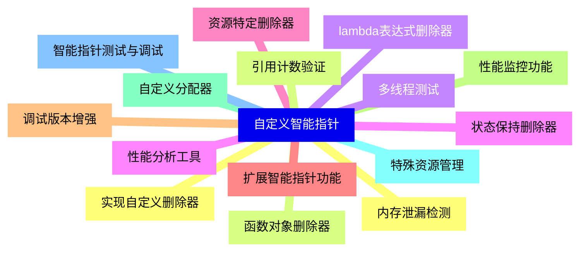
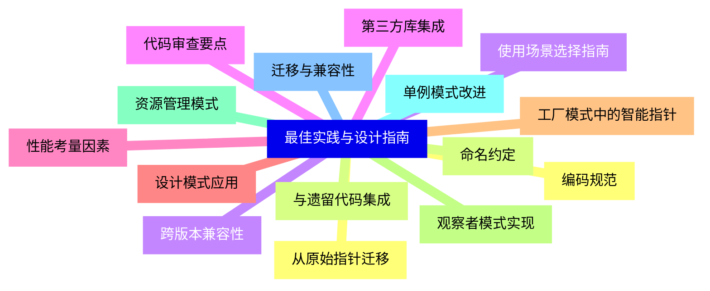


### 1 [智能指针概述](#1)
#### 1.1 [智能指针基本概念](#1)
#### 1.2 [智能指针的定义与作用](#1)
#### 1.3 [智能指针与传统指针的区别](#1)
#### 1.4 [智能指针的设计思想](#1)
#### 1.5 [智能指针的优势与适用场景](#1)
#### 1.6 [智能指针发展历程](#1)
#### 1.7 [C++98中的auto_ptr](#1)
#### 1.8 [C++11智能指针的引入背景](#1)
#### 1.9 [各版本C++标准中智能指针的演进](#1)
#### 1.10 [智能指针核心特性](#1)
#### 1.11 [自动内存管理机制](#1)
#### 1.12 [所有权语义](#1)
#### 1.13 [异常安全性保证](#1)
#### 1.14 [资源获取即初始化 RAII 原则](#1)
### 2 [智能指针类型详解](#2)
#### 2.1 [unique_ptr](#2)
##### 2.1.1 [unique_ptr基本特性](#2)
#### 2.2 [独占所有权的设计理念](#2)
#### 2.3 [移动语义支持](#2)
#### 2.4 [禁止拷贝构造和拷贝赋值](#2)
#### 2.5 [自定义删除器支持](#2)
##### 2.5.1 [unique_ptr操作接口](#2)
#### 2.6 [构造函数与工厂函数](#2)
#### 2.7 [reset  和release  方法](#2)
#### 2.8 [get  和operator*操作](#2)
#### 2.9 [与原始指针的转换](#2)
##### 2.9.1 [unique_ptr应用场景](#2)
#### 2.10 [资源独占管理](#2)
#### 2.11 [工厂模式返回对象](#2)
#### 2.12 [数组管理 unique_ptr<T[]>](#2)
#### 2.13 [作为类成员变量](#2)
#### 2.14 [shared_ptr](#2)
##### 2.14.1 [shared_ptr核心机制](#2)
#### 2.15 [引用计数原理](#2)
#### 2.16 [共享所有权语义](#2)
#### 2.17 [线程安全性分析](#2)
#### 2.18 [控制块结构解析](#2)
##### 2.18.1 [shared_ptr操作接口](#2)
#### 2.19 [构造函数与make_shared](#2)
#### 2.20 [use_count  和unique  方法](#2)
#### 2.21 [reset  方法详解](#2)
#### 2.22 [自定义删除器](#2)
##### 2.22.1 [shared_ptr高级特性](#2)
#### 2.23 [别名构造函数](#2)
#### 2.24 [类型转换支持](#2)
#### 2.25 [弱引用与循环引用问题](#2)
#### 2.26 [性能优化考虑](#2)
#### 2.27 [weak_ptr](#2)
##### 2.27.1 [weak_ptr设计目的](#2)
#### 2.28 [解决循环引用问题](#2)
#### 2.29 [观察者模式实现](#2)
#### 2.30 [非拥有性引用语义](#2)
##### 2.30.1 [weak_ptr操作接口](#2)
#### 2.31 [lock  方法详解](#2)
#### 2.32 [expired  方法使用](#2)
#### 2.33 [与shared_ptr的转换](#2)
#### 2.34 [构造函数与赋值操作](#2)
##### 2.34.1 [weak_ptr应用模式](#2)
#### 2.35 [缓存实现](#2)
#### 2.36 [观察者设计模式](#2)
#### 2.37 [打破循环引用](#2)
#### 2.38 [资源监控](#2)
### 3 [智能指针实现原理](#3)
#### 3.1 [引用计数机制](#3)
#### 3.2 [引用计数实现方式](#3)
#### 3.3 [原子操作保证线程安全](#3)
#### 3.4 [控制块内存布局](#3)
#### 3.5 [引用计数增减策略](#3)
#### 3.6 [内存管理策略](#3)
#### 3.7 [make_shared内存优化](#3)
#### 3.8 [自定义分配器支持](#3)
#### 3.9 [删除器机制实现](#3)
#### 3.10 [异常安全保证](#3)
#### 3.11 [模板元编程应用](#3)
#### 3.12 [类型擦除技术](#3)
#### 3.13 [enable_shared_from_this](#3)
#### 3.14 [模板特化与偏特化](#3)
#### 3.15 [SFINAE技术应用](#3)
### 4 [智能指针使用技巧](#4)
#### 4.1 [正确使用模式](#4)
#### 4.2 [优先使用make_shared/make_unique](#4)
#### 4.3 [避免混用智能指针和原始指针](#4)
#### 4.4 [正确传递智能指针参数](#4)
#### 4.5 [返回智能指针的最佳实践](#4)
#### 4.6 [常见陷阱与解决方案](#4)
##### 4.6.1 [循环引用问题](#4)
#### 4.7 [循环引用产生原因](#4)
#### 4.8 [weak_ptr解决方案](#4)
#### 4.9 [设计模式避免循环引用](#4)
##### 4.9.1 [性能优化](#4)
#### 4.10 [引用计数开销分析](#4)
#### 4.11 [内存分配优化策略](#4)
#### 4.12 [移动语义应用](#4)
#### 4.13 [避免不必要的拷贝](#4)
##### 4.13.1 [线程安全问题](#4)
#### 4.14 [引用计数的线程安全](#4)
#### 4.15 [对象访问的线程安全](#4)
#### 4.16 [原子操作保证](#4)
#### 4.17 [锁机制配合使用](#4)
#### 4.18 [高级应用场景](#4)
#### 4.19 [多态对象管理](#4)
#### 4.20 [容器中的智能指针](#4)
#### 4.21 [回调函数管理](#4)
#### 4.22 [资源池实现](#4)
### 5 [智能指针与标准库集成](#5)
#### 5.1 [容器中的智能指针](#5)
#### 5.2 [vector<shared_ptr<T>>使用](#5)
#### 5.3 [map中的智能指针键值](#5)
#### 5.4 [算法与智能指针配合](#5)
#### 5.5 [范围for循环应用](#5)
#### 5.6 [与异常处理集成](#5)
#### 5.7 [异常安全保证机制](#5)
#### 5.8 [栈展开时的资源释放](#5)
#### 5.9 [noexcept规范应用](#5)
#### 5.10 [异常处理最佳实践](#5)
#### 5.11 [与其他C++特性结合](#5)
#### 5.12 [与移动语义配合](#5)
#### 5.13 [完美转发应用](#5)
#### 5.14 [lambda表达式使用](#5)
#### 5.15 [类型推导配合](#5)
### 6 [自定义智能指针](#6)
#### 6.1 [实现自定义删除器](#6)
#### 6.2 [函数对象删除器](#6)
#### 6.3 [lambda表达式删除器](#6)
#### 6.4 [状态保持删除器](#6)
#### 6.5 [资源特定删除器](#6)
#### 6.6 [扩展智能指针功能](#6)
#### 6.7 [调试版本增强](#6)
#### 6.8 [性能监控功能](#6)
#### 6.9 [自定义分配器](#6)
#### 6.10 [特殊资源管理](#6)
#### 6.11 [智能指针测试与调试](#6)
#### 6.12 [内存泄漏检测](#6)
#### 6.13 [引用计数验证](#6)
#### 6.14 [多线程测试](#6)
#### 6.15 [性能分析工具](#6)
### 7 [最佳实践与设计指南](#7)
#### 7.1 [编码规范](#7)
#### 7.2 [命名约定](#7)
#### 7.3 [使用场景选择指南](#7)
#### 7.4 [代码审查要点](#7)
#### 7.5 [性能考量因素](#7)
#### 7.6 [设计模式应用](#7)
#### 7.7 [工厂模式中的智能指针](#7)
#### 7.8 [观察者模式实现](#7)
#### 7.9 [资源管理模式](#7)
#### 7.10 [单例模式改进](#7)
#### 7.11 [迁移与兼容性](#7)
#### 7.12 [从原始指针迁移](#7)
#### 7.13 [与遗留代码集成](#7)
#### 7.14 [跨版本兼容性](#7)
#### 7.15 [第三方库集成](#7)





### 1 智能指针概述


---
### 1 智能指针概述
___
#### 1.1 智能指针基本概念
___
#### 1.2 智能指针的定义与作用
___
#### 1.3 智能指针与传统指针的区别
___
#### 1.4 智能指针的设计思想
___
#### 1.5 智能指针的优势与适用场景
___
#### 1.6 智能指针发展历程
___
#### 1.7 C++98中的auto_ptr
___
#### 1.8 C++11智能指针的引入背景
___
#### 1.9 各版本C++标准中智能指针的演进
___
#### 1.10 智能指针核心特性
___
#### 1.11 自动内存管理机制
___
#### 1.12 所有权语义
___
#### 1.13 异常安全性保证
___
#### 1.14 资源获取即初始化 RAII 原则
### 2 智能指针类型详解


---
### 2 智能指针类型详解
___
#### 2.1 unique_ptr
___
##### 2.1.1 unique_ptr基本特性
___
#### 2.2 独占所有权的设计理念
___
#### 2.3 移动语义支持
___
#### 2.4 禁止拷贝构造和拷贝赋值
___
#### 2.5 自定义删除器支持
___
##### 2.5.1 unique_ptr操作接口
___
#### 2.6 构造函数与工厂函数
___
#### 2.7 reset  和release  方法
___
#### 2.8 get  和operator*操作
___
#### 2.9 与原始指针的转换
___
##### 2.9.1 unique_ptr应用场景
___
#### 2.10 资源独占管理
___
#### 2.11 工厂模式返回对象
___
#### 2.12 数组管理 unique_ptr<T[]>
___
#### 2.13 作为类成员变量
___
#### 2.14 shared_ptr
___
##### 2.14.1 shared_ptr核心机制
___
#### 2.15 引用计数原理
___
#### 2.16 共享所有权语义
___
#### 2.17 线程安全性分析
___
#### 2.18 控制块结构解析
___
##### 2.18.1 shared_ptr操作接口
___
#### 2.19 构造函数与make_shared
___
#### 2.20 use_count  和unique  方法
___
#### 2.21 reset  方法详解
___
#### 2.22 自定义删除器
___
##### 2.22.1 shared_ptr高级特性
___
#### 2.23 别名构造函数
___
#### 2.24 类型转换支持
___
#### 2.25 弱引用与循环引用问题
___
#### 2.26 性能优化考虑
___
#### 2.27 weak_ptr
___
##### 2.27.1 weak_ptr设计目的
___
#### 2.28 解决循环引用问题
___
#### 2.29 观察者模式实现
___
#### 2.30 非拥有性引用语义
___
##### 2.30.1 weak_ptr操作接口
___
#### 2.31 lock  方法详解
___
#### 2.32 expired  方法使用
___
#### 2.33 与shared_ptr的转换
___
#### 2.34 构造函数与赋值操作
___
##### 2.34.1 weak_ptr应用模式
___
#### 2.35 缓存实现
___
#### 2.36 观察者设计模式
___
#### 2.37 打破循环引用
___
#### 2.38 资源监控
### 3 智能指针实现原理


---
### 3 智能指针实现原理
___
#### 3.1 引用计数机制
___
#### 3.2 引用计数实现方式
___
#### 3.3 原子操作保证线程安全
___
#### 3.4 控制块内存布局
___
#### 3.5 引用计数增减策略
___
#### 3.6 内存管理策略
___
#### 3.7 make_shared内存优化
___
#### 3.8 自定义分配器支持
___
#### 3.9 删除器机制实现
___
#### 3.10 异常安全保证
___
#### 3.11 模板元编程应用
___
#### 3.12 类型擦除技术
___
#### 3.13 enable_shared_from_this
___
#### 3.14 模板特化与偏特化
___
#### 3.15 SFINAE技术应用
### 4 智能指针使用技巧


---
### 4 智能指针使用技巧
___
#### 4.1 正确使用模式
___
#### 4.2 优先使用make_shared/make_unique
___
#### 4.3 避免混用智能指针和原始指针
___
#### 4.4 正确传递智能指针参数
___
#### 4.5 返回智能指针的最佳实践
___
#### 4.6 常见陷阱与解决方案
___
##### 4.6.1 循环引用问题
___
#### 4.7 循环引用产生原因
___
#### 4.8 weak_ptr解决方案
___
#### 4.9 设计模式避免循环引用
___
##### 4.9.1 性能优化
___
#### 4.10 引用计数开销分析
___
#### 4.11 内存分配优化策略
___
#### 4.12 移动语义应用
___
#### 4.13 避免不必要的拷贝
___
##### 4.13.1 线程安全问题
___
#### 4.14 引用计数的线程安全
___
#### 4.15 对象访问的线程安全
___
#### 4.16 原子操作保证
___
#### 4.17 锁机制配合使用
___
#### 4.18 高级应用场景
___
#### 4.19 多态对象管理
___
#### 4.20 容器中的智能指针
___
#### 4.21 回调函数管理
___
#### 4.22 资源池实现
### 5 智能指针与标准库集成


---
### 5 智能指针与标准库集成
___
#### 5.1 容器中的智能指针
___
#### 5.2 vector<shared_ptr<T>>使用
___
#### 5.3 map中的智能指针键值
___
#### 5.4 算法与智能指针配合
___
#### 5.5 范围for循环应用
___
#### 5.6 与异常处理集成
___
#### 5.7 异常安全保证机制
___
#### 5.8 栈展开时的资源释放
___
#### 5.9 noexcept规范应用
___
#### 5.10 异常处理最佳实践
___
#### 5.11 与其他C++特性结合
___
#### 5.12 与移动语义配合
___
#### 5.13 完美转发应用
___
#### 5.14 lambda表达式使用
___
#### 5.15 类型推导配合
### 6 自定义智能指针


---
### 6 自定义智能指针
___
#### 6.1 实现自定义删除器
___
#### 6.2 函数对象删除器
___
#### 6.3 lambda表达式删除器
___
#### 6.4 状态保持删除器
___
#### 6.5 资源特定删除器
___
#### 6.6 扩展智能指针功能
___
#### 6.7 调试版本增强
___
#### 6.8 性能监控功能
___
#### 6.9 自定义分配器
___
#### 6.10 特殊资源管理
___
#### 6.11 智能指针测试与调试
___
#### 6.12 内存泄漏检测
___
#### 6.13 引用计数验证
___
#### 6.14 多线程测试
___
#### 6.15 性能分析工具
### 7 最佳实践与设计指南


---
### 7 最佳实践与设计指南
___
#### 7.1 编码规范
___
#### 7.2 命名约定
___
#### 7.3 使用场景选择指南
___
#### 7.4 代码审查要点
___
#### 7.5 性能考量因素
___
#### 7.6 设计模式应用
___
#### 7.7 工厂模式中的智能指针
___
#### 7.8 观察者模式实现
___
#### 7.9 资源管理模式
___
#### 7.10 单例模式改进
___
#### 7.11 迁移与兼容性
___
#### 7.12 从原始指针迁移
___
#### 7.13 与遗留代码集成
___
#### 7.14 跨版本兼容性
___
#### 7.15 第三方库集成



### 1 智能指针概述{#1}


{}


<--->
{}
{}
{}
{}
{}
{}
{}
{}
{}
{}
{}
{}
{}
{}
{}
{}
{}
{}
{}
{}
{}
{}
{}
{}
{}
{}
{}
{}
{}

### 2 智能指针类型详解{#2}


{}
{}
{}
{}
{}
{}
{}
{}
{}
{}
{}
{}
{}
{}
{}
{}
{}
{}
{}
{}
{}
{}
{}
{}
{}
{}
{}
{}
{}
{}
{}
{}
{}
{}
{}
{}
{}
{}
{}
{}
{}
{}
{}
{}
{}
{}
{}
{}
{}
{}
{}
{}
{}
{}
{}
{}
{}
{}
{}
{}
{}
{}
{}
{}
{}
{}
{}
{}
{}
{}
{}
{}
{}
{}
{}
{}
{}
{}
{}
{}
{}
{}
{}
{}
{}
{}
{}
{}
{}
{}
{}
{}
{}
{}
{}
<--->
```mermaid
mindmap
    id2[智能指针类型详解]
        id2-1[unique_ptr]
            id2-1-1[unique_ptr基本特性]
        id2-2[独占所有权的设计理念]
        id2-3[移动语义支持]
        id2-4[禁止拷贝构造和拷贝赋值]
        id2-5[自定义删除器支持]
            id2-5-1[unique_ptr操作接口]
        id2-6[构造函数与工厂函数]
        id2-7[reset  和release  方法]
        id2-8[get  和operator*操作]
        id2-9[与原始指针的转换]
            id2-9-1[unique_ptr应用场景]
        id2-10[资源独占管理]
        id2-11[工厂模式返回对象]
        id2-12[数组管理 unique_ptr<T[]>]
        id2-13[作为类成员变量]
        id2-14[shared_ptr]
            id2-14-1[shared_ptr核心机制]
        id2-15[引用计数原理]
        id2-16[共享所有权语义]
        id2-17[线程安全性分析]
        id2-18[控制块结构解析]
            id2-18-1[shared_ptr操作接口]
        id2-19[构造函数与make_shared]
        id2-20[use_count  和unique  方法]
        id2-21[reset  方法详解]
        id2-22[自定义删除器]
            id2-22-1[shared_ptr高级特性]
        id2-23[别名构造函数]
        id2-24[类型转换支持]
        id2-25[弱引用与循环引用问题]
        id2-26[性能优化考虑]
        id2-27[weak_ptr]
            id2-27-1[weak_ptr设计目的]
        id2-28[解决循环引用问题]
        id2-29[观察者模式实现]
        id2-30[非拥有性引用语义]
            id2-30-1[weak_ptr操作接口]
        id2-31[lock  方法详解]
        id2-32[expired  方法使用]
        id2-33[与shared_ptr的转换]
        id2-34[构造函数与赋值操作]
            id2-34-1[weak_ptr应用模式]
        id2-35[缓存实现]
        id2-36[观察者设计模式]
        id2-37[打破循环引用]
        id2-38[资源监控]
```

{}

### 3 智能指针实现原理{#3}


{}


<--->
{}
{}
{}
{}
{}
{}
{}
{}
{}
{}
{}
{}
{}
{}
{}
{}
{}
{}
{}
{}
{}
{}
{}
{}
{}
{}
{}
{}
{}
{}
{}

### 4 智能指针使用技巧{#4}


{}
{}
{}
{}
{}
{}
{}
{}
{}
{}
{}
{}
{}
{}
{}
{}
{}
{}
{}
{}
{}
{}
{}
{}
{}
{}
{}
{}
{}
{}
{}
{}
{}
{}
{}
{}
{}
{}
{}
{}
{}
{}
{}
{}
{}
{}
{}
{}
{}
{}
{}
<--->


{}

### 5 智能指针与标准库集成{#5}


{}


<--->
{}
{}
{}
{}
{}
{}
{}
{}
{}
{}
{}
{}
{}
{}
{}
{}
{}
{}
{}
{}
{}
{}
{}
{}
{}
{}
{}
{}
{}
{}
{}

### 6 自定义智能指针{#6}


{}
{}
{}
{}
{}
{}
{}
{}
{}
{}
{}
{}
{}
{}
{}
{}
{}
{}
{}
{}
{}
{}
{}
{}
{}
{}
{}
{}
{}
{}
{}
<--->


{}

### 7 最佳实践与设计指南{#7}


{}


<--->
{}
{}
{}
{}
{}
{}
{}
{}
{}
{}
{}
{}
{}
{}
{}
{}
{}
{}
{}
{}
{}
{}
{}
{}
{}
{}
{}
{}
{}
{}
{}
