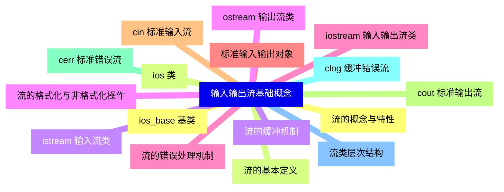
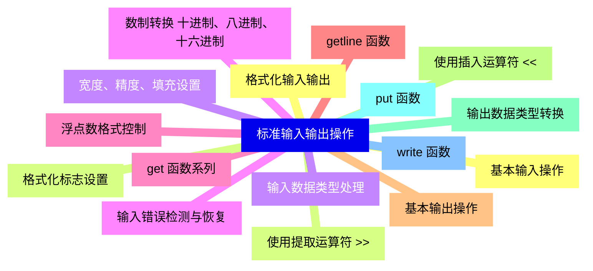
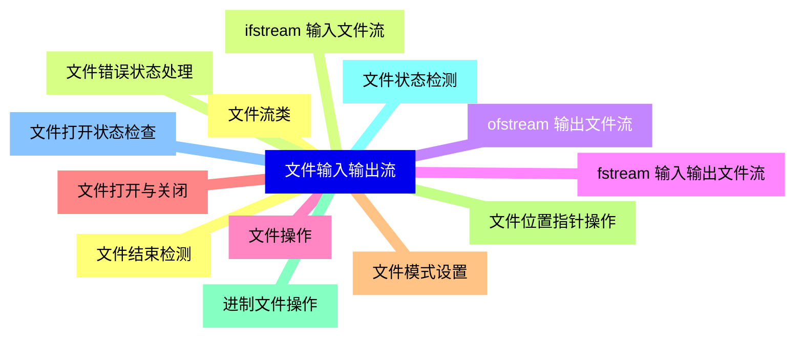
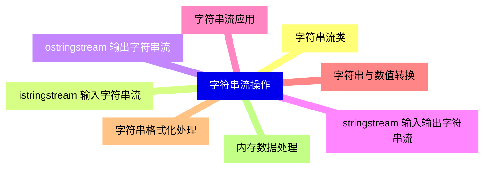
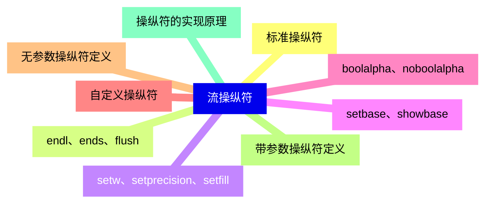
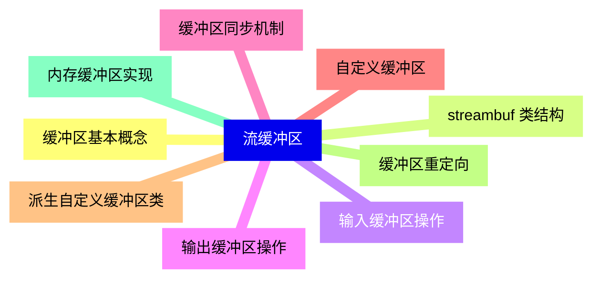
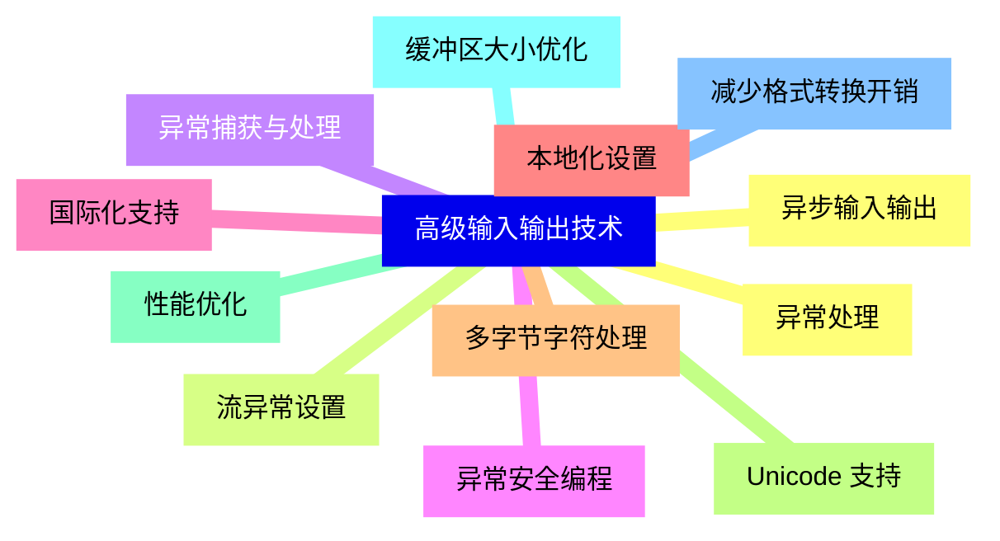
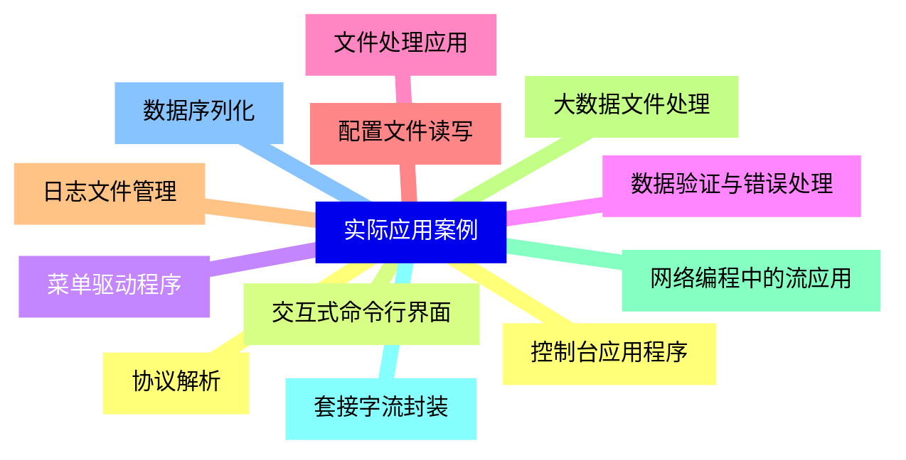


### 1 [输入输出流基础概念](#1)
#### 1.1 [流的概念与特性](#1)
#### 1.2 [流的基本定义](#1)
#### 1.3 [流的缓冲机制](#1)
#### 1.4 [流的格式化与非格式化操作](#1)
#### 1.5 [流的错误处理机制](#1)
#### 1.6 [标准输入输出对象](#1)
#### 1.7 [cin 标准输入流](#1)
#### 1.8 [cout 标准输出流](#1)
#### 1.9 [cerr 标准错误流](#1)
#### 1.10 [clog 缓冲错误流](#1)
#### 1.11 [流类层次结构](#1)
#### 1.12 [ios_base 基类](#1)
#### 1.13 [ios 类](#1)
#### 1.14 [istream 输入流类](#1)
#### 1.15 [ostream 输出流类](#1)
#### 1.16 [iostream 输入输出流类](#1)
### 2 [标准输入输出操作](#2)
#### 2.1 [基本输入操作](#2)
#### 2.2 [使用提取运算符 >>](#2)
#### 2.3 [输入数据类型处理](#2)
#### 2.4 [输入错误检测与恢复](#2)
#### 2.5 [get   函数系列](#2)
#### 2.6 [getline   函数](#2)
#### 2.7 [基本输出操作](#2)
#### 2.8 [使用插入运算符 <<](#2)
#### 2.9 [输出数据类型转换](#2)
#### 2.10 [put   函数](#2)
#### 2.11 [write   函数](#2)
#### 2.12 [格式化输入输出](#2)
#### 2.13 [格式化标志设置](#2)
#### 2.14 [宽度、精度、填充设置](#2)
#### 2.15 [数制转换 十进制、八进制、十六进制](#2)
#### 2.16 [浮点数格式控制](#2)
### 3 [文件输入输出流](#3)
#### 3.1 [文件流类](#3)
#### 3.2 [ifstream 输入文件流](#3)
#### 3.3 [ofstream 输出文件流](#3)
#### 3.4 [fstream 输入输出文件流](#3)
#### 3.5 [文件操作](#3)
#### 3.6 [文件打开与关闭](#3)
#### 3.7 [文件模式设置](#3)
#### 3.8 [文件位置指针操作](#3)
#### 3.9 [进制文件操作](#3)
#### 3.10 [文件状态检测](#3)
#### 3.11 [文件打开状态检查](#3)
#### 3.12 [文件结束检测](#3)
#### 3.13 [文件错误状态处理](#3)
### 4 [字符串流操作](#4)
#### 4.1 [字符串流类](#4)
#### 4.2 [istringstream 输入字符串流](#4)
#### 4.3 [ostringstream 输出字符串流](#4)
#### 4.4 [stringstream 输入输出字符串流](#4)
#### 4.5 [字符串流应用](#4)
#### 4.6 [字符串与数值转换](#4)
#### 4.7 [字符串格式化处理](#4)
#### 4.8 [内存数据处理](#4)
### 5 [流操纵符](#5)
#### 5.1 [标准操纵符](#5)
#### 5.2 [endl、ends、flush](#5)
#### 5.3 [setw、setprecision、setfill](#5)
#### 5.4 [setbase、showbase](#5)
#### 5.5 [boolalpha、noboolalpha](#5)
#### 5.6 [自定义操纵符](#5)
#### 5.7 [无参数操纵符定义](#5)
#### 5.8 [带参数操纵符定义](#5)
#### 5.9 [操纵符的实现原理](#5)
### 6 [流缓冲区](#6)
#### 6.1 [缓冲区基本概念](#6)
#### 6.2 [streambuf 类结构](#6)
#### 6.3 [输入缓冲区操作](#6)
#### 6.4 [输出缓冲区操作](#6)
#### 6.5 [缓冲区同步机制](#6)
#### 6.6 [自定义缓冲区](#6)
#### 6.7 [派生自定义缓冲区类](#6)
#### 6.8 [缓冲区重定向](#6)
#### 6.9 [内存缓冲区实现](#6)
### 7 [高级输入输出技术](#7)
#### 7.1 [异常处理](#7)
#### 7.2 [流异常设置](#7)
#### 7.3 [异常捕获与处理](#7)
#### 7.4 [异常安全编程](#7)
#### 7.5 [国际化支持](#7)
#### 7.6 [本地化设置](#7)
#### 7.7 [多字节字符处理](#7)
#### 7.8 [Unicode 支持](#7)
#### 7.9 [性能优化](#7)
#### 7.10 [缓冲区大小优化](#7)
#### 7.11 [减少格式转换开销](#7)
#### 7.12 [异步输入输出](#7)
### 8 [实际应用案例](#8)
#### 8.1 [控制台应用程序](#8)
#### 8.2 [交互式命令行界面](#8)
#### 8.3 [菜单驱动程序](#8)
#### 8.4 [数据验证与错误处理](#8)
#### 8.5 [文件处理应用](#8)
#### 8.6 [配置文件读写](#8)
#### 8.7 [日志文件管理](#8)
#### 8.8 [大数据文件处理](#8)
#### 8.9 [网络编程中的流应用](#8)
#### 8.10 [套接字流封装](#8)
#### 8.11 [数据序列化](#8)
#### 8.12 [协议解析](#8)




### 1 输入输出流基础概念

---
### 1 输入输出流基础概念
___
#### 1.1 流的概念与特性
___
#### 1.2 流的基本定义
___
#### 1.3 流的缓冲机制
___
#### 1.4 流的格式化与非格式化操作
___
#### 1.5 流的错误处理机制
___
#### 1.6 标准输入输出对象
___
#### 1.7 cin 标准输入流
___
#### 1.8 cout 标准输出流
___
#### 1.9 cerr 标准错误流
___
#### 1.10 clog 缓冲错误流
___
#### 1.11 流类层次结构
___
#### 1.12 ios_base 基类
___
#### 1.13 ios 类
___
#### 1.14 istream 输入流类
___
#### 1.15 ostream 输出流类
___
#### 1.16 iostream 输入输出流类
### 2 标准输入输出操作

---
### 2 标准输入输出操作
___
#### 2.1 基本输入操作
___
#### 2.2 使用提取运算符 >>
___
#### 2.3 输入数据类型处理
___
#### 2.4 输入错误检测与恢复
___
#### 2.5 get   函数系列
___
#### 2.6 getline   函数
___
#### 2.7 基本输出操作
___
#### 2.8 使用插入运算符 <<
___
#### 2.9 输出数据类型转换
___
#### 2.10 put   函数
___
#### 2.11 write   函数
___
#### 2.12 格式化输入输出
___
#### 2.13 格式化标志设置
___
#### 2.14 宽度、精度、填充设置
___
#### 2.15 数制转换 十进制、八进制、十六进制
___
#### 2.16 浮点数格式控制
### 3 文件输入输出流

---
### 3 文件输入输出流
___
#### 3.1 文件流类
___
#### 3.2 ifstream 输入文件流
___
#### 3.3 ofstream 输出文件流
___
#### 3.4 fstream 输入输出文件流
___
#### 3.5 文件操作
___
#### 3.6 文件打开与关闭
___
#### 3.7 文件模式设置
___
#### 3.8 文件位置指针操作
___
#### 3.9 进制文件操作
___
#### 3.10 文件状态检测
___
#### 3.11 文件打开状态检查
___
#### 3.12 文件结束检测
___
#### 3.13 文件错误状态处理
### 4 字符串流操作

---
### 4 字符串流操作
___
#### 4.1 字符串流类
___
#### 4.2 istringstream 输入字符串流
___
#### 4.3 ostringstream 输出字符串流
___
#### 4.4 stringstream 输入输出字符串流
___
#### 4.5 字符串流应用
___
#### 4.6 字符串与数值转换
___
#### 4.7 字符串格式化处理
___
#### 4.8 内存数据处理
### 5 流操纵符

---
### 5 流操纵符
___
#### 5.1 标准操纵符
___
#### 5.2 endl、ends、flush
___
#### 5.3 setw、setprecision、setfill
___
#### 5.4 setbase、showbase
___
#### 5.5 boolalpha、noboolalpha
___
#### 5.6 自定义操纵符
___
#### 5.7 无参数操纵符定义
___
#### 5.8 带参数操纵符定义
___
#### 5.9 操纵符的实现原理
### 6 流缓冲区

---
### 6 流缓冲区
___
#### 6.1 缓冲区基本概念
___
#### 6.2 streambuf 类结构
___
#### 6.3 输入缓冲区操作
___
#### 6.4 输出缓冲区操作
___
#### 6.5 缓冲区同步机制
___
#### 6.6 自定义缓冲区
___
#### 6.7 派生自定义缓冲区类
___
#### 6.8 缓冲区重定向
___
#### 6.9 内存缓冲区实现
### 7 高级输入输出技术

---
### 7 高级输入输出技术
___
#### 7.1 异常处理
___
#### 7.2 流异常设置
___
#### 7.3 异常捕获与处理
___
#### 7.4 异常安全编程
___
#### 7.5 国际化支持
___
#### 7.6 本地化设置
___
#### 7.7 多字节字符处理
___
#### 7.8 Unicode 支持
___
#### 7.9 性能优化
___
#### 7.10 缓冲区大小优化
___
#### 7.11 减少格式转换开销
___
#### 7.12 异步输入输出
### 8 实际应用案例

---
### 8 实际应用案例
___
#### 8.1 控制台应用程序
___
#### 8.2 交互式命令行界面
___
#### 8.3 菜单驱动程序
___
#### 8.4 数据验证与错误处理
___
#### 8.5 文件处理应用
___
#### 8.6 配置文件读写
___
#### 8.7 日志文件管理
___
#### 8.8 大数据文件处理
___
#### 8.9 网络编程中的流应用
___
#### 8.10 套接字流封装
___
#### 8.11 数据序列化
___
#### 8.12 协议解析


### 1 输入输出流基础概念{#1}

{}

<--->
{}
{}
{}
{}
{}
{}
{}
{}
{}
{}
{}
{}
{}
{}
{}
{}
{}
{}
{}
{}
{}
{}
{}
{}
{}
{}
{}
{}
{}
{}
{}
{}
{}

### 2 标准输入输出操作{#2}

{}
{}
{}
{}
{}
{}
{}
{}
{}
{}
{}
{}
{}
{}
{}
{}
{}
{}
{}
{}
{}
{}
{}
{}
{}
{}
{}
{}
{}
{}
{}
{}
{}
<--->

{}

### 3 文件输入输出流{#3}

{}

<--->
{}
{}
{}
{}
{}
{}
{}
{}
{}
{}
{}
{}
{}
{}
{}
{}
{}
{}
{}
{}
{}
{}
{}
{}
{}
{}
{}

### 4 字符串流操作{#4}

{}
{}
{}
{}
{}
{}
{}
{}
{}
{}
{}
{}
{}
{}
{}
{}
{}
<--->

{}

### 5 流操纵符{#5}

{}

<--->
{}
{}
{}
{}
{}
{}
{}
{}
{}
{}
{}
{}
{}
{}
{}
{}
{}
{}
{}

### 6 流缓冲区{#6}

{}
{}
{}
{}
{}
{}
{}
{}
{}
{}
{}
{}
{}
{}
{}
{}
{}
{}
{}
<--->

{}

### 7 高级输入输出技术{#7}

{}

<--->
{}
{}
{}
{}
{}
{}
{}
{}
{}
{}
{}
{}
{}
{}
{}
{}
{}
{}
{}
{}
{}
{}
{}
{}
{}

### 8 实际应用案例{#8}

{}
{}
{}
{}
{}
{}
{}
{}
{}
{}
{}
{}
{}
{}
{}
{}
{}
{}
{}
{}
{}
{}
{}
{}
{}
<--->

{}
