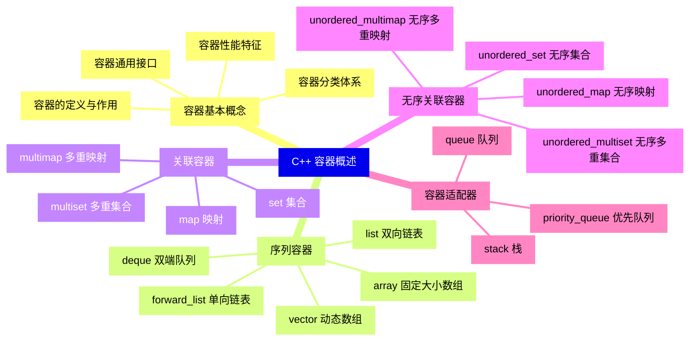
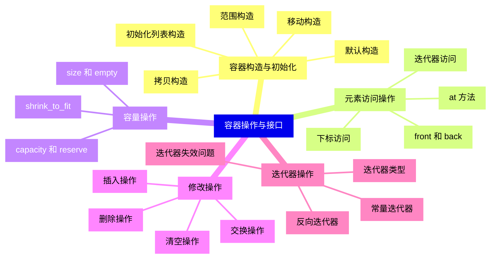
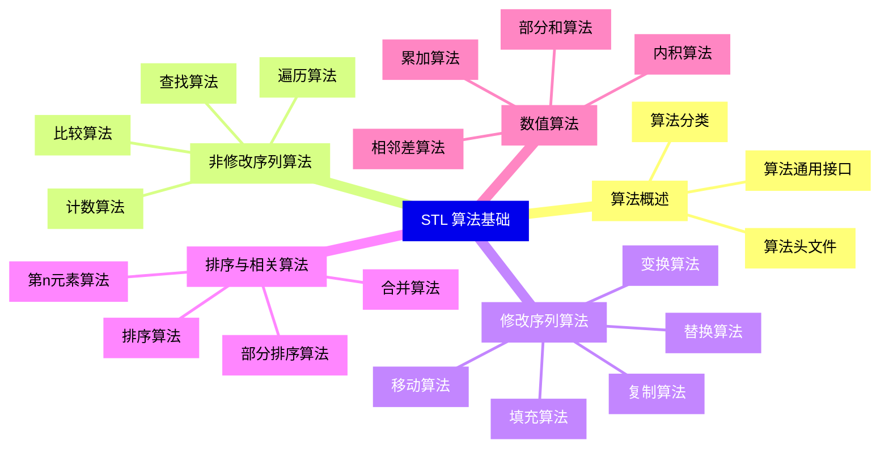
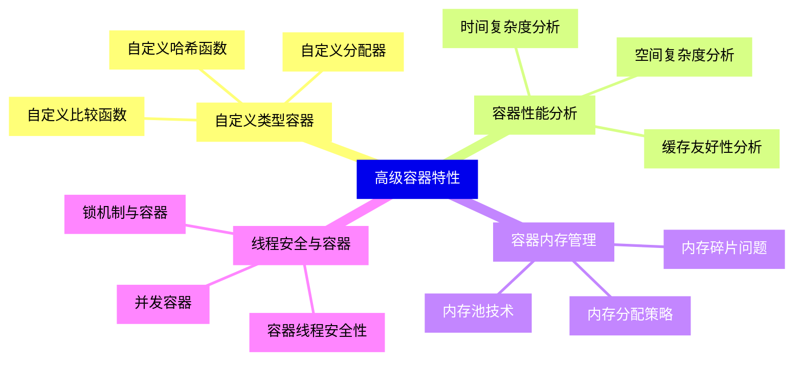
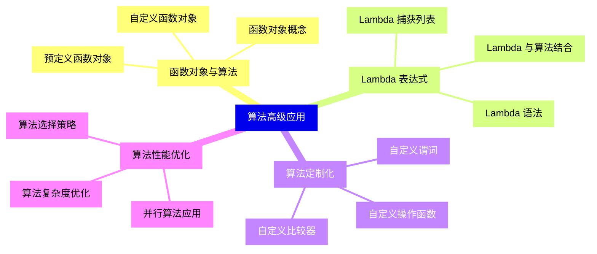
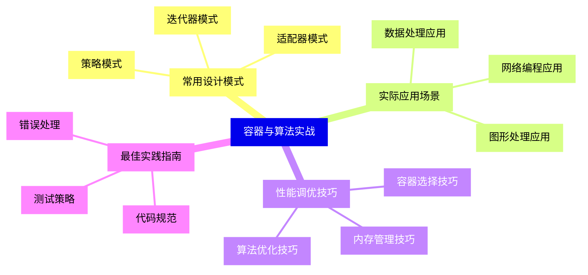


### 1 [C++ 容器概述](#1)
#### 1.1 [容器基本概念](#1)
##### 1.1.1 [容器的定义与作用](#1)
##### 1.1.2 [容器分类体系](#1)
##### 1.1.3 [容器通用接口](#1)
##### 1.1.4 [容器性能特征](#1)
#### 1.2 [序列容器](#1)
##### 1.2.1 [vector 动态数组](#1)
##### 1.2.2 [deque 双端队列](#1)
##### 1.2.3 [list 双向链表](#1)
##### 1.2.4 [forward_list 单向链表](#1)
##### 1.2.5 [array 固定大小数组](#1)
#### 1.3 [关联容器](#1)
##### 1.3.1 [set 集合](#1)
##### 1.3.2 [multiset 多重集合](#1)
##### 1.3.3 [map 映射](#1)
##### 1.3.4 [multimap 多重映射](#1)
#### 1.4 [无序关联容器](#1)
##### 1.4.1 [unordered_set 无序集合](#1)
##### 1.4.2 [unordered_multiset 无序多重集合](#1)
##### 1.4.3 [unordered_map 无序映射](#1)
##### 1.4.4 [unordered_multimap 无序多重映射](#1)
#### 1.5 [容器适配器](#1)
##### 1.5.1 [stack 栈](#1)
##### 1.5.2 [queue 队列](#1)
##### 1.5.3 [priority_queue 优先队列](#1)
### 2 [容器操作与接口](#2)
#### 2.1 [容器构造与初始化](#2)
##### 2.1.1 [默认构造](#2)
##### 2.1.2 [范围构造](#2)
##### 2.1.3 [拷贝构造](#2)
##### 2.1.4 [移动构造](#2)
##### 2.1.5 [初始化列表构造](#2)
#### 2.2 [元素访问操作](#2)
##### 2.2.1 [下标访问](#2)
##### 2.2.2 [at   方法](#2)
##### 2.2.3 [front   和 back](#2)
##### 2.2.4 [迭代器访问](#2)
#### 2.3 [容量操作](#2)
##### 2.3.1 [size   和 empty](#2)
##### 2.3.2 [capacity   和 reserve](#2)
##### 2.3.3 [shrink_to_fit](#2)
#### 2.4 [修改操作](#2)
##### 2.4.1 [插入操作](#2)
##### 2.4.2 [删除操作](#2)
##### 2.4.3 [清空操作](#2)
##### 2.4.4 [交换操作](#2)
#### 2.5 [迭代器操作](#2)
##### 2.5.1 [迭代器类型](#2)
##### 2.5.2 [迭代器失效问题](#2)
##### 2.5.3 [常量迭代器](#2)
##### 2.5.4 [反向迭代器](#2)
### 3 [STL 算法基础](#3)
#### 3.1 [算法概述](#3)
##### 3.1.1 [算法分类](#3)
##### 3.1.2 [算法头文件](#3)
##### 3.1.3 [算法通用接口](#3)
#### 3.2 [非修改序列算法](#3)
##### 3.2.1 [查找算法](#3)
##### 3.2.2 [计数算法](#3)
##### 3.2.3 [比较算法](#3)
##### 3.2.4 [遍历算法](#3)
#### 3.3 [修改序列算法](#3)
##### 3.3.1 [复制算法](#3)
##### 3.3.2 [移动算法](#3)
##### 3.3.3 [变换算法](#3)
##### 3.3.4 [替换算法](#3)
##### 3.3.5 [填充算法](#3)
#### 3.4 [排序与相关算法](#3)
##### 3.4.1 [排序算法](#3)
##### 3.4.2 [部分排序算法](#3)
##### 3.4.3 [第n元素算法](#3)
##### 3.4.4 [合并算法](#3)
#### 3.5 [数值算法](#3)
##### 3.5.1 [累加算法](#3)
##### 3.5.2 [内积算法](#3)
##### 3.5.3 [相邻差算法](#3)
##### 3.5.4 [部分和算法](#3)
### 4 [高级容器特性](#4)
#### 4.1 [自定义类型容器](#4)
##### 4.1.1 [自定义比较函数](#4)
##### 4.1.2 [自定义哈希函数](#4)
##### 4.1.3 [自定义分配器](#4)
#### 4.2 [容器性能分析](#4)
##### 4.2.1 [时间复杂度分析](#4)
##### 4.2.2 [空间复杂度分析](#4)
##### 4.2.3 [缓存友好性分析](#4)
#### 4.3 [容器内存管理](#4)
##### 4.3.1 [内存分配策略](#4)
##### 4.3.2 [内存碎片问题](#4)
##### 4.3.3 [内存池技术](#4)
#### 4.4 [线程安全与容器](#4)
##### 4.4.1 [容器线程安全性](#4)
##### 4.4.2 [并发容器](#4)
##### 4.4.3 [锁机制与容器](#4)
### 5 [算法高级应用](#5)
#### 5.1 [函数对象与算法](#5)
##### 5.1.1 [函数对象概念](#5)
##### 5.1.2 [预定义函数对象](#5)
##### 5.1.3 [自定义函数对象](#5)
#### 5.2 [Lambda 表达式](#5)
##### 5.2.1 [Lambda 语法](#5)
##### 5.2.2 [Lambda 捕获列表](#5)
##### 5.2.3 [Lambda 与算法结合](#5)
#### 5.3 [算法定制化](#5)
##### 5.3.1 [自定义比较器](#5)
##### 5.3.2 [自定义谓词](#5)
##### 5.3.3 [自定义操作函数](#5)
#### 5.4 [算法性能优化](#5)
##### 5.4.1 [算法选择策略](#5)
##### 5.4.2 [算法复杂度优化](#5)
##### 5.4.3 [并行算法应用](#5)
### 6 [容器与算法实战](#6)
#### 6.1 [常用设计模式](#6)
##### 6.1.1 [迭代器模式](#6)
##### 6.1.2 [适配器模式](#6)
##### 6.1.3 [策略模式](#6)
#### 6.2 [实际应用场景](#6)
##### 6.2.1 [数据处理应用](#6)
##### 6.2.2 [图形处理应用](#6)
##### 6.2.3 [网络编程应用](#6)
#### 6.3 [性能调优技巧](#6)
##### 6.3.1 [容器选择技巧](#6)
##### 6.3.2 [算法优化技巧](#6)
##### 6.3.3 [内存管理技巧](#6)
#### 6.4 [最佳实践指南](#6)
##### 6.4.1 [代码规范](#6)
##### 6.4.2 [错误处理](#6)
##### 6.4.3 [测试策略](#6)




### 1 C++ 容器概述

---
### 1 C++ 容器概述
___
#### 1.1 容器基本概念
___
##### 1.1.1 容器的定义与作用
___
##### 1.1.2 容器分类体系
___
##### 1.1.3 容器通用接口
___
##### 1.1.4 容器性能特征
___
#### 1.2 序列容器
___
##### 1.2.1 vector 动态数组
___
##### 1.2.2 deque 双端队列
___
##### 1.2.3 list 双向链表
___
##### 1.2.4 forward_list 单向链表
___
##### 1.2.5 array 固定大小数组
___
#### 1.3 关联容器
___
##### 1.3.1 set 集合
___
##### 1.3.2 multiset 多重集合
___
##### 1.3.3 map 映射
___
##### 1.3.4 multimap 多重映射
___
#### 1.4 无序关联容器
___
##### 1.4.1 unordered_set 无序集合
___
##### 1.4.2 unordered_multiset 无序多重集合
___
##### 1.4.3 unordered_map 无序映射
___
##### 1.4.4 unordered_multimap 无序多重映射
___
#### 1.5 容器适配器
___
##### 1.5.1 stack 栈
___
##### 1.5.2 queue 队列
___
##### 1.5.3 priority_queue 优先队列
### 2 容器操作与接口

---
### 2 容器操作与接口
___
#### 2.1 容器构造与初始化
___
##### 2.1.1 默认构造
___
##### 2.1.2 范围构造
___
##### 2.1.3 拷贝构造
___
##### 2.1.4 移动构造
___
##### 2.1.5 初始化列表构造
___
#### 2.2 元素访问操作
___
##### 2.2.1 下标访问
___
##### 2.2.2 at   方法
___
##### 2.2.3 front   和 back
___
##### 2.2.4 迭代器访问
___
#### 2.3 容量操作
___
##### 2.3.1 size   和 empty
___
##### 2.3.2 capacity   和 reserve
___
##### 2.3.3 shrink_to_fit
___
#### 2.4 修改操作
___
##### 2.4.1 插入操作
___
##### 2.4.2 删除操作
___
##### 2.4.3 清空操作
___
##### 2.4.4 交换操作
___
#### 2.5 迭代器操作
___
##### 2.5.1 迭代器类型
___
##### 2.5.2 迭代器失效问题
___
##### 2.5.3 常量迭代器
___
##### 2.5.4 反向迭代器
### 3 STL 算法基础

---
### 3 STL 算法基础
___
#### 3.1 算法概述
___
##### 3.1.1 算法分类
___
##### 3.1.2 算法头文件
___
##### 3.1.3 算法通用接口
___
#### 3.2 非修改序列算法
___
##### 3.2.1 查找算法
___
##### 3.2.2 计数算法
___
##### 3.2.3 比较算法
___
##### 3.2.4 遍历算法
___
#### 3.3 修改序列算法
___
##### 3.3.1 复制算法
___
##### 3.3.2 移动算法
___
##### 3.3.3 变换算法
___
##### 3.3.4 替换算法
___
##### 3.3.5 填充算法
___
#### 3.4 排序与相关算法
___
##### 3.4.1 排序算法
___
##### 3.4.2 部分排序算法
___
##### 3.4.3 第n元素算法
___
##### 3.4.4 合并算法
___
#### 3.5 数值算法
___
##### 3.5.1 累加算法
___
##### 3.5.2 内积算法
___
##### 3.5.3 相邻差算法
___
##### 3.5.4 部分和算法
### 4 高级容器特性

---
### 4 高级容器特性
___
#### 4.1 自定义类型容器
___
##### 4.1.1 自定义比较函数
___
##### 4.1.2 自定义哈希函数
___
##### 4.1.3 自定义分配器
___
#### 4.2 容器性能分析
___
##### 4.2.1 时间复杂度分析
___
##### 4.2.2 空间复杂度分析
___
##### 4.2.3 缓存友好性分析
___
#### 4.3 容器内存管理
___
##### 4.3.1 内存分配策略
___
##### 4.3.2 内存碎片问题
___
##### 4.3.3 内存池技术
___
#### 4.4 线程安全与容器
___
##### 4.4.1 容器线程安全性
___
##### 4.4.2 并发容器
___
##### 4.4.3 锁机制与容器
### 5 算法高级应用

---
### 5 算法高级应用
___
#### 5.1 函数对象与算法
___
##### 5.1.1 函数对象概念
___
##### 5.1.2 预定义函数对象
___
##### 5.1.3 自定义函数对象
___
#### 5.2 Lambda 表达式
___
##### 5.2.1 Lambda 语法
___
##### 5.2.2 Lambda 捕获列表
___
##### 5.2.3 Lambda 与算法结合
___
#### 5.3 算法定制化
___
##### 5.3.1 自定义比较器
___
##### 5.3.2 自定义谓词
___
##### 5.3.3 自定义操作函数
___
#### 5.4 算法性能优化
___
##### 5.4.1 算法选择策略
___
##### 5.4.2 算法复杂度优化
___
##### 5.4.3 并行算法应用
### 6 容器与算法实战

---
### 6 容器与算法实战
___
#### 6.1 常用设计模式
___
##### 6.1.1 迭代器模式
___
##### 6.1.2 适配器模式
___
##### 6.1.3 策略模式
___
#### 6.2 实际应用场景
___
##### 6.2.1 数据处理应用
___
##### 6.2.2 图形处理应用
___
##### 6.2.3 网络编程应用
___
#### 6.3 性能调优技巧
___
##### 6.3.1 容器选择技巧
___
##### 6.3.2 算法优化技巧
___
##### 6.3.3 内存管理技巧
___
#### 6.4 最佳实践指南
___
##### 6.4.1 代码规范
___
##### 6.4.2 错误处理
___
##### 6.4.3 测试策略


### 1 C++ 容器概述{#1}

{}

<--->
{}
{}
{}
{}
{}
{}
{}
{}
{}
{}
{}
{}
{}
{}
{}
{}
{}
{}
{}
{}
{}
{}
{}
{}
{}
{}
{}
{}
{}
{}
{}
{}
{}
{}
{}
{}
{}
{}
{}
{}
{}
{}
{}
{}
{}
{}
{}
{}
{}
{}
{}

### 2 容器操作与接口{#2}

{}
{}
{}
{}
{}
{}
{}
{}
{}
{}
{}
{}
{}
{}
{}
{}
{}
{}
{}
{}
{}
{}
{}
{}
{}
{}
{}
{}
{}
{}
{}
{}
{}
{}
{}
{}
{}
{}
{}
{}
{}
{}
{}
{}
{}
{}
{}
{}
{}
{}
{}
<--->

{}

### 3 STL 算法基础{#3}

{}

<--->
{}
{}
{}
{}
{}
{}
{}
{}
{}
{}
{}
{}
{}
{}
{}
{}
{}
{}
{}
{}
{}
{}
{}
{}
{}
{}
{}
{}
{}
{}
{}
{}
{}
{}
{}
{}
{}
{}
{}
{}
{}
{}
{}
{}
{}
{}
{}
{}
{}
{}
{}

### 4 高级容器特性{#4}

{}
{}
{}
{}
{}
{}
{}
{}
{}
{}
{}
{}
{}
{}
{}
{}
{}
{}
{}
{}
{}
{}
{}
{}
{}
{}
{}
{}
{}
{}
{}
{}
{}
<--->

{}

### 5 算法高级应用{#5}

{}

<--->
{}
{}
{}
{}
{}
{}
{}
{}
{}
{}
{}
{}
{}
{}
{}
{}
{}
{}
{}
{}
{}
{}
{}
{}
{}
{}
{}
{}
{}
{}
{}
{}
{}

### 6 容器与算法实战{#6}

{}
{}
{}
{}
{}
{}
{}
{}
{}
{}
{}
{}
{}
{}
{}
{}
{}
{}
{}
{}
{}
{}
{}
{}
{}
{}
{}
{}
{}
{}
{}
{}
{}
<--->

{}
