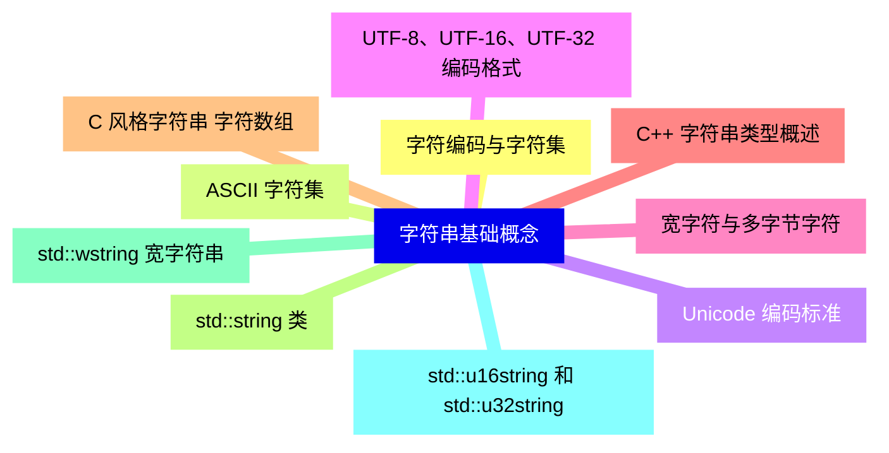
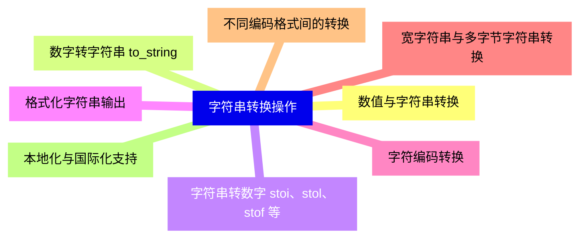
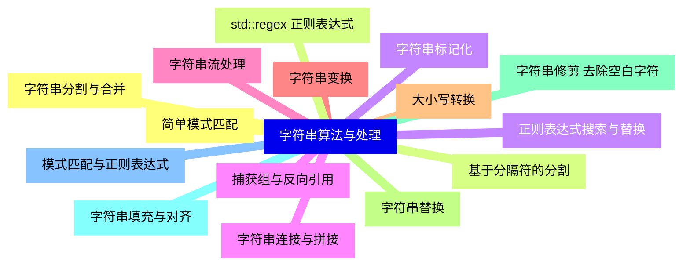
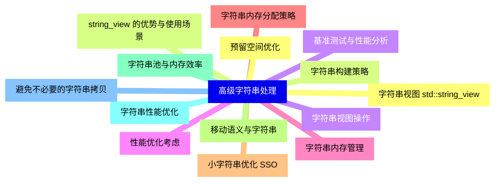
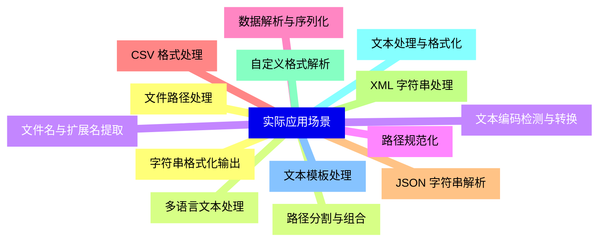


### 1 [字符串基础概念](#1)
#### 1.1 [字符编码与字符集](#1)
#### 1.2 [ASCII 字符集](#1)
#### 1.3 [Unicode 编码标准](#1)
#### 1.4 [UTF-8、UTF-16、UTF-32 编码格式](#1)
#### 1.5 [宽字符与多字节字符](#1)
#### 1.6 [C++ 字符串类型概述](#1)
#### 1.7 [C 风格字符串 字符数组](#1)
#### 1.8 [std::string 类](#1)
#### 1.9 [std::wstring 宽字符串](#1)
#### 1.10 [std::u16string 和 std::u32string](#1)
### 2 [标准库字符串类](#2)
#### 2.1 [std::string 基础操作](#2)
#### 2.2 [字符串构造与初始化](#2)
#### 2.3 [字符串赋值与拷贝](#2)
#### 2.4 [字符串长度与容量](#2)
#### 2.5 [字符串清空与判空](#2)
#### 2.6 [字符串访问与修改](#2)
#### 2.7 [字符访问方法 []、at](#2)
#### 2.8 [迭代器访问](#2)
#### 2.9 [字符串连接与追加](#2)
#### 2.10 [字符串插入与删除](#2)
#### 2.11 [子字符串提取](#2)
#### 2.12 [字符串比较与搜索](#2)
#### 2.13 [字符串比较操作符](#2)
#### 2.14 [compare   方法](#2)
#### 2.15 [查找函数 find、rfind](#2)
#### 2.16 [查找首个/末个字符](#2)
#### 2.17 [子字符串搜索](#2)
### 3 [字符串转换操作](#3)
#### 3.1 [数值与字符串转换](#3)
#### 3.2 [数字转字符串 to_string](#3)
#### 3.3 [字符串转数字 stoi、stol、stof 等](#3)
#### 3.4 [格式化字符串输出](#3)
#### 3.5 [字符编码转换](#3)
#### 3.6 [宽字符串与多字节字符串转换](#3)
#### 3.7 [不同编码格式间的转换](#3)
#### 3.8 [本地化与国际化支持](#3)
### 4 [字符串算法与处理](#4)
#### 4.1 [字符串分割与合并](#4)
#### 4.2 [基于分隔符的分割](#4)
#### 4.3 [字符串标记化](#4)
#### 4.4 [字符串连接与拼接](#4)
#### 4.5 [字符串流处理](#4)
#### 4.6 [字符串变换](#4)
#### 4.7 [大小写转换](#4)
#### 4.8 [字符串替换](#4)
#### 4.9 [字符串修剪 去除空白字符](#4)
#### 4.10 [字符串填充与对齐](#4)
#### 4.11 [模式匹配与正则表达式](#4)
#### 4.12 [简单模式匹配](#4)
#### 4.13 [std::regex 正则表达式](#4)
#### 4.14 [正则表达式搜索与替换](#4)
#### 4.15 [捕获组与反向引用](#4)
### 5 [高级字符串处理](#5)
#### 5.1 [字符串视图 std::string_view](#5)
#### 5.2 [string_view 的优势与使用场景](#5)
#### 5.3 [字符串视图操作](#5)
#### 5.4 [性能优化考虑](#5)
#### 5.5 [字符串内存管理](#5)
#### 5.6 [字符串内存分配策略](#5)
#### 5.7 [小字符串优化 SSO](#5)
#### 5.8 [移动语义与字符串](#5)
#### 5.9 [字符串池与内存效率](#5)
#### 5.10 [字符串性能优化](#5)
#### 5.11 [避免不必要的字符串拷贝](#5)
#### 5.12 [预留空间优化](#5)
#### 5.13 [字符串构建策略](#5)
#### 5.14 [基准测试与性能分析](#5)
### 6 [实际应用场景](#6)
#### 6.1 [文件路径处理](#6)
#### 6.2 [路径分割与组合](#6)
#### 6.3 [文件名与扩展名提取](#6)
#### 6.4 [路径规范化](#6)
#### 6.5 [数据解析与序列化](#6)
#### 6.6 [CSV 格式处理](#6)
#### 6.7 [JSON 字符串解析](#6)
#### 6.8 [XML 字符串处理](#6)
#### 6.9 [自定义格式解析](#6)
#### 6.10 [文本处理与格式化](#6)
#### 6.11 [文本模板处理](#6)
#### 6.12 [字符串格式化输出](#6)
#### 6.13 [多语言文本处理](#6)
#### 6.14 [文本编码检测与转换](#6)





### 1 字符串基础概念


---
### 1 字符串基础概念
___
#### 1.1 字符编码与字符集
___
#### 1.2 ASCII 字符集
___
#### 1.3 Unicode 编码标准
___
#### 1.4 UTF-8、UTF-16、UTF-32 编码格式
___
#### 1.5 宽字符与多字节字符
___
#### 1.6 C++ 字符串类型概述
___
#### 1.7 C 风格字符串 字符数组
___
#### 1.8 std::string 类
___
#### 1.9 std::wstring 宽字符串
___
#### 1.10 std::u16string 和 std::u32string
### 2 标准库字符串类


---
### 2 标准库字符串类
___
#### 2.1 std::string 基础操作
___
#### 2.2 字符串构造与初始化
___
#### 2.3 字符串赋值与拷贝
___
#### 2.4 字符串长度与容量
___
#### 2.5 字符串清空与判空
___
#### 2.6 字符串访问与修改
___
#### 2.7 字符访问方法 []、at
___
#### 2.8 迭代器访问
___
#### 2.9 字符串连接与追加
___
#### 2.10 字符串插入与删除
___
#### 2.11 子字符串提取
___
#### 2.12 字符串比较与搜索
___
#### 2.13 字符串比较操作符
___
#### 2.14 compare   方法
___
#### 2.15 查找函数 find、rfind
___
#### 2.16 查找首个/末个字符
___
#### 2.17 子字符串搜索
### 3 字符串转换操作


---
### 3 字符串转换操作
___
#### 3.1 数值与字符串转换
___
#### 3.2 数字转字符串 to_string
___
#### 3.3 字符串转数字 stoi、stol、stof 等
___
#### 3.4 格式化字符串输出
___
#### 3.5 字符编码转换
___
#### 3.6 宽字符串与多字节字符串转换
___
#### 3.7 不同编码格式间的转换
___
#### 3.8 本地化与国际化支持
### 4 字符串算法与处理


---
### 4 字符串算法与处理
___
#### 4.1 字符串分割与合并
___
#### 4.2 基于分隔符的分割
___
#### 4.3 字符串标记化
___
#### 4.4 字符串连接与拼接
___
#### 4.5 字符串流处理
___
#### 4.6 字符串变换
___
#### 4.7 大小写转换
___
#### 4.8 字符串替换
___
#### 4.9 字符串修剪 去除空白字符
___
#### 4.10 字符串填充与对齐
___
#### 4.11 模式匹配与正则表达式
___
#### 4.12 简单模式匹配
___
#### 4.13 std::regex 正则表达式
___
#### 4.14 正则表达式搜索与替换
___
#### 4.15 捕获组与反向引用
### 5 高级字符串处理


---
### 5 高级字符串处理
___
#### 5.1 字符串视图 std::string_view
___
#### 5.2 string_view 的优势与使用场景
___
#### 5.3 字符串视图操作
___
#### 5.4 性能优化考虑
___
#### 5.5 字符串内存管理
___
#### 5.6 字符串内存分配策略
___
#### 5.7 小字符串优化 SSO
___
#### 5.8 移动语义与字符串
___
#### 5.9 字符串池与内存效率
___
#### 5.10 字符串性能优化
___
#### 5.11 避免不必要的字符串拷贝
___
#### 5.12 预留空间优化
___
#### 5.13 字符串构建策略
___
#### 5.14 基准测试与性能分析
### 6 实际应用场景


---
### 6 实际应用场景
___
#### 6.1 文件路径处理
___
#### 6.2 路径分割与组合
___
#### 6.3 文件名与扩展名提取
___
#### 6.4 路径规范化
___
#### 6.5 数据解析与序列化
___
#### 6.6 CSV 格式处理
___
#### 6.7 JSON 字符串解析
___
#### 6.8 XML 字符串处理
___
#### 6.9 自定义格式解析
___
#### 6.10 文本处理与格式化
___
#### 6.11 文本模板处理
___
#### 6.12 字符串格式化输出
___
#### 6.13 多语言文本处理
___
#### 6.14 文本编码检测与转换



### 1 字符串基础概念{#1}


{}


<--->
{}
{}
{}
{}
{}
{}
{}
{}
{}
{}
{}
{}
{}
{}
{}
{}
{}
{}
{}
{}
{}

### 2 标准库字符串类{#2}


{}
{}
{}
{}
{}
{}
{}
{}
{}
{}
{}
{}
{}
{}
{}
{}
{}
{}
{}
{}
{}
{}
{}
{}
{}
{}
{}
{}
{}
{}
{}
{}
{}
{}
{}
<--->
```mermaid
mindmap
    id2[标准库字符串类]
        id2-1[std::string 基础操作]
        id2-2[字符串构造与初始化]
        id2-3[字符串赋值与拷贝]
        id2-4[字符串长度与容量]
        id2-5[字符串清空与判空]
        id2-6[字符串访问与修改]
        id2-7[字符访问方法 []、at]
        id2-8[迭代器访问]
        id2-9[字符串连接与追加]
        id2-10[字符串插入与删除]
        id2-11[子字符串提取]
        id2-12[字符串比较与搜索]
        id2-13[字符串比较操作符]
        id2-14[compare   方法]
        id2-15[查找函数 find、rfind]
        id2-16[查找首个/末个字符]
        id2-17[子字符串搜索]
```

{}

### 3 字符串转换操作{#3}


{}


<--->
{}
{}
{}
{}
{}
{}
{}
{}
{}
{}
{}
{}
{}
{}
{}
{}
{}

### 4 字符串算法与处理{#4}


{}
{}
{}
{}
{}
{}
{}
{}
{}
{}
{}
{}
{}
{}
{}
{}
{}
{}
{}
{}
{}
{}
{}
{}
{}
{}
{}
{}
{}
{}
{}
<--->


{}

### 5 高级字符串处理{#5}


{}


<--->
{}
{}
{}
{}
{}
{}
{}
{}
{}
{}
{}
{}
{}
{}
{}
{}
{}
{}
{}
{}
{}
{}
{}
{}
{}
{}
{}
{}
{}

### 6 实际应用场景{#6}


{}
{}
{}
{}
{}
{}
{}
{}
{}
{}
{}
{}
{}
{}
{}
{}
{}
{}
{}
{}
{}
{}
{}
{}
{}
{}
{}
{}
{}
<--->


{}
