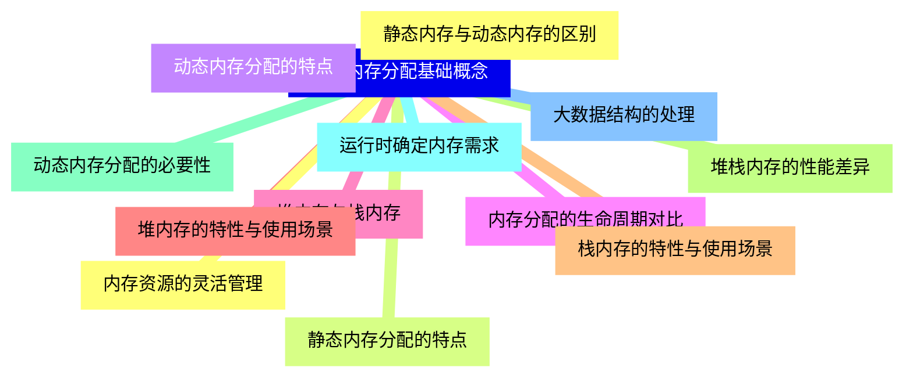
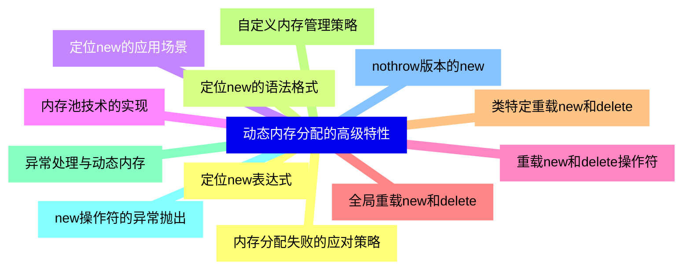
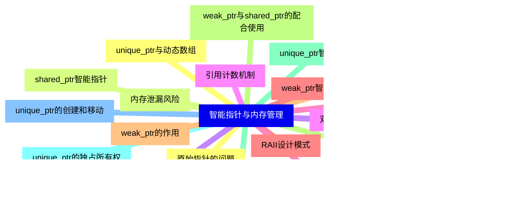
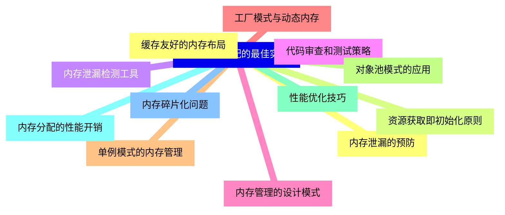
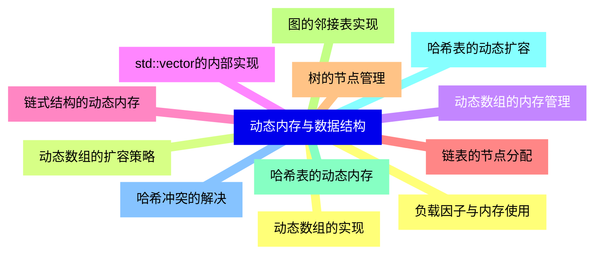
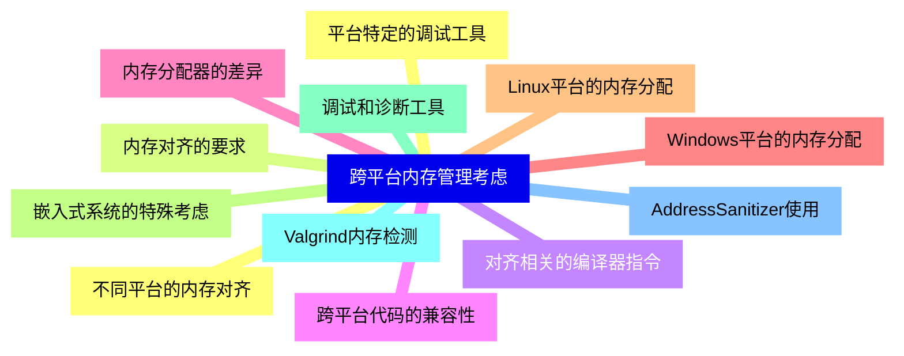
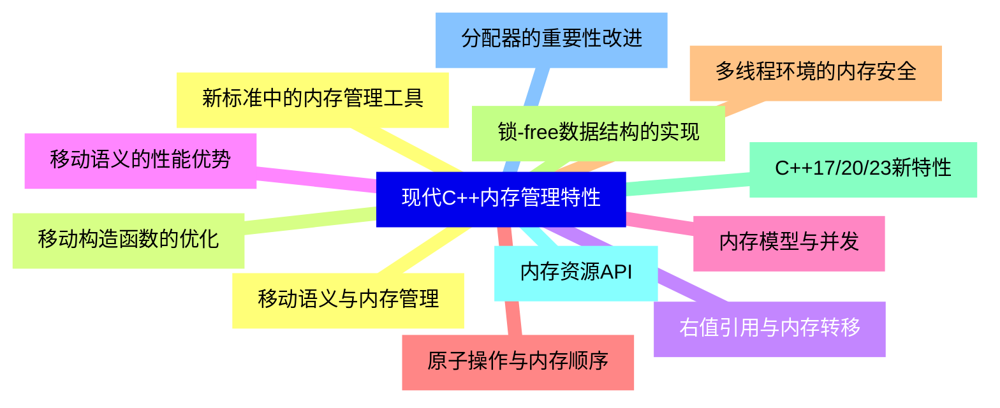


### 1 [动态内存分配基础概念](#1)
#### 1.1 [静态内存与动态内存的区别](#1)
#### 1.2 [静态内存分配的特点](#1)
#### 1.3 [动态内存分配的特点](#1)
#### 1.4 [内存分配的生命周期对比](#1)
#### 1.5 [堆内存与栈内存](#1)
#### 1.6 [堆内存的特性与使用场景](#1)
#### 1.7 [栈内存的特性与使用场景](#1)
#### 1.8 [堆栈内存的性能差异](#1)
#### 1.9 [动态内存分配的必要性](#1)
#### 1.10 [运行时确定内存需求](#1)
#### 1.11 [大数据结构的处理](#1)
#### 1.12 [内存资源的灵活管理](#1)
### 2 [C++动态内存操作符](#2)
#### 2.1 [new操作符](#2)
#### 2.2 [new操作符的基本语法](#2)
#### 2.3 [new操作符的工作原理](#2)
#### 2.4 [new操作符的返回值类型](#2)
#### 2.5 [delete操作符](#2)
#### 2.6 [delete操作符的基本语法](#2)
#### 2.7 [delete操作符的工作原理](#2)
#### 2.8 [delete操作符的使用注意事项](#2)
#### 2.9 [new[]和delete[]操作符](#2)
#### 2.10 [数组的动态内存分配](#2)
#### 2.11 [数组的动态内存释放](#2)
#### 2.12 [数组大小记录机制](#2)
### 3 [动态内存分配的高级特性](#3)
#### 3.1 [定位new表达式](#3)
#### 3.2 [定位new的语法格式](#3)
#### 3.3 [定位new的应用场景](#3)
#### 3.4 [内存池技术的实现](#3)
#### 3.5 [重载new和delete操作符](#3)
#### 3.6 [全局重载new和delete](#3)
#### 3.7 [类特定重载new和delete](#3)
#### 3.8 [自定义内存管理策略](#3)
#### 3.9 [异常处理与动态内存](#3)
#### 3.10 [new操作符的异常抛出](#3)
#### 3.11 [nothrow版本的new](#3)
#### 3.12 [内存分配失败的应对策略](#3)
### 4 [智能指针与内存管理](#4)
#### 4.1 [原始指针的问题](#4)
#### 4.2 [内存泄漏风险](#4)
#### 4.3 [悬空指针问题](#4)
#### 4.4 [双重释放错误](#4)
#### 4.5 [智能指针概述](#4)
#### 4.6 [RAII设计模式](#4)
#### 4.7 [智能指针的分类](#4)
#### 4.8 [智能指针的自动内存管理](#4)
#### 4.9 [unique_ptr智能指针](#4)
#### 4.10 [unique_ptr的独占所有权](#4)
#### 4.11 [unique_ptr的创建和移动](#4)
#### 4.12 [unique_ptr与动态数组](#4)
#### 4.13 [shared_ptr智能指针](#4)
#### 4.14 [shared_ptr的共享所有权](#4)
#### 4.15 [引用计数机制](#4)
#### 4.16 [shared_ptr的循环引用问题](#4)
#### 4.17 [weak_ptr智能指针](#4)
#### 4.18 [weak_ptr的作用](#4)
#### 4.19 [weak_ptr与shared_ptr的配合使用](#4)
#### 4.20 [打破循环引用的方法](#4)
### 5 [动态内存分配的最佳实践](#5)
#### 5.1 [内存泄漏的预防](#5)
#### 5.2 [资源获取即初始化原则](#5)
#### 5.3 [内存泄漏检测工具](#5)
#### 5.4 [代码审查和测试策略](#5)
#### 5.5 [内存管理的设计模式](#5)
#### 5.6 [工厂模式与动态内存](#5)
#### 5.7 [单例模式的内存管理](#5)
#### 5.8 [对象池模式的应用](#5)
#### 5.9 [性能优化技巧](#5)
#### 5.10 [内存分配的性能开销](#5)
#### 5.11 [内存碎片化问题](#5)
#### 5.12 [缓存友好的内存布局](#5)
### 6 [动态内存与数据结构](#6)
#### 6.1 [动态数组的实现](#6)
#### 6.2 [动态数组的扩容策略](#6)
#### 6.3 [动态数组的内存管理](#6)
#### 6.4 [std::vector的内部实现](#6)
#### 6.5 [链式结构的动态内存](#6)
#### 6.6 [链表的节点分配](#6)
#### 6.7 [树的节点管理](#6)
#### 6.8 [图的邻接表实现](#6)
#### 6.9 [哈希表的动态内存](#6)
#### 6.10 [哈希表的动态扩容](#6)
#### 6.11 [哈希冲突的解决](#6)
#### 6.12 [负载因子与内存使用](#6)
### 7 [跨平台内存管理考虑](#7)
#### 7.1 [不同平台的内存对齐](#7)
#### 7.2 [内存对齐的要求](#7)
#### 7.3 [对齐相关的编译器指令](#7)
#### 7.4 [跨平台代码的兼容性](#7)
#### 7.5 [内存分配器的差异](#7)
#### 7.6 [Windows平台的内存分配](#7)
#### 7.7 [Linux平台的内存分配](#7)
#### 7.8 [嵌入式系统的特殊考虑](#7)
#### 7.9 [调试和诊断工具](#7)
#### 7.10 [Valgrind内存检测](#7)
#### 7.11 [AddressSanitizer使用](#7)
#### 7.12 [平台特定的调试工具](#7)
### 8 [现代C++内存管理特性](#8)
#### 8.1 [移动语义与内存管理](#8)
#### 8.2 [移动构造函数的优化](#8)
#### 8.3 [右值引用与内存转移](#8)
#### 8.4 [移动语义的性能优势](#8)
#### 8.5 [内存模型与并发](#8)
#### 8.6 [原子操作与内存顺序](#8)
#### 8.7 [多线程环境的内存安全](#8)
#### 8.8 [锁-free数据结构的实现](#8)
#### 8.9 [C++17/20/23新特性](#8)
#### 8.10 [内存资源API](#8)
#### 8.11 [分配器的重要性改进](#8)
#### 8.12 [新标准中的内存管理工具](#8)





### 1 动态内存分配基础概念


---
### 1 动态内存分配基础概念
___
#### 1.1 静态内存与动态内存的区别
___
#### 1.2 静态内存分配的特点
___
#### 1.3 动态内存分配的特点
___
#### 1.4 内存分配的生命周期对比
___
#### 1.5 堆内存与栈内存
___
#### 1.6 堆内存的特性与使用场景
___
#### 1.7 栈内存的特性与使用场景
___
#### 1.8 堆栈内存的性能差异
___
#### 1.9 动态内存分配的必要性
___
#### 1.10 运行时确定内存需求
___
#### 1.11 大数据结构的处理
___
#### 1.12 内存资源的灵活管理
### 2 C++动态内存操作符


---
### 2 C++动态内存操作符
___
#### 2.1 new操作符
___
#### 2.2 new操作符的基本语法
___
#### 2.3 new操作符的工作原理
___
#### 2.4 new操作符的返回值类型
___
#### 2.5 delete操作符
___
#### 2.6 delete操作符的基本语法
___
#### 2.7 delete操作符的工作原理
___
#### 2.8 delete操作符的使用注意事项
___
#### 2.9 new[]和delete[]操作符
___
#### 2.10 数组的动态内存分配
___
#### 2.11 数组的动态内存释放
___
#### 2.12 数组大小记录机制
### 3 动态内存分配的高级特性


---
### 3 动态内存分配的高级特性
___
#### 3.1 定位new表达式
___
#### 3.2 定位new的语法格式
___
#### 3.3 定位new的应用场景
___
#### 3.4 内存池技术的实现
___
#### 3.5 重载new和delete操作符
___
#### 3.6 全局重载new和delete
___
#### 3.7 类特定重载new和delete
___
#### 3.8 自定义内存管理策略
___
#### 3.9 异常处理与动态内存
___
#### 3.10 new操作符的异常抛出
___
#### 3.11 nothrow版本的new
___
#### 3.12 内存分配失败的应对策略
### 4 智能指针与内存管理


---
### 4 智能指针与内存管理
___
#### 4.1 原始指针的问题
___
#### 4.2 内存泄漏风险
___
#### 4.3 悬空指针问题
___
#### 4.4 双重释放错误
___
#### 4.5 智能指针概述
___
#### 4.6 RAII设计模式
___
#### 4.7 智能指针的分类
___
#### 4.8 智能指针的自动内存管理
___
#### 4.9 unique_ptr智能指针
___
#### 4.10 unique_ptr的独占所有权
___
#### 4.11 unique_ptr的创建和移动
___
#### 4.12 unique_ptr与动态数组
___
#### 4.13 shared_ptr智能指针
___
#### 4.14 shared_ptr的共享所有权
___
#### 4.15 引用计数机制
___
#### 4.16 shared_ptr的循环引用问题
___
#### 4.17 weak_ptr智能指针
___
#### 4.18 weak_ptr的作用
___
#### 4.19 weak_ptr与shared_ptr的配合使用
___
#### 4.20 打破循环引用的方法
### 5 动态内存分配的最佳实践


---
### 5 动态内存分配的最佳实践
___
#### 5.1 内存泄漏的预防
___
#### 5.2 资源获取即初始化原则
___
#### 5.3 内存泄漏检测工具
___
#### 5.4 代码审查和测试策略
___
#### 5.5 内存管理的设计模式
___
#### 5.6 工厂模式与动态内存
___
#### 5.7 单例模式的内存管理
___
#### 5.8 对象池模式的应用
___
#### 5.9 性能优化技巧
___
#### 5.10 内存分配的性能开销
___
#### 5.11 内存碎片化问题
___
#### 5.12 缓存友好的内存布局
### 6 动态内存与数据结构


---
### 6 动态内存与数据结构
___
#### 6.1 动态数组的实现
___
#### 6.2 动态数组的扩容策略
___
#### 6.3 动态数组的内存管理
___
#### 6.4 std::vector的内部实现
___
#### 6.5 链式结构的动态内存
___
#### 6.6 链表的节点分配
___
#### 6.7 树的节点管理
___
#### 6.8 图的邻接表实现
___
#### 6.9 哈希表的动态内存
___
#### 6.10 哈希表的动态扩容
___
#### 6.11 哈希冲突的解决
___
#### 6.12 负载因子与内存使用
### 7 跨平台内存管理考虑


---
### 7 跨平台内存管理考虑
___
#### 7.1 不同平台的内存对齐
___
#### 7.2 内存对齐的要求
___
#### 7.3 对齐相关的编译器指令
___
#### 7.4 跨平台代码的兼容性
___
#### 7.5 内存分配器的差异
___
#### 7.6 Windows平台的内存分配
___
#### 7.7 Linux平台的内存分配
___
#### 7.8 嵌入式系统的特殊考虑
___
#### 7.9 调试和诊断工具
___
#### 7.10 Valgrind内存检测
___
#### 7.11 AddressSanitizer使用
___
#### 7.12 平台特定的调试工具
### 8 现代C++内存管理特性


---
### 8 现代C++内存管理特性
___
#### 8.1 移动语义与内存管理
___
#### 8.2 移动构造函数的优化
___
#### 8.3 右值引用与内存转移
___
#### 8.4 移动语义的性能优势
___
#### 8.5 内存模型与并发
___
#### 8.6 原子操作与内存顺序
___
#### 8.7 多线程环境的内存安全
___
#### 8.8 锁-free数据结构的实现
___
#### 8.9 C++17/20/23新特性
___
#### 8.10 内存资源API
___
#### 8.11 分配器的重要性改进
___
#### 8.12 新标准中的内存管理工具



### 1 动态内存分配基础概念{#1}


{}


<--->
{}
{}
{}
{}
{}
{}
{}
{}
{}
{}
{}
{}
{}
{}
{}
{}
{}
{}
{}
{}
{}
{}
{}
{}
{}

### 2 C++动态内存操作符{#2}


{}
{}
{}
{}
{}
{}
{}
{}
{}
{}
{}
{}
{}
{}
{}
{}
{}
{}
{}
{}
{}
{}
{}
{}
{}
<--->
```mermaid
mindmap
    id2[C++动态内存操作符]
        id2-1[new操作符]
        id2-2[new操作符的基本语法]
        id2-3[new操作符的工作原理]
        id2-4[new操作符的返回值类型]
        id2-5[delete操作符]
        id2-6[delete操作符的基本语法]
        id2-7[delete操作符的工作原理]
        id2-8[delete操作符的使用注意事项]
        id2-9[new[]和delete[]操作符]
        id2-10[数组的动态内存分配]
        id2-11[数组的动态内存释放]
        id2-12[数组大小记录机制]
```

{}

### 3 动态内存分配的高级特性{#3}


{}


<--->
{}
{}
{}
{}
{}
{}
{}
{}
{}
{}
{}
{}
{}
{}
{}
{}
{}
{}
{}
{}
{}
{}
{}
{}
{}

### 4 智能指针与内存管理{#4}


{}
{}
{}
{}
{}
{}
{}
{}
{}
{}
{}
{}
{}
{}
{}
{}
{}
{}
{}
{}
{}
{}
{}
{}
{}
{}
{}
{}
{}
{}
{}
{}
{}
{}
{}
{}
{}
{}
{}
{}
{}
<--->


{}

### 5 动态内存分配的最佳实践{#5}


{}


<--->
{}
{}
{}
{}
{}
{}
{}
{}
{}
{}
{}
{}
{}
{}
{}
{}
{}
{}
{}
{}
{}
{}
{}
{}
{}

### 6 动态内存与数据结构{#6}


{}
{}
{}
{}
{}
{}
{}
{}
{}
{}
{}
{}
{}
{}
{}
{}
{}
{}
{}
{}
{}
{}
{}
{}
{}
<--->


{}

### 7 跨平台内存管理考虑{#7}


{}


<--->
{}
{}
{}
{}
{}
{}
{}
{}
{}
{}
{}
{}
{}
{}
{}
{}
{}
{}
{}
{}
{}
{}
{}
{}
{}

### 8 现代C++内存管理特性{#8}


{}
{}
{}
{}
{}
{}
{}
{}
{}
{}
{}
{}
{}
{}
{}
{}
{}
{}
{}
{}
{}
{}
{}
{}
{}
<--->


{}
