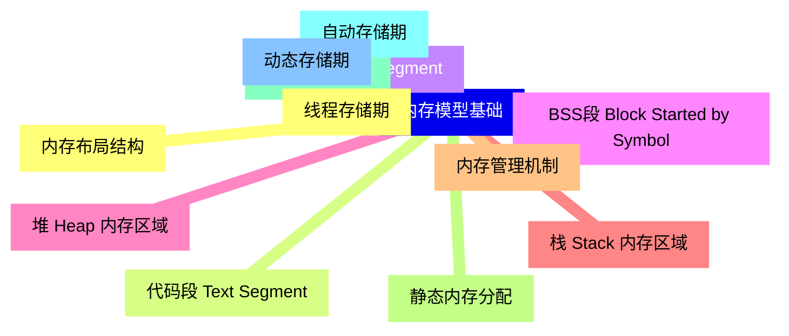
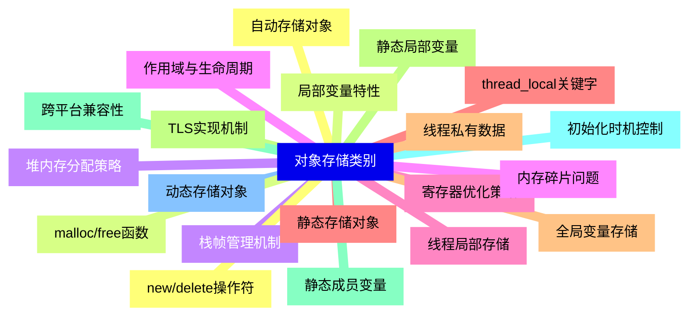
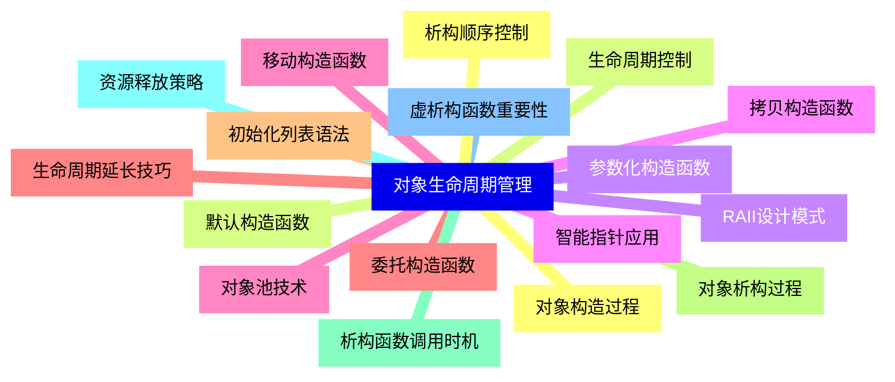
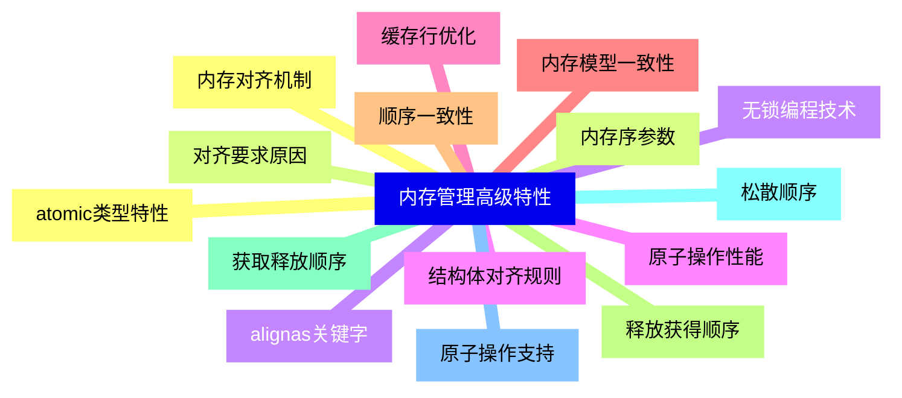
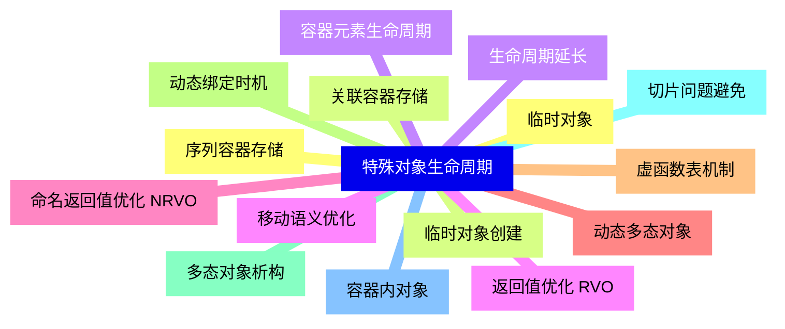
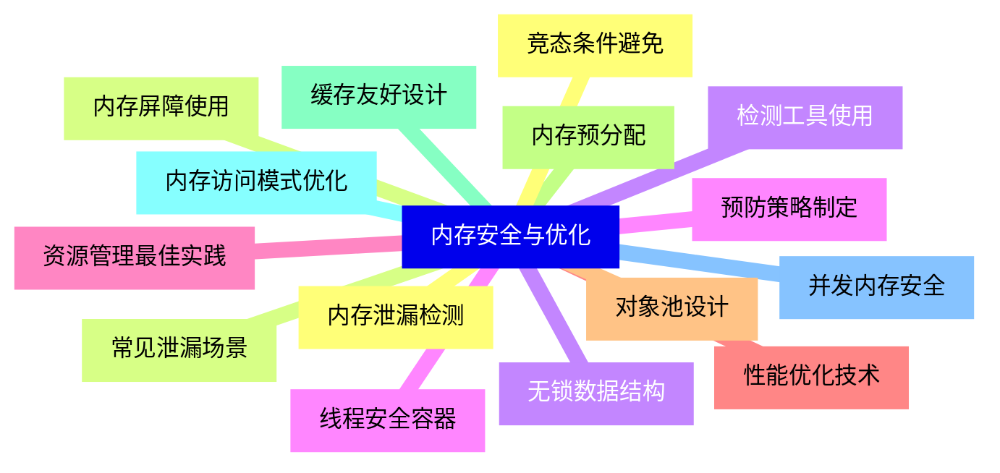


### 1 [内存模型基础](#1)
#### 1.1 [内存布局结构](#1)
#### 1.2 [代码段 Text Segment](#1)
#### 1.3 [数据段 Data Segment](#1)
#### 1.4 [BSS段 Block Started by Symbol](#1)
#### 1.5 [堆 Heap 内存区域](#1)
#### 1.6 [栈 Stack 内存区域](#1)
#### 1.7 [内存管理机制](#1)
#### 1.8 [静态内存分配](#1)
#### 1.9 [动态内存分配](#1)
#### 1.10 [自动存储期](#1)
#### 1.11 [动态存储期](#1)
#### 1.12 [线程存储期](#1)
### 2 [对象存储类别](#2)
#### 2.1 [自动存储对象](#2)
#### 2.2 [局部变量特性](#2)
#### 2.3 [栈帧管理机制](#2)
#### 2.4 [作用域与生命周期](#2)
#### 2.5 [寄存器优化策略](#2)
#### 2.6 [静态存储对象](#2)
#### 2.7 [全局变量存储](#2)
#### 2.8 [静态局部变量](#2)
#### 2.9 [静态成员变量](#2)
#### 2.10 [初始化时机控制](#2)
#### 2.11 [动态存储对象](#2)
#### 2.12 [new/delete操作符](#2)
#### 2.13 [malloc/free函数](#2)
#### 2.14 [堆内存分配策略](#2)
#### 2.15 [内存碎片问题](#2)
#### 2.16 [线程局部存储](#2)
#### 2.17 [thread_local关键字](#2)
#### 2.18 [线程私有数据](#2)
#### 2.19 [TLS实现机制](#2)
#### 2.20 [跨平台兼容性](#2)
### 3 [对象生命周期管理](#3)
#### 3.1 [对象构造过程](#3)
#### 3.2 [默认构造函数](#3)
#### 3.3 [参数化构造函数](#3)
#### 3.4 [拷贝构造函数](#3)
#### 3.5 [移动构造函数](#3)
#### 3.6 [委托构造函数](#3)
#### 3.7 [初始化列表语法](#3)
#### 3.8 [对象析构过程](#3)
#### 3.9 [析构函数调用时机](#3)
#### 3.10 [资源释放策略](#3)
#### 3.11 [虚析构函数重要性](#3)
#### 3.12 [析构顺序控制](#3)
#### 3.13 [生命周期控制](#3)
#### 3.14 [RAII设计模式](#3)
#### 3.15 [智能指针应用](#3)
#### 3.16 [对象池技术](#3)
#### 3.17 [生命周期延长技巧](#3)
### 4 [内存管理高级特性](#4)
#### 4.1 [内存对齐机制](#4)
#### 4.2 [对齐要求原因](#4)
#### 4.3 [alignas关键字](#4)
#### 4.4 [结构体对齐规则](#4)
#### 4.5 [缓存行优化](#4)
#### 4.6 [内存模型一致性](#4)
#### 4.7 [顺序一致性](#4)
#### 4.8 [释放获得顺序](#4)
#### 4.9 [获取释放顺序](#4)
#### 4.10 [松散顺序](#4)
#### 4.11 [原子操作支持](#4)
#### 4.12 [atomic类型特性](#4)
#### 4.13 [内存序参数](#4)
#### 4.14 [无锁编程技术](#4)
#### 4.15 [原子操作性能](#4)
### 5 [特殊对象生命周期](#5)
#### 5.1 [临时对象](#5)
#### 5.2 [临时对象创建](#5)
#### 5.3 [生命周期延长](#5)
#### 5.4 [返回值优化 RVO](#5)
#### 5.5 [命名返回值优化 NRVO](#5)
#### 5.6 [动态多态对象](#5)
#### 5.7 [虚函数表机制](#5)
#### 5.8 [动态绑定时机](#5)
#### 5.9 [多态对象析构](#5)
#### 5.10 [切片问题避免](#5)
#### 5.11 [容器内对象](#5)
#### 5.12 [序列容器存储](#5)
#### 5.13 [关联容器存储](#5)
#### 5.14 [容器元素生命周期](#5)
#### 5.15 [移动语义优化](#5)
### 6 [内存安全与优化](#6)
#### 6.1 [内存泄漏检测](#6)
#### 6.2 [常见泄漏场景](#6)
#### 6.3 [检测工具使用](#6)
#### 6.4 [预防策略制定](#6)
#### 6.5 [资源管理最佳实践](#6)
#### 6.6 [性能优化技术](#6)
#### 6.7 [对象池设计](#6)
#### 6.8 [内存预分配](#6)
#### 6.9 [缓存友好设计](#6)
#### 6.10 [内存访问模式优化](#6)
#### 6.11 [并发内存安全](#6)
#### 6.12 [竞态条件避免](#6)
#### 6.13 [内存屏障使用](#6)
#### 6.14 [无锁数据结构](#6)
#### 6.15 [线程安全容器](#6)




### 1 内存模型基础

---
### 1 内存模型基础
___
#### 1.1 内存布局结构
___
#### 1.2 代码段 Text Segment
___
#### 1.3 数据段 Data Segment
___
#### 1.4 BSS段 Block Started by Symbol
___
#### 1.5 堆 Heap 内存区域
___
#### 1.6 栈 Stack 内存区域
___
#### 1.7 内存管理机制
___
#### 1.8 静态内存分配
___
#### 1.9 动态内存分配
___
#### 1.10 自动存储期
___
#### 1.11 动态存储期
___
#### 1.12 线程存储期
### 2 对象存储类别

---
### 2 对象存储类别
___
#### 2.1 自动存储对象
___
#### 2.2 局部变量特性
___
#### 2.3 栈帧管理机制
___
#### 2.4 作用域与生命周期
___
#### 2.5 寄存器优化策略
___
#### 2.6 静态存储对象
___
#### 2.7 全局变量存储
___
#### 2.8 静态局部变量
___
#### 2.9 静态成员变量
___
#### 2.10 初始化时机控制
___
#### 2.11 动态存储对象
___
#### 2.12 new/delete操作符
___
#### 2.13 malloc/free函数
___
#### 2.14 堆内存分配策略
___
#### 2.15 内存碎片问题
___
#### 2.16 线程局部存储
___
#### 2.17 thread_local关键字
___
#### 2.18 线程私有数据
___
#### 2.19 TLS实现机制
___
#### 2.20 跨平台兼容性
### 3 对象生命周期管理

---
### 3 对象生命周期管理
___
#### 3.1 对象构造过程
___
#### 3.2 默认构造函数
___
#### 3.3 参数化构造函数
___
#### 3.4 拷贝构造函数
___
#### 3.5 移动构造函数
___
#### 3.6 委托构造函数
___
#### 3.7 初始化列表语法
___
#### 3.8 对象析构过程
___
#### 3.9 析构函数调用时机
___
#### 3.10 资源释放策略
___
#### 3.11 虚析构函数重要性
___
#### 3.12 析构顺序控制
___
#### 3.13 生命周期控制
___
#### 3.14 RAII设计模式
___
#### 3.15 智能指针应用
___
#### 3.16 对象池技术
___
#### 3.17 生命周期延长技巧
### 4 内存管理高级特性

---
### 4 内存管理高级特性
___
#### 4.1 内存对齐机制
___
#### 4.2 对齐要求原因
___
#### 4.3 alignas关键字
___
#### 4.4 结构体对齐规则
___
#### 4.5 缓存行优化
___
#### 4.6 内存模型一致性
___
#### 4.7 顺序一致性
___
#### 4.8 释放获得顺序
___
#### 4.9 获取释放顺序
___
#### 4.10 松散顺序
___
#### 4.11 原子操作支持
___
#### 4.12 atomic类型特性
___
#### 4.13 内存序参数
___
#### 4.14 无锁编程技术
___
#### 4.15 原子操作性能
### 5 特殊对象生命周期

---
### 5 特殊对象生命周期
___
#### 5.1 临时对象
___
#### 5.2 临时对象创建
___
#### 5.3 生命周期延长
___
#### 5.4 返回值优化 RVO
___
#### 5.5 命名返回值优化 NRVO
___
#### 5.6 动态多态对象
___
#### 5.7 虚函数表机制
___
#### 5.8 动态绑定时机
___
#### 5.9 多态对象析构
___
#### 5.10 切片问题避免
___
#### 5.11 容器内对象
___
#### 5.12 序列容器存储
___
#### 5.13 关联容器存储
___
#### 5.14 容器元素生命周期
___
#### 5.15 移动语义优化
### 6 内存安全与优化

---
### 6 内存安全与优化
___
#### 6.1 内存泄漏检测
___
#### 6.2 常见泄漏场景
___
#### 6.3 检测工具使用
___
#### 6.4 预防策略制定
___
#### 6.5 资源管理最佳实践
___
#### 6.6 性能优化技术
___
#### 6.7 对象池设计
___
#### 6.8 内存预分配
___
#### 6.9 缓存友好设计
___
#### 6.10 内存访问模式优化
___
#### 6.11 并发内存安全
___
#### 6.12 竞态条件避免
___
#### 6.13 内存屏障使用
___
#### 6.14 无锁数据结构
___
#### 6.15 线程安全容器


### 1 内存模型基础{#1}

{}

<--->
{}
{}
{}
{}
{}
{}
{}
{}
{}
{}
{}
{}
{}
{}
{}
{}
{}
{}
{}
{}
{}
{}
{}
{}
{}

### 2 对象存储类别{#2}

{}
{}
{}
{}
{}
{}
{}
{}
{}
{}
{}
{}
{}
{}
{}
{}
{}
{}
{}
{}
{}
{}
{}
{}
{}
{}
{}
{}
{}
{}
{}
{}
{}
{}
{}
{}
{}
{}
{}
{}
{}
<--->

{}

### 3 对象生命周期管理{#3}

{}

<--->
{}
{}
{}
{}
{}
{}
{}
{}
{}
{}
{}
{}
{}
{}
{}
{}
{}
{}
{}
{}
{}
{}
{}
{}
{}
{}
{}
{}
{}
{}
{}
{}
{}
{}
{}

### 4 内存管理高级特性{#4}

{}
{}
{}
{}
{}
{}
{}
{}
{}
{}
{}
{}
{}
{}
{}
{}
{}
{}
{}
{}
{}
{}
{}
{}
{}
{}
{}
{}
{}
{}
{}
<--->

{}

### 5 特殊对象生命周期{#5}

{}

<--->
{}
{}
{}
{}
{}
{}
{}
{}
{}
{}
{}
{}
{}
{}
{}
{}
{}
{}
{}
{}
{}
{}
{}
{}
{}
{}
{}
{}
{}
{}
{}

### 6 内存安全与优化{#6}

{}
{}
{}
{}
{}
{}
{}
{}
{}
{}
{}
{}
{}
{}
{}
{}
{}
{}
{}
{}
{}
{}
{}
{}
{}
{}
{}
{}
{}
{}
{}
<--->

{}
