
### 1 [并发编程基础概念](#1)
#### 1.1 [并发与并行](#1)
#### 1.2 [并发定义与并行区别](#1)
#### 1.3 [多线程与多进程比较](#1)
#### 1.4 [并发编程的优势与挑战](#1)
#### 1.5 [并发编程的应用场景](#1)
#### 1.6 [线程基础](#1)
#### 1.7 [线程生命周期](#1)
#### 1.8 [线程创建与销毁](#1)
#### 1.9 [线程调度策略](#1)
#### 1.10 [线程优先级管理](#1)
#### 1.11 [并发模型](#1)
#### 1.12 [共享内存模型](#1)
#### 1.13 [消息传递模型](#1)
#### 1.14 [Actor模型](#1)
#### 1.15 [数据并行模型](#1)
### 2 [C++标准线程库](#2)
#### 2.1 [std::thread类](#2)
#### 2.2 [线程创建与管理](#2)
#### 2.3 [线程参数传递](#2)
#### 2.4 [线程标识与操作](#2)
#### 2.5 [线程分离与连接](#2)
#### 2.6 [线程同步机制](#2)
#### 2.7 [std::mutex互斥锁](#2)
#### 2.8 [std::lock_guard自动锁](#2)
#### 2.9 [std::unique_lock灵活锁](#2)
#### 2.10 [std::scoped_lock范围锁](#2)
#### 2.11 [条件变量](#2)
#### 2.12 [std::condition_variable](#2)
#### 2.13 [等待与通知机制](#2)
#### 2.14 [虚假唤醒处理](#2)
#### 2.15 [条件变量使用模式](#2)
### 3 [原子操作与内存模型](#3)
#### 3.1 [原子类型](#3)
#### 3.2 [std::atomic模板类](#3)
#### 3.3 [原子整数操作](#3)
#### 3.4 [原子指针操作](#3)
#### 3.5 [原子标志操作](#3)
#### 3.6 [内存顺序](#3)
#### 3.7 [顺序一致性](#3)
#### 3.8 [获取-释放语义](#3)
#### 3.9 [松散顺序](#3)
#### 3.10 [内存屏障](#3)
#### 3.11 [无锁编程](#3)
#### 3.12 [CAS操作原理](#3)
#### 3.13 [无锁数据结构](#3)
#### 3.14 [ABA问题及解决方案](#3)
#### 3.15 [无锁编程最佳实践](#3)
### 4 [高级同步原语](#4)
#### 4.1 [读写锁](#4)
#### 4.2 [std::shared_mutex](#4)
#### 4.3 [读写锁使用场景](#4)
#### 4.4 [读写锁性能分析](#4)
#### 4.5 [读写锁死锁预防](#4)
#### 4.6 [信号量](#4)
#### 4.7 [计数信号量](#4)
#### 4.8 [进制信号量](#4)
#### 4.9 [信号量实现原理](#4)
#### 4.10 [信号量应用模式](#4)
#### 4.11 [屏障与门闩](#4)
#### 4.12 [std::barrier](#4)
#### 4.13 [std::latch](#4)
#### 4.14 [同步点协调](#4)
#### 4.15 [并行任务同步](#4)
### 5 [异步编程](#5)
#### 5.1 [std::future与std::promise](#5)
#### 5.2 [异步结果获取](#5)
#### 5.3 [异常传播机制](#5)
#### 5.4 [future共享状态](#5)
#### 5.5 [promise值设置](#5)
#### 5.6 [std::async函数](#5)
#### 5.7 [异步任务启动](#5)
#### 5.8 [启动策略选择](#5)
#### 5.9 [异步任务取消](#5)
#### 5.10 [资源管理考虑](#5)
#### 5.11 [std::packaged_task](#5)
#### 5.12 [可调用对象包装](#5)
#### 5.13 [任务结果管理](#5)
#### 5.14 [任务队列集成](#5)
#### 5.15 [异常安全处理](#5)
### 6 [并发数据结构](#6)
#### 6.1 [线程安全容器](#6)
#### 6.2 [std::atomic容器](#6)
#### 6.3 [并发队列实现](#6)
#### 6.4 [并发哈希表](#6)
#### 6.5 [并发链表结构](#6)
#### 6.6 [无锁容器](#6)
#### 6.7 [无锁队列设计](#6)
#### 6.8 [无锁栈实现](#6)
#### 6.9 [无锁哈希表](#6)
#### 6.10 [内存回收策略](#6)
#### 6.11 [性能优化](#6)
#### 6.12 [缓存友好设计](#6)
#### 6.13 [伪共享避免](#6)
#### 6.14 [数据局部性优化](#6)
#### 6.15 [并发性能测试](#6)
### 7 [并行算法](#7)
#### 7.1 [标准并行算法](#7)
#### 7.2 [std::execution策略](#7)
#### 7.3 [并行for_each](#7)
#### 7.4 [并行transform](#7)
#### 7.5 [并行reduce](#7)
#### 7.6 [任务并行](#7)
#### 7.7 [任务分解策略](#7)
#### 7.8 [工作窃取算法](#7)
#### 7.9 [负载均衡技术](#7)
#### 7.10 [任务依赖管理](#7)
#### 7.11 [数据并行](#7)
#### 7.12 [SIMD指令使用](#7)
#### 7.13 [向量化优化](#7)
#### 7.14 [数据分块策略](#7)
#### 7.15 [并行模式选择](#7)
### 8 [并发设计模式](#8)
#### 8.1 [生产者-消费者模式](#8)
#### 8.2 [有界缓冲区](#8)
#### 8.3 [无界缓冲区](#8)
#### 8.4 [多生产者多消费者](#8)
#### 8.5 [流量控制机制](#8)
#### 8.6 [读者-写者模式](#8)
#### 8.7 [读写锁应用](#8)
#### 8.8 [优先级策略](#8)
#### 8.9 [饥饿问题解决](#8)
#### 8.10 [性能调优技巧](#8)
#### 8.11 [主从模式](#8)
#### 8.12 [任务分发机制](#8)
#### 8.13 [结果收集策略](#8)
#### 8.14 [容错处理](#8)
#### 8.15 [动态扩展支持](#8)
### 9 [并发调试与测试](#9)
#### 9.1 [并发bug类型](#9)
#### 9.2 [数据竞争](#9)
#### 9.3 [死锁检测](#9)
#### 9.4 [活锁问题](#9)
#### 9.5 [资源竞争](#9)
#### 9.6 [调试工具](#9)
#### 9.7 [线程分析器](#9)
#### 9.8 [竞态检测工具](#9)
#### 9.9 [性能剖析器](#9)
#### 9.10 [内存调试工具](#9)
#### 9.11 [测试策略](#9)
#### 9.12 [单元测试框架](#9)
#### 9.13 [压力测试方法](#9)
#### 9.14 [竞态条件测试](#9)
#### 9.15 [性能基准测试](#9)
### 10 [性能优化与调优](#10)
#### 10.1 [性能分析](#10)
#### 10.2 [瓶颈识别方法](#10)
#### 10.3 [并发度优化](#10)
#### 10.4 [锁粒度调整](#10)
#### 10.5 [缓存优化策略](#10)
#### 10.6 [资源管理](#10)
#### 10.7 [线程池设计](#10)
#### 10.8 [内存分配优化](#10)
#### 10.9 [I/O操作优化](#10)
#### 10.10 [系统资源限制](#10)
#### 10.11 [最佳实践](#10)
#### 10.12 [代码组织原则](#10)
#### 10.13 [错误处理策略](#10)
#### 10.14 [可维护性考虑](#10)
#### 10.15 [跨平台兼容性](#10)
### 11 [现代C++并发特性](#11)
#### 11.1 [C++17新特性](#11)
#### 11.2 [并行算法库](#11)
#### 11.3 [共享互斥量](#11)
#### 11.4 [结构化绑定](#11)
#### 11.5 [改进的线程支持](#11)
#### 11.6 [C++20新特性](#11)
#### 11.7 [协程支持](#11)
#### 11.8 [范围库并发](#11)
#### 11.9 [改进的原子操作](#11)
#### 11.10 [新的同步原语](#11)
#### 11.11 [未来发展方向](#11)
#### 11.12 [执行器概念](#11)
#### 11.13 [网络库并发](#11)
#### 11.14 [异构计算支持](#11)
#### 11.15 [标准库演进路线](#11)
### 12 [实际应用案例](#12)
#### 12.1 [服务器开发](#12)
#### 12.2 [网络I/O模型](#12)
#### 12.3 [连接池管理](#12)
#### 12.4 [请求处理流水线](#12)
#### 12.5 [高并发架构设计](#12)
#### 12.6 [游戏开发](#12)
#### 12.7 [游戏循环优化](#12)
#### 12.8 [物理引擎并行](#12)
#### 12.9 [AI系统并发](#12)
#### 12.10 [渲染管线并行](#12)
#### 12.11 [科学计算](#12)
#### 12.12 [矩阵运算并行](#12)
#### 12.13 [数值积分并发](#12)
#### 12.14 [蒙特卡洛模拟](#12)
#### 12.15 [大数据处理](#12)




### 1 并发编程基础概念

---
### 1 并发编程基础概念
___
#### 1.1 并发与并行
___
#### 1.2 并发定义与并行区别
___
#### 1.3 多线程与多进程比较
___
#### 1.4 并发编程的优势与挑战
___
#### 1.5 并发编程的应用场景
___
#### 1.6 线程基础
___
#### 1.7 线程生命周期
___
#### 1.8 线程创建与销毁
___
#### 1.9 线程调度策略
___
#### 1.10 线程优先级管理
___
#### 1.11 并发模型
___
#### 1.12 共享内存模型
___
#### 1.13 消息传递模型
___
#### 1.14 Actor模型
___
#### 1.15 数据并行模型
### 2 C++标准线程库

---
### 2 C++标准线程库
___
#### 2.1 std::thread类
___
#### 2.2 线程创建与管理
___
#### 2.3 线程参数传递
___
#### 2.4 线程标识与操作
___
#### 2.5 线程分离与连接
___
#### 2.6 线程同步机制
___
#### 2.7 std::mutex互斥锁
___
#### 2.8 std::lock_guard自动锁
___
#### 2.9 std::unique_lock灵活锁
___
#### 2.10 std::scoped_lock范围锁
___
#### 2.11 条件变量
___
#### 2.12 std::condition_variable
___
#### 2.13 等待与通知机制
___
#### 2.14 虚假唤醒处理
___
#### 2.15 条件变量使用模式
### 3 原子操作与内存模型

---
### 3 原子操作与内存模型
___
#### 3.1 原子类型
___
#### 3.2 std::atomic模板类
___
#### 3.3 原子整数操作
___
#### 3.4 原子指针操作
___
#### 3.5 原子标志操作
___
#### 3.6 内存顺序
___
#### 3.7 顺序一致性
___
#### 3.8 获取-释放语义
___
#### 3.9 松散顺序
___
#### 3.10 内存屏障
___
#### 3.11 无锁编程
___
#### 3.12 CAS操作原理
___
#### 3.13 无锁数据结构
___
#### 3.14 ABA问题及解决方案
___
#### 3.15 无锁编程最佳实践
### 4 高级同步原语

---
### 4 高级同步原语
___
#### 4.1 读写锁
___
#### 4.2 std::shared_mutex
___
#### 4.3 读写锁使用场景
___
#### 4.4 读写锁性能分析
___
#### 4.5 读写锁死锁预防
___
#### 4.6 信号量
___
#### 4.7 计数信号量
___
#### 4.8 进制信号量
___
#### 4.9 信号量实现原理
___
#### 4.10 信号量应用模式
___
#### 4.11 屏障与门闩
___
#### 4.12 std::barrier
___
#### 4.13 std::latch
___
#### 4.14 同步点协调
___
#### 4.15 并行任务同步
### 5 异步编程

---
### 5 异步编程
___
#### 5.1 std::future与std::promise
___
#### 5.2 异步结果获取
___
#### 5.3 异常传播机制
___
#### 5.4 future共享状态
___
#### 5.5 promise值设置
___
#### 5.6 std::async函数
___
#### 5.7 异步任务启动
___
#### 5.8 启动策略选择
___
#### 5.9 异步任务取消
___
#### 5.10 资源管理考虑
___
#### 5.11 std::packaged_task
___
#### 5.12 可调用对象包装
___
#### 5.13 任务结果管理
___
#### 5.14 任务队列集成
___
#### 5.15 异常安全处理
### 6 并发数据结构

---
### 6 并发数据结构
___
#### 6.1 线程安全容器
___
#### 6.2 std::atomic容器
___
#### 6.3 并发队列实现
___
#### 6.4 并发哈希表
___
#### 6.5 并发链表结构
___
#### 6.6 无锁容器
___
#### 6.7 无锁队列设计
___
#### 6.8 无锁栈实现
___
#### 6.9 无锁哈希表
___
#### 6.10 内存回收策略
___
#### 6.11 性能优化
___
#### 6.12 缓存友好设计
___
#### 6.13 伪共享避免
___
#### 6.14 数据局部性优化
___
#### 6.15 并发性能测试
### 7 并行算法

---
### 7 并行算法
___
#### 7.1 标准并行算法
___
#### 7.2 std::execution策略
___
#### 7.3 并行for_each
___
#### 7.4 并行transform
___
#### 7.5 并行reduce
___
#### 7.6 任务并行
___
#### 7.7 任务分解策略
___
#### 7.8 工作窃取算法
___
#### 7.9 负载均衡技术
___
#### 7.10 任务依赖管理
___
#### 7.11 数据并行
___
#### 7.12 SIMD指令使用
___
#### 7.13 向量化优化
___
#### 7.14 数据分块策略
___
#### 7.15 并行模式选择
### 8 并发设计模式

---
### 8 并发设计模式
___
#### 8.1 生产者-消费者模式
___
#### 8.2 有界缓冲区
___
#### 8.3 无界缓冲区
___
#### 8.4 多生产者多消费者
___
#### 8.5 流量控制机制
___
#### 8.6 读者-写者模式
___
#### 8.7 读写锁应用
___
#### 8.8 优先级策略
___
#### 8.9 饥饿问题解决
___
#### 8.10 性能调优技巧
___
#### 8.11 主从模式
___
#### 8.12 任务分发机制
___
#### 8.13 结果收集策略
___
#### 8.14 容错处理
___
#### 8.15 动态扩展支持
### 9 并发调试与测试

---
### 9 并发调试与测试
___
#### 9.1 并发bug类型
___
#### 9.2 数据竞争
___
#### 9.3 死锁检测
___
#### 9.4 活锁问题
___
#### 9.5 资源竞争
___
#### 9.6 调试工具
___
#### 9.7 线程分析器
___
#### 9.8 竞态检测工具
___
#### 9.9 性能剖析器
___
#### 9.10 内存调试工具
___
#### 9.11 测试策略
___
#### 9.12 单元测试框架
___
#### 9.13 压力测试方法
___
#### 9.14 竞态条件测试
___
#### 9.15 性能基准测试
### 10 性能优化与调优

---
### 10 性能优化与调优
___
#### 10.1 性能分析
___
#### 10.2 瓶颈识别方法
___
#### 10.3 并发度优化
___
#### 10.4 锁粒度调整
___
#### 10.5 缓存优化策略
___
#### 10.6 资源管理
___
#### 10.7 线程池设计
___
#### 10.8 内存分配优化
___
#### 10.9 I/O操作优化
___
#### 10.10 系统资源限制
___
#### 10.11 最佳实践
___
#### 10.12 代码组织原则
___
#### 10.13 错误处理策略
___
#### 10.14 可维护性考虑
___
#### 10.15 跨平台兼容性
### 11 现代C++并发特性

---
### 11 现代C++并发特性
___
#### 11.1 C++17新特性
___
#### 11.2 并行算法库
___
#### 11.3 共享互斥量
___
#### 11.4 结构化绑定
___
#### 11.5 改进的线程支持
___
#### 11.6 C++20新特性
___
#### 11.7 协程支持
___
#### 11.8 范围库并发
___
#### 11.9 改进的原子操作
___
#### 11.10 新的同步原语
___
#### 11.11 未来发展方向
___
#### 11.12 执行器概念
___
#### 11.13 网络库并发
___
#### 11.14 异构计算支持
___
#### 11.15 标准库演进路线
### 12 实际应用案例

---
### 12 实际应用案例
___
#### 12.1 服务器开发
___
#### 12.2 网络I/O模型
___
#### 12.3 连接池管理
___
#### 12.4 请求处理流水线
___
#### 12.5 高并发架构设计
___
#### 12.6 游戏开发
___
#### 12.7 游戏循环优化
___
#### 12.8 物理引擎并行
___
#### 12.9 AI系统并发
___
#### 12.10 渲染管线并行
___
#### 12.11 科学计算
___
#### 12.12 矩阵运算并行
___
#### 12.13 数值积分并发
___
#### 12.14 蒙特卡洛模拟
___
#### 12.15 大数据处理


### 1 并发编程基础概念{#1}

{}
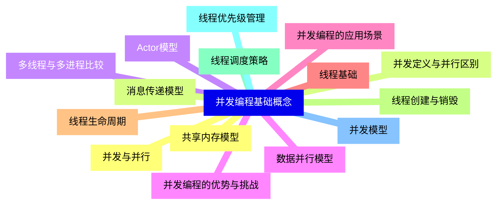

<--->
{}
{}
{}
{}
{}
{}
{}
{}
{}
{}
{}
{}
{}
{}
{}
{}
{}
{}
{}
{}
{}
{}
{}
{}
{}
{}
{}
{}
{}
{}
{}

### 2 C++标准线程库{#2}

{}
{}
{}
{}
{}
{}
{}
{}
{}
{}
{}
{}
{}
{}
{}
{}
{}
{}
{}
{}
{}
{}
{}
{}
{}
{}
{}
{}
{}
{}
{}
<--->
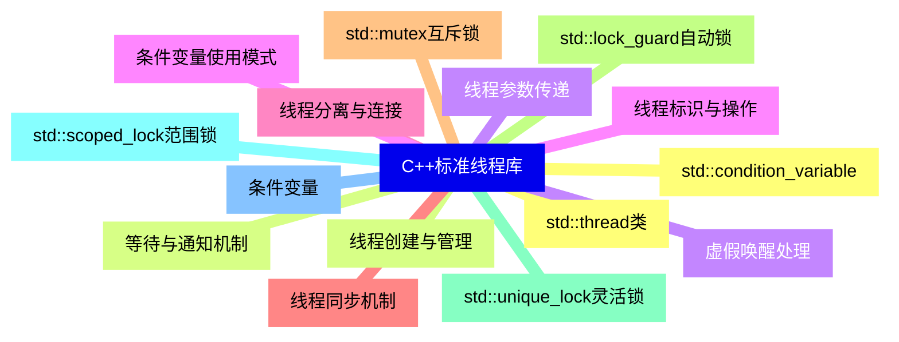

{}

### 3 原子操作与内存模型{#3}

{}
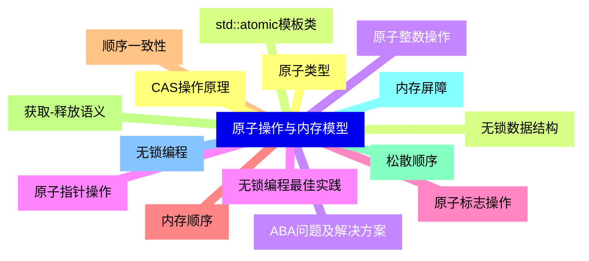

<--->
{}
{}
{}
{}
{}
{}
{}
{}
{}
{}
{}
{}
{}
{}
{}
{}
{}
{}
{}
{}
{}
{}
{}
{}
{}
{}
{}
{}
{}
{}
{}

### 4 高级同步原语{#4}

{}
{}
{}
{}
{}
{}
{}
{}
{}
{}
{}
{}
{}
{}
{}
{}
{}
{}
{}
{}
{}
{}
{}
{}
{}
{}
{}
{}
{}
{}
{}
<--->
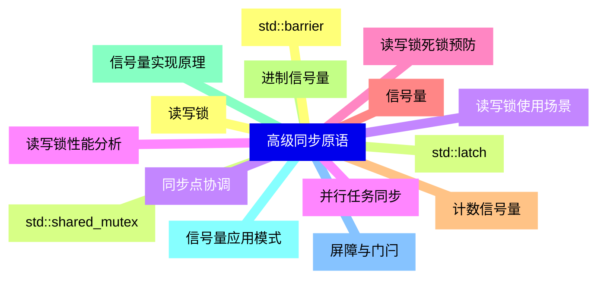

{}

### 5 异步编程{#5}

{}
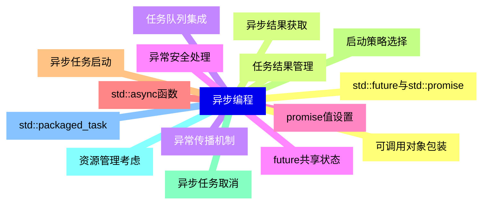

<--->
{}
{}
{}
{}
{}
{}
{}
{}
{}
{}
{}
{}
{}
{}
{}
{}
{}
{}
{}
{}
{}
{}
{}
{}
{}
{}
{}
{}
{}
{}
{}

### 6 并发数据结构{#6}

{}
{}
{}
{}
{}
{}
{}
{}
{}
{}
{}
{}
{}
{}
{}
{}
{}
{}
{}
{}
{}
{}
{}
{}
{}
{}
{}
{}
{}
{}
{}
<--->
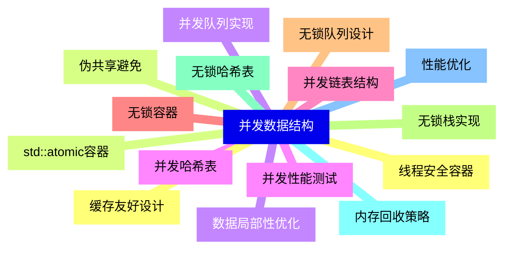

{}

### 7 并行算法{#7}

{}
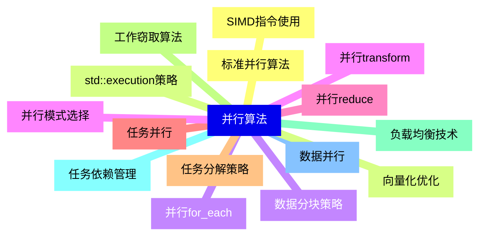

<--->
{}
{}
{}
{}
{}
{}
{}
{}
{}
{}
{}
{}
{}
{}
{}
{}
{}
{}
{}
{}
{}
{}
{}
{}
{}
{}
{}
{}
{}
{}
{}

### 8 并发设计模式{#8}

{}
{}
{}
{}
{}
{}
{}
{}
{}
{}
{}
{}
{}
{}
{}
{}
{}
{}
{}
{}
{}
{}
{}
{}
{}
{}
{}
{}
{}
{}
{}
<--->
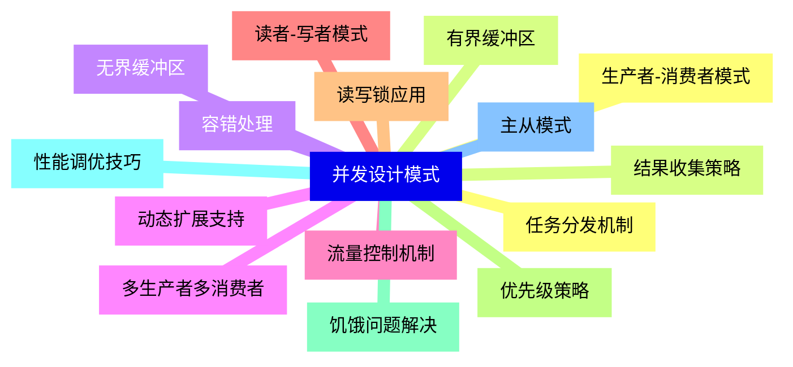

{}

### 9 并发调试与测试{#9}

{}
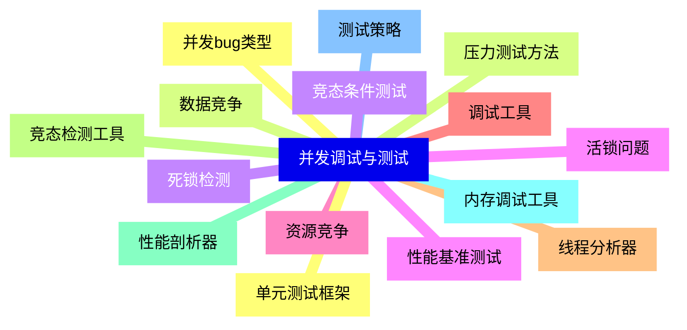

<--->
{}
{}
{}
{}
{}
{}
{}
{}
{}
{}
{}
{}
{}
{}
{}
{}
{}
{}
{}
{}
{}
{}
{}
{}
{}
{}
{}
{}
{}
{}
{}

### 10 性能优化与调优{#10}

{}
{}
{}
{}
{}
{}
{}
{}
{}
{}
{}
{}
{}
{}
{}
{}
{}
{}
{}
{}
{}
{}
{}
{}
{}
{}
{}
{}
{}
{}
{}
<--->
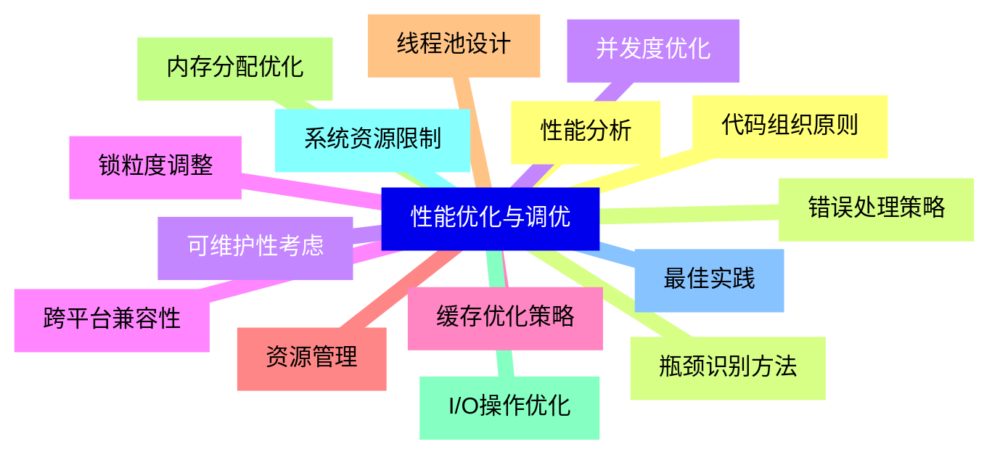

{}

### 11 现代C++并发特性{#11}

{}
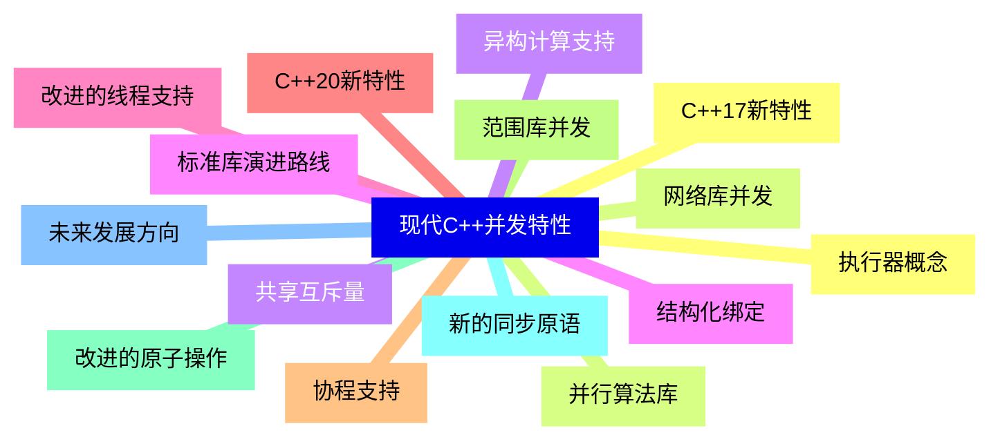

<--->
{}
{}
{}
{}
{}
{}
{}
{}
{}
{}
{}
{}
{}
{}
{}
{}
{}
{}
{}
{}
{}
{}
{}
{}
{}
{}
{}
{}
{}
{}
{}

### 12 实际应用案例{#12}

{}
{}
{}
{}
{}
{}
{}
{}
{}
{}
{}
{}
{}
{}
{}
{}
{}
{}
{}
{}
{}
{}
{}
{}
{}
{}
{}
{}
{}
{}
{}
<--->
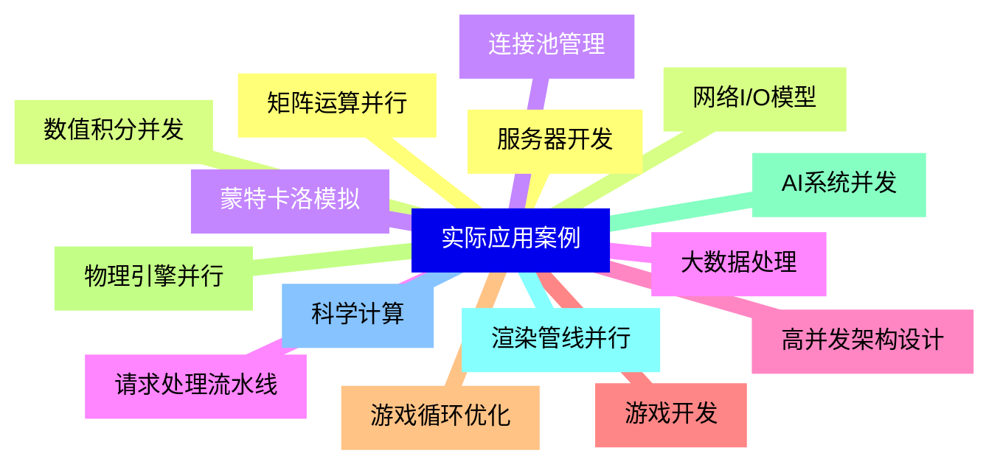

{}
