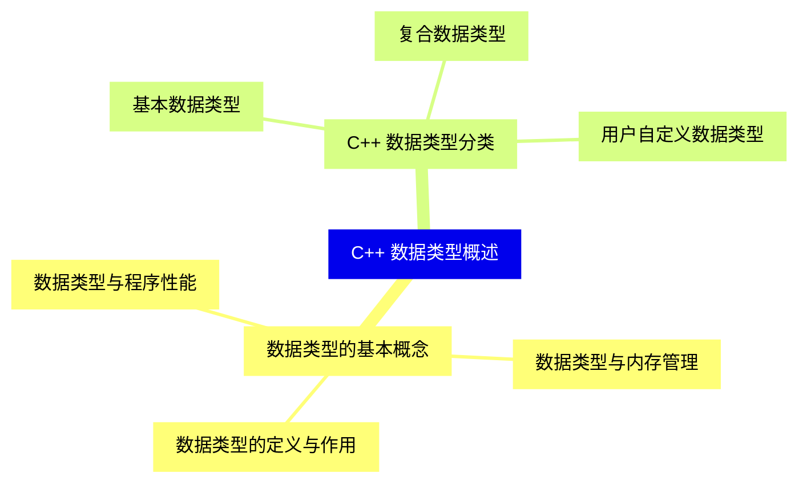
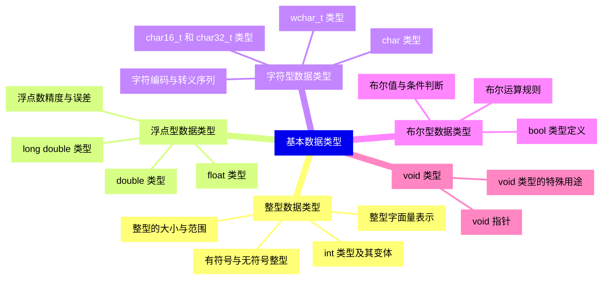
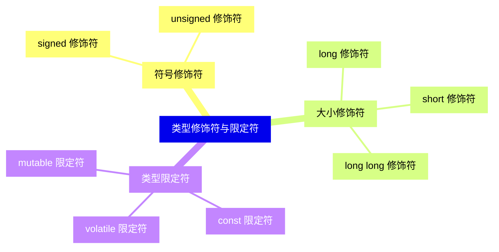
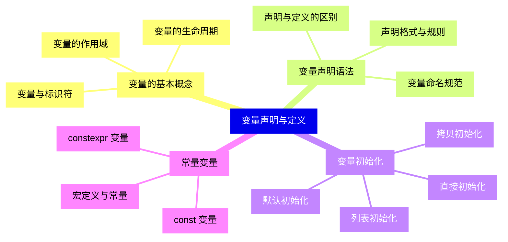
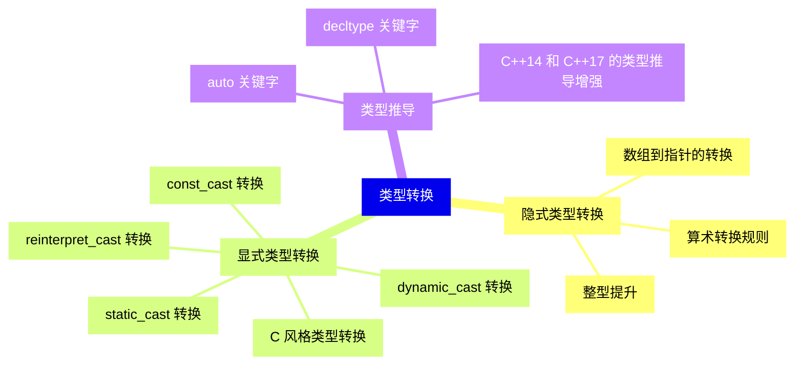
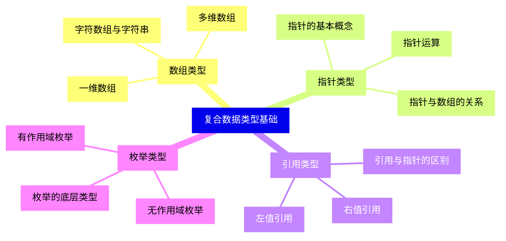
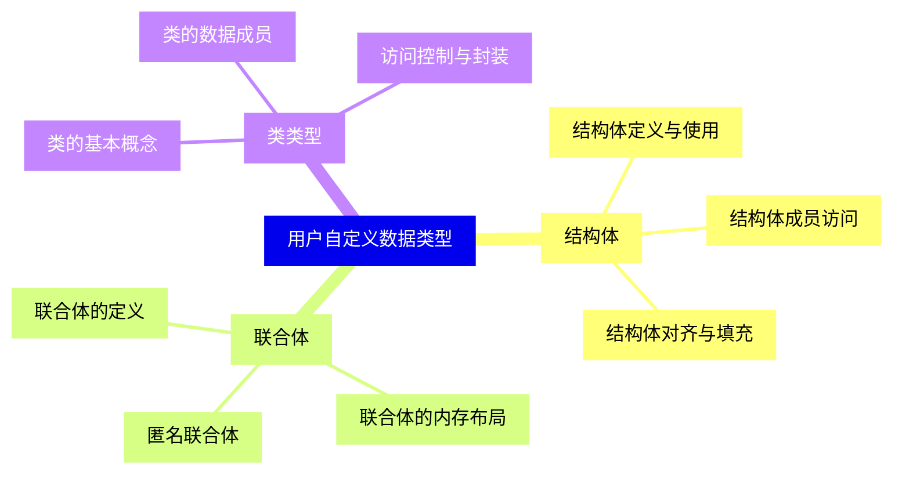
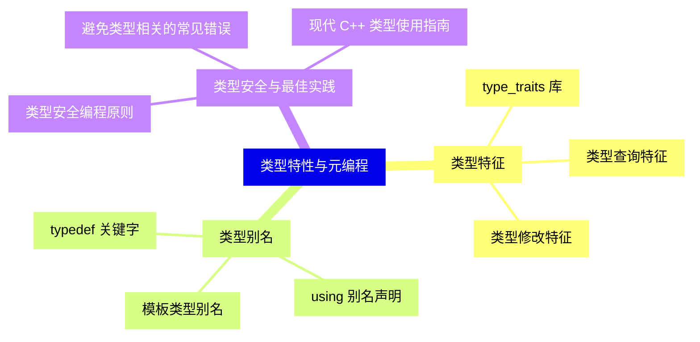
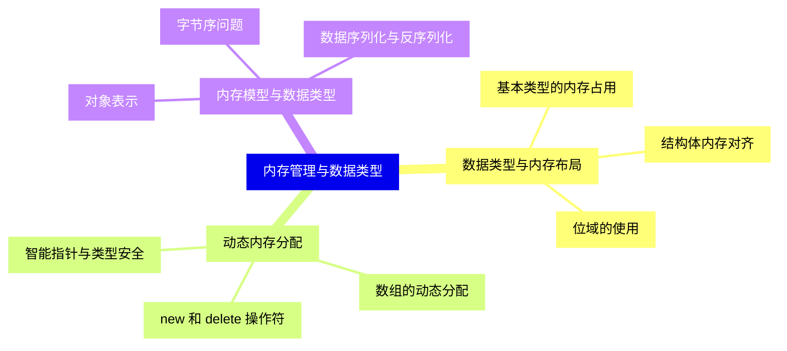
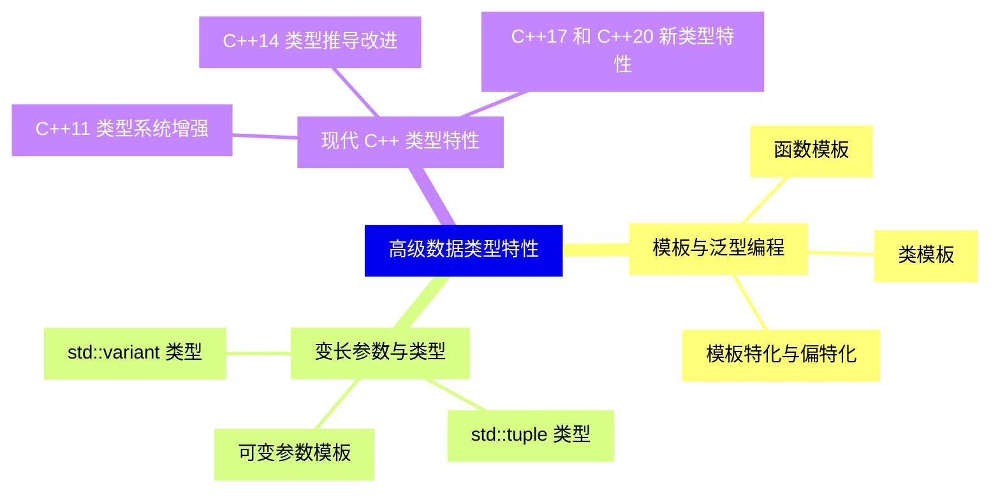


### 1 [C++ 数据类型概述](#1)
#### 1.1 [数据类型的基本概念](#1)
##### 1.1.1 [数据类型的定义与作用](#1)
##### 1.1.2 [数据类型与内存管理](#1)
##### 1.1.3 [数据类型与程序性能](#1)
#### 1.2 [C++ 数据类型分类](#1)
##### 1.2.1 [基本数据类型](#1)
##### 1.2.2 [复合数据类型](#1)
##### 1.2.3 [用户自定义数据类型](#1)
### 2 [基本数据类型](#2)
#### 2.1 [整型数据类型](#2)
##### 2.1.1 [int 类型及其变体](#2)
##### 2.1.2 [有符号与无符号整型](#2)
##### 2.1.3 [整型的大小与范围](#2)
##### 2.1.4 [整型字面量表示](#2)
#### 2.2 [浮点型数据类型](#2)
##### 2.2.1 [float 类型](#2)
##### 2.2.2 [double 类型](#2)
##### 2.2.3 [long double 类型](#2)
##### 2.2.4 [浮点数精度与误差](#2)
#### 2.3 [字符型数据类型](#2)
##### 2.3.1 [char 类型](#2)
##### 2.3.2 [wchar_t 类型](#2)
##### 2.3.3 [char16_t 和 char32_t 类型](#2)
##### 2.3.4 [字符编码与转义序列](#2)
#### 2.4 [布尔型数据类型](#2)
##### 2.4.1 [bool 类型定义](#2)
##### 2.4.2 [布尔值与条件判断](#2)
##### 2.4.3 [布尔运算规则](#2)
#### 2.5 [void 类型](#2)
##### 2.5.1 [void 类型的特殊用途](#2)
##### 2.5.2 [void 指针](#2)
### 3 [类型修饰符与限定符](#3)
#### 3.1 [符号修饰符](#3)
##### 3.1.1 [signed 修饰符](#3)
##### 3.1.2 [unsigned 修饰符](#3)
#### 3.2 [大小修饰符](#3)
##### 3.2.1 [short 修饰符](#3)
##### 3.2.2 [long 修饰符](#3)
##### 3.2.3 [long long 修饰符](#3)
#### 3.3 [类型限定符](#3)
##### 3.3.1 [const 限定符](#3)
##### 3.3.2 [volatile 限定符](#3)
##### 3.3.3 [mutable 限定符](#3)
### 4 [变量声明与定义](#4)
#### 4.1 [变量的基本概念](#4)
##### 4.1.1 [变量与标识符](#4)
##### 4.1.2 [变量的作用域](#4)
##### 4.1.3 [变量的生命周期](#4)
#### 4.2 [变量声明语法](#4)
##### 4.2.1 [声明格式与规则](#4)
##### 4.2.2 [变量命名规范](#4)
##### 4.2.3 [声明与定义的区别](#4)
#### 4.3 [变量初始化](#4)
##### 4.3.1 [默认初始化](#4)
##### 4.3.2 [直接初始化](#4)
##### 4.3.3 [拷贝初始化](#4)
##### 4.3.4 [列表初始化](#4)
#### 4.4 [常量变量](#4)
##### 4.4.1 [const 变量](#4)
##### 4.4.2 [constexpr 变量](#4)
##### 4.4.3 [宏定义与常量](#4)
### 5 [类型转换](#5)
#### 5.1 [隐式类型转换](#5)
##### 5.1.1 [算术转换规则](#5)
##### 5.1.2 [整型提升](#5)
##### 5.1.3 [数组到指针的转换](#5)
#### 5.2 [显式类型转换](#5)
##### 5.2.1 [C 风格类型转换](#5)
##### 5.2.2 [static_cast 转换](#5)
##### 5.2.3 [dynamic_cast 转换](#5)
##### 5.2.4 [const_cast 转换](#5)
##### 5.2.5 [reinterpret_cast 转换](#5)
#### 5.3 [类型推导](#5)
##### 5.3.1 [auto 关键字](#5)
##### 5.3.2 [decltype 关键字](#5)
##### 5.3.3 [C++14 和 C++17 的类型推导增强](#5)
### 6 [复合数据类型基础](#6)
#### 6.1 [数组类型](#6)
##### 6.1.1 [一维数组](#6)
##### 6.1.2 [多维数组](#6)
##### 6.1.3 [字符数组与字符串](#6)
#### 6.2 [指针类型](#6)
##### 6.2.1 [指针的基本概念](#6)
##### 6.2.2 [指针运算](#6)
##### 6.2.3 [指针与数组的关系](#6)
#### 6.3 [引用类型](#6)
##### 6.3.1 [左值引用](#6)
##### 6.3.2 [右值引用](#6)
##### 6.3.3 [引用与指针的区别](#6)
#### 6.4 [枚举类型](#6)
##### 6.4.1 [无作用域枚举](#6)
##### 6.4.2 [有作用域枚举](#6)
##### 6.4.3 [枚举的底层类型](#6)
### 7 [用户自定义数据类型](#7)
#### 7.1 [结构体](#7)
##### 7.1.1 [结构体定义与使用](#7)
##### 7.1.2 [结构体成员访问](#7)
##### 7.1.3 [结构体对齐与填充](#7)
#### 7.2 [联合体](#7)
##### 7.2.1 [联合体的定义](#7)
##### 7.2.2 [联合体的内存布局](#7)
##### 7.2.3 [匿名联合体](#7)
#### 7.3 [类类型](#7)
##### 7.3.1 [类的基本概念](#7)
##### 7.3.2 [类的数据成员](#7)
##### 7.3.3 [访问控制与封装](#7)
### 8 [类型特性与元编程](#8)
#### 8.1 [类型特征](#8)
##### 8.1.1 [type_traits 库](#8)
##### 8.1.2 [类型查询特征](#8)
##### 8.1.3 [类型修改特征](#8)
#### 8.2 [类型别名](#8)
##### 8.2.1 [typedef 关键字](#8)
##### 8.2.2 [using 别名声明](#8)
##### 8.2.3 [模板类型别名](#8)
#### 8.3 [类型安全与最佳实践](#8)
##### 8.3.1 [类型安全编程原则](#8)
##### 8.3.2 [避免类型相关的常见错误](#8)
##### 8.3.3 [现代 C++ 类型使用指南](#8)
### 9 [内存管理与数据类型](#9)
#### 9.1 [数据类型与内存布局](#9)
##### 9.1.1 [基本类型的内存占用](#9)
##### 9.1.2 [结构体内存对齐](#9)
##### 9.1.3 [位域的使用](#9)
#### 9.2 [动态内存分配](#9)
##### 9.2.1 [new 和 delete 操作符](#9)
##### 9.2.2 [数组的动态分配](#9)
##### 9.2.3 [智能指针与类型安全](#9)
#### 9.3 [内存模型与数据类型](#9)
##### 9.3.1 [对象表示](#9)
##### 9.3.2 [字节序问题](#9)
##### 9.3.3 [数据序列化与反序列化](#9)
### 10 [高级数据类型特性](#10)
#### 10.1 [模板与泛型编程](#10)
##### 10.1.1 [函数模板](#10)
##### 10.1.2 [类模板](#10)
##### 10.1.3 [模板特化与偏特化](#10)
#### 10.2 [变长参数与类型](#10)
##### 10.2.1 [可变参数模板](#10)
##### 10.2.2 [std::tuple 类型](#10)
##### 10.2.3 [std::variant 类型](#10)
#### 10.3 [现代 C++ 类型特性](#10)
##### 10.3.1 [C++11 类型系统增强](#10)
##### 10.3.2 [C++14 类型推导改进](#10)
##### 10.3.3 [C++17 和 C++20 新类型特性](#10)




### 1 C++ 数据类型概述

---
### 1 C++ 数据类型概述
___
#### 1.1 数据类型的基本概念
___
##### 1.1.1 数据类型的定义与作用
___
##### 1.1.2 数据类型与内存管理
___
##### 1.1.3 数据类型与程序性能
___
#### 1.2 C++ 数据类型分类
___
##### 1.2.1 基本数据类型
___
##### 1.2.2 复合数据类型
___
##### 1.2.3 用户自定义数据类型
### 2 基本数据类型

---
### 2 基本数据类型
___
#### 2.1 整型数据类型
___
##### 2.1.1 int 类型及其变体
___
##### 2.1.2 有符号与无符号整型
___
##### 2.1.3 整型的大小与范围
___
##### 2.1.4 整型字面量表示
___
#### 2.2 浮点型数据类型
___
##### 2.2.1 float 类型
___
##### 2.2.2 double 类型
___
##### 2.2.3 long double 类型
___
##### 2.2.4 浮点数精度与误差
___
#### 2.3 字符型数据类型
___
##### 2.3.1 char 类型
___
##### 2.3.2 wchar_t 类型
___
##### 2.3.3 char16_t 和 char32_t 类型
___
##### 2.3.4 字符编码与转义序列
___
#### 2.4 布尔型数据类型
___
##### 2.4.1 bool 类型定义
___
##### 2.4.2 布尔值与条件判断
___
##### 2.4.3 布尔运算规则
___
#### 2.5 void 类型
___
##### 2.5.1 void 类型的特殊用途
___
##### 2.5.2 void 指针
### 3 类型修饰符与限定符

---
### 3 类型修饰符与限定符
___
#### 3.1 符号修饰符
___
##### 3.1.1 signed 修饰符
___
##### 3.1.2 unsigned 修饰符
___
#### 3.2 大小修饰符
___
##### 3.2.1 short 修饰符
___
##### 3.2.2 long 修饰符
___
##### 3.2.3 long long 修饰符
___
#### 3.3 类型限定符
___
##### 3.3.1 const 限定符
___
##### 3.3.2 volatile 限定符
___
##### 3.3.3 mutable 限定符
### 4 变量声明与定义

---
### 4 变量声明与定义
___
#### 4.1 变量的基本概念
___
##### 4.1.1 变量与标识符
___
##### 4.1.2 变量的作用域
___
##### 4.1.3 变量的生命周期
___
#### 4.2 变量声明语法
___
##### 4.2.1 声明格式与规则
___
##### 4.2.2 变量命名规范
___
##### 4.2.3 声明与定义的区别
___
#### 4.3 变量初始化
___
##### 4.3.1 默认初始化
___
##### 4.3.2 直接初始化
___
##### 4.3.3 拷贝初始化
___
##### 4.3.4 列表初始化
___
#### 4.4 常量变量
___
##### 4.4.1 const 变量
___
##### 4.4.2 constexpr 变量
___
##### 4.4.3 宏定义与常量
### 5 类型转换

---
### 5 类型转换
___
#### 5.1 隐式类型转换
___
##### 5.1.1 算术转换规则
___
##### 5.1.2 整型提升
___
##### 5.1.3 数组到指针的转换
___
#### 5.2 显式类型转换
___
##### 5.2.1 C 风格类型转换
___
##### 5.2.2 static_cast 转换
___
##### 5.2.3 dynamic_cast 转换
___
##### 5.2.4 const_cast 转换
___
##### 5.2.5 reinterpret_cast 转换
___
#### 5.3 类型推导
___
##### 5.3.1 auto 关键字
___
##### 5.3.2 decltype 关键字
___
##### 5.3.3 C++14 和 C++17 的类型推导增强
### 6 复合数据类型基础

---
### 6 复合数据类型基础
___
#### 6.1 数组类型
___
##### 6.1.1 一维数组
___
##### 6.1.2 多维数组
___
##### 6.1.3 字符数组与字符串
___
#### 6.2 指针类型
___
##### 6.2.1 指针的基本概念
___
##### 6.2.2 指针运算
___
##### 6.2.3 指针与数组的关系
___
#### 6.3 引用类型
___
##### 6.3.1 左值引用
___
##### 6.3.2 右值引用
___
##### 6.3.3 引用与指针的区别
___
#### 6.4 枚举类型
___
##### 6.4.1 无作用域枚举
___
##### 6.4.2 有作用域枚举
___
##### 6.4.3 枚举的底层类型
### 7 用户自定义数据类型

---
### 7 用户自定义数据类型
___
#### 7.1 结构体
___
##### 7.1.1 结构体定义与使用
___
##### 7.1.2 结构体成员访问
___
##### 7.1.3 结构体对齐与填充
___
#### 7.2 联合体
___
##### 7.2.1 联合体的定义
___
##### 7.2.2 联合体的内存布局
___
##### 7.2.3 匿名联合体
___
#### 7.3 类类型
___
##### 7.3.1 类的基本概念
___
##### 7.3.2 类的数据成员
___
##### 7.3.3 访问控制与封装
### 8 类型特性与元编程

---
### 8 类型特性与元编程
___
#### 8.1 类型特征
___
##### 8.1.1 type_traits 库
___
##### 8.1.2 类型查询特征
___
##### 8.1.3 类型修改特征
___
#### 8.2 类型别名
___
##### 8.2.1 typedef 关键字
___
##### 8.2.2 using 别名声明
___
##### 8.2.3 模板类型别名
___
#### 8.3 类型安全与最佳实践
___
##### 8.3.1 类型安全编程原则
___
##### 8.3.2 避免类型相关的常见错误
___
##### 8.3.3 现代 C++ 类型使用指南
### 9 内存管理与数据类型

---
### 9 内存管理与数据类型
___
#### 9.1 数据类型与内存布局
___
##### 9.1.1 基本类型的内存占用
___
##### 9.1.2 结构体内存对齐
___
##### 9.1.3 位域的使用
___
#### 9.2 动态内存分配
___
##### 9.2.1 new 和 delete 操作符
___
##### 9.2.2 数组的动态分配
___
##### 9.2.3 智能指针与类型安全
___
#### 9.3 内存模型与数据类型
___
##### 9.3.1 对象表示
___
##### 9.3.2 字节序问题
___
##### 9.3.3 数据序列化与反序列化
### 10 高级数据类型特性

---
### 10 高级数据类型特性
___
#### 10.1 模板与泛型编程
___
##### 10.1.1 函数模板
___
##### 10.1.2 类模板
___
##### 10.1.3 模板特化与偏特化
___
#### 10.2 变长参数与类型
___
##### 10.2.1 可变参数模板
___
##### 10.2.2 std::tuple 类型
___
##### 10.2.3 std::variant 类型
___
#### 10.3 现代 C++ 类型特性
___
##### 10.3.1 C++11 类型系统增强
___
##### 10.3.2 C++14 类型推导改进
___
##### 10.3.3 C++17 和 C++20 新类型特性


### 1 C++ 数据类型概述{#1}

{}

<--->
{}
{}
{}
{}
{}
{}
{}
{}
{}
{}
{}
{}
{}
{}
{}
{}
{}

### 2 基本数据类型{#2}

{}
{}
{}
{}
{}
{}
{}
{}
{}
{}
{}
{}
{}
{}
{}
{}
{}
{}
{}
{}
{}
{}
{}
{}
{}
{}
{}
{}
{}
{}
{}
{}
{}
{}
{}
{}
{}
{}
{}
{}
{}
{}
{}
{}
{}
<--->

{}

### 3 类型修饰符与限定符{#3}

{}

<--->
{}
{}
{}
{}
{}
{}
{}
{}
{}
{}
{}
{}
{}
{}
{}
{}
{}
{}
{}
{}
{}
{}
{}

### 4 变量声明与定义{#4}

{}
{}
{}
{}
{}
{}
{}
{}
{}
{}
{}
{}
{}
{}
{}
{}
{}
{}
{}
{}
{}
{}
{}
{}
{}
{}
{}
{}
{}
{}
{}
{}
{}
{}
{}
<--->

{}

### 5 类型转换{#5}

{}

<--->
{}
{}
{}
{}
{}
{}
{}
{}
{}
{}
{}
{}
{}
{}
{}
{}
{}
{}
{}
{}
{}
{}
{}
{}
{}
{}
{}
{}
{}

### 6 复合数据类型基础{#6}

{}
{}
{}
{}
{}
{}
{}
{}
{}
{}
{}
{}
{}
{}
{}
{}
{}
{}
{}
{}
{}
{}
{}
{}
{}
{}
{}
{}
{}
{}
{}
{}
{}
<--->

{}

### 7 用户自定义数据类型{#7}

{}

<--->
{}
{}
{}
{}
{}
{}
{}
{}
{}
{}
{}
{}
{}
{}
{}
{}
{}
{}
{}
{}
{}
{}
{}
{}
{}

### 8 类型特性与元编程{#8}

{}
{}
{}
{}
{}
{}
{}
{}
{}
{}
{}
{}
{}
{}
{}
{}
{}
{}
{}
{}
{}
{}
{}
{}
{}
<--->

{}

### 9 内存管理与数据类型{#9}

{}

<--->
{}
{}
{}
{}
{}
{}
{}
{}
{}
{}
{}
{}
{}
{}
{}
{}
{}
{}
{}
{}
{}
{}
{}
{}
{}

### 10 高级数据类型特性{#10}

{}
{}
{}
{}
{}
{}
{}
{}
{}
{}
{}
{}
{}
{}
{}
{}
{}
{}
{}
{}
{}
{}
{}
{}
{}
<--->

{}
