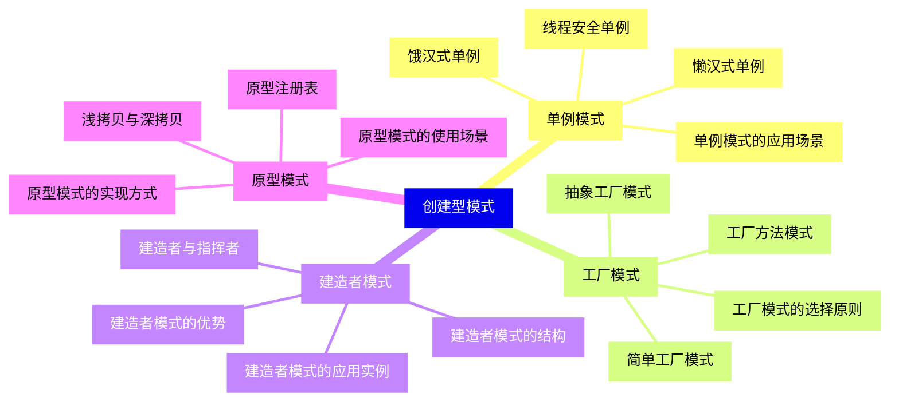
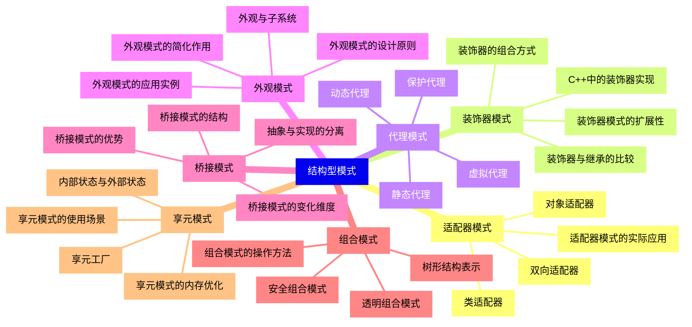
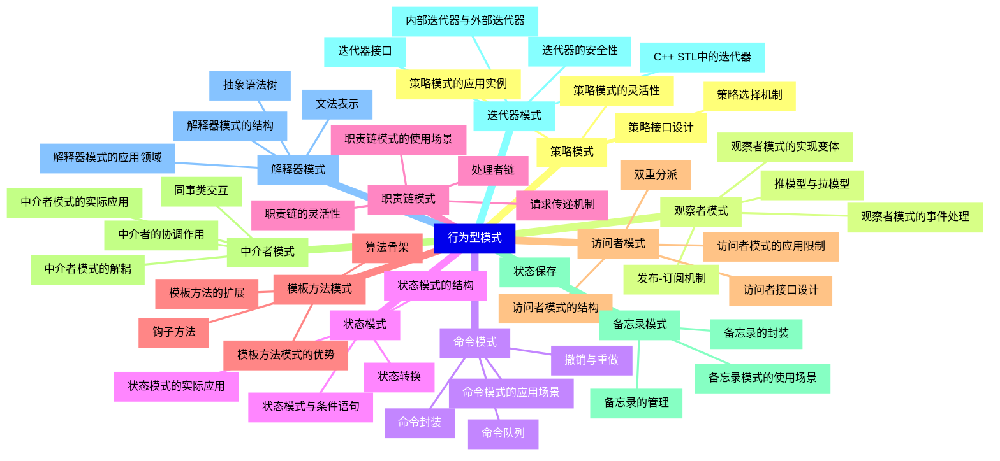
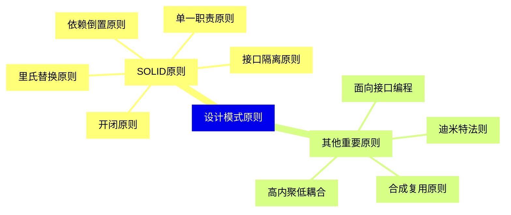
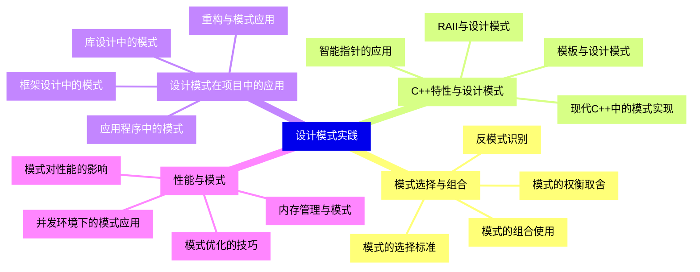


### 1 [创建型模式](#1)
#### 1.1 [单例模式](#1)
##### 1.1.1 [饿汉式单例](#1)
##### 1.1.2 [懒汉式单例](#1)
##### 1.1.3 [线程安全单例](#1)
##### 1.1.4 [单例模式的应用场景](#1)
#### 1.2 [工厂模式](#1)
##### 1.2.1 [简单工厂模式](#1)
##### 1.2.2 [工厂方法模式](#1)
##### 1.2.3 [抽象工厂模式](#1)
##### 1.2.4 [工厂模式的选择原则](#1)
#### 1.3 [建造者模式](#1)
##### 1.3.1 [建造者模式的结构](#1)
##### 1.3.2 [建造者与指挥者](#1)
##### 1.3.3 [建造者模式的优势](#1)
##### 1.3.4 [建造者模式的应用实例](#1)
#### 1.4 [原型模式](#1)
##### 1.4.1 [浅拷贝与深拷贝](#1)
##### 1.4.2 [原型模式的实现方式](#1)
##### 1.4.3 [原型注册表](#1)
##### 1.4.4 [原型模式的使用场景](#1)
### 2 [结构型模式](#2)
#### 2.1 [适配器模式](#2)
##### 2.1.1 [类适配器](#2)
##### 2.1.2 [对象适配器](#2)
##### 2.1.3 [双向适配器](#2)
##### 2.1.4 [适配器模式的实际应用](#2)
#### 2.2 [装饰器模式](#2)
##### 2.2.1 [装饰器的组合方式](#2)
##### 2.2.2 [装饰器与继承的比较](#2)
##### 2.2.3 [装饰器模式的扩展性](#2)
##### 2.2.4 [C++中的装饰器实现](#2)
#### 2.3 [代理模式](#2)
##### 2.3.1 [静态代理](#2)
##### 2.3.2 [动态代理](#2)
##### 2.3.3 [虚拟代理](#2)
##### 2.3.4 [保护代理](#2)
#### 2.4 [外观模式](#2)
##### 2.4.1 [外观模式的简化作用](#2)
##### 2.4.2 [外观与子系统](#2)
##### 2.4.3 [外观模式的设计原则](#2)
##### 2.4.4 [外观模式的应用实例](#2)
#### 2.5 [桥接模式](#2)
##### 2.5.1 [抽象与实现的分离](#2)
##### 2.5.2 [桥接模式的结构](#2)
##### 2.5.3 [桥接模式的变化维度](#2)
##### 2.5.4 [桥接模式的优势](#2)
#### 2.6 [组合模式](#2)
##### 2.6.1 [树形结构表示](#2)
##### 2.6.2 [透明组合模式](#2)
##### 2.6.3 [安全组合模式](#2)
##### 2.6.4 [组合模式的操作方法](#2)
#### 2.7 [享元模式](#2)
##### 2.7.1 [内部状态与外部状态](#2)
##### 2.7.2 [享元工厂](#2)
##### 2.7.3 [享元模式的内存优化](#2)
##### 2.7.4 [享元模式的使用场景](#2)
### 3 [行为型模式](#3)
#### 3.1 [策略模式](#3)
##### 3.1.1 [策略接口设计](#3)
##### 3.1.2 [策略选择机制](#3)
##### 3.1.3 [策略模式的灵活性](#3)
##### 3.1.4 [策略模式的应用实例](#3)
#### 3.2 [观察者模式](#3)
##### 3.2.1 [发布-订阅机制](#3)
##### 3.2.2 [推模型与拉模型](#3)
##### 3.2.3 [观察者模式的事件处理](#3)
##### 3.2.4 [观察者模式的实现变体](#3)
#### 3.3 [命令模式](#3)
##### 3.3.1 [命令封装](#3)
##### 3.3.2 [命令队列](#3)
##### 3.3.3 [撤销与重做](#3)
##### 3.3.4 [命令模式的应用场景](#3)
#### 3.4 [状态模式](#3)
##### 3.4.1 [状态转换](#3)
##### 3.4.2 [状态模式的结构](#3)
##### 3.4.3 [状态模式与条件语句](#3)
##### 3.4.4 [状态模式的实际应用](#3)
#### 3.5 [职责链模式](#3)
##### 3.5.1 [处理者链](#3)
##### 3.5.2 [请求传递机制](#3)
##### 3.5.3 [职责链的灵活性](#3)
##### 3.5.4 [职责链模式的使用场景](#3)
#### 3.6 [模板方法模式](#3)
##### 3.6.1 [算法骨架](#3)
##### 3.6.2 [钩子方法](#3)
##### 3.6.3 [模板方法的扩展](#3)
##### 3.6.4 [模板方法模式的优势](#3)
#### 3.7 [访问者模式](#3)
##### 3.7.1 [双重分派](#3)
##### 3.7.2 [访问者接口设计](#3)
##### 3.7.3 [访问者模式的结构](#3)
##### 3.7.4 [访问者模式的应用限制](#3)
#### 3.8 [中介者模式](#3)
##### 3.8.1 [中介者的协调作用](#3)
##### 3.8.2 [同事类交互](#3)
##### 3.8.3 [中介者模式的解耦](#3)
##### 3.8.4 [中介者模式的实际应用](#3)
#### 3.9 [备忘录模式](#3)
##### 3.9.1 [状态保存](#3)
##### 3.9.2 [备忘录的管理](#3)
##### 3.9.3 [备忘录的封装](#3)
##### 3.9.4 [备忘录模式的使用场景](#3)
#### 3.10 [迭代器模式](#3)
##### 3.10.1 [迭代器接口](#3)
##### 3.10.2 [内部迭代器与外部迭代器](#3)
##### 3.10.3 [迭代器的安全性](#3)
##### 3.10.4 [C++ STL中的迭代器](#3)
#### 3.11 [解释器模式](#3)
##### 3.11.1 [文法表示](#3)
##### 3.11.2 [抽象语法树](#3)
##### 3.11.3 [解释器模式的结构](#3)
##### 3.11.4 [解释器模式的应用领域](#3)
### 4 [设计模式原则](#4)
#### 4.1 [SOLID原则](#4)
##### 4.1.1 [单一职责原则](#4)
##### 4.1.2 [开闭原则](#4)
##### 4.1.3 [里氏替换原则](#4)
##### 4.1.4 [接口隔离原则](#4)
##### 4.1.5 [依赖倒置原则](#4)
#### 4.2 [其他重要原则](#4)
##### 4.2.1 [迪米特法则](#4)
##### 4.2.2 [合成复用原则](#4)
##### 4.2.3 [面向接口编程](#4)
##### 4.2.4 [高内聚低耦合](#4)
### 5 [设计模式实践](#5)
#### 5.1 [模式选择与组合](#5)
##### 5.1.1 [模式的选择标准](#5)
##### 5.1.2 [模式的组合使用](#5)
##### 5.1.3 [模式的权衡取舍](#5)
##### 5.1.4 [反模式识别](#5)
#### 5.2 [C++特性与设计模式](#5)
##### 5.2.1 [模板与设计模式](#5)
##### 5.2.2 [智能指针的应用](#5)
##### 5.2.3 [RAII与设计模式](#5)
##### 5.2.4 [现代C++中的模式实现](#5)
#### 5.3 [设计模式在项目中的应用](#5)
##### 5.3.1 [框架设计中的模式](#5)
##### 5.3.2 [库设计中的模式](#5)
##### 5.3.3 [应用程序中的模式](#5)
##### 5.3.4 [重构与模式应用](#5)
#### 5.4 [性能与模式](#5)
##### 5.4.1 [模式对性能的影响](#5)
##### 5.4.2 [模式优化的技巧](#5)
##### 5.4.3 [内存管理与模式](#5)
##### 5.4.4 [并发环境下的模式应用](#5)




### 1 创建型模式

---
### 1 创建型模式
___
#### 1.1 单例模式
___
##### 1.1.1 饿汉式单例
___
##### 1.1.2 懒汉式单例
___
##### 1.1.3 线程安全单例
___
##### 1.1.4 单例模式的应用场景
___
#### 1.2 工厂模式
___
##### 1.2.1 简单工厂模式
___
##### 1.2.2 工厂方法模式
___
##### 1.2.3 抽象工厂模式
___
##### 1.2.4 工厂模式的选择原则
___
#### 1.3 建造者模式
___
##### 1.3.1 建造者模式的结构
___
##### 1.3.2 建造者与指挥者
___
##### 1.3.3 建造者模式的优势
___
##### 1.3.4 建造者模式的应用实例
___
#### 1.4 原型模式
___
##### 1.4.1 浅拷贝与深拷贝
___
##### 1.4.2 原型模式的实现方式
___
##### 1.4.3 原型注册表
___
##### 1.4.4 原型模式的使用场景
### 2 结构型模式

---
### 2 结构型模式
___
#### 2.1 适配器模式
___
##### 2.1.1 类适配器
___
##### 2.1.2 对象适配器
___
##### 2.1.3 双向适配器
___
##### 2.1.4 适配器模式的实际应用
___
#### 2.2 装饰器模式
___
##### 2.2.1 装饰器的组合方式
___
##### 2.2.2 装饰器与继承的比较
___
##### 2.2.3 装饰器模式的扩展性
___
##### 2.2.4 C++中的装饰器实现
___
#### 2.3 代理模式
___
##### 2.3.1 静态代理
___
##### 2.3.2 动态代理
___
##### 2.3.3 虚拟代理
___
##### 2.3.4 保护代理
___
#### 2.4 外观模式
___
##### 2.4.1 外观模式的简化作用
___
##### 2.4.2 外观与子系统
___
##### 2.4.3 外观模式的设计原则
___
##### 2.4.4 外观模式的应用实例
___
#### 2.5 桥接模式
___
##### 2.5.1 抽象与实现的分离
___
##### 2.5.2 桥接模式的结构
___
##### 2.5.3 桥接模式的变化维度
___
##### 2.5.4 桥接模式的优势
___
#### 2.6 组合模式
___
##### 2.6.1 树形结构表示
___
##### 2.6.2 透明组合模式
___
##### 2.6.3 安全组合模式
___
##### 2.6.4 组合模式的操作方法
___
#### 2.7 享元模式
___
##### 2.7.1 内部状态与外部状态
___
##### 2.7.2 享元工厂
___
##### 2.7.3 享元模式的内存优化
___
##### 2.7.4 享元模式的使用场景
### 3 行为型模式

---
### 3 行为型模式
___
#### 3.1 策略模式
___
##### 3.1.1 策略接口设计
___
##### 3.1.2 策略选择机制
___
##### 3.1.3 策略模式的灵活性
___
##### 3.1.4 策略模式的应用实例
___
#### 3.2 观察者模式
___
##### 3.2.1 发布-订阅机制
___
##### 3.2.2 推模型与拉模型
___
##### 3.2.3 观察者模式的事件处理
___
##### 3.2.4 观察者模式的实现变体
___
#### 3.3 命令模式
___
##### 3.3.1 命令封装
___
##### 3.3.2 命令队列
___
##### 3.3.3 撤销与重做
___
##### 3.3.4 命令模式的应用场景
___
#### 3.4 状态模式
___
##### 3.4.1 状态转换
___
##### 3.4.2 状态模式的结构
___
##### 3.4.3 状态模式与条件语句
___
##### 3.4.4 状态模式的实际应用
___
#### 3.5 职责链模式
___
##### 3.5.1 处理者链
___
##### 3.5.2 请求传递机制
___
##### 3.5.3 职责链的灵活性
___
##### 3.5.4 职责链模式的使用场景
___
#### 3.6 模板方法模式
___
##### 3.6.1 算法骨架
___
##### 3.6.2 钩子方法
___
##### 3.6.3 模板方法的扩展
___
##### 3.6.4 模板方法模式的优势
___
#### 3.7 访问者模式
___
##### 3.7.1 双重分派
___
##### 3.7.2 访问者接口设计
___
##### 3.7.3 访问者模式的结构
___
##### 3.7.4 访问者模式的应用限制
___
#### 3.8 中介者模式
___
##### 3.8.1 中介者的协调作用
___
##### 3.8.2 同事类交互
___
##### 3.8.3 中介者模式的解耦
___
##### 3.8.4 中介者模式的实际应用
___
#### 3.9 备忘录模式
___
##### 3.9.1 状态保存
___
##### 3.9.2 备忘录的管理
___
##### 3.9.3 备忘录的封装
___
##### 3.9.4 备忘录模式的使用场景
___
#### 3.10 迭代器模式
___
##### 3.10.1 迭代器接口
___
##### 3.10.2 内部迭代器与外部迭代器
___
##### 3.10.3 迭代器的安全性
___
##### 3.10.4 C++ STL中的迭代器
___
#### 3.11 解释器模式
___
##### 3.11.1 文法表示
___
##### 3.11.2 抽象语法树
___
##### 3.11.3 解释器模式的结构
___
##### 3.11.4 解释器模式的应用领域
### 4 设计模式原则

---
### 4 设计模式原则
___
#### 4.1 SOLID原则
___
##### 4.1.1 单一职责原则
___
##### 4.1.2 开闭原则
___
##### 4.1.3 里氏替换原则
___
##### 4.1.4 接口隔离原则
___
##### 4.1.5 依赖倒置原则
___
#### 4.2 其他重要原则
___
##### 4.2.1 迪米特法则
___
##### 4.2.2 合成复用原则
___
##### 4.2.3 面向接口编程
___
##### 4.2.4 高内聚低耦合
### 5 设计模式实践

---
### 5 设计模式实践
___
#### 5.1 模式选择与组合
___
##### 5.1.1 模式的选择标准
___
##### 5.1.2 模式的组合使用
___
##### 5.1.3 模式的权衡取舍
___
##### 5.1.4 反模式识别
___
#### 5.2 C++特性与设计模式
___
##### 5.2.1 模板与设计模式
___
##### 5.2.2 智能指针的应用
___
##### 5.2.3 RAII与设计模式
___
##### 5.2.4 现代C++中的模式实现
___
#### 5.3 设计模式在项目中的应用
___
##### 5.3.1 框架设计中的模式
___
##### 5.3.2 库设计中的模式
___
##### 5.3.3 应用程序中的模式
___
##### 5.3.4 重构与模式应用
___
#### 5.4 性能与模式
___
##### 5.4.1 模式对性能的影响
___
##### 5.4.2 模式优化的技巧
___
##### 5.4.3 内存管理与模式
___
##### 5.4.4 并发环境下的模式应用


### 1 创建型模式{#1}

{}

<--->
{}
{}
{}
{}
{}
{}
{}
{}
{}
{}
{}
{}
{}
{}
{}
{}
{}
{}
{}
{}
{}
{}
{}
{}
{}
{}
{}
{}
{}
{}
{}
{}
{}
{}
{}
{}
{}
{}
{}
{}
{}

### 2 结构型模式{#2}

{}
{}
{}
{}
{}
{}
{}
{}
{}
{}
{}
{}
{}
{}
{}
{}
{}
{}
{}
{}
{}
{}
{}
{}
{}
{}
{}
{}
{}
{}
{}
{}
{}
{}
{}
{}
{}
{}
{}
{}
{}
{}
{}
{}
{}
{}
{}
{}
{}
{}
{}
{}
{}
{}
{}
{}
{}
{}
{}
{}
{}
{}
{}
{}
{}
{}
{}
{}
{}
{}
{}
<--->

{}

### 3 行为型模式{#3}

{}

<--->
{}
{}
{}
{}
{}
{}
{}
{}
{}
{}
{}
{}
{}
{}
{}
{}
{}
{}
{}
{}
{}
{}
{}
{}
{}
{}
{}
{}
{}
{}
{}
{}
{}
{}
{}
{}
{}
{}
{}
{}
{}
{}
{}
{}
{}
{}
{}
{}
{}
{}
{}
{}
{}
{}
{}
{}
{}
{}
{}
{}
{}
{}
{}
{}
{}
{}
{}
{}
{}
{}
{}
{}
{}
{}
{}
{}
{}
{}
{}
{}
{}
{}
{}
{}
{}
{}
{}
{}
{}
{}
{}
{}
{}
{}
{}
{}
{}
{}
{}
{}
{}
{}
{}
{}
{}
{}
{}
{}
{}
{}
{}

### 4 设计模式原则{#4}

{}
{}
{}
{}
{}
{}
{}
{}
{}
{}
{}
{}
{}
{}
{}
{}
{}
{}
{}
{}
{}
{}
{}
<--->

{}

### 5 设计模式实践{#5}

{}

<--->
{}
{}
{}
{}
{}
{}
{}
{}
{}
{}
{}
{}
{}
{}
{}
{}
{}
{}
{}
{}
{}
{}
{}
{}
{}
{}
{}
{}
{}
{}
{}
{}
{}
{}
{}
{}
{}
{}
{}
{}
{}
