
### 1 [性能分析与测量](#1)
#### 1.1 [性能分析工具](#1)
#### 1.2 [代码剖析器 Profiler 的使用](#1)
#### 1.3 [性能计数器的应用](#1)
#### 1.4 [内存泄漏检测工具](#1)
#### 1.5 [缓存分析工具](#1)
#### 1.6 [多线程性能分析](#1)
#### 1.7 [基准测试](#1)
#### 1.8 [微基准测试框架](#1)
#### 1.9 [宏基准测试方法](#1)
#### 1.10 [测试数据集的构建](#1)
#### 1.11 [统计显著性分析](#1)
#### 1.12 [性能回归测试](#1)
### 2 [编译器优化技术](#2)
#### 2.1 [编译器优化选项](#2)
#### 2.2 [O1/O2/O3优化级别](#2)
#### 2.3 [链接时优化 LTO](#2)
#### 2.4 [特定架构优化](#2)
#### 2.5 [内联函数优化](#2)
#### 2.6 [循环优化选项](#2)
#### 2.7 [编译器内置优化](#2)
#### 2.8 [自动向量化](#2)
#### 2.9 [常量传播](#2)
#### 2.10 [死代码消除](#2)
#### 2.11 [公共子表达式消除](#2)
#### 2.12 [函数内联优化](#2)
### 3 [内存管理优化](#3)
#### 3.1 [内存分配策略](#3)
#### 3.2 [栈分配与堆分配](#3)
#### 3.3 [内存池技术](#3)
#### 3.4 [对象池模式](#3)
#### 3.5 [自定义分配器](#3)
#### 3.6 [内存对齐优化](#3)
#### 3.7 [缓存友好编程](#3)
#### 3.8 [缓存层次结构理解](#3)
#### 3.9 [数据局部性原理](#3)
#### 3.10 [预取技术应用](#3)
#### 3.11 [缓存行对齐](#3)
#### 3.12 [减少缓存失效](#3)
### 4 [数据结构优化](#4)
#### 4.1 [容器选择与使用](#4)
#### 4.2 [std::vector优化技巧](#4)
#### 4.3 [std::list适用场景](#4)
#### 4.4 [std::map与std::unordered_map比较](#4)
#### 4.5 [自定义数据结构设计](#4)
#### 4.6 [内存布局优化](#4)
#### 4.7 [算法复杂度优化](#4)
#### 4.8 [时间复杂度分析](#4)
#### 4.9 [空间复杂度优化](#4)
#### 4.10 [分治算法应用](#4)
#### 4.11 [动态规划优化](#4)
#### 4.12 [贪心算法选择](#4)
### 5 [多线程与并发优化](#5)
#### 5.1 [线程管理优化](#5)
#### 5.2 [线程池设计模式](#5)
#### 5.3 [任务调度策略](#5)
#### 5.4 [负载均衡技术](#5)
#### 5.5 [线程同步优化](#5)
#### 5.6 [无锁编程技术](#5)
#### 5.7 [并发数据结构](#5)
#### 5.8 [原子操作应用](#5)
#### 5.9 [无锁队列实现](#5)
#### 5.10 [读写锁优化](#5)
#### 5.11 [条件变量使用](#5)
#### 5.12 [内存屏障理解](#5)
### 6 [I/O 操作优化](#6)
#### 6.1 [文件I/O优化](#6)
#### 6.2 [缓冲技术应用](#6)
#### 6.3 [异步I/O操作](#6)
#### 6.4 [内存映射文件](#6)
#### 6.5 [批量读写优化](#6)
#### 6.6 [文件系统选择](#6)
#### 6.7 [网络I/O优化](#6)
#### 6.8 [非阻塞I/O模型](#6)
#### 6.9 [零拷贝技术](#6)
#### 6.10 [连接池管理](#6)
#### 6.11 [协议优化选择](#6)
#### 6.12 [数据压缩传输](#6)
### 7 [数值计算优化](#7)
#### 7.1 [浮点运算优化](#7)
#### 7.2 [SIMD指令应用](#7)
#### 7.3 [精度控制策略](#7)
#### 7.4 [数值稳定性分析](#7)
#### 7.5 [并行计算优化](#7)
#### 7.6 [数学库选择](#7)
#### 7.7 [矩阵与向量运算](#7)
#### 7.8 [矩阵乘法优化](#7)
#### 7.9 [向量化计算](#7)
#### 7.10 [内存访问模式](#7)
#### 7.11 [算法重排序](#7)
#### 7.12 [并行化策略](#7)
### 8 [模板与元编程优化](#8)
#### 8.1 [编译时计算](#8)
#### 8.2 [模板元编程技术](#8)
#### 8.3 [constexpr应用](#8)
#### 8.4 [类型推导优化](#8)
#### 8.5 [编译期分支选择](#8)
#### 8.6 [代码生成优化](#8)
#### 8.7 [泛型编程优化](#8)
#### 8.8 [概念约束应用](#8)
#### 8.9 [变参模板优化](#8)
#### 8.10 [SFINAE技术](#8)
#### 8.11 [完美转发实现](#8)
#### 8.12 [移动语义优化](#8)
### 9 [字符串处理优化](#9)
#### 9.1 [字符串操作](#9)
#### 9.2 [小字符串优化](#9)
#### 9.3 [字符串视图应用](#9)
#### 9.4 [正则表达式优化](#9)
#### 9.5 [字符串拼接策略](#9)
#### 9.6 [编码转换优化](#9)
#### 9.7 [文本处理](#9)
#### 9.8 [解析器优化](#9)
#### 9.9 [词法分析加速](#9)
#### 9.10 [语法分析改进](#9)
#### 9.11 [模式匹配算法](#9)
#### 9.12 [文本搜索优化](#9)
### 10 [系统级优化](#10)
#### 10.1 [操作系统特性](#10)
#### 10.2 [系统调用优化](#10)
#### 10.3 [进程间通信](#10)
#### 10.4 [内存管理单元](#10)
#### 10.5 [中断处理优化](#10)
#### 10.6 [调度器调优](#10)
#### 10.7 [硬件特性利用](#10)
#### 10.8 [CPU缓存优化](#10)
#### 10.9 [分支预测优化](#10)
#### 10.10 [流水线技术](#10)
#### 10.11 [超线程技术](#10)
#### 10.12 [特定指令集优化](#10)
### 11 [代码重构与优化](#11)
#### 11.1 [代码结构优化](#11)
#### 11.2 [函数拆分与合并](#11)
#### 11.3 [循环优化技术](#11)
#### 11.4 [条件判断优化](#11)
#### 11.5 [异常处理优化](#11)
#### 11.6 [代码内联策略](#11)
#### 11.7 [设计模式应用](#11)
#### 11.8 [享元模式优化](#11)
#### 11.9 [工厂模式改进](#11)
#### 11.10 [观察者模式优化](#11)
#### 11.11 [策略模式应用](#11)
#### 11.12 [装饰器模式优化](#11)
### 12 [性能监控与调优](#12)
#### 12.1 [实时性能监控](#12)
#### 12.2 [性能计数器监控](#12)
#### 12.3 [资源使用分析](#12)
#### 12.4 [瓶颈识别技术](#12)
#### 12.5 [性能趋势分析](#12)
#### 12.6 [自动化监控系统](#12)
#### 12.7 [持续优化策略](#12)
#### 12.8 [性能回归预防](#12)
#### 12.9 [代码审查流程](#12)
#### 12.10 [性能测试自动化](#12)
#### 12.11 [优化优先级确定](#12)
#### 12.12 [性能目标设定](#12)




### 1 性能分析与测量

---
### 1 性能分析与测量
___
#### 1.1 性能分析工具
___
#### 1.2 代码剖析器 Profiler 的使用
___
#### 1.3 性能计数器的应用
___
#### 1.4 内存泄漏检测工具
___
#### 1.5 缓存分析工具
___
#### 1.6 多线程性能分析
___
#### 1.7 基准测试
___
#### 1.8 微基准测试框架
___
#### 1.9 宏基准测试方法
___
#### 1.10 测试数据集的构建
___
#### 1.11 统计显著性分析
___
#### 1.12 性能回归测试
### 2 编译器优化技术

---
### 2 编译器优化技术
___
#### 2.1 编译器优化选项
___
#### 2.2 O1/O2/O3优化级别
___
#### 2.3 链接时优化 LTO
___
#### 2.4 特定架构优化
___
#### 2.5 内联函数优化
___
#### 2.6 循环优化选项
___
#### 2.7 编译器内置优化
___
#### 2.8 自动向量化
___
#### 2.9 常量传播
___
#### 2.10 死代码消除
___
#### 2.11 公共子表达式消除
___
#### 2.12 函数内联优化
### 3 内存管理优化

---
### 3 内存管理优化
___
#### 3.1 内存分配策略
___
#### 3.2 栈分配与堆分配
___
#### 3.3 内存池技术
___
#### 3.4 对象池模式
___
#### 3.5 自定义分配器
___
#### 3.6 内存对齐优化
___
#### 3.7 缓存友好编程
___
#### 3.8 缓存层次结构理解
___
#### 3.9 数据局部性原理
___
#### 3.10 预取技术应用
___
#### 3.11 缓存行对齐
___
#### 3.12 减少缓存失效
### 4 数据结构优化

---
### 4 数据结构优化
___
#### 4.1 容器选择与使用
___
#### 4.2 std::vector优化技巧
___
#### 4.3 std::list适用场景
___
#### 4.4 std::map与std::unordered_map比较
___
#### 4.5 自定义数据结构设计
___
#### 4.6 内存布局优化
___
#### 4.7 算法复杂度优化
___
#### 4.8 时间复杂度分析
___
#### 4.9 空间复杂度优化
___
#### 4.10 分治算法应用
___
#### 4.11 动态规划优化
___
#### 4.12 贪心算法选择
### 5 多线程与并发优化

---
### 5 多线程与并发优化
___
#### 5.1 线程管理优化
___
#### 5.2 线程池设计模式
___
#### 5.3 任务调度策略
___
#### 5.4 负载均衡技术
___
#### 5.5 线程同步优化
___
#### 5.6 无锁编程技术
___
#### 5.7 并发数据结构
___
#### 5.8 原子操作应用
___
#### 5.9 无锁队列实现
___
#### 5.10 读写锁优化
___
#### 5.11 条件变量使用
___
#### 5.12 内存屏障理解
### 6 I/O 操作优化

---
### 6 I/O 操作优化
___
#### 6.1 文件I/O优化
___
#### 6.2 缓冲技术应用
___
#### 6.3 异步I/O操作
___
#### 6.4 内存映射文件
___
#### 6.5 批量读写优化
___
#### 6.6 文件系统选择
___
#### 6.7 网络I/O优化
___
#### 6.8 非阻塞I/O模型
___
#### 6.9 零拷贝技术
___
#### 6.10 连接池管理
___
#### 6.11 协议优化选择
___
#### 6.12 数据压缩传输
### 7 数值计算优化

---
### 7 数值计算优化
___
#### 7.1 浮点运算优化
___
#### 7.2 SIMD指令应用
___
#### 7.3 精度控制策略
___
#### 7.4 数值稳定性分析
___
#### 7.5 并行计算优化
___
#### 7.6 数学库选择
___
#### 7.7 矩阵与向量运算
___
#### 7.8 矩阵乘法优化
___
#### 7.9 向量化计算
___
#### 7.10 内存访问模式
___
#### 7.11 算法重排序
___
#### 7.12 并行化策略
### 8 模板与元编程优化

---
### 8 模板与元编程优化
___
#### 8.1 编译时计算
___
#### 8.2 模板元编程技术
___
#### 8.3 constexpr应用
___
#### 8.4 类型推导优化
___
#### 8.5 编译期分支选择
___
#### 8.6 代码生成优化
___
#### 8.7 泛型编程优化
___
#### 8.8 概念约束应用
___
#### 8.9 变参模板优化
___
#### 8.10 SFINAE技术
___
#### 8.11 完美转发实现
___
#### 8.12 移动语义优化
### 9 字符串处理优化

---
### 9 字符串处理优化
___
#### 9.1 字符串操作
___
#### 9.2 小字符串优化
___
#### 9.3 字符串视图应用
___
#### 9.4 正则表达式优化
___
#### 9.5 字符串拼接策略
___
#### 9.6 编码转换优化
___
#### 9.7 文本处理
___
#### 9.8 解析器优化
___
#### 9.9 词法分析加速
___
#### 9.10 语法分析改进
___
#### 9.11 模式匹配算法
___
#### 9.12 文本搜索优化
### 10 系统级优化

---
### 10 系统级优化
___
#### 10.1 操作系统特性
___
#### 10.2 系统调用优化
___
#### 10.3 进程间通信
___
#### 10.4 内存管理单元
___
#### 10.5 中断处理优化
___
#### 10.6 调度器调优
___
#### 10.7 硬件特性利用
___
#### 10.8 CPU缓存优化
___
#### 10.9 分支预测优化
___
#### 10.10 流水线技术
___
#### 10.11 超线程技术
___
#### 10.12 特定指令集优化
### 11 代码重构与优化

---
### 11 代码重构与优化
___
#### 11.1 代码结构优化
___
#### 11.2 函数拆分与合并
___
#### 11.3 循环优化技术
___
#### 11.4 条件判断优化
___
#### 11.5 异常处理优化
___
#### 11.6 代码内联策略
___
#### 11.7 设计模式应用
___
#### 11.8 享元模式优化
___
#### 11.9 工厂模式改进
___
#### 11.10 观察者模式优化
___
#### 11.11 策略模式应用
___
#### 11.12 装饰器模式优化
### 12 性能监控与调优

---
### 12 性能监控与调优
___
#### 12.1 实时性能监控
___
#### 12.2 性能计数器监控
___
#### 12.3 资源使用分析
___
#### 12.4 瓶颈识别技术
___
#### 12.5 性能趋势分析
___
#### 12.6 自动化监控系统
___
#### 12.7 持续优化策略
___
#### 12.8 性能回归预防
___
#### 12.9 代码审查流程
___
#### 12.10 性能测试自动化
___
#### 12.11 优化优先级确定
___
#### 12.12 性能目标设定


### 1 性能分析与测量{#1}

{}
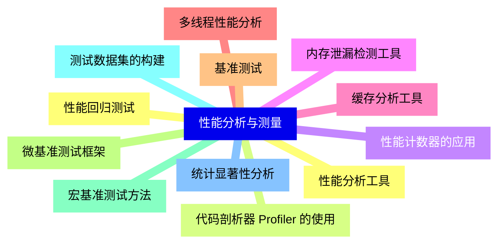

<--->
{}
{}
{}
{}
{}
{}
{}
{}
{}
{}
{}
{}
{}
{}
{}
{}
{}
{}
{}
{}
{}
{}
{}
{}
{}

### 2 编译器优化技术{#2}

{}
{}
{}
{}
{}
{}
{}
{}
{}
{}
{}
{}
{}
{}
{}
{}
{}
{}
{}
{}
{}
{}
{}
{}
{}
<--->
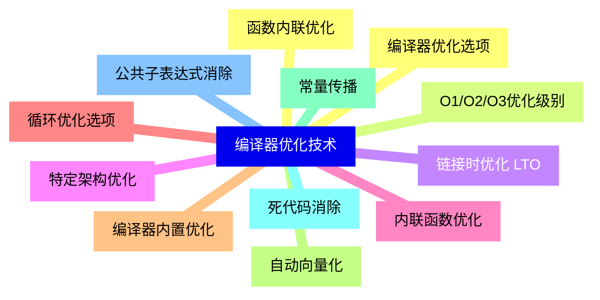

{}

### 3 内存管理优化{#3}

{}
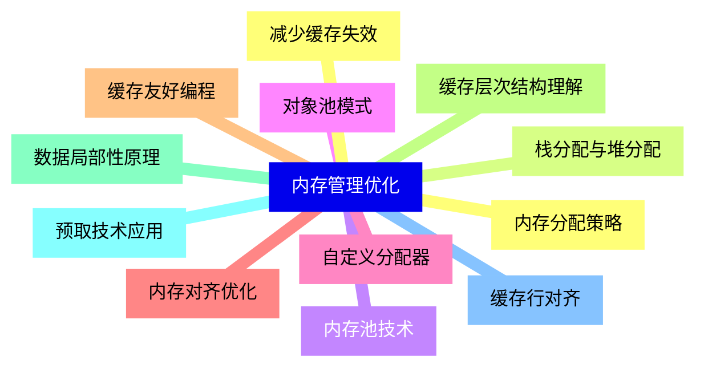

<--->
{}
{}
{}
{}
{}
{}
{}
{}
{}
{}
{}
{}
{}
{}
{}
{}
{}
{}
{}
{}
{}
{}
{}
{}
{}

### 4 数据结构优化{#4}

{}
{}
{}
{}
{}
{}
{}
{}
{}
{}
{}
{}
{}
{}
{}
{}
{}
{}
{}
{}
{}
{}
{}
{}
{}
<--->
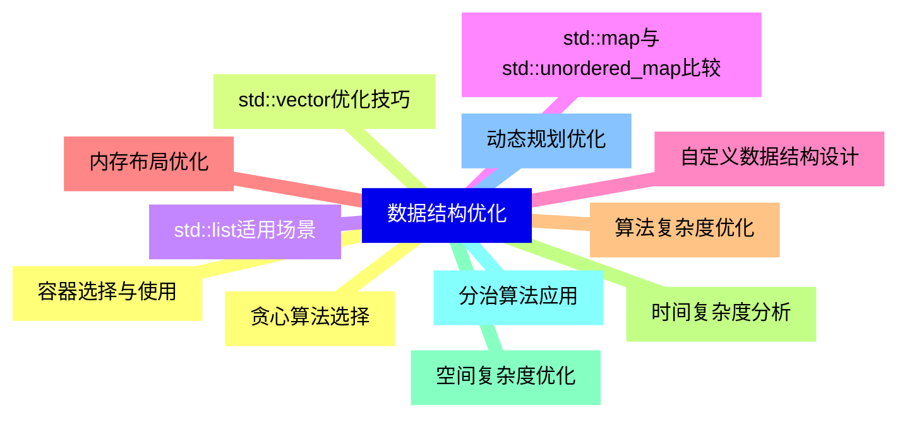

{}

### 5 多线程与并发优化{#5}

{}
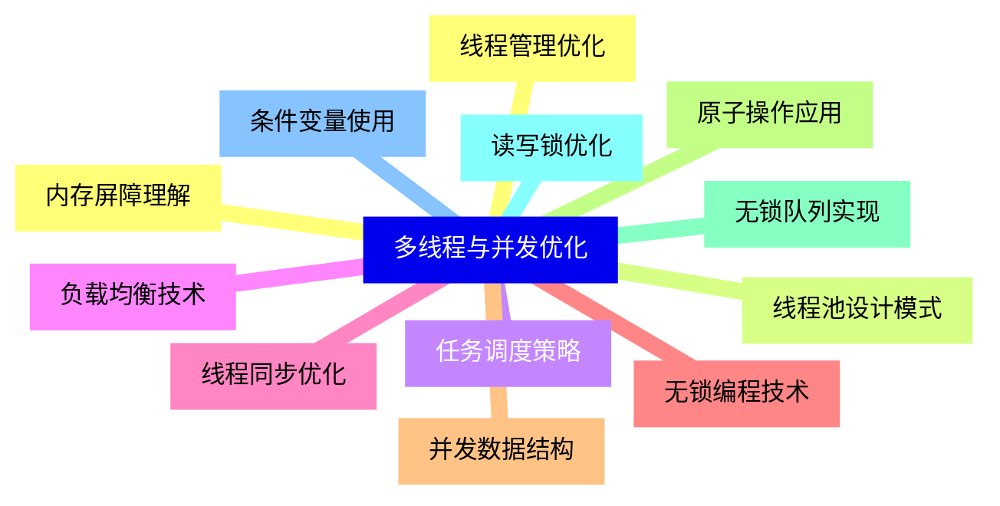

<--->
{}
{}
{}
{}
{}
{}
{}
{}
{}
{}
{}
{}
{}
{}
{}
{}
{}
{}
{}
{}
{}
{}
{}
{}
{}

### 6 I/O 操作优化{#6}

{}
{}
{}
{}
{}
{}
{}
{}
{}
{}
{}
{}
{}
{}
{}
{}
{}
{}
{}
{}
{}
{}
{}
{}
{}
<--->
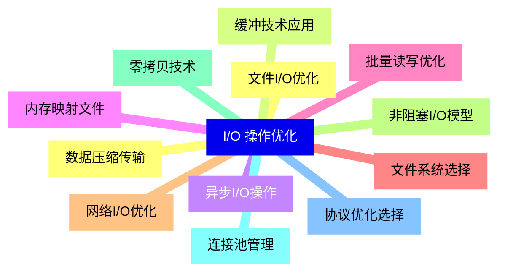

{}

### 7 数值计算优化{#7}

{}
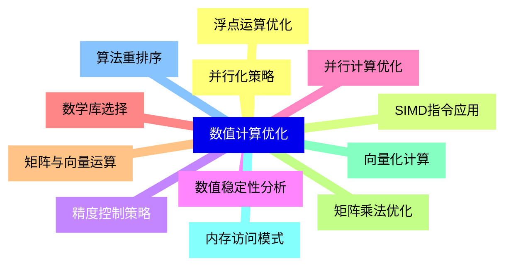

<--->
{}
{}
{}
{}
{}
{}
{}
{}
{}
{}
{}
{}
{}
{}
{}
{}
{}
{}
{}
{}
{}
{}
{}
{}
{}

### 8 模板与元编程优化{#8}

{}
{}
{}
{}
{}
{}
{}
{}
{}
{}
{}
{}
{}
{}
{}
{}
{}
{}
{}
{}
{}
{}
{}
{}
{}
<--->
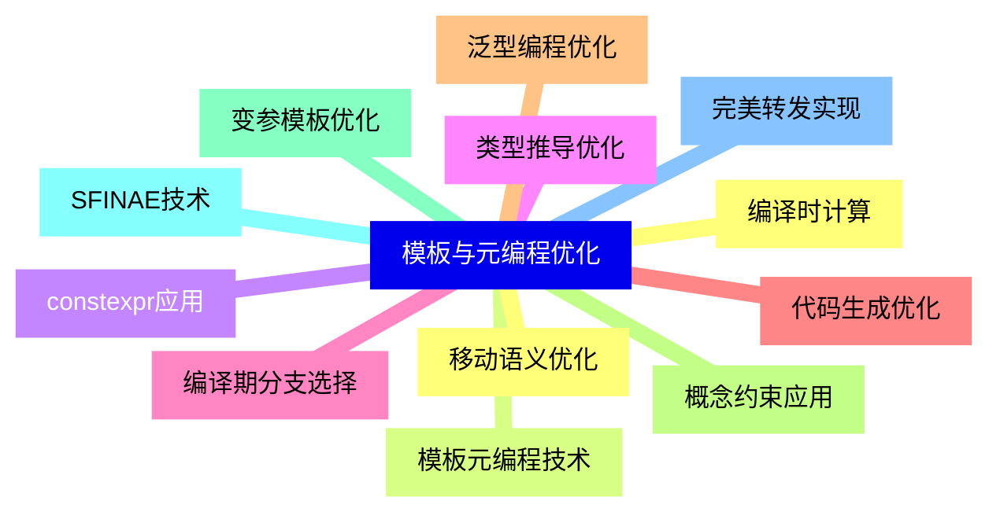

{}

### 9 字符串处理优化{#9}

{}
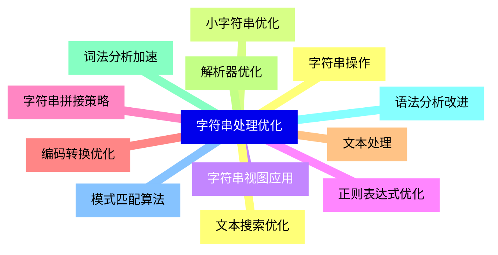

<--->
{}
{}
{}
{}
{}
{}
{}
{}
{}
{}
{}
{}
{}
{}
{}
{}
{}
{}
{}
{}
{}
{}
{}
{}
{}

### 10 系统级优化{#10}

{}
{}
{}
{}
{}
{}
{}
{}
{}
{}
{}
{}
{}
{}
{}
{}
{}
{}
{}
{}
{}
{}
{}
{}
{}
<--->
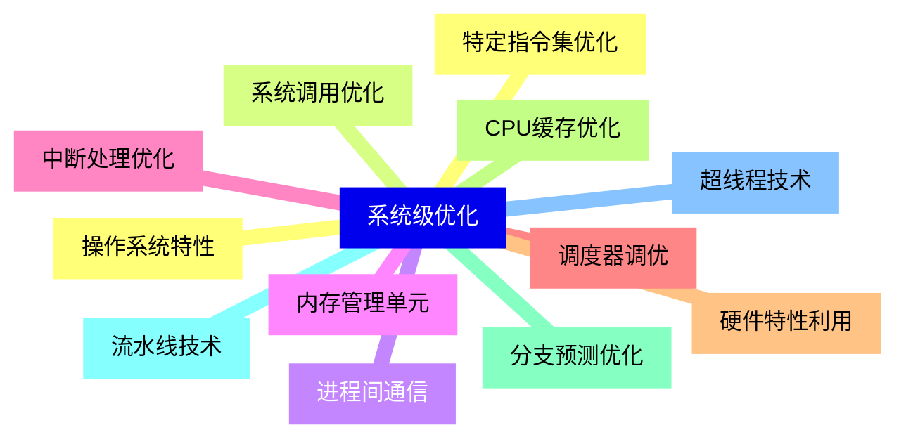

{}

### 11 代码重构与优化{#11}

{}
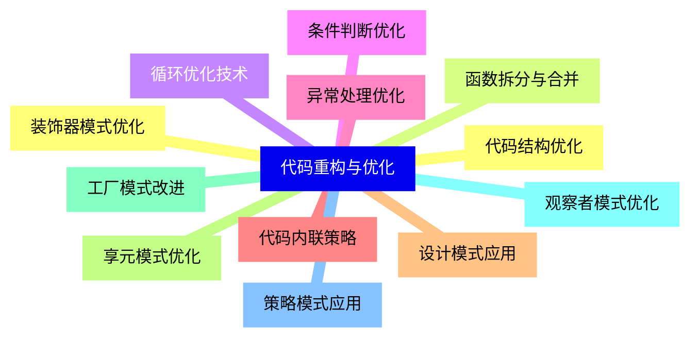

<--->
{}
{}
{}
{}
{}
{}
{}
{}
{}
{}
{}
{}
{}
{}
{}
{}
{}
{}
{}
{}
{}
{}
{}
{}
{}

### 12 性能监控与调优{#12}

{}
{}
{}
{}
{}
{}
{}
{}
{}
{}
{}
{}
{}
{}
{}
{}
{}
{}
{}
{}
{}
{}
{}
{}
{}
<--->
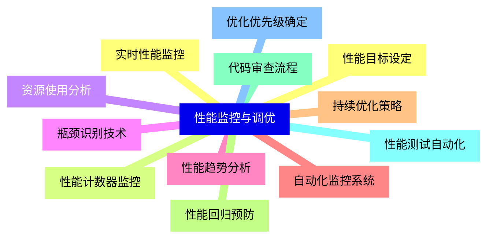

{}
