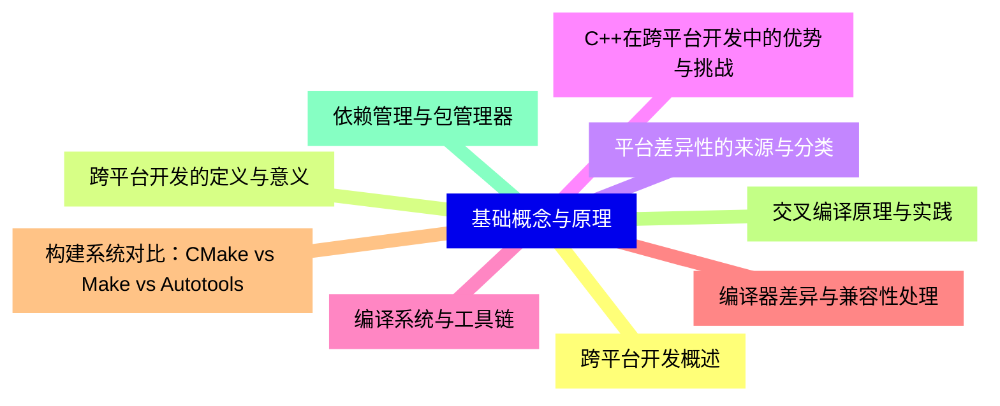
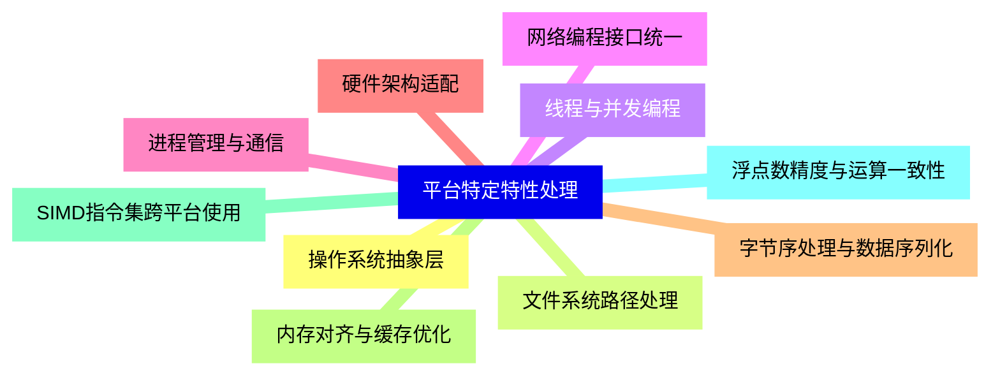
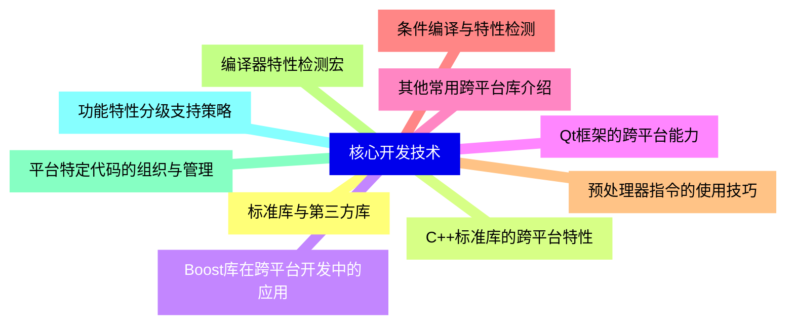
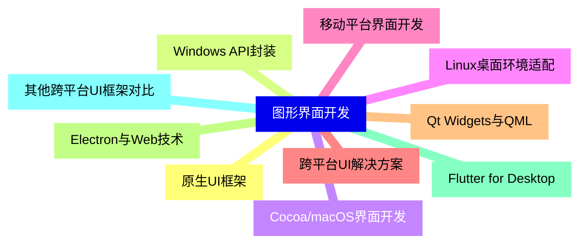
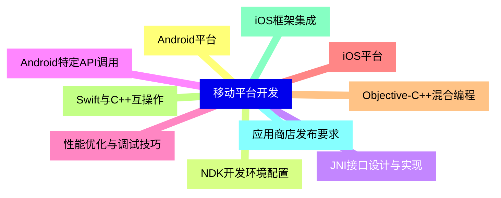
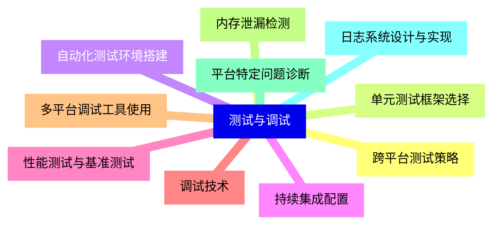
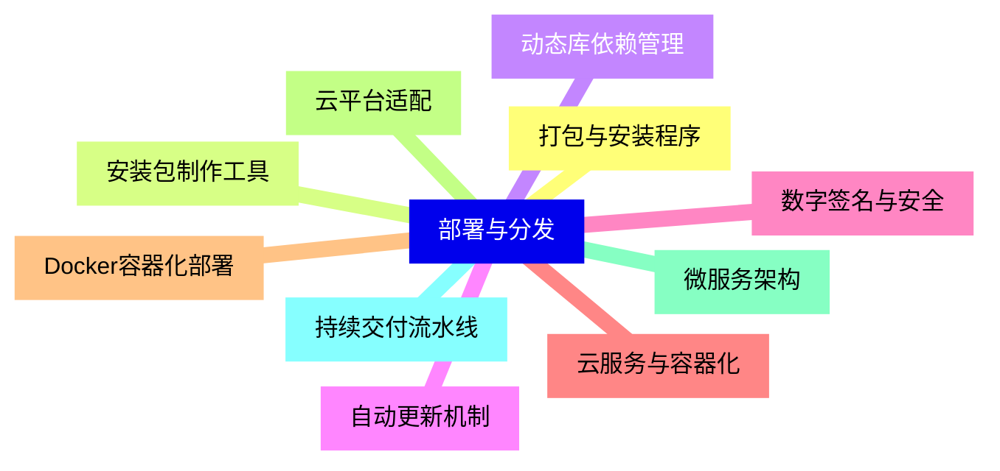
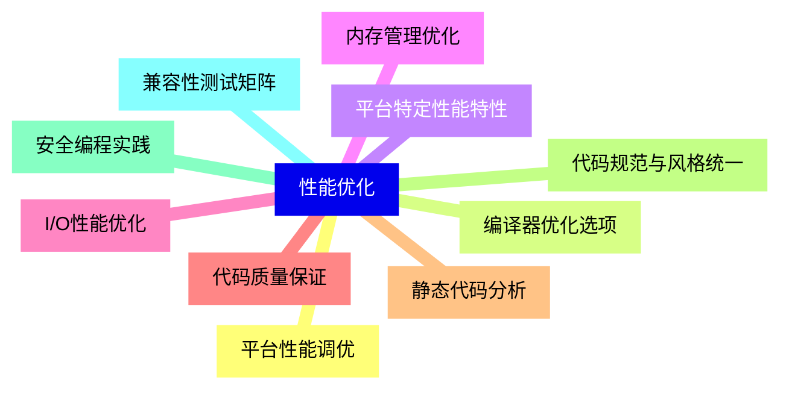
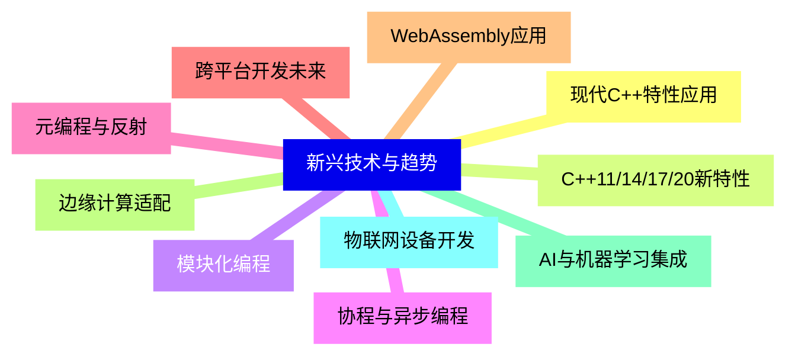


### 1 [基础概念与原理](#1)
#### 1.1 [跨平台开发概述](#1)
#### 1.2 [跨平台开发的定义与意义](#1)
#### 1.3 [平台差异性的来源与分类](#1)
#### 1.4 [C++在跨平台开发中的优势与挑战](#1)
#### 1.5 [编译系统与工具链](#1)
#### 1.6 [编译器差异与兼容性处理](#1)
#### 1.7 [构建系统对比：CMake vs Make vs Autotools](#1)
#### 1.8 [交叉编译原理与实践](#1)
#### 1.9 [依赖管理与包管理器](#1)
### 2 [平台特定特性处理](#2)
#### 2.1 [操作系统抽象层](#2)
#### 2.2 [文件系统路径处理](#2)
#### 2.3 [线程与并发编程](#2)
#### 2.4 [网络编程接口统一](#2)
#### 2.5 [进程管理与通信](#2)
#### 2.6 [硬件架构适配](#2)
#### 2.7 [字节序处理与数据序列化](#2)
#### 2.8 [内存对齐与缓存优化](#2)
#### 2.9 [SIMD指令集跨平台使用](#2)
#### 2.10 [浮点数精度与运算一致性](#2)
### 3 [核心开发技术](#3)
#### 3.1 [标准库与第三方库](#3)
#### 3.2 [C++标准库的跨平台特性](#3)
#### 3.3 [Boost库在跨平台开发中的应用](#3)
#### 3.4 [Qt框架的跨平台能力](#3)
#### 3.5 [其他常用跨平台库介绍](#3)
#### 3.6 [条件编译与特性检测](#3)
#### 3.7 [预处理器指令的使用技巧](#3)
#### 3.8 [编译器特性检测宏](#3)
#### 3.9 [平台特定代码的组织与管理](#3)
#### 3.10 [功能特性分级支持策略](#3)
### 4 [图形界面开发](#4)
#### 4.1 [原生UI框架](#4)
#### 4.2 [Windows API封装](#4)
#### 4.3 [Cocoa/macOS界面开发](#4)
#### 4.4 [Linux桌面环境适配](#4)
#### 4.5 [移动平台界面开发](#4)
#### 4.6 [跨平台UI解决方案](#4)
#### 4.7 [Qt Widgets与QML](#4)
#### 4.8 [Electron与Web技术](#4)
#### 4.9 [Flutter for Desktop](#4)
#### 4.10 [其他跨平台UI框架对比](#4)
### 5 [移动平台开发](#5)
#### 5.1 [Android平台](#5)
#### 5.2 [NDK开发环境配置](#5)
#### 5.3 [JNI接口设计与实现](#5)
#### 5.4 [Android特定API调用](#5)
#### 5.5 [性能优化与调试技巧](#5)
#### 5.6 [iOS平台](#5)
#### 5.7 [Objective-C++混合编程](#5)
#### 5.8 [Swift与C++互操作](#5)
#### 5.9 [iOS框架集成](#5)
#### 5.10 [应用商店发布要求](#5)
### 6 [测试与调试](#6)
#### 6.1 [跨平台测试策略](#6)
#### 6.2 [单元测试框架选择](#6)
#### 6.3 [自动化测试环境搭建](#6)
#### 6.4 [持续集成配置](#6)
#### 6.5 [性能测试与基准测试](#6)
#### 6.6 [调试技术](#6)
#### 6.7 [多平台调试工具使用](#6)
#### 6.8 [内存泄漏检测](#6)
#### 6.9 [平台特定问题诊断](#6)
#### 6.10 [日志系统设计与实现](#6)
### 7 [部署与分发](#7)
#### 7.1 [打包与安装程序](#7)
#### 7.2 [安装包制作工具](#7)
#### 7.3 [动态库依赖管理](#7)
#### 7.4 [自动更新机制](#7)
#### 7.5 [数字签名与安全](#7)
#### 7.6 [云服务与容器化](#7)
#### 7.7 [Docker容器化部署](#7)
#### 7.8 [云平台适配](#7)
#### 7.9 [微服务架构](#7)
#### 7.10 [持续交付流水线](#7)
### 8 [性能优化](#8)
#### 8.1 [平台性能调优](#8)
#### 8.2 [编译器优化选项](#8)
#### 8.3 [平台特定性能特性](#8)
#### 8.4 [内存管理优化](#8)
#### 8.5 [I/O性能优化](#8)
#### 8.6 [代码质量保证](#8)
#### 8.7 [静态代码分析](#8)
#### 8.8 [代码规范与风格统一](#8)
#### 8.9 [安全编程实践](#8)
#### 8.10 [兼容性测试矩阵](#8)
### 9 [新兴技术与趋势](#9)
#### 9.1 [现代C++特性应用](#9)
#### 9.2 [C++11/14/17/20新特性](#9)
#### 9.3 [模块化编程](#9)
#### 9.4 [协程与异步编程](#9)
#### 9.5 [元编程与反射](#9)
#### 9.6 [跨平台开发未来](#9)
#### 9.7 [WebAssembly应用](#9)
#### 9.8 [边缘计算适配](#9)
#### 9.9 [AI与机器学习集成](#9)
#### 9.10 [物联网设备开发](#9)




### 1 基础概念与原理

---
### 1 基础概念与原理
___
#### 1.1 跨平台开发概述
___
#### 1.2 跨平台开发的定义与意义
___
#### 1.3 平台差异性的来源与分类
___
#### 1.4 C++在跨平台开发中的优势与挑战
___
#### 1.5 编译系统与工具链
___
#### 1.6 编译器差异与兼容性处理
___
#### 1.7 构建系统对比：CMake vs Make vs Autotools
___
#### 1.8 交叉编译原理与实践
___
#### 1.9 依赖管理与包管理器
### 2 平台特定特性处理

---
### 2 平台特定特性处理
___
#### 2.1 操作系统抽象层
___
#### 2.2 文件系统路径处理
___
#### 2.3 线程与并发编程
___
#### 2.4 网络编程接口统一
___
#### 2.5 进程管理与通信
___
#### 2.6 硬件架构适配
___
#### 2.7 字节序处理与数据序列化
___
#### 2.8 内存对齐与缓存优化
___
#### 2.9 SIMD指令集跨平台使用
___
#### 2.10 浮点数精度与运算一致性
### 3 核心开发技术

---
### 3 核心开发技术
___
#### 3.1 标准库与第三方库
___
#### 3.2 C++标准库的跨平台特性
___
#### 3.3 Boost库在跨平台开发中的应用
___
#### 3.4 Qt框架的跨平台能力
___
#### 3.5 其他常用跨平台库介绍
___
#### 3.6 条件编译与特性检测
___
#### 3.7 预处理器指令的使用技巧
___
#### 3.8 编译器特性检测宏
___
#### 3.9 平台特定代码的组织与管理
___
#### 3.10 功能特性分级支持策略
### 4 图形界面开发

---
### 4 图形界面开发
___
#### 4.1 原生UI框架
___
#### 4.2 Windows API封装
___
#### 4.3 Cocoa/macOS界面开发
___
#### 4.4 Linux桌面环境适配
___
#### 4.5 移动平台界面开发
___
#### 4.6 跨平台UI解决方案
___
#### 4.7 Qt Widgets与QML
___
#### 4.8 Electron与Web技术
___
#### 4.9 Flutter for Desktop
___
#### 4.10 其他跨平台UI框架对比
### 5 移动平台开发

---
### 5 移动平台开发
___
#### 5.1 Android平台
___
#### 5.2 NDK开发环境配置
___
#### 5.3 JNI接口设计与实现
___
#### 5.4 Android特定API调用
___
#### 5.5 性能优化与调试技巧
___
#### 5.6 iOS平台
___
#### 5.7 Objective-C++混合编程
___
#### 5.8 Swift与C++互操作
___
#### 5.9 iOS框架集成
___
#### 5.10 应用商店发布要求
### 6 测试与调试

---
### 6 测试与调试
___
#### 6.1 跨平台测试策略
___
#### 6.2 单元测试框架选择
___
#### 6.3 自动化测试环境搭建
___
#### 6.4 持续集成配置
___
#### 6.5 性能测试与基准测试
___
#### 6.6 调试技术
___
#### 6.7 多平台调试工具使用
___
#### 6.8 内存泄漏检测
___
#### 6.9 平台特定问题诊断
___
#### 6.10 日志系统设计与实现
### 7 部署与分发

---
### 7 部署与分发
___
#### 7.1 打包与安装程序
___
#### 7.2 安装包制作工具
___
#### 7.3 动态库依赖管理
___
#### 7.4 自动更新机制
___
#### 7.5 数字签名与安全
___
#### 7.6 云服务与容器化
___
#### 7.7 Docker容器化部署
___
#### 7.8 云平台适配
___
#### 7.9 微服务架构
___
#### 7.10 持续交付流水线
### 8 性能优化

---
### 8 性能优化
___
#### 8.1 平台性能调优
___
#### 8.2 编译器优化选项
___
#### 8.3 平台特定性能特性
___
#### 8.4 内存管理优化
___
#### 8.5 I/O性能优化
___
#### 8.6 代码质量保证
___
#### 8.7 静态代码分析
___
#### 8.8 代码规范与风格统一
___
#### 8.9 安全编程实践
___
#### 8.10 兼容性测试矩阵
### 9 新兴技术与趋势

---
### 9 新兴技术与趋势
___
#### 9.1 现代C++特性应用
___
#### 9.2 C++11/14/17/20新特性
___
#### 9.3 模块化编程
___
#### 9.4 协程与异步编程
___
#### 9.5 元编程与反射
___
#### 9.6 跨平台开发未来
___
#### 9.7 WebAssembly应用
___
#### 9.8 边缘计算适配
___
#### 9.9 AI与机器学习集成
___
#### 9.10 物联网设备开发


### 1 基础概念与原理{#1}

{}

<--->
{}
{}
{}
{}
{}
{}
{}
{}
{}
{}
{}
{}
{}
{}
{}
{}
{}
{}
{}

### 2 平台特定特性处理{#2}

{}
{}
{}
{}
{}
{}
{}
{}
{}
{}
{}
{}
{}
{}
{}
{}
{}
{}
{}
{}
{}
<--->

{}

### 3 核心开发技术{#3}

{}

<--->
{}
{}
{}
{}
{}
{}
{}
{}
{}
{}
{}
{}
{}
{}
{}
{}
{}
{}
{}
{}
{}

### 4 图形界面开发{#4}

{}
{}
{}
{}
{}
{}
{}
{}
{}
{}
{}
{}
{}
{}
{}
{}
{}
{}
{}
{}
{}
<--->

{}

### 5 移动平台开发{#5}

{}

<--->
{}
{}
{}
{}
{}
{}
{}
{}
{}
{}
{}
{}
{}
{}
{}
{}
{}
{}
{}
{}
{}

### 6 测试与调试{#6}

{}
{}
{}
{}
{}
{}
{}
{}
{}
{}
{}
{}
{}
{}
{}
{}
{}
{}
{}
{}
{}
<--->

{}

### 7 部署与分发{#7}

{}

<--->
{}
{}
{}
{}
{}
{}
{}
{}
{}
{}
{}
{}
{}
{}
{}
{}
{}
{}
{}
{}
{}

### 8 性能优化{#8}

{}
{}
{}
{}
{}
{}
{}
{}
{}
{}
{}
{}
{}
{}
{}
{}
{}
{}
{}
{}
{}
<--->

{}

### 9 新兴技术与趋势{#9}

{}

<--->
{}
{}
{}
{}
{}
{}
{}
{}
{}
{}
{}
{}
{}
{}
{}
{}
{}
{}
{}
{}
{}
