
### 1 [开发环境与IDE](#1)
#### 1.1 [集成开发环境](#1)
#### 1.2 [Visual Studio](#1)
#### 1.3 [CLion](#1)
#### 1.4 [Qt Creator](#1)
#### 1.5 [Eclipse CDT](#1)
#### 1.6 [Code::Blocks](#1)
#### 1.7 [Dev-C++](#1)
#### 1.8 [轻量级编辑器](#1)
#### 1.9 [Visual Studio Code](#1)
#### 1.10 [Sublime Text](#1)
#### 1.11 [Atom](#1)
#### 1.12 [Vim/Neovim](#1)
#### 1.13 [Emacs](#1)
### 2 [编译器与构建工具](#2)
#### 2.1 [C++编译器](#2)
#### 2.2 [GCC  GNU Compiler Collection](#2)
#### 2.3 [Clang/LLVM](#2)
#### 2.4 [Microsoft Visual C++  MSVC](#2)
#### 2.5 [Intel C++ Compiler](#2)
#### 2.6 [构建系统](#2)
#### 2.7 [CMake](#2)
#### 2.8 [Make](#2)
#### 2.9 [Ninja](#2)
#### 2.10 [Bazel](#2)
#### 2.11 [Meson](#2)
### 3 [调试与分析工具](#3)
#### 3.1 [调试器](#3)
#### 3.2 [GDB  GNU Debugger](#3)
#### 3.3 [LLDB](#3)
#### 3.4 [Visual Studio Debugger](#3)
#### 3.5 [WinDbg](#3)
#### 3.6 [性能分析工具](#3)
#### 3.7 [Valgrind](#3)
#### 3.8 [Perf](#3)
#### 3.9 [gprof](#3)
#### 3.10 [Intel VTune Profiler](#3)
#### 3.11 [内存检测工具](#3)
#### 3.12 [AddressSanitizer](#3)
#### 3.13 [MemorySanitizer](#3)
#### 3.14 [LeakSanitizer](#3)
#### 3.15 [Dr. Memory](#3)
### 4 [代码质量工具](#4)
#### 4.1 [静态分析工具](#4)
#### 4.2 [Clang-Tidy](#4)
#### 4.3 [Cppcheck](#4)
#### 4.4 [PVS-Studio](#4)
#### 4.5 [SonarQube](#4)
#### 4.6 [代码格式化工具](#4)
#### 4.7 [Clang-Format](#4)
#### 4.8 [Artistic Style  AStyle](#4)
#### 4.9 [Uncrustify](#4)
#### 4.10 [单元测试框架](#4)
#### 4.11 [Google Test  gtest](#4)
#### 4.12 [Catch2](#4)
#### 4.13 [Boost.Test](#4)
#### 4.14 [CppUnit](#4)
### 5 [版本控制与协作](#5)
#### 5.1 [版本控制系统](#5)
#### 5.2 [Git](#5)
#### 5.3 [SVN](#5)
#### 5.4 [Mercurial](#5)
#### 5.5 [持续集成工具](#5)
#### 5.6 [Jenkins](#5)
#### 5.7 [GitLab CI/CD](#5)
#### 5.8 [Travis CI](#5)
#### 5.9 [GitHub Actions](#5)
### 6 [包管理与依赖管理](#6)
#### 6.1 [C++包管理器](#6)
#### 6.2 [Conan](#6)
#### 6.3 [vcpkg](#6)
#### 6.4 [Hunter](#6)
#### 6.5 [CPM.cmake](#6)
#### 6.6 [系统包管理器](#6)
#### 6.7 [apt  Ubuntu/Debian](#6)
#### 6.8 [yum/dnf  Red Hat/CentOS](#6)
#### 6.9 [Homebrew  macOS](#6)
#### 6.10 [Chocolatey  Windows](#6)
### 7 [文档生成工具](#7)
#### 7.1 [API文档生成](#7)
#### 7.2 [Doxygen](#7)
#### 7.3 [Sphinx + Breathe](#7)
#### 7.4 [Natural Docs](#7)
#### 7.5 [文档编写工具](#7)
#### 7.6 [Markdown编辑器](#7)
#### 7.7 [LaTeX工具链](#7)
#### 7.8 [AsciiDoc](#7)
### 8 [跨平台开发工具](#8)
#### 8.1 [跨平台构建工具](#8)
#### 8.2 [CMake](#8)
#### 8.3 [Autotools](#8)
#### 8.4 [Premake](#8)
#### 8.5 [跨平台GUI框架](#8)
#### 8.6 [Qt](#8)
#### 8.7 [wxWidgets](#8)
#### 8.8 [FLTK](#8)
#### 8.9 [GTK+](#8)
### 9 [嵌入式开发工具](#9)
#### 9.1 [交叉编译工具链](#9)
#### 9.2 [ARM GCC工具链](#9)
#### 9.3 [LLVM/Clang交叉编译](#9)
#### 9.4 [厂商专用SDK](#9)
#### 9.5 [嵌入式调试工具](#9)
#### 9.6 [OpenOCD](#9)
#### 9.7 [J-Link工具](#9)
#### 9.8 [ST-Link工具](#9)
### 10 [云开发与容器化](#10)
#### 10.1 [容器化工具](#10)
#### 10.2 [Docker](#10)
#### 10.3 [Podman](#10)
#### 10.4 [云开发环境](#10)
#### 10.5 [GitHub Codespaces](#10)
#### 10.6 [GitPod](#10)
#### 10.7 [Visual Studio Online](#10)
### 11 [性能优化工具](#11)
#### 11.1 [基准测试工具](#11)
#### 11.2 [Google Benchmark](#11)
#### 11.3 [Celero](#11)
#### 11.4 [Nonius](#11)
#### 11.5 [代码剖析器](#11)
#### 11.6 [Callgrind](#11)
#### 11.7 [gperftools](#11)
#### 11.8 [Intel Advisor](#11)
### 12 [移动开发工具](#12)
#### 12.1 [Android开发](#12)
#### 12.2 [Android NDK](#12)
#### 12.3 [Android Studio](#12)
#### 12.4 [iOS开发](#12)
#### 12.5 [Xcode](#12)
#### 12.6 [iOS SDK](#12)
### 13 [游戏开发工具](#13)
#### 13.1 [游戏引擎](#13)
#### 13.2 [Unreal Engine](#13)
#### 13.3 [Unity  C++插件](#13)
#### 13.4 [Godot Engine](#13)
#### 13.5 [图形调试工具](#13)
#### 13.6 [RenderDoc](#13)
#### 13.7 [NVIDIA Nsight](#13)
#### 13.8 [AMD Radeon Profiler](#13)
### 14 [数据库开发工具](#14)
#### 14.1 [数据库连接库](#14)
#### 14.2 [ODBC](#14)
#### 14.3 [MySQL Connector/C++](#14)
#### 14.4 [PostgreSQL libpq](#14)
#### 14.5 [ORM工具](#14)
#### 14.6 [ODB](#14)
#### 14.7 [SOCI](#14)
#### 14.8 [Qt SQL](#14)
### 15 [网络开发工具](#15)
#### 15.1 [网络库](#15)
#### 15.2 [Boost.Asio](#15)
#### 15.3 [POCO C++ Libraries](#15)
#### 15.4 [libcurl](#15)
#### 15.5 [协议分析工具](#15)
#### 15.6 [Wireshark](#15)
#### 15.7 [tcpdump](#15)
#### 15.8 [Fiddler](#15)
### 16 [安全开发工具](#16)
#### 16.1 [安全分析工具](#16)
#### 16.2 [OWASP工具集](#16)
#### 16.3 [模糊测试工具](#16)
#### 16.4 [漏洞扫描工具](#16)
#### 16.5 [加密库](#16)
#### 16.6 [OpenSSL](#16)
#### 16.7 [Crypto++](#16)
#### 16.8 [Botan](#16)




### 1 开发环境与IDE

---
### 1 开发环境与IDE
___
#### 1.1 集成开发环境
___
#### 1.2 Visual Studio
___
#### 1.3 CLion
___
#### 1.4 Qt Creator
___
#### 1.5 Eclipse CDT
___
#### 1.6 Code::Blocks
___
#### 1.7 Dev-C++
___
#### 1.8 轻量级编辑器
___
#### 1.9 Visual Studio Code
___
#### 1.10 Sublime Text
___
#### 1.11 Atom
___
#### 1.12 Vim/Neovim
___
#### 1.13 Emacs
### 2 编译器与构建工具

---
### 2 编译器与构建工具
___
#### 2.1 C++编译器
___
#### 2.2 GCC  GNU Compiler Collection
___
#### 2.3 Clang/LLVM
___
#### 2.4 Microsoft Visual C++  MSVC
___
#### 2.5 Intel C++ Compiler
___
#### 2.6 构建系统
___
#### 2.7 CMake
___
#### 2.8 Make
___
#### 2.9 Ninja
___
#### 2.10 Bazel
___
#### 2.11 Meson
### 3 调试与分析工具

---
### 3 调试与分析工具
___
#### 3.1 调试器
___
#### 3.2 GDB  GNU Debugger
___
#### 3.3 LLDB
___
#### 3.4 Visual Studio Debugger
___
#### 3.5 WinDbg
___
#### 3.6 性能分析工具
___
#### 3.7 Valgrind
___
#### 3.8 Perf
___
#### 3.9 gprof
___
#### 3.10 Intel VTune Profiler
___
#### 3.11 内存检测工具
___
#### 3.12 AddressSanitizer
___
#### 3.13 MemorySanitizer
___
#### 3.14 LeakSanitizer
___
#### 3.15 Dr. Memory
### 4 代码质量工具

---
### 4 代码质量工具
___
#### 4.1 静态分析工具
___
#### 4.2 Clang-Tidy
___
#### 4.3 Cppcheck
___
#### 4.4 PVS-Studio
___
#### 4.5 SonarQube
___
#### 4.6 代码格式化工具
___
#### 4.7 Clang-Format
___
#### 4.8 Artistic Style  AStyle
___
#### 4.9 Uncrustify
___
#### 4.10 单元测试框架
___
#### 4.11 Google Test  gtest
___
#### 4.12 Catch2
___
#### 4.13 Boost.Test
___
#### 4.14 CppUnit
### 5 版本控制与协作

---
### 5 版本控制与协作
___
#### 5.1 版本控制系统
___
#### 5.2 Git
___
#### 5.3 SVN
___
#### 5.4 Mercurial
___
#### 5.5 持续集成工具
___
#### 5.6 Jenkins
___
#### 5.7 GitLab CI/CD
___
#### 5.8 Travis CI
___
#### 5.9 GitHub Actions
### 6 包管理与依赖管理

---
### 6 包管理与依赖管理
___
#### 6.1 C++包管理器
___
#### 6.2 Conan
___
#### 6.3 vcpkg
___
#### 6.4 Hunter
___
#### 6.5 CPM.cmake
___
#### 6.6 系统包管理器
___
#### 6.7 apt  Ubuntu/Debian
___
#### 6.8 yum/dnf  Red Hat/CentOS
___
#### 6.9 Homebrew  macOS
___
#### 6.10 Chocolatey  Windows
### 7 文档生成工具

---
### 7 文档生成工具
___
#### 7.1 API文档生成
___
#### 7.2 Doxygen
___
#### 7.3 Sphinx + Breathe
___
#### 7.4 Natural Docs
___
#### 7.5 文档编写工具
___
#### 7.6 Markdown编辑器
___
#### 7.7 LaTeX工具链
___
#### 7.8 AsciiDoc
### 8 跨平台开发工具

---
### 8 跨平台开发工具
___
#### 8.1 跨平台构建工具
___
#### 8.2 CMake
___
#### 8.3 Autotools
___
#### 8.4 Premake
___
#### 8.5 跨平台GUI框架
___
#### 8.6 Qt
___
#### 8.7 wxWidgets
___
#### 8.8 FLTK
___
#### 8.9 GTK+
### 9 嵌入式开发工具

---
### 9 嵌入式开发工具
___
#### 9.1 交叉编译工具链
___
#### 9.2 ARM GCC工具链
___
#### 9.3 LLVM/Clang交叉编译
___
#### 9.4 厂商专用SDK
___
#### 9.5 嵌入式调试工具
___
#### 9.6 OpenOCD
___
#### 9.7 J-Link工具
___
#### 9.8 ST-Link工具
### 10 云开发与容器化

---
### 10 云开发与容器化
___
#### 10.1 容器化工具
___
#### 10.2 Docker
___
#### 10.3 Podman
___
#### 10.4 云开发环境
___
#### 10.5 GitHub Codespaces
___
#### 10.6 GitPod
___
#### 10.7 Visual Studio Online
### 11 性能优化工具

---
### 11 性能优化工具
___
#### 11.1 基准测试工具
___
#### 11.2 Google Benchmark
___
#### 11.3 Celero
___
#### 11.4 Nonius
___
#### 11.5 代码剖析器
___
#### 11.6 Callgrind
___
#### 11.7 gperftools
___
#### 11.8 Intel Advisor
### 12 移动开发工具

---
### 12 移动开发工具
___
#### 12.1 Android开发
___
#### 12.2 Android NDK
___
#### 12.3 Android Studio
___
#### 12.4 iOS开发
___
#### 12.5 Xcode
___
#### 12.6 iOS SDK
### 13 游戏开发工具

---
### 13 游戏开发工具
___
#### 13.1 游戏引擎
___
#### 13.2 Unreal Engine
___
#### 13.3 Unity  C++插件
___
#### 13.4 Godot Engine
___
#### 13.5 图形调试工具
___
#### 13.6 RenderDoc
___
#### 13.7 NVIDIA Nsight
___
#### 13.8 AMD Radeon Profiler
### 14 数据库开发工具

---
### 14 数据库开发工具
___
#### 14.1 数据库连接库
___
#### 14.2 ODBC
___
#### 14.3 MySQL Connector/C++
___
#### 14.4 PostgreSQL libpq
___
#### 14.5 ORM工具
___
#### 14.6 ODB
___
#### 14.7 SOCI
___
#### 14.8 Qt SQL
### 15 网络开发工具

---
### 15 网络开发工具
___
#### 15.1 网络库
___
#### 15.2 Boost.Asio
___
#### 15.3 POCO C++ Libraries
___
#### 15.4 libcurl
___
#### 15.5 协议分析工具
___
#### 15.6 Wireshark
___
#### 15.7 tcpdump
___
#### 15.8 Fiddler
### 16 安全开发工具

---
### 16 安全开发工具
___
#### 16.1 安全分析工具
___
#### 16.2 OWASP工具集
___
#### 16.3 模糊测试工具
___
#### 16.4 漏洞扫描工具
___
#### 16.5 加密库
___
#### 16.6 OpenSSL
___
#### 16.7 Crypto++
___
#### 16.8 Botan


### 1 开发环境与IDE{#1}

{}
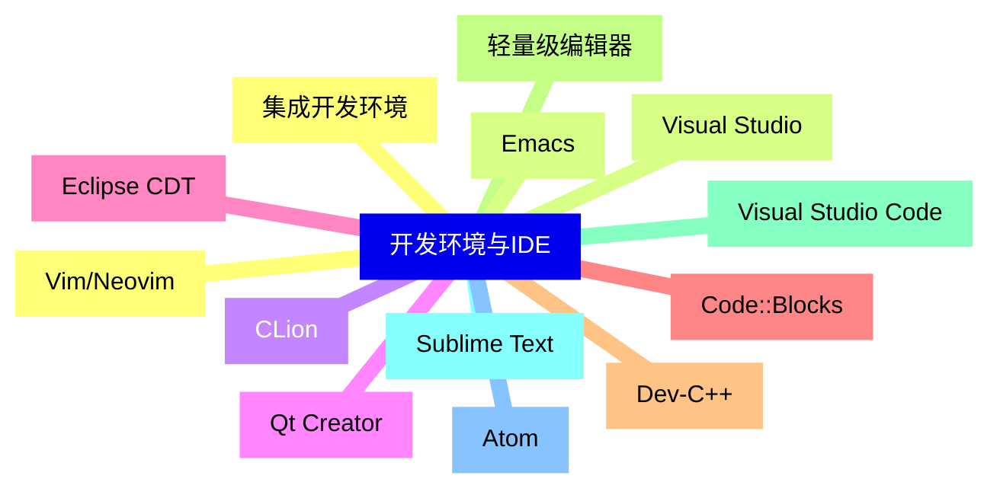

<--->
{}
{}
{}
{}
{}
{}
{}
{}
{}
{}
{}
{}
{}
{}
{}
{}
{}
{}
{}
{}
{}
{}
{}
{}
{}
{}
{}

### 2 编译器与构建工具{#2}

{}
{}
{}
{}
{}
{}
{}
{}
{}
{}
{}
{}
{}
{}
{}
{}
{}
{}
{}
{}
{}
{}
{}
<--->
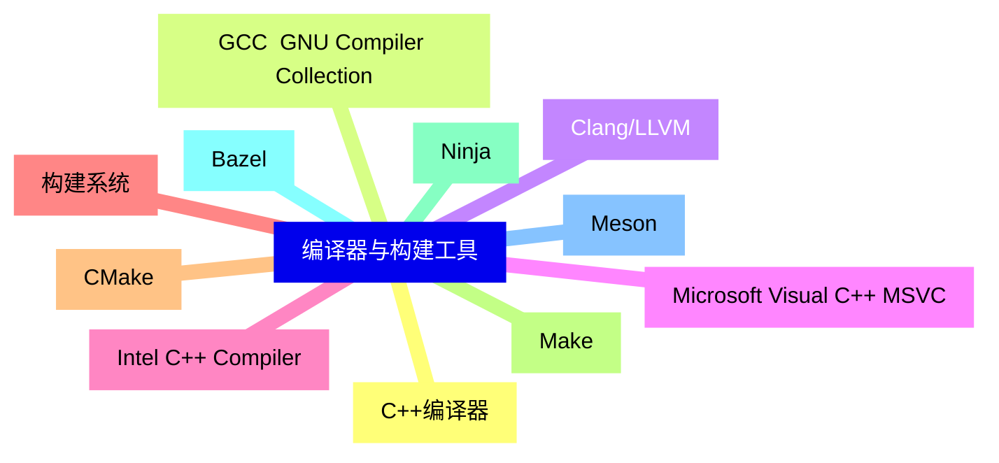

{}

### 3 调试与分析工具{#3}

{}
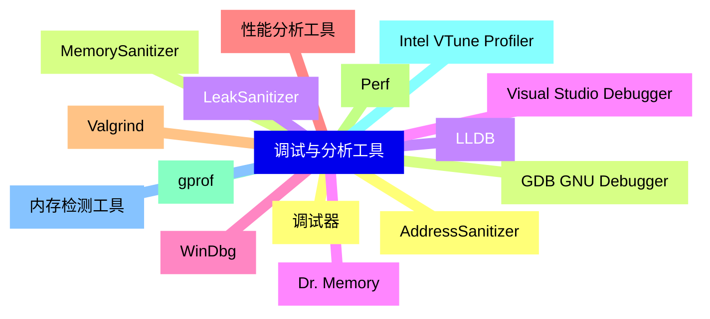

<--->
{}
{}
{}
{}
{}
{}
{}
{}
{}
{}
{}
{}
{}
{}
{}
{}
{}
{}
{}
{}
{}
{}
{}
{}
{}
{}
{}
{}
{}
{}
{}

### 4 代码质量工具{#4}

{}
{}
{}
{}
{}
{}
{}
{}
{}
{}
{}
{}
{}
{}
{}
{}
{}
{}
{}
{}
{}
{}
{}
{}
{}
{}
{}
{}
{}
<--->
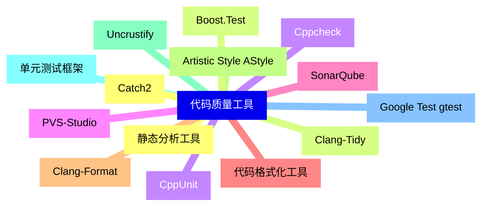

{}

### 5 版本控制与协作{#5}

{}
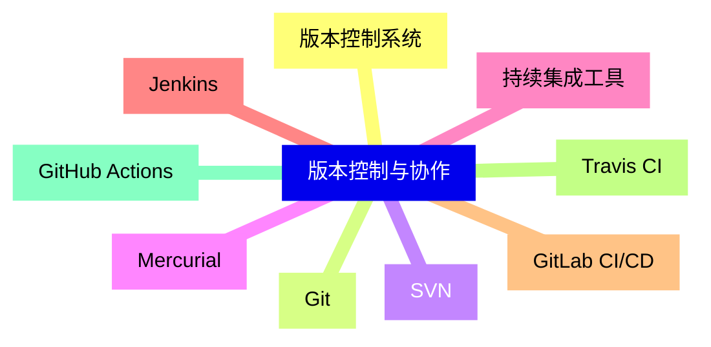

<--->
{}
{}
{}
{}
{}
{}
{}
{}
{}
{}
{}
{}
{}
{}
{}
{}
{}
{}
{}

### 6 包管理与依赖管理{#6}

{}
{}
{}
{}
{}
{}
{}
{}
{}
{}
{}
{}
{}
{}
{}
{}
{}
{}
{}
{}
{}
<--->
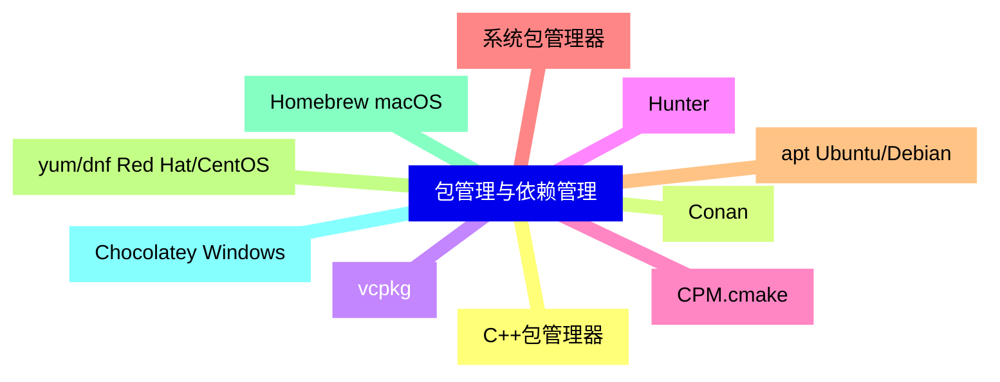

{}

### 7 文档生成工具{#7}

{}
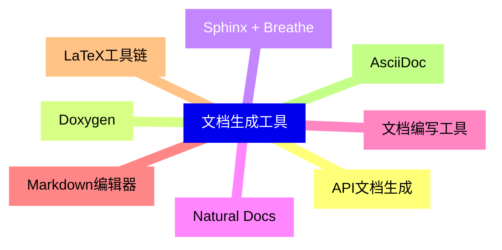

<--->
{}
{}
{}
{}
{}
{}
{}
{}
{}
{}
{}
{}
{}
{}
{}
{}
{}

### 8 跨平台开发工具{#8}

{}
{}
{}
{}
{}
{}
{}
{}
{}
{}
{}
{}
{}
{}
{}
{}
{}
{}
{}
<--->
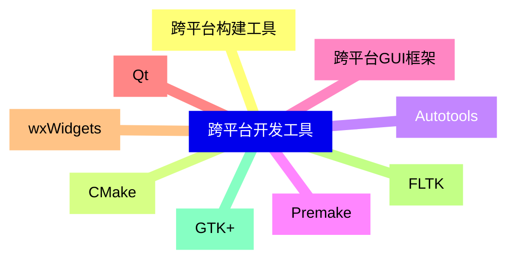

{}

### 9 嵌入式开发工具{#9}

{}
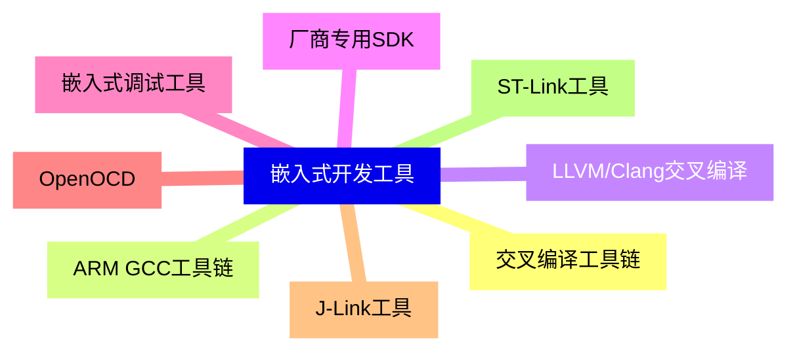

<--->
{}
{}
{}
{}
{}
{}
{}
{}
{}
{}
{}
{}
{}
{}
{}
{}
{}

### 10 云开发与容器化{#10}

{}
{}
{}
{}
{}
{}
{}
{}
{}
{}
{}
{}
{}
{}
{}
<--->
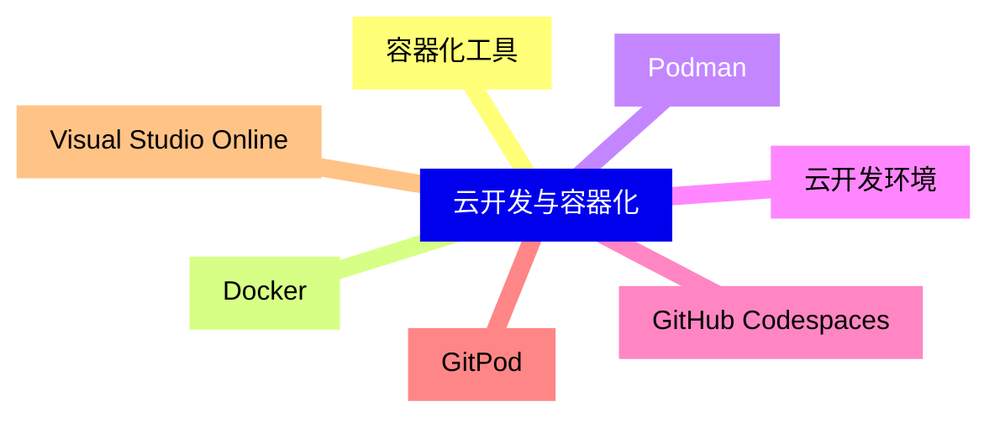

{}

### 11 性能优化工具{#11}

{}
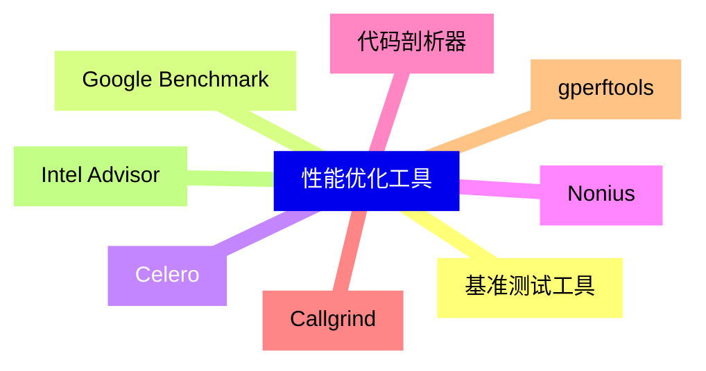

<--->
{}
{}
{}
{}
{}
{}
{}
{}
{}
{}
{}
{}
{}
{}
{}
{}
{}

### 12 移动开发工具{#12}

{}
{}
{}
{}
{}
{}
{}
{}
{}
{}
{}
{}
{}
<--->
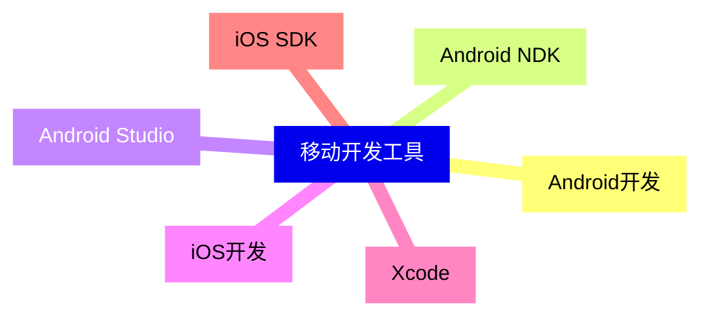

{}

### 13 游戏开发工具{#13}

{}
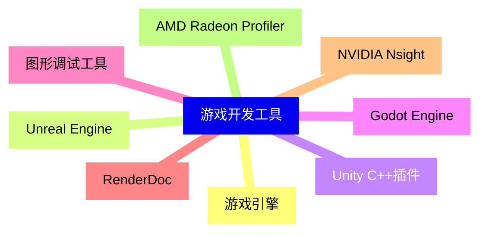

<--->
{}
{}
{}
{}
{}
{}
{}
{}
{}
{}
{}
{}
{}
{}
{}
{}
{}

### 14 数据库开发工具{#14}

{}
{}
{}
{}
{}
{}
{}
{}
{}
{}
{}
{}
{}
{}
{}
{}
{}
<--->
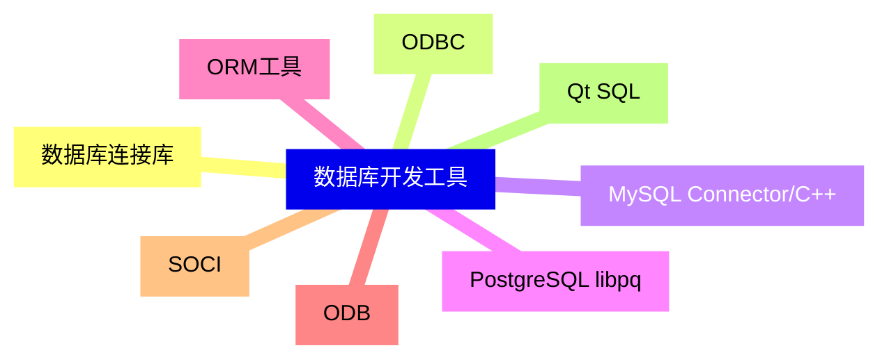

{}

### 15 网络开发工具{#15}

{}
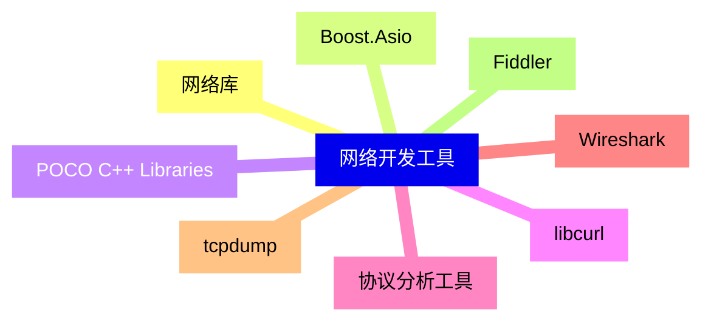

<--->
{}
{}
{}
{}
{}
{}
{}
{}
{}
{}
{}
{}
{}
{}
{}
{}
{}

### 16 安全开发工具{#16}

{}
{}
{}
{}
{}
{}
{}
{}
{}
{}
{}
{}
{}
{}
{}
{}
{}
<--->
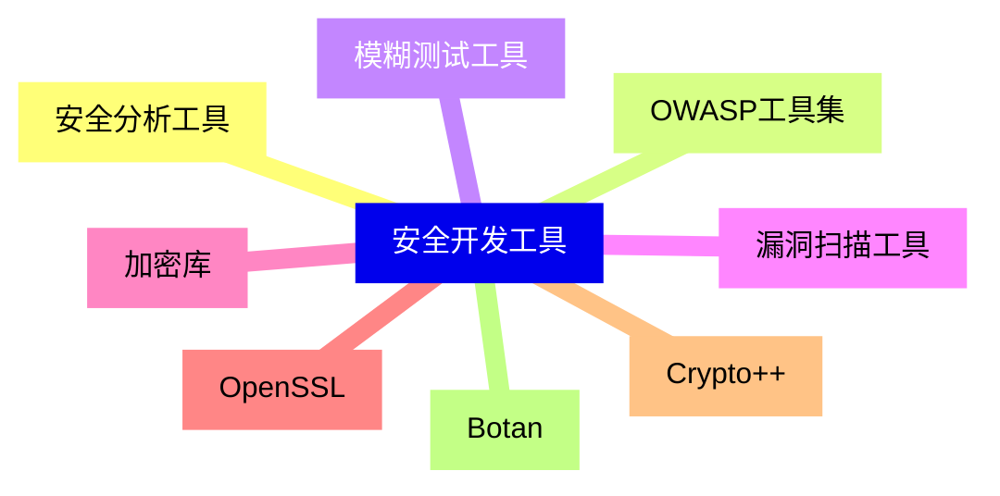

{}
