
### 1 [基础调试概念](#1)
#### 1.1 [调试的定义与重要性](#1)
#### 1.2 [调试与测试的区别](#1)
#### 1.3 [调试的基本流程](#1)
### 2 [编译时调试技巧](#2)
#### 2.1 [编译器警告选项](#2)
##### 2.1.1 [GCC/Clang 警告选项](#2)
##### 2.1.2 [MSVC 警告选项](#2)
##### 2.1.3 [常用警告级别设置](#2)
#### 2.2 [静态代码分析](#2)
##### 2.2.1 [静态分析工具介绍](#2)
##### 2.2.2 [常见静态分析错误类型](#2)
##### 2.2.3 [静态分析最佳实践](#2)
#### 2.3 [预处理调试](#2)
##### 2.3.1 [宏定义调试技巧](#2)
##### 2.3.2 [条件编译调试](#2)
##### 2.3.3 [头文件包含问题排查](#2)
### 3 [运行时调试技巧](#3)
#### 3.1 [断言使用](#3)
##### 3.1.1 [assert 宏的使用](#3)
##### 3.1.2 [静态断言 static_assert](#3)
##### 3.1.3 [自定义断言实现](#3)
#### 3.2 [日志输出调试](#3)
##### 3.2.1 [标准输出流调试](#3)
##### 3.2.2 [文件日志记录](#3)
##### 3.2.3 [条件日志输出](#3)
#### 3.3 [核心转储分析](#3)
##### 3.3.1 [生成核心转储文件](#3)
##### 3.3.2 [核心转储分析工具](#3)
##### 3.3.3 [常见崩溃场景分析](#3)
### 4 [调试器使用技巧](#4)
#### 4.1 [GDB 调试器](#4)
##### 4.1.1 [基本命令使用](#4)
##### 4.1.2 [断点设置与管理](#4)
##### 4.1.3 [变量监视与修改](#4)
##### 4.1.4 [多线程调试](#4)
#### 4.2 [LLDB 调试器](#4)
##### 4.2.1 [命令语法与差异](#4)
##### 4.2.2 [高级调试功能](#4)
##### 4.2.3 [与 IDE 集成使用](#4)
#### 4.3 [Visual Studio 调试器](#4)
##### 4.3.1 [图形界面调试](#4)
##### 4.3.2 [内存窗口使用](#4)
##### 4.3.3 [性能分析工具](#4)
### 5 [内存调试技巧](#5)
#### 5.1 [内存泄漏检测](#5)
##### 5.1.1 [Valgrind 工具使用](#5)
##### 5.1.2 [AddressSanitizer](#5)
##### 5.1.3 [自定义内存追踪](#5)
#### 5.2 [内存越界检测](#5)
##### 5.2.1 [缓冲区溢出调试](#5)
##### 5.2.2 [悬空指针问题](#5)
##### 5.2.3 [内存破坏分析](#5)
#### 5.3 [智能指针调试](#5)
##### 5.3.1 [共享指针使用问题](#5)
##### 5.3.2 [弱指针循环引用](#5)
##### 5.3.3 [智能指针内存管理](#5)
### 6 [多线程调试技巧](#6)
#### 6.1 [竞态条件检测](#6)
##### 6.1.1 [数据竞争调试](#6)
##### 6.1.2 [死锁检测与分析](#6)
##### 6.1.3 [线程同步问题](#6)
#### 6.2 [线程安全分析](#6)
##### 6.2.1 [原子操作调试](#6)
##### 6.2.2 [锁机制使用问题](#6)
##### 6.2.3 [条件变量调试](#6)
#### 6.3 [并行调试工具](#6)
##### 6.3.1 [ThreadSanitizer](#6)
##### 6.3.2 [并行调试器功能](#6)
##### 6.3.3 [性能剖析工具](#6)
### 7 [性能调试技巧](#7)
#### 7.1 [性能分析工具](#7)
##### 7.1.1 [Profiler 使用](#7)
##### 7.1.2 [热点函数分析](#7)
##### 7.1.3 [内存分配分析](#7)
#### 7.2 [优化调试](#7)
##### 7.2.1 [内联函数调试](#7)
##### 7.2.2 [循环优化问题](#7)
##### 7.2.3 [编译器优化影响](#7)
#### 7.3 [资源使用监控](#7)
##### 7.3.1 [CPU 使用率分析](#7)
##### 7.3.2 [内存使用监控](#7)
##### 7.3.3 [I/O 性能调试](#7)
### 8 [高级调试技术](#8)
#### 8.1 [逆向调试](#8)
##### 8.1.1 [反向执行调试](#8)
##### 8.1.2 [历史状态查看](#8)
##### 8.1.3 [时间旅行调试](#8)
#### 8.2 [远程调试](#8)
##### 8.2.1 [远程调试配置](#8)
##### 8.2.2 [嵌入式系统调试](#8)
##### 8.2.3 [跨平台调试技巧](#8)
#### 8.3 [实时调试](#8)
##### 8.3.1 [实时系统调试](#8)
##### 8.3.2 [无中断调试技术](#8)
##### 8.3.3 [生产环境调试](#8)
### 9 [调试工具链](#9)
#### 9.1 [集成开发环境](#9)
##### 9.1.1 [Visual Studio 调试功能](#9)
##### 9.1.2 [CLion 调试特性](#9)
##### 9.1.3 [Eclipse CDT 调试](#9)
#### 9.2 [命令行工具](#9)
##### 9.2.1 [调试辅助工具](#9)
##### 9.2.2 [系统监控工具](#9)
##### 9.2.3 [性能分析工具](#9)
#### 9.3 [第三方调试库](#9)
##### 9.3.1 [调试框架介绍](#9)
##### 9.3.2 [自定义调试工具](#9)
##### 9.3.3 [开源调试库使用](#9)
### 10 [调试最佳实践](#10)
#### 10.1 [调试策略制定](#10)
##### 10.1.1 [问题定位方法](#10)
##### 10.1.2 [调试计划制定](#10)
##### 10.1.3 [优先级管理](#10)
#### 10.2 [代码可调试性](#10)
##### 10.2.1 [可调试代码设计](#10)
##### 10.2.2 [错误处理最佳实践](#10)
##### 10.2.3 [测试驱动开发](#10)
#### 10.3 [团队协作调试](#10)
##### 10.3.1 [代码审查与调试](#10)
##### 10.3.2 [知识共享机制](#10)
##### 10.3.3 [调试文档编写](#10)
### 11 [特殊场景调试](#11)
#### 11.1 [模板元编程调试](#11)
##### 11.1.1 [模板实例化问题](#11)
##### 11.1.2 [编译期计算调试](#11)
##### 11.1.3 [SFINAE 技巧调试](#11)
#### 11.2 [异常处理调试](#11)
##### 11.2.1 [异常栈追踪](#11)
##### 11.2.2 [异常安全分析](#11)
##### 11.2.3 [自定义异常调试](#11)
#### 11.3 [第三方库调试](#11)
##### 11.3.1 [库接口问题排查](#11)
##### 11.3.2 [库内存管理调试](#11)
##### 11.3.3 [库版本兼容问题](#11)
### 12 [自动化调试](#12)
#### 12.1 [自动化测试框架](#12)
##### 12.1.1 [单元测试调试](#12)
##### 12.1.2 [集成测试问题](#12)
##### 12.1.3 [回归测试调试](#12)
#### 12.2 [持续集成调试](#12)
##### 12.2.1 [CI 环境问题排查](#12)
##### 12.2.2 [自动化构建调试](#12)
##### 12.2.3 [部署问题调试](#12)
#### 12.3 [监控与告警](#12)
##### 12.3.1 [系统监控调试](#12)
##### 12.3.2 [日志分析自动化](#12)
##### 12.3.3 [异常检测系统](#12)




### 1 基础调试概念

---
### 1 基础调试概念
___
#### 1.1 调试的定义与重要性
___
#### 1.2 调试与测试的区别
___
#### 1.3 调试的基本流程
### 2 编译时调试技巧

---
### 2 编译时调试技巧
___
#### 2.1 编译器警告选项
___
##### 2.1.1 GCC/Clang 警告选项
___
##### 2.1.2 MSVC 警告选项
___
##### 2.1.3 常用警告级别设置
___
#### 2.2 静态代码分析
___
##### 2.2.1 静态分析工具介绍
___
##### 2.2.2 常见静态分析错误类型
___
##### 2.2.3 静态分析最佳实践
___
#### 2.3 预处理调试
___
##### 2.3.1 宏定义调试技巧
___
##### 2.3.2 条件编译调试
___
##### 2.3.3 头文件包含问题排查
### 3 运行时调试技巧

---
### 3 运行时调试技巧
___
#### 3.1 断言使用
___
##### 3.1.1 assert 宏的使用
___
##### 3.1.2 静态断言 static_assert
___
##### 3.1.3 自定义断言实现
___
#### 3.2 日志输出调试
___
##### 3.2.1 标准输出流调试
___
##### 3.2.2 文件日志记录
___
##### 3.2.3 条件日志输出
___
#### 3.3 核心转储分析
___
##### 3.3.1 生成核心转储文件
___
##### 3.3.2 核心转储分析工具
___
##### 3.3.3 常见崩溃场景分析
### 4 调试器使用技巧

---
### 4 调试器使用技巧
___
#### 4.1 GDB 调试器
___
##### 4.1.1 基本命令使用
___
##### 4.1.2 断点设置与管理
___
##### 4.1.3 变量监视与修改
___
##### 4.1.4 多线程调试
___
#### 4.2 LLDB 调试器
___
##### 4.2.1 命令语法与差异
___
##### 4.2.2 高级调试功能
___
##### 4.2.3 与 IDE 集成使用
___
#### 4.3 Visual Studio 调试器
___
##### 4.3.1 图形界面调试
___
##### 4.3.2 内存窗口使用
___
##### 4.3.3 性能分析工具
### 5 内存调试技巧

---
### 5 内存调试技巧
___
#### 5.1 内存泄漏检测
___
##### 5.1.1 Valgrind 工具使用
___
##### 5.1.2 AddressSanitizer
___
##### 5.1.3 自定义内存追踪
___
#### 5.2 内存越界检测
___
##### 5.2.1 缓冲区溢出调试
___
##### 5.2.2 悬空指针问题
___
##### 5.2.3 内存破坏分析
___
#### 5.3 智能指针调试
___
##### 5.3.1 共享指针使用问题
___
##### 5.3.2 弱指针循环引用
___
##### 5.3.3 智能指针内存管理
### 6 多线程调试技巧

---
### 6 多线程调试技巧
___
#### 6.1 竞态条件检测
___
##### 6.1.1 数据竞争调试
___
##### 6.1.2 死锁检测与分析
___
##### 6.1.3 线程同步问题
___
#### 6.2 线程安全分析
___
##### 6.2.1 原子操作调试
___
##### 6.2.2 锁机制使用问题
___
##### 6.2.3 条件变量调试
___
#### 6.3 并行调试工具
___
##### 6.3.1 ThreadSanitizer
___
##### 6.3.2 并行调试器功能
___
##### 6.3.3 性能剖析工具
### 7 性能调试技巧

---
### 7 性能调试技巧
___
#### 7.1 性能分析工具
___
##### 7.1.1 Profiler 使用
___
##### 7.1.2 热点函数分析
___
##### 7.1.3 内存分配分析
___
#### 7.2 优化调试
___
##### 7.2.1 内联函数调试
___
##### 7.2.2 循环优化问题
___
##### 7.2.3 编译器优化影响
___
#### 7.3 资源使用监控
___
##### 7.3.1 CPU 使用率分析
___
##### 7.3.2 内存使用监控
___
##### 7.3.3 I/O 性能调试
### 8 高级调试技术

---
### 8 高级调试技术
___
#### 8.1 逆向调试
___
##### 8.1.1 反向执行调试
___
##### 8.1.2 历史状态查看
___
##### 8.1.3 时间旅行调试
___
#### 8.2 远程调试
___
##### 8.2.1 远程调试配置
___
##### 8.2.2 嵌入式系统调试
___
##### 8.2.3 跨平台调试技巧
___
#### 8.3 实时调试
___
##### 8.3.1 实时系统调试
___
##### 8.3.2 无中断调试技术
___
##### 8.3.3 生产环境调试
### 9 调试工具链

---
### 9 调试工具链
___
#### 9.1 集成开发环境
___
##### 9.1.1 Visual Studio 调试功能
___
##### 9.1.2 CLion 调试特性
___
##### 9.1.3 Eclipse CDT 调试
___
#### 9.2 命令行工具
___
##### 9.2.1 调试辅助工具
___
##### 9.2.2 系统监控工具
___
##### 9.2.3 性能分析工具
___
#### 9.3 第三方调试库
___
##### 9.3.1 调试框架介绍
___
##### 9.3.2 自定义调试工具
___
##### 9.3.3 开源调试库使用
### 10 调试最佳实践

---
### 10 调试最佳实践
___
#### 10.1 调试策略制定
___
##### 10.1.1 问题定位方法
___
##### 10.1.2 调试计划制定
___
##### 10.1.3 优先级管理
___
#### 10.2 代码可调试性
___
##### 10.2.1 可调试代码设计
___
##### 10.2.2 错误处理最佳实践
___
##### 10.2.3 测试驱动开发
___
#### 10.3 团队协作调试
___
##### 10.3.1 代码审查与调试
___
##### 10.3.2 知识共享机制
___
##### 10.3.3 调试文档编写
### 11 特殊场景调试

---
### 11 特殊场景调试
___
#### 11.1 模板元编程调试
___
##### 11.1.1 模板实例化问题
___
##### 11.1.2 编译期计算调试
___
##### 11.1.3 SFINAE 技巧调试
___
#### 11.2 异常处理调试
___
##### 11.2.1 异常栈追踪
___
##### 11.2.2 异常安全分析
___
##### 11.2.3 自定义异常调试
___
#### 11.3 第三方库调试
___
##### 11.3.1 库接口问题排查
___
##### 11.3.2 库内存管理调试
___
##### 11.3.3 库版本兼容问题
### 12 自动化调试

---
### 12 自动化调试
___
#### 12.1 自动化测试框架
___
##### 12.1.1 单元测试调试
___
##### 12.1.2 集成测试问题
___
##### 12.1.3 回归测试调试
___
#### 12.2 持续集成调试
___
##### 12.2.1 CI 环境问题排查
___
##### 12.2.2 自动化构建调试
___
##### 12.2.3 部署问题调试
___
#### 12.3 监控与告警
___
##### 12.3.1 系统监控调试
___
##### 12.3.2 日志分析自动化
___
##### 12.3.3 异常检测系统


### 1 基础调试概念{#1}

{}

<--->
{}
{}
{}
{}
{}
{}
{}

### 2 编译时调试技巧{#2}

{}
{}
{}
{}
{}
{}
{}
{}
{}
{}
{}
{}
{}
{}
{}
{}
{}
{}
{}
{}
{}
{}
{}
{}
{}
<--->
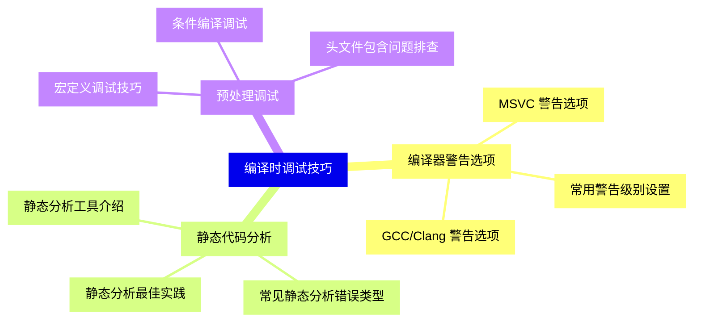

{}

### 3 运行时调试技巧{#3}

{}
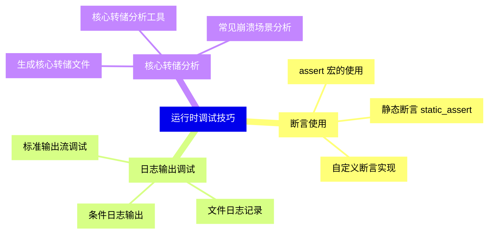

<--->
{}
{}
{}
{}
{}
{}
{}
{}
{}
{}
{}
{}
{}
{}
{}
{}
{}
{}
{}
{}
{}
{}
{}
{}
{}

### 4 调试器使用技巧{#4}

{}
{}
{}
{}
{}
{}
{}
{}
{}
{}
{}
{}
{}
{}
{}
{}
{}
{}
{}
{}
{}
{}
{}
{}
{}
{}
{}
<--->
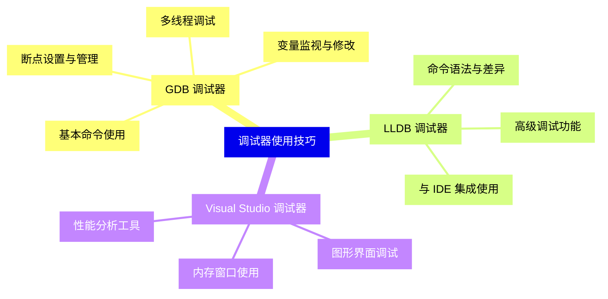

{}

### 5 内存调试技巧{#5}

{}
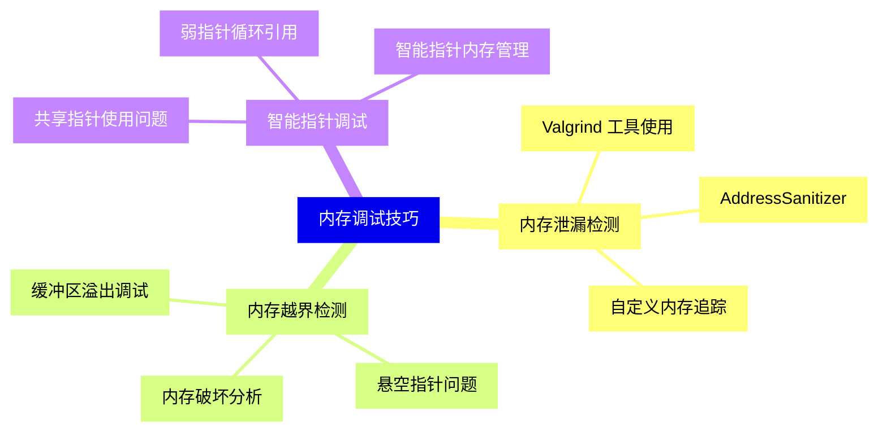

<--->
{}
{}
{}
{}
{}
{}
{}
{}
{}
{}
{}
{}
{}
{}
{}
{}
{}
{}
{}
{}
{}
{}
{}
{}
{}

### 6 多线程调试技巧{#6}

{}
{}
{}
{}
{}
{}
{}
{}
{}
{}
{}
{}
{}
{}
{}
{}
{}
{}
{}
{}
{}
{}
{}
{}
{}
<--->
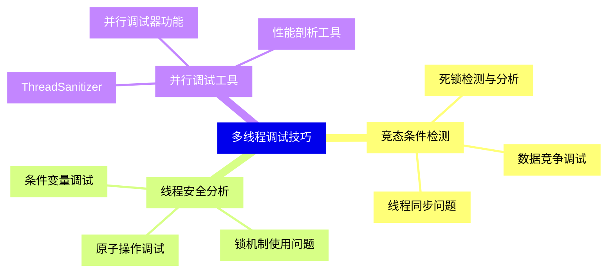

{}

### 7 性能调试技巧{#7}

{}
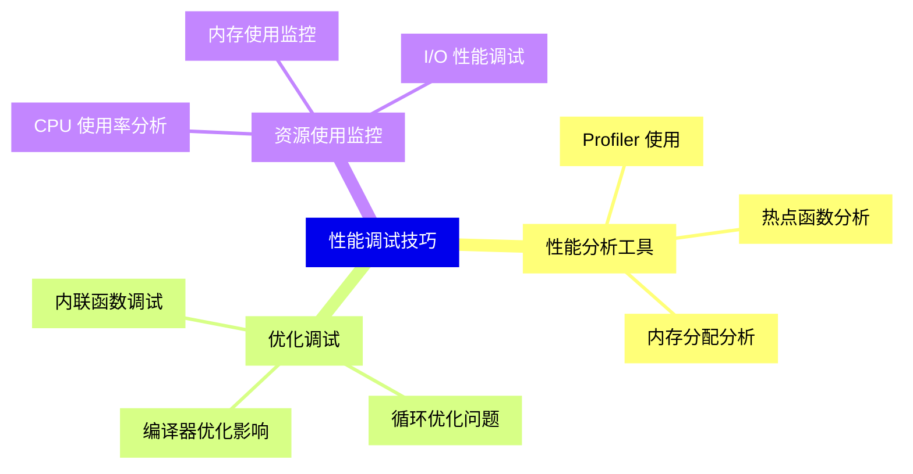

<--->
{}
{}
{}
{}
{}
{}
{}
{}
{}
{}
{}
{}
{}
{}
{}
{}
{}
{}
{}
{}
{}
{}
{}
{}
{}

### 8 高级调试技术{#8}

{}
{}
{}
{}
{}
{}
{}
{}
{}
{}
{}
{}
{}
{}
{}
{}
{}
{}
{}
{}
{}
{}
{}
{}
{}
<--->
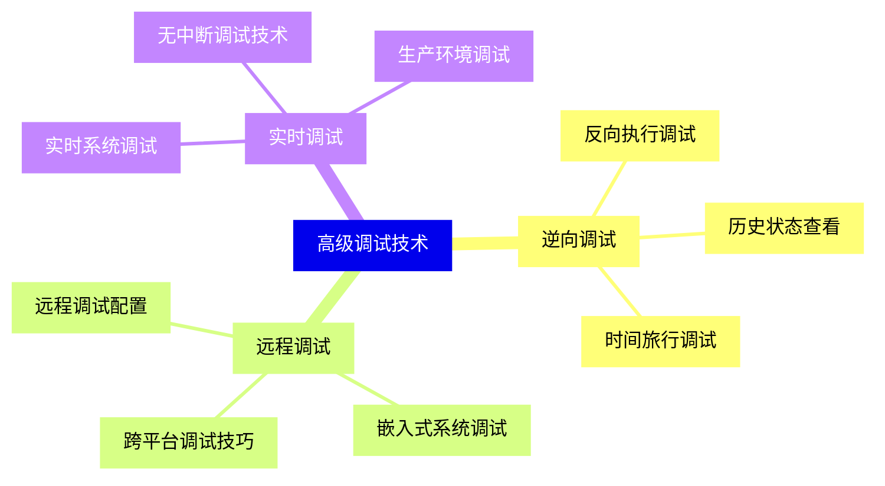

{}

### 9 调试工具链{#9}

{}
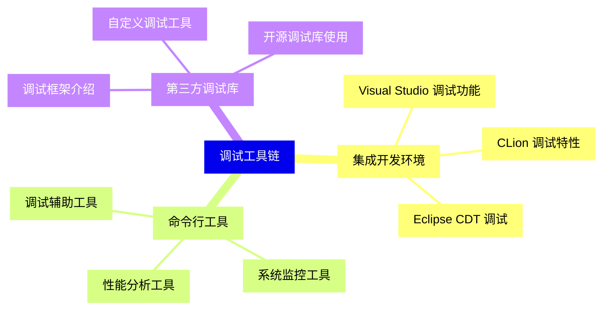

<--->
{}
{}
{}
{}
{}
{}
{}
{}
{}
{}
{}
{}
{}
{}
{}
{}
{}
{}
{}
{}
{}
{}
{}
{}
{}

### 10 调试最佳实践{#10}

{}
{}
{}
{}
{}
{}
{}
{}
{}
{}
{}
{}
{}
{}
{}
{}
{}
{}
{}
{}
{}
{}
{}
{}
{}
<--->
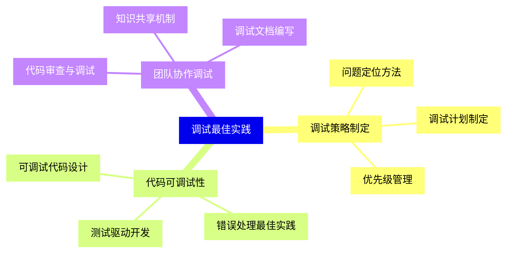

{}

### 11 特殊场景调试{#11}

{}
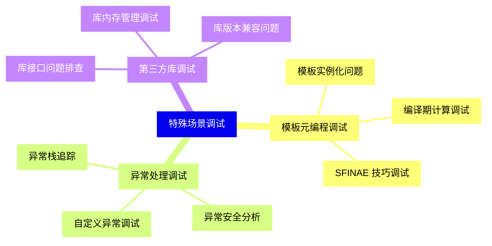

<--->
{}
{}
{}
{}
{}
{}
{}
{}
{}
{}
{}
{}
{}
{}
{}
{}
{}
{}
{}
{}
{}
{}
{}
{}
{}

### 12 自动化调试{#12}

{}
{}
{}
{}
{}
{}
{}
{}
{}
{}
{}
{}
{}
{}
{}
{}
{}
{}
{}
{}
{}
{}
{}
{}
{}
<--->
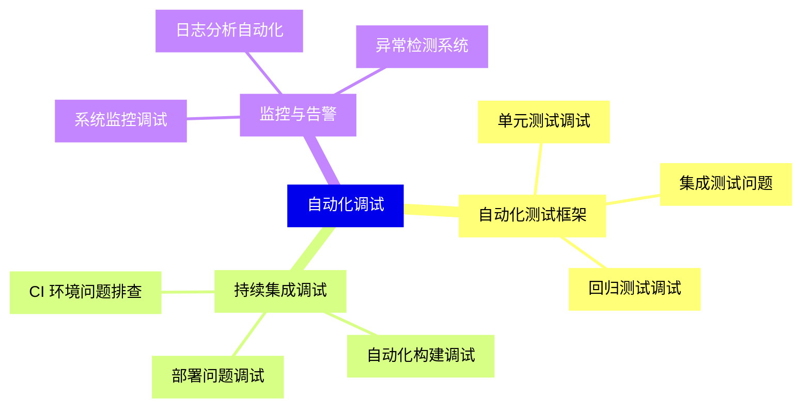

{}
