
### 1 [运算符基础概念](#1)
#### 1.1 [运算符的定义与分类](#1)
##### 1.1.1 [运算符的基本概念](#1)
##### 1.1.2 [按操作数数量分类](#1)
##### 1.1.3 [按功能分类](#1)
##### 1.1.4 [运算符优先级与结合性](#1)
#### 1.2 [表达式的基本概念](#1)
##### 1.2.1 [表达式的定义与组成](#1)
##### 1.2.2 [表达式的类型与值](#1)
##### 1.2.3 [表达式的求值顺序](#1)
### 2 [算术运算符](#2)
#### 2.1 [基本算术运算符](#2)
##### 2.1.1 [加法运算符 +](#2)
##### 2.1.2 [减法运算符 -](#2)
##### 2.1.3 [乘法运算符 *](#2)
##### 2.1.4 [除法运算符 /](#2)
##### 2.1.5 [取模运算符 %](#2)
#### 2.2 [一元算术运算符](#2)
##### 2.2.1 [正号运算符 +](#2)
##### 2.2.2 [负号运算符 -](#2)
#### 2.3 [算术运算中的类型转换](#2)
##### 2.3.1 [隐式类型转换](#2)
##### 2.3.2 [显式类型转换](#2)
##### 2.3.3 [算术溢出与精度问题](#2)
### 3 [关系运算符](#3)
#### 3.1 [比较运算符](#3)
##### 3.1.1 [等于运算符 ==](#3)
##### 3.1.2 [不等于运算符 !=](#3)
##### 3.1.3 [大于运算符 >](#3)
##### 3.1.4 [小于运算符 <](#3)
##### 3.1.5 [大于等于运算符 >=](#3)
##### 3.1.6 [小于等于运算符 <=](#3)
#### 3.2 [关系表达式的应用](#3)
##### 3.2.1 [条件判断](#3)
##### 3.2.2 [循环控制](#3)
##### 3.2.3 [逻辑组合](#3)
### 4 [逻辑运算符](#4)
#### 4.1 [基本逻辑运算符](#4)
##### 4.1.1 [逻辑与运算符 &&](#4)
##### 4.1.2 [逻辑或运算符 ||](#4)
##### 4.1.3 [逻辑非运算符 !](#4)
#### 4.2 [逻辑运算的短路求值](#4)
##### 4.2.1 [短路求值原理](#4)
##### 4.2.2 [短路求值的应用场景](#4)
##### 4.2.3 [避免副作用的影响](#4)
### 5 [位运算符](#5)
#### 5.1 [位逻辑运算符](#5)
##### 5.1.1 [按位与运算符 &](#5)
##### 5.1.2 [按位或运算符 |](#5)
##### 5.1.3 [按位异或运算符 ^](#5)
##### 5.1.4 [按位取反运算符 ~](#5)
#### 5.2 [位移运算符](#5)
##### 5.2.1 [左移运算符 <<](#5)
##### 5.2.2 [右移运算符 >>](#5)
##### 5.2.3 [位移运算的符号处理](#5)
#### 5.3 [位运算的应用](#5)
##### 5.3.1 [位掩码操作](#5)
##### 5.3.2 [权限控制](#5)
##### 5.3.3 [性能优化](#5)
### 6 [赋值运算符](#6)
#### 6.1 [基本赋值运算符](#6)
##### 6.1.1 [简单赋值 =](#6)
##### 6.1.2 [复合赋值运算符](#6)
#### 6.2 [复合赋值运算符详解](#6)
##### 6.2.1 [算术复合赋值](#6)
##### 6.2.2 [位运算复合赋值](#6)
##### 6.2.3 [复合赋值的效率优势](#6)
#### 6.3 [赋值表达式](#6)
##### 6.3.1 [赋值表达式的值](#6)
##### 6.3.2 [多重赋值](#6)
##### 6.3.3 [赋值与初始化](#6)
### 7 [自增自减运算符](#7)
#### 7.1 [自增运算符](#7)
##### 7.1.1 [前缀自增 ++x](#7)
##### 7.1.2 [后缀自增 x++](#7)
#### 7.2 [自减运算符](#7)
##### 7.2.1 [前缀自减 --x](#7)
##### 7.2.2 [后缀自减 x--](#7)
#### 7.3 [自增自减的注意事项](#7)
##### 7.3.1 [求值顺序问题](#7)
##### 7.3.2 [副作用的影响](#7)
##### 7.3.3 [最佳实践](#7)
### 8 [条件运算符](#8)
#### 8.1 [三元条件运算符](#8)
##### 8.1.1 [基本语法结构](#8)
##### 8.1.2 [条件运算符的嵌套](#8)
#### 8.2 [条件运算符的应用](#8)
##### 8.2.1 [条件赋值](#8)
##### 8.2.2 [简化条件判断](#8)
##### 8.2.3 [与if语句的比较](#8)
### 9 [逗号运算符](#9)
#### 9.1 [逗号运算符的基本用法](#9)
##### 9.1.1 [语法规则](#9)
##### 9.1.2 [求值顺序](#9)
#### 9.2 [逗号运算符的应用场景](#9)
##### 9.2.1 [for循环中的使用](#9)
##### 9.2.2 [表达式序列](#9)
##### 9.2.3 [注意事项](#9)
### 10 [特殊运算符](#10)
#### 10.1 [sizeof运算符](#10)
##### 10.1.1 [基本用法](#10)
##### 10.1.2 [应用场景](#10)
#### 10.2 [类型转换运算符](#10)
##### 10.2.1 [静态类型转换 static_cast](#10)
##### 10.2.2 [动态类型转换 dynamic_cast](#10)
##### 10.2.3 [常量类型转换 const_cast](#10)
##### 10.2.4 [重新解释转换 reinterpret_cast](#10)
#### 10.3 [成员访问运算符](#10)
##### 10.3.1 [点运算符 .](#10)
##### 10.3.2 [箭头运算符 ->](#10)
#### 10.4 [作用域解析运算符](#10)
##### 10.4.1 [全局作用域 ::](#10)
##### 10.4.2 [命名空间作用域](#10)
##### 10.4.3 [类作用域](#10)
### 11 [运算符重载](#11)
#### 11.1 [运算符重载基础](#11)
##### 11.1.1 [重载的概念](#11)
##### 11.1.2 [可重载的运算符](#11)
##### 11.1.3 [不可重载的运算符](#11)
#### 11.2 [运算符重载的实现](#11)
##### 11.2.1 [成员函数重载](#11)
##### 11.2.2 [友元函数重载](#11)
##### 11.2.3 [重载规则与限制](#11)
#### 11.3 [常用运算符重载示例](#11)
##### 11.3.1 [算术运算符重载](#11)
##### 11.3.2 [关系运算符重载](#11)
##### 11.3.3 [输入输出运算符重载](#11)
### 12 [表达式求值与优化](#12)
#### 12.1 [表达式求值规则](#12)
##### 12.1.1 [优先级规则](#12)
##### 12.1.2 [结合性规则](#12)
##### 12.1.3 [求值顺序规则](#12)
#### 12.2 [表达式优化技术](#12)
##### 12.2.1 [常量表达式求值](#12)
##### 12.2.2 [公共子表达式消除](#12)
##### 12.2.3 [强度削弱](#12)
#### 12.3 [表达式中的陷阱](#12)
##### 12.3.1 [未定义行为](#12)
##### 12.3.2 [序列点问题](#12)
##### 12.3.3 [类型安全问题](#12)
### 13 [运算符与表达式实战应用](#13)
#### 13.1 [常见编程模式](#13)
##### 13.1.1 [条件判断模式](#13)
##### 13.1.2 [循环控制模式](#13)
##### 13.1.3 [位操作模式](#13)
#### 13.2 [性能优化技巧](#13)
##### 13.2.1 [运算符选择优化](#13)
##### 13.2.2 [表达式重构](#13)
##### 13.2.3 [避免不必要的计算](#13)
#### 13.3 [调试与错误处理](#13)
##### 13.3.1 [常见运算符错误](#13)
##### 13.3.2 [调试技巧](#13)
##### 13.3.3 [最佳实践总结](#13)




### 1 运算符基础概念

---
### 1 运算符基础概念
___
#### 1.1 运算符的定义与分类
___
##### 1.1.1 运算符的基本概念
___
##### 1.1.2 按操作数数量分类
___
##### 1.1.3 按功能分类
___
##### 1.1.4 运算符优先级与结合性
___
#### 1.2 表达式的基本概念
___
##### 1.2.1 表达式的定义与组成
___
##### 1.2.2 表达式的类型与值
___
##### 1.2.3 表达式的求值顺序
### 2 算术运算符

---
### 2 算术运算符
___
#### 2.1 基本算术运算符
___
##### 2.1.1 加法运算符 +
___
##### 2.1.2 减法运算符 -
___
##### 2.1.3 乘法运算符 *
___
##### 2.1.4 除法运算符 /
___
##### 2.1.5 取模运算符 %
___
#### 2.2 一元算术运算符
___
##### 2.2.1 正号运算符 +
___
##### 2.2.2 负号运算符 -
___
#### 2.3 算术运算中的类型转换
___
##### 2.3.1 隐式类型转换
___
##### 2.3.2 显式类型转换
___
##### 2.3.3 算术溢出与精度问题
### 3 关系运算符

---
### 3 关系运算符
___
#### 3.1 比较运算符
___
##### 3.1.1 等于运算符 ==
___
##### 3.1.2 不等于运算符 !=
___
##### 3.1.3 大于运算符 >
___
##### 3.1.4 小于运算符 <
___
##### 3.1.5 大于等于运算符 >=
___
##### 3.1.6 小于等于运算符 <=
___
#### 3.2 关系表达式的应用
___
##### 3.2.1 条件判断
___
##### 3.2.2 循环控制
___
##### 3.2.3 逻辑组合
### 4 逻辑运算符

---
### 4 逻辑运算符
___
#### 4.1 基本逻辑运算符
___
##### 4.1.1 逻辑与运算符 &&
___
##### 4.1.2 逻辑或运算符 ||
___
##### 4.1.3 逻辑非运算符 !
___
#### 4.2 逻辑运算的短路求值
___
##### 4.2.1 短路求值原理
___
##### 4.2.2 短路求值的应用场景
___
##### 4.2.3 避免副作用的影响
### 5 位运算符

---
### 5 位运算符
___
#### 5.1 位逻辑运算符
___
##### 5.1.1 按位与运算符 &
___
##### 5.1.2 按位或运算符 |
___
##### 5.1.3 按位异或运算符 ^
___
##### 5.1.4 按位取反运算符 ~
___
#### 5.2 位移运算符
___
##### 5.2.1 左移运算符 <<
___
##### 5.2.2 右移运算符 >>
___
##### 5.2.3 位移运算的符号处理
___
#### 5.3 位运算的应用
___
##### 5.3.1 位掩码操作
___
##### 5.3.2 权限控制
___
##### 5.3.3 性能优化
### 6 赋值运算符

---
### 6 赋值运算符
___
#### 6.1 基本赋值运算符
___
##### 6.1.1 简单赋值 =
___
##### 6.1.2 复合赋值运算符
___
#### 6.2 复合赋值运算符详解
___
##### 6.2.1 算术复合赋值
___
##### 6.2.2 位运算复合赋值
___
##### 6.2.3 复合赋值的效率优势
___
#### 6.3 赋值表达式
___
##### 6.3.1 赋值表达式的值
___
##### 6.3.2 多重赋值
___
##### 6.3.3 赋值与初始化
### 7 自增自减运算符

---
### 7 自增自减运算符
___
#### 7.1 自增运算符
___
##### 7.1.1 前缀自增 ++x
___
##### 7.1.2 后缀自增 x++
___
#### 7.2 自减运算符
___
##### 7.2.1 前缀自减 --x
___
##### 7.2.2 后缀自减 x--
___
#### 7.3 自增自减的注意事项
___
##### 7.3.1 求值顺序问题
___
##### 7.3.2 副作用的影响
___
##### 7.3.3 最佳实践
### 8 条件运算符

---
### 8 条件运算符
___
#### 8.1 三元条件运算符
___
##### 8.1.1 基本语法结构
___
##### 8.1.2 条件运算符的嵌套
___
#### 8.2 条件运算符的应用
___
##### 8.2.1 条件赋值
___
##### 8.2.2 简化条件判断
___
##### 8.2.3 与if语句的比较
### 9 逗号运算符

---
### 9 逗号运算符
___
#### 9.1 逗号运算符的基本用法
___
##### 9.1.1 语法规则
___
##### 9.1.2 求值顺序
___
#### 9.2 逗号运算符的应用场景
___
##### 9.2.1 for循环中的使用
___
##### 9.2.2 表达式序列
___
##### 9.2.3 注意事项
### 10 特殊运算符

---
### 10 特殊运算符
___
#### 10.1 sizeof运算符
___
##### 10.1.1 基本用法
___
##### 10.1.2 应用场景
___
#### 10.2 类型转换运算符
___
##### 10.2.1 静态类型转换 static_cast
___
##### 10.2.2 动态类型转换 dynamic_cast
___
##### 10.2.3 常量类型转换 const_cast
___
##### 10.2.4 重新解释转换 reinterpret_cast
___
#### 10.3 成员访问运算符
___
##### 10.3.1 点运算符 .
___
##### 10.3.2 箭头运算符 ->
___
#### 10.4 作用域解析运算符
___
##### 10.4.1 全局作用域 ::
___
##### 10.4.2 命名空间作用域
___
##### 10.4.3 类作用域
### 11 运算符重载

---
### 11 运算符重载
___
#### 11.1 运算符重载基础
___
##### 11.1.1 重载的概念
___
##### 11.1.2 可重载的运算符
___
##### 11.1.3 不可重载的运算符
___
#### 11.2 运算符重载的实现
___
##### 11.2.1 成员函数重载
___
##### 11.2.2 友元函数重载
___
##### 11.2.3 重载规则与限制
___
#### 11.3 常用运算符重载示例
___
##### 11.3.1 算术运算符重载
___
##### 11.3.2 关系运算符重载
___
##### 11.3.3 输入输出运算符重载
### 12 表达式求值与优化

---
### 12 表达式求值与优化
___
#### 12.1 表达式求值规则
___
##### 12.1.1 优先级规则
___
##### 12.1.2 结合性规则
___
##### 12.1.3 求值顺序规则
___
#### 12.2 表达式优化技术
___
##### 12.2.1 常量表达式求值
___
##### 12.2.2 公共子表达式消除
___
##### 12.2.3 强度削弱
___
#### 12.3 表达式中的陷阱
___
##### 12.3.1 未定义行为
___
##### 12.3.2 序列点问题
___
##### 12.3.3 类型安全问题
### 13 运算符与表达式实战应用

---
### 13 运算符与表达式实战应用
___
#### 13.1 常见编程模式
___
##### 13.1.1 条件判断模式
___
##### 13.1.2 循环控制模式
___
##### 13.1.3 位操作模式
___
#### 13.2 性能优化技巧
___
##### 13.2.1 运算符选择优化
___
##### 13.2.2 表达式重构
___
##### 13.2.3 避免不必要的计算
___
#### 13.3 调试与错误处理
___
##### 13.3.1 常见运算符错误
___
##### 13.3.2 调试技巧
___
##### 13.3.3 最佳实践总结


### 1 运算符基础概念{#1}

{}
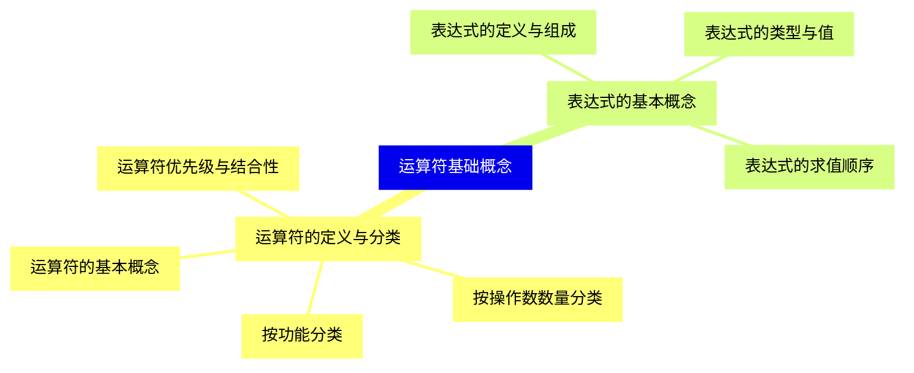

<--->
{}
{}
{}
{}
{}
{}
{}
{}
{}
{}
{}
{}
{}
{}
{}
{}
{}
{}
{}

### 2 算术运算符{#2}

{}
{}
{}
{}
{}
{}
{}
{}
{}
{}
{}
{{% details "取模运算符 %" %}}
{}
{}
{}
{}
{}
{}
{}
{}
{}
{}
{}
{}
{}
{}
{}
<--->
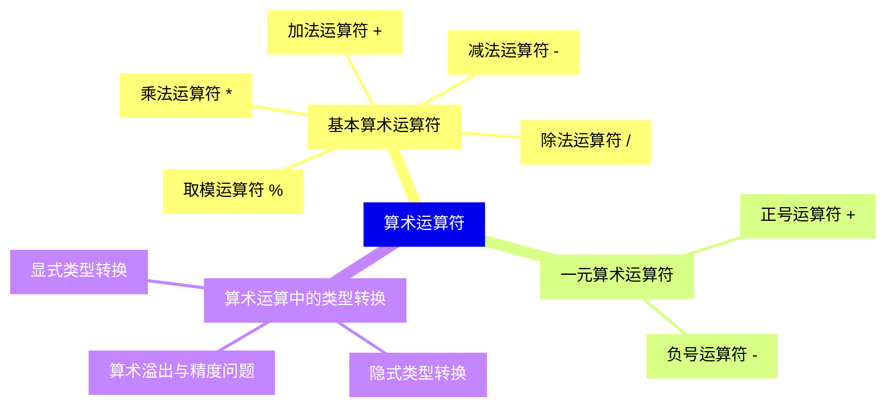

{}

### 3 关系运算符{#3}

{}
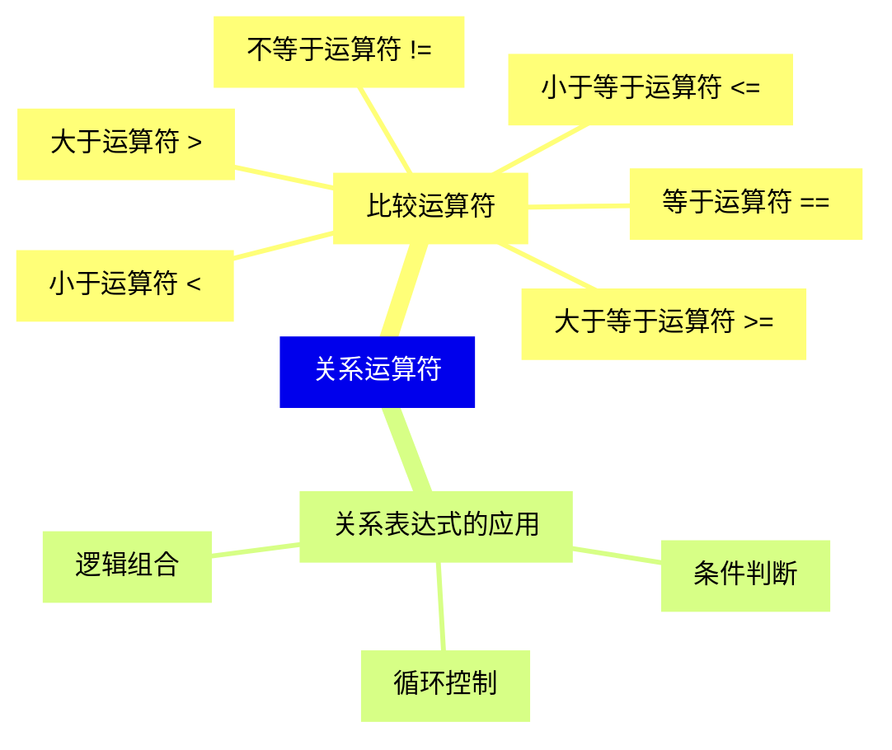

<--->
{}
{}
{}
{}
{}
{}
{}
{}
{}
{}
{}
{}
{}
{}
{}
{}
{}
{}
{}
{}
{}
{}
{}

### 4 逻辑运算符{#4}

{}
{}
{}
{}
{}
{}
{}
{}
{}
{}
{}
{}
{}
{}
{}
{}
{}
<--->
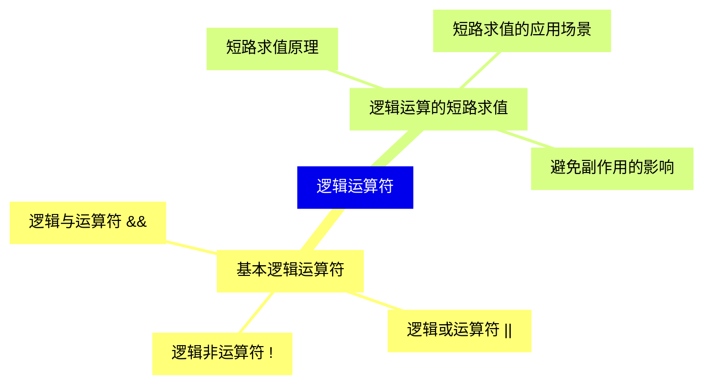

{}

### 5 位运算符{#5}

{}
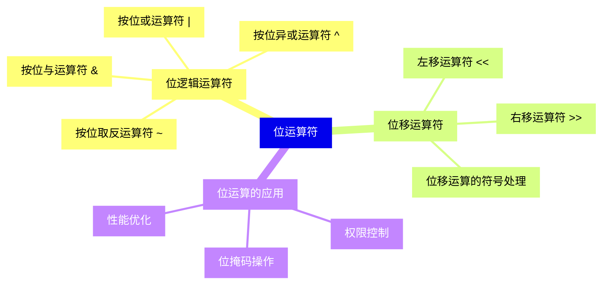

<--->
{}
{}
{}
{}
{}
{}
{}
{}
{}
{}
{}
{}
{}
{}
{}
{}
{}
{}
{}
{}
{}
{}
{}
{}
{}
{}
{}

### 6 赋值运算符{#6}

{}
{}
{}
{}
{}
{}
{}
{}
{}
{}
{}
{}
{}
{}
{}
{}
{}
{}
{}
{}
{}
{}
{}
<--->
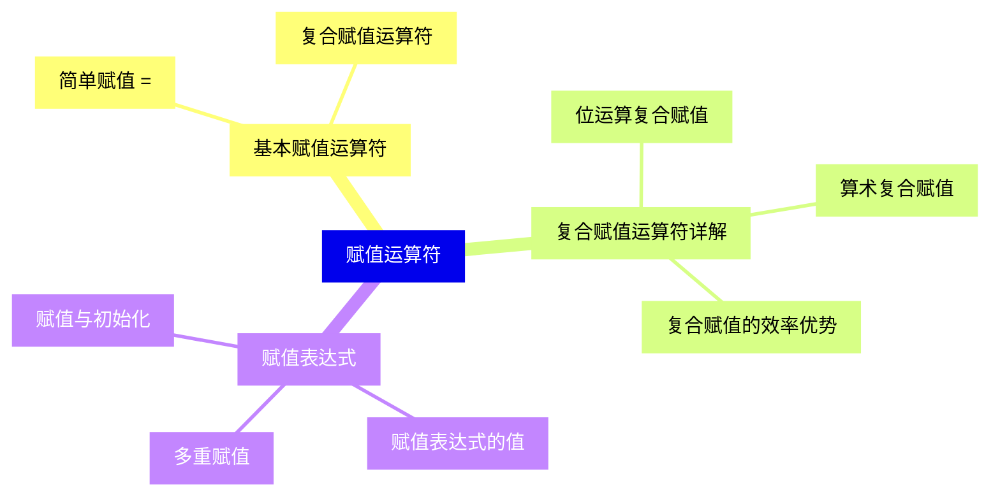

{}

### 7 自增自减运算符{#7}

{}
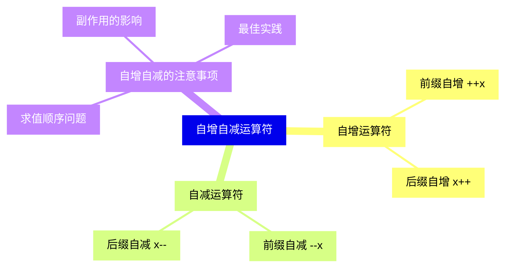

<--->
{}
{}
{}
{}
{}
{}
{}
{}
{}
{}
{}
{}
{}
{}
{}
{}
{}
{}
{}
{}
{}

### 8 条件运算符{#8}

{}
{}
{}
{}
{}
{}
{}
{}
{}
{}
{}
{}
{}
{}
{}
<--->
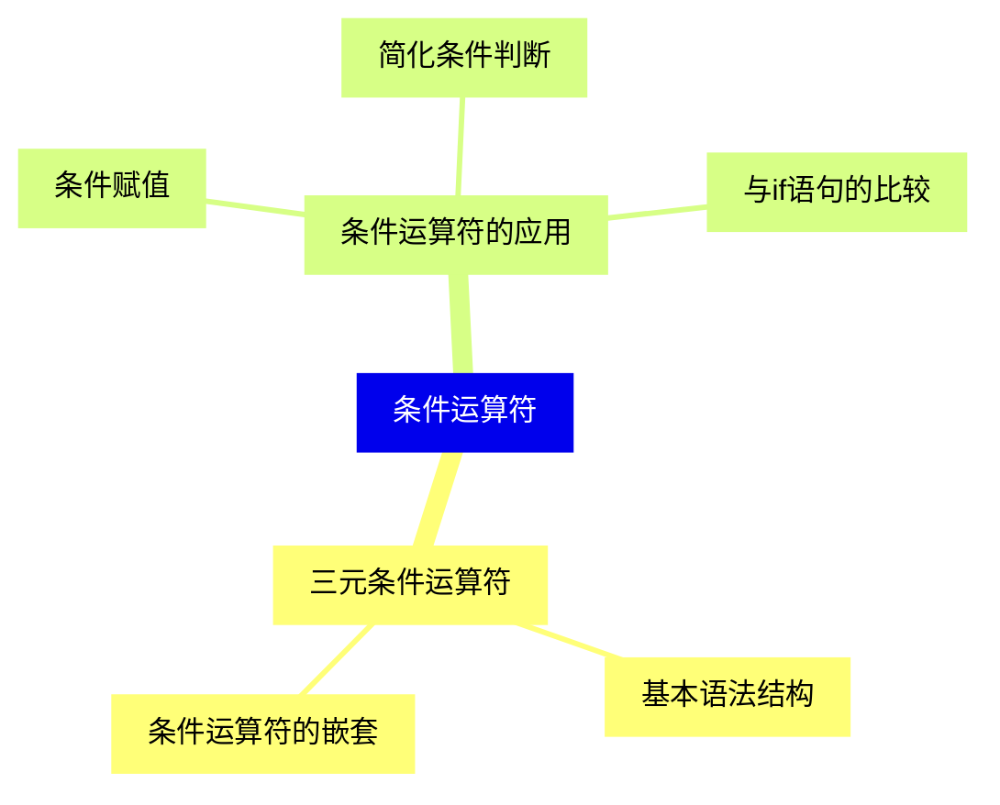

{}

### 9 逗号运算符{#9}

{}
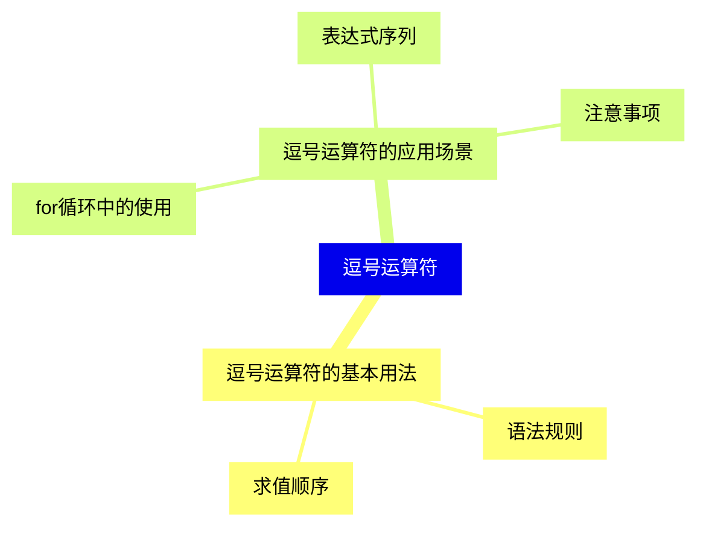

<--->
{}
{}
{}
{}
{}
{}
{}
{}
{}
{}
{}
{}
{}
{}
{}

### 10 特殊运算符{#10}

{}
{}
{}
{}
{}
{}
{}
{}
{}
{}
{}
{}
{}
{}
{}
{}
{}
{}
{}
{}
{}
{}
{}
{}
{}
{}
{}
{}
{}
{}
{}
<--->
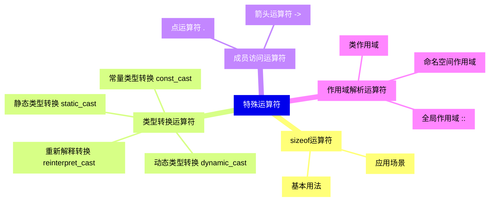

{}

### 11 运算符重载{#11}

{}
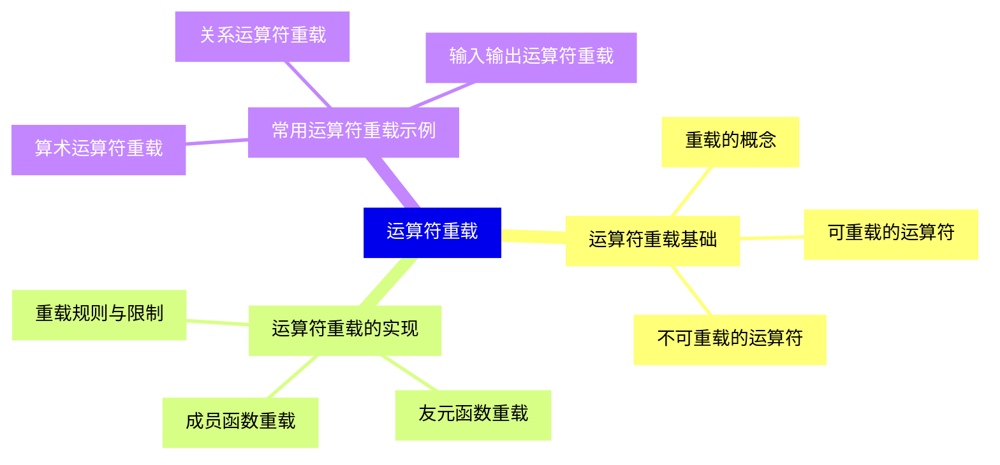

<--->
{}
{}
{}
{}
{}
{}
{}
{}
{}
{}
{}
{}
{}
{}
{}
{}
{}
{}
{}
{}
{}
{}
{}
{}
{}

### 12 表达式求值与优化{#12}

{}
{}
{}
{}
{}
{}
{}
{}
{}
{}
{}
{}
{}
{}
{}
{}
{}
{}
{}
{}
{}
{}
{}
{}
{}
<--->
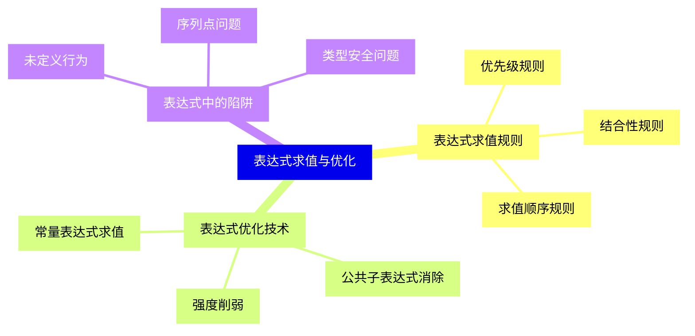

{}

### 13 运算符与表达式实战应用{#13}

{}
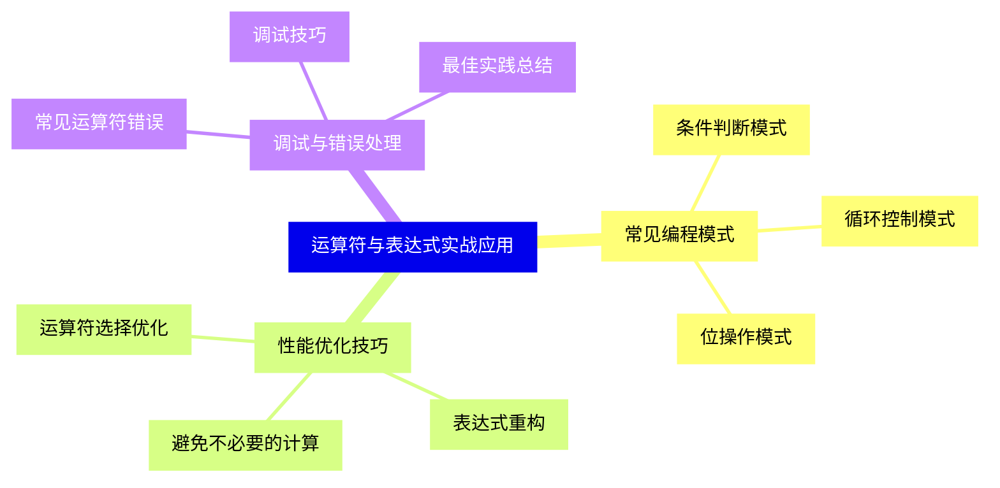

<--->
{}
{}
{}
{}
{}
{}
{}
{}
{}
{}
{}
{}
{}
{}
{}
{}
{}
{}
{}
{}
{}
{}
{}
{}
{}
