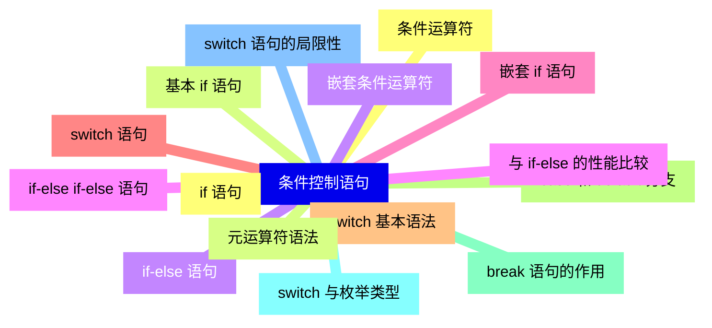
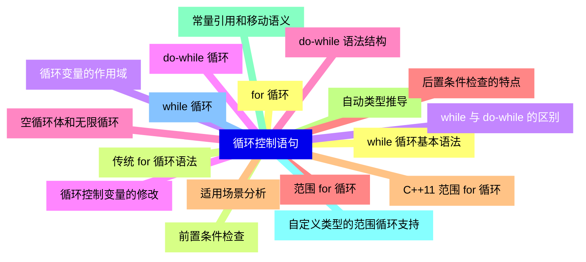
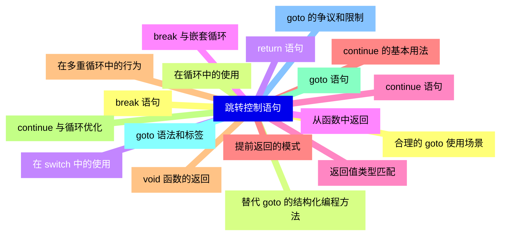
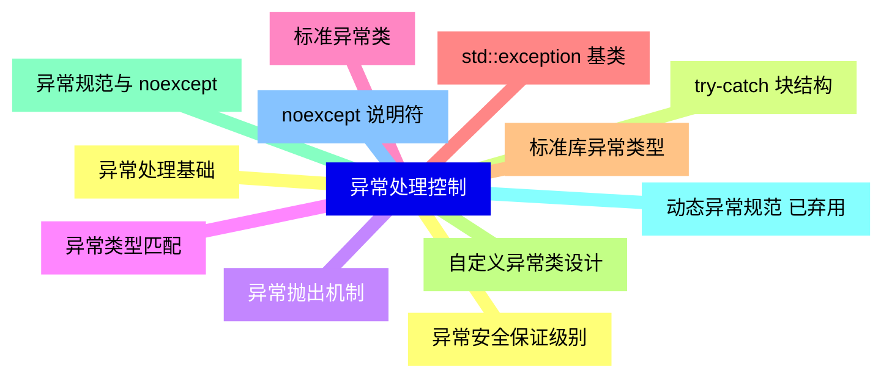
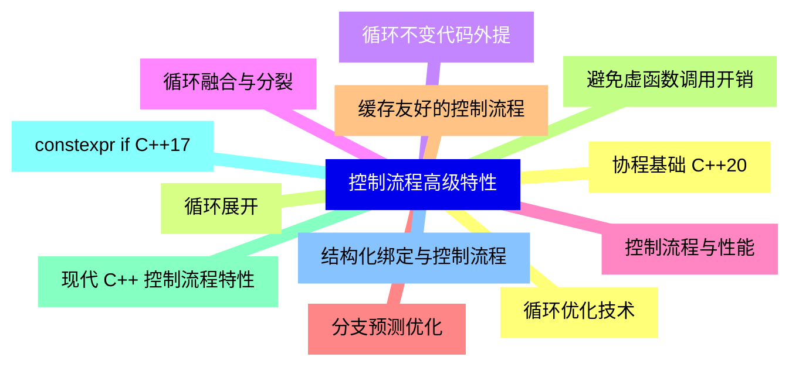
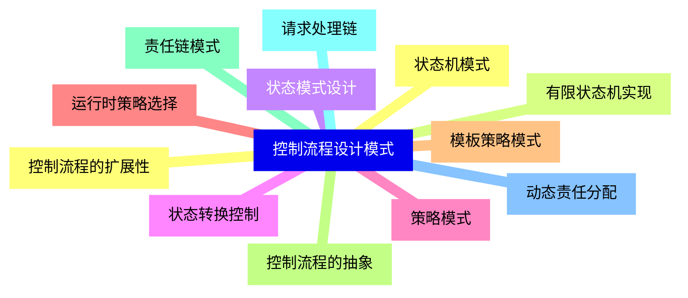
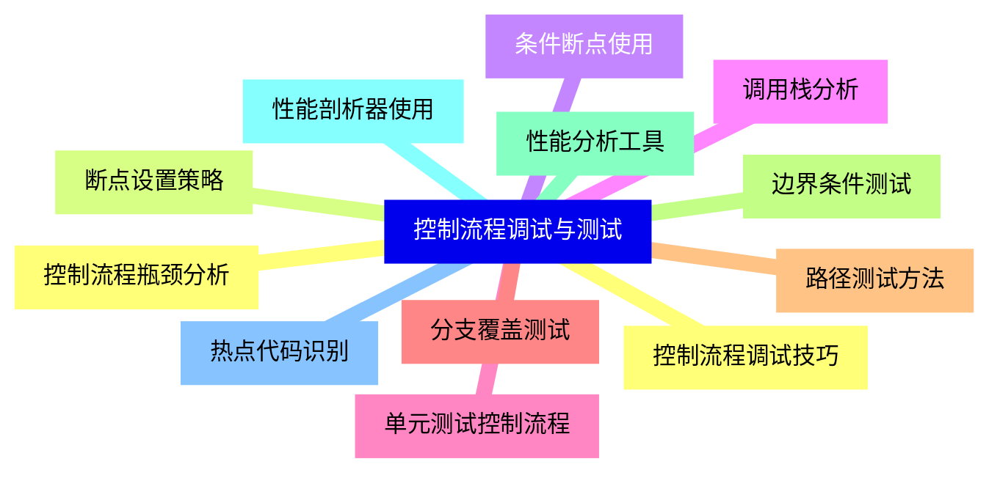
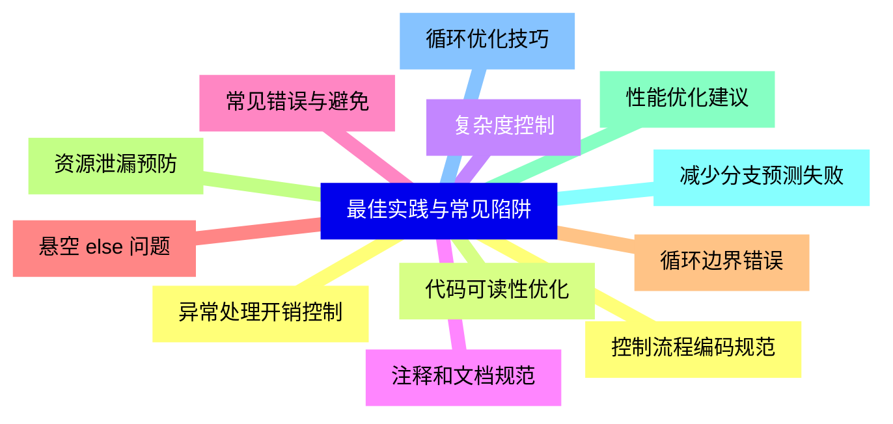


### 1 [条件控制语句](#1)
#### 1.1 [if 语句](#1)
#### 1.2 [基本 if 语句](#1)
#### 1.3 [if-else 语句](#1)
#### 1.4 [if-else if-else 语句](#1)
#### 1.5 [嵌套 if 语句](#1)
#### 1.6 [switch 语句](#1)
#### 1.7 [switch 基本语法](#1)
#### 1.8 [case 和 default 分支](#1)
#### 1.9 [break 语句的作用](#1)
#### 1.10 [switch 与枚举类型](#1)
#### 1.11 [switch 语句的局限性](#1)
#### 1.12 [条件运算符](#1)
#### 1.13 [元运算符语法](#1)
#### 1.14 [嵌套条件运算符](#1)
#### 1.15 [与 if-else 的性能比较](#1)
### 2 [循环控制语句](#2)
#### 2.1 [for 循环](#2)
#### 2.2 [传统 for 循环语法](#2)
#### 2.3 [循环变量的作用域](#2)
#### 2.4 [循环控制变量的修改](#2)
#### 2.5 [空循环体和无限循环](#2)
#### 2.6 [范围 for 循环](#2)
#### 2.7 [C++11 范围 for 循环](#2)
#### 2.8 [自动类型推导](#2)
#### 2.9 [常量引用和移动语义](#2)
#### 2.10 [自定义类型的范围循环支持](#2)
#### 2.11 [while 循环](#2)
#### 2.12 [while 循环基本语法](#2)
#### 2.13 [前置条件检查](#2)
#### 2.14 [while 与 do-while 的区别](#2)
#### 2.15 [do-while 循环](#2)
#### 2.16 [do-while 语法结构](#2)
#### 2.17 [后置条件检查的特点](#2)
#### 2.18 [适用场景分析](#2)
### 3 [跳转控制语句](#3)
#### 3.1 [break 语句](#3)
#### 3.2 [在循环中的使用](#3)
#### 3.3 [在 switch 中的使用](#3)
#### 3.4 [break 与嵌套循环](#3)
#### 3.5 [continue 语句](#3)
#### 3.6 [continue 的基本用法](#3)
#### 3.7 [在多重循环中的行为](#3)
#### 3.8 [continue 与循环优化](#3)
#### 3.9 [goto 语句](#3)
#### 3.10 [goto 语法和标签](#3)
#### 3.11 [goto 的争议和限制](#3)
#### 3.12 [合理的 goto 使用场景](#3)
#### 3.13 [替代 goto 的结构化编程方法](#3)
#### 3.14 [return 语句](#3)
#### 3.15 [从函数中返回](#3)
#### 3.16 [返回值类型匹配](#3)
#### 3.17 [提前返回的模式](#3)
#### 3.18 [void 函数的返回](#3)
### 4 [异常处理控制](#4)
#### 4.1 [异常处理基础](#4)
#### 4.2 [try-catch 块结构](#4)
#### 4.3 [异常抛出机制](#4)
#### 4.4 [异常类型匹配](#4)
#### 4.5 [标准异常类](#4)
#### 4.6 [std::exception 基类](#4)
#### 4.7 [标准库异常类型](#4)
#### 4.8 [自定义异常类设计](#4)
#### 4.9 [异常规范与 noexcept](#4)
#### 4.10 [动态异常规范 已弃用](#4)
#### 4.11 [noexcept 说明符](#4)
#### 4.12 [异常安全保证级别](#4)
### 5 [控制流程高级特性](#5)
#### 5.1 [循环优化技术](#5)
#### 5.2 [循环展开](#5)
#### 5.3 [循环不变代码外提](#5)
#### 5.4 [循环融合与分裂](#5)
#### 5.5 [控制流程与性能](#5)
#### 5.6 [分支预测优化](#5)
#### 5.7 [缓存友好的控制流程](#5)
#### 5.8 [避免虚函数调用开销](#5)
#### 5.9 [现代 C++ 控制流程特性](#5)
#### 5.10 [constexpr if C++17](#5)
#### 5.11 [结构化绑定与控制流程](#5)
#### 5.12 [协程基础 C++20](#5)
### 6 [控制流程设计模式](#6)
#### 6.1 [状态机模式](#6)
#### 6.2 [有限状态机实现](#6)
#### 6.3 [状态模式设计](#6)
#### 6.4 [状态转换控制](#6)
#### 6.5 [策略模式](#6)
#### 6.6 [运行时策略选择](#6)
#### 6.7 [模板策略模式](#6)
#### 6.8 [控制流程的抽象](#6)
#### 6.9 [责任链模式](#6)
#### 6.10 [请求处理链](#6)
#### 6.11 [动态责任分配](#6)
#### 6.12 [控制流程的扩展性](#6)
### 7 [控制流程调试与测试](#7)
#### 7.1 [控制流程调试技巧](#7)
#### 7.2 [断点设置策略](#7)
#### 7.3 [条件断点使用](#7)
#### 7.4 [调用栈分析](#7)
#### 7.5 [单元测试控制流程](#7)
#### 7.6 [分支覆盖测试](#7)
#### 7.7 [路径测试方法](#7)
#### 7.8 [边界条件测试](#7)
#### 7.9 [性能分析工具](#7)
#### 7.10 [性能剖析器使用](#7)
#### 7.11 [热点代码识别](#7)
#### 7.12 [控制流程瓶颈分析](#7)
### 8 [最佳实践与常见陷阱](#8)
#### 8.1 [控制流程编码规范](#8)
#### 8.2 [代码可读性优化](#8)
#### 8.3 [复杂度控制](#8)
#### 8.4 [注释和文档规范](#8)
#### 8.5 [常见错误与避免](#8)
#### 8.6 [悬空 else 问题](#8)
#### 8.7 [循环边界错误](#8)
#### 8.8 [资源泄漏预防](#8)
#### 8.9 [性能优化建议](#8)
#### 8.10 [减少分支预测失败](#8)
#### 8.11 [循环优化技巧](#8)
#### 8.12 [异常处理开销控制](#8)




### 1 条件控制语句

---
### 1 条件控制语句
___
#### 1.1 if 语句
___
#### 1.2 基本 if 语句
___
#### 1.3 if-else 语句
___
#### 1.4 if-else if-else 语句
___
#### 1.5 嵌套 if 语句
___
#### 1.6 switch 语句
___
#### 1.7 switch 基本语法
___
#### 1.8 case 和 default 分支
___
#### 1.9 break 语句的作用
___
#### 1.10 switch 与枚举类型
___
#### 1.11 switch 语句的局限性
___
#### 1.12 条件运算符
___
#### 1.13 元运算符语法
___
#### 1.14 嵌套条件运算符
___
#### 1.15 与 if-else 的性能比较
### 2 循环控制语句

---
### 2 循环控制语句
___
#### 2.1 for 循环
___
#### 2.2 传统 for 循环语法
___
#### 2.3 循环变量的作用域
___
#### 2.4 循环控制变量的修改
___
#### 2.5 空循环体和无限循环
___
#### 2.6 范围 for 循环
___
#### 2.7 C++11 范围 for 循环
___
#### 2.8 自动类型推导
___
#### 2.9 常量引用和移动语义
___
#### 2.10 自定义类型的范围循环支持
___
#### 2.11 while 循环
___
#### 2.12 while 循环基本语法
___
#### 2.13 前置条件检查
___
#### 2.14 while 与 do-while 的区别
___
#### 2.15 do-while 循环
___
#### 2.16 do-while 语法结构
___
#### 2.17 后置条件检查的特点
___
#### 2.18 适用场景分析
### 3 跳转控制语句

---
### 3 跳转控制语句
___
#### 3.1 break 语句
___
#### 3.2 在循环中的使用
___
#### 3.3 在 switch 中的使用
___
#### 3.4 break 与嵌套循环
___
#### 3.5 continue 语句
___
#### 3.6 continue 的基本用法
___
#### 3.7 在多重循环中的行为
___
#### 3.8 continue 与循环优化
___
#### 3.9 goto 语句
___
#### 3.10 goto 语法和标签
___
#### 3.11 goto 的争议和限制
___
#### 3.12 合理的 goto 使用场景
___
#### 3.13 替代 goto 的结构化编程方法
___
#### 3.14 return 语句
___
#### 3.15 从函数中返回
___
#### 3.16 返回值类型匹配
___
#### 3.17 提前返回的模式
___
#### 3.18 void 函数的返回
### 4 异常处理控制

---
### 4 异常处理控制
___
#### 4.1 异常处理基础
___
#### 4.2 try-catch 块结构
___
#### 4.3 异常抛出机制
___
#### 4.4 异常类型匹配
___
#### 4.5 标准异常类
___
#### 4.6 std::exception 基类
___
#### 4.7 标准库异常类型
___
#### 4.8 自定义异常类设计
___
#### 4.9 异常规范与 noexcept
___
#### 4.10 动态异常规范 已弃用
___
#### 4.11 noexcept 说明符
___
#### 4.12 异常安全保证级别
### 5 控制流程高级特性

---
### 5 控制流程高级特性
___
#### 5.1 循环优化技术
___
#### 5.2 循环展开
___
#### 5.3 循环不变代码外提
___
#### 5.4 循环融合与分裂
___
#### 5.5 控制流程与性能
___
#### 5.6 分支预测优化
___
#### 5.7 缓存友好的控制流程
___
#### 5.8 避免虚函数调用开销
___
#### 5.9 现代 C++ 控制流程特性
___
#### 5.10 constexpr if C++17
___
#### 5.11 结构化绑定与控制流程
___
#### 5.12 协程基础 C++20
### 6 控制流程设计模式

---
### 6 控制流程设计模式
___
#### 6.1 状态机模式
___
#### 6.2 有限状态机实现
___
#### 6.3 状态模式设计
___
#### 6.4 状态转换控制
___
#### 6.5 策略模式
___
#### 6.6 运行时策略选择
___
#### 6.7 模板策略模式
___
#### 6.8 控制流程的抽象
___
#### 6.9 责任链模式
___
#### 6.10 请求处理链
___
#### 6.11 动态责任分配
___
#### 6.12 控制流程的扩展性
### 7 控制流程调试与测试

---
### 7 控制流程调试与测试
___
#### 7.1 控制流程调试技巧
___
#### 7.2 断点设置策略
___
#### 7.3 条件断点使用
___
#### 7.4 调用栈分析
___
#### 7.5 单元测试控制流程
___
#### 7.6 分支覆盖测试
___
#### 7.7 路径测试方法
___
#### 7.8 边界条件测试
___
#### 7.9 性能分析工具
___
#### 7.10 性能剖析器使用
___
#### 7.11 热点代码识别
___
#### 7.12 控制流程瓶颈分析
### 8 最佳实践与常见陷阱

---
### 8 最佳实践与常见陷阱
___
#### 8.1 控制流程编码规范
___
#### 8.2 代码可读性优化
___
#### 8.3 复杂度控制
___
#### 8.4 注释和文档规范
___
#### 8.5 常见错误与避免
___
#### 8.6 悬空 else 问题
___
#### 8.7 循环边界错误
___
#### 8.8 资源泄漏预防
___
#### 8.9 性能优化建议
___
#### 8.10 减少分支预测失败
___
#### 8.11 循环优化技巧
___
#### 8.12 异常处理开销控制


### 1 条件控制语句{#1}

{}

<--->
{}
{}
{}
{}
{}
{}
{}
{}
{}
{}
{}
{}
{}
{}
{}
{}
{}
{}
{}
{}
{}
{}
{}
{}
{}
{}
{}
{}
{}
{}
{}

### 2 循环控制语句{#2}

{}
{}
{}
{}
{}
{}
{}
{}
{}
{}
{}
{}
{}
{}
{}
{}
{}
{}
{}
{}
{}
{}
{}
{}
{}
{}
{}
{}
{}
{}
{}
{}
{}
{}
{}
{}
{}
<--->

{}

### 3 跳转控制语句{#3}

{}

<--->
{}
{}
{}
{}
{}
{}
{}
{}
{}
{}
{}
{}
{}
{}
{}
{}
{}
{}
{}
{}
{}
{}
{}
{}
{}
{}
{}
{}
{}
{}
{}
{}
{}
{}
{}
{}
{}

### 4 异常处理控制{#4}

{}
{}
{}
{}
{}
{}
{}
{}
{}
{}
{}
{}
{}
{}
{}
{}
{}
{}
{}
{}
{}
{}
{}
{}
{}
<--->

{}

### 5 控制流程高级特性{#5}

{}

<--->
{}
{}
{}
{}
{}
{}
{}
{}
{}
{}
{}
{}
{}
{}
{}
{}
{}
{}
{}
{}
{}
{}
{}
{}
{}

### 6 控制流程设计模式{#6}

{}
{}
{}
{}
{}
{}
{}
{}
{}
{}
{}
{}
{}
{}
{}
{}
{}
{}
{}
{}
{}
{}
{}
{}
{}
<--->

{}

### 7 控制流程调试与测试{#7}

{}

<--->
{}
{}
{}
{}
{}
{}
{}
{}
{}
{}
{}
{}
{}
{}
{}
{}
{}
{}
{}
{}
{}
{}
{}
{}
{}

### 8 最佳实践与常见陷阱{#8}

{}
{}
{}
{}
{}
{}
{}
{}
{}
{}
{}
{}
{}
{}
{}
{}
{}
{}
{}
{}
{}
{}
{}
{}
{}
<--->

{}
