
### 1 [函数基本概念](#1)
#### 1.1 [什么是函数](#1)
#### 1.2 [函数定义与声明](#1)
#### 1.3 [函数的作用和意义](#1)
#### 1.4 [函数在程序中的位置](#1)
#### 1.5 [函数组成要素](#1)
#### 1.6 [函数名命名规则](#1)
#### 1.7 [参数列表](#1)
#### 1.8 [返回类型](#1)
#### 1.9 [函数体](#1)
#### 1.10 [函数调用机制](#1)
#### 1.11 [调用过程分析](#1)
#### 1.12 [栈帧概念](#1)
#### 1.13 [参数传递方式](#1)
### 2 [函数声明与定义](#2)
#### 2.1 [函数原型](#2)
#### 2.2 [原型语法格式](#2)
#### 2.3 [原型的作用](#2)
#### 2.4 [头文件中的函数声明](#2)
#### 2.5 [函数定义](#2)
#### 2.6 [定义语法结构](#2)
#### 2.7 [函数实现细节](#2)
#### 2.8 [内联函数定义](#2)
#### 2.9 [分离式编译](#2)
#### 2.10 [声明与定义分离](#2)
#### 2.11 [多文件编程](#2)
#### 2.12 [链接过程](#2)
### 3 [函数参数](#3)
#### 3.1 [参数传递方式](#3)
#### 3.2 [值传递](#3)
#### 3.3 [引用传递](#3)
#### 3.4 [指针传递](#3)
#### 3.5 [常量参数](#3)
#### 3.6 [参数类型](#3)
#### 3.7 [基本类型参数](#3)
#### 3.8 [数组参数](#3)
#### 3.9 [结构体参数](#3)
#### 3.10 [类对象参数](#3)
#### 3.11 [默认参数](#3)
#### 3.12 [默认参数语法](#3)
#### 3.13 [默认参数规则](#3)
#### 3.14 [默认参数使用场景](#3)
#### 3.15 [可变参数](#3)
#### 3.16 [可变参数函数](#3)
#### 3.17 [va_list 使用](#3)
#### 3.18 [可变参数限制](#3)
### 4 [返回值](#4)
#### 4.1 [返回类型](#4)
#### 4.2 [void 返回类型](#4)
#### 4.3 [基本类型返回](#4)
#### 4.4 [引用返回](#4)
#### 4.5 [指针返回](#4)
#### 4.6 [返回值优化](#4)
#### 4.7 [RVO 返回值优化](#4)
#### 4.8 [NRVO 命名返回值优化](#4)
#### 4.9 [移动语义](#4)
#### 4.10 [多返回值实现](#4)
#### 4.11 [通过结构体返回多个值](#4)
#### 4.12 [通过引用参数返回多个值](#4)
#### 4.13 [使用 std::tuple](#4)
### 5 [函数重载](#5)
#### 5.1 [重载概念](#5)
#### 5.2 [函数重载定义](#5)
#### 5.3 [重载解析规则](#5)
#### 5.4 [重载与作用域](#5)
#### 5.5 [重载条件](#5)
#### 5.6 [参数类型不同](#5)
#### 5.7 [参数个数不同](#5)
#### 5.8 [参数顺序不同](#5)
#### 5.9 [重载限制](#5)
#### 5.10 [返回类型不同不能重载](#5)
#### 5.11 [默认参数影响](#5)
#### 5.12 [常量性重载](#5)
### 6 [函数模板](#6)
#### 6.1 [模板基础](#6)
#### 6.2 [模板函数定义](#6)
#### 6.3 [模板参数](#6)
#### 6.4 [模板实例化](#6)
#### 6.5 [模板特化](#6)
#### 6.6 [全特化](#6)
#### 6.7 [偏特化](#6)
#### 6.8 [特化应用场景](#6)
#### 6.9 [模板重载](#6)
#### 6.10 [函数模板重载](#6)
#### 6.11 [模板与非模板重载](#6)
#### 6.12 [重载决议](#6)
### 7 [内联函数](#7)
#### 7.1 [内联概念](#7)
#### 7.2 [内联函数定义](#7)
#### 7.3 [内联机制原理](#7)
#### 7.4 [内联优缺点](#7)
#### 7.5 [内联使用](#7)
#### 7.6 [inline 关键字](#7)
#### 7.7 [类内成员函数](#7)
#### 7.8 [内联限制条件](#7)
#### 7.9 [内联与宏](#7)
#### 7.10 [内联函数 vs 宏函数](#7)
#### 7.11 [类型安全检查](#7)
#### 7.12 [调试支持](#7)
### 8 [递归函数](#8)
#### 8.1 [递归原理](#8)
#### 8.2 [递归定义](#8)
#### 8.3 [递归调用过程](#8)
#### 8.4 [递归终止条件](#8)
#### 8.5 [递归类型](#8)
#### 8.6 [直接递归](#8)
#### 8.7 [间接递归](#8)
#### 8.8 [尾递归优化](#8)
#### 8.9 [递归应用](#8)
#### 8.10 [数学问题求解](#8)
#### 8.11 [数据结构遍历](#8)
#### 8.12 [分治算法实现](#8)
### 9 [函数指针](#9)
#### 9.1 [函数指针基础](#9)
#### 9.2 [函数指针声明](#9)
#### 9.3 [函数指针赋值](#9)
#### 9.4 [通过函数指针调用](#9)
#### 9.5 [函数指针应用](#9)
#### 9.6 [回调函数](#9)
#### 9.7 [函数表](#9)
#### 9.8 [策略模式实现](#9)
#### 9.9 [现代替代方案](#9)
#### 9.10 [std::function](#9)
#### 9.11 [lambda 表达式](#9)
#### 9.12 [函数对象](#9)
### 10 [异常处理](#10)
#### 10.1 [异常机制](#10)
#### 10.2 [throw 语句](#10)
#### 10.3 [try-catch 块](#10)
#### 10.4 [异常传播](#10)
#### 10.5 [异常规范](#10)
#### 10.6 [noexcept 说明符](#10)
#### 10.7 [异常安全保证](#10)
#### 10.8 [异常与资源管理](#10)
#### 10.9 [自定义异常](#10)
#### 10.10 [异常类设计](#10)
#### 10.11 [标准异常继承](#10)
#### 10.12 [异常信息传递](#10)
### 11 [函数最佳实践](#11)
#### 11.1 [设计原则](#11)
#### 11.2 [单一职责原则](#11)
#### 11.3 [函数长度控制](#11)
#### 11.4 [参数设计规范](#11)
#### 11.5 [性能优化](#11)
#### 11.6 [避免不必要的拷贝](#11)
#### 11.7 [内联函数使用](#11)
#### 11.8 [循环优化技巧](#11)
#### 11.9 [代码可读性](#11)
#### 11.10 [函数命名规范](#11)
#### 11.11 [注释编写标准](#11)
#### 11.12 [代码结构清晰化](#11)
### 12 [高级特性](#12)
#### 12.1 [lambda 表达式](#12)
#### 12.2 [lambda 语法](#12)
#### 12.3 [捕获列表](#12)
#### 12.4 [泛型 lambda](#12)
#### 12.5 [constexpr 函数](#12)
#### 12.6 [constexpr 概念](#12)
#### 12.7 [编译时计算](#12)
#### 12.8 [constexpr 限制](#12)
#### 12.9 [协程函数](#12)
#### 12.10 [协程基础概念](#12)
#### 12.11 [co_await 使用](#12)
#### 12.12 [协程应用场景](#12)




### 1 函数基本概念

---
### 1 函数基本概念
___
#### 1.1 什么是函数
___
#### 1.2 函数定义与声明
___
#### 1.3 函数的作用和意义
___
#### 1.4 函数在程序中的位置
___
#### 1.5 函数组成要素
___
#### 1.6 函数名命名规则
___
#### 1.7 参数列表
___
#### 1.8 返回类型
___
#### 1.9 函数体
___
#### 1.10 函数调用机制
___
#### 1.11 调用过程分析
___
#### 1.12 栈帧概念
___
#### 1.13 参数传递方式
### 2 函数声明与定义

---
### 2 函数声明与定义
___
#### 2.1 函数原型
___
#### 2.2 原型语法格式
___
#### 2.3 原型的作用
___
#### 2.4 头文件中的函数声明
___
#### 2.5 函数定义
___
#### 2.6 定义语法结构
___
#### 2.7 函数实现细节
___
#### 2.8 内联函数定义
___
#### 2.9 分离式编译
___
#### 2.10 声明与定义分离
___
#### 2.11 多文件编程
___
#### 2.12 链接过程
### 3 函数参数

---
### 3 函数参数
___
#### 3.1 参数传递方式
___
#### 3.2 值传递
___
#### 3.3 引用传递
___
#### 3.4 指针传递
___
#### 3.5 常量参数
___
#### 3.6 参数类型
___
#### 3.7 基本类型参数
___
#### 3.8 数组参数
___
#### 3.9 结构体参数
___
#### 3.10 类对象参数
___
#### 3.11 默认参数
___
#### 3.12 默认参数语法
___
#### 3.13 默认参数规则
___
#### 3.14 默认参数使用场景
___
#### 3.15 可变参数
___
#### 3.16 可变参数函数
___
#### 3.17 va_list 使用
___
#### 3.18 可变参数限制
### 4 返回值

---
### 4 返回值
___
#### 4.1 返回类型
___
#### 4.2 void 返回类型
___
#### 4.3 基本类型返回
___
#### 4.4 引用返回
___
#### 4.5 指针返回
___
#### 4.6 返回值优化
___
#### 4.7 RVO 返回值优化
___
#### 4.8 NRVO 命名返回值优化
___
#### 4.9 移动语义
___
#### 4.10 多返回值实现
___
#### 4.11 通过结构体返回多个值
___
#### 4.12 通过引用参数返回多个值
___
#### 4.13 使用 std::tuple
### 5 函数重载

---
### 5 函数重载
___
#### 5.1 重载概念
___
#### 5.2 函数重载定义
___
#### 5.3 重载解析规则
___
#### 5.4 重载与作用域
___
#### 5.5 重载条件
___
#### 5.6 参数类型不同
___
#### 5.7 参数个数不同
___
#### 5.8 参数顺序不同
___
#### 5.9 重载限制
___
#### 5.10 返回类型不同不能重载
___
#### 5.11 默认参数影响
___
#### 5.12 常量性重载
### 6 函数模板

---
### 6 函数模板
___
#### 6.1 模板基础
___
#### 6.2 模板函数定义
___
#### 6.3 模板参数
___
#### 6.4 模板实例化
___
#### 6.5 模板特化
___
#### 6.6 全特化
___
#### 6.7 偏特化
___
#### 6.8 特化应用场景
___
#### 6.9 模板重载
___
#### 6.10 函数模板重载
___
#### 6.11 模板与非模板重载
___
#### 6.12 重载决议
### 7 内联函数

---
### 7 内联函数
___
#### 7.1 内联概念
___
#### 7.2 内联函数定义
___
#### 7.3 内联机制原理
___
#### 7.4 内联优缺点
___
#### 7.5 内联使用
___
#### 7.6 inline 关键字
___
#### 7.7 类内成员函数
___
#### 7.8 内联限制条件
___
#### 7.9 内联与宏
___
#### 7.10 内联函数 vs 宏函数
___
#### 7.11 类型安全检查
___
#### 7.12 调试支持
### 8 递归函数

---
### 8 递归函数
___
#### 8.1 递归原理
___
#### 8.2 递归定义
___
#### 8.3 递归调用过程
___
#### 8.4 递归终止条件
___
#### 8.5 递归类型
___
#### 8.6 直接递归
___
#### 8.7 间接递归
___
#### 8.8 尾递归优化
___
#### 8.9 递归应用
___
#### 8.10 数学问题求解
___
#### 8.11 数据结构遍历
___
#### 8.12 分治算法实现
### 9 函数指针

---
### 9 函数指针
___
#### 9.1 函数指针基础
___
#### 9.2 函数指针声明
___
#### 9.3 函数指针赋值
___
#### 9.4 通过函数指针调用
___
#### 9.5 函数指针应用
___
#### 9.6 回调函数
___
#### 9.7 函数表
___
#### 9.8 策略模式实现
___
#### 9.9 现代替代方案
___
#### 9.10 std::function
___
#### 9.11 lambda 表达式
___
#### 9.12 函数对象
### 10 异常处理

---
### 10 异常处理
___
#### 10.1 异常机制
___
#### 10.2 throw 语句
___
#### 10.3 try-catch 块
___
#### 10.4 异常传播
___
#### 10.5 异常规范
___
#### 10.6 noexcept 说明符
___
#### 10.7 异常安全保证
___
#### 10.8 异常与资源管理
___
#### 10.9 自定义异常
___
#### 10.10 异常类设计
___
#### 10.11 标准异常继承
___
#### 10.12 异常信息传递
### 11 函数最佳实践

---
### 11 函数最佳实践
___
#### 11.1 设计原则
___
#### 11.2 单一职责原则
___
#### 11.3 函数长度控制
___
#### 11.4 参数设计规范
___
#### 11.5 性能优化
___
#### 11.6 避免不必要的拷贝
___
#### 11.7 内联函数使用
___
#### 11.8 循环优化技巧
___
#### 11.9 代码可读性
___
#### 11.10 函数命名规范
___
#### 11.11 注释编写标准
___
#### 11.12 代码结构清晰化
### 12 高级特性

---
### 12 高级特性
___
#### 12.1 lambda 表达式
___
#### 12.2 lambda 语法
___
#### 12.3 捕获列表
___
#### 12.4 泛型 lambda
___
#### 12.5 constexpr 函数
___
#### 12.6 constexpr 概念
___
#### 12.7 编译时计算
___
#### 12.8 constexpr 限制
___
#### 12.9 协程函数
___
#### 12.10 协程基础概念
___
#### 12.11 co_await 使用
___
#### 12.12 协程应用场景


### 1 函数基本概念{#1}

{}
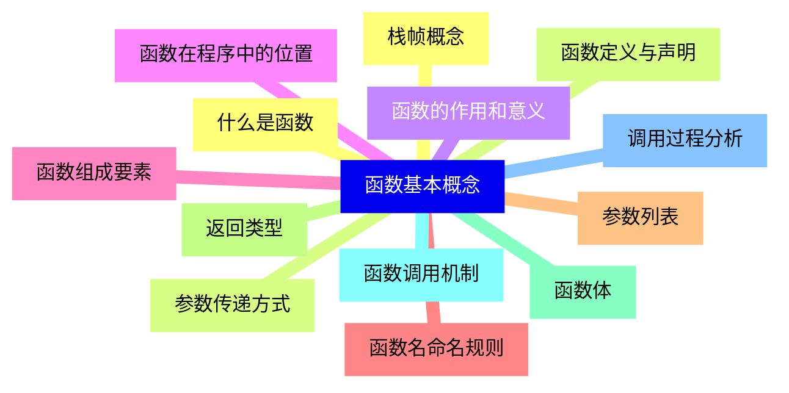

<--->
{}
{}
{}
{}
{}
{}
{}
{}
{}
{}
{}
{}
{}
{}
{}
{}
{}
{}
{}
{}
{}
{}
{}
{}
{}
{}
{}

### 2 函数声明与定义{#2}

{}
{}
{}
{}
{}
{}
{}
{}
{}
{}
{}
{}
{}
{}
{}
{}
{}
{}
{}
{}
{}
{}
{}
{}
{}
<--->
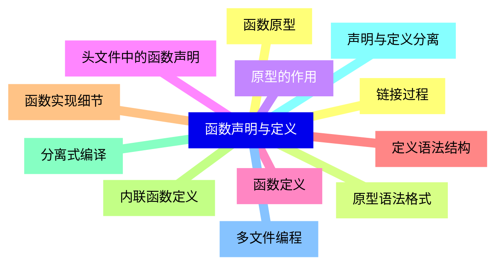

{}

### 3 函数参数{#3}

{}
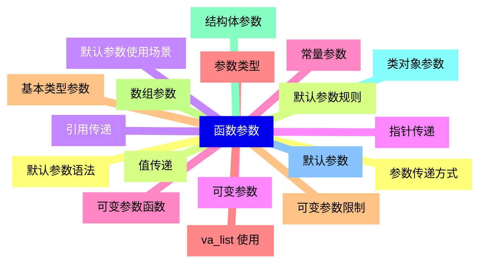

<--->
{}
{}
{}
{}
{}
{}
{}
{}
{}
{}
{}
{}
{}
{}
{}
{}
{}
{}
{}
{}
{}
{}
{}
{}
{}
{}
{}
{}
{}
{}
{}
{}
{}
{}
{}
{}
{}

### 4 返回值{#4}

{}
{}
{}
{}
{}
{}
{}
{}
{}
{}
{}
{}
{}
{}
{}
{}
{}
{}
{}
{}
{}
{}
{}
{}
{}
{}
{}
<--->
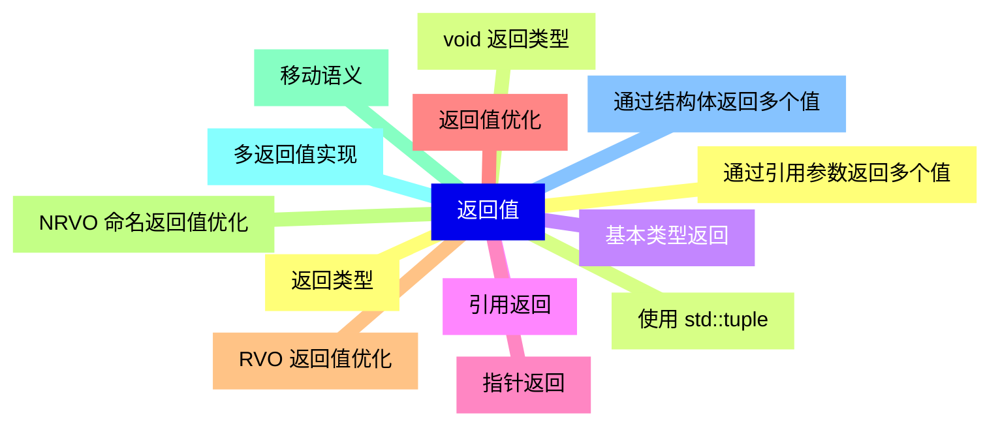

{}

### 5 函数重载{#5}

{}
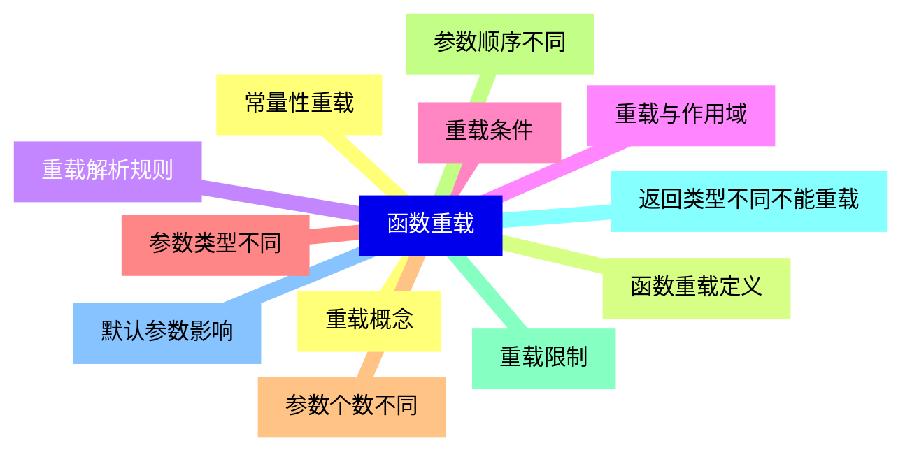

<--->
{}
{}
{}
{}
{}
{}
{}
{}
{}
{}
{}
{}
{}
{}
{}
{}
{}
{}
{}
{}
{}
{}
{}
{}
{}

### 6 函数模板{#6}

{}
{}
{}
{}
{}
{}
{}
{}
{}
{}
{}
{}
{}
{}
{}
{}
{}
{}
{}
{}
{}
{}
{}
{}
{}
<--->
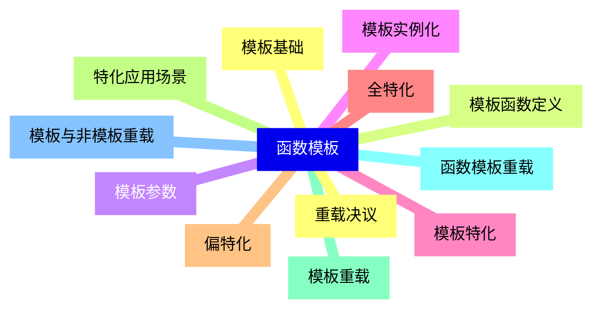

{}

### 7 内联函数{#7}

{}
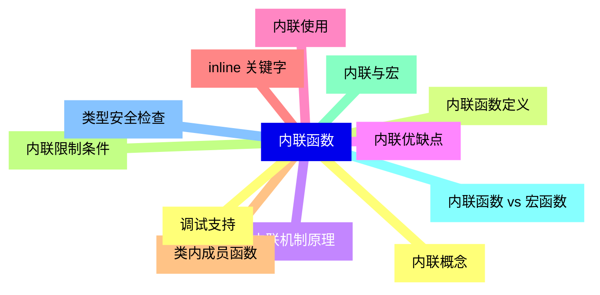

<--->
{}
{}
{}
{}
{}
{}
{}
{}
{}
{}
{}
{}
{}
{}
{}
{}
{}
{}
{}
{}
{}
{}
{}
{}
{}

### 8 递归函数{#8}

{}
{}
{}
{}
{}
{}
{}
{}
{}
{}
{}
{}
{}
{}
{}
{}
{}
{}
{}
{}
{}
{}
{}
{}
{}
<--->
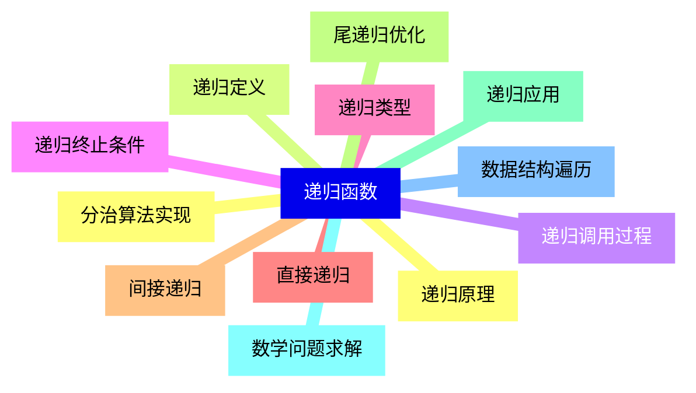

{}

### 9 函数指针{#9}

{}
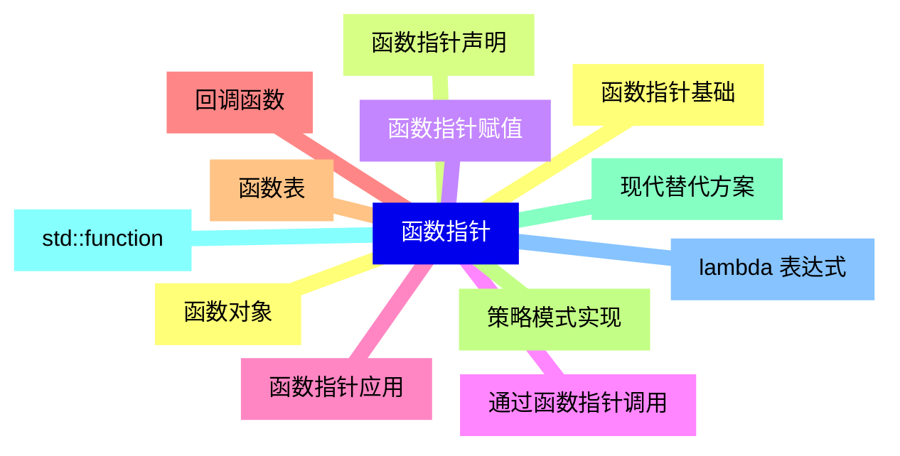

<--->
{}
{}
{}
{}
{}
{}
{}
{}
{}
{}
{}
{}
{}
{}
{}
{}
{}
{}
{}
{}
{}
{}
{}
{}
{}

### 10 异常处理{#10}

{}
{}
{}
{}
{}
{}
{}
{}
{}
{}
{}
{}
{}
{}
{}
{}
{}
{}
{}
{}
{}
{}
{}
{}
{}
<--->
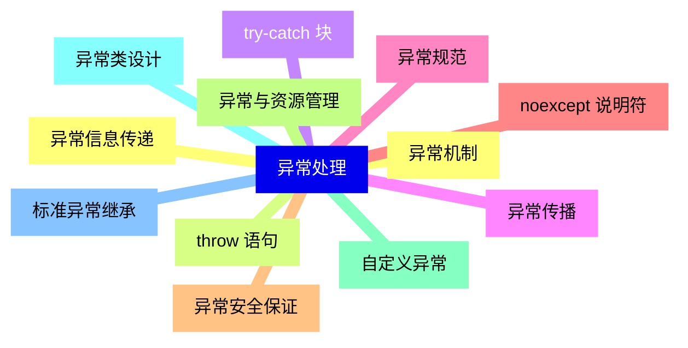

{}

### 11 函数最佳实践{#11}

{}
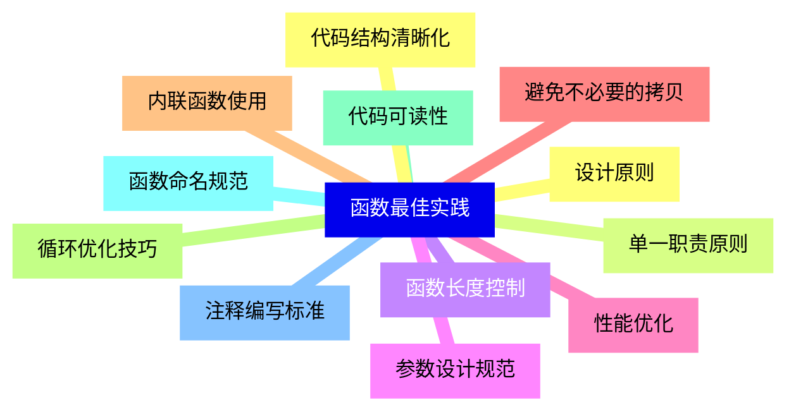

<--->
{}
{}
{}
{}
{}
{}
{}
{}
{}
{}
{}
{}
{}
{}
{}
{}
{}
{}
{}
{}
{}
{}
{}
{}
{}

### 12 高级特性{#12}

{}
{}
{}
{}
{}
{}
{}
{}
{}
{}
{}
{}
{}
{}
{}
{}
{}
{}
{}
{}
{}
{}
{}
{}
{}
<--->
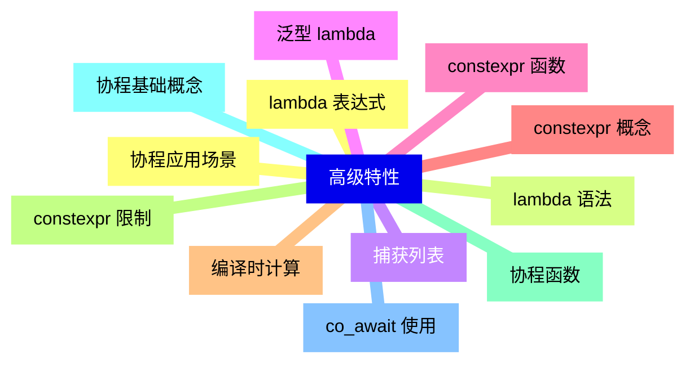

{}
