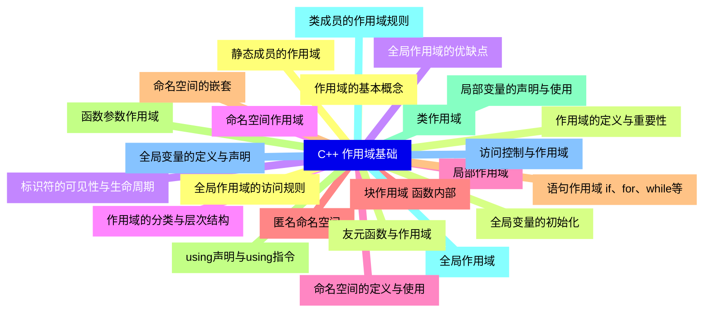
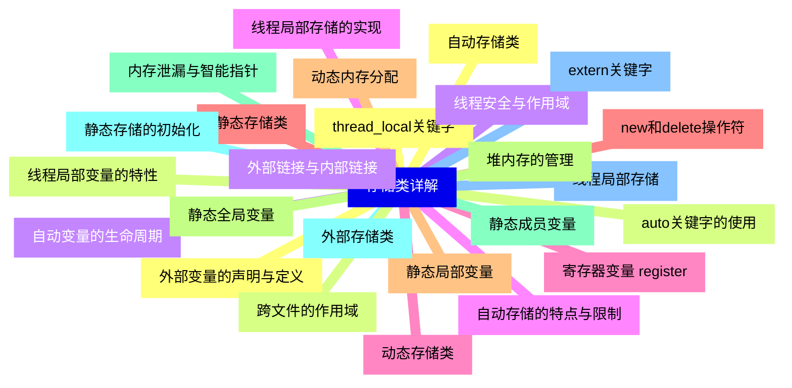
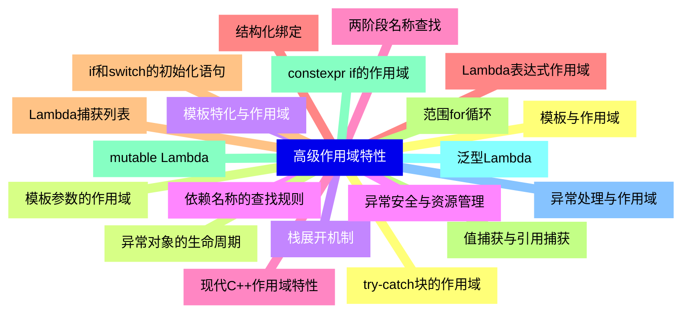
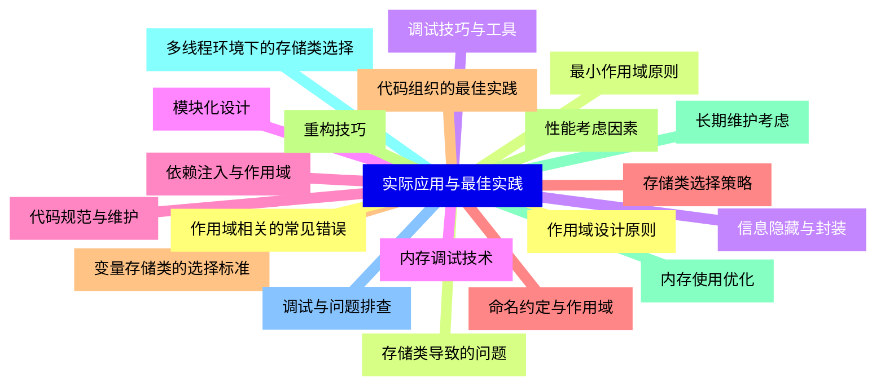


### 1 [C++ 作用域基础](#1)
#### 1.1 [作用域的基本概念](#1)
#### 1.2 [作用域的定义与重要性](#1)
#### 1.3 [标识符的可见性与生命周期](#1)
#### 1.4 [作用域的分类与层次结构](#1)
#### 1.5 [局部作用域](#1)
#### 1.6 [块作用域 函数内部](#1)
#### 1.7 [语句作用域 if、for、while等](#1)
#### 1.8 [函数参数作用域](#1)
#### 1.9 [局部变量的声明与使用](#1)
#### 1.10 [全局作用域](#1)
#### 1.11 [全局变量的定义与声明](#1)
#### 1.12 [全局作用域的访问规则](#1)
#### 1.13 [全局变量的初始化](#1)
#### 1.14 [全局作用域的优缺点](#1)
#### 1.15 [命名空间作用域](#1)
#### 1.16 [命名空间的定义与使用](#1)
#### 1.17 [匿名命名空间](#1)
#### 1.18 [命名空间的嵌套](#1)
#### 1.19 [using声明与using指令](#1)
#### 1.20 [类作用域](#1)
#### 1.21 [类成员的作用域规则](#1)
#### 1.22 [访问控制与作用域](#1)
#### 1.23 [静态成员的作用域](#1)
#### 1.24 [友元函数与作用域](#1)
### 2 [存储类详解](#2)
#### 2.1 [自动存储类](#2)
#### 2.2 [auto关键字的使用](#2)
#### 2.3 [自动变量的生命周期](#2)
#### 2.4 [自动存储的特点与限制](#2)
#### 2.5 [寄存器变量 register](#2)
#### 2.6 [静态存储类](#2)
#### 2.7 [静态局部变量](#2)
#### 2.8 [静态全局变量](#2)
#### 2.9 [静态成员变量](#2)
#### 2.10 [静态存储的初始化](#2)
#### 2.11 [线程局部存储](#2)
#### 2.12 [thread_local关键字](#2)
#### 2.13 [线程局部变量的特性](#2)
#### 2.14 [线程安全与作用域](#2)
#### 2.15 [线程局部存储的实现](#2)
#### 2.16 [动态存储类](#2)
#### 2.17 [new和delete操作符](#2)
#### 2.18 [动态内存分配](#2)
#### 2.19 [堆内存的管理](#2)
#### 2.20 [内存泄漏与智能指针](#2)
#### 2.21 [外部存储类](#2)
#### 2.22 [extern关键字](#2)
#### 2.23 [外部变量的声明与定义](#2)
#### 2.24 [跨文件的作用域](#2)
#### 2.25 [外部链接与内部链接](#2)
### 3 [作用域与存储类的交互](#3)
#### 3.1 [作用域解析运算符](#3)
#### 3.2 [::运算符的使用](#3)
#### 3.3 [全局作用域解析](#3)
#### 3.4 [命名空间作用域解析](#3)
#### 3.5 [类作用域解析](#3)
#### 3.6 [链接性与作用域](#3)
#### 3.7 [内部链接与外部链接](#3)
#### 3.8 [静态链接与动态链接](#3)
#### 3.9 [链接错误与解决方案](#3)
#### 3.10 [符号表的组织](#3)
#### 3.11 [生命周期管理](#3)
#### 3.12 [对象的构造与析构](#3)
#### 3.13 [RAII原则](#3)
#### 3.14 [资源管理的最佳实践](#3)
#### 3.15 [作用域与资源释放](#3)
#### 3.16 [作用域与性能优化](#3)
#### 3.17 [变量的存储位置](#3)
#### 3.18 [缓存友好性](#3)
#### 3.19 [内联函数的作用域](#3)
#### 3.20 [编译期优化](#3)
### 4 [高级作用域特性](#4)
#### 4.1 [模板与作用域](#4)
#### 4.2 [模板参数的作用域](#4)
#### 4.3 [模板特化与作用域](#4)
#### 4.4 [依赖名称的查找规则](#4)
#### 4.5 [两阶段名称查找](#4)
#### 4.6 [Lambda表达式作用域](#4)
#### 4.7 [Lambda捕获列表](#4)
#### 4.8 [值捕获与引用捕获](#4)
#### 4.9 [mutable Lambda](#4)
#### 4.10 [泛型Lambda](#4)
#### 4.11 [异常处理与作用域](#4)
#### 4.12 [try-catch块的作用域](#4)
#### 4.13 [异常对象的生命周期](#4)
#### 4.14 [栈展开机制](#4)
#### 4.15 [异常安全与资源管理](#4)
#### 4.16 [现代C++作用域特性](#4)
#### 4.17 [结构化绑定](#4)
#### 4.18 [if和switch的初始化语句](#4)
#### 4.19 [范围for循环](#4)
#### 4.20 [constexpr if的作用域](#4)
### 5 [实际应用与最佳实践](#5)
#### 5.1 [作用域设计原则](#5)
#### 5.2 [最小作用域原则](#5)
#### 5.3 [信息隐藏与封装](#5)
#### 5.4 [模块化设计](#5)
#### 5.5 [依赖注入与作用域](#5)
#### 5.6 [存储类选择策略](#5)
#### 5.7 [变量存储类的选择标准](#5)
#### 5.8 [性能考虑因素](#5)
#### 5.9 [内存使用优化](#5)
#### 5.10 [多线程环境下的存储类选择](#5)
#### 5.11 [调试与问题排查](#5)
#### 5.12 [作用域相关的常见错误](#5)
#### 5.13 [存储类导致的问题](#5)
#### 5.14 [调试技巧与工具](#5)
#### 5.15 [内存调试技术](#5)
#### 5.16 [代码规范与维护](#5)
#### 5.17 [命名约定与作用域](#5)
#### 5.18 [代码组织的最佳实践](#5)
#### 5.19 [重构技巧](#5)
#### 5.20 [长期维护考虑](#5)




### 1 C++ 作用域基础

---
### 1 C++ 作用域基础
___
#### 1.1 作用域的基本概念
___
#### 1.2 作用域的定义与重要性
___
#### 1.3 标识符的可见性与生命周期
___
#### 1.4 作用域的分类与层次结构
___
#### 1.5 局部作用域
___
#### 1.6 块作用域 函数内部
___
#### 1.7 语句作用域 if、for、while等
___
#### 1.8 函数参数作用域
___
#### 1.9 局部变量的声明与使用
___
#### 1.10 全局作用域
___
#### 1.11 全局变量的定义与声明
___
#### 1.12 全局作用域的访问规则
___
#### 1.13 全局变量的初始化
___
#### 1.14 全局作用域的优缺点
___
#### 1.15 命名空间作用域
___
#### 1.16 命名空间的定义与使用
___
#### 1.17 匿名命名空间
___
#### 1.18 命名空间的嵌套
___
#### 1.19 using声明与using指令
___
#### 1.20 类作用域
___
#### 1.21 类成员的作用域规则
___
#### 1.22 访问控制与作用域
___
#### 1.23 静态成员的作用域
___
#### 1.24 友元函数与作用域
### 2 存储类详解

---
### 2 存储类详解
___
#### 2.1 自动存储类
___
#### 2.2 auto关键字的使用
___
#### 2.3 自动变量的生命周期
___
#### 2.4 自动存储的特点与限制
___
#### 2.5 寄存器变量 register
___
#### 2.6 静态存储类
___
#### 2.7 静态局部变量
___
#### 2.8 静态全局变量
___
#### 2.9 静态成员变量
___
#### 2.10 静态存储的初始化
___
#### 2.11 线程局部存储
___
#### 2.12 thread_local关键字
___
#### 2.13 线程局部变量的特性
___
#### 2.14 线程安全与作用域
___
#### 2.15 线程局部存储的实现
___
#### 2.16 动态存储类
___
#### 2.17 new和delete操作符
___
#### 2.18 动态内存分配
___
#### 2.19 堆内存的管理
___
#### 2.20 内存泄漏与智能指针
___
#### 2.21 外部存储类
___
#### 2.22 extern关键字
___
#### 2.23 外部变量的声明与定义
___
#### 2.24 跨文件的作用域
___
#### 2.25 外部链接与内部链接
### 3 作用域与存储类的交互

---
### 3 作用域与存储类的交互
___
#### 3.1 作用域解析运算符
___
#### 3.2 ::运算符的使用
___
#### 3.3 全局作用域解析
___
#### 3.4 命名空间作用域解析
___
#### 3.5 类作用域解析
___
#### 3.6 链接性与作用域
___
#### 3.7 内部链接与外部链接
___
#### 3.8 静态链接与动态链接
___
#### 3.9 链接错误与解决方案
___
#### 3.10 符号表的组织
___
#### 3.11 生命周期管理
___
#### 3.12 对象的构造与析构
___
#### 3.13 RAII原则
___
#### 3.14 资源管理的最佳实践
___
#### 3.15 作用域与资源释放
___
#### 3.16 作用域与性能优化
___
#### 3.17 变量的存储位置
___
#### 3.18 缓存友好性
___
#### 3.19 内联函数的作用域
___
#### 3.20 编译期优化
### 4 高级作用域特性

---
### 4 高级作用域特性
___
#### 4.1 模板与作用域
___
#### 4.2 模板参数的作用域
___
#### 4.3 模板特化与作用域
___
#### 4.4 依赖名称的查找规则
___
#### 4.5 两阶段名称查找
___
#### 4.6 Lambda表达式作用域
___
#### 4.7 Lambda捕获列表
___
#### 4.8 值捕获与引用捕获
___
#### 4.9 mutable Lambda
___
#### 4.10 泛型Lambda
___
#### 4.11 异常处理与作用域
___
#### 4.12 try-catch块的作用域
___
#### 4.13 异常对象的生命周期
___
#### 4.14 栈展开机制
___
#### 4.15 异常安全与资源管理
___
#### 4.16 现代C++作用域特性
___
#### 4.17 结构化绑定
___
#### 4.18 if和switch的初始化语句
___
#### 4.19 范围for循环
___
#### 4.20 constexpr if的作用域
### 5 实际应用与最佳实践

---
### 5 实际应用与最佳实践
___
#### 5.1 作用域设计原则
___
#### 5.2 最小作用域原则
___
#### 5.3 信息隐藏与封装
___
#### 5.4 模块化设计
___
#### 5.5 依赖注入与作用域
___
#### 5.6 存储类选择策略
___
#### 5.7 变量存储类的选择标准
___
#### 5.8 性能考虑因素
___
#### 5.9 内存使用优化
___
#### 5.10 多线程环境下的存储类选择
___
#### 5.11 调试与问题排查
___
#### 5.12 作用域相关的常见错误
___
#### 5.13 存储类导致的问题
___
#### 5.14 调试技巧与工具
___
#### 5.15 内存调试技术
___
#### 5.16 代码规范与维护
___
#### 5.17 命名约定与作用域
___
#### 5.18 代码组织的最佳实践
___
#### 5.19 重构技巧
___
#### 5.20 长期维护考虑


### 1 C++ 作用域基础{#1}

{}

<--->
{}
{}
{}
{}
{}
{}
{}
{}
{}
{}
{}
{}
{}
{}
{}
{}
{}
{}
{}
{}
{}
{}
{}
{}
{}
{}
{}
{}
{}
{}
{}
{}
{}
{}
{}
{}
{}
{}
{}
{}
{}
{}
{}
{}
{}
{}
{}
{}
{}

### 2 存储类详解{#2}

{}
{}
{}
{}
{}
{}
{}
{}
{}
{}
{}
{}
{}
{}
{}
{}
{}
{}
{}
{}
{}
{}
{}
{}
{}
{}
{}
{}
{}
{}
{}
{}
{}
{}
{}
{}
{}
{}
{}
{}
{}
{}
{}
{}
{}
{}
{}
{}
{}
{}
{}
<--->

{}

### 3 作用域与存储类的交互{#3}

{}

<--->
{}
{}
{}
{}
{}
{}
{}
{}
{}
{}
{}
{}
{}
{}
{}
{}
{}
{}
{}
{}
{}
{}
{}
{}
{}
{}
{}
{}
{}
{}
{}
{}
{}
{}
{}
{}
{}
{}
{}
{}
{}

### 4 高级作用域特性{#4}

{}
{}
{}
{}
{}
{}
{}
{}
{}
{}
{}
{}
{}
{}
{}
{}
{}
{}
{}
{}
{}
{}
{}
{}
{}
{}
{}
{}
{}
{}
{}
{}
{}
{}
{}
{}
{}
{}
{}
{}
{}
<--->

{}

### 5 实际应用与最佳实践{#5}

{}

<--->
{}
{}
{}
{}
{}
{}
{}
{}
{}
{}
{}
{}
{}
{}
{}
{}
{}
{}
{}
{}
{}
{}
{}
{}
{}
{}
{}
{}
{}
{}
{}
{}
{}
{}
{}
{}
{}
{}
{}
{}
{}
