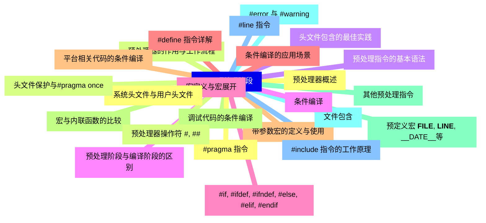
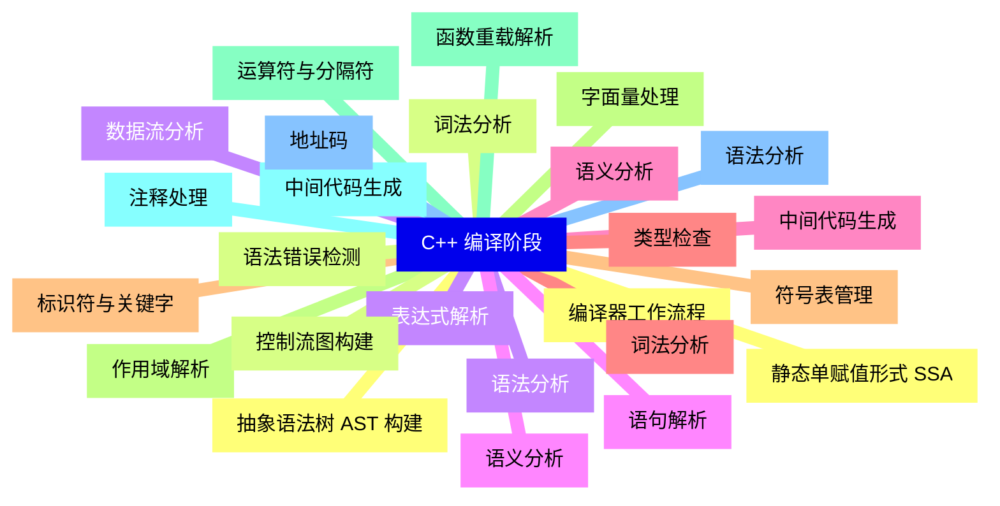
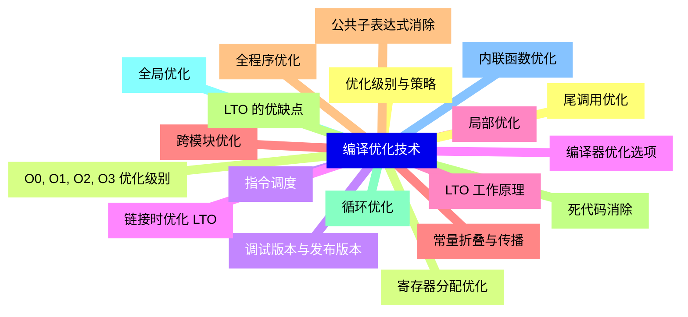
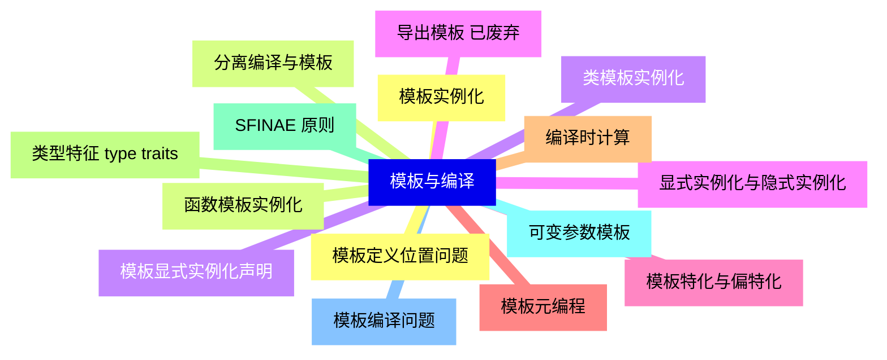
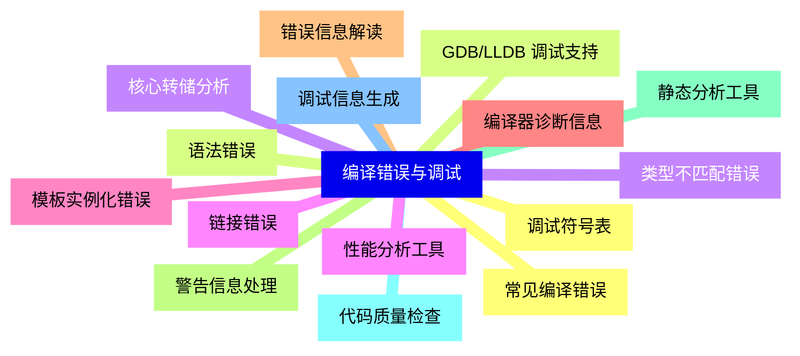
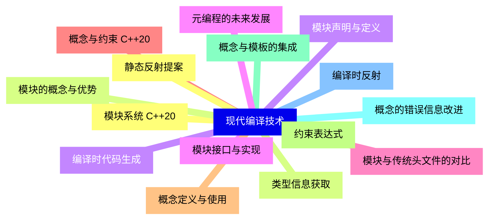
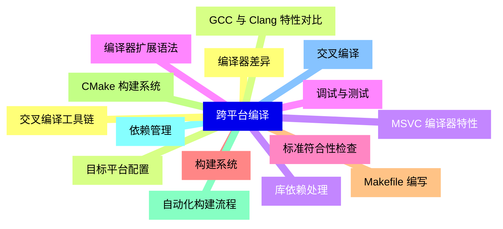
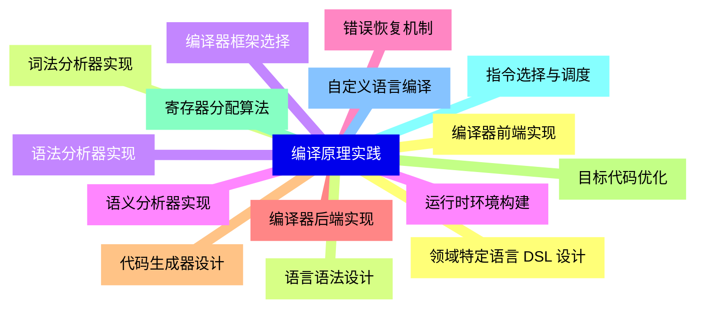


### 1 [C++ 预处理阶段](#1)
#### 1.1 [预处理器概述](#1)
#### 1.2 [预处理器的作用与工作流程](#1)
#### 1.3 [预处理指令的基本语法](#1)
#### 1.4 [预处理阶段与编译阶段的区别](#1)
#### 1.5 [宏定义与宏展开](#1)
#### 1.6 [#define 指令详解](#1)
#### 1.7 [带参数宏的定义与使用](#1)
#### 1.8 [宏与内联函数的比较](#1)
#### 1.9 [预定义宏 __FILE__, __LINE__, __DATE__等](#1)
#### 1.10 [文件包含](#1)
#### 1.11 [#include 指令的工作原理](#1)
#### 1.12 [系统头文件与用户头文件](#1)
#### 1.13 [头文件保护与#pragma once](#1)
#### 1.14 [头文件包含的最佳实践](#1)
#### 1.15 [条件编译](#1)
#### 1.16 [#if, #ifdef, #ifndef, #else, #elif, #endif](#1)
#### 1.17 [条件编译的应用场景](#1)
#### 1.18 [平台相关代码的条件编译](#1)
#### 1.19 [调试代码的条件编译](#1)
#### 1.20 [其他预处理指令](#1)
#### 1.21 [#error 与 #warning](#1)
#### 1.22 [#line 指令](#1)
#### 1.23 [#pragma 指令](#1)
#### 1.24 [预处理器操作符 #, ##](#1)
### 2 [C++ 编译阶段](#2)
#### 2.1 [编译器工作流程](#2)
#### 2.2 [词法分析](#2)
#### 2.3 [语法分析](#2)
#### 2.4 [语义分析](#2)
#### 2.5 [中间代码生成](#2)
#### 2.6 [词法分析](#2)
#### 2.7 [标识符与关键字](#2)
#### 2.8 [字面量处理](#2)
#### 2.9 [运算符与分隔符](#2)
#### 2.10 [注释处理](#2)
#### 2.11 [语法分析](#2)
#### 2.12 [抽象语法树 AST 构建](#2)
#### 2.13 [语法错误检测](#2)
#### 2.14 [表达式解析](#2)
#### 2.15 [语句解析](#2)
#### 2.16 [语义分析](#2)
#### 2.17 [类型检查](#2)
#### 2.18 [符号表管理](#2)
#### 2.19 [作用域解析](#2)
#### 2.20 [函数重载解析](#2)
#### 2.21 [中间代码生成](#2)
#### 2.22 [地址码](#2)
#### 2.23 [静态单赋值形式 SSA](#2)
#### 2.24 [控制流图构建](#2)
#### 2.25 [数据流分析](#2)
### 3 [编译优化技术](#3)
#### 3.1 [优化级别与策略](#3)
#### 3.2 [O0, O1, O2, O3 优化级别](#3)
#### 3.3 [调试版本与发布版本](#3)
#### 3.4 [编译器优化选项](#3)
#### 3.5 [局部优化](#3)
#### 3.6 [常量折叠与传播](#3)
#### 3.7 [公共子表达式消除](#3)
#### 3.8 [死代码消除](#3)
#### 3.9 [循环优化](#3)
#### 3.10 [全局优化](#3)
#### 3.11 [内联函数优化](#3)
#### 3.12 [尾调用优化](#3)
#### 3.13 [寄存器分配优化](#3)
#### 3.14 [指令调度](#3)
#### 3.15 [链接时优化 LTO](#3)
#### 3.16 [LTO 工作原理](#3)
#### 3.17 [跨模块优化](#3)
#### 3.18 [全程序优化](#3)
#### 3.19 [LTO 的优缺点](#3)
### 4 [模板与编译](#4)
#### 4.1 [模板实例化](#4)
#### 4.2 [函数模板实例化](#4)
#### 4.3 [类模板实例化](#4)
#### 4.4 [显式实例化与隐式实例化](#4)
#### 4.5 [模板特化与偏特化](#4)
#### 4.6 [模板元编程](#4)
#### 4.7 [编译时计算](#4)
#### 4.8 [类型特征 type traits](#4)
#### 4.9 [SFINAE 原则](#4)
#### 4.10 [可变参数模板](#4)
#### 4.11 [模板编译问题](#4)
#### 4.12 [模板定义位置问题](#4)
#### 4.13 [分离编译与模板](#4)
#### 4.14 [模板显式实例化声明](#4)
#### 4.15 [导出模板 已废弃](#4)
### 5 [编译错误与调试](#5)
#### 5.1 [常见编译错误](#5)
#### 5.2 [语法错误](#5)
#### 5.3 [类型不匹配错误](#5)
#### 5.4 [链接错误](#5)
#### 5.5 [模板实例化错误](#5)
#### 5.6 [编译器诊断信息](#5)
#### 5.7 [错误信息解读](#5)
#### 5.8 [警告信息处理](#5)
#### 5.9 [静态分析工具](#5)
#### 5.10 [代码质量检查](#5)
#### 5.11 [调试信息生成](#5)
#### 5.12 [调试符号表](#5)
#### 5.13 [GDB/LLDB 调试支持](#5)
#### 5.14 [核心转储分析](#5)
#### 5.15 [性能分析工具](#5)
### 6 [现代编译技术](#6)
#### 6.1 [模块系统 C++20](#6)
#### 6.2 [模块的概念与优势](#6)
#### 6.3 [模块声明与定义](#6)
#### 6.4 [模块接口与实现](#6)
#### 6.5 [模块与传统头文件的对比](#6)
#### 6.6 [概念与约束 C++20](#6)
#### 6.7 [概念定义与使用](#6)
#### 6.8 [约束表达式](#6)
#### 6.9 [概念与模板的集成](#6)
#### 6.10 [概念的错误信息改进](#6)
#### 6.11 [编译时反射](#6)
#### 6.12 [静态反射提案](#6)
#### 6.13 [类型信息获取](#6)
#### 6.14 [编译时代码生成](#6)
#### 6.15 [元编程的未来发展](#6)
### 7 [跨平台编译](#7)
#### 7.1 [编译器差异](#7)
#### 7.2 [GCC 与 Clang 特性对比](#7)
#### 7.3 [MSVC 编译器特性](#7)
#### 7.4 [编译器扩展语法](#7)
#### 7.5 [标准符合性检查](#7)
#### 7.6 [构建系统](#7)
#### 7.7 [Makefile 编写](#7)
#### 7.8 [CMake 构建系统](#7)
#### 7.9 [自动化构建流程](#7)
#### 7.10 [依赖管理](#7)
#### 7.11 [交叉编译](#7)
#### 7.12 [交叉编译工具链](#7)
#### 7.13 [目标平台配置](#7)
#### 7.14 [库依赖处理](#7)
#### 7.15 [调试与测试](#7)
### 8 [编译原理实践](#8)
#### 8.1 [编译器前端实现](#8)
#### 8.2 [词法分析器实现](#8)
#### 8.3 [语法分析器实现](#8)
#### 8.4 [语义分析器实现](#8)
#### 8.5 [错误恢复机制](#8)
#### 8.6 [编译器后端实现](#8)
#### 8.7 [代码生成器设计](#8)
#### 8.8 [目标代码优化](#8)
#### 8.9 [寄存器分配算法](#8)
#### 8.10 [指令选择与调度](#8)
#### 8.11 [自定义语言编译](#8)
#### 8.12 [领域特定语言 DSL 设计](#8)
#### 8.13 [语言语法设计](#8)
#### 8.14 [编译器框架选择](#8)
#### 8.15 [运行时环境构建](#8)




### 1 C++ 预处理阶段

---
### 1 C++ 预处理阶段
___
#### 1.1 预处理器概述
___
#### 1.2 预处理器的作用与工作流程
___
#### 1.3 预处理指令的基本语法
___
#### 1.4 预处理阶段与编译阶段的区别
___
#### 1.5 宏定义与宏展开
___
#### 1.6 #define 指令详解
___
#### 1.7 带参数宏的定义与使用
___
#### 1.8 宏与内联函数的比较
___
#### 1.9 预定义宏 __FILE__, __LINE__, __DATE__等
___
#### 1.10 文件包含
___
#### 1.11 #include 指令的工作原理
___
#### 1.12 系统头文件与用户头文件
___
#### 1.13 头文件保护与#pragma once
___
#### 1.14 头文件包含的最佳实践
___
#### 1.15 条件编译
___
#### 1.16 #if, #ifdef, #ifndef, #else, #elif, #endif
___
#### 1.17 条件编译的应用场景
___
#### 1.18 平台相关代码的条件编译
___
#### 1.19 调试代码的条件编译
___
#### 1.20 其他预处理指令
___
#### 1.21 #error 与 #warning
___
#### 1.22 #line 指令
___
#### 1.23 #pragma 指令
___
#### 1.24 预处理器操作符 #, ##
### 2 C++ 编译阶段

---
### 2 C++ 编译阶段
___
#### 2.1 编译器工作流程
___
#### 2.2 词法分析
___
#### 2.3 语法分析
___
#### 2.4 语义分析
___
#### 2.5 中间代码生成
___
#### 2.6 词法分析
___
#### 2.7 标识符与关键字
___
#### 2.8 字面量处理
___
#### 2.9 运算符与分隔符
___
#### 2.10 注释处理
___
#### 2.11 语法分析
___
#### 2.12 抽象语法树 AST 构建
___
#### 2.13 语法错误检测
___
#### 2.14 表达式解析
___
#### 2.15 语句解析
___
#### 2.16 语义分析
___
#### 2.17 类型检查
___
#### 2.18 符号表管理
___
#### 2.19 作用域解析
___
#### 2.20 函数重载解析
___
#### 2.21 中间代码生成
___
#### 2.22 地址码
___
#### 2.23 静态单赋值形式 SSA
___
#### 2.24 控制流图构建
___
#### 2.25 数据流分析
### 3 编译优化技术

---
### 3 编译优化技术
___
#### 3.1 优化级别与策略
___
#### 3.2 O0, O1, O2, O3 优化级别
___
#### 3.3 调试版本与发布版本
___
#### 3.4 编译器优化选项
___
#### 3.5 局部优化
___
#### 3.6 常量折叠与传播
___
#### 3.7 公共子表达式消除
___
#### 3.8 死代码消除
___
#### 3.9 循环优化
___
#### 3.10 全局优化
___
#### 3.11 内联函数优化
___
#### 3.12 尾调用优化
___
#### 3.13 寄存器分配优化
___
#### 3.14 指令调度
___
#### 3.15 链接时优化 LTO
___
#### 3.16 LTO 工作原理
___
#### 3.17 跨模块优化
___
#### 3.18 全程序优化
___
#### 3.19 LTO 的优缺点
### 4 模板与编译

---
### 4 模板与编译
___
#### 4.1 模板实例化
___
#### 4.2 函数模板实例化
___
#### 4.3 类模板实例化
___
#### 4.4 显式实例化与隐式实例化
___
#### 4.5 模板特化与偏特化
___
#### 4.6 模板元编程
___
#### 4.7 编译时计算
___
#### 4.8 类型特征 type traits
___
#### 4.9 SFINAE 原则
___
#### 4.10 可变参数模板
___
#### 4.11 模板编译问题
___
#### 4.12 模板定义位置问题
___
#### 4.13 分离编译与模板
___
#### 4.14 模板显式实例化声明
___
#### 4.15 导出模板 已废弃
### 5 编译错误与调试

---
### 5 编译错误与调试
___
#### 5.1 常见编译错误
___
#### 5.2 语法错误
___
#### 5.3 类型不匹配错误
___
#### 5.4 链接错误
___
#### 5.5 模板实例化错误
___
#### 5.6 编译器诊断信息
___
#### 5.7 错误信息解读
___
#### 5.8 警告信息处理
___
#### 5.9 静态分析工具
___
#### 5.10 代码质量检查
___
#### 5.11 调试信息生成
___
#### 5.12 调试符号表
___
#### 5.13 GDB/LLDB 调试支持
___
#### 5.14 核心转储分析
___
#### 5.15 性能分析工具
### 6 现代编译技术

---
### 6 现代编译技术
___
#### 6.1 模块系统 C++20
___
#### 6.2 模块的概念与优势
___
#### 6.3 模块声明与定义
___
#### 6.4 模块接口与实现
___
#### 6.5 模块与传统头文件的对比
___
#### 6.6 概念与约束 C++20
___
#### 6.7 概念定义与使用
___
#### 6.8 约束表达式
___
#### 6.9 概念与模板的集成
___
#### 6.10 概念的错误信息改进
___
#### 6.11 编译时反射
___
#### 6.12 静态反射提案
___
#### 6.13 类型信息获取
___
#### 6.14 编译时代码生成
___
#### 6.15 元编程的未来发展
### 7 跨平台编译

---
### 7 跨平台编译
___
#### 7.1 编译器差异
___
#### 7.2 GCC 与 Clang 特性对比
___
#### 7.3 MSVC 编译器特性
___
#### 7.4 编译器扩展语法
___
#### 7.5 标准符合性检查
___
#### 7.6 构建系统
___
#### 7.7 Makefile 编写
___
#### 7.8 CMake 构建系统
___
#### 7.9 自动化构建流程
___
#### 7.10 依赖管理
___
#### 7.11 交叉编译
___
#### 7.12 交叉编译工具链
___
#### 7.13 目标平台配置
___
#### 7.14 库依赖处理
___
#### 7.15 调试与测试
### 8 编译原理实践

---
### 8 编译原理实践
___
#### 8.1 编译器前端实现
___
#### 8.2 词法分析器实现
___
#### 8.3 语法分析器实现
___
#### 8.4 语义分析器实现
___
#### 8.5 错误恢复机制
___
#### 8.6 编译器后端实现
___
#### 8.7 代码生成器设计
___
#### 8.8 目标代码优化
___
#### 8.9 寄存器分配算法
___
#### 8.10 指令选择与调度
___
#### 8.11 自定义语言编译
___
#### 8.12 领域特定语言 DSL 设计
___
#### 8.13 语言语法设计
___
#### 8.14 编译器框架选择
___
#### 8.15 运行时环境构建


### 1 C++ 预处理阶段{#1}

{}

<--->
{}
{}
{}
{}
{}
{}
{}
{}
{}
{}
{}
{}
{}
{}
{}
{}
{}
{}
{}
{}
{}
{}
{}
{}
{}
{}
{}
{}
{}
{}
{}
{}
{}
{}
{}
{}
{}
{}
{}
{}
{}
{}
{}
{}
{}
{}
{}
{}
{}

### 2 C++ 编译阶段{#2}

{}
{}
{}
{}
{}
{}
{}
{}
{}
{}
{}
{}
{}
{}
{}
{}
{}
{}
{}
{}
{}
{}
{}
{}
{}
{}
{}
{}
{}
{}
{}
{}
{}
{}
{}
{}
{}
{}
{}
{}
{}
{}
{}
{}
{}
{}
{}
{}
{}
{}
{}
<--->

{}

### 3 编译优化技术{#3}

{}

<--->
{}
{}
{}
{}
{}
{}
{}
{}
{}
{}
{}
{}
{}
{}
{}
{}
{}
{}
{}
{}
{}
{}
{}
{}
{}
{}
{}
{}
{}
{}
{}
{}
{}
{}
{}
{}
{}
{}
{}

### 4 模板与编译{#4}

{}
{}
{}
{}
{}
{}
{}
{}
{}
{}
{}
{}
{}
{}
{}
{}
{}
{}
{}
{}
{}
{}
{}
{}
{}
{}
{}
{}
{}
{}
{}
<--->

{}

### 5 编译错误与调试{#5}

{}

<--->
{}
{}
{}
{}
{}
{}
{}
{}
{}
{}
{}
{}
{}
{}
{}
{}
{}
{}
{}
{}
{}
{}
{}
{}
{}
{}
{}
{}
{}
{}
{}

### 6 现代编译技术{#6}

{}
{}
{}
{}
{}
{}
{}
{}
{}
{}
{}
{}
{}
{}
{}
{}
{}
{}
{}
{}
{}
{}
{}
{}
{}
{}
{}
{}
{}
{}
{}
<--->

{}

### 7 跨平台编译{#7}

{}

<--->
{}
{}
{}
{}
{}
{}
{}
{}
{}
{}
{}
{}
{}
{}
{}
{}
{}
{}
{}
{}
{}
{}
{}
{}
{}
{}
{}
{}
{}
{}
{}

### 8 编译原理实践{#8}

{}
{}
{}
{}
{}
{}
{}
{}
{}
{}
{}
{}
{}
{}
{}
{}
{}
{}
{}
{}
{}
{}
{}
{}
{}
{}
{}
{}
{}
{}
{}
<--->

{}
