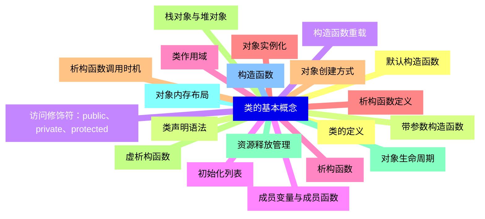
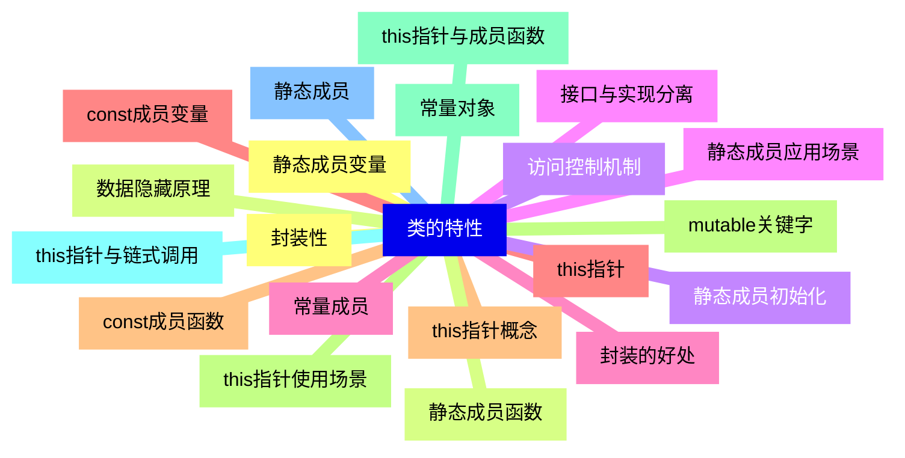
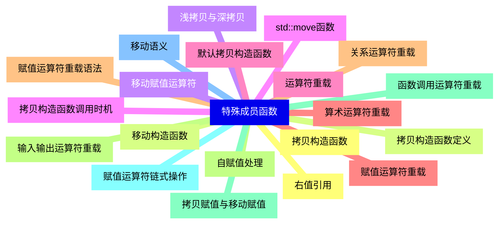
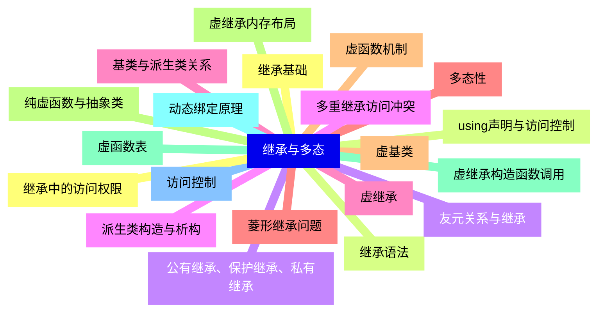
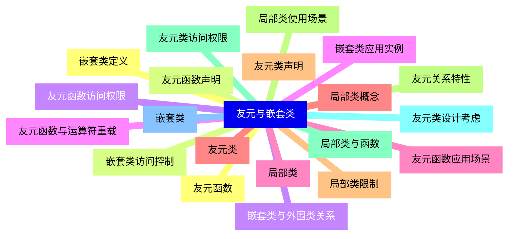
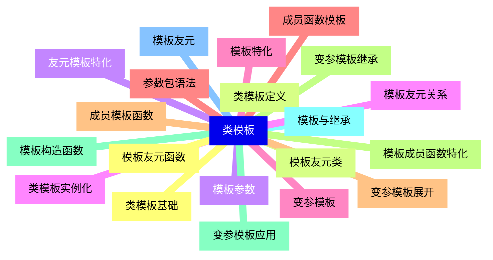
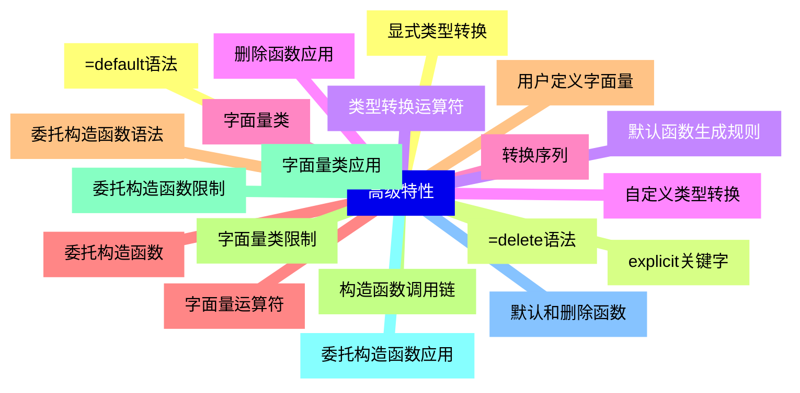
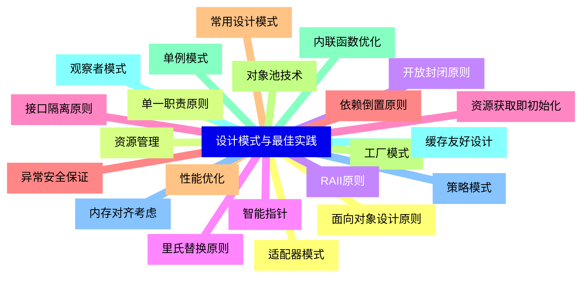


### 1 [类的基本概念](#1)
#### 1.1 [类的定义](#1)
#### 1.2 [类声明语法](#1)
#### 1.3 [访问修饰符：public、private、protected](#1)
#### 1.4 [成员变量与成员函数](#1)
#### 1.5 [类作用域](#1)
#### 1.6 [对象实例化](#1)
#### 1.7 [对象创建方式](#1)
#### 1.8 [栈对象与堆对象](#1)
#### 1.9 [对象生命周期](#1)
#### 1.10 [对象内存布局](#1)
#### 1.11 [构造函数](#1)
#### 1.12 [默认构造函数](#1)
#### 1.13 [带参数构造函数](#1)
#### 1.14 [构造函数重载](#1)
#### 1.15 [初始化列表](#1)
#### 1.16 [析构函数](#1)
#### 1.17 [析构函数定义](#1)
#### 1.18 [析构函数调用时机](#1)
#### 1.19 [虚析构函数](#1)
#### 1.20 [资源释放管理](#1)
### 2 [类的特性](#2)
#### 2.1 [封装性](#2)
#### 2.2 [数据隐藏原理](#2)
#### 2.3 [访问控制机制](#2)
#### 2.4 [接口与实现分离](#2)
#### 2.5 [封装的好处](#2)
#### 2.6 [this指针](#2)
#### 2.7 [this指针概念](#2)
#### 2.8 [this指针使用场景](#2)
#### 2.9 [this指针与成员函数](#2)
#### 2.10 [this指针与链式调用](#2)
#### 2.11 [静态成员](#2)
#### 2.12 [静态成员变量](#2)
#### 2.13 [静态成员函数](#2)
#### 2.14 [静态成员初始化](#2)
#### 2.15 [静态成员应用场景](#2)
#### 2.16 [常量成员](#2)
#### 2.17 [const成员变量](#2)
#### 2.18 [const成员函数](#2)
#### 2.19 [mutable关键字](#2)
#### 2.20 [常量对象](#2)
### 3 [特殊成员函数](#3)
#### 3.1 [拷贝构造函数](#3)
#### 3.2 [拷贝构造函数定义](#3)
#### 3.3 [浅拷贝与深拷贝](#3)
#### 3.4 [拷贝构造函数调用时机](#3)
#### 3.5 [默认拷贝构造函数](#3)
#### 3.6 [赋值运算符重载](#3)
#### 3.7 [赋值运算符重载语法](#3)
#### 3.8 [自赋值处理](#3)
#### 3.9 [拷贝赋值与移动赋值](#3)
#### 3.10 [赋值运算符链式操作](#3)
#### 3.11 [移动语义](#3)
#### 3.12 [右值引用](#3)
#### 3.13 [移动构造函数](#3)
#### 3.14 [移动赋值运算符](#3)
#### 3.15 [std::move函数](#3)
#### 3.16 [运算符重载](#3)
#### 3.17 [算术运算符重载](#3)
#### 3.18 [关系运算符重载](#3)
#### 3.19 [输入输出运算符重载](#3)
#### 3.20 [函数调用运算符重载](#3)
### 4 [继承与多态](#4)
#### 4.1 [继承基础](#4)
#### 4.2 [继承语法](#4)
#### 4.3 [公有继承、保护继承、私有继承](#4)
#### 4.4 [派生类构造与析构](#4)
#### 4.5 [基类与派生类关系](#4)
#### 4.6 [多态性](#4)
#### 4.7 [虚函数机制](#4)
#### 4.8 [纯虚函数与抽象类](#4)
#### 4.9 [虚函数表](#4)
#### 4.10 [动态绑定原理](#4)
#### 4.11 [访问控制](#4)
#### 4.12 [继承中的访问权限](#4)
#### 4.13 [using声明与访问控制](#4)
#### 4.14 [友元关系与继承](#4)
#### 4.15 [多重继承访问冲突](#4)
#### 4.16 [虚继承](#4)
#### 4.17 [菱形继承问题](#4)
#### 4.18 [虚基类](#4)
#### 4.19 [虚继承内存布局](#4)
#### 4.20 [虚继承构造函数调用](#4)
### 5 [友元与嵌套类](#5)
#### 5.1 [友元函数](#5)
#### 5.2 [友元函数声明](#5)
#### 5.3 [友元函数访问权限](#5)
#### 5.4 [友元函数与运算符重载](#5)
#### 5.5 [友元函数应用场景](#5)
#### 5.6 [友元类](#5)
#### 5.7 [友元类声明](#5)
#### 5.8 [友元关系特性](#5)
#### 5.9 [友元类访问权限](#5)
#### 5.10 [友元类设计考虑](#5)
#### 5.11 [嵌套类](#5)
#### 5.12 [嵌套类定义](#5)
#### 5.13 [嵌套类访问控制](#5)
#### 5.14 [嵌套类与外围类关系](#5)
#### 5.15 [嵌套类应用实例](#5)
#### 5.16 [局部类](#5)
#### 5.17 [局部类概念](#5)
#### 5.18 [局部类限制](#5)
#### 5.19 [局部类使用场景](#5)
#### 5.20 [局部类与函数](#5)
### 6 [类模板](#6)
#### 6.1 [类模板基础](#6)
#### 6.2 [类模板定义](#6)
#### 6.3 [模板参数](#6)
#### 6.4 [类模板实例化](#6)
#### 6.5 [模板特化](#6)
#### 6.6 [成员函数模板](#6)
#### 6.7 [成员模板函数](#6)
#### 6.8 [模板成员函数特化](#6)
#### 6.9 [模板构造函数](#6)
#### 6.10 [模板与继承](#6)
#### 6.11 [模板友元](#6)
#### 6.12 [模板友元函数](#6)
#### 6.13 [模板友元类](#6)
#### 6.14 [友元模板特化](#6)
#### 6.15 [模板友元关系](#6)
#### 6.16 [变参模板](#6)
#### 6.17 [参数包语法](#6)
#### 6.18 [变参模板展开](#6)
#### 6.19 [变参模板继承](#6)
#### 6.20 [变参模板应用](#6)
### 7 [高级特性](#7)
#### 7.1 [显式类型转换](#7)
#### 7.2 [explicit关键字](#7)
#### 7.3 [类型转换运算符](#7)
#### 7.4 [自定义类型转换](#7)
#### 7.5 [转换序列](#7)
#### 7.6 [委托构造函数](#7)
#### 7.7 [委托构造函数语法](#7)
#### 7.8 [构造函数调用链](#7)
#### 7.9 [委托构造函数限制](#7)
#### 7.10 [委托构造函数应用](#7)
#### 7.11 [默认和删除函数](#7)
#### 7.12 [=default语法](#7)
#### 7.13 [=delete语法](#7)
#### 7.14 [默认函数生成规则](#7)
#### 7.15 [删除函数应用](#7)
#### 7.16 [字面量类](#7)
#### 7.17 [字面量运算符](#7)
#### 7.18 [用户定义字面量](#7)
#### 7.19 [字面量类限制](#7)
#### 7.20 [字面量类应用](#7)
### 8 [设计模式与最佳实践](#8)
#### 8.1 [面向对象设计原则](#8)
#### 8.2 [单一职责原则](#8)
#### 8.3 [开放封闭原则](#8)
#### 8.4 [里氏替换原则](#8)
#### 8.5 [接口隔离原则](#8)
#### 8.6 [依赖倒置原则](#8)
#### 8.7 [常用设计模式](#8)
#### 8.8 [工厂模式](#8)
#### 8.9 [单例模式](#8)
#### 8.10 [观察者模式](#8)
#### 8.11 [策略模式](#8)
#### 8.12 [适配器模式](#8)
#### 8.13 [资源管理](#8)
#### 8.14 [RAII原则](#8)
#### 8.15 [智能指针](#8)
#### 8.16 [资源获取即初始化](#8)
#### 8.17 [异常安全保证](#8)
#### 8.18 [性能优化](#8)
#### 8.19 [对象池技术](#8)
#### 8.20 [内联函数优化](#8)
#### 8.21 [缓存友好设计](#8)
#### 8.22 [内存对齐考虑](#8)




### 1 类的基本概念

---
### 1 类的基本概念
___
#### 1.1 类的定义
___
#### 1.2 类声明语法
___
#### 1.3 访问修饰符：public、private、protected
___
#### 1.4 成员变量与成员函数
___
#### 1.5 类作用域
___
#### 1.6 对象实例化
___
#### 1.7 对象创建方式
___
#### 1.8 栈对象与堆对象
___
#### 1.9 对象生命周期
___
#### 1.10 对象内存布局
___
#### 1.11 构造函数
___
#### 1.12 默认构造函数
___
#### 1.13 带参数构造函数
___
#### 1.14 构造函数重载
___
#### 1.15 初始化列表
___
#### 1.16 析构函数
___
#### 1.17 析构函数定义
___
#### 1.18 析构函数调用时机
___
#### 1.19 虚析构函数
___
#### 1.20 资源释放管理
### 2 类的特性

---
### 2 类的特性
___
#### 2.1 封装性
___
#### 2.2 数据隐藏原理
___
#### 2.3 访问控制机制
___
#### 2.4 接口与实现分离
___
#### 2.5 封装的好处
___
#### 2.6 this指针
___
#### 2.7 this指针概念
___
#### 2.8 this指针使用场景
___
#### 2.9 this指针与成员函数
___
#### 2.10 this指针与链式调用
___
#### 2.11 静态成员
___
#### 2.12 静态成员变量
___
#### 2.13 静态成员函数
___
#### 2.14 静态成员初始化
___
#### 2.15 静态成员应用场景
___
#### 2.16 常量成员
___
#### 2.17 const成员变量
___
#### 2.18 const成员函数
___
#### 2.19 mutable关键字
___
#### 2.20 常量对象
### 3 特殊成员函数

---
### 3 特殊成员函数
___
#### 3.1 拷贝构造函数
___
#### 3.2 拷贝构造函数定义
___
#### 3.3 浅拷贝与深拷贝
___
#### 3.4 拷贝构造函数调用时机
___
#### 3.5 默认拷贝构造函数
___
#### 3.6 赋值运算符重载
___
#### 3.7 赋值运算符重载语法
___
#### 3.8 自赋值处理
___
#### 3.9 拷贝赋值与移动赋值
___
#### 3.10 赋值运算符链式操作
___
#### 3.11 移动语义
___
#### 3.12 右值引用
___
#### 3.13 移动构造函数
___
#### 3.14 移动赋值运算符
___
#### 3.15 std::move函数
___
#### 3.16 运算符重载
___
#### 3.17 算术运算符重载
___
#### 3.18 关系运算符重载
___
#### 3.19 输入输出运算符重载
___
#### 3.20 函数调用运算符重载
### 4 继承与多态

---
### 4 继承与多态
___
#### 4.1 继承基础
___
#### 4.2 继承语法
___
#### 4.3 公有继承、保护继承、私有继承
___
#### 4.4 派生类构造与析构
___
#### 4.5 基类与派生类关系
___
#### 4.6 多态性
___
#### 4.7 虚函数机制
___
#### 4.8 纯虚函数与抽象类
___
#### 4.9 虚函数表
___
#### 4.10 动态绑定原理
___
#### 4.11 访问控制
___
#### 4.12 继承中的访问权限
___
#### 4.13 using声明与访问控制
___
#### 4.14 友元关系与继承
___
#### 4.15 多重继承访问冲突
___
#### 4.16 虚继承
___
#### 4.17 菱形继承问题
___
#### 4.18 虚基类
___
#### 4.19 虚继承内存布局
___
#### 4.20 虚继承构造函数调用
### 5 友元与嵌套类

---
### 5 友元与嵌套类
___
#### 5.1 友元函数
___
#### 5.2 友元函数声明
___
#### 5.3 友元函数访问权限
___
#### 5.4 友元函数与运算符重载
___
#### 5.5 友元函数应用场景
___
#### 5.6 友元类
___
#### 5.7 友元类声明
___
#### 5.8 友元关系特性
___
#### 5.9 友元类访问权限
___
#### 5.10 友元类设计考虑
___
#### 5.11 嵌套类
___
#### 5.12 嵌套类定义
___
#### 5.13 嵌套类访问控制
___
#### 5.14 嵌套类与外围类关系
___
#### 5.15 嵌套类应用实例
___
#### 5.16 局部类
___
#### 5.17 局部类概念
___
#### 5.18 局部类限制
___
#### 5.19 局部类使用场景
___
#### 5.20 局部类与函数
### 6 类模板

---
### 6 类模板
___
#### 6.1 类模板基础
___
#### 6.2 类模板定义
___
#### 6.3 模板参数
___
#### 6.4 类模板实例化
___
#### 6.5 模板特化
___
#### 6.6 成员函数模板
___
#### 6.7 成员模板函数
___
#### 6.8 模板成员函数特化
___
#### 6.9 模板构造函数
___
#### 6.10 模板与继承
___
#### 6.11 模板友元
___
#### 6.12 模板友元函数
___
#### 6.13 模板友元类
___
#### 6.14 友元模板特化
___
#### 6.15 模板友元关系
___
#### 6.16 变参模板
___
#### 6.17 参数包语法
___
#### 6.18 变参模板展开
___
#### 6.19 变参模板继承
___
#### 6.20 变参模板应用
### 7 高级特性

---
### 7 高级特性
___
#### 7.1 显式类型转换
___
#### 7.2 explicit关键字
___
#### 7.3 类型转换运算符
___
#### 7.4 自定义类型转换
___
#### 7.5 转换序列
___
#### 7.6 委托构造函数
___
#### 7.7 委托构造函数语法
___
#### 7.8 构造函数调用链
___
#### 7.9 委托构造函数限制
___
#### 7.10 委托构造函数应用
___
#### 7.11 默认和删除函数
___
#### 7.12 =default语法
___
#### 7.13 =delete语法
___
#### 7.14 默认函数生成规则
___
#### 7.15 删除函数应用
___
#### 7.16 字面量类
___
#### 7.17 字面量运算符
___
#### 7.18 用户定义字面量
___
#### 7.19 字面量类限制
___
#### 7.20 字面量类应用
### 8 设计模式与最佳实践

---
### 8 设计模式与最佳实践
___
#### 8.1 面向对象设计原则
___
#### 8.2 单一职责原则
___
#### 8.3 开放封闭原则
___
#### 8.4 里氏替换原则
___
#### 8.5 接口隔离原则
___
#### 8.6 依赖倒置原则
___
#### 8.7 常用设计模式
___
#### 8.8 工厂模式
___
#### 8.9 单例模式
___
#### 8.10 观察者模式
___
#### 8.11 策略模式
___
#### 8.12 适配器模式
___
#### 8.13 资源管理
___
#### 8.14 RAII原则
___
#### 8.15 智能指针
___
#### 8.16 资源获取即初始化
___
#### 8.17 异常安全保证
___
#### 8.18 性能优化
___
#### 8.19 对象池技术
___
#### 8.20 内联函数优化
___
#### 8.21 缓存友好设计
___
#### 8.22 内存对齐考虑


### 1 类的基本概念{#1}

{}

<--->
{}
{}
{}
{}
{}
{}
{}
{}
{}
{}
{}
{}
{}
{}
{}
{}
{}
{}
{}
{}
{}
{}
{}
{}
{}
{}
{}
{}
{}
{}
{}
{}
{}
{}
{}
{}
{}
{}
{}
{}
{}

### 2 类的特性{#2}

{}
{}
{}
{}
{}
{}
{}
{}
{}
{}
{}
{}
{}
{}
{}
{}
{}
{}
{}
{}
{}
{}
{}
{}
{}
{}
{}
{}
{}
{}
{}
{}
{}
{}
{}
{}
{}
{}
{}
{}
{}
<--->

{}

### 3 特殊成员函数{#3}

{}

<--->
{}
{}
{}
{}
{}
{}
{}
{}
{}
{}
{}
{}
{}
{}
{}
{}
{}
{}
{}
{}
{}
{}
{}
{}
{}
{}
{}
{}
{}
{}
{}
{}
{}
{}
{}
{}
{}
{}
{}
{}
{}

### 4 继承与多态{#4}

{}
{}
{}
{}
{}
{}
{}
{}
{}
{}
{}
{}
{}
{}
{}
{}
{}
{}
{}
{}
{}
{}
{}
{}
{}
{}
{}
{}
{}
{}
{}
{}
{}
{}
{}
{}
{}
{}
{}
{}
{}
<--->

{}

### 5 友元与嵌套类{#5}

{}

<--->
{}
{}
{}
{}
{}
{}
{}
{}
{}
{}
{}
{}
{}
{}
{}
{}
{}
{}
{}
{}
{}
{}
{}
{}
{}
{}
{}
{}
{}
{}
{}
{}
{}
{}
{}
{}
{}
{}
{}
{}
{}

### 6 类模板{#6}

{}
{}
{}
{}
{}
{}
{}
{}
{}
{}
{}
{}
{}
{}
{}
{}
{}
{}
{}
{}
{}
{}
{}
{}
{}
{}
{}
{}
{}
{}
{}
{}
{}
{}
{}
{}
{}
{}
{}
{}
{}
<--->

{}

### 7 高级特性{#7}

{}

<--->
{}
{}
{}
{}
{}
{}
{}
{}
{}
{}
{}
{}
{}
{}
{}
{}
{}
{}
{}
{}
{}
{}
{}
{}
{}
{}
{}
{}
{}
{}
{}
{}
{}
{}
{}
{}
{}
{}
{}
{}
{}

### 8 设计模式与最佳实践{#8}

{}
{}
{}
{}
{}
{}
{}
{}
{}
{}
{}
{}
{}
{}
{}
{}
{}
{}
{}
{}
{}
{}
{}
{}
{}
{}
{}
{}
{}
{}
{}
{}
{}
{}
{}
{}
{}
{}
{}
{}
{}
{}
{}
{}
{}
<--->

{}
