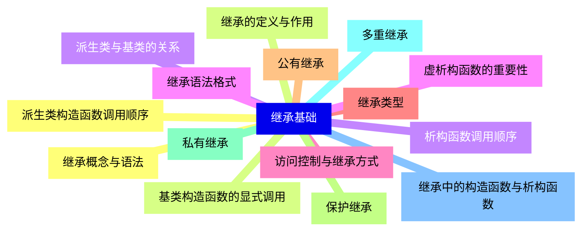
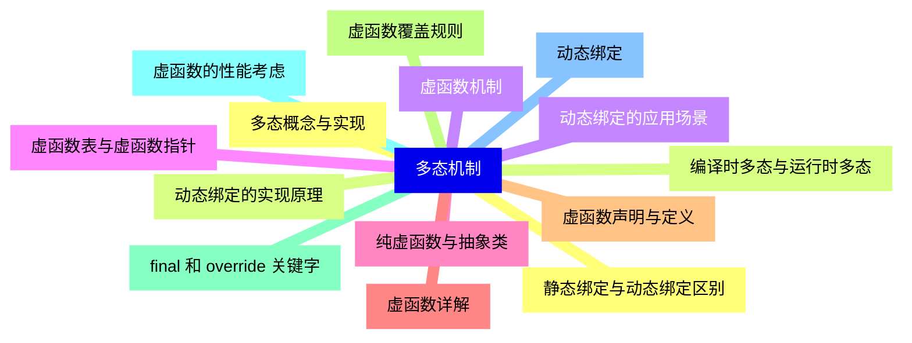
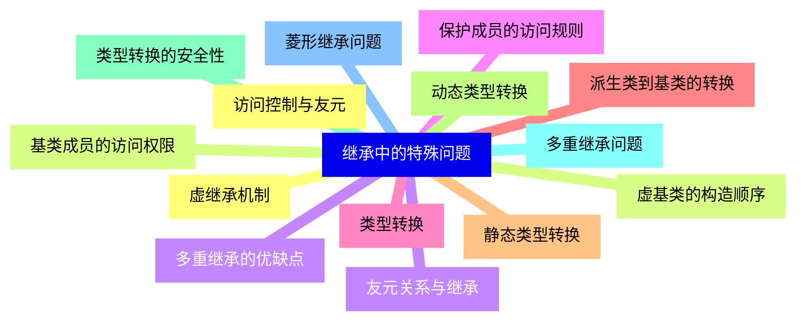
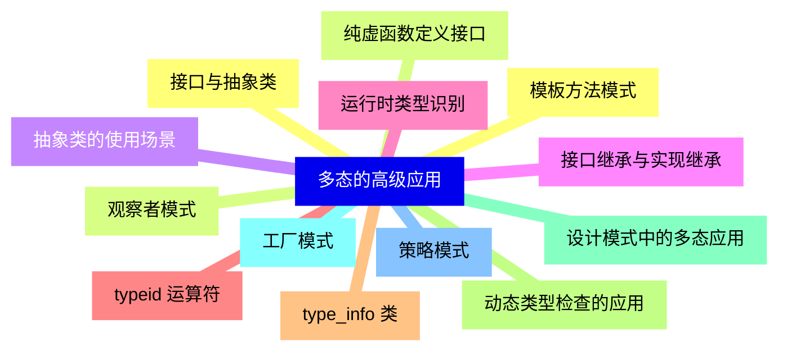
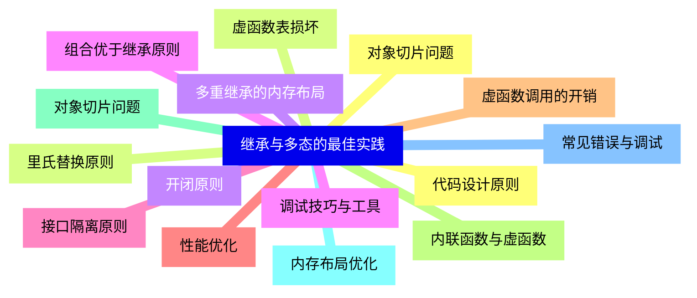
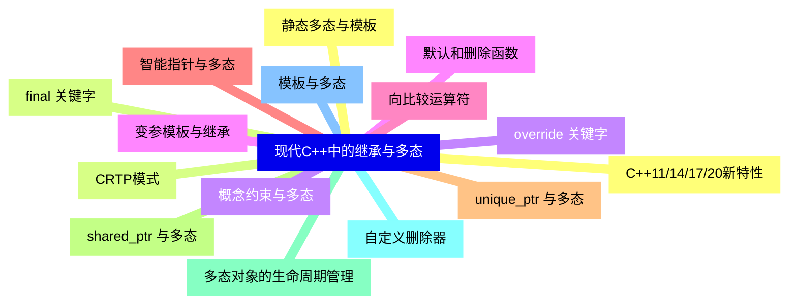


### 1 [继承基础](#1)
#### 1.1 [继承概念与语法](#1)
#### 1.2 [继承的定义与作用](#1)
#### 1.3 [派生类与基类的关系](#1)
#### 1.4 [继承语法格式](#1)
#### 1.5 [访问控制与继承方式](#1)
#### 1.6 [继承类型](#1)
#### 1.7 [公有继承](#1)
#### 1.8 [保护继承](#1)
#### 1.9 [私有继承](#1)
#### 1.10 [多重继承](#1)
#### 1.11 [继承中的构造函数与析构函数](#1)
#### 1.12 [派生类构造函数调用顺序](#1)
#### 1.13 [基类构造函数的显式调用](#1)
#### 1.14 [析构函数调用顺序](#1)
#### 1.15 [虚析构函数的重要性](#1)
### 2 [多态机制](#2)
#### 2.1 [多态概念与实现](#2)
#### 2.2 [编译时多态与运行时多态](#2)
#### 2.3 [虚函数机制](#2)
#### 2.4 [虚函数表与虚函数指针](#2)
#### 2.5 [纯虚函数与抽象类](#2)
#### 2.6 [虚函数详解](#2)
#### 2.7 [虚函数声明与定义](#2)
#### 2.8 [虚函数覆盖规则](#2)
#### 2.9 [final 和 override 关键字](#2)
#### 2.10 [虚函数的性能考虑](#2)
#### 2.11 [动态绑定](#2)
#### 2.12 [静态绑定与动态绑定区别](#2)
#### 2.13 [动态绑定的实现原理](#2)
#### 2.14 [动态绑定的应用场景](#2)
### 3 [继承中的特殊问题](#3)
#### 3.1 [访问控制与友元](#3)
#### 3.2 [基类成员的访问权限](#3)
#### 3.3 [友元关系与继承](#3)
#### 3.4 [保护成员的访问规则](#3)
#### 3.5 [类型转换](#3)
#### 3.6 [派生类到基类的转换](#3)
#### 3.7 [静态类型转换](#3)
#### 3.8 [动态类型转换](#3)
#### 3.9 [类型转换的安全性](#3)
#### 3.10 [多重继承问题](#3)
#### 3.11 [菱形继承问题](#3)
#### 3.12 [虚继承机制](#3)
#### 3.13 [虚基类的构造顺序](#3)
#### 3.14 [多重继承的优缺点](#3)
### 4 [多态的高级应用](#4)
#### 4.1 [接口与抽象类](#4)
#### 4.2 [纯虚函数定义接口](#4)
#### 4.3 [抽象类的使用场景](#4)
#### 4.4 [接口继承与实现继承](#4)
#### 4.5 [运行时类型识别](#4)
#### 4.6 [typeid 运算符](#4)
#### 4.7 [type_info 类](#4)
#### 4.8 [动态类型检查的应用](#4)
#### 4.9 [设计模式中的多态应用](#4)
#### 4.10 [工厂模式](#4)
#### 4.11 [策略模式](#4)
#### 4.12 [模板方法模式](#4)
#### 4.13 [观察者模式](#4)
### 5 [继承与多态的最佳实践](#5)
#### 5.1 [代码设计原则](#5)
#### 5.2 [里氏替换原则](#5)
#### 5.3 [开闭原则](#5)
#### 5.4 [组合优于继承原则](#5)
#### 5.5 [接口隔离原则](#5)
#### 5.6 [性能优化](#5)
#### 5.7 [虚函数调用的开销](#5)
#### 5.8 [内联函数与虚函数](#5)
#### 5.9 [对象切片问题](#5)
#### 5.10 [内存布局优化](#5)
#### 5.11 [常见错误与调试](#5)
#### 5.12 [对象切片问题](#5)
#### 5.13 [虚函数表损坏](#5)
#### 5.14 [多重继承的内存布局](#5)
#### 5.15 [调试技巧与工具](#5)
### 6 [现代C++中的继承与多态](#6)
#### 6.1 [C++11/14/17/20新特性](#6)
#### 6.2 [final 关键字](#6)
#### 6.3 [override 关键字](#6)
#### 6.4 [默认和删除函数](#6)
#### 6.5 [向比较运算符](#6)
#### 6.6 [智能指针与多态](#6)
#### 6.7 [unique_ptr 与多态](#6)
#### 6.8 [shared_ptr 与多态](#6)
#### 6.9 [多态对象的生命周期管理](#6)
#### 6.10 [自定义删除器](#6)
#### 6.11 [模板与多态](#6)
#### 6.12 [静态多态与模板](#6)
#### 6.13 [CRTP模式](#6)
#### 6.14 [概念约束与多态](#6)
#### 6.15 [变参模板与继承](#6)




### 1 继承基础

---
### 1 继承基础
___
#### 1.1 继承概念与语法
___
#### 1.2 继承的定义与作用
___
#### 1.3 派生类与基类的关系
___
#### 1.4 继承语法格式
___
#### 1.5 访问控制与继承方式
___
#### 1.6 继承类型
___
#### 1.7 公有继承
___
#### 1.8 保护继承
___
#### 1.9 私有继承
___
#### 1.10 多重继承
___
#### 1.11 继承中的构造函数与析构函数
___
#### 1.12 派生类构造函数调用顺序
___
#### 1.13 基类构造函数的显式调用
___
#### 1.14 析构函数调用顺序
___
#### 1.15 虚析构函数的重要性
### 2 多态机制

---
### 2 多态机制
___
#### 2.1 多态概念与实现
___
#### 2.2 编译时多态与运行时多态
___
#### 2.3 虚函数机制
___
#### 2.4 虚函数表与虚函数指针
___
#### 2.5 纯虚函数与抽象类
___
#### 2.6 虚函数详解
___
#### 2.7 虚函数声明与定义
___
#### 2.8 虚函数覆盖规则
___
#### 2.9 final 和 override 关键字
___
#### 2.10 虚函数的性能考虑
___
#### 2.11 动态绑定
___
#### 2.12 静态绑定与动态绑定区别
___
#### 2.13 动态绑定的实现原理
___
#### 2.14 动态绑定的应用场景
### 3 继承中的特殊问题

---
### 3 继承中的特殊问题
___
#### 3.1 访问控制与友元
___
#### 3.2 基类成员的访问权限
___
#### 3.3 友元关系与继承
___
#### 3.4 保护成员的访问规则
___
#### 3.5 类型转换
___
#### 3.6 派生类到基类的转换
___
#### 3.7 静态类型转换
___
#### 3.8 动态类型转换
___
#### 3.9 类型转换的安全性
___
#### 3.10 多重继承问题
___
#### 3.11 菱形继承问题
___
#### 3.12 虚继承机制
___
#### 3.13 虚基类的构造顺序
___
#### 3.14 多重继承的优缺点
### 4 多态的高级应用

---
### 4 多态的高级应用
___
#### 4.1 接口与抽象类
___
#### 4.2 纯虚函数定义接口
___
#### 4.3 抽象类的使用场景
___
#### 4.4 接口继承与实现继承
___
#### 4.5 运行时类型识别
___
#### 4.6 typeid 运算符
___
#### 4.7 type_info 类
___
#### 4.8 动态类型检查的应用
___
#### 4.9 设计模式中的多态应用
___
#### 4.10 工厂模式
___
#### 4.11 策略模式
___
#### 4.12 模板方法模式
___
#### 4.13 观察者模式
### 5 继承与多态的最佳实践

---
### 5 继承与多态的最佳实践
___
#### 5.1 代码设计原则
___
#### 5.2 里氏替换原则
___
#### 5.3 开闭原则
___
#### 5.4 组合优于继承原则
___
#### 5.5 接口隔离原则
___
#### 5.6 性能优化
___
#### 5.7 虚函数调用的开销
___
#### 5.8 内联函数与虚函数
___
#### 5.9 对象切片问题
___
#### 5.10 内存布局优化
___
#### 5.11 常见错误与调试
___
#### 5.12 对象切片问题
___
#### 5.13 虚函数表损坏
___
#### 5.14 多重继承的内存布局
___
#### 5.15 调试技巧与工具
### 6 现代C++中的继承与多态

---
### 6 现代C++中的继承与多态
___
#### 6.1 C++11/14/17/20新特性
___
#### 6.2 final 关键字
___
#### 6.3 override 关键字
___
#### 6.4 默认和删除函数
___
#### 6.5 向比较运算符
___
#### 6.6 智能指针与多态
___
#### 6.7 unique_ptr 与多态
___
#### 6.8 shared_ptr 与多态
___
#### 6.9 多态对象的生命周期管理
___
#### 6.10 自定义删除器
___
#### 6.11 模板与多态
___
#### 6.12 静态多态与模板
___
#### 6.13 CRTP模式
___
#### 6.14 概念约束与多态
___
#### 6.15 变参模板与继承


### 1 继承基础{#1}

{}

<--->
{}
{}
{}
{}
{}
{}
{}
{}
{}
{}
{}
{}
{}
{}
{}
{}
{}
{}
{}
{}
{}
{}
{}
{}
{}
{}
{}
{}
{}
{}
{}

### 2 多态机制{#2}

{}
{}
{}
{}
{}
{}
{}
{}
{}
{}
{}
{}
{}
{}
{}
{}
{}
{}
{}
{}
{}
{}
{}
{}
{}
{}
{}
{}
{}
<--->

{}

### 3 继承中的特殊问题{#3}

{}

<--->
{}
{}
{}
{}
{}
{}
{}
{}
{}
{}
{}
{}
{}
{}
{}
{}
{}
{}
{}
{}
{}
{}
{}
{}
{}
{}
{}
{}
{}

### 4 多态的高级应用{#4}

{}
{}
{}
{}
{}
{}
{}
{}
{}
{}
{}
{}
{}
{}
{}
{}
{}
{}
{}
{}
{}
{}
{}
{}
{}
{}
{}
<--->

{}

### 5 继承与多态的最佳实践{#5}

{}

<--->
{}
{}
{}
{}
{}
{}
{}
{}
{}
{}
{}
{}
{}
{}
{}
{}
{}
{}
{}
{}
{}
{}
{}
{}
{}
{}
{}
{}
{}
{}
{}

### 6 现代C++中的继承与多态{#6}

{}
{}
{}
{}
{}
{}
{}
{}
{}
{}
{}
{}
{}
{}
{}
{}
{}
{}
{}
{}
{}
{}
{}
{}
{}
{}
{}
{}
{}
{}
{}
<--->

{}
