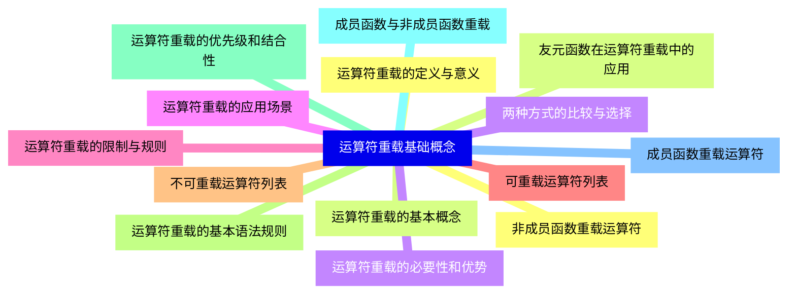
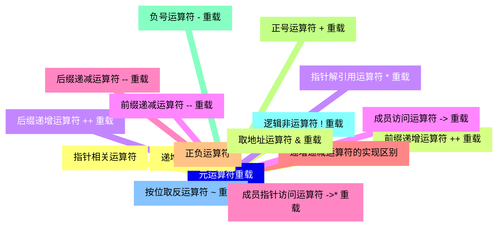
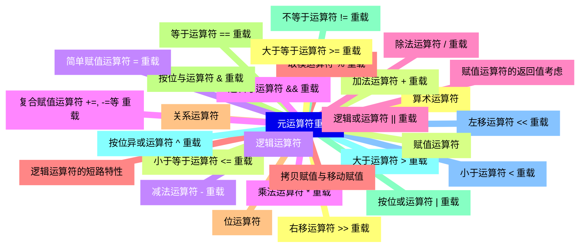
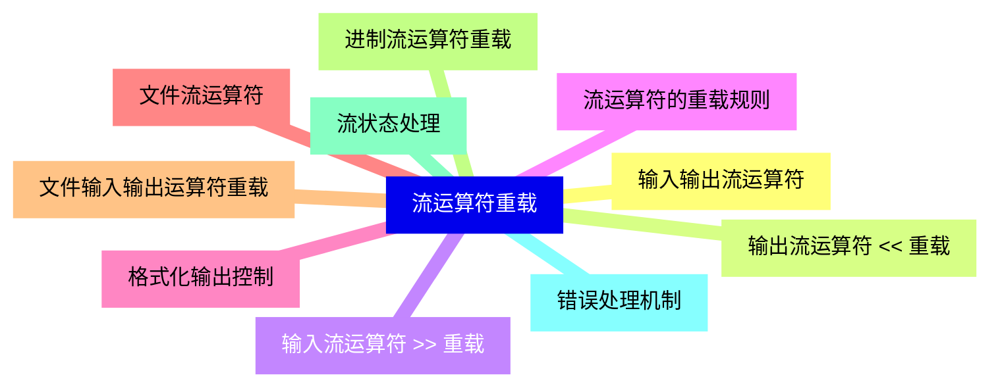
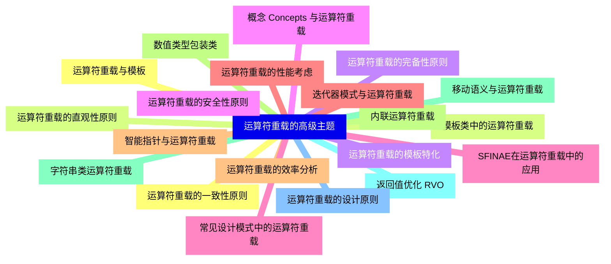
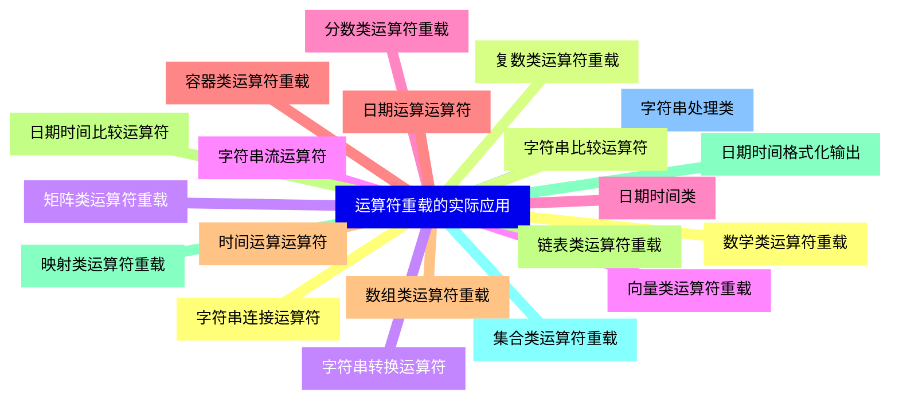
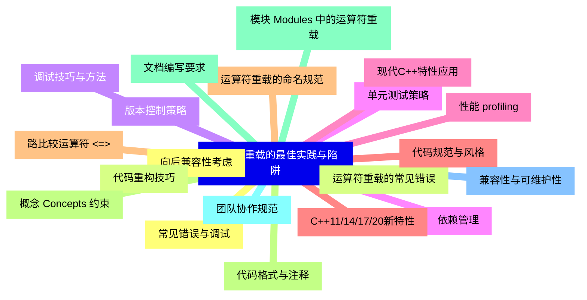


### 1 [运算符重载基础概念](#1)
#### 1.1 [运算符重载的定义与意义](#1)
#### 1.2 [运算符重载的基本概念](#1)
#### 1.3 [运算符重载的必要性和优势](#1)
#### 1.4 [运算符重载的应用场景](#1)
#### 1.5 [运算符重载的限制与规则](#1)
#### 1.6 [可重载运算符列表](#1)
#### 1.7 [不可重载运算符列表](#1)
#### 1.8 [运算符重载的基本语法规则](#1)
#### 1.9 [运算符重载的优先级和结合性](#1)
#### 1.10 [成员函数与非成员函数重载](#1)
#### 1.11 [成员函数重载运算符](#1)
#### 1.12 [非成员函数重载运算符](#1)
#### 1.13 [友元函数在运算符重载中的应用](#1)
#### 1.14 [两种方式的比较与选择](#1)
### 2 [元运算符重载](#2)
#### 2.1 [递增递减运算符](#2)
#### 2.2 [前缀递增运算符 ++ 重载](#2)
#### 2.3 [后缀递增运算符 ++ 重载](#2)
#### 2.4 [前缀递减运算符 -- 重载](#2)
#### 2.5 [后缀递减运算符 -- 重载](#2)
#### 2.6 [递增递减运算符的实现区别](#2)
#### 2.7 [正负运算符](#2)
#### 2.8 [正号运算符 + 重载](#2)
#### 2.9 [负号运算符 - 重载](#2)
#### 2.10 [逻辑非运算符 ! 重载](#2)
#### 2.11 [按位取反运算符 ~ 重载](#2)
#### 2.12 [指针相关运算符](#2)
#### 2.13 [取地址运算符 & 重载](#2)
#### 2.14 [指针解引用运算符 * 重载](#2)
#### 2.15 [成员访问运算符 -> 重载](#2)
#### 2.16 [成员指针访问运算符 ->* 重载](#2)
### 3 [元运算符重载](#3)
#### 3.1 [算术运算符](#3)
#### 3.2 [加法运算符 + 重载](#3)
#### 3.3 [减法运算符 - 重载](#3)
#### 3.4 [乘法运算符 * 重载](#3)
#### 3.5 [除法运算符 / 重载](#3)
#### 3.6 [取模运算符 % 重载](#3)
#### 3.7 [关系运算符](#3)
#### 3.8 [等于运算符 == 重载](#3)
#### 3.9 [不等于运算符 != 重载](#3)
#### 3.10 [大于运算符 > 重载](#3)
#### 3.11 [小于运算符 < 重载](#3)
#### 3.12 [大于等于运算符 >= 重载](#3)
#### 3.13 [小于等于运算符 <= 重载](#3)
#### 3.14 [逻辑运算符](#3)
#### 3.15 [逻辑与运算符 && 重载](#3)
#### 3.16 [逻辑或运算符 || 重载](#3)
#### 3.17 [逻辑运算符的短路特性](#3)
#### 3.18 [位运算符](#3)
#### 3.19 [按位与运算符 & 重载](#3)
#### 3.20 [按位或运算符 | 重载](#3)
#### 3.21 [按位异或运算符 ^ 重载](#3)
#### 3.22 [左移运算符 << 重载](#3)
#### 3.23 [右移运算符 >> 重载](#3)
#### 3.24 [赋值运算符](#3)
#### 3.25 [简单赋值运算符 = 重载](#3)
#### 3.26 [复合赋值运算符 +=, -=等 重载](#3)
#### 3.27 [赋值运算符的返回值考虑](#3)
#### 3.28 [拷贝赋值与移动赋值](#3)
### 4 [特殊运算符重载](#4)
#### 4.1 [函数调用运算符](#4)
#### 4.2 [函数调用运算符    重载](#4)
#### 4.3 [函数对象 Functor 的概念](#4)
#### 4.4 [函数对象的应用场景](#4)
#### 4.5 [Lambda表达式与函数对象](#4)
#### 4.6 [下标运算符](#4)
#### 4.7 [下标运算符 [] 重载](#4)
#### 4.8 [常量版本与非常量版本](#4)
#### 4.9 [多维下标运算符实现](#4)
#### 4.10 [边界检查与异常处理](#4)
#### 4.11 [类型转换运算符](#4)
#### 4.12 [类型转换运算符重载](#4)
#### 4.13 [显式类型转换与隐式类型转换](#4)
#### 4.14 [转换运算符的注意事项](#4)
#### 4.15 [避免循环转换问题](#4)
#### 4.16 [内存管理运算符](#4)
#### 4.17 [new运算符重载](#4)
#### 4.18 [delete运算符重载](#4)
#### 4.19 [new[]运算符重载](#4)
#### 4.20 [delete[]运算符重载](#4)
#### 4.21 [定位new运算符](#4)
### 5 [流运算符重载](#5)
#### 5.1 [输入输出流运算符](#5)
#### 5.2 [输出流运算符 << 重载](#5)
#### 5.3 [输入流运算符 >> 重载](#5)
#### 5.4 [流运算符的重载规则](#5)
#### 5.5 [格式化输出控制](#5)
#### 5.6 [文件流运算符](#5)
#### 5.7 [文件输入输出运算符重载](#5)
#### 5.8 [进制流运算符重载](#5)
#### 5.9 [流状态处理](#5)
#### 5.10 [错误处理机制](#5)
### 6 [运算符重载的高级主题](#6)
#### 6.1 [运算符重载与模板](#6)
#### 6.2 [模板类中的运算符重载](#6)
#### 6.3 [运算符重载的模板特化](#6)
#### 6.4 [概念 Concepts 与运算符重载](#6)
#### 6.5 [SFINAE在运算符重载中的应用](#6)
#### 6.6 [运算符重载的性能考虑](#6)
#### 6.7 [运算符重载的效率分析](#6)
#### 6.8 [内联运算符重载](#6)
#### 6.9 [移动语义与运算符重载](#6)
#### 6.10 [返回值优化 RVO](#6)
#### 6.11 [运算符重载的设计原则](#6)
#### 6.12 [运算符重载的一致性原则](#6)
#### 6.13 [运算符重载的直观性原则](#6)
#### 6.14 [运算符重载的完备性原则](#6)
#### 6.15 [运算符重载的安全性原则](#6)
#### 6.16 [常见设计模式中的运算符重载](#6)
#### 6.17 [迭代器模式与运算符重载](#6)
#### 6.18 [智能指针与运算符重载](#6)
#### 6.19 [数值类型包装类](#6)
#### 6.20 [字符串类运算符重载](#6)
### 7 [运算符重载的实际应用](#7)
#### 7.1 [数学类运算符重载](#7)
#### 7.2 [复数类运算符重载](#7)
#### 7.3 [矩阵类运算符重载](#7)
#### 7.4 [向量类运算符重载](#7)
#### 7.5 [分数类运算符重载](#7)
#### 7.6 [容器类运算符重载](#7)
#### 7.7 [数组类运算符重载](#7)
#### 7.8 [链表类运算符重载](#7)
#### 7.9 [映射类运算符重载](#7)
#### 7.10 [集合类运算符重载](#7)
#### 7.11 [字符串处理类](#7)
#### 7.12 [字符串连接运算符](#7)
#### 7.13 [字符串比较运算符](#7)
#### 7.14 [字符串转换运算符](#7)
#### 7.15 [字符串流运算符](#7)
#### 7.16 [日期时间类](#7)
#### 7.17 [日期运算运算符](#7)
#### 7.18 [时间运算运算符](#7)
#### 7.19 [日期时间比较运算符](#7)
#### 7.20 [日期时间格式化输出](#7)
### 8 [运算符重载的最佳实践与陷阱](#8)
#### 8.1 [常见错误与调试](#8)
#### 8.2 [运算符重载的常见错误](#8)
#### 8.3 [调试技巧与方法](#8)
#### 8.4 [单元测试策略](#8)
#### 8.5 [性能 profiling](#8)
#### 8.6 [代码规范与风格](#8)
#### 8.7 [运算符重载的命名规范](#8)
#### 8.8 [代码格式与注释](#8)
#### 8.9 [文档编写要求](#8)
#### 8.10 [团队协作规范](#8)
#### 8.11 [兼容性与可维护性](#8)
#### 8.12 [向后兼容性考虑](#8)
#### 8.13 [代码重构技巧](#8)
#### 8.14 [版本控制策略](#8)
#### 8.15 [依赖管理](#8)
#### 8.16 [现代C++特性应用](#8)
#### 8.17 [C++11/14/17/20新特性](#8)
#### 8.18 [路比较运算符 <=>](#8)
#### 8.19 [概念 Concepts 约束](#8)
#### 8.20 [模块 Modules 中的运算符重载](#8)





### 1 运算符重载基础概念


---
### 1 运算符重载基础概念
___
#### 1.1 运算符重载的定义与意义
___
#### 1.2 运算符重载的基本概念
___
#### 1.3 运算符重载的必要性和优势
___
#### 1.4 运算符重载的应用场景
___
#### 1.5 运算符重载的限制与规则
___
#### 1.6 可重载运算符列表
___
#### 1.7 不可重载运算符列表
___
#### 1.8 运算符重载的基本语法规则
___
#### 1.9 运算符重载的优先级和结合性
___
#### 1.10 成员函数与非成员函数重载
___
#### 1.11 成员函数重载运算符
___
#### 1.12 非成员函数重载运算符
___
#### 1.13 友元函数在运算符重载中的应用
___
#### 1.14 两种方式的比较与选择
### 2 元运算符重载


---
### 2 元运算符重载
___
#### 2.1 递增递减运算符
___
#### 2.2 前缀递增运算符 ++ 重载
___
#### 2.3 后缀递增运算符 ++ 重载
___
#### 2.4 前缀递减运算符 -- 重载
___
#### 2.5 后缀递减运算符 -- 重载
___
#### 2.6 递增递减运算符的实现区别
___
#### 2.7 正负运算符
___
#### 2.8 正号运算符 + 重载
___
#### 2.9 负号运算符 - 重载
___
#### 2.10 逻辑非运算符 ! 重载
___
#### 2.11 按位取反运算符 ~ 重载
___
#### 2.12 指针相关运算符
___
#### 2.13 取地址运算符 & 重载
___
#### 2.14 指针解引用运算符 * 重载
___
#### 2.15 成员访问运算符 -> 重载
___
#### 2.16 成员指针访问运算符 ->* 重载
### 3 元运算符重载


---
### 3 元运算符重载
___
#### 3.1 算术运算符
___
#### 3.2 加法运算符 + 重载
___
#### 3.3 减法运算符 - 重载
___
#### 3.4 乘法运算符 * 重载
___
#### 3.5 除法运算符 / 重载
___
#### 3.6 取模运算符 % 重载
___
#### 3.7 关系运算符
___
#### 3.8 等于运算符 == 重载
___
#### 3.9 不等于运算符 != 重载
___
#### 3.10 大于运算符 > 重载
___
#### 3.11 小于运算符 < 重载
___
#### 3.12 大于等于运算符 >= 重载
___
#### 3.13 小于等于运算符 <= 重载
___
#### 3.14 逻辑运算符
___
#### 3.15 逻辑与运算符 && 重载
___
#### 3.16 逻辑或运算符 || 重载
___
#### 3.17 逻辑运算符的短路特性
___
#### 3.18 位运算符
___
#### 3.19 按位与运算符 & 重载
___
#### 3.20 按位或运算符 | 重载
___
#### 3.21 按位异或运算符 ^ 重载
___
#### 3.22 左移运算符 << 重载
___
#### 3.23 右移运算符 >> 重载
___
#### 3.24 赋值运算符
___
#### 3.25 简单赋值运算符 = 重载
___
#### 3.26 复合赋值运算符 +=, -=等 重载
___
#### 3.27 赋值运算符的返回值考虑
___
#### 3.28 拷贝赋值与移动赋值
### 4 特殊运算符重载


---
### 4 特殊运算符重载
___
#### 4.1 函数调用运算符
___
#### 4.2 函数调用运算符    重载
___
#### 4.3 函数对象 Functor 的概念
___
#### 4.4 函数对象的应用场景
___
#### 4.5 Lambda表达式与函数对象
___
#### 4.6 下标运算符
___
#### 4.7 下标运算符 [] 重载
___
#### 4.8 常量版本与非常量版本
___
#### 4.9 多维下标运算符实现
___
#### 4.10 边界检查与异常处理
___
#### 4.11 类型转换运算符
___
#### 4.12 类型转换运算符重载
___
#### 4.13 显式类型转换与隐式类型转换
___
#### 4.14 转换运算符的注意事项
___
#### 4.15 避免循环转换问题
___
#### 4.16 内存管理运算符
___
#### 4.17 new运算符重载
___
#### 4.18 delete运算符重载
___
#### 4.19 new[]运算符重载
___
#### 4.20 delete[]运算符重载
___
#### 4.21 定位new运算符
### 5 流运算符重载


---
### 5 流运算符重载
___
#### 5.1 输入输出流运算符
___
#### 5.2 输出流运算符 << 重载
___
#### 5.3 输入流运算符 >> 重载
___
#### 5.4 流运算符的重载规则
___
#### 5.5 格式化输出控制
___
#### 5.6 文件流运算符
___
#### 5.7 文件输入输出运算符重载
___
#### 5.8 进制流运算符重载
___
#### 5.9 流状态处理
___
#### 5.10 错误处理机制
### 6 运算符重载的高级主题


---
### 6 运算符重载的高级主题
___
#### 6.1 运算符重载与模板
___
#### 6.2 模板类中的运算符重载
___
#### 6.3 运算符重载的模板特化
___
#### 6.4 概念 Concepts 与运算符重载
___
#### 6.5 SFINAE在运算符重载中的应用
___
#### 6.6 运算符重载的性能考虑
___
#### 6.7 运算符重载的效率分析
___
#### 6.8 内联运算符重载
___
#### 6.9 移动语义与运算符重载
___
#### 6.10 返回值优化 RVO
___
#### 6.11 运算符重载的设计原则
___
#### 6.12 运算符重载的一致性原则
___
#### 6.13 运算符重载的直观性原则
___
#### 6.14 运算符重载的完备性原则
___
#### 6.15 运算符重载的安全性原则
___
#### 6.16 常见设计模式中的运算符重载
___
#### 6.17 迭代器模式与运算符重载
___
#### 6.18 智能指针与运算符重载
___
#### 6.19 数值类型包装类
___
#### 6.20 字符串类运算符重载
### 7 运算符重载的实际应用


---
### 7 运算符重载的实际应用
___
#### 7.1 数学类运算符重载
___
#### 7.2 复数类运算符重载
___
#### 7.3 矩阵类运算符重载
___
#### 7.4 向量类运算符重载
___
#### 7.5 分数类运算符重载
___
#### 7.6 容器类运算符重载
___
#### 7.7 数组类运算符重载
___
#### 7.8 链表类运算符重载
___
#### 7.9 映射类运算符重载
___
#### 7.10 集合类运算符重载
___
#### 7.11 字符串处理类
___
#### 7.12 字符串连接运算符
___
#### 7.13 字符串比较运算符
___
#### 7.14 字符串转换运算符
___
#### 7.15 字符串流运算符
___
#### 7.16 日期时间类
___
#### 7.17 日期运算运算符
___
#### 7.18 时间运算运算符
___
#### 7.19 日期时间比较运算符
___
#### 7.20 日期时间格式化输出
### 8 运算符重载的最佳实践与陷阱


---
### 8 运算符重载的最佳实践与陷阱
___
#### 8.1 常见错误与调试
___
#### 8.2 运算符重载的常见错误
___
#### 8.3 调试技巧与方法
___
#### 8.4 单元测试策略
___
#### 8.5 性能 profiling
___
#### 8.6 代码规范与风格
___
#### 8.7 运算符重载的命名规范
___
#### 8.8 代码格式与注释
___
#### 8.9 文档编写要求
___
#### 8.10 团队协作规范
___
#### 8.11 兼容性与可维护性
___
#### 8.12 向后兼容性考虑
___
#### 8.13 代码重构技巧
___
#### 8.14 版本控制策略
___
#### 8.15 依赖管理
___
#### 8.16 现代C++特性应用
___
#### 8.17 C++11/14/17/20新特性
___
#### 8.18 路比较运算符 <=>
___
#### 8.19 概念 Concepts 约束
___
#### 8.20 模块 Modules 中的运算符重载



### 1 运算符重载基础概念{#1}


{}


<--->
{}
{}
{}
{}
{}
{}
{}
{}
{}
{}
{}
{}
{}
{}
{}
{}
{}
{}
{}
{}
{}
{}
{}
{}
{}
{}
{}
{}
{}

### 2 元运算符重载{#2}


{}
{}
{}
{}
{}
{}
{}
{}
{}
{}
{}
{}
{}
{}
{}
{}
{}
{}
{}
{}
{}
{}
{}
{}
{}
{}
{}
{}
{}
{}
{}
{}
{}
<--->


{}

### 3 元运算符重载{#3}


{}


<--->
{}
{}
{}
{}
{}
{}
{}
{}
{}
{}
{{% details "取模运算符 % 重载" %}}
{}
{}
{}
{}
{}
{}
{}
{}
{}
{}
{}
{}
{}
{}
{}
{}
{}
{}
{}
{}
{}
{}
{}
{}
{}
{}
{}
{}
{}
{}
{}
{}
{}
{}
{}
{}
{}
{}
{}
{}
{}
{}
{}
{}
{}
{}

### 4 特殊运算符重载{#4}


{}
{}
{}
{}
{}
{}
{}
{}
{}
{}
{}
{}
{}
{}
{}
{}
{}
{}
{}
{}
{}
{}
{}
{}
{}
{}
{}
{}
{}
{}
{}
{}
{}
{}
{}
{}
{}
{}
{}
{}
{}
{}
{}
<--->
```mermaid
mindmap
    id4[特殊运算符重载]
        id4-1[函数调用运算符]
        id4-2[函数调用运算符    重载]
        id4-3[函数对象 Functor 的概念]
        id4-4[函数对象的应用场景]
        id4-5[Lambda表达式与函数对象]
        id4-6[下标运算符]
        id4-7[下标运算符 [] 重载]
        id4-8[常量版本与非常量版本]
        id4-9[多维下标运算符实现]
        id4-10[边界检查与异常处理]
        id4-11[类型转换运算符]
        id4-12[类型转换运算符重载]
        id4-13[显式类型转换与隐式类型转换]
        id4-14[转换运算符的注意事项]
        id4-15[避免循环转换问题]
        id4-16[内存管理运算符]
        id4-17[new运算符重载]
        id4-18[delete运算符重载]
        id4-19[new[]运算符重载]
        id4-20[delete[]运算符重载]
        id4-21[定位new运算符]
```

{}

### 5 流运算符重载{#5}


{}


<--->
{}
{}
{}
{}
{}
{}
{}
{}
{}
{}
{}
{}
{}
{}
{}
{}
{}
{}
{}
{}
{}

### 6 运算符重载的高级主题{#6}


{}
{}
{}
{}
{}
{}
{}
{}
{}
{}
{}
{}
{}
{}
{}
{}
{}
{}
{}
{}
{}
{}
{}
{}
{}
{}
{}
{}
{}
{}
{}
{}
{}
{}
{}
{}
{}
{}
{}
{}
{}
<--->


{}

### 7 运算符重载的实际应用{#7}


{}


<--->
{}
{}
{}
{}
{}
{}
{}
{}
{}
{}
{}
{}
{}
{}
{}
{}
{}
{}
{}
{}
{}
{}
{}
{}
{}
{}
{}
{}
{}
{}
{}
{}
{}
{}
{}
{}
{}
{}
{}
{}
{}

### 8 运算符重载的最佳实践与陷阱{#8}


{}
{}
{}
{}
{}
{}
{}
{}
{}
{}
{}
{}
{}
{}
{}
{}
{}
{}
{}
{}
{}
{}
{}
{}
{}
{}
{}
{}
{}
{}
{}
{}
{}
{}
{}
{}
{}
{}
{}
{}
{}
<--->


{}
