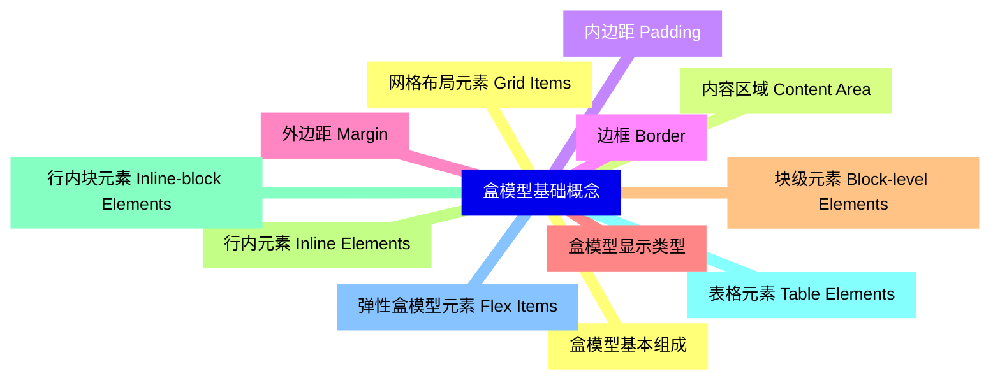
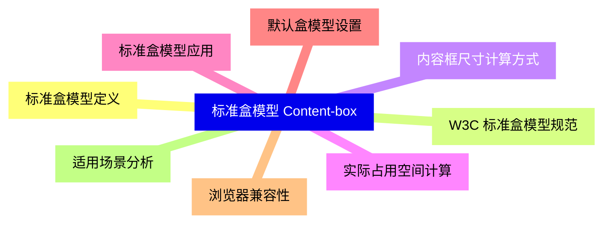
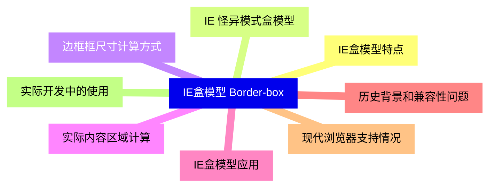
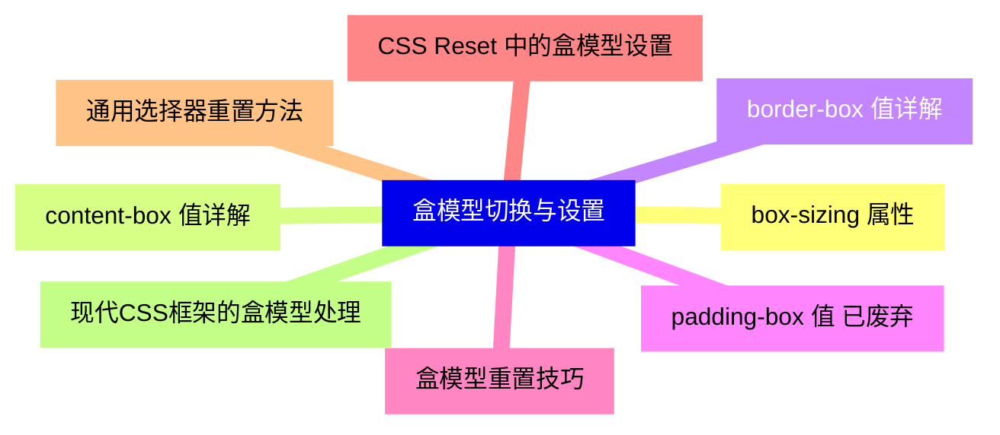
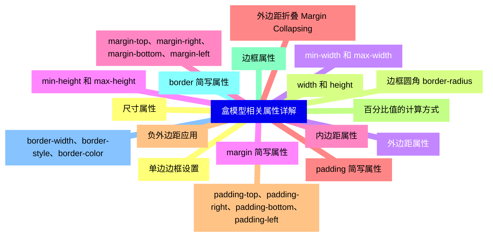
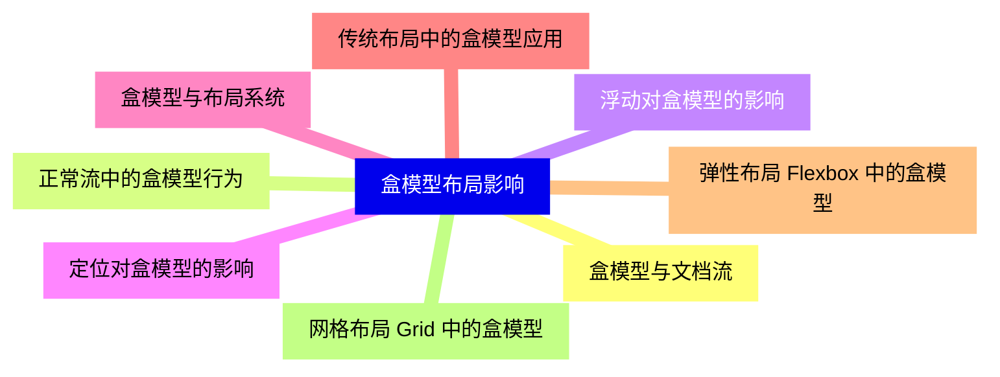
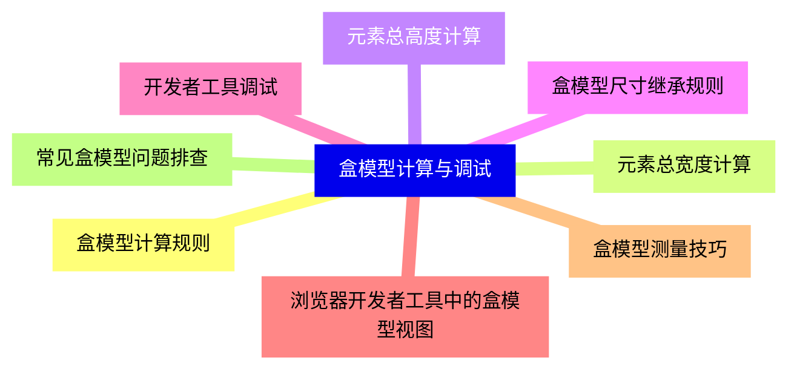
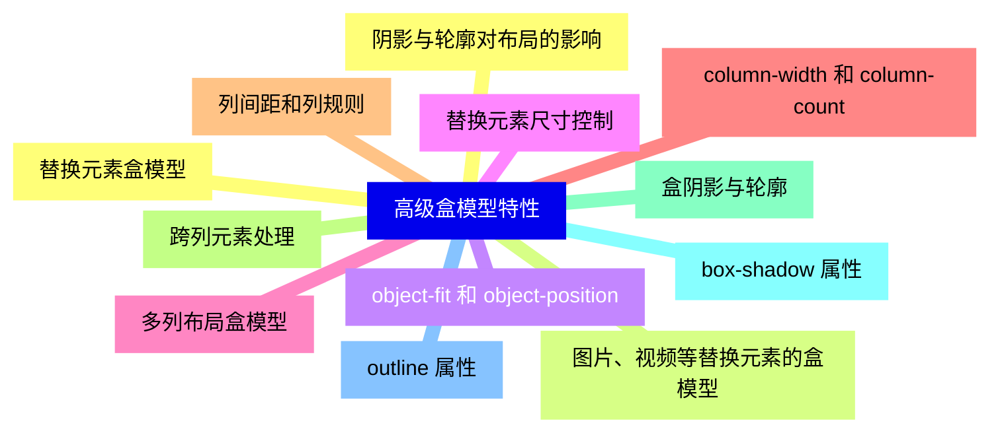
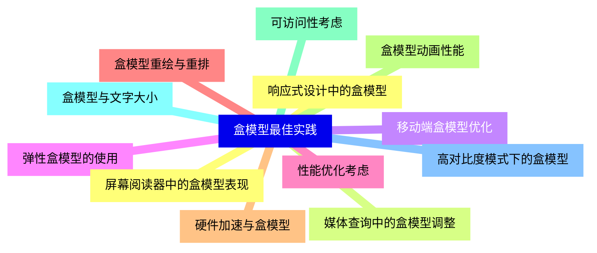


### 1 [盒模型基础概念](#1)
#### 1.1 [盒模型基本组成](#1)
#### 1.2 [内容区域 Content Area](#1)
#### 1.3 [内边距 Padding](#1)
#### 1.4 [边框 Border](#1)
#### 1.5 [外边距 Margin](#1)
#### 1.6 [盒模型显示类型](#1)
#### 1.7 [块级元素 Block-level Elements](#1)
#### 1.8 [行内元素 Inline Elements](#1)
#### 1.9 [行内块元素 Inline-block Elements](#1)
#### 1.10 [表格元素 Table Elements](#1)
#### 1.11 [弹性盒模型元素 Flex Items](#1)
#### 1.12 [网格布局元素 Grid Items](#1)
### 2 [标准盒模型 Content-box](#2)
#### 2.1 [标准盒模型定义](#2)
#### 2.2 [W3C 标准盒模型规范](#2)
#### 2.3 [内容框尺寸计算方式](#2)
#### 2.4 [实际占用空间计算](#2)
#### 2.5 [标准盒模型应用](#2)
#### 2.6 [默认盒模型设置](#2)
#### 2.7 [浏览器兼容性](#2)
#### 2.8 [适用场景分析](#2)
### 3 [IE盒模型 Border-box](#3)
#### 3.1 [IE盒模型特点](#3)
#### 3.2 [IE 怪异模式盒模型](#3)
#### 3.3 [边框框尺寸计算方式](#3)
#### 3.4 [实际内容区域计算](#3)
#### 3.5 [IE盒模型应用](#3)
#### 3.6 [历史背景和兼容性问题](#3)
#### 3.7 [现代浏览器支持情况](#3)
#### 3.8 [实际开发中的使用](#3)
### 4 [盒模型切换与设置](#4)
#### 4.1 [box-sizing 属性](#4)
#### 4.2 [content-box 值详解](#4)
#### 4.3 [border-box 值详解](#4)
#### 4.4 [padding-box 值 已废弃](#4)
#### 4.5 [盒模型重置技巧](#4)
#### 4.6 [CSS Reset 中的盒模型设置](#4)
#### 4.7 [通用选择器重置方法](#4)
#### 4.8 [现代CSS框架的盒模型处理](#4)
### 5 [盒模型相关属性详解](#5)
#### 5.1 [尺寸属性](#5)
#### 5.2 [width 和 height](#5)
#### 5.3 [min-width 和 max-width](#5)
#### 5.4 [min-height 和 max-height](#5)
#### 5.5 [内边距属性](#5)
#### 5.6 [padding 简写属性](#5)
#### 5.7 [padding-top、padding-right、padding-bottom、padding-left](#5)
#### 5.8 [百分比值的计算方式](#5)
#### 5.9 [边框属性](#5)
#### 5.10 [border 简写属性](#5)
#### 5.11 [border-width、border-style、border-color](#5)
#### 5.12 [单边边框设置](#5)
#### 5.13 [边框圆角 border-radius](#5)
#### 5.14 [外边距属性](#5)
#### 5.15 [margin 简写属性](#5)
#### 5.16 [margin-top、margin-right、margin-bottom、margin-left](#5)
#### 5.17 [外边距折叠 Margin Collapsing](#5)
#### 5.18 [负外边距应用](#5)
### 6 [盒模型布局影响](#6)
#### 6.1 [盒模型与文档流](#6)
#### 6.2 [正常流中的盒模型行为](#6)
#### 6.3 [浮动对盒模型的影响](#6)
#### 6.4 [定位对盒模型的影响](#6)
#### 6.5 [盒模型与布局系统](#6)
#### 6.6 [传统布局中的盒模型应用](#6)
#### 6.7 [弹性布局 Flexbox 中的盒模型](#6)
#### 6.8 [网格布局 Grid 中的盒模型](#6)
### 7 [盒模型计算与调试](#7)
#### 7.1 [盒模型计算规则](#7)
#### 7.2 [元素总宽度计算](#7)
#### 7.3 [元素总高度计算](#7)
#### 7.4 [盒模型尺寸继承规则](#7)
#### 7.5 [开发者工具调试](#7)
#### 7.6 [浏览器开发者工具中的盒模型视图](#7)
#### 7.7 [盒模型测量技巧](#7)
#### 7.8 [常见盒模型问题排查](#7)
### 8 [高级盒模型特性](#8)
#### 8.1 [替换元素盒模型](#8)
#### 8.2 [图片、视频等替换元素的盒模型](#8)
#### 8.3 [object-fit 和 object-position](#8)
#### 8.4 [替换元素尺寸控制](#8)
#### 8.5 [多列布局盒模型](#8)
#### 8.6 [column-width 和 column-count](#8)
#### 8.7 [列间距和列规则](#8)
#### 8.8 [跨列元素处理](#8)
#### 8.9 [盒阴影与轮廓](#8)
#### 8.10 [box-shadow 属性](#8)
#### 8.11 [outline 属性](#8)
#### 8.12 [阴影与轮廓对布局的影响](#8)
### 9 [盒模型最佳实践](#9)
#### 9.1 [响应式设计中的盒模型](#9)
#### 9.2 [媒体查询中的盒模型调整](#9)
#### 9.3 [移动端盒模型优化](#9)
#### 9.4 [弹性盒模型的使用](#9)
#### 9.5 [性能优化考虑](#9)
#### 9.6 [盒模型重绘与重排](#9)
#### 9.7 [硬件加速与盒模型](#9)
#### 9.8 [盒模型动画性能](#9)
#### 9.9 [可访问性考虑](#9)
#### 9.10 [盒模型与文字大小](#9)
#### 9.11 [高对比度模式下的盒模型](#9)
#### 9.12 [屏幕阅读器中的盒模型表现](#9)




### 1 盒模型基础概念

---
### 1 盒模型基础概念
___
#### 1.1 盒模型基本组成
___
#### 1.2 内容区域 Content Area
___
#### 1.3 内边距 Padding
___
#### 1.4 边框 Border
___
#### 1.5 外边距 Margin
___
#### 1.6 盒模型显示类型
___
#### 1.7 块级元素 Block-level Elements
___
#### 1.8 行内元素 Inline Elements
___
#### 1.9 行内块元素 Inline-block Elements
___
#### 1.10 表格元素 Table Elements
___
#### 1.11 弹性盒模型元素 Flex Items
___
#### 1.12 网格布局元素 Grid Items
### 2 标准盒模型 Content-box

---
### 2 标准盒模型 Content-box
___
#### 2.1 标准盒模型定义
___
#### 2.2 W3C 标准盒模型规范
___
#### 2.3 内容框尺寸计算方式
___
#### 2.4 实际占用空间计算
___
#### 2.5 标准盒模型应用
___
#### 2.6 默认盒模型设置
___
#### 2.7 浏览器兼容性
___
#### 2.8 适用场景分析
### 3 IE盒模型 Border-box

---
### 3 IE盒模型 Border-box
___
#### 3.1 IE盒模型特点
___
#### 3.2 IE 怪异模式盒模型
___
#### 3.3 边框框尺寸计算方式
___
#### 3.4 实际内容区域计算
___
#### 3.5 IE盒模型应用
___
#### 3.6 历史背景和兼容性问题
___
#### 3.7 现代浏览器支持情况
___
#### 3.8 实际开发中的使用
### 4 盒模型切换与设置

---
### 4 盒模型切换与设置
___
#### 4.1 box-sizing 属性
___
#### 4.2 content-box 值详解
___
#### 4.3 border-box 值详解
___
#### 4.4 padding-box 值 已废弃
___
#### 4.5 盒模型重置技巧
___
#### 4.6 CSS Reset 中的盒模型设置
___
#### 4.7 通用选择器重置方法
___
#### 4.8 现代CSS框架的盒模型处理
### 5 盒模型相关属性详解

---
### 5 盒模型相关属性详解
___
#### 5.1 尺寸属性
___
#### 5.2 width 和 height
___
#### 5.3 min-width 和 max-width
___
#### 5.4 min-height 和 max-height
___
#### 5.5 内边距属性
___
#### 5.6 padding 简写属性
___
#### 5.7 padding-top、padding-right、padding-bottom、padding-left
___
#### 5.8 百分比值的计算方式
___
#### 5.9 边框属性
___
#### 5.10 border 简写属性
___
#### 5.11 border-width、border-style、border-color
___
#### 5.12 单边边框设置
___
#### 5.13 边框圆角 border-radius
___
#### 5.14 外边距属性
___
#### 5.15 margin 简写属性
___
#### 5.16 margin-top、margin-right、margin-bottom、margin-left
___
#### 5.17 外边距折叠 Margin Collapsing
___
#### 5.18 负外边距应用
### 6 盒模型布局影响

---
### 6 盒模型布局影响
___
#### 6.1 盒模型与文档流
___
#### 6.2 正常流中的盒模型行为
___
#### 6.3 浮动对盒模型的影响
___
#### 6.4 定位对盒模型的影响
___
#### 6.5 盒模型与布局系统
___
#### 6.6 传统布局中的盒模型应用
___
#### 6.7 弹性布局 Flexbox 中的盒模型
___
#### 6.8 网格布局 Grid 中的盒模型
### 7 盒模型计算与调试

---
### 7 盒模型计算与调试
___
#### 7.1 盒模型计算规则
___
#### 7.2 元素总宽度计算
___
#### 7.3 元素总高度计算
___
#### 7.4 盒模型尺寸继承规则
___
#### 7.5 开发者工具调试
___
#### 7.6 浏览器开发者工具中的盒模型视图
___
#### 7.7 盒模型测量技巧
___
#### 7.8 常见盒模型问题排查
### 8 高级盒模型特性

---
### 8 高级盒模型特性
___
#### 8.1 替换元素盒模型
___
#### 8.2 图片、视频等替换元素的盒模型
___
#### 8.3 object-fit 和 object-position
___
#### 8.4 替换元素尺寸控制
___
#### 8.5 多列布局盒模型
___
#### 8.6 column-width 和 column-count
___
#### 8.7 列间距和列规则
___
#### 8.8 跨列元素处理
___
#### 8.9 盒阴影与轮廓
___
#### 8.10 box-shadow 属性
___
#### 8.11 outline 属性
___
#### 8.12 阴影与轮廓对布局的影响
### 9 盒模型最佳实践

---
### 9 盒模型最佳实践
___
#### 9.1 响应式设计中的盒模型
___
#### 9.2 媒体查询中的盒模型调整
___
#### 9.3 移动端盒模型优化
___
#### 9.4 弹性盒模型的使用
___
#### 9.5 性能优化考虑
___
#### 9.6 盒模型重绘与重排
___
#### 9.7 硬件加速与盒模型
___
#### 9.8 盒模型动画性能
___
#### 9.9 可访问性考虑
___
#### 9.10 盒模型与文字大小
___
#### 9.11 高对比度模式下的盒模型
___
#### 9.12 屏幕阅读器中的盒模型表现


### 1 盒模型基础概念{#1}

{}

<--->
{}
{}
{}
{}
{}
{}
{}
{}
{}
{}
{}
{}
{}
{}
{}
{}
{}
{}
{}
{}
{}
{}
{}
{}
{}

### 2 标准盒模型 Content-box{#2}

{}
{}
{}
{}
{}
{}
{}
{}
{}
{}
{}
{}
{}
{}
{}
{}
{}
<--->

{}

### 3 IE盒模型 Border-box{#3}

{}

<--->
{}
{}
{}
{}
{}
{}
{}
{}
{}
{}
{}
{}
{}
{}
{}
{}
{}

### 4 盒模型切换与设置{#4}

{}
{}
{}
{}
{}
{}
{}
{}
{}
{}
{}
{}
{}
{}
{}
{}
{}
<--->

{}

### 5 盒模型相关属性详解{#5}

{}

<--->
{}
{}
{}
{}
{}
{}
{}
{}
{}
{}
{}
{}
{}
{}
{}
{}
{}
{}
{}
{}
{}
{}
{}
{}
{}
{}
{}
{}
{}
{}
{}
{}
{}
{}
{}
{}
{}

### 6 盒模型布局影响{#6}

{}
{}
{}
{}
{}
{}
{}
{}
{}
{}
{}
{}
{}
{}
{}
{}
{}
<--->

{}

### 7 盒模型计算与调试{#7}

{}

<--->
{}
{}
{}
{}
{}
{}
{}
{}
{}
{}
{}
{}
{}
{}
{}
{}
{}

### 8 高级盒模型特性{#8}

{}
{}
{}
{}
{}
{}
{}
{}
{}
{}
{}
{}
{}
{}
{}
{}
{}
{}
{}
{}
{}
{}
{}
{}
{}
<--->

{}

### 9 盒模型最佳实践{#9}

{}

<--->
{}
{}
{}
{}
{}
{}
{}
{}
{}
{}
{}
{}
{}
{}
{}
{}
{}
{}
{}
{}
{}
{}
{}
{}
{}
