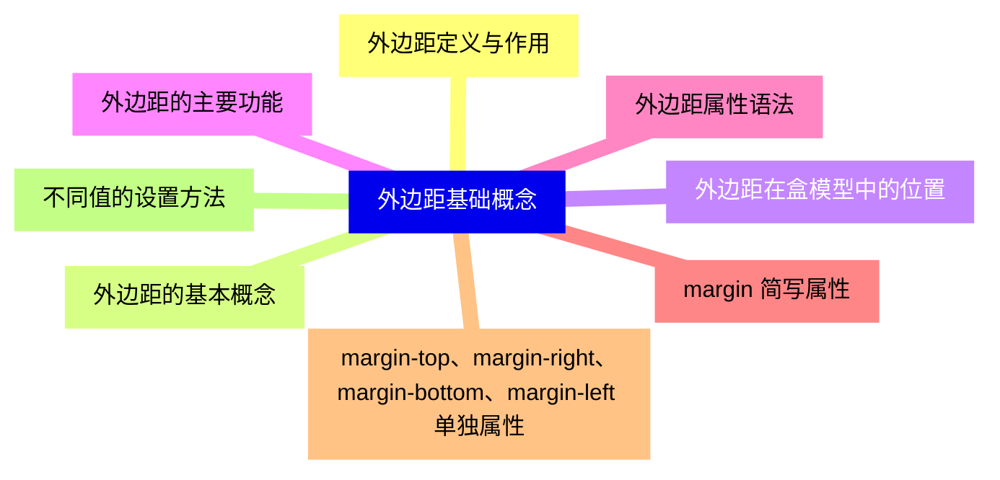
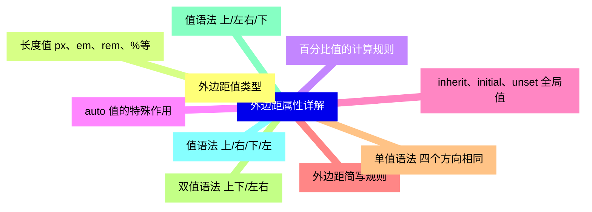
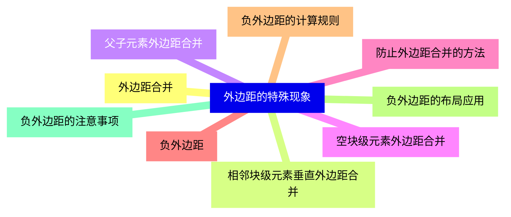
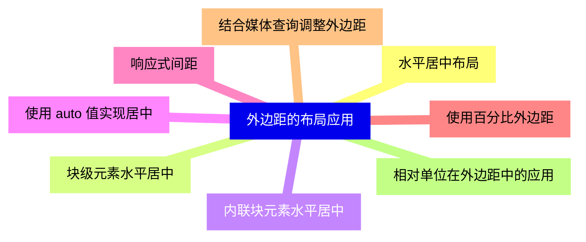
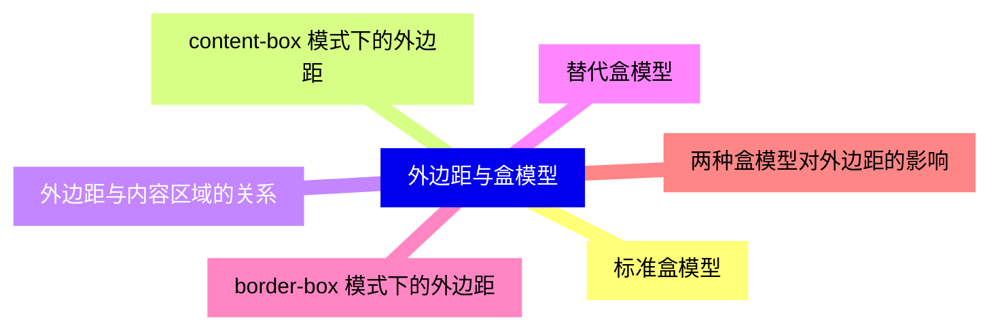
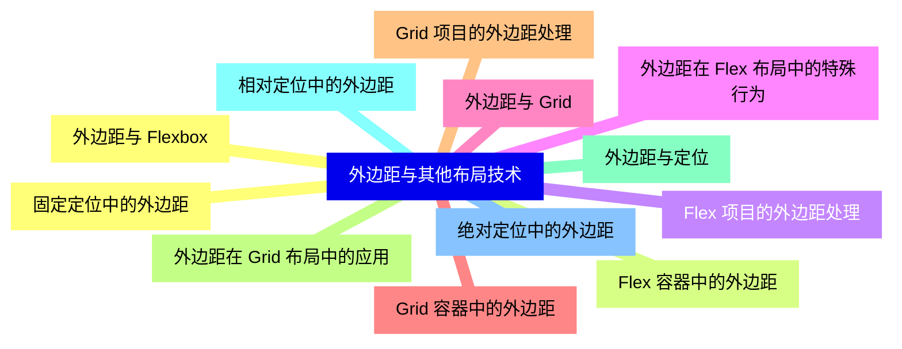
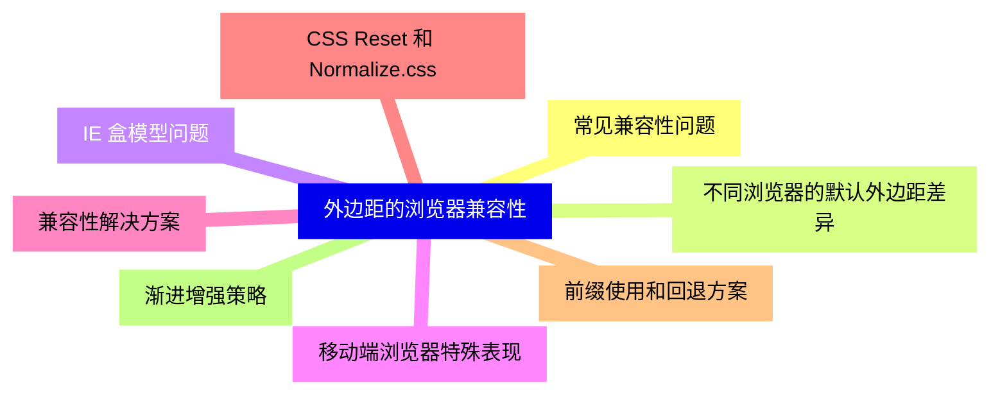
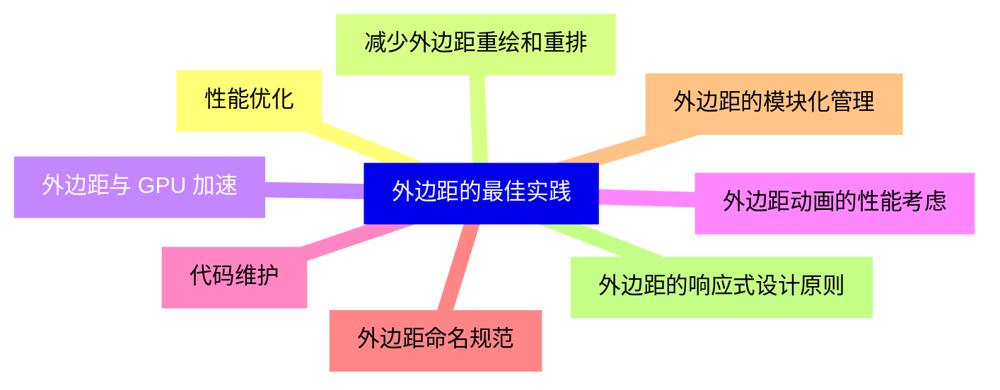
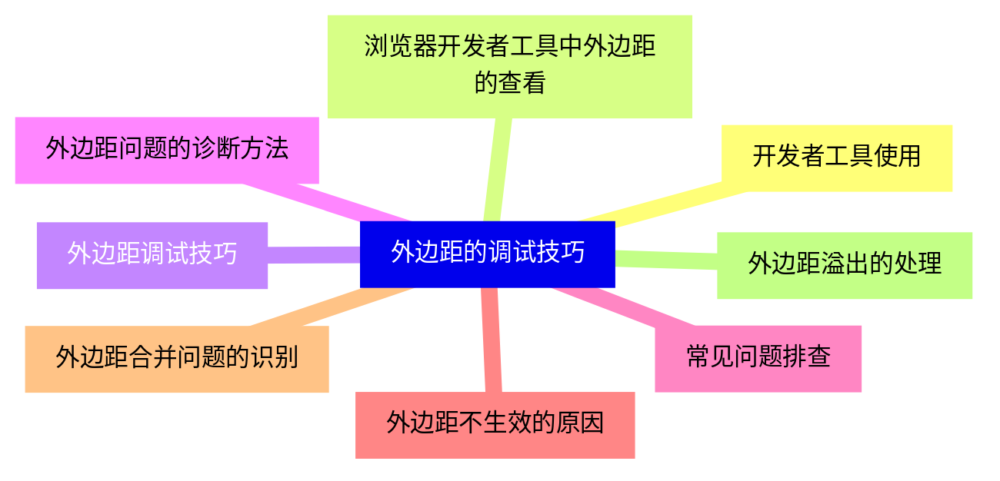
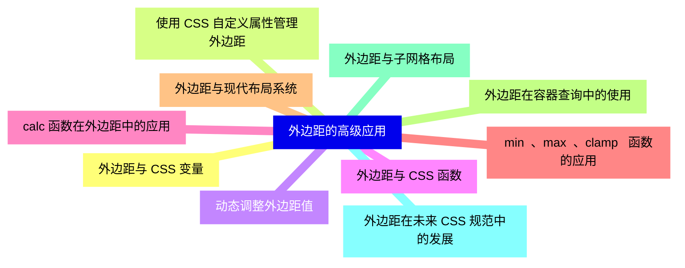


### 1 [外边距基础概念](#1)
#### 1.1 [外边距定义与作用](#1)
#### 1.2 [外边距的基本概念](#1)
#### 1.3 [外边距在盒模型中的位置](#1)
#### 1.4 [外边距的主要功能](#1)
#### 1.5 [外边距属性语法](#1)
#### 1.6 [margin 简写属性](#1)
#### 1.7 [margin-top、margin-right、margin-bottom、margin-left 单独属性](#1)
#### 1.8 [不同值的设置方法](#1)
### 2 [外边距属性详解](#2)
#### 2.1 [外边距值类型](#2)
#### 2.2 [长度值 px、em、rem、%等](#2)
#### 2.3 [百分比值的计算规则](#2)
#### 2.4 [auto 值的特殊作用](#2)
#### 2.5 [inherit、initial、unset 全局值](#2)
#### 2.6 [外边距简写规则](#2)
#### 2.7 [单值语法 四个方向相同](#2)
#### 2.8 [双值语法 上下/左右](#2)
#### 2.9 [值语法 上/左右/下](#2)
#### 2.10 [值语法 上/右/下/左](#2)
### 3 [外边距的特殊现象](#3)
#### 3.1 [外边距合并](#3)
#### 3.2 [相邻块级元素垂直外边距合并](#3)
#### 3.3 [父子元素外边距合并](#3)
#### 3.4 [空块级元素外边距合并](#3)
#### 3.5 [防止外边距合并的方法](#3)
#### 3.6 [负外边距](#3)
#### 3.7 [负外边距的计算规则](#3)
#### 3.8 [负外边距的布局应用](#3)
#### 3.9 [负外边距的注意事项](#3)
### 4 [外边距的布局应用](#4)
#### 4.1 [水平居中布局](#4)
#### 4.2 [块级元素水平居中](#4)
#### 4.3 [内联块元素水平居中](#4)
#### 4.4 [使用 auto 值实现居中](#4)
#### 4.5 [响应式间距](#4)
#### 4.6 [使用百分比外边距](#4)
#### 4.7 [结合媒体查询调整外边距](#4)
#### 4.8 [相对单位在外边距中的应用](#4)
### 5 [外边距与盒模型](#5)
#### 5.1 [标准盒模型](#5)
#### 5.2 [content-box 模式下的外边距](#5)
#### 5.3 [外边距与内容区域的关系](#5)
#### 5.4 [替代盒模型](#5)
#### 5.5 [border-box 模式下的外边距](#5)
#### 5.6 [两种盒模型对外边距的影响](#5)
### 6 [外边距与其他布局技术](#6)
#### 6.1 [外边距与 Flexbox](#6)
#### 6.2 [Flex 容器中的外边距](#6)
#### 6.3 [Flex 项目的外边距处理](#6)
#### 6.4 [外边距在 Flex 布局中的特殊行为](#6)
#### 6.5 [外边距与 Grid](#6)
#### 6.6 [Grid 容器中的外边距](#6)
#### 6.7 [Grid 项目的外边距处理](#6)
#### 6.8 [外边距在 Grid 布局中的应用](#6)
#### 6.9 [外边距与定位](#6)
#### 6.10 [相对定位中的外边距](#6)
#### 6.11 [绝对定位中的外边距](#6)
#### 6.12 [固定定位中的外边距](#6)
### 7 [外边距的浏览器兼容性](#7)
#### 7.1 [常见兼容性问题](#7)
#### 7.2 [不同浏览器的默认外边距差异](#7)
#### 7.3 [IE 盒模型问题](#7)
#### 7.4 [移动端浏览器特殊表现](#7)
#### 7.5 [兼容性解决方案](#7)
#### 7.6 [CSS Reset 和 Normalize.css](#7)
#### 7.7 [前缀使用和回退方案](#7)
#### 7.8 [渐进增强策略](#7)
### 8 [外边距的最佳实践](#8)
#### 8.1 [性能优化](#8)
#### 8.2 [减少外边距重绘和重排](#8)
#### 8.3 [外边距与 GPU 加速](#8)
#### 8.4 [外边距动画的性能考虑](#8)
#### 8.5 [代码维护](#8)
#### 8.6 [外边距命名规范](#8)
#### 8.7 [外边距的模块化管理](#8)
#### 8.8 [外边距的响应式设计原则](#8)
### 9 [外边距的调试技巧](#9)
#### 9.1 [开发者工具使用](#9)
#### 9.2 [浏览器开发者工具中外边距的查看](#9)
#### 9.3 [外边距调试技巧](#9)
#### 9.4 [外边距问题的诊断方法](#9)
#### 9.5 [常见问题排查](#9)
#### 9.6 [外边距不生效的原因](#9)
#### 9.7 [外边距合并问题的识别](#9)
#### 9.8 [外边距溢出的处理](#9)
### 10 [外边距的高级应用](#10)
#### 10.1 [外边距与 CSS 变量](#10)
#### 10.2 [使用 CSS 自定义属性管理外边距](#10)
#### 10.3 [动态调整外边距值](#10)
#### 10.4 [外边距与 CSS 函数](#10)
#### 10.5 [calc   函数在外边距中的应用](#10)
#### 10.6 [min  、max  、clamp   函数的应用](#10)
#### 10.7 [外边距与现代布局系统](#10)
#### 10.8 [外边距在容器查询中的使用](#10)
#### 10.9 [外边距与子网格布局](#10)
#### 10.10 [外边距在未来 CSS 规范中的发展](#10)




### 1 外边距基础概念

---
### 1 外边距基础概念
___
#### 1.1 外边距定义与作用
___
#### 1.2 外边距的基本概念
___
#### 1.3 外边距在盒模型中的位置
___
#### 1.4 外边距的主要功能
___
#### 1.5 外边距属性语法
___
#### 1.6 margin 简写属性
___
#### 1.7 margin-top、margin-right、margin-bottom、margin-left 单独属性
___
#### 1.8 不同值的设置方法
### 2 外边距属性详解

---
### 2 外边距属性详解
___
#### 2.1 外边距值类型
___
#### 2.2 长度值 px、em、rem、%等
___
#### 2.3 百分比值的计算规则
___
#### 2.4 auto 值的特殊作用
___
#### 2.5 inherit、initial、unset 全局值
___
#### 2.6 外边距简写规则
___
#### 2.7 单值语法 四个方向相同
___
#### 2.8 双值语法 上下/左右
___
#### 2.9 值语法 上/左右/下
___
#### 2.10 值语法 上/右/下/左
### 3 外边距的特殊现象

---
### 3 外边距的特殊现象
___
#### 3.1 外边距合并
___
#### 3.2 相邻块级元素垂直外边距合并
___
#### 3.3 父子元素外边距合并
___
#### 3.4 空块级元素外边距合并
___
#### 3.5 防止外边距合并的方法
___
#### 3.6 负外边距
___
#### 3.7 负外边距的计算规则
___
#### 3.8 负外边距的布局应用
___
#### 3.9 负外边距的注意事项
### 4 外边距的布局应用

---
### 4 外边距的布局应用
___
#### 4.1 水平居中布局
___
#### 4.2 块级元素水平居中
___
#### 4.3 内联块元素水平居中
___
#### 4.4 使用 auto 值实现居中
___
#### 4.5 响应式间距
___
#### 4.6 使用百分比外边距
___
#### 4.7 结合媒体查询调整外边距
___
#### 4.8 相对单位在外边距中的应用
### 5 外边距与盒模型

---
### 5 外边距与盒模型
___
#### 5.1 标准盒模型
___
#### 5.2 content-box 模式下的外边距
___
#### 5.3 外边距与内容区域的关系
___
#### 5.4 替代盒模型
___
#### 5.5 border-box 模式下的外边距
___
#### 5.6 两种盒模型对外边距的影响
### 6 外边距与其他布局技术

---
### 6 外边距与其他布局技术
___
#### 6.1 外边距与 Flexbox
___
#### 6.2 Flex 容器中的外边距
___
#### 6.3 Flex 项目的外边距处理
___
#### 6.4 外边距在 Flex 布局中的特殊行为
___
#### 6.5 外边距与 Grid
___
#### 6.6 Grid 容器中的外边距
___
#### 6.7 Grid 项目的外边距处理
___
#### 6.8 外边距在 Grid 布局中的应用
___
#### 6.9 外边距与定位
___
#### 6.10 相对定位中的外边距
___
#### 6.11 绝对定位中的外边距
___
#### 6.12 固定定位中的外边距
### 7 外边距的浏览器兼容性

---
### 7 外边距的浏览器兼容性
___
#### 7.1 常见兼容性问题
___
#### 7.2 不同浏览器的默认外边距差异
___
#### 7.3 IE 盒模型问题
___
#### 7.4 移动端浏览器特殊表现
___
#### 7.5 兼容性解决方案
___
#### 7.6 CSS Reset 和 Normalize.css
___
#### 7.7 前缀使用和回退方案
___
#### 7.8 渐进增强策略
### 8 外边距的最佳实践

---
### 8 外边距的最佳实践
___
#### 8.1 性能优化
___
#### 8.2 减少外边距重绘和重排
___
#### 8.3 外边距与 GPU 加速
___
#### 8.4 外边距动画的性能考虑
___
#### 8.5 代码维护
___
#### 8.6 外边距命名规范
___
#### 8.7 外边距的模块化管理
___
#### 8.8 外边距的响应式设计原则
### 9 外边距的调试技巧

---
### 9 外边距的调试技巧
___
#### 9.1 开发者工具使用
___
#### 9.2 浏览器开发者工具中外边距的查看
___
#### 9.3 外边距调试技巧
___
#### 9.4 外边距问题的诊断方法
___
#### 9.5 常见问题排查
___
#### 9.6 外边距不生效的原因
___
#### 9.7 外边距合并问题的识别
___
#### 9.8 外边距溢出的处理
### 10 外边距的高级应用

---
### 10 外边距的高级应用
___
#### 10.1 外边距与 CSS 变量
___
#### 10.2 使用 CSS 自定义属性管理外边距
___
#### 10.3 动态调整外边距值
___
#### 10.4 外边距与 CSS 函数
___
#### 10.5 calc   函数在外边距中的应用
___
#### 10.6 min  、max  、clamp   函数的应用
___
#### 10.7 外边距与现代布局系统
___
#### 10.8 外边距在容器查询中的使用
___
#### 10.9 外边距与子网格布局
___
#### 10.10 外边距在未来 CSS 规范中的发展


### 1 外边距基础概念{#1}

{}

<--->
{}
{}
{}
{}
{}
{}
{}
{}
{}
{}
{}
{}
{}
{}
{}
{}
{}

### 2 外边距属性详解{#2}

{}
{}
{}
{{% details "长度值 px、em、rem、%等" %}}
{}
{}
{}
{}
{}
{}
{}
{}
{}
{}
{}
{}
{}
{}
{}
{}
{}
<--->

{}

### 3 外边距的特殊现象{#3}

{}

<--->
{}
{}
{}
{}
{}
{}
{}
{}
{}
{}
{}
{}
{}
{}
{}
{}
{}
{}
{}

### 4 外边距的布局应用{#4}

{}
{}
{}
{}
{}
{}
{}
{}
{}
{}
{}
{}
{}
{}
{}
{}
{}
<--->

{}

### 5 外边距与盒模型{#5}

{}

<--->
{}
{}
{}
{}
{}
{}
{}
{}
{}
{}
{}
{}
{}

### 6 外边距与其他布局技术{#6}

{}
{}
{}
{}
{}
{}
{}
{}
{}
{}
{}
{}
{}
{}
{}
{}
{}
{}
{}
{}
{}
{}
{}
{}
{}
<--->

{}

### 7 外边距的浏览器兼容性{#7}

{}

<--->
{}
{}
{}
{}
{}
{}
{}
{}
{}
{}
{}
{}
{}
{}
{}
{}
{}

### 8 外边距的最佳实践{#8}

{}
{}
{}
{}
{}
{}
{}
{}
{}
{}
{}
{}
{}
{}
{}
{}
{}
<--->

{}

### 9 外边距的调试技巧{#9}

{}

<--->
{}
{}
{}
{}
{}
{}
{}
{}
{}
{}
{}
{}
{}
{}
{}
{}
{}

### 10 外边距的高级应用{#10}

{}
{}
{}
{}
{}
{}
{}
{}
{}
{}
{}
{}
{}
{}
{}
{}
{}
{}
{}
{}
{}
<--->

{}
