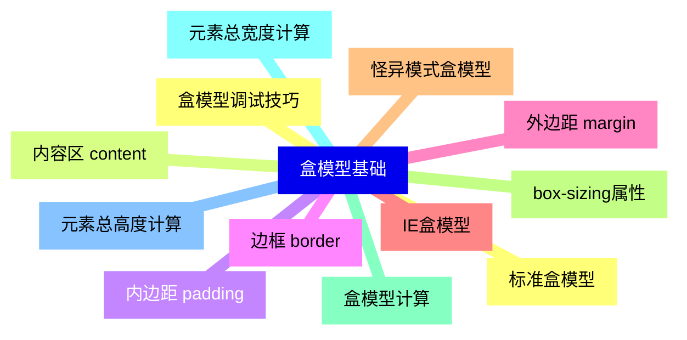
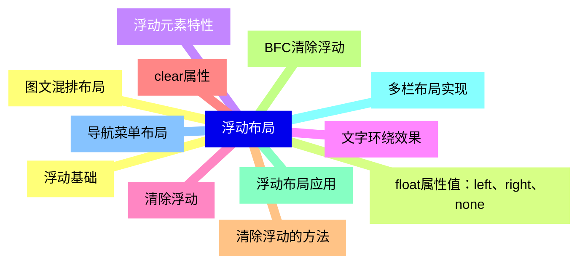
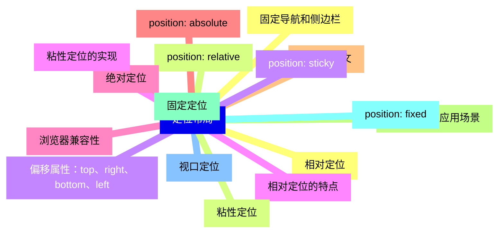
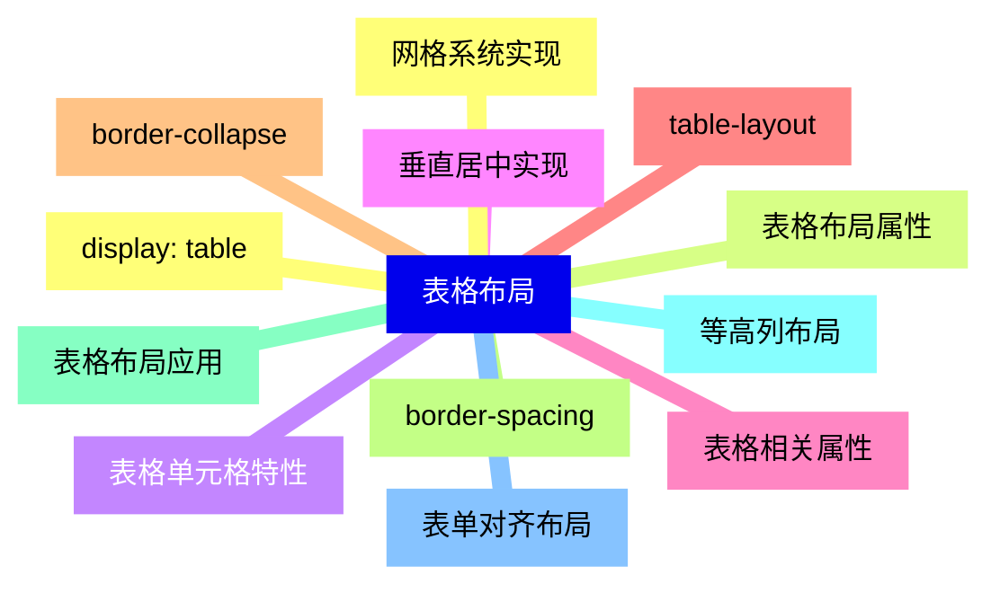
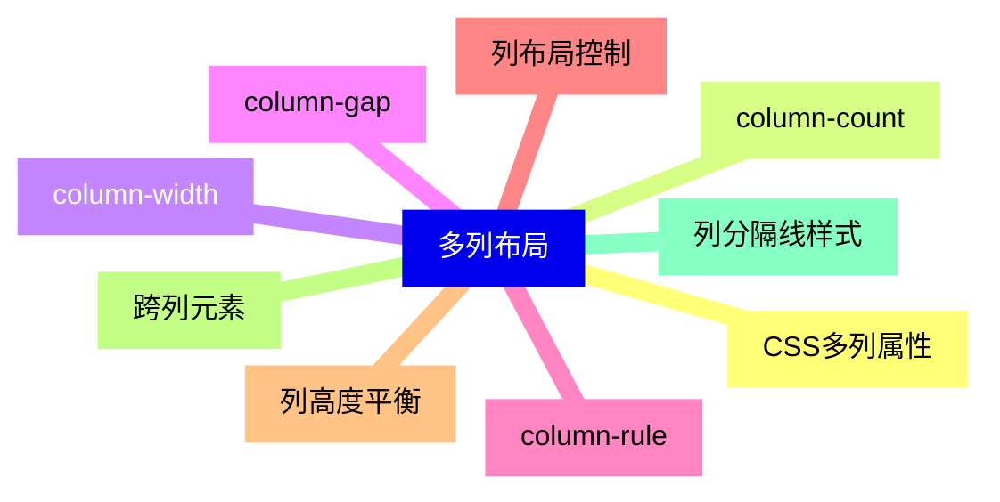
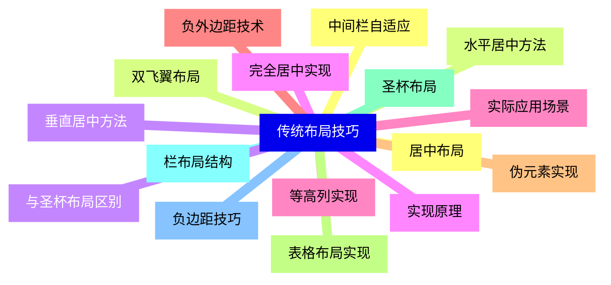
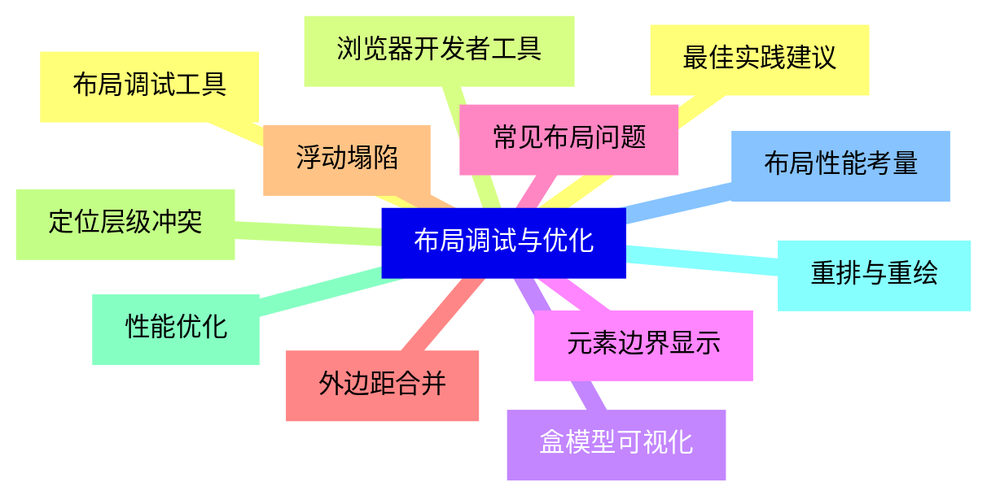
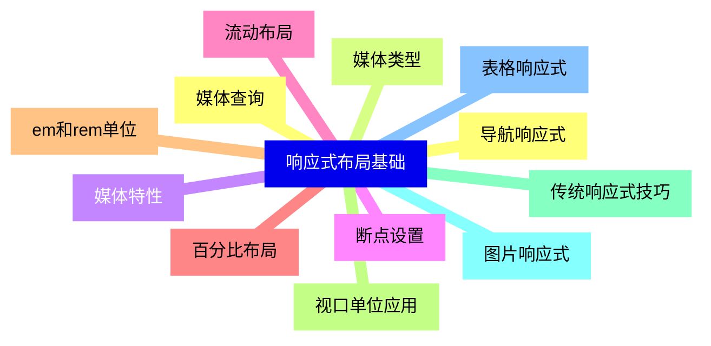
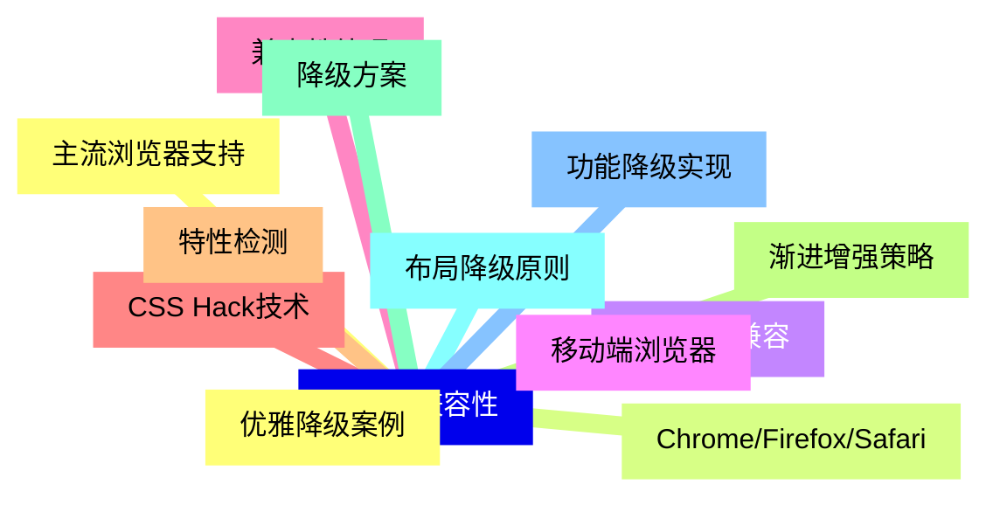


### 1 [盒模型基础](#1)
#### 1.1 [标准盒模型](#1)
#### 1.2 [内容区 content](#1)
#### 1.3 [内边距 padding](#1)
#### 1.4 [边框 border](#1)
#### 1.5 [外边距 margin](#1)
#### 1.6 [IE盒模型](#1)
#### 1.7 [怪异模式盒模型](#1)
#### 1.8 [box-sizing属性](#1)
#### 1.9 [盒模型计算](#1)
#### 1.10 [元素总宽度计算](#1)
#### 1.11 [元素总高度计算](#1)
#### 1.12 [盒模型调试技巧](#1)
### 2 [浮动布局](#2)
#### 2.1 [浮动基础](#2)
#### 2.2 [float属性值：left、right、none](#2)
#### 2.3 [浮动元素特性](#2)
#### 2.4 [文字环绕效果](#2)
#### 2.5 [清除浮动](#2)
#### 2.6 [clear属性](#2)
#### 2.7 [清除浮动的方法](#2)
#### 2.8 [BFC清除浮动](#2)
#### 2.9 [浮动布局应用](#2)
#### 2.10 [多栏布局实现](#2)
#### 2.11 [导航菜单布局](#2)
#### 2.12 [图文混排布局](#2)
### 3 [定位布局](#3)
#### 3.1 [相对定位](#3)
#### 3.2 [position: relative](#3)
#### 3.3 [偏移属性：top、right、bottom、left](#3)
#### 3.4 [相对定位的特点](#3)
#### 3.5 [绝对定位](#3)
#### 3.6 [position: absolute](#3)
#### 3.7 [定位上下文](#3)
#### 3.8 [绝对定位的应用场景](#3)
#### 3.9 [固定定位](#3)
#### 3.10 [position: fixed](#3)
#### 3.11 [视口定位](#3)
#### 3.12 [固定导航和侧边栏](#3)
#### 3.13 [粘性定位](#3)
#### 3.14 [position: sticky](#3)
#### 3.15 [粘性定位的实现](#3)
#### 3.16 [浏览器兼容性](#3)
### 4 [表格布局](#4)
#### 4.1 [display: table](#4)
#### 4.2 [表格布局属性](#4)
#### 4.3 [表格单元格特性](#4)
#### 4.4 [垂直居中实现](#4)
#### 4.5 [表格相关属性](#4)
#### 4.6 [table-layout](#4)
#### 4.7 [border-collapse](#4)
#### 4.8 [border-spacing](#4)
#### 4.9 [表格布局应用](#4)
#### 4.10 [等高列布局](#4)
#### 4.11 [表单对齐布局](#4)
#### 4.12 [网格系统实现](#4)
### 5 [inline-block布局](#5)
#### 5.1 [inline-block特性](#5)
#### 5.2 [行内块元素特点](#5)
#### 5.3 [空白符问题](#5)
#### 5.4 [垂直对齐方式](#5)
#### 5.5 [水平排列布局](#5)
#### 5.6 [导航菜单实现](#5)
#### 5.7 [图片画廊布局](#5)
#### 5.8 [按钮组排列](#5)
#### 5.9 [垂直对齐控制](#5)
#### 5.10 [vertical-align属性](#5)
#### 5.11 [基线对齐问题](#5)
#### 5.12 [多行文本对齐](#5)
### 6 [多列布局](#6)
#### 6.1 [CSS多列属性](#6)
#### 6.2 [column-count](#6)
#### 6.3 [column-width](#6)
#### 6.4 [column-gap](#6)
#### 6.5 [column-rule](#6)
#### 6.6 [列布局控制](#6)
#### 6.7 [列高度平衡](#6)
#### 6.8 [跨列元素](#6)
#### 6.9 [列分隔线样式](#6)
### 7 [传统布局技巧](#7)
#### 7.1 [居中布局](#7)
#### 7.2 [水平居中方法](#7)
#### 7.3 [垂直居中方法](#7)
#### 7.4 [完全居中实现](#7)
#### 7.5 [等高列实现](#7)
#### 7.6 [负外边距技术](#7)
#### 7.7 [伪元素实现](#7)
#### 7.8 [表格布局实现](#7)
#### 7.9 [圣杯布局](#7)
#### 7.10 [栏布局结构](#7)
#### 7.11 [负边距技巧](#7)
#### 7.12 [中间栏自适应](#7)
#### 7.13 [双飞翼布局](#7)
#### 7.14 [与圣杯布局区别](#7)
#### 7.15 [实现原理](#7)
#### 7.16 [实际应用场景](#7)
### 8 [布局调试与优化](#8)
#### 8.1 [布局调试工具](#8)
#### 8.2 [浏览器开发者工具](#8)
#### 8.3 [盒模型可视化](#8)
#### 8.4 [元素边界显示](#8)
#### 8.5 [常见布局问题](#8)
#### 8.6 [外边距合并](#8)
#### 8.7 [浮动塌陷](#8)
#### 8.8 [定位层级冲突](#8)
#### 8.9 [性能优化](#8)
#### 8.10 [重排与重绘](#8)
#### 8.11 [布局性能考量](#8)
#### 8.12 [最佳实践建议](#8)
### 9 [响应式布局基础](#9)
#### 9.1 [媒体查询](#9)
#### 9.2 [媒体类型](#9)
#### 9.3 [媒体特性](#9)
#### 9.4 [断点设置](#9)
#### 9.5 [流动布局](#9)
#### 9.6 [百分比布局](#9)
#### 9.7 [em和rem单位](#9)
#### 9.8 [视口单位应用](#9)
#### 9.9 [传统响应式技巧](#9)
#### 9.10 [图片响应式](#9)
#### 9.11 [表格响应式](#9)
#### 9.12 [导航响应式](#9)
### 10 [浏览器兼容性](#10)
#### 10.1 [主流浏览器支持](#10)
#### 10.2 [Chrome/Firefox/Safari](#10)
#### 10.3 [IE浏览器兼容](#10)
#### 10.4 [移动端浏览器](#10)
#### 10.5 [兼容性处理](#10)
#### 10.6 [CSS Hack技术](#10)
#### 10.7 [特性检测](#10)
#### 10.8 [渐进增强策略](#10)
#### 10.9 [降级方案](#10)
#### 10.10 [布局降级原则](#10)
#### 10.11 [功能降级实现](#10)
#### 10.12 [优雅降级案例](#10)





### 1 盒模型基础


---
### 1 盒模型基础
___
#### 1.1 标准盒模型
___
#### 1.2 内容区 content
___
#### 1.3 内边距 padding
___
#### 1.4 边框 border
___
#### 1.5 外边距 margin
___
#### 1.6 IE盒模型
___
#### 1.7 怪异模式盒模型
___
#### 1.8 box-sizing属性
___
#### 1.9 盒模型计算
___
#### 1.10 元素总宽度计算
___
#### 1.11 元素总高度计算
___
#### 1.12 盒模型调试技巧
### 2 浮动布局


---
### 2 浮动布局
___
#### 2.1 浮动基础
___
#### 2.2 float属性值：left、right、none
___
#### 2.3 浮动元素特性
___
#### 2.4 文字环绕效果
___
#### 2.5 清除浮动
___
#### 2.6 clear属性
___
#### 2.7 清除浮动的方法
___
#### 2.8 BFC清除浮动
___
#### 2.9 浮动布局应用
___
#### 2.10 多栏布局实现
___
#### 2.11 导航菜单布局
___
#### 2.12 图文混排布局
### 3 定位布局


---
### 3 定位布局
___
#### 3.1 相对定位
___
#### 3.2 position: relative
___
#### 3.3 偏移属性：top、right、bottom、left
___
#### 3.4 相对定位的特点
___
#### 3.5 绝对定位
___
#### 3.6 position: absolute
___
#### 3.7 定位上下文
___
#### 3.8 绝对定位的应用场景
___
#### 3.9 固定定位
___
#### 3.10 position: fixed
___
#### 3.11 视口定位
___
#### 3.12 固定导航和侧边栏
___
#### 3.13 粘性定位
___
#### 3.14 position: sticky
___
#### 3.15 粘性定位的实现
___
#### 3.16 浏览器兼容性
### 4 表格布局


---
### 4 表格布局
___
#### 4.1 display: table
___
#### 4.2 表格布局属性
___
#### 4.3 表格单元格特性
___
#### 4.4 垂直居中实现
___
#### 4.5 表格相关属性
___
#### 4.6 table-layout
___
#### 4.7 border-collapse
___
#### 4.8 border-spacing
___
#### 4.9 表格布局应用
___
#### 4.10 等高列布局
___
#### 4.11 表单对齐布局
___
#### 4.12 网格系统实现
### 5 inline-block布局


---
### 5 inline-block布局
___
#### 5.1 inline-block特性
___
#### 5.2 行内块元素特点
___
#### 5.3 空白符问题
___
#### 5.4 垂直对齐方式
___
#### 5.5 水平排列布局
___
#### 5.6 导航菜单实现
___
#### 5.7 图片画廊布局
___
#### 5.8 按钮组排列
___
#### 5.9 垂直对齐控制
___
#### 5.10 vertical-align属性
___
#### 5.11 基线对齐问题
___
#### 5.12 多行文本对齐
### 6 多列布局


---
### 6 多列布局
___
#### 6.1 CSS多列属性
___
#### 6.2 column-count
___
#### 6.3 column-width
___
#### 6.4 column-gap
___
#### 6.5 column-rule
___
#### 6.6 列布局控制
___
#### 6.7 列高度平衡
___
#### 6.8 跨列元素
___
#### 6.9 列分隔线样式
### 7 传统布局技巧


---
### 7 传统布局技巧
___
#### 7.1 居中布局
___
#### 7.2 水平居中方法
___
#### 7.3 垂直居中方法
___
#### 7.4 完全居中实现
___
#### 7.5 等高列实现
___
#### 7.6 负外边距技术
___
#### 7.7 伪元素实现
___
#### 7.8 表格布局实现
___
#### 7.9 圣杯布局
___
#### 7.10 栏布局结构
___
#### 7.11 负边距技巧
___
#### 7.12 中间栏自适应
___
#### 7.13 双飞翼布局
___
#### 7.14 与圣杯布局区别
___
#### 7.15 实现原理
___
#### 7.16 实际应用场景
### 8 布局调试与优化


---
### 8 布局调试与优化
___
#### 8.1 布局调试工具
___
#### 8.2 浏览器开发者工具
___
#### 8.3 盒模型可视化
___
#### 8.4 元素边界显示
___
#### 8.5 常见布局问题
___
#### 8.6 外边距合并
___
#### 8.7 浮动塌陷
___
#### 8.8 定位层级冲突
___
#### 8.9 性能优化
___
#### 8.10 重排与重绘
___
#### 8.11 布局性能考量
___
#### 8.12 最佳实践建议
### 9 响应式布局基础


---
### 9 响应式布局基础
___
#### 9.1 媒体查询
___
#### 9.2 媒体类型
___
#### 9.3 媒体特性
___
#### 9.4 断点设置
___
#### 9.5 流动布局
___
#### 9.6 百分比布局
___
#### 9.7 em和rem单位
___
#### 9.8 视口单位应用
___
#### 9.9 传统响应式技巧
___
#### 9.10 图片响应式
___
#### 9.11 表格响应式
___
#### 9.12 导航响应式
### 10 浏览器兼容性


---
### 10 浏览器兼容性
___
#### 10.1 主流浏览器支持
___
#### 10.2 Chrome/Firefox/Safari
___
#### 10.3 IE浏览器兼容
___
#### 10.4 移动端浏览器
___
#### 10.5 兼容性处理
___
#### 10.6 CSS Hack技术
___
#### 10.7 特性检测
___
#### 10.8 渐进增强策略
___
#### 10.9 降级方案
___
#### 10.10 布局降级原则
___
#### 10.11 功能降级实现
___
#### 10.12 优雅降级案例



### 1 盒模型基础{#1}


{}


<--->
{}
{}
{}
{}
{}
{}
{}
{}
{}
{}
{}
{}
{}
{}
{}
{}
{}
{}
{}
{}
{}
{}
{}
{}
{}

### 2 浮动布局{#2}


{}
{}
{}
{}
{}
{}
{}
{}
{}
{}
{}
{}
{}
{}
{}
{}
{}
{}
{}
{}
{}
{}
{}
{}
{}
<--->


{}

### 3 定位布局{#3}


{}


<--->
{}
{}
{}
{}
{}
{}
{}
{}
{}
{}
{}
{}
{}
{}
{}
{}
{}
{}
{}
{}
{}
{}
{}
{}
{}
{}
{}
{}
{}
{}
{}
{}
{}

### 4 表格布局{#4}


{}
{}
{}
{}
{}
{}
{}
{}
{}
{}
{}
{}
{}
{}
{}
{}
{}
{}
{}
{}
{}
{}
{}
{}
{}
<--->


{}

### 5 inline-block布局{#5}


{}
```mermaid
mindmap
    id5[inline-block布局]
        id5-1[inline-block特性]
        id5-2[行内块元素特点]
        id5-3[空白符问题]
        id5-4[垂直对齐方式]
        id5-5[水平排列布局]
        id5-6[导航菜单实现]
        id5-7[图片画廊布局]
        id5-8[按钮组排列]
        id5-9[垂直对齐控制]
        id5-10[vertical-align属性]
        id5-11[基线对齐问题]
        id5-12[多行文本对齐]
```

<--->
{}
{}
{}
{}
{}
{}
{}
{}
{}
{}
{}
{}
{}
{}
{}
{}
{}
{}
{}
{}
{}
{}
{}
{}
{}

### 6 多列布局{#6}


{}
{}
{}
{}
{}
{}
{}
{}
{}
{}
{}
{}
{}
{}
{}
{}
{}
{}
{}
<--->


{}

### 7 传统布局技巧{#7}


{}


<--->
{}
{}
{}
{}
{}
{}
{}
{}
{}
{}
{}
{}
{}
{}
{}
{}
{}
{}
{}
{}
{}
{}
{}
{}
{}
{}
{}
{}
{}
{}
{}
{}
{}

### 8 布局调试与优化{#8}


{}
{}
{}
{}
{}
{}
{}
{}
{}
{}
{}
{}
{}
{}
{}
{}
{}
{}
{}
{}
{}
{}
{}
{}
{}
<--->


{}

### 9 响应式布局基础{#9}


{}


<--->
{}
{}
{}
{}
{}
{}
{}
{}
{}
{}
{}
{}
{}
{}
{}
{}
{}
{}
{}
{}
{}
{}
{}
{}
{}

### 10 浏览器兼容性{#10}


{}
{}
{}
{}
{}
{}
{}
{}
{}
{}
{}
{}
{}
{}
{}
{}
{}
{}
{}
{}
{}
{}
{}
{}
{}
<--->


{}
