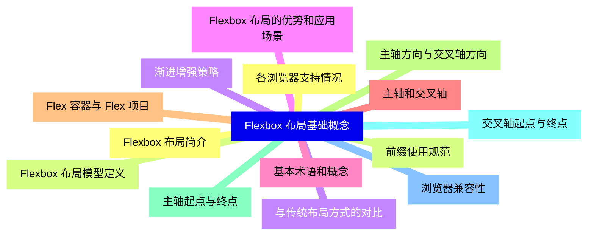
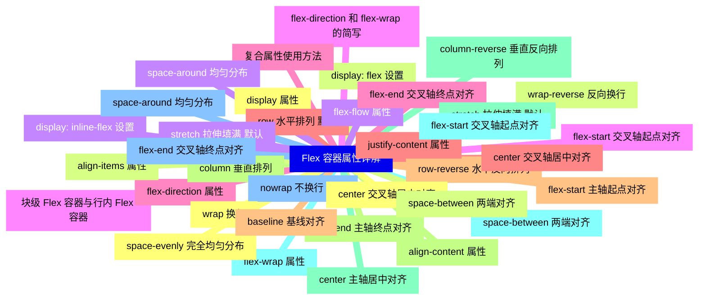
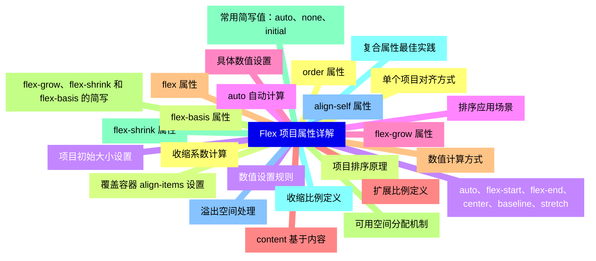
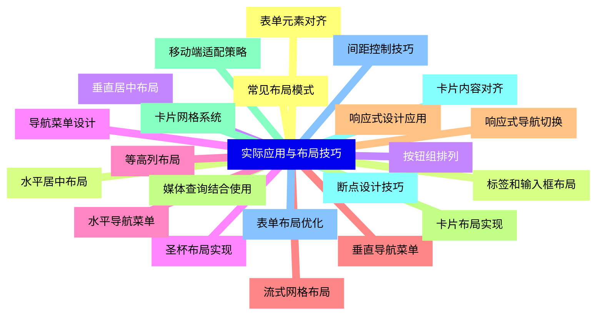
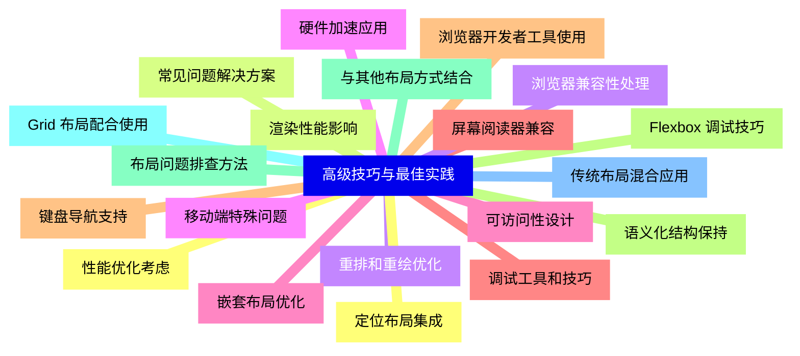
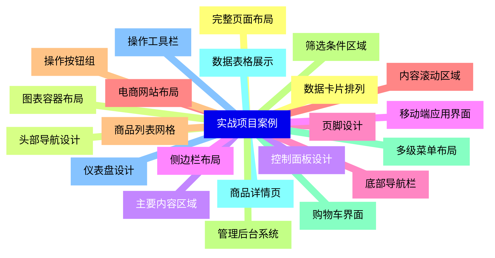
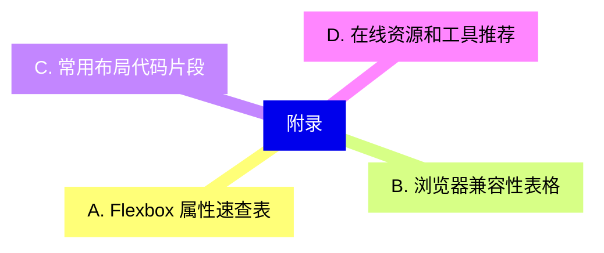


### 1 [Flexbox 布局基础概念](#1)
#### 1.1 [Flexbox 布局简介](#1)
#### 1.2 [Flexbox 布局模型定义](#1)
#### 1.3 [与传统布局方式的对比](#1)
#### 1.4 [Flexbox 布局的优势和应用场景](#1)
#### 1.5 [基本术语和概念](#1)
#### 1.6 [主轴和交叉轴](#1)
#### 1.7 [Flex 容器与 Flex 项目](#1)
#### 1.8 [主轴方向与交叉轴方向](#1)
#### 1.9 [主轴起点与终点](#1)
#### 1.10 [交叉轴起点与终点](#1)
#### 1.11 [浏览器兼容性](#1)
#### 1.12 [各浏览器支持情况](#1)
#### 1.13 [前缀使用规范](#1)
#### 1.14 [渐进增强策略](#1)
### 2 [Flex 容器属性详解](#2)
#### 2.1 [display 属性](#2)
#### 2.2 [display: flex 设置](#2)
#### 2.3 [display: inline-flex 设置](#2)
#### 2.4 [块级 Flex 容器与行内 Flex 容器](#2)
#### 2.5 [flex-direction 属性](#2)
#### 2.6 [row 水平排列 默认](#2)
#### 2.7 [row-reverse 水平反向排列](#2)
#### 2.8 [column 垂直排列](#2)
#### 2.9 [column-reverse 垂直反向排列](#2)
#### 2.10 [flex-wrap 属性](#2)
#### 2.11 [nowrap 不换行 默认](#2)
#### 2.12 [wrap 换行](#2)
#### 2.13 [wrap-reverse 反向换行](#2)
#### 2.14 [flex-flow 属性](#2)
#### 2.15 [flex-direction 和 flex-wrap 的简写](#2)
#### 2.16 [复合属性使用方法](#2)
#### 2.17 [justify-content 属性](#2)
#### 2.18 [flex-start 主轴起点对齐](#2)
#### 2.19 [flex-end 主轴终点对齐](#2)
#### 2.20 [center 主轴居中对齐](#2)
#### 2.21 [space-between 两端对齐](#2)
#### 2.22 [space-around 均匀分布](#2)
#### 2.23 [space-evenly 完全均匀分布](#2)
#### 2.24 [align-items 属性](#2)
#### 2.25 [stretch 拉伸填满 默认](#2)
#### 2.26 [flex-start 交叉轴起点对齐](#2)
#### 2.27 [flex-end 交叉轴终点对齐](#2)
#### 2.28 [center 交叉轴居中对齐](#2)
#### 2.29 [baseline 基线对齐](#2)
#### 2.30 [align-content 属性](#2)
#### 2.31 [stretch 拉伸填满 默认](#2)
#### 2.32 [flex-start 交叉轴起点对齐](#2)
#### 2.33 [flex-end 交叉轴终点对齐](#2)
#### 2.34 [center 交叉轴居中对齐](#2)
#### 2.35 [space-between 两端对齐](#2)
#### 2.36 [space-around 均匀分布](#2)
### 3 [Flex 项目属性详解](#3)
#### 3.1 [order 属性](#3)
#### 3.2 [项目排序原理](#3)
#### 3.3 [数值设置规则](#3)
#### 3.4 [排序应用场景](#3)
#### 3.5 [flex-grow 属性](#3)
#### 3.6 [扩展比例定义](#3)
#### 3.7 [数值计算方式](#3)
#### 3.8 [可用空间分配机制](#3)
#### 3.9 [flex-shrink 属性](#3)
#### 3.10 [收缩比例定义](#3)
#### 3.11 [溢出空间处理](#3)
#### 3.12 [收缩系数计算](#3)
#### 3.13 [flex-basis 属性](#3)
#### 3.14 [项目初始大小设置](#3)
#### 3.15 [auto 自动计算](#3)
#### 3.16 [具体数值设置](#3)
#### 3.17 [content 基于内容](#3)
#### 3.18 [flex 属性](#3)
#### 3.19 [flex-grow、flex-shrink 和 flex-basis 的简写](#3)
#### 3.20 [常用简写值：auto、none、initial](#3)
#### 3.21 [复合属性最佳实践](#3)
#### 3.22 [align-self 属性](#3)
#### 3.23 [单个项目对齐方式](#3)
#### 3.24 [覆盖容器 align-items 设置](#3)
#### 3.25 [auto、flex-start、flex-end、center、baseline、stretch](#3)
### 4 [实际应用与布局技巧](#4)
#### 4.1 [常见布局模式](#4)
#### 4.2 [水平居中布局](#4)
#### 4.3 [垂直居中布局](#4)
#### 4.4 [圣杯布局实现](#4)
#### 4.5 [等高列布局](#4)
#### 4.6 [流式网格布局](#4)
#### 4.7 [响应式设计应用](#4)
#### 4.8 [媒体查询结合使用](#4)
#### 4.9 [移动端适配策略](#4)
#### 4.10 [断点设计技巧](#4)
#### 4.11 [表单布局优化](#4)
#### 4.12 [表单元素对齐](#4)
#### 4.13 [标签和输入框布局](#4)
#### 4.14 [按钮组排列](#4)
#### 4.15 [导航菜单设计](#4)
#### 4.16 [水平导航菜单](#4)
#### 4.17 [垂直导航菜单](#4)
#### 4.18 [响应式导航切换](#4)
#### 4.19 [卡片布局实现](#4)
#### 4.20 [卡片网格系统](#4)
#### 4.21 [卡片内容对齐](#4)
#### 4.22 [间距控制技巧](#4)
### 5 [高级技巧与最佳实践](#5)
#### 5.1 [性能优化考虑](#5)
#### 5.2 [渲染性能影响](#5)
#### 5.3 [重排和重绘优化](#5)
#### 5.4 [硬件加速应用](#5)
#### 5.5 [可访问性设计](#5)
#### 5.6 [屏幕阅读器兼容](#5)
#### 5.7 [键盘导航支持](#5)
#### 5.8 [语义化结构保持](#5)
#### 5.9 [与其他布局方式结合](#5)
#### 5.10 [Grid 布局配合使用](#5)
#### 5.11 [传统布局混合应用](#5)
#### 5.12 [定位布局集成](#5)
#### 5.13 [常见问题解决方案](#5)
#### 5.14 [浏览器兼容性处理](#5)
#### 5.15 [移动端特殊问题](#5)
#### 5.16 [嵌套布局优化](#5)
#### 5.17 [调试工具和技巧](#5)
#### 5.18 [浏览器开发者工具使用](#5)
#### 5.19 [Flexbox 调试技巧](#5)
#### 5.20 [布局问题排查方法](#5)
### 6 [实战项目案例](#6)
#### 6.1 [完整页面布局](#6)
#### 6.2 [头部导航设计](#6)
#### 6.3 [主要内容区域](#6)
#### 6.4 [侧边栏布局](#6)
#### 6.5 [页脚设计](#6)
#### 6.6 [电商网站布局](#6)
#### 6.7 [商品列表网格](#6)
#### 6.8 [筛选条件区域](#6)
#### 6.9 [购物车界面](#6)
#### 6.10 [商品详情页](#6)
#### 6.11 [仪表盘设计](#6)
#### 6.12 [数据卡片排列](#6)
#### 6.13 [图表容器布局](#6)
#### 6.14 [控制面板设计](#6)
#### 6.15 [移动端应用界面](#6)
#### 6.16 [底部导航栏](#6)
#### 6.17 [内容滚动区域](#6)
#### 6.18 [操作按钮组](#6)
#### 6.19 [管理后台系统](#6)
#### 6.20 [多级菜单布局](#6)
#### 6.21 [数据表格展示](#6)
#### 6.22 [操作工具栏](#6)
### 7 [附录](#7)
#### 7.1 [A. Flexbox 属性速查表](#7)
#### 7.2 [B. 浏览器兼容性表格](#7)
#### 7.3 [C. 常用布局代码片段](#7)
#### 7.4 [D. 在线资源和工具推荐](#7)




### 1 Flexbox 布局基础概念

---
### 1 Flexbox 布局基础概念
___
#### 1.1 Flexbox 布局简介
___
#### 1.2 Flexbox 布局模型定义
___
#### 1.3 与传统布局方式的对比
___
#### 1.4 Flexbox 布局的优势和应用场景
___
#### 1.5 基本术语和概念
___
#### 1.6 主轴和交叉轴
___
#### 1.7 Flex 容器与 Flex 项目
___
#### 1.8 主轴方向与交叉轴方向
___
#### 1.9 主轴起点与终点
___
#### 1.10 交叉轴起点与终点
___
#### 1.11 浏览器兼容性
___
#### 1.12 各浏览器支持情况
___
#### 1.13 前缀使用规范
___
#### 1.14 渐进增强策略
### 2 Flex 容器属性详解

---
### 2 Flex 容器属性详解
___
#### 2.1 display 属性
___
#### 2.2 display: flex 设置
___
#### 2.3 display: inline-flex 设置
___
#### 2.4 块级 Flex 容器与行内 Flex 容器
___
#### 2.5 flex-direction 属性
___
#### 2.6 row 水平排列 默认
___
#### 2.7 row-reverse 水平反向排列
___
#### 2.8 column 垂直排列
___
#### 2.9 column-reverse 垂直反向排列
___
#### 2.10 flex-wrap 属性
___
#### 2.11 nowrap 不换行 默认
___
#### 2.12 wrap 换行
___
#### 2.13 wrap-reverse 反向换行
___
#### 2.14 flex-flow 属性
___
#### 2.15 flex-direction 和 flex-wrap 的简写
___
#### 2.16 复合属性使用方法
___
#### 2.17 justify-content 属性
___
#### 2.18 flex-start 主轴起点对齐
___
#### 2.19 flex-end 主轴终点对齐
___
#### 2.20 center 主轴居中对齐
___
#### 2.21 space-between 两端对齐
___
#### 2.22 space-around 均匀分布
___
#### 2.23 space-evenly 完全均匀分布
___
#### 2.24 align-items 属性
___
#### 2.25 stretch 拉伸填满 默认
___
#### 2.26 flex-start 交叉轴起点对齐
___
#### 2.27 flex-end 交叉轴终点对齐
___
#### 2.28 center 交叉轴居中对齐
___
#### 2.29 baseline 基线对齐
___
#### 2.30 align-content 属性
___
#### 2.31 stretch 拉伸填满 默认
___
#### 2.32 flex-start 交叉轴起点对齐
___
#### 2.33 flex-end 交叉轴终点对齐
___
#### 2.34 center 交叉轴居中对齐
___
#### 2.35 space-between 两端对齐
___
#### 2.36 space-around 均匀分布
### 3 Flex 项目属性详解

---
### 3 Flex 项目属性详解
___
#### 3.1 order 属性
___
#### 3.2 项目排序原理
___
#### 3.3 数值设置规则
___
#### 3.4 排序应用场景
___
#### 3.5 flex-grow 属性
___
#### 3.6 扩展比例定义
___
#### 3.7 数值计算方式
___
#### 3.8 可用空间分配机制
___
#### 3.9 flex-shrink 属性
___
#### 3.10 收缩比例定义
___
#### 3.11 溢出空间处理
___
#### 3.12 收缩系数计算
___
#### 3.13 flex-basis 属性
___
#### 3.14 项目初始大小设置
___
#### 3.15 auto 自动计算
___
#### 3.16 具体数值设置
___
#### 3.17 content 基于内容
___
#### 3.18 flex 属性
___
#### 3.19 flex-grow、flex-shrink 和 flex-basis 的简写
___
#### 3.20 常用简写值：auto、none、initial
___
#### 3.21 复合属性最佳实践
___
#### 3.22 align-self 属性
___
#### 3.23 单个项目对齐方式
___
#### 3.24 覆盖容器 align-items 设置
___
#### 3.25 auto、flex-start、flex-end、center、baseline、stretch
### 4 实际应用与布局技巧

---
### 4 实际应用与布局技巧
___
#### 4.1 常见布局模式
___
#### 4.2 水平居中布局
___
#### 4.3 垂直居中布局
___
#### 4.4 圣杯布局实现
___
#### 4.5 等高列布局
___
#### 4.6 流式网格布局
___
#### 4.7 响应式设计应用
___
#### 4.8 媒体查询结合使用
___
#### 4.9 移动端适配策略
___
#### 4.10 断点设计技巧
___
#### 4.11 表单布局优化
___
#### 4.12 表单元素对齐
___
#### 4.13 标签和输入框布局
___
#### 4.14 按钮组排列
___
#### 4.15 导航菜单设计
___
#### 4.16 水平导航菜单
___
#### 4.17 垂直导航菜单
___
#### 4.18 响应式导航切换
___
#### 4.19 卡片布局实现
___
#### 4.20 卡片网格系统
___
#### 4.21 卡片内容对齐
___
#### 4.22 间距控制技巧
### 5 高级技巧与最佳实践

---
### 5 高级技巧与最佳实践
___
#### 5.1 性能优化考虑
___
#### 5.2 渲染性能影响
___
#### 5.3 重排和重绘优化
___
#### 5.4 硬件加速应用
___
#### 5.5 可访问性设计
___
#### 5.6 屏幕阅读器兼容
___
#### 5.7 键盘导航支持
___
#### 5.8 语义化结构保持
___
#### 5.9 与其他布局方式结合
___
#### 5.10 Grid 布局配合使用
___
#### 5.11 传统布局混合应用
___
#### 5.12 定位布局集成
___
#### 5.13 常见问题解决方案
___
#### 5.14 浏览器兼容性处理
___
#### 5.15 移动端特殊问题
___
#### 5.16 嵌套布局优化
___
#### 5.17 调试工具和技巧
___
#### 5.18 浏览器开发者工具使用
___
#### 5.19 Flexbox 调试技巧
___
#### 5.20 布局问题排查方法
### 6 实战项目案例

---
### 6 实战项目案例
___
#### 6.1 完整页面布局
___
#### 6.2 头部导航设计
___
#### 6.3 主要内容区域
___
#### 6.4 侧边栏布局
___
#### 6.5 页脚设计
___
#### 6.6 电商网站布局
___
#### 6.7 商品列表网格
___
#### 6.8 筛选条件区域
___
#### 6.9 购物车界面
___
#### 6.10 商品详情页
___
#### 6.11 仪表盘设计
___
#### 6.12 数据卡片排列
___
#### 6.13 图表容器布局
___
#### 6.14 控制面板设计
___
#### 6.15 移动端应用界面
___
#### 6.16 底部导航栏
___
#### 6.17 内容滚动区域
___
#### 6.18 操作按钮组
___
#### 6.19 管理后台系统
___
#### 6.20 多级菜单布局
___
#### 6.21 数据表格展示
___
#### 6.22 操作工具栏
### 7 附录

---
### 7 附录
___
#### 7.1 A. Flexbox 属性速查表
___
#### 7.2 B. 浏览器兼容性表格
___
#### 7.3 C. 常用布局代码片段
___
#### 7.4 D. 在线资源和工具推荐


### 1 Flexbox 布局基础概念{#1}

{}

<--->
{}
{}
{}
{}
{}
{}
{}
{}
{}
{}
{}
{}
{}
{}
{}
{}
{}
{}
{}
{}
{}
{}
{}
{}
{}
{}
{}
{}
{}

### 2 Flex 容器属性详解{#2}

{}
{}
{}
{}
{}
{}
{}
{}
{}
{}
{}
{}
{}
{}
{}
{}
{}
{}
{}
{}
{}
{}
{}
{}
{}
{}
{}
{}
{}
{}
{}
{}
{}
{}
{}
{}
{}
{}
{}
{}
{}
{}
{}
{}
{}
{}
{}
{}
{}
{}
{}
{}
{}
{}
{}
{}
{}
{}
{}
{}
{}
{}
{}
{}
{}
{}
{}
{}
{}
{}
{}
{}
{}
<--->

{}

### 3 Flex 项目属性详解{#3}

{}

<--->
{}
{}
{}
{}
{}
{}
{}
{}
{}
{}
{}
{}
{}
{}
{}
{}
{}
{}
{}
{}
{}
{}
{}
{}
{}
{}
{}
{}
{}
{}
{}
{}
{}
{}
{}
{}
{}
{}
{}
{}
{}
{}
{}
{}
{}
{}
{}
{}
{}
{}
{}

### 4 实际应用与布局技巧{#4}

{}
{}
{}
{}
{}
{}
{}
{}
{}
{}
{}
{}
{}
{}
{}
{}
{}
{}
{}
{}
{}
{}
{}
{}
{}
{}
{}
{}
{}
{}
{}
{}
{}
{}
{}
{}
{}
{}
{}
{}
{}
{}
{}
{}
{}
<--->

{}

### 5 高级技巧与最佳实践{#5}

{}

<--->
{}
{}
{}
{}
{}
{}
{}
{}
{}
{}
{}
{}
{}
{}
{}
{}
{}
{}
{}
{}
{}
{}
{}
{}
{}
{}
{}
{}
{}
{}
{}
{}
{}
{}
{}
{}
{}
{}
{}
{}
{}

### 6 实战项目案例{#6}

{}
{}
{}
{}
{}
{}
{}
{}
{}
{}
{}
{}
{}
{}
{}
{}
{}
{}
{}
{}
{}
{}
{}
{}
{}
{}
{}
{}
{}
{}
{}
{}
{}
{}
{}
{}
{}
{}
{}
{}
{}
{}
{}
{}
{}
<--->

{}

### 7 附录{#7}

{}

<--->
{}
{}
{}
{}
{}
{}
{}
{}
{}
