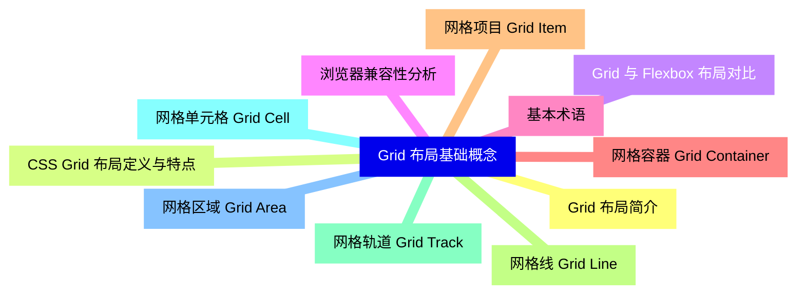
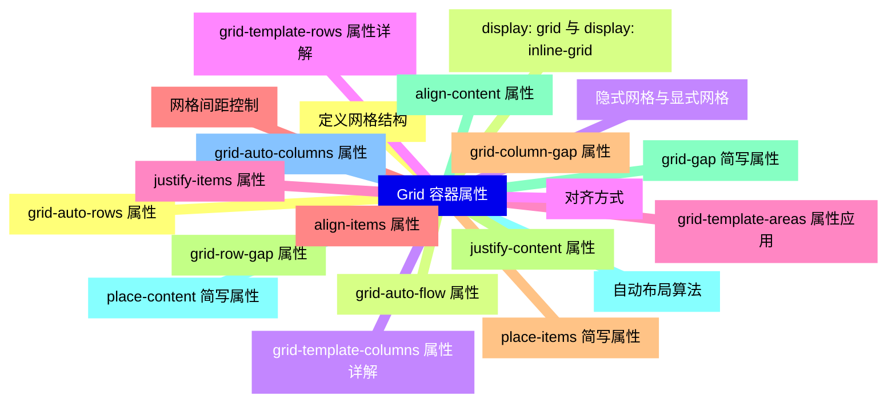
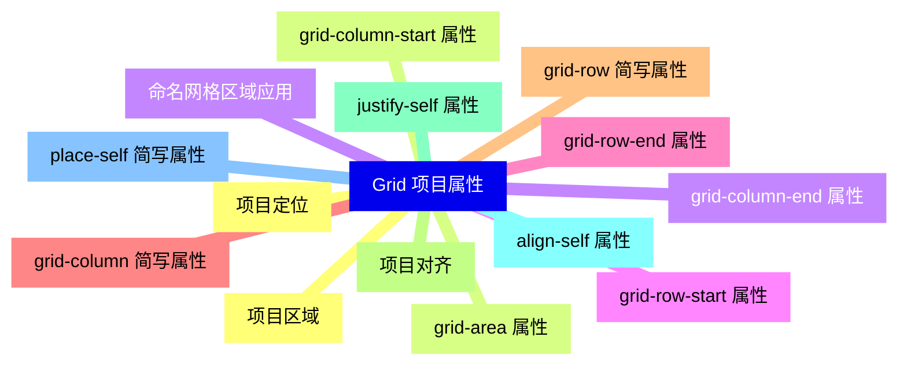
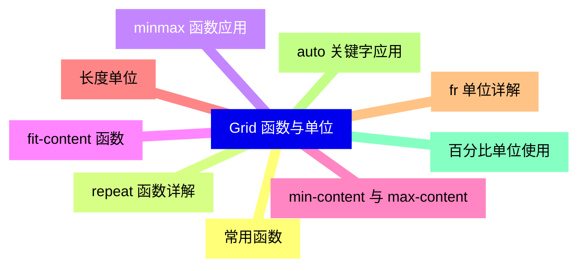
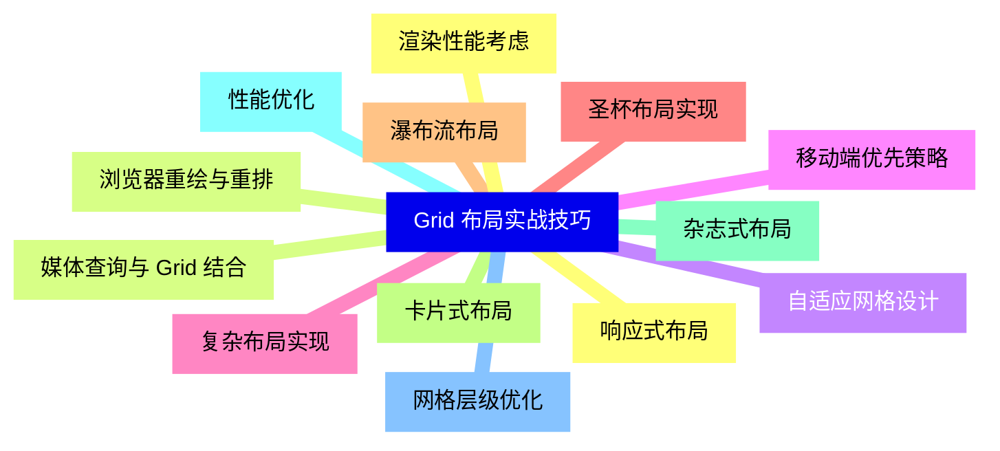
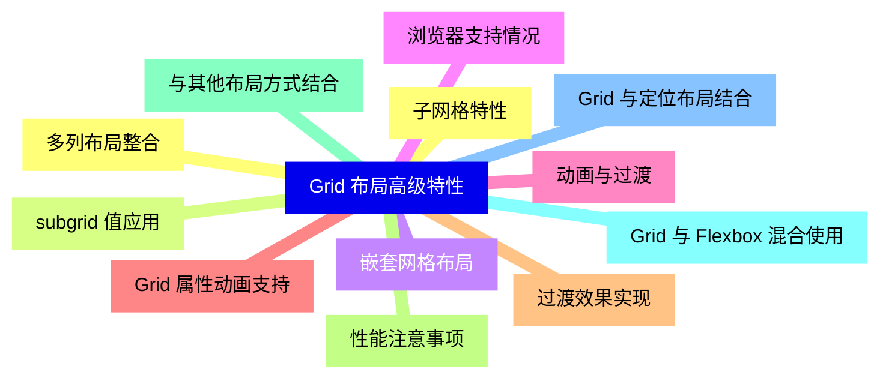
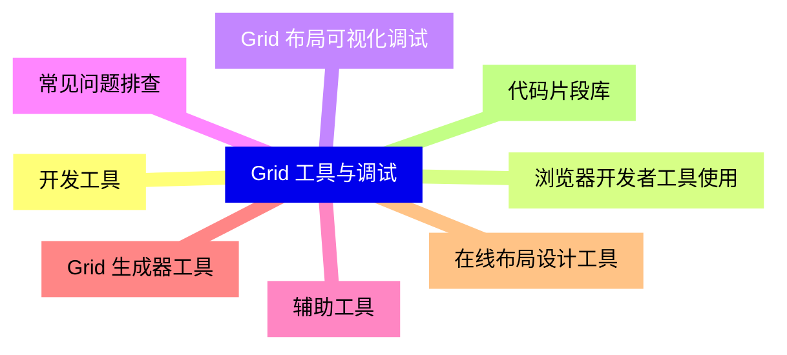
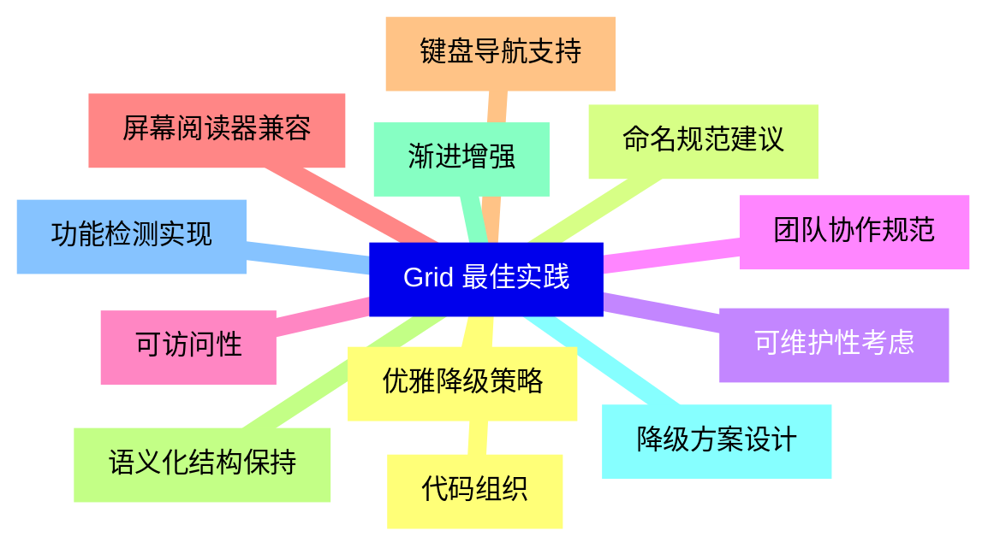


### 1 [Grid 布局基础概念](#1)
#### 1.1 [Grid 布局简介](#1)
#### 1.2 [CSS Grid 布局定义与特点](#1)
#### 1.3 [Grid 与 Flexbox 布局对比](#1)
#### 1.4 [浏览器兼容性分析](#1)
#### 1.5 [基本术语](#1)
#### 1.6 [网格容器 Grid Container](#1)
#### 1.7 [网格项目 Grid Item](#1)
#### 1.8 [网格线 Grid Line](#1)
#### 1.9 [网格轨道 Grid Track](#1)
#### 1.10 [网格单元格 Grid Cell](#1)
#### 1.11 [网格区域 Grid Area](#1)
### 2 [Grid 容器属性](#2)
#### 2.1 [定义网格结构](#2)
#### 2.2 [display: grid 与 display: inline-grid](#2)
#### 2.3 [grid-template-columns 属性详解](#2)
#### 2.4 [grid-template-rows 属性详解](#2)
#### 2.5 [grid-template-areas 属性应用](#2)
#### 2.6 [网格间距控制](#2)
#### 2.7 [grid-column-gap 属性](#2)
#### 2.8 [grid-row-gap 属性](#2)
#### 2.9 [grid-gap 简写属性](#2)
#### 2.10 [自动布局算法](#2)
#### 2.11 [grid-auto-columns 属性](#2)
#### 2.12 [grid-auto-rows 属性](#2)
#### 2.13 [grid-auto-flow 属性](#2)
#### 2.14 [隐式网格与显式网格](#2)
#### 2.15 [对齐方式](#2)
#### 2.16 [justify-items 属性](#2)
#### 2.17 [align-items 属性](#2)
#### 2.18 [place-items 简写属性](#2)
#### 2.19 [justify-content 属性](#2)
#### 2.20 [align-content 属性](#2)
#### 2.21 [place-content 简写属性](#2)
### 3 [Grid 项目属性](#3)
#### 3.1 [项目定位](#3)
#### 3.2 [grid-column-start 属性](#3)
#### 3.3 [grid-column-end 属性](#3)
#### 3.4 [grid-row-start 属性](#3)
#### 3.5 [grid-row-end 属性](#3)
#### 3.6 [grid-column 简写属性](#3)
#### 3.7 [grid-row 简写属性](#3)
#### 3.8 [项目对齐](#3)
#### 3.9 [justify-self 属性](#3)
#### 3.10 [align-self 属性](#3)
#### 3.11 [place-self 简写属性](#3)
#### 3.12 [项目区域](#3)
#### 3.13 [grid-area 属性](#3)
#### 3.14 [命名网格区域应用](#3)
### 4 [Grid 函数与单位](#4)
#### 4.1 [常用函数](#4)
#### 4.2 [repeat   函数详解](#4)
#### 4.3 [minmax   函数应用](#4)
#### 4.4 [fit-content   函数](#4)
#### 4.5 [min-content 与 max-content](#4)
#### 4.6 [长度单位](#4)
#### 4.7 [fr 单位详解](#4)
#### 4.8 [auto 关键字应用](#4)
#### 4.9 [百分比单位使用](#4)
### 5 [Grid 布局实战技巧](#5)
#### 5.1 [响应式布局](#5)
#### 5.2 [媒体查询与 Grid 结合](#5)
#### 5.3 [自适应网格设计](#5)
#### 5.4 [移动端优先策略](#5)
#### 5.5 [复杂布局实现](#5)
#### 5.6 [圣杯布局实现](#5)
#### 5.7 [瀑布流布局](#5)
#### 5.8 [卡片式布局](#5)
#### 5.9 [杂志式布局](#5)
#### 5.10 [性能优化](#5)
#### 5.11 [网格层级优化](#5)
#### 5.12 [渲染性能考虑](#5)
#### 5.13 [浏览器重绘与重排](#5)
### 6 [Grid 布局高级特性](#6)
#### 6.1 [子网格特性](#6)
#### 6.2 [subgrid 值应用](#6)
#### 6.3 [嵌套网格布局](#6)
#### 6.4 [浏览器支持情况](#6)
#### 6.5 [动画与过渡](#6)
#### 6.6 [Grid 属性动画支持](#6)
#### 6.7 [过渡效果实现](#6)
#### 6.8 [性能注意事项](#6)
#### 6.9 [与其他布局方式结合](#6)
#### 6.10 [Grid 与 Flexbox 混合使用](#6)
#### 6.11 [Grid 与定位布局结合](#6)
#### 6.12 [多列布局整合](#6)
### 7 [Grid 工具与调试](#7)
#### 7.1 [开发工具](#7)
#### 7.2 [浏览器开发者工具使用](#7)
#### 7.3 [Grid 布局可视化调试](#7)
#### 7.4 [常见问题排查](#7)
#### 7.5 [辅助工具](#7)
#### 7.6 [Grid 生成器工具](#7)
#### 7.7 [在线布局设计工具](#7)
#### 7.8 [代码片段库](#7)
### 8 [Grid 最佳实践](#8)
#### 8.1 [代码组织](#8)
#### 8.2 [命名规范建议](#8)
#### 8.3 [可维护性考虑](#8)
#### 8.4 [团队协作规范](#8)
#### 8.5 [可访问性](#8)
#### 8.6 [屏幕阅读器兼容](#8)
#### 8.7 [键盘导航支持](#8)
#### 8.8 [语义化结构保持](#8)
#### 8.9 [渐进增强](#8)
#### 8.10 [降级方案设计](#8)
#### 8.11 [功能检测实现](#8)
#### 8.12 [优雅降级策略](#8)




### 1 Grid 布局基础概念

---
### 1 Grid 布局基础概念
___
#### 1.1 Grid 布局简介
___
#### 1.2 CSS Grid 布局定义与特点
___
#### 1.3 Grid 与 Flexbox 布局对比
___
#### 1.4 浏览器兼容性分析
___
#### 1.5 基本术语
___
#### 1.6 网格容器 Grid Container
___
#### 1.7 网格项目 Grid Item
___
#### 1.8 网格线 Grid Line
___
#### 1.9 网格轨道 Grid Track
___
#### 1.10 网格单元格 Grid Cell
___
#### 1.11 网格区域 Grid Area
### 2 Grid 容器属性

---
### 2 Grid 容器属性
___
#### 2.1 定义网格结构
___
#### 2.2 display: grid 与 display: inline-grid
___
#### 2.3 grid-template-columns 属性详解
___
#### 2.4 grid-template-rows 属性详解
___
#### 2.5 grid-template-areas 属性应用
___
#### 2.6 网格间距控制
___
#### 2.7 grid-column-gap 属性
___
#### 2.8 grid-row-gap 属性
___
#### 2.9 grid-gap 简写属性
___
#### 2.10 自动布局算法
___
#### 2.11 grid-auto-columns 属性
___
#### 2.12 grid-auto-rows 属性
___
#### 2.13 grid-auto-flow 属性
___
#### 2.14 隐式网格与显式网格
___
#### 2.15 对齐方式
___
#### 2.16 justify-items 属性
___
#### 2.17 align-items 属性
___
#### 2.18 place-items 简写属性
___
#### 2.19 justify-content 属性
___
#### 2.20 align-content 属性
___
#### 2.21 place-content 简写属性
### 3 Grid 项目属性

---
### 3 Grid 项目属性
___
#### 3.1 项目定位
___
#### 3.2 grid-column-start 属性
___
#### 3.3 grid-column-end 属性
___
#### 3.4 grid-row-start 属性
___
#### 3.5 grid-row-end 属性
___
#### 3.6 grid-column 简写属性
___
#### 3.7 grid-row 简写属性
___
#### 3.8 项目对齐
___
#### 3.9 justify-self 属性
___
#### 3.10 align-self 属性
___
#### 3.11 place-self 简写属性
___
#### 3.12 项目区域
___
#### 3.13 grid-area 属性
___
#### 3.14 命名网格区域应用
### 4 Grid 函数与单位

---
### 4 Grid 函数与单位
___
#### 4.1 常用函数
___
#### 4.2 repeat   函数详解
___
#### 4.3 minmax   函数应用
___
#### 4.4 fit-content   函数
___
#### 4.5 min-content 与 max-content
___
#### 4.6 长度单位
___
#### 4.7 fr 单位详解
___
#### 4.8 auto 关键字应用
___
#### 4.9 百分比单位使用
### 5 Grid 布局实战技巧

---
### 5 Grid 布局实战技巧
___
#### 5.1 响应式布局
___
#### 5.2 媒体查询与 Grid 结合
___
#### 5.3 自适应网格设计
___
#### 5.4 移动端优先策略
___
#### 5.5 复杂布局实现
___
#### 5.6 圣杯布局实现
___
#### 5.7 瀑布流布局
___
#### 5.8 卡片式布局
___
#### 5.9 杂志式布局
___
#### 5.10 性能优化
___
#### 5.11 网格层级优化
___
#### 5.12 渲染性能考虑
___
#### 5.13 浏览器重绘与重排
### 6 Grid 布局高级特性

---
### 6 Grid 布局高级特性
___
#### 6.1 子网格特性
___
#### 6.2 subgrid 值应用
___
#### 6.3 嵌套网格布局
___
#### 6.4 浏览器支持情况
___
#### 6.5 动画与过渡
___
#### 6.6 Grid 属性动画支持
___
#### 6.7 过渡效果实现
___
#### 6.8 性能注意事项
___
#### 6.9 与其他布局方式结合
___
#### 6.10 Grid 与 Flexbox 混合使用
___
#### 6.11 Grid 与定位布局结合
___
#### 6.12 多列布局整合
### 7 Grid 工具与调试

---
### 7 Grid 工具与调试
___
#### 7.1 开发工具
___
#### 7.2 浏览器开发者工具使用
___
#### 7.3 Grid 布局可视化调试
___
#### 7.4 常见问题排查
___
#### 7.5 辅助工具
___
#### 7.6 Grid 生成器工具
___
#### 7.7 在线布局设计工具
___
#### 7.8 代码片段库
### 8 Grid 最佳实践

---
### 8 Grid 最佳实践
___
#### 8.1 代码组织
___
#### 8.2 命名规范建议
___
#### 8.3 可维护性考虑
___
#### 8.4 团队协作规范
___
#### 8.5 可访问性
___
#### 8.6 屏幕阅读器兼容
___
#### 8.7 键盘导航支持
___
#### 8.8 语义化结构保持
___
#### 8.9 渐进增强
___
#### 8.10 降级方案设计
___
#### 8.11 功能检测实现
___
#### 8.12 优雅降级策略


### 1 Grid 布局基础概念{#1}

{}

<--->
{}
{}
{}
{}
{}
{}
{}
{}
{}
{}
{}
{}
{}
{}
{}
{}
{}
{}
{}
{}
{}
{}
{}

### 2 Grid 容器属性{#2}

{}
{}
{}
{}
{}
{}
{}
{}
{}
{}
{}
{}
{}
{}
{}
{}
{}
{}
{}
{}
{}
{}
{}
{}
{}
{}
{}
{}
{}
{}
{}
{}
{}
{}
{}
{}
{}
{}
{}
{}
{}
{}
{}
<--->

{}

### 3 Grid 项目属性{#3}

{}

<--->
{}
{}
{}
{}
{}
{}
{}
{}
{}
{}
{}
{}
{}
{}
{}
{}
{}
{}
{}
{}
{}
{}
{}
{}
{}
{}
{}
{}
{}

### 4 Grid 函数与单位{#4}

{}
{}
{}
{}
{}
{}
{}
{}
{}
{}
{}
{}
{}
{}
{}
{}
{}
{}
{}
<--->

{}

### 5 Grid 布局实战技巧{#5}

{}

<--->
{}
{}
{}
{}
{}
{}
{}
{}
{}
{}
{}
{}
{}
{}
{}
{}
{}
{}
{}
{}
{}
{}
{}
{}
{}
{}
{}

### 6 Grid 布局高级特性{#6}

{}
{}
{}
{}
{}
{}
{}
{}
{}
{}
{}
{}
{}
{}
{}
{}
{}
{}
{}
{}
{}
{}
{}
{}
{}
<--->

{}

### 7 Grid 工具与调试{#7}

{}

<--->
{}
{}
{}
{}
{}
{}
{}
{}
{}
{}
{}
{}
{}
{}
{}
{}
{}

### 8 Grid 最佳实践{#8}

{}
{}
{}
{}
{}
{}
{}
{}
{}
{}
{}
{}
{}
{}
{}
{}
{}
{}
{}
{}
{}
{}
{}
{}
{}
<--->

{}
