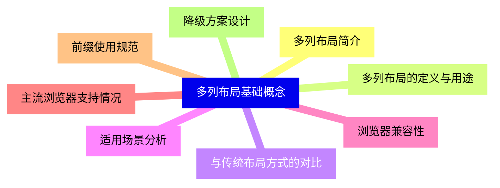
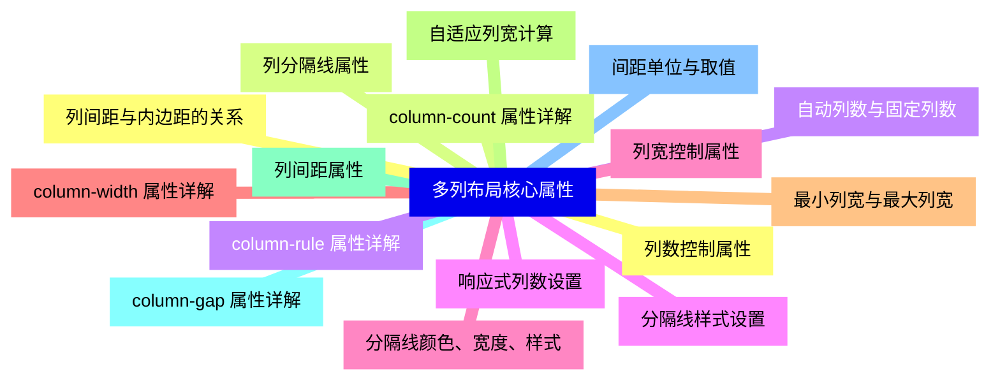
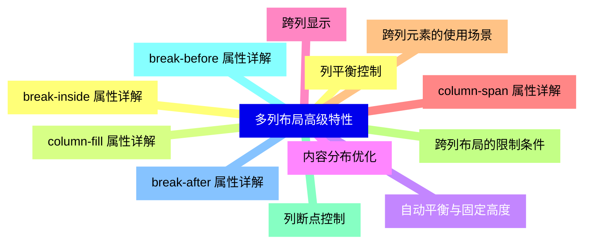
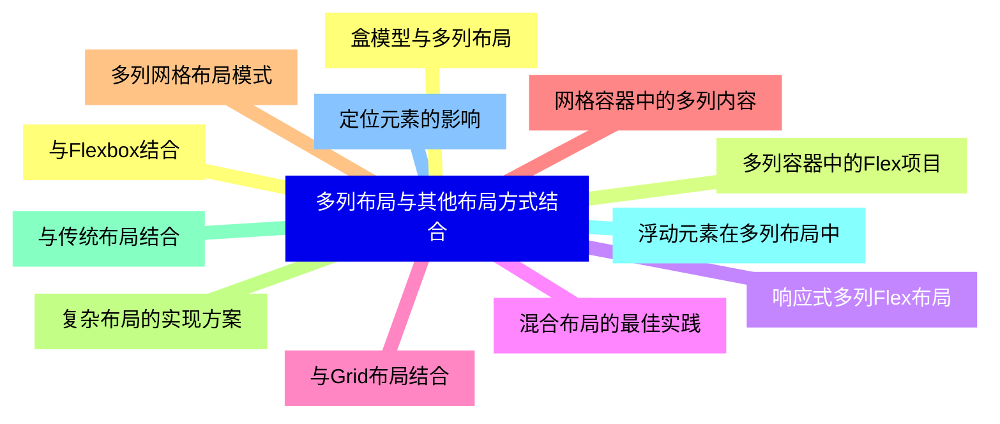
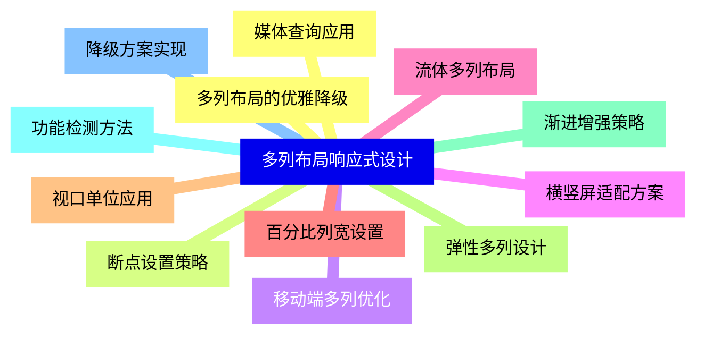
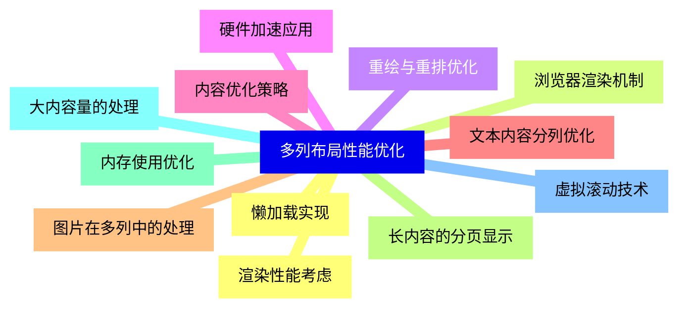
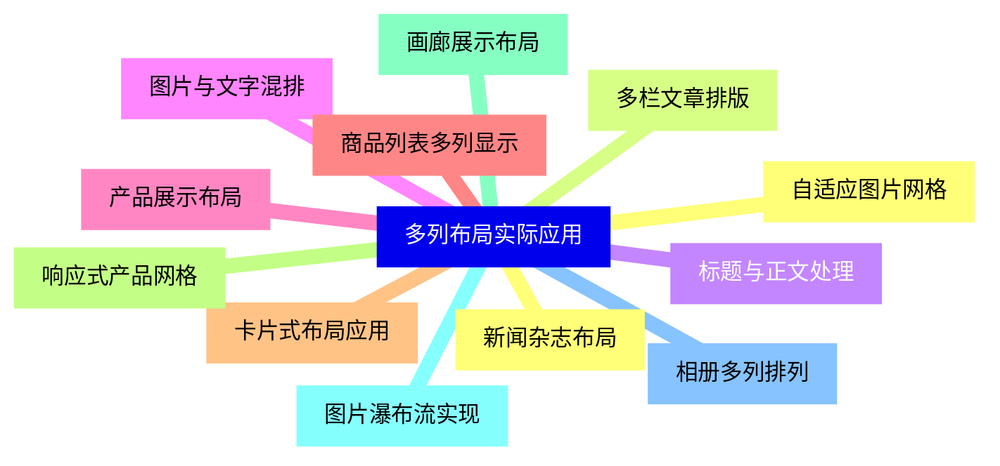
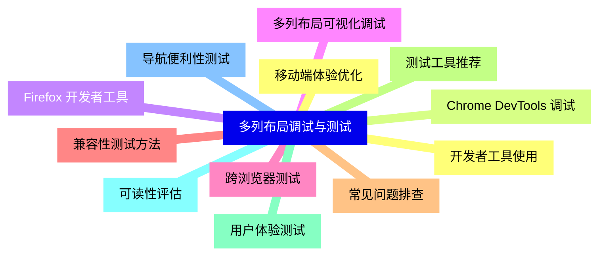


### 1 [多列布局基础概念](#1)
#### 1.1 [多列布局简介](#1)
#### 1.2 [多列布局的定义与用途](#1)
#### 1.3 [与传统布局方式的对比](#1)
#### 1.4 [适用场景分析](#1)
#### 1.5 [浏览器兼容性](#1)
#### 1.6 [主流浏览器支持情况](#1)
#### 1.7 [前缀使用规范](#1)
#### 1.8 [降级方案设计](#1)
### 2 [多列布局核心属性](#2)
#### 2.1 [列数控制属性](#2)
#### 2.2 [column-count 属性详解](#2)
#### 2.3 [自动列数与固定列数](#2)
#### 2.4 [响应式列数设置](#2)
#### 2.5 [列宽控制属性](#2)
#### 2.6 [column-width 属性详解](#2)
#### 2.7 [最小列宽与最大列宽](#2)
#### 2.8 [自适应列宽计算](#2)
#### 2.9 [列间距属性](#2)
#### 2.10 [column-gap 属性详解](#2)
#### 2.11 [间距单位与取值](#2)
#### 2.12 [列间距与内边距的关系](#2)
#### 2.13 [列分隔线属性](#2)
#### 2.14 [column-rule 属性详解](#2)
#### 2.15 [分隔线样式设置](#2)
#### 2.16 [分隔线颜色、宽度、样式](#2)
### 3 [多列布局高级特性](#3)
#### 3.1 [列平衡控制](#3)
#### 3.2 [column-fill 属性详解](#3)
#### 3.3 [自动平衡与固定高度](#3)
#### 3.4 [内容分布优化](#3)
#### 3.5 [跨列显示](#3)
#### 3.6 [column-span 属性详解](#3)
#### 3.7 [跨列元素的使用场景](#3)
#### 3.8 [跨列布局的限制条件](#3)
#### 3.9 [列断点控制](#3)
#### 3.10 [break-before 属性详解](#3)
#### 3.11 [break-after 属性详解](#3)
#### 3.12 [break-inside 属性详解](#3)
### 4 [多列布局与其他布局方式结合](#4)
#### 4.1 [与Flexbox结合](#4)
#### 4.2 [多列容器中的Flex项目](#4)
#### 4.3 [响应式多列Flex布局](#4)
#### 4.4 [混合布局的最佳实践](#4)
#### 4.5 [与Grid布局结合](#4)
#### 4.6 [网格容器中的多列内容](#4)
#### 4.7 [多列网格布局模式](#4)
#### 4.8 [复杂布局的实现方案](#4)
#### 4.9 [与传统布局结合](#4)
#### 4.10 [浮动元素在多列布局中](#4)
#### 4.11 [定位元素的影响](#4)
#### 4.12 [盒模型与多列布局](#4)
### 5 [多列布局响应式设计](#5)
#### 5.1 [媒体查询应用](#5)
#### 5.2 [断点设置策略](#5)
#### 5.3 [移动端多列优化](#5)
#### 5.4 [横竖屏适配方案](#5)
#### 5.5 [流体多列布局](#5)
#### 5.6 [百分比列宽设置](#5)
#### 5.7 [视口单位应用](#5)
#### 5.8 [弹性多列设计](#5)
#### 5.9 [渐进增强策略](#5)
#### 5.10 [功能检测方法](#5)
#### 5.11 [降级方案实现](#5)
#### 5.12 [多列布局的优雅降级](#5)
### 6 [多列布局性能优化](#6)
#### 6.1 [渲染性能考虑](#6)
#### 6.2 [浏览器渲染机制](#6)
#### 6.3 [重绘与重排优化](#6)
#### 6.4 [硬件加速应用](#6)
#### 6.5 [内容优化策略](#6)
#### 6.6 [文本内容分列优化](#6)
#### 6.7 [图片在多列中的处理](#6)
#### 6.8 [长内容的分页显示](#6)
#### 6.9 [内存使用优化](#6)
#### 6.10 [大内容量的处理](#6)
#### 6.11 [虚拟滚动技术](#6)
#### 6.12 [懒加载实现](#6)
### 7 [多列布局实际应用](#7)
#### 7.1 [新闻杂志布局](#7)
#### 7.2 [多栏文章排版](#7)
#### 7.3 [标题与正文处理](#7)
#### 7.4 [图片与文字混排](#7)
#### 7.5 [产品展示布局](#7)
#### 7.6 [商品列表多列显示](#7)
#### 7.7 [卡片式布局应用](#7)
#### 7.8 [响应式产品网格](#7)
#### 7.9 [画廊展示布局](#7)
#### 7.10 [图片瀑布流实现](#7)
#### 7.11 [相册多列排列](#7)
#### 7.12 [自适应图片网格](#7)
### 8 [多列布局调试与测试](#8)
#### 8.1 [开发者工具使用](#8)
#### 8.2 [Chrome DevTools 调试](#8)
#### 8.3 [Firefox 开发者工具](#8)
#### 8.4 [多列布局可视化调试](#8)
#### 8.5 [跨浏览器测试](#8)
#### 8.6 [兼容性测试方法](#8)
#### 8.7 [常见问题排查](#8)
#### 8.8 [测试工具推荐](#8)
#### 8.9 [用户体验测试](#8)
#### 8.10 [可读性评估](#8)
#### 8.11 [导航便利性测试](#8)
#### 8.12 [移动端体验优化](#8)




### 1 多列布局基础概念

---
### 1 多列布局基础概念
___
#### 1.1 多列布局简介
___
#### 1.2 多列布局的定义与用途
___
#### 1.3 与传统布局方式的对比
___
#### 1.4 适用场景分析
___
#### 1.5 浏览器兼容性
___
#### 1.6 主流浏览器支持情况
___
#### 1.7 前缀使用规范
___
#### 1.8 降级方案设计
### 2 多列布局核心属性

---
### 2 多列布局核心属性
___
#### 2.1 列数控制属性
___
#### 2.2 column-count 属性详解
___
#### 2.3 自动列数与固定列数
___
#### 2.4 响应式列数设置
___
#### 2.5 列宽控制属性
___
#### 2.6 column-width 属性详解
___
#### 2.7 最小列宽与最大列宽
___
#### 2.8 自适应列宽计算
___
#### 2.9 列间距属性
___
#### 2.10 column-gap 属性详解
___
#### 2.11 间距单位与取值
___
#### 2.12 列间距与内边距的关系
___
#### 2.13 列分隔线属性
___
#### 2.14 column-rule 属性详解
___
#### 2.15 分隔线样式设置
___
#### 2.16 分隔线颜色、宽度、样式
### 3 多列布局高级特性

---
### 3 多列布局高级特性
___
#### 3.1 列平衡控制
___
#### 3.2 column-fill 属性详解
___
#### 3.3 自动平衡与固定高度
___
#### 3.4 内容分布优化
___
#### 3.5 跨列显示
___
#### 3.6 column-span 属性详解
___
#### 3.7 跨列元素的使用场景
___
#### 3.8 跨列布局的限制条件
___
#### 3.9 列断点控制
___
#### 3.10 break-before 属性详解
___
#### 3.11 break-after 属性详解
___
#### 3.12 break-inside 属性详解
### 4 多列布局与其他布局方式结合

---
### 4 多列布局与其他布局方式结合
___
#### 4.1 与Flexbox结合
___
#### 4.2 多列容器中的Flex项目
___
#### 4.3 响应式多列Flex布局
___
#### 4.4 混合布局的最佳实践
___
#### 4.5 与Grid布局结合
___
#### 4.6 网格容器中的多列内容
___
#### 4.7 多列网格布局模式
___
#### 4.8 复杂布局的实现方案
___
#### 4.9 与传统布局结合
___
#### 4.10 浮动元素在多列布局中
___
#### 4.11 定位元素的影响
___
#### 4.12 盒模型与多列布局
### 5 多列布局响应式设计

---
### 5 多列布局响应式设计
___
#### 5.1 媒体查询应用
___
#### 5.2 断点设置策略
___
#### 5.3 移动端多列优化
___
#### 5.4 横竖屏适配方案
___
#### 5.5 流体多列布局
___
#### 5.6 百分比列宽设置
___
#### 5.7 视口单位应用
___
#### 5.8 弹性多列设计
___
#### 5.9 渐进增强策略
___
#### 5.10 功能检测方法
___
#### 5.11 降级方案实现
___
#### 5.12 多列布局的优雅降级
### 6 多列布局性能优化

---
### 6 多列布局性能优化
___
#### 6.1 渲染性能考虑
___
#### 6.2 浏览器渲染机制
___
#### 6.3 重绘与重排优化
___
#### 6.4 硬件加速应用
___
#### 6.5 内容优化策略
___
#### 6.6 文本内容分列优化
___
#### 6.7 图片在多列中的处理
___
#### 6.8 长内容的分页显示
___
#### 6.9 内存使用优化
___
#### 6.10 大内容量的处理
___
#### 6.11 虚拟滚动技术
___
#### 6.12 懒加载实现
### 7 多列布局实际应用

---
### 7 多列布局实际应用
___
#### 7.1 新闻杂志布局
___
#### 7.2 多栏文章排版
___
#### 7.3 标题与正文处理
___
#### 7.4 图片与文字混排
___
#### 7.5 产品展示布局
___
#### 7.6 商品列表多列显示
___
#### 7.7 卡片式布局应用
___
#### 7.8 响应式产品网格
___
#### 7.9 画廊展示布局
___
#### 7.10 图片瀑布流实现
___
#### 7.11 相册多列排列
___
#### 7.12 自适应图片网格
### 8 多列布局调试与测试

---
### 8 多列布局调试与测试
___
#### 8.1 开发者工具使用
___
#### 8.2 Chrome DevTools 调试
___
#### 8.3 Firefox 开发者工具
___
#### 8.4 多列布局可视化调试
___
#### 8.5 跨浏览器测试
___
#### 8.6 兼容性测试方法
___
#### 8.7 常见问题排查
___
#### 8.8 测试工具推荐
___
#### 8.9 用户体验测试
___
#### 8.10 可读性评估
___
#### 8.11 导航便利性测试
___
#### 8.12 移动端体验优化


### 1 多列布局基础概念{#1}

{}

<--->
{}
{}
{}
{}
{}
{}
{}
{}
{}
{}
{}
{}
{}
{}
{}
{}
{}

### 2 多列布局核心属性{#2}

{}
{}
{}
{}
{}
{}
{}
{}
{}
{}
{}
{}
{}
{}
{}
{}
{}
{}
{}
{}
{}
{}
{}
{}
{}
{}
{}
{}
{}
{}
{}
{}
{}
<--->

{}

### 3 多列布局高级特性{#3}

{}

<--->
{}
{}
{}
{}
{}
{}
{}
{}
{}
{}
{}
{}
{}
{}
{}
{}
{}
{}
{}
{}
{}
{}
{}
{}
{}

### 4 多列布局与其他布局方式结合{#4}

{}
{}
{}
{}
{}
{}
{}
{}
{}
{}
{}
{}
{}
{}
{}
{}
{}
{}
{}
{}
{}
{}
{}
{}
{}
<--->

{}

### 5 多列布局响应式设计{#5}

{}

<--->
{}
{}
{}
{}
{}
{}
{}
{}
{}
{}
{}
{}
{}
{}
{}
{}
{}
{}
{}
{}
{}
{}
{}
{}
{}

### 6 多列布局性能优化{#6}

{}
{}
{}
{}
{}
{}
{}
{}
{}
{}
{}
{}
{}
{}
{}
{}
{}
{}
{}
{}
{}
{}
{}
{}
{}
<--->

{}

### 7 多列布局实际应用{#7}

{}

<--->
{}
{}
{}
{}
{}
{}
{}
{}
{}
{}
{}
{}
{}
{}
{}
{}
{}
{}
{}
{}
{}
{}
{}
{}
{}

### 8 多列布局调试与测试{#8}

{}
{}
{}
{}
{}
{}
{}
{}
{}
{}
{}
{}
{}
{}
{}
{}
{}
{}
{}
{}
{}
{}
{}
{}
{}
<--->

{}
