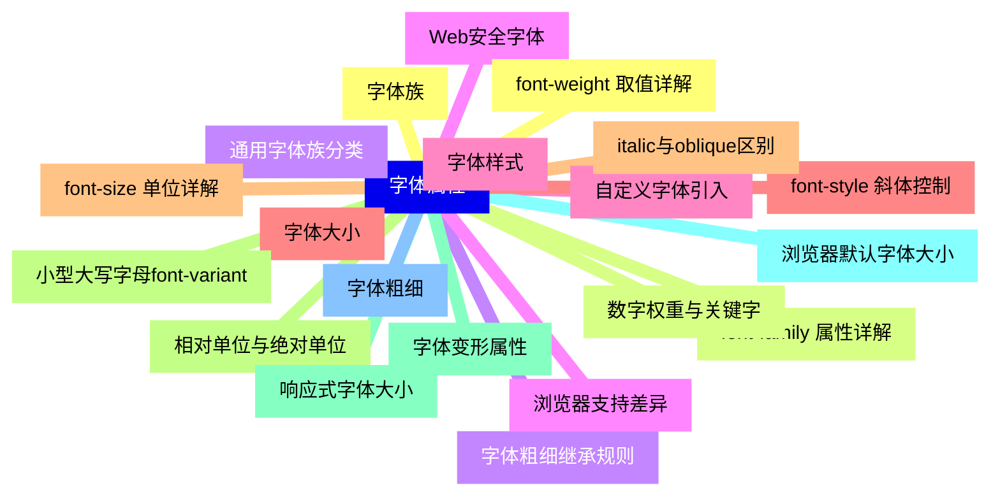
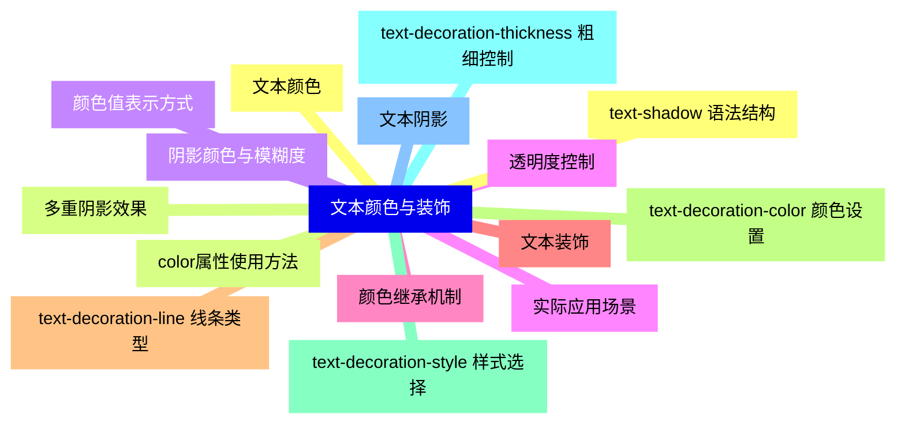
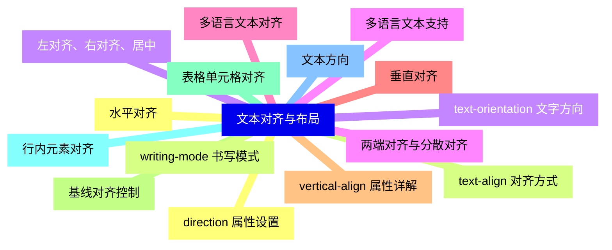
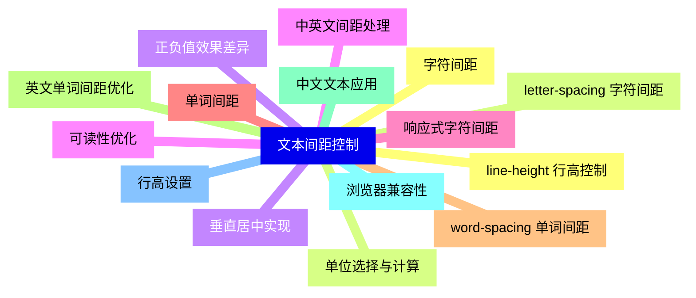
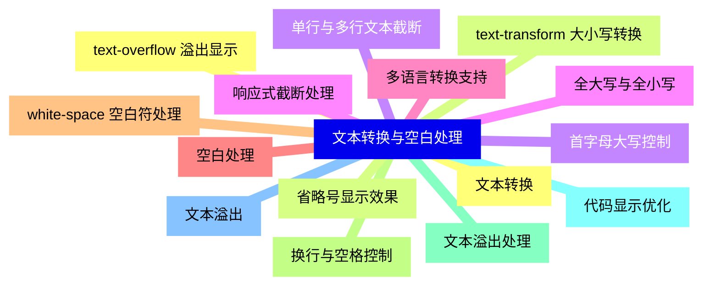
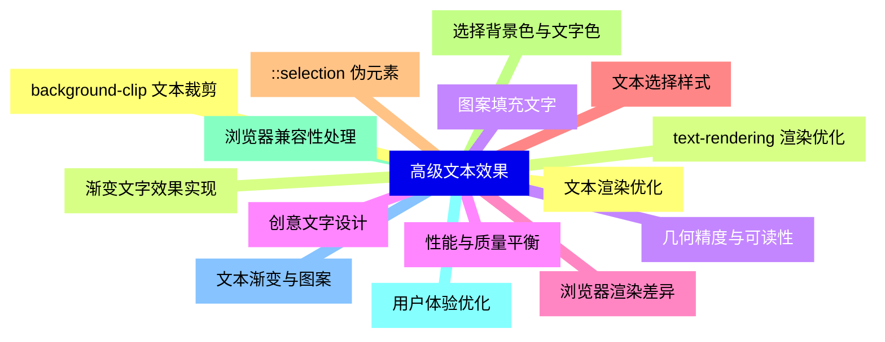
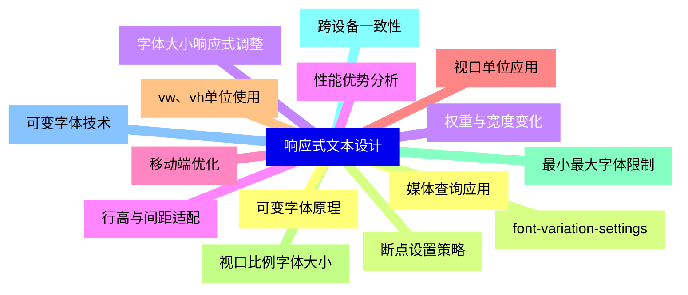
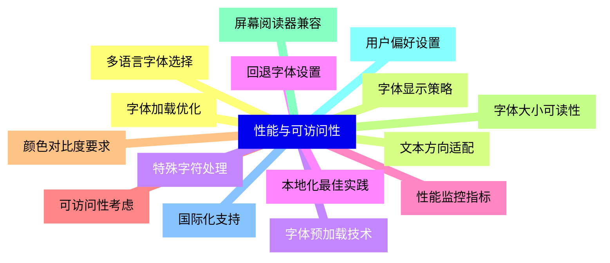


### 1 [字体属性](#1)
#### 1.1 [字体族](#1)
#### 1.2 [font-family 属性详解](#1)
#### 1.3 [通用字体族分类](#1)
#### 1.4 [Web安全字体](#1)
#### 1.5 [自定义字体引入](#1)
#### 1.6 [字体大小](#1)
#### 1.7 [font-size 单位详解](#1)
#### 1.8 [相对单位与绝对单位](#1)
#### 1.9 [响应式字体大小](#1)
#### 1.10 [浏览器默认字体大小](#1)
#### 1.11 [字体粗细](#1)
#### 1.12 [font-weight 取值详解](#1)
#### 1.13 [数字权重与关键字](#1)
#### 1.14 [字体粗细继承规则](#1)
#### 1.15 [浏览器支持差异](#1)
#### 1.16 [字体样式](#1)
#### 1.17 [font-style 斜体控制](#1)
#### 1.18 [italic与oblique区别](#1)
#### 1.19 [小型大写字母font-variant](#1)
#### 1.20 [字体变形属性](#1)
### 2 [文本颜色与装饰](#2)
#### 2.1 [文本颜色](#2)
#### 2.2 [color属性使用方法](#2)
#### 2.3 [颜色值表示方式](#2)
#### 2.4 [透明度控制](#2)
#### 2.5 [颜色继承机制](#2)
#### 2.6 [文本装饰](#2)
#### 2.7 [text-decoration-line 线条类型](#2)
#### 2.8 [text-decoration-color 颜色设置](#2)
#### 2.9 [text-decoration-style 样式选择](#2)
#### 2.10 [text-decoration-thickness 粗细控制](#2)
#### 2.11 [文本阴影](#2)
#### 2.12 [text-shadow 语法结构](#2)
#### 2.13 [多重阴影效果](#2)
#### 2.14 [阴影颜色与模糊度](#2)
#### 2.15 [实际应用场景](#2)
### 3 [文本对齐与布局](#3)
#### 3.1 [水平对齐](#3)
#### 3.2 [text-align 对齐方式](#3)
#### 3.3 [左对齐、右对齐、居中](#3)
#### 3.4 [两端对齐与分散对齐](#3)
#### 3.5 [多语言文本对齐](#3)
#### 3.6 [垂直对齐](#3)
#### 3.7 [vertical-align 属性详解](#3)
#### 3.8 [基线对齐控制](#3)
#### 3.9 [表格单元格对齐](#3)
#### 3.10 [行内元素对齐](#3)
#### 3.11 [文本方向](#3)
#### 3.12 [direction 属性设置](#3)
#### 3.13 [writing-mode 书写模式](#3)
#### 3.14 [text-orientation 文字方向](#3)
#### 3.15 [多语言文本支持](#3)
### 4 [文本间距控制](#4)
#### 4.1 [字符间距](#4)
#### 4.2 [letter-spacing 字符间距](#4)
#### 4.3 [正负值效果差异](#4)
#### 4.4 [中英文间距处理](#4)
#### 4.5 [响应式字符间距](#4)
#### 4.6 [单词间距](#4)
#### 4.7 [word-spacing 单词间距](#4)
#### 4.8 [英文单词间距优化](#4)
#### 4.9 [中文文本应用](#4)
#### 4.10 [浏览器兼容性](#4)
#### 4.11 [行高设置](#4)
#### 4.12 [line-height 行高控制](#4)
#### 4.13 [单位选择与计算](#4)
#### 4.14 [垂直居中实现](#4)
#### 4.15 [可读性优化](#4)
### 5 [文本转换与空白处理](#5)
#### 5.1 [文本转换](#5)
#### 5.2 [text-transform 大小写转换](#5)
#### 5.3 [首字母大写控制](#5)
#### 5.4 [全大写与全小写](#5)
#### 5.5 [多语言转换支持](#5)
#### 5.6 [空白处理](#5)
#### 5.7 [white-space 空白符处理](#5)
#### 5.8 [换行与空格控制](#5)
#### 5.9 [文本溢出处理](#5)
#### 5.10 [代码显示优化](#5)
#### 5.11 [文本溢出](#5)
#### 5.12 [text-overflow 溢出显示](#5)
#### 5.13 [省略号显示效果](#5)
#### 5.14 [单行与多行文本截断](#5)
#### 5.15 [响应式截断处理](#5)
### 6 [高级文本效果](#6)
#### 6.1 [文本渲染优化](#6)
#### 6.2 [text-rendering 渲染优化](#6)
#### 6.3 [几何精度与可读性](#6)
#### 6.4 [性能与质量平衡](#6)
#### 6.5 [浏览器渲染差异](#6)
#### 6.6 [文本选择样式](#6)
#### 6.7 [::selection 伪元素](#6)
#### 6.8 [选择背景色与文字色](#6)
#### 6.9 [浏览器兼容性处理](#6)
#### 6.10 [用户体验优化](#6)
#### 6.11 [文本渐变与图案](#6)
#### 6.12 [background-clip 文本裁剪](#6)
#### 6.13 [渐变文字效果实现](#6)
#### 6.14 [图案填充文字](#6)
#### 6.15 [创意文字设计](#6)
### 7 [响应式文本设计](#7)
#### 7.1 [媒体查询应用](#7)
#### 7.2 [断点设置策略](#7)
#### 7.3 [字体大小响应式调整](#7)
#### 7.4 [行高与间距适配](#7)
#### 7.5 [移动端优化](#7)
#### 7.6 [视口单位应用](#7)
#### 7.7 [vw、vh单位使用](#7)
#### 7.8 [视口比例字体大小](#7)
#### 7.9 [最小最大字体限制](#7)
#### 7.10 [跨设备一致性](#7)
#### 7.11 [可变字体技术](#7)
#### 7.12 [可变字体原理](#7)
#### 7.13 [font-variation-settings](#7)
#### 7.14 [权重与宽度变化](#7)
#### 7.15 [性能优势分析](#7)
### 8 [性能与可访问性](#8)
#### 8.1 [字体加载优化](#8)
#### 8.2 [字体显示策略](#8)
#### 8.3 [字体预加载技术](#8)
#### 8.4 [回退字体设置](#8)
#### 8.5 [性能监控指标](#8)
#### 8.6 [可访问性考虑](#8)
#### 8.7 [颜色对比度要求](#8)
#### 8.8 [字体大小可读性](#8)
#### 8.9 [屏幕阅读器兼容](#8)
#### 8.10 [用户偏好设置](#8)
#### 8.11 [国际化支持](#8)
#### 8.12 [多语言字体选择](#8)
#### 8.13 [文本方向适配](#8)
#### 8.14 [特殊字符处理](#8)
#### 8.15 [本地化最佳实践](#8)




### 1 字体属性

---
### 1 字体属性
___
#### 1.1 字体族
___
#### 1.2 font-family 属性详解
___
#### 1.3 通用字体族分类
___
#### 1.4 Web安全字体
___
#### 1.5 自定义字体引入
___
#### 1.6 字体大小
___
#### 1.7 font-size 单位详解
___
#### 1.8 相对单位与绝对单位
___
#### 1.9 响应式字体大小
___
#### 1.10 浏览器默认字体大小
___
#### 1.11 字体粗细
___
#### 1.12 font-weight 取值详解
___
#### 1.13 数字权重与关键字
___
#### 1.14 字体粗细继承规则
___
#### 1.15 浏览器支持差异
___
#### 1.16 字体样式
___
#### 1.17 font-style 斜体控制
___
#### 1.18 italic与oblique区别
___
#### 1.19 小型大写字母font-variant
___
#### 1.20 字体变形属性
### 2 文本颜色与装饰

---
### 2 文本颜色与装饰
___
#### 2.1 文本颜色
___
#### 2.2 color属性使用方法
___
#### 2.3 颜色值表示方式
___
#### 2.4 透明度控制
___
#### 2.5 颜色继承机制
___
#### 2.6 文本装饰
___
#### 2.7 text-decoration-line 线条类型
___
#### 2.8 text-decoration-color 颜色设置
___
#### 2.9 text-decoration-style 样式选择
___
#### 2.10 text-decoration-thickness 粗细控制
___
#### 2.11 文本阴影
___
#### 2.12 text-shadow 语法结构
___
#### 2.13 多重阴影效果
___
#### 2.14 阴影颜色与模糊度
___
#### 2.15 实际应用场景
### 3 文本对齐与布局

---
### 3 文本对齐与布局
___
#### 3.1 水平对齐
___
#### 3.2 text-align 对齐方式
___
#### 3.3 左对齐、右对齐、居中
___
#### 3.4 两端对齐与分散对齐
___
#### 3.5 多语言文本对齐
___
#### 3.6 垂直对齐
___
#### 3.7 vertical-align 属性详解
___
#### 3.8 基线对齐控制
___
#### 3.9 表格单元格对齐
___
#### 3.10 行内元素对齐
___
#### 3.11 文本方向
___
#### 3.12 direction 属性设置
___
#### 3.13 writing-mode 书写模式
___
#### 3.14 text-orientation 文字方向
___
#### 3.15 多语言文本支持
### 4 文本间距控制

---
### 4 文本间距控制
___
#### 4.1 字符间距
___
#### 4.2 letter-spacing 字符间距
___
#### 4.3 正负值效果差异
___
#### 4.4 中英文间距处理
___
#### 4.5 响应式字符间距
___
#### 4.6 单词间距
___
#### 4.7 word-spacing 单词间距
___
#### 4.8 英文单词间距优化
___
#### 4.9 中文文本应用
___
#### 4.10 浏览器兼容性
___
#### 4.11 行高设置
___
#### 4.12 line-height 行高控制
___
#### 4.13 单位选择与计算
___
#### 4.14 垂直居中实现
___
#### 4.15 可读性优化
### 5 文本转换与空白处理

---
### 5 文本转换与空白处理
___
#### 5.1 文本转换
___
#### 5.2 text-transform 大小写转换
___
#### 5.3 首字母大写控制
___
#### 5.4 全大写与全小写
___
#### 5.5 多语言转换支持
___
#### 5.6 空白处理
___
#### 5.7 white-space 空白符处理
___
#### 5.8 换行与空格控制
___
#### 5.9 文本溢出处理
___
#### 5.10 代码显示优化
___
#### 5.11 文本溢出
___
#### 5.12 text-overflow 溢出显示
___
#### 5.13 省略号显示效果
___
#### 5.14 单行与多行文本截断
___
#### 5.15 响应式截断处理
### 6 高级文本效果

---
### 6 高级文本效果
___
#### 6.1 文本渲染优化
___
#### 6.2 text-rendering 渲染优化
___
#### 6.3 几何精度与可读性
___
#### 6.4 性能与质量平衡
___
#### 6.5 浏览器渲染差异
___
#### 6.6 文本选择样式
___
#### 6.7 ::selection 伪元素
___
#### 6.8 选择背景色与文字色
___
#### 6.9 浏览器兼容性处理
___
#### 6.10 用户体验优化
___
#### 6.11 文本渐变与图案
___
#### 6.12 background-clip 文本裁剪
___
#### 6.13 渐变文字效果实现
___
#### 6.14 图案填充文字
___
#### 6.15 创意文字设计
### 7 响应式文本设计

---
### 7 响应式文本设计
___
#### 7.1 媒体查询应用
___
#### 7.2 断点设置策略
___
#### 7.3 字体大小响应式调整
___
#### 7.4 行高与间距适配
___
#### 7.5 移动端优化
___
#### 7.6 视口单位应用
___
#### 7.7 vw、vh单位使用
___
#### 7.8 视口比例字体大小
___
#### 7.9 最小最大字体限制
___
#### 7.10 跨设备一致性
___
#### 7.11 可变字体技术
___
#### 7.12 可变字体原理
___
#### 7.13 font-variation-settings
___
#### 7.14 权重与宽度变化
___
#### 7.15 性能优势分析
### 8 性能与可访问性

---
### 8 性能与可访问性
___
#### 8.1 字体加载优化
___
#### 8.2 字体显示策略
___
#### 8.3 字体预加载技术
___
#### 8.4 回退字体设置
___
#### 8.5 性能监控指标
___
#### 8.6 可访问性考虑
___
#### 8.7 颜色对比度要求
___
#### 8.8 字体大小可读性
___
#### 8.9 屏幕阅读器兼容
___
#### 8.10 用户偏好设置
___
#### 8.11 国际化支持
___
#### 8.12 多语言字体选择
___
#### 8.13 文本方向适配
___
#### 8.14 特殊字符处理
___
#### 8.15 本地化最佳实践


### 1 字体属性{#1}

{}

<--->
{}
{}
{}
{}
{}
{}
{}
{}
{}
{}
{}
{}
{}
{}
{}
{}
{}
{}
{}
{}
{}
{}
{}
{}
{}
{}
{}
{}
{}
{}
{}
{}
{}
{}
{}
{}
{}
{}
{}
{}
{}

### 2 文本颜色与装饰{#2}

{}
{}
{}
{}
{}
{}
{}
{}
{}
{}
{}
{}
{}
{}
{}
{}
{}
{}
{}
{}
{}
{}
{}
{}
{}
{}
{}
{}
{}
{}
{}
<--->

{}

### 3 文本对齐与布局{#3}

{}

<--->
{}
{}
{}
{}
{}
{}
{}
{}
{}
{}
{}
{}
{}
{}
{}
{}
{}
{}
{}
{}
{}
{}
{}
{}
{}
{}
{}
{}
{}
{}
{}

### 4 文本间距控制{#4}

{}
{}
{}
{}
{}
{}
{}
{}
{}
{}
{}
{}
{}
{}
{}
{}
{}
{}
{}
{}
{}
{}
{}
{}
{}
{}
{}
{}
{}
{}
{}
<--->

{}

### 5 文本转换与空白处理{#5}

{}

<--->
{}
{}
{}
{}
{}
{}
{}
{}
{}
{}
{}
{}
{}
{}
{}
{}
{}
{}
{}
{}
{}
{}
{}
{}
{}
{}
{}
{}
{}
{}
{}

### 6 高级文本效果{#6}

{}
{}
{}
{}
{}
{}
{}
{}
{}
{}
{}
{}
{}
{}
{}
{}
{}
{}
{}
{}
{}
{}
{}
{}
{}
{}
{}
{}
{}
{}
{}
<--->

{}

### 7 响应式文本设计{#7}

{}

<--->
{}
{}
{}
{}
{}
{}
{}
{}
{}
{}
{}
{}
{}
{}
{}
{}
{}
{}
{}
{}
{}
{}
{}
{}
{}
{}
{}
{}
{}
{}
{}

### 8 性能与可访问性{#8}

{}
{}
{}
{}
{}
{}
{}
{}
{}
{}
{}
{}
{}
{}
{}
{}
{}
{}
{}
{}
{}
{}
{}
{}
{}
{}
{}
{}
{}
{}
{}
<--->

{}
