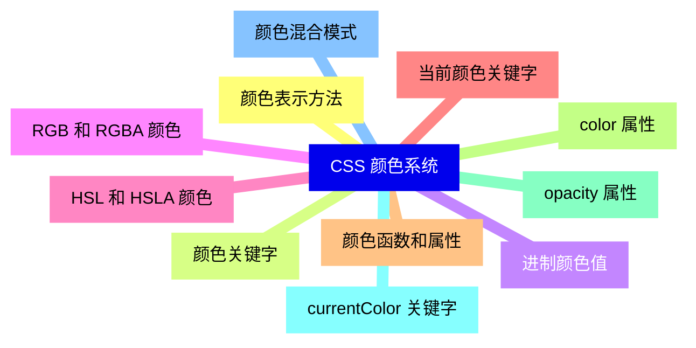
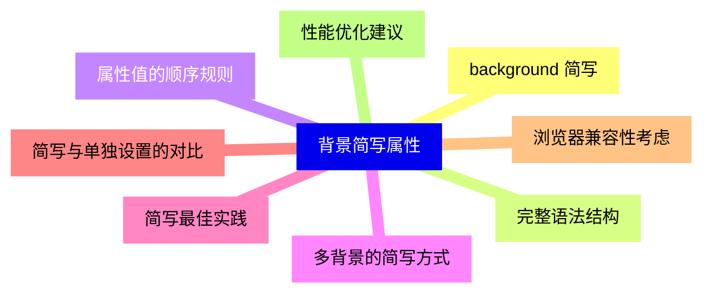
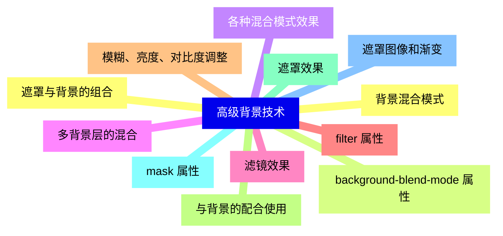
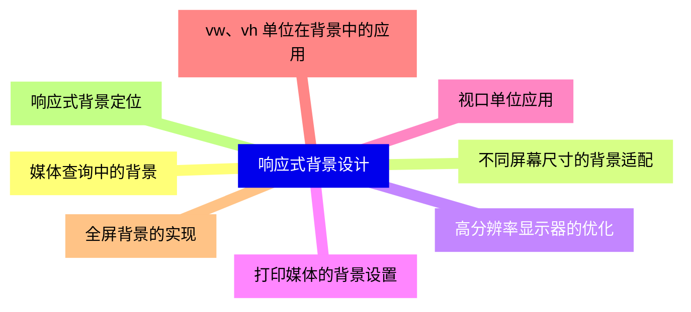
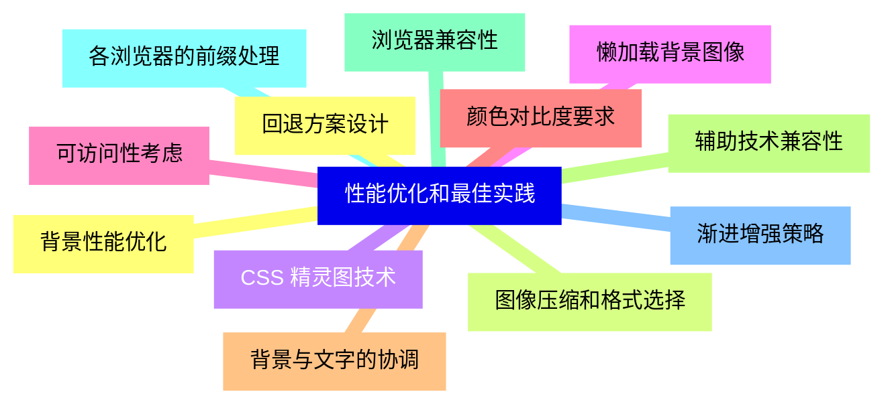


### 1 [CSS 颜色系统](#1)
#### 1.1 [颜色表示方法](#1)
#### 1.2 [颜色关键字](#1)
#### 1.3 [进制颜色值](#1)
#### 1.4 [RGB 和 RGBA 颜色](#1)
#### 1.5 [HSL 和 HSLA 颜色](#1)
#### 1.6 [当前颜色关键字](#1)
#### 1.7 [颜色函数和属性](#1)
#### 1.8 [color 属性](#1)
#### 1.9 [opacity 属性](#1)
#### 1.10 [currentColor 关键字](#1)
#### 1.11 [颜色混合模式](#1)
### 2 [CSS 背景属性](#2)
#### 2.1 [背景颜色](#2)
#### 2.2 [background-color 属性](#2)
#### 2.3 [背景颜色的继承特性](#2)
#### 2.4 [透明背景的实现](#2)
#### 2.5 [背景图像](#2)
#### 2.6 [background-image 属性](#2)
#### 2.7 [多背景图像设置](#2)
#### 2.8 [线性渐变背景](#2)
#### 2.9 [径向渐变背景](#2)
#### 2.10 [锥形渐变背景](#2)
#### 2.11 [背景定位](#2)
#### 2.12 [background-position 属性](#2)
#### 2.13 [关键字定位方法](#2)
#### 2.14 [百分比定位方法](#2)
#### 2.15 [长度单位定位方法](#2)
#### 2.16 [背景重复](#2)
#### 2.17 [background-repeat 属性](#2)
#### 2.18 [repeat 和 no-repeat](#2)
#### 2.19 [repeat-x 和 repeat-y](#2)
#### 2.20 [space 和 round 值](#2)
#### 2.21 [背景尺寸](#2)
#### 2.22 [background-size 属性](#2)
#### 2.23 [contain 和 cover 值](#2)
#### 2.24 [百分比和长度单位设置](#2)
#### 2.25 [多背景尺寸设置](#2)
#### 2.26 [背景附着](#2)
#### 2.27 [background-attachment 属性](#2)
#### 2.28 [scroll、fixed 和 local 值](#2)
#### 2.29 [视差滚动效果实现](#2)
#### 2.30 [背景裁剪](#2)
#### 2.31 [background-clip 属性](#2)
#### 2.32 [border-box、padding-box 和 content-box](#2)
#### 2.33 [text 值实现文字背景效果](#2)
#### 2.34 [背景原点](#2)
#### 2.35 [background-origin 属性](#2)
#### 2.36 [与 background-clip 的区别](#2)
#### 2.37 [实际应用场景](#2)
### 3 [背景简写属性](#3)
#### 3.1 [background 简写](#3)
#### 3.2 [完整语法结构](#3)
#### 3.3 [属性值的顺序规则](#3)
#### 3.4 [多背景的简写方式](#3)
#### 3.5 [简写最佳实践](#3)
#### 3.6 [简写与单独设置的对比](#3)
#### 3.7 [浏览器兼容性考虑](#3)
#### 3.8 [性能优化建议](#3)
### 4 [高级背景技术](#4)
#### 4.1 [背景混合模式](#4)
#### 4.2 [background-blend-mode 属性](#4)
#### 4.3 [各种混合模式效果](#4)
#### 4.4 [多背景层的混合](#4)
#### 4.5 [滤镜效果](#4)
#### 4.6 [filter 属性](#4)
#### 4.7 [模糊、亮度、对比度调整](#4)
#### 4.8 [与背景的配合使用](#4)
#### 4.9 [遮罩效果](#4)
#### 4.10 [mask 属性](#4)
#### 4.11 [遮罩图像和渐变](#4)
#### 4.12 [遮罩与背景的组合](#4)
### 5 [响应式背景设计](#5)
#### 5.1 [媒体查询中的背景](#5)
#### 5.2 [不同屏幕尺寸的背景适配](#5)
#### 5.3 [高分辨率显示器的优化](#5)
#### 5.4 [打印媒体的背景设置](#5)
#### 5.5 [视口单位应用](#5)
#### 5.6 [vw、vh 单位在背景中的应用](#5)
#### 5.7 [全屏背景的实现](#5)
#### 5.8 [响应式背景定位](#5)
### 6 [性能优化和最佳实践](#6)
#### 6.1 [背景性能优化](#6)
#### 6.2 [图像压缩和格式选择](#6)
#### 6.3 [CSS 精灵图技术](#6)
#### 6.4 [懒加载背景图像](#6)
#### 6.5 [可访问性考虑](#6)
#### 6.6 [颜色对比度要求](#6)
#### 6.7 [背景与文字的协调](#6)
#### 6.8 [辅助技术兼容性](#6)
#### 6.9 [浏览器兼容性](#6)
#### 6.10 [各浏览器的前缀处理](#6)
#### 6.11 [渐进增强策略](#6)
#### 6.12 [回退方案设计](#6)





### 1 CSS 颜色系统


---
### 1 CSS 颜色系统
___
#### 1.1 颜色表示方法
___
#### 1.2 颜色关键字
___
#### 1.3 进制颜色值
___
#### 1.4 RGB 和 RGBA 颜色
___
#### 1.5 HSL 和 HSLA 颜色
___
#### 1.6 当前颜色关键字
___
#### 1.7 颜色函数和属性
___
#### 1.8 color 属性
___
#### 1.9 opacity 属性
___
#### 1.10 currentColor 关键字
___
#### 1.11 颜色混合模式
### 2 CSS 背景属性


---
### 2 CSS 背景属性
___
#### 2.1 背景颜色
___
#### 2.2 background-color 属性
___
#### 2.3 背景颜色的继承特性
___
#### 2.4 透明背景的实现
___
#### 2.5 背景图像
___
#### 2.6 background-image 属性
___
#### 2.7 多背景图像设置
___
#### 2.8 线性渐变背景
___
#### 2.9 径向渐变背景
___
#### 2.10 锥形渐变背景
___
#### 2.11 背景定位
___
#### 2.12 background-position 属性
___
#### 2.13 关键字定位方法
___
#### 2.14 百分比定位方法
___
#### 2.15 长度单位定位方法
___
#### 2.16 背景重复
___
#### 2.17 background-repeat 属性
___
#### 2.18 repeat 和 no-repeat
___
#### 2.19 repeat-x 和 repeat-y
___
#### 2.20 space 和 round 值
___
#### 2.21 背景尺寸
___
#### 2.22 background-size 属性
___
#### 2.23 contain 和 cover 值
___
#### 2.24 百分比和长度单位设置
___
#### 2.25 多背景尺寸设置
___
#### 2.26 背景附着
___
#### 2.27 background-attachment 属性
___
#### 2.28 scroll、fixed 和 local 值
___
#### 2.29 视差滚动效果实现
___
#### 2.30 背景裁剪
___
#### 2.31 background-clip 属性
___
#### 2.32 border-box、padding-box 和 content-box
___
#### 2.33 text 值实现文字背景效果
___
#### 2.34 背景原点
___
#### 2.35 background-origin 属性
___
#### 2.36 与 background-clip 的区别
___
#### 2.37 实际应用场景
### 3 背景简写属性


---
### 3 背景简写属性
___
#### 3.1 background 简写
___
#### 3.2 完整语法结构
___
#### 3.3 属性值的顺序规则
___
#### 3.4 多背景的简写方式
___
#### 3.5 简写最佳实践
___
#### 3.6 简写与单独设置的对比
___
#### 3.7 浏览器兼容性考虑
___
#### 3.8 性能优化建议
### 4 高级背景技术


---
### 4 高级背景技术
___
#### 4.1 背景混合模式
___
#### 4.2 background-blend-mode 属性
___
#### 4.3 各种混合模式效果
___
#### 4.4 多背景层的混合
___
#### 4.5 滤镜效果
___
#### 4.6 filter 属性
___
#### 4.7 模糊、亮度、对比度调整
___
#### 4.8 与背景的配合使用
___
#### 4.9 遮罩效果
___
#### 4.10 mask 属性
___
#### 4.11 遮罩图像和渐变
___
#### 4.12 遮罩与背景的组合
### 5 响应式背景设计


---
### 5 响应式背景设计
___
#### 5.1 媒体查询中的背景
___
#### 5.2 不同屏幕尺寸的背景适配
___
#### 5.3 高分辨率显示器的优化
___
#### 5.4 打印媒体的背景设置
___
#### 5.5 视口单位应用
___
#### 5.6 vw、vh 单位在背景中的应用
___
#### 5.7 全屏背景的实现
___
#### 5.8 响应式背景定位
### 6 性能优化和最佳实践


---
### 6 性能优化和最佳实践
___
#### 6.1 背景性能优化
___
#### 6.2 图像压缩和格式选择
___
#### 6.3 CSS 精灵图技术
___
#### 6.4 懒加载背景图像
___
#### 6.5 可访问性考虑
___
#### 6.6 颜色对比度要求
___
#### 6.7 背景与文字的协调
___
#### 6.8 辅助技术兼容性
___
#### 6.9 浏览器兼容性
___
#### 6.10 各浏览器的前缀处理
___
#### 6.11 渐进增强策略
___
#### 6.12 回退方案设计



### 1 CSS 颜色系统{#1}


{}


<--->
{}
{}
{}
{}
{}
{}
{}
{}
{}
{}
{}
{}
{}
{}
{}
{}
{}
{}
{}
{}
{}
{}
{}

### 2 CSS 背景属性{#2}


{}
{}
{}
{}
{}
{}
{}
{}
{}
{}
{}
{}
{}
{}
{}
{}
{}
{}
{}
{}
{}
{}
{}
{}
{}
{}
{}
{}
{}
{}
{}
{}
{}
{}
{}
{}
{}
{}
{}
{}
{}
{}
{}
{}
{}
{}
{}
{}
{}
{}
{}
{}
{}
{}
{}
{}
{}
{}
{}
{}
{}
{}
{}
{}
{}
{}
{}
{}
{}
{}
{}
{}
{}
{}
{}
<--->
```mermaid
mindmap
    id2[CSS 背景属性]
        id2-1[背景颜色]
        id2-2[background-color 属性]
        id2-3[背景颜色的继承特性]
        id2-4[透明背景的实现]
        id2-5[背景图像]
        id2-6[background-image 属性]
        id2-7[多背景图像设置]
        id2-8[线性渐变背景]
        id2-9[径向渐变背景]
        id2-10[锥形渐变背景]
        id2-11[背景定位]
        id2-12[background-position 属性]
        id2-13[关键字定位方法]
        id2-14[百分比定位方法]
        id2-15[长度单位定位方法]
        id2-16[背景重复]
        id2-17[background-repeat 属性]
        id2-18[repeat 和 no-repeat]
        id2-19[repeat-x 和 repeat-y]
        id2-20[space 和 round 值]
        id2-21[背景尺寸]
        id2-22[background-size 属性]
        id2-23[contain 和 cover 值]
        id2-24[百分比和长度单位设置]
        id2-25[多背景尺寸设置]
        id2-26[背景附着]
        id2-27[background-attachment 属性]
        id2-28[scroll、fixed 和 local 值]
        id2-29[视差滚动效果实现]
        id2-30[背景裁剪]
        id2-31[background-clip 属性]
        id2-32[border-box、padding-box 和 content-box]
        id2-33[text 值实现文字背景效果]
        id2-34[背景原点]
        id2-35[background-origin 属性]
        id2-36[与 background-clip 的区别]
        id2-37[实际应用场景]
```

{}

### 3 背景简写属性{#3}


{}


<--->
{}
{}
{}
{}
{}
{}
{}
{}
{}
{}
{}
{}
{}
{}
{}
{}
{}

### 4 高级背景技术{#4}


{}
{}
{}
{}
{}
{}
{}
{}
{}
{}
{}
{}
{}
{}
{}
{}
{}
{}
{}
{}
{}
{}
{}
{}
{}
<--->


{}

### 5 响应式背景设计{#5}


{}


<--->
{}
{}
{}
{}
{}
{}
{}
{}
{}
{}
{}
{}
{}
{}
{}
{}
{}

### 6 性能优化和最佳实践{#6}


{}
{}
{}
{}
{}
{}
{}
{}
{}
{}
{}
{}
{}
{}
{}
{}
{}
{}
{}
{}
{}
{}
{}
{}
{}
<--->


{}
