
### 1 [CSS 边框基础](#1)
#### 1.1 [边框基本概念](#1)
#### 1.2 [边框的定义和作用](#1)
#### 1.3 [边框与盒模型的关系](#1)
#### 1.4 [边框与轮廓的区别](#1)
#### 1.5 [边框属性](#1)
#### 1.6 [border-width 边框宽度](#1)
#### 1.7 [border-style 边框样式](#1)
#### 1.8 [border-color 边框颜色](#1)
#### 1.9 [border 简写属性](#1)
### 2 [边框样式详解](#2)
#### 2.1 [边框样式类型](#2)
#### 2.2 [none 无边框](#2)
#### 2.3 [hidden 隐藏边框](#2)
#### 2.4 [dotted 点状边框](#2)
#### 2.5 [dashed 虚线边框](#2)
#### 2.6 [solid 实线边框](#2)
#### 2.7 [double 双线边框](#2)
#### 2.8 [groove 3D凹槽边框](#2)
#### 2.9 [ridge 3D垄状边框](#2)
#### 2.10 [inset 3D内嵌边框](#2)
#### 2.11 [outset 3D外凸边框](#2)
#### 2.12 [单边边框设置](#2)
#### 2.13 [border-top 上边框](#2)
#### 2.14 [border-right 右边框](#2)
#### 2.15 [border-bottom 下边框](#2)
#### 2.16 [border-left 左边框](#2)
#### 2.17 [单边样式属性详解](#2)
### 3 [边框颜色和宽度](#3)
#### 3.1 [边框颜色设置](#3)
#### 3.2 [颜色值表示方法](#3)
#### 3.3 [transparent 透明边框](#3)
#### 3.4 [currentColor 当前颜色](#3)
#### 3.5 [边框颜色继承机制](#3)
#### 3.6 [边框宽度控制](#3)
#### 3.7 [长度单位详解](#3)
#### 3.8 [关键字值 thin、medium、thick](#3)
#### 3.9 [响应式边框宽度](#3)
### 4 [边框圆角](#4)
#### 4.1 [border-radius 属性](#4)
#### 4.2 [基本语法和用法](#4)
#### 4.3 [百分比值的使用](#4)
#### 4.4 [椭圆圆角设置](#4)
#### 4.5 [圆角进阶应用](#4)
#### 4.6 [单角圆角设置](#4)
#### 4.7 [不对称圆角](#4)
#### 4.8 [圆形和椭圆形创建](#4)
### 5 [边框图像](#5)
#### 5.1 [border-image 属性](#5)
#### 5.2 [border-image-source 图像源](#5)
#### 5.3 [border-image-slice 图像切片](#5)
#### 5.4 [border-image-width 图像宽度](#5)
#### 5.5 [border-image-outset 图像外延](#5)
#### 5.6 [border-image-repeat 图像重复](#5)
#### 5.7 [边框图像应用](#5)
#### 5.8 [宫格原理](#5)
#### 5.9 [渐变边框实现](#5)
#### 5.10 [图案边框设计](#5)
### 6 [CSS 轮廓](#6)
#### 6.1 [轮廓基础属性](#6)
#### 6.2 [outline-width 轮廓宽度](#6)
#### 6.3 [outline-style 轮廓样式](#6)
#### 6.4 [outline-color 轮廓颜色](#6)
#### 6.5 [outline 简写属性](#6)
#### 6.6 [轮廓与边框的区别](#6)
#### 6.7 [布局影响差异](#6)
#### 6.8 [盒模型关系](#6)
#### 6.9 [可访问性考虑](#6)
### 7 [轮廓样式和偏移](#7)
#### 7.1 [轮廓样式类型](#7)
#### 7.2 [与边框样式的异同](#7)
#### 7.3 [浏览器默认轮廓](#7)
#### 7.4 [自定义轮廓样式](#7)
#### 7.5 [outline-offset 属性](#7)
#### 7.6 [偏移量设置](#7)
#### 7.7 [负偏移值应用](#7)
#### 7.8 [轮廓与元素间距控制](#7)
### 8 [高级边框技术](#8)
#### 8.1 [多重边框实现](#8)
#### 8.2 [box-shadow 多重阴影边框](#8)
#### 8.3 [outline 组合边框](#8)
#### 8.4 [伪元素边框技术](#8)
#### 8.5 [边框动画效果](#8)
#### 8.6 [过渡动画](#8)
#### 8.7 [关键帧动画](#8)
#### 8.8 [悬停效果实现](#8)
### 9 [响应式边框设计](#9)
#### 9.1 [媒体查询中的边框](#9)
#### 9.2 [断点设置](#9)
#### 9.3 [移动端边框优化](#9)
#### 9.4 [高分辨率屏幕适配](#9)
#### 9.5 [流体边框设计](#9)
#### 9.6 [视口单位应用](#9)
#### 9.7 [相对单位选择](#9)
#### 9.8 [弹性边框布局](#9)
### 10 [边框性能优化](#10)
#### 10.1 [渲染性能考虑](#10)
#### 10.2 [边框重绘影响](#10)
#### 10.3 [硬件加速优化](#10)
#### 10.4 [复合层管理](#10)
#### 10.5 [最佳实践](#10)
#### 10.6 [代码简洁性](#10)
#### 10.7 [浏览器兼容性](#10)
#### 10.8 [维护性考虑](#10)
### 11 [实际应用案例](#11)
#### 11.1 [按钮边框设计](#11)
#### 11.2 [交互状态边框](#11)
#### 11.3 [D按钮效果](#11)
#### 11.4 [现代按钮样式](#11)
#### 11.5 [卡片和容器边框](#11)
#### 11.6 [卡片阴影边框](#11)
#### 11.7 [分割线设计](#11)
#### 11.8 [分组容器边框](#11)
#### 11.9 [表单元素边框](#11)
#### 11.10 [输入框焦点状态](#11)
#### 11.11 [验证状态边框](#11)
#### 11.12 [自定义表单样式](#11)
### 12 [浏览器兼容性](#12)
#### 12.1 [现代浏览器支持](#12)
#### 12.2 [标准属性支持情况](#12)
#### 12.3 [前缀使用指南](#12)
#### 12.4 [特性检测方法](#12)
#### 12.5 [旧版浏览器处理](#12)
#### 12.6 [降级方案设计](#12)
#### 12.7 [渐进增强策略](#12)
#### 12.8 [兼容性测试工具](#12)




### 1 CSS 边框基础

---
### 1 CSS 边框基础
___
#### 1.1 边框基本概念
___
#### 1.2 边框的定义和作用
___
#### 1.3 边框与盒模型的关系
___
#### 1.4 边框与轮廓的区别
___
#### 1.5 边框属性
___
#### 1.6 border-width 边框宽度
___
#### 1.7 border-style 边框样式
___
#### 1.8 border-color 边框颜色
___
#### 1.9 border 简写属性
### 2 边框样式详解

---
### 2 边框样式详解
___
#### 2.1 边框样式类型
___
#### 2.2 none 无边框
___
#### 2.3 hidden 隐藏边框
___
#### 2.4 dotted 点状边框
___
#### 2.5 dashed 虚线边框
___
#### 2.6 solid 实线边框
___
#### 2.7 double 双线边框
___
#### 2.8 groove 3D凹槽边框
___
#### 2.9 ridge 3D垄状边框
___
#### 2.10 inset 3D内嵌边框
___
#### 2.11 outset 3D外凸边框
___
#### 2.12 单边边框设置
___
#### 2.13 border-top 上边框
___
#### 2.14 border-right 右边框
___
#### 2.15 border-bottom 下边框
___
#### 2.16 border-left 左边框
___
#### 2.17 单边样式属性详解
### 3 边框颜色和宽度

---
### 3 边框颜色和宽度
___
#### 3.1 边框颜色设置
___
#### 3.2 颜色值表示方法
___
#### 3.3 transparent 透明边框
___
#### 3.4 currentColor 当前颜色
___
#### 3.5 边框颜色继承机制
___
#### 3.6 边框宽度控制
___
#### 3.7 长度单位详解
___
#### 3.8 关键字值 thin、medium、thick
___
#### 3.9 响应式边框宽度
### 4 边框圆角

---
### 4 边框圆角
___
#### 4.1 border-radius 属性
___
#### 4.2 基本语法和用法
___
#### 4.3 百分比值的使用
___
#### 4.4 椭圆圆角设置
___
#### 4.5 圆角进阶应用
___
#### 4.6 单角圆角设置
___
#### 4.7 不对称圆角
___
#### 4.8 圆形和椭圆形创建
### 5 边框图像

---
### 5 边框图像
___
#### 5.1 border-image 属性
___
#### 5.2 border-image-source 图像源
___
#### 5.3 border-image-slice 图像切片
___
#### 5.4 border-image-width 图像宽度
___
#### 5.5 border-image-outset 图像外延
___
#### 5.6 border-image-repeat 图像重复
___
#### 5.7 边框图像应用
___
#### 5.8 宫格原理
___
#### 5.9 渐变边框实现
___
#### 5.10 图案边框设计
### 6 CSS 轮廓

---
### 6 CSS 轮廓
___
#### 6.1 轮廓基础属性
___
#### 6.2 outline-width 轮廓宽度
___
#### 6.3 outline-style 轮廓样式
___
#### 6.4 outline-color 轮廓颜色
___
#### 6.5 outline 简写属性
___
#### 6.6 轮廓与边框的区别
___
#### 6.7 布局影响差异
___
#### 6.8 盒模型关系
___
#### 6.9 可访问性考虑
### 7 轮廓样式和偏移

---
### 7 轮廓样式和偏移
___
#### 7.1 轮廓样式类型
___
#### 7.2 与边框样式的异同
___
#### 7.3 浏览器默认轮廓
___
#### 7.4 自定义轮廓样式
___
#### 7.5 outline-offset 属性
___
#### 7.6 偏移量设置
___
#### 7.7 负偏移值应用
___
#### 7.8 轮廓与元素间距控制
### 8 高级边框技术

---
### 8 高级边框技术
___
#### 8.1 多重边框实现
___
#### 8.2 box-shadow 多重阴影边框
___
#### 8.3 outline 组合边框
___
#### 8.4 伪元素边框技术
___
#### 8.5 边框动画效果
___
#### 8.6 过渡动画
___
#### 8.7 关键帧动画
___
#### 8.8 悬停效果实现
### 9 响应式边框设计

---
### 9 响应式边框设计
___
#### 9.1 媒体查询中的边框
___
#### 9.2 断点设置
___
#### 9.3 移动端边框优化
___
#### 9.4 高分辨率屏幕适配
___
#### 9.5 流体边框设计
___
#### 9.6 视口单位应用
___
#### 9.7 相对单位选择
___
#### 9.8 弹性边框布局
### 10 边框性能优化

---
### 10 边框性能优化
___
#### 10.1 渲染性能考虑
___
#### 10.2 边框重绘影响
___
#### 10.3 硬件加速优化
___
#### 10.4 复合层管理
___
#### 10.5 最佳实践
___
#### 10.6 代码简洁性
___
#### 10.7 浏览器兼容性
___
#### 10.8 维护性考虑
### 11 实际应用案例

---
### 11 实际应用案例
___
#### 11.1 按钮边框设计
___
#### 11.2 交互状态边框
___
#### 11.3 D按钮效果
___
#### 11.4 现代按钮样式
___
#### 11.5 卡片和容器边框
___
#### 11.6 卡片阴影边框
___
#### 11.7 分割线设计
___
#### 11.8 分组容器边框
___
#### 11.9 表单元素边框
___
#### 11.10 输入框焦点状态
___
#### 11.11 验证状态边框
___
#### 11.12 自定义表单样式
### 12 浏览器兼容性

---
### 12 浏览器兼容性
___
#### 12.1 现代浏览器支持
___
#### 12.2 标准属性支持情况
___
#### 12.3 前缀使用指南
___
#### 12.4 特性检测方法
___
#### 12.5 旧版浏览器处理
___
#### 12.6 降级方案设计
___
#### 12.7 渐进增强策略
___
#### 12.8 兼容性测试工具


### 1 CSS 边框基础{#1}

{}
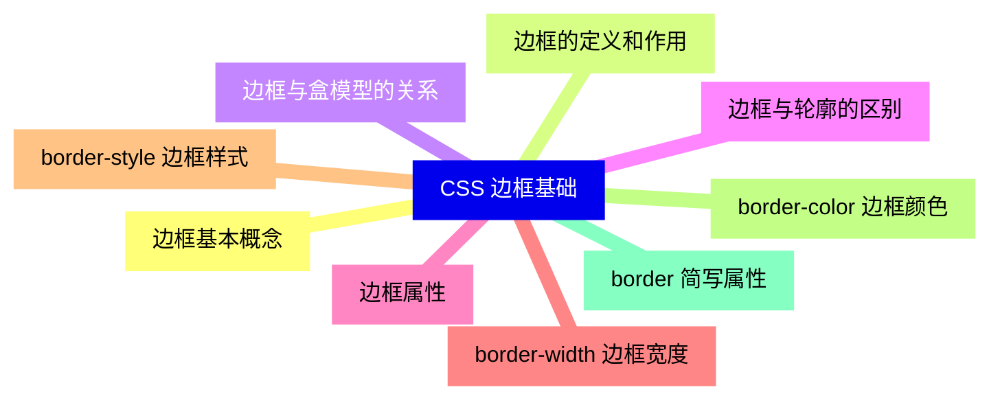

<--->
{}
{}
{}
{}
{}
{}
{}
{}
{}
{}
{}
{}
{}
{}
{}
{}
{}
{}
{}

### 2 边框样式详解{#2}

{}
{}
{}
{}
{}
{}
{}
{}
{}
{}
{}
{}
{}
{}
{}
{}
{}
{}
{}
{}
{}
{}
{}
{}
{}
{}
{}
{}
{}
{}
{}
{}
{}
{}
{}
<--->
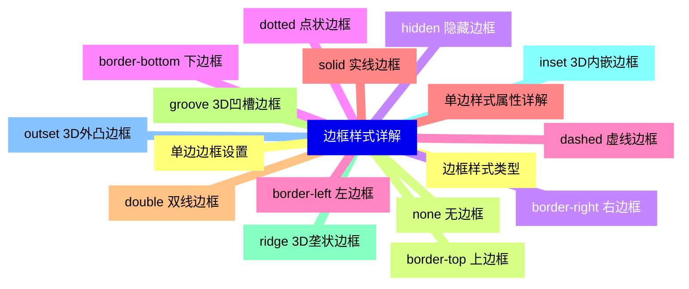

{}

### 3 边框颜色和宽度{#3}

{}
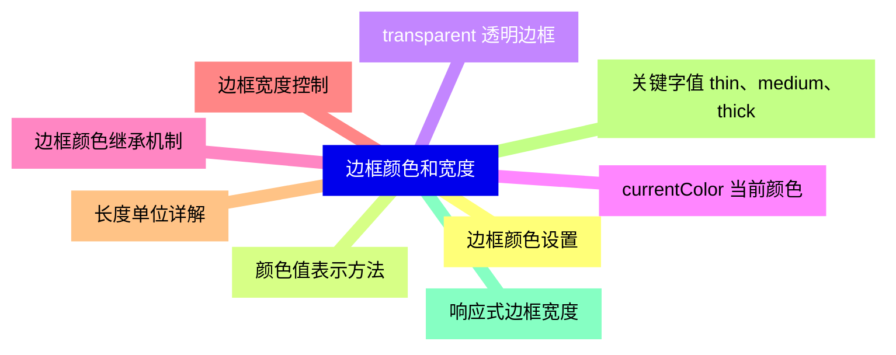

<--->
{}
{}
{}
{}
{}
{}
{}
{}
{}
{}
{}
{}
{}
{}
{}
{}
{}
{}
{}

### 4 边框圆角{#4}

{}
{}
{}
{}
{}
{}
{}
{}
{}
{}
{}
{}
{}
{}
{}
{}
{}
<--->
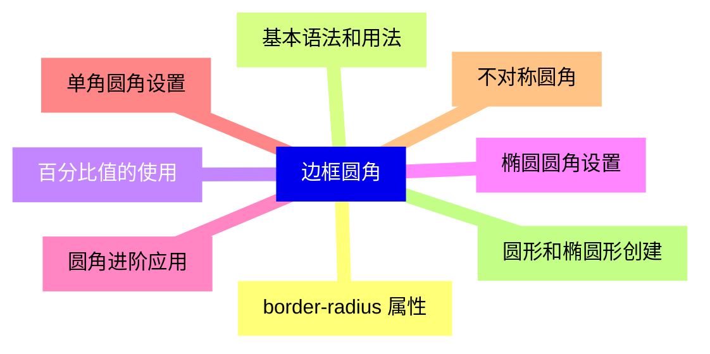

{}

### 5 边框图像{#5}

{}
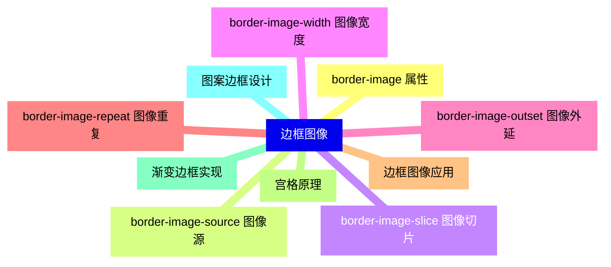

<--->
{}
{}
{}
{}
{}
{}
{}
{}
{}
{}
{}
{}
{}
{}
{}
{}
{}
{}
{}
{}
{}

### 6 CSS 轮廓{#6}

{}
{}
{}
{}
{}
{}
{}
{}
{}
{}
{}
{}
{}
{}
{}
{}
{}
{}
{}
<--->
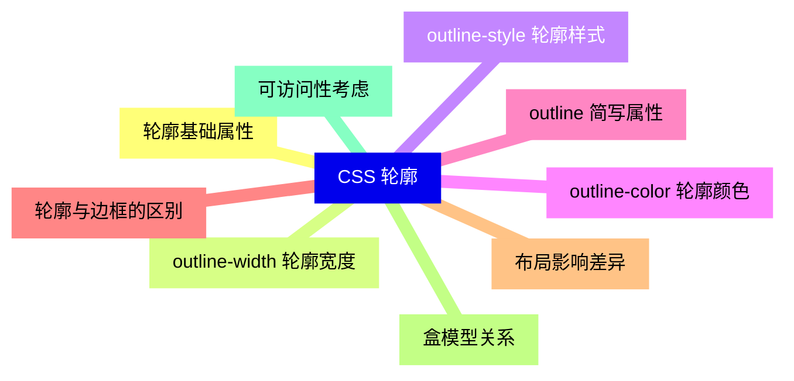

{}

### 7 轮廓样式和偏移{#7}

{}
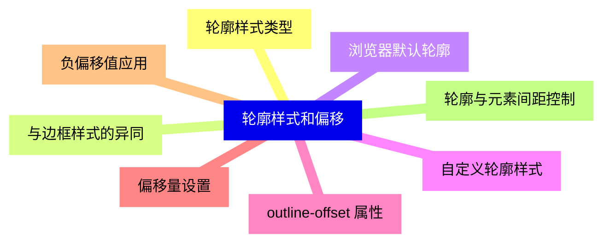

<--->
{}
{}
{}
{}
{}
{}
{}
{}
{}
{}
{}
{}
{}
{}
{}
{}
{}

### 8 高级边框技术{#8}

{}
{}
{}
{}
{}
{}
{}
{}
{}
{}
{}
{}
{}
{}
{}
{}
{}
<--->
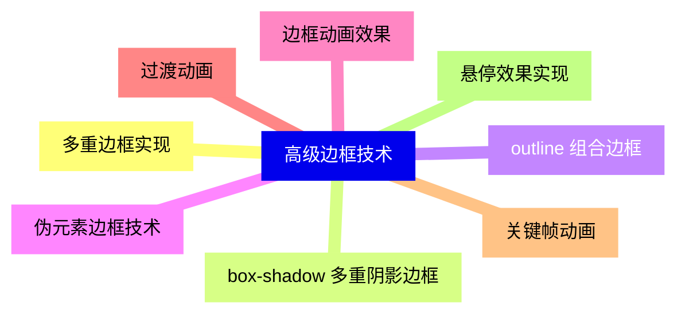

{}

### 9 响应式边框设计{#9}

{}
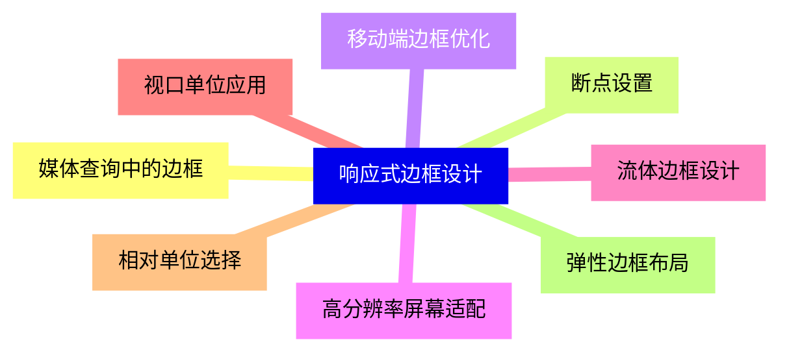

<--->
{}
{}
{}
{}
{}
{}
{}
{}
{}
{}
{}
{}
{}
{}
{}
{}
{}

### 10 边框性能优化{#10}

{}
{}
{}
{}
{}
{}
{}
{}
{}
{}
{}
{}
{}
{}
{}
{}
{}
<--->
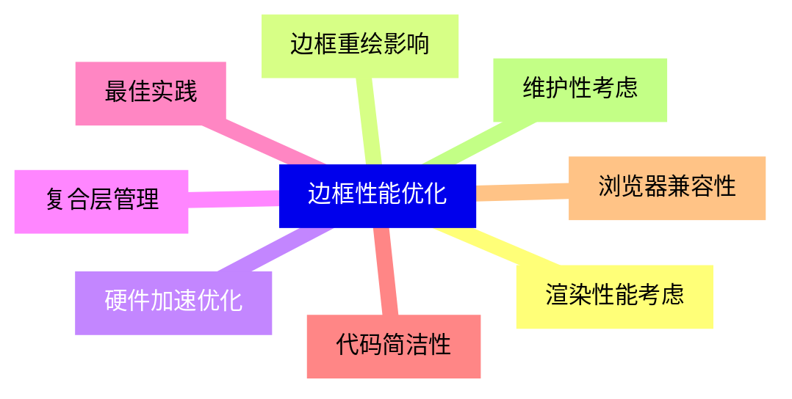

{}

### 11 实际应用案例{#11}

{}
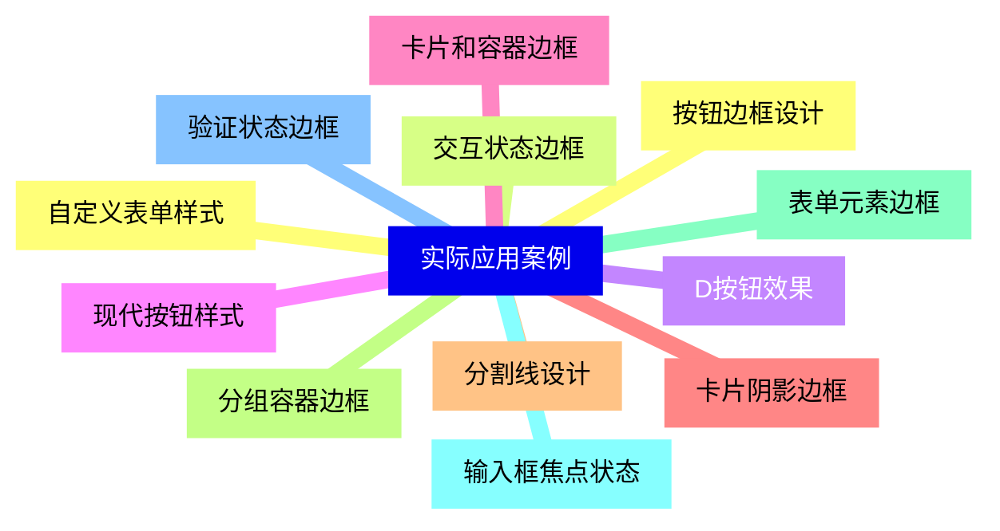

<--->
{}
{}
{}
{}
{}
{}
{}
{}
{}
{}
{}
{}
{}
{}
{}
{}
{}
{}
{}
{}
{}
{}
{}
{}
{}

### 12 浏览器兼容性{#12}

{}
{}
{}
{}
{}
{}
{}
{}
{}
{}
{}
{}
{}
{}
{}
{}
{}
<--->
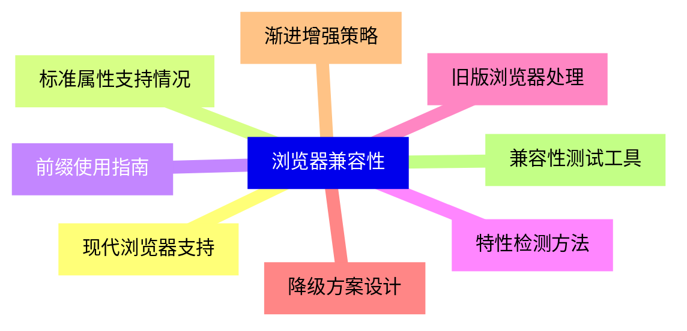

{}
