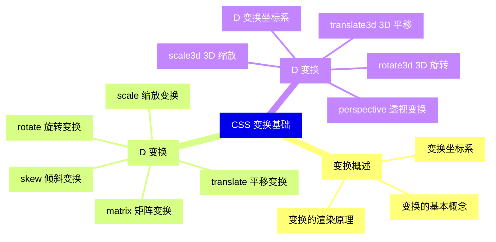
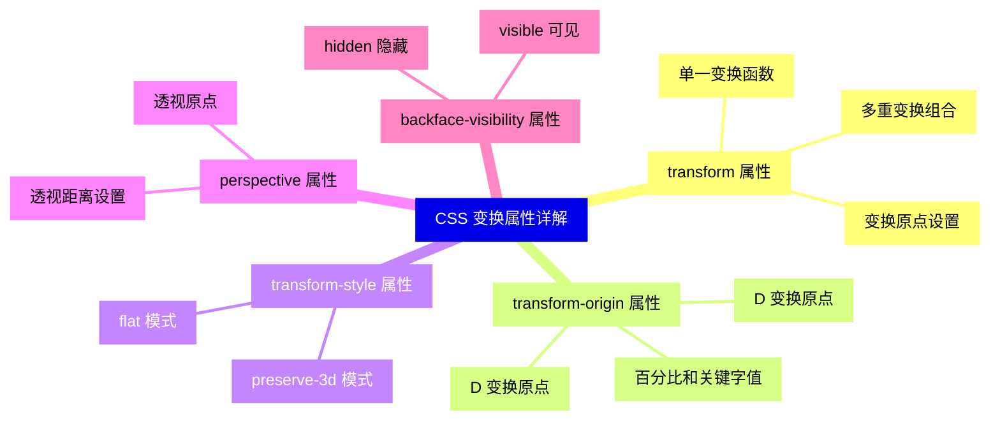
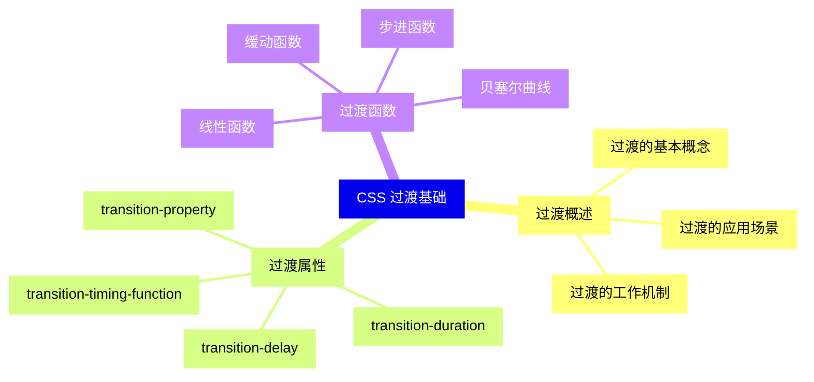
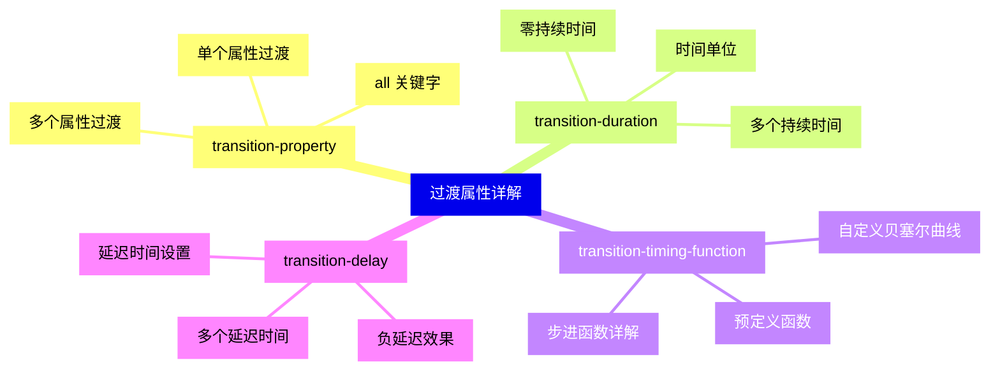
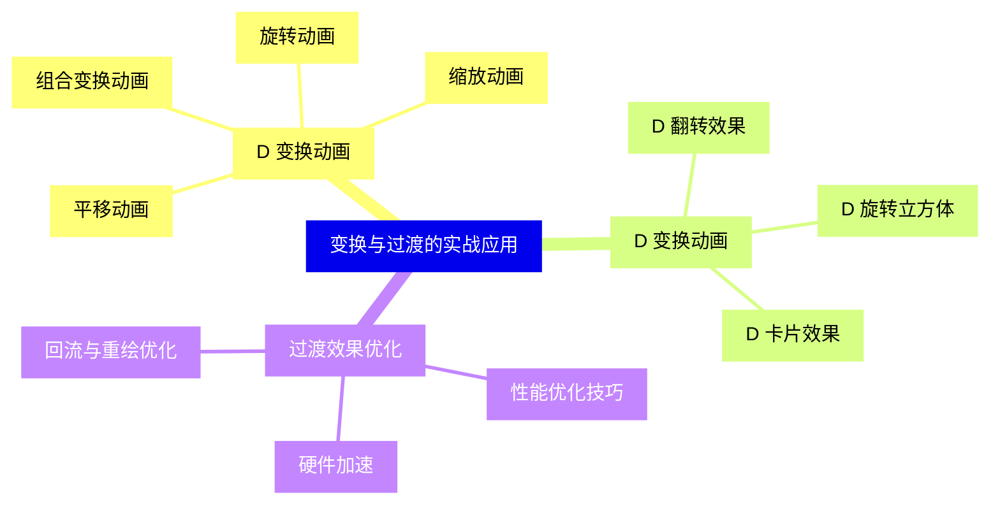
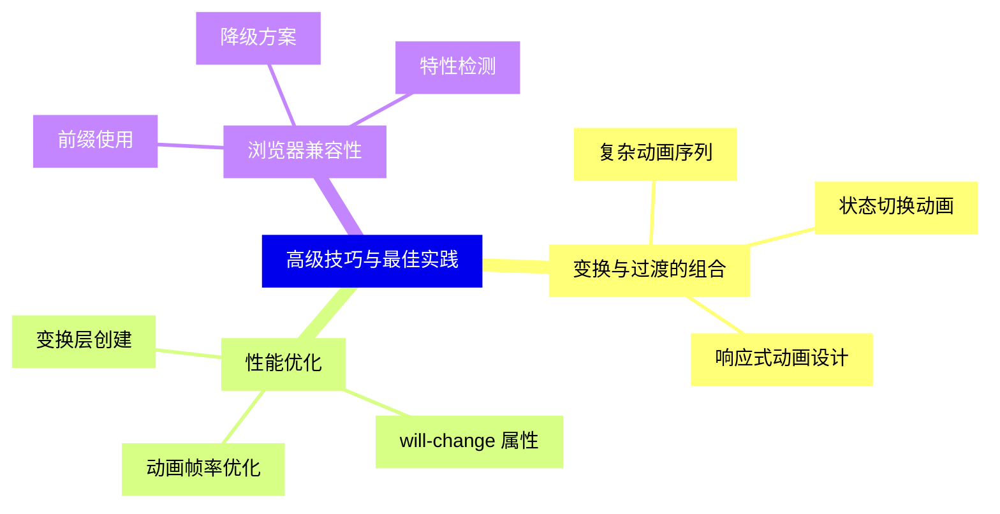
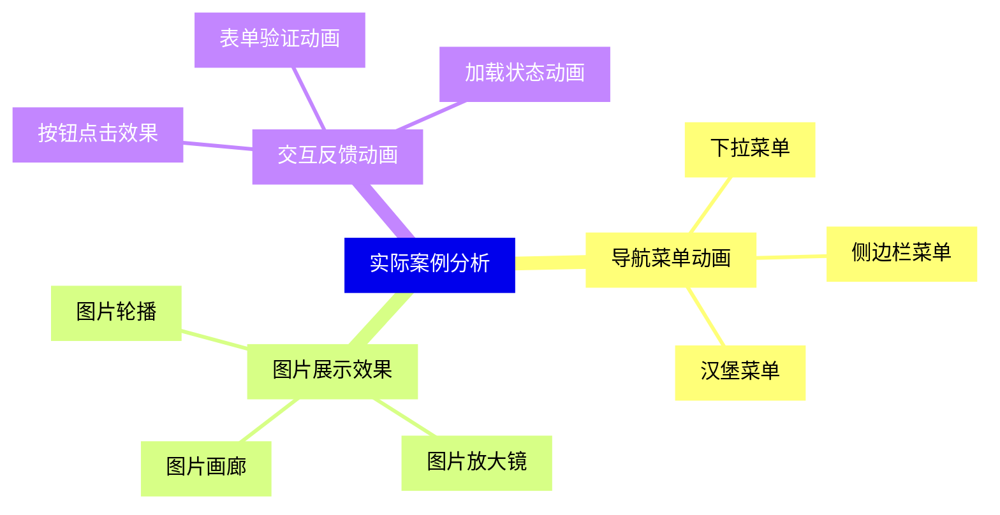
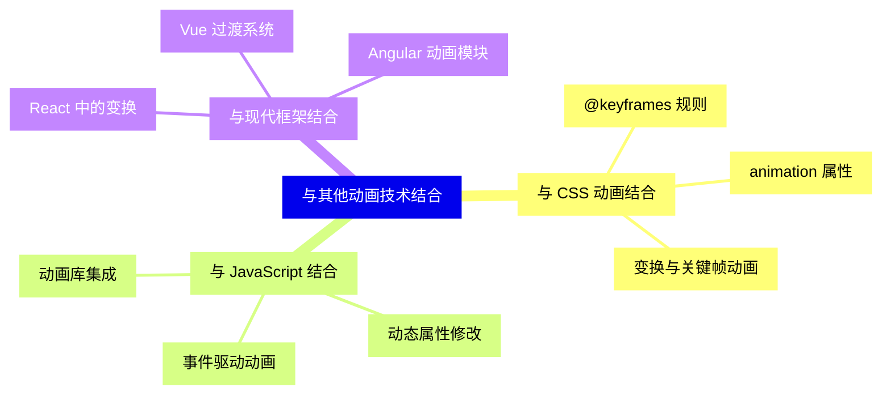


### 1 [CSS 变换基础](#1)
#### 1.1 [变换概述](#1)
##### 1.1.1 [变换的基本概念](#1)
##### 1.1.2 [变换坐标系](#1)
##### 1.1.3 [变换的渲染原理](#1)
#### 1.2 [D 变换](#1)
##### 1.2.1 [translate   平移变换](#1)
##### 1.2.2 [rotate   旋转变换](#1)
##### 1.2.3 [scale   缩放变换](#1)
##### 1.2.4 [skew   倾斜变换](#1)
##### 1.2.5 [matrix   矩阵变换](#1)
#### 1.3 [D 变换](#1)
##### 1.3.1 [D 变换坐标系](#1)
##### 1.3.2 [translate3d   3D 平移](#1)
##### 1.3.3 [rotate3d   3D 旋转](#1)
##### 1.3.4 [scale3d   3D 缩放](#1)
##### 1.3.5 [perspective   透视变换](#1)
### 2 [CSS 变换属性详解](#2)
#### 2.1 [transform 属性](#2)
##### 2.1.1 [单一变换函数](#2)
##### 2.1.2 [多重变换组合](#2)
##### 2.1.3 [变换原点设置](#2)
#### 2.2 [transform-origin 属性](#2)
##### 2.2.1 [D 变换原点](#2)
##### 2.2.2 [D 变换原点](#2)
##### 2.2.3 [百分比和关键字值](#2)
#### 2.3 [transform-style 属性](#2)
##### 2.3.1 [flat 模式](#2)
##### 2.3.2 [preserve-3d 模式](#2)
#### 2.4 [perspective 属性](#2)
##### 2.4.1 [透视距离设置](#2)
##### 2.4.2 [透视原点](#2)
#### 2.5 [backface-visibility 属性](#2)
##### 2.5.1 [visible 可见](#2)
##### 2.5.2 [hidden 隐藏](#2)
### 3 [CSS 过渡基础](#3)
#### 3.1 [过渡概述](#3)
##### 3.1.1 [过渡的基本概念](#3)
##### 3.1.2 [过渡的工作机制](#3)
##### 3.1.3 [过渡的应用场景](#3)
#### 3.2 [过渡属性](#3)
##### 3.2.1 [transition-property](#3)
##### 3.2.2 [transition-duration](#3)
##### 3.2.3 [transition-timing-function](#3)
##### 3.2.4 [transition-delay](#3)
#### 3.3 [过渡函数](#3)
##### 3.3.1 [线性函数](#3)
##### 3.3.2 [缓动函数](#3)
##### 3.3.3 [贝塞尔曲线](#3)
##### 3.3.4 [步进函数](#3)
### 4 [过渡属性详解](#4)
#### 4.1 [transition-property](#4)
##### 4.1.1 [单个属性过渡](#4)
##### 4.1.2 [多个属性过渡](#4)
##### 4.1.3 [all 关键字](#4)
#### 4.2 [transition-duration](#4)
##### 4.2.1 [时间单位](#4)
##### 4.2.2 [多个持续时间](#4)
##### 4.2.3 [零持续时间](#4)
#### 4.3 [transition-timing-function](#4)
##### 4.3.1 [预定义函数](#4)
##### 4.3.2 [自定义贝塞尔曲线](#4)
##### 4.3.3 [步进函数详解](#4)
#### 4.4 [transition-delay](#4)
##### 4.4.1 [延迟时间设置](#4)
##### 4.4.2 [负延迟效果](#4)
##### 4.4.3 [多个延迟时间](#4)
### 5 [变换与过渡的实战应用](#5)
#### 5.1 [D 变换动画](#5)
##### 5.1.1 [平移动画](#5)
##### 5.1.2 [旋转动画](#5)
##### 5.1.3 [缩放动画](#5)
##### 5.1.4 [组合变换动画](#5)
#### 5.2 [D 变换动画](#5)
##### 5.2.1 [D 翻转效果](#5)
##### 5.2.2 [D 旋转立方体](#5)
##### 5.2.3 [D 卡片效果](#5)
#### 5.3 [过渡效果优化](#5)
##### 5.3.1 [性能优化技巧](#5)
##### 5.3.2 [硬件加速](#5)
##### 5.3.3 [回流与重绘优化](#5)
### 6 [高级技巧与最佳实践](#6)
#### 6.1 [变换与过渡的组合](#6)
##### 6.1.1 [复杂动画序列](#6)
##### 6.1.2 [状态切换动画](#6)
##### 6.1.3 [响应式动画设计](#6)
#### 6.2 [性能优化](#6)
##### 6.2.1 [变换层创建](#6)
##### 6.2.2 [will-change 属性](#6)
##### 6.2.3 [动画帧率优化](#6)
#### 6.3 [浏览器兼容性](#6)
##### 6.3.1 [前缀使用](#6)
##### 6.3.2 [降级方案](#6)
##### 6.3.3 [特性检测](#6)
### 7 [实际案例分析](#7)
#### 7.1 [导航菜单动画](#7)
##### 7.1.1 [下拉菜单](#7)
##### 7.1.2 [侧边栏菜单](#7)
##### 7.1.3 [汉堡菜单](#7)
#### 7.2 [图片展示效果](#7)
##### 7.2.1 [图片轮播](#7)
##### 7.2.2 [图片放大镜](#7)
##### 7.2.3 [图片画廊](#7)
#### 7.3 [交互反馈动画](#7)
##### 7.3.1 [按钮点击效果](#7)
##### 7.3.2 [表单验证动画](#7)
##### 7.3.3 [加载状态动画](#7)
### 8 [与其他动画技术结合](#8)
#### 8.1 [与 CSS 动画结合](#8)
##### 8.1.1 [@keyframes 规则](#8)
##### 8.1.2 [animation 属性](#8)
##### 8.1.3 [变换与关键帧动画](#8)
#### 8.2 [与 JavaScript 结合](#8)
##### 8.2.1 [事件驱动动画](#8)
##### 8.2.2 [动态属性修改](#8)
##### 8.2.3 [动画库集成](#8)
#### 8.3 [与现代框架结合](#8)
##### 8.3.1 [React 中的变换](#8)
##### 8.3.2 [Vue 过渡系统](#8)
##### 8.3.3 [Angular 动画模块](#8)




### 1 CSS 变换基础

---
### 1 CSS 变换基础
___
#### 1.1 变换概述
___
##### 1.1.1 变换的基本概念
___
##### 1.1.2 变换坐标系
___
##### 1.1.3 变换的渲染原理
___
#### 1.2 D 变换
___
##### 1.2.1 translate   平移变换
___
##### 1.2.2 rotate   旋转变换
___
##### 1.2.3 scale   缩放变换
___
##### 1.2.4 skew   倾斜变换
___
##### 1.2.5 matrix   矩阵变换
___
#### 1.3 D 变换
___
##### 1.3.1 D 变换坐标系
___
##### 1.3.2 translate3d   3D 平移
___
##### 1.3.3 rotate3d   3D 旋转
___
##### 1.3.4 scale3d   3D 缩放
___
##### 1.3.5 perspective   透视变换
### 2 CSS 变换属性详解

---
### 2 CSS 变换属性详解
___
#### 2.1 transform 属性
___
##### 2.1.1 单一变换函数
___
##### 2.1.2 多重变换组合
___
##### 2.1.3 变换原点设置
___
#### 2.2 transform-origin 属性
___
##### 2.2.1 D 变换原点
___
##### 2.2.2 D 变换原点
___
##### 2.2.3 百分比和关键字值
___
#### 2.3 transform-style 属性
___
##### 2.3.1 flat 模式
___
##### 2.3.2 preserve-3d 模式
___
#### 2.4 perspective 属性
___
##### 2.4.1 透视距离设置
___
##### 2.4.2 透视原点
___
#### 2.5 backface-visibility 属性
___
##### 2.5.1 visible 可见
___
##### 2.5.2 hidden 隐藏
### 3 CSS 过渡基础

---
### 3 CSS 过渡基础
___
#### 3.1 过渡概述
___
##### 3.1.1 过渡的基本概念
___
##### 3.1.2 过渡的工作机制
___
##### 3.1.3 过渡的应用场景
___
#### 3.2 过渡属性
___
##### 3.2.1 transition-property
___
##### 3.2.2 transition-duration
___
##### 3.2.3 transition-timing-function
___
##### 3.2.4 transition-delay
___
#### 3.3 过渡函数
___
##### 3.3.1 线性函数
___
##### 3.3.2 缓动函数
___
##### 3.3.3 贝塞尔曲线
___
##### 3.3.4 步进函数
### 4 过渡属性详解

---
### 4 过渡属性详解
___
#### 4.1 transition-property
___
##### 4.1.1 单个属性过渡
___
##### 4.1.2 多个属性过渡
___
##### 4.1.3 all 关键字
___
#### 4.2 transition-duration
___
##### 4.2.1 时间单位
___
##### 4.2.2 多个持续时间
___
##### 4.2.3 零持续时间
___
#### 4.3 transition-timing-function
___
##### 4.3.1 预定义函数
___
##### 4.3.2 自定义贝塞尔曲线
___
##### 4.3.3 步进函数详解
___
#### 4.4 transition-delay
___
##### 4.4.1 延迟时间设置
___
##### 4.4.2 负延迟效果
___
##### 4.4.3 多个延迟时间
### 5 变换与过渡的实战应用

---
### 5 变换与过渡的实战应用
___
#### 5.1 D 变换动画
___
##### 5.1.1 平移动画
___
##### 5.1.2 旋转动画
___
##### 5.1.3 缩放动画
___
##### 5.1.4 组合变换动画
___
#### 5.2 D 变换动画
___
##### 5.2.1 D 翻转效果
___
##### 5.2.2 D 旋转立方体
___
##### 5.2.3 D 卡片效果
___
#### 5.3 过渡效果优化
___
##### 5.3.1 性能优化技巧
___
##### 5.3.2 硬件加速
___
##### 5.3.3 回流与重绘优化
### 6 高级技巧与最佳实践

---
### 6 高级技巧与最佳实践
___
#### 6.1 变换与过渡的组合
___
##### 6.1.1 复杂动画序列
___
##### 6.1.2 状态切换动画
___
##### 6.1.3 响应式动画设计
___
#### 6.2 性能优化
___
##### 6.2.1 变换层创建
___
##### 6.2.2 will-change 属性
___
##### 6.2.3 动画帧率优化
___
#### 6.3 浏览器兼容性
___
##### 6.3.1 前缀使用
___
##### 6.3.2 降级方案
___
##### 6.3.3 特性检测
### 7 实际案例分析

---
### 7 实际案例分析
___
#### 7.1 导航菜单动画
___
##### 7.1.1 下拉菜单
___
##### 7.1.2 侧边栏菜单
___
##### 7.1.3 汉堡菜单
___
#### 7.2 图片展示效果
___
##### 7.2.1 图片轮播
___
##### 7.2.2 图片放大镜
___
##### 7.2.3 图片画廊
___
#### 7.3 交互反馈动画
___
##### 7.3.1 按钮点击效果
___
##### 7.3.2 表单验证动画
___
##### 7.3.3 加载状态动画
### 8 与其他动画技术结合

---
### 8 与其他动画技术结合
___
#### 8.1 与 CSS 动画结合
___
##### 8.1.1 @keyframes 规则
___
##### 8.1.2 animation 属性
___
##### 8.1.3 变换与关键帧动画
___
#### 8.2 与 JavaScript 结合
___
##### 8.2.1 事件驱动动画
___
##### 8.2.2 动态属性修改
___
##### 8.2.3 动画库集成
___
#### 8.3 与现代框架结合
___
##### 8.3.1 React 中的变换
___
##### 8.3.2 Vue 过渡系统
___
##### 8.3.3 Angular 动画模块


### 1 CSS 变换基础{#1}

{}

<--->
{}
{}
{}
{}
{}
{}
{}
{}
{}
{}
{}
{}
{}
{}
{}
{}
{}
{}
{}
{}
{}
{}
{}
{}
{}
{}
{}
{}
{}
{}
{}
{}
{}

### 2 CSS 变换属性详解{#2}

{}
{}
{}
{}
{}
{}
{}
{}
{}
{}
{}
{}
{}
{}
{}
{}
{}
{}
{}
{}
{}
{}
{}
{}
{}
{}
{}
{}
{}
{}
{}
{}
{}
{}
{}
<--->

{}

### 3 CSS 过渡基础{#3}

{}

<--->
{}
{}
{}
{}
{}
{}
{}
{}
{}
{}
{}
{}
{}
{}
{}
{}
{}
{}
{}
{}
{}
{}
{}
{}
{}
{}
{}
{}
{}

### 4 过渡属性详解{#4}

{}
{}
{}
{}
{}
{}
{}
{}
{}
{}
{}
{}
{}
{}
{}
{}
{}
{}
{}
{}
{}
{}
{}
{}
{}
{}
{}
{}
{}
{}
{}
{}
{}
<--->

{}

### 5 变换与过渡的实战应用{#5}

{}

<--->
{}
{}
{}
{}
{}
{}
{}
{}
{}
{}
{}
{}
{}
{}
{}
{}
{}
{}
{}
{}
{}
{}
{}
{}
{}
{}
{}

### 6 高级技巧与最佳实践{#6}

{}
{}
{}
{}
{}
{}
{}
{}
{}
{}
{}
{}
{}
{}
{}
{}
{}
{}
{}
{}
{}
{}
{}
{}
{}
<--->

{}

### 7 实际案例分析{#7}

{}

<--->
{}
{}
{}
{}
{}
{}
{}
{}
{}
{}
{}
{}
{}
{}
{}
{}
{}
{}
{}
{}
{}
{}
{}
{}
{}

### 8 与其他动画技术结合{#8}

{}
{}
{}
{}
{}
{}
{}
{}
{}
{}
{}
{}
{}
{}
{}
{}
{}
{}
{}
{}
{}
{}
{}
{}
{}
<--->

{}
