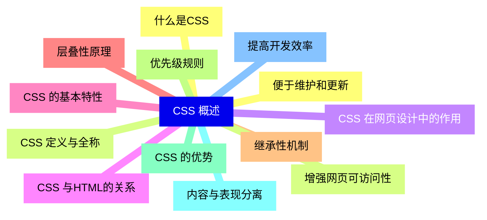
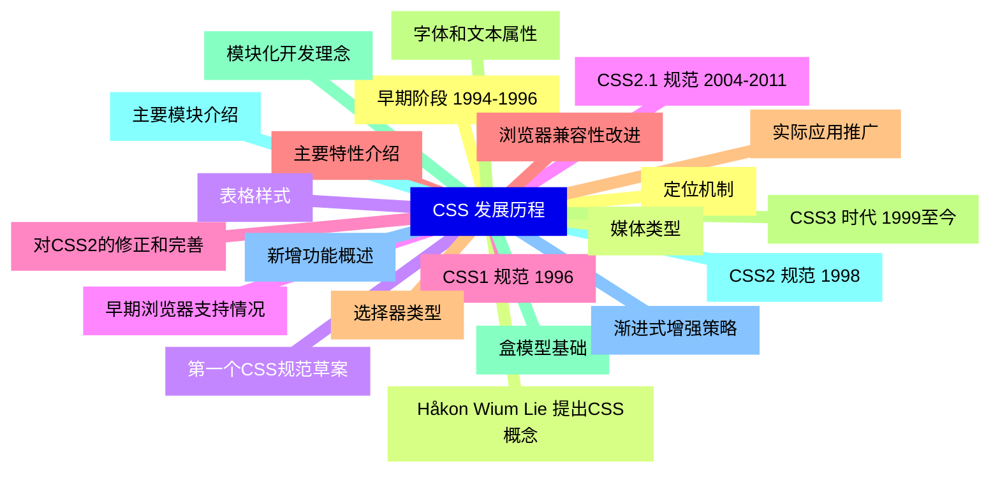
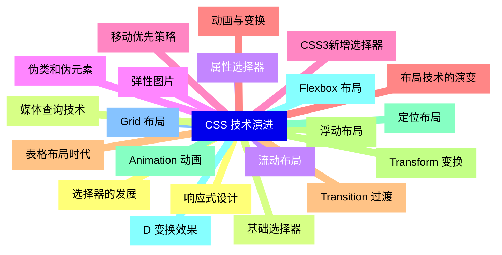
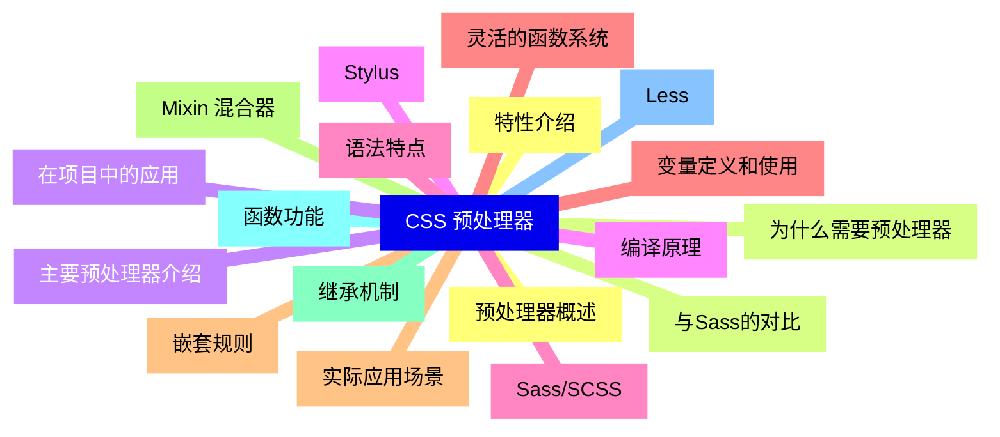
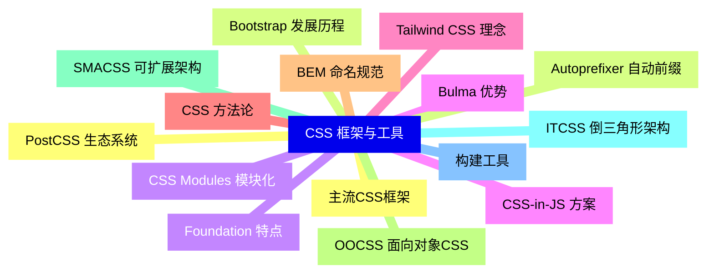
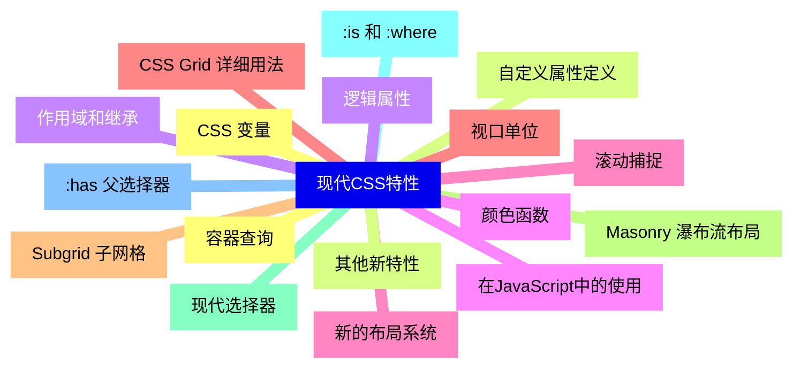
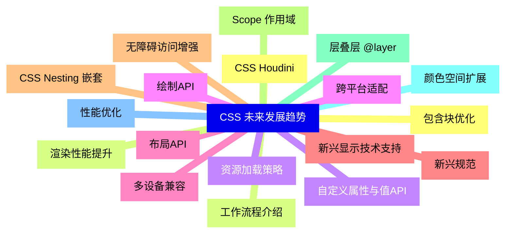


### 1 [CSS 概述](#1)
#### 1.1 [什么是CSS](#1)
#### 1.2 [CSS 定义与全称](#1)
#### 1.3 [CSS 在网页设计中的作用](#1)
#### 1.4 [CSS 与HTML的关系](#1)
#### 1.5 [CSS 的基本特性](#1)
#### 1.6 [层叠性原理](#1)
#### 1.7 [继承性机制](#1)
#### 1.8 [优先级规则](#1)
#### 1.9 [CSS 的优势](#1)
#### 1.10 [内容与表现分离](#1)
#### 1.11 [提高开发效率](#1)
#### 1.12 [便于维护和更新](#1)
#### 1.13 [增强网页可访问性](#1)
### 2 [CSS 发展历程](#2)
#### 2.1 [早期阶段 1994-1996](#2)
#### 2.2 [Håkon Wium Lie 提出CSS概念](#2)
#### 2.3 [第一个CSS规范草案](#2)
#### 2.4 [早期浏览器支持情况](#2)
#### 2.5 [CSS1 规范 1996](#2)
#### 2.6 [主要特性介绍](#2)
#### 2.7 [选择器类型](#2)
#### 2.8 [字体和文本属性](#2)
#### 2.9 [盒模型基础](#2)
#### 2.10 [CSS2 规范 1998](#2)
#### 2.11 [新增功能概述](#2)
#### 2.12 [定位机制](#2)
#### 2.13 [媒体类型](#2)
#### 2.14 [表格样式](#2)
#### 2.15 [CSS2.1 规范 2004-2011](#2)
#### 2.16 [对CSS2的修正和完善](#2)
#### 2.17 [浏览器兼容性改进](#2)
#### 2.18 [实际应用推广](#2)
#### 2.19 [CSS3 时代 1999至今](#2)
#### 2.20 [模块化开发理念](#2)
#### 2.21 [主要模块介绍](#2)
#### 2.22 [渐进式增强策略](#2)
### 3 [CSS 技术演进](#3)
#### 3.1 [选择器的发展](#3)
#### 3.2 [基础选择器](#3)
#### 3.3 [属性选择器](#3)
#### 3.4 [伪类和伪元素](#3)
#### 3.5 [CSS3新增选择器](#3)
#### 3.6 [布局技术的演变](#3)
#### 3.7 [表格布局时代](#3)
#### 3.8 [浮动布局](#3)
#### 3.9 [定位布局](#3)
#### 3.10 [Flexbox 布局](#3)
#### 3.11 [Grid 布局](#3)
#### 3.12 [响应式设计](#3)
#### 3.13 [媒体查询技术](#3)
#### 3.14 [流动布局](#3)
#### 3.15 [弹性图片](#3)
#### 3.16 [移动优先策略](#3)
#### 3.17 [动画与变换](#3)
#### 3.18 [Transition 过渡](#3)
#### 3.19 [Transform 变换](#3)
#### 3.20 [Animation 动画](#3)
#### 3.21 [D 变换效果](#3)
### 4 [CSS 预处理器](#4)
#### 4.1 [预处理器概述](#4)
#### 4.2 [为什么需要预处理器](#4)
#### 4.3 [主要预处理器介绍](#4)
#### 4.4 [编译原理](#4)
#### 4.5 [Sass/SCSS](#4)
#### 4.6 [变量定义和使用](#4)
#### 4.7 [嵌套规则](#4)
#### 4.8 [Mixin 混合器](#4)
#### 4.9 [继承机制](#4)
#### 4.10 [函数功能](#4)
#### 4.11 [Less](#4)
#### 4.12 [特性介绍](#4)
#### 4.13 [与Sass的对比](#4)
#### 4.14 [在项目中的应用](#4)
#### 4.15 [Stylus](#4)
#### 4.16 [语法特点](#4)
#### 4.17 [灵活的函数系统](#4)
#### 4.18 [实际应用场景](#4)
### 5 [CSS 框架与工具](#5)
#### 5.1 [主流CSS框架](#5)
#### 5.2 [Bootstrap 发展历程](#5)
#### 5.3 [Foundation 特点](#5)
#### 5.4 [Bulma 优势](#5)
#### 5.5 [Tailwind CSS 理念](#5)
#### 5.6 [CSS 方法论](#5)
#### 5.7 [BEM 命名规范](#5)
#### 5.8 [OOCSS 面向对象CSS](#5)
#### 5.9 [SMACSS 可扩展架构](#5)
#### 5.10 [ITCSS 倒三角形架构](#5)
#### 5.11 [构建工具](#5)
#### 5.12 [PostCSS 生态系统](#5)
#### 5.13 [Autoprefixer 自动前缀](#5)
#### 5.14 [CSS Modules 模块化](#5)
#### 5.15 [CSS-in-JS 方案](#5)
### 6 [现代CSS特性](#6)
#### 6.1 [CSS 变量](#6)
#### 6.2 [自定义属性定义](#6)
#### 6.3 [作用域和继承](#6)
#### 6.4 [在JavaScript中的使用](#6)
#### 6.5 [新的布局系统](#6)
#### 6.6 [CSS Grid 详细用法](#6)
#### 6.7 [Subgrid 子网格](#6)
#### 6.8 [Masonry 瀑布流布局](#6)
#### 6.9 [现代选择器](#6)
#### 6.10 [:is   和 :where](#6)
#### 6.11 [:has   父选择器](#6)
#### 6.12 [容器查询](#6)
#### 6.13 [其他新特性](#6)
#### 6.14 [逻辑属性](#6)
#### 6.15 [颜色函数](#6)
#### 6.16 [滚动捕捉](#6)
#### 6.17 [视口单位](#6)
### 7 [CSS 未来发展趋势](#7)
#### 7.1 [CSS Houdini](#7)
#### 7.2 [工作流程介绍](#7)
#### 7.3 [自定义属性与值API](#7)
#### 7.4 [绘制API](#7)
#### 7.5 [布局API](#7)
#### 7.6 [新兴规范](#7)
#### 7.7 [CSS Nesting 嵌套](#7)
#### 7.8 [Scope 作用域](#7)
#### 7.9 [层叠层 @layer](#7)
#### 7.10 [颜色空间扩展](#7)
#### 7.11 [性能优化](#7)
#### 7.12 [包含块优化](#7)
#### 7.13 [渲染性能提升](#7)
#### 7.14 [资源加载策略](#7)
#### 7.15 [跨平台适配](#7)
#### 7.16 [多设备兼容](#7)
#### 7.17 [新兴显示技术支持](#7)
#### 7.18 [无障碍访问增强](#7)




### 1 CSS 概述

---
### 1 CSS 概述
___
#### 1.1 什么是CSS
___
#### 1.2 CSS 定义与全称
___
#### 1.3 CSS 在网页设计中的作用
___
#### 1.4 CSS 与HTML的关系
___
#### 1.5 CSS 的基本特性
___
#### 1.6 层叠性原理
___
#### 1.7 继承性机制
___
#### 1.8 优先级规则
___
#### 1.9 CSS 的优势
___
#### 1.10 内容与表现分离
___
#### 1.11 提高开发效率
___
#### 1.12 便于维护和更新
___
#### 1.13 增强网页可访问性
### 2 CSS 发展历程

---
### 2 CSS 发展历程
___
#### 2.1 早期阶段 1994-1996
___
#### 2.2 Håkon Wium Lie 提出CSS概念
___
#### 2.3 第一个CSS规范草案
___
#### 2.4 早期浏览器支持情况
___
#### 2.5 CSS1 规范 1996
___
#### 2.6 主要特性介绍
___
#### 2.7 选择器类型
___
#### 2.8 字体和文本属性
___
#### 2.9 盒模型基础
___
#### 2.10 CSS2 规范 1998
___
#### 2.11 新增功能概述
___
#### 2.12 定位机制
___
#### 2.13 媒体类型
___
#### 2.14 表格样式
___
#### 2.15 CSS2.1 规范 2004-2011
___
#### 2.16 对CSS2的修正和完善
___
#### 2.17 浏览器兼容性改进
___
#### 2.18 实际应用推广
___
#### 2.19 CSS3 时代 1999至今
___
#### 2.20 模块化开发理念
___
#### 2.21 主要模块介绍
___
#### 2.22 渐进式增强策略
### 3 CSS 技术演进

---
### 3 CSS 技术演进
___
#### 3.1 选择器的发展
___
#### 3.2 基础选择器
___
#### 3.3 属性选择器
___
#### 3.4 伪类和伪元素
___
#### 3.5 CSS3新增选择器
___
#### 3.6 布局技术的演变
___
#### 3.7 表格布局时代
___
#### 3.8 浮动布局
___
#### 3.9 定位布局
___
#### 3.10 Flexbox 布局
___
#### 3.11 Grid 布局
___
#### 3.12 响应式设计
___
#### 3.13 媒体查询技术
___
#### 3.14 流动布局
___
#### 3.15 弹性图片
___
#### 3.16 移动优先策略
___
#### 3.17 动画与变换
___
#### 3.18 Transition 过渡
___
#### 3.19 Transform 变换
___
#### 3.20 Animation 动画
___
#### 3.21 D 变换效果
### 4 CSS 预处理器

---
### 4 CSS 预处理器
___
#### 4.1 预处理器概述
___
#### 4.2 为什么需要预处理器
___
#### 4.3 主要预处理器介绍
___
#### 4.4 编译原理
___
#### 4.5 Sass/SCSS
___
#### 4.6 变量定义和使用
___
#### 4.7 嵌套规则
___
#### 4.8 Mixin 混合器
___
#### 4.9 继承机制
___
#### 4.10 函数功能
___
#### 4.11 Less
___
#### 4.12 特性介绍
___
#### 4.13 与Sass的对比
___
#### 4.14 在项目中的应用
___
#### 4.15 Stylus
___
#### 4.16 语法特点
___
#### 4.17 灵活的函数系统
___
#### 4.18 实际应用场景
### 5 CSS 框架与工具

---
### 5 CSS 框架与工具
___
#### 5.1 主流CSS框架
___
#### 5.2 Bootstrap 发展历程
___
#### 5.3 Foundation 特点
___
#### 5.4 Bulma 优势
___
#### 5.5 Tailwind CSS 理念
___
#### 5.6 CSS 方法论
___
#### 5.7 BEM 命名规范
___
#### 5.8 OOCSS 面向对象CSS
___
#### 5.9 SMACSS 可扩展架构
___
#### 5.10 ITCSS 倒三角形架构
___
#### 5.11 构建工具
___
#### 5.12 PostCSS 生态系统
___
#### 5.13 Autoprefixer 自动前缀
___
#### 5.14 CSS Modules 模块化
___
#### 5.15 CSS-in-JS 方案
### 6 现代CSS特性

---
### 6 现代CSS特性
___
#### 6.1 CSS 变量
___
#### 6.2 自定义属性定义
___
#### 6.3 作用域和继承
___
#### 6.4 在JavaScript中的使用
___
#### 6.5 新的布局系统
___
#### 6.6 CSS Grid 详细用法
___
#### 6.7 Subgrid 子网格
___
#### 6.8 Masonry 瀑布流布局
___
#### 6.9 现代选择器
___
#### 6.10 :is   和 :where
___
#### 6.11 :has   父选择器
___
#### 6.12 容器查询
___
#### 6.13 其他新特性
___
#### 6.14 逻辑属性
___
#### 6.15 颜色函数
___
#### 6.16 滚动捕捉
___
#### 6.17 视口单位
### 7 CSS 未来发展趋势

---
### 7 CSS 未来发展趋势
___
#### 7.1 CSS Houdini
___
#### 7.2 工作流程介绍
___
#### 7.3 自定义属性与值API
___
#### 7.4 绘制API
___
#### 7.5 布局API
___
#### 7.6 新兴规范
___
#### 7.7 CSS Nesting 嵌套
___
#### 7.8 Scope 作用域
___
#### 7.9 层叠层 @layer
___
#### 7.10 颜色空间扩展
___
#### 7.11 性能优化
___
#### 7.12 包含块优化
___
#### 7.13 渲染性能提升
___
#### 7.14 资源加载策略
___
#### 7.15 跨平台适配
___
#### 7.16 多设备兼容
___
#### 7.17 新兴显示技术支持
___
#### 7.18 无障碍访问增强


### 1 CSS 概述{#1}

{}

<--->
{}
{}
{}
{}
{}
{}
{}
{}
{}
{}
{}
{}
{}
{}
{}
{}
{}
{}
{}
{}
{}
{}
{}
{}
{}
{}
{}

### 2 CSS 发展历程{#2}

{}
{}
{}
{}
{}
{}
{}
{}
{}
{}
{}
{}
{}
{}
{}
{}
{}
{}
{}
{}
{}
{}
{}
{}
{}
{}
{}
{}
{}
{}
{}
{}
{}
{}
{}
{}
{}
{}
{}
{}
{}
{}
{}
{}
{}
<--->

{}

### 3 CSS 技术演进{#3}

{}

<--->
{}
{}
{}
{}
{}
{}
{}
{}
{}
{}
{}
{}
{}
{}
{}
{}
{}
{}
{}
{}
{}
{}
{}
{}
{}
{}
{}
{}
{}
{}
{}
{}
{}
{}
{}
{}
{}
{}
{}
{}
{}
{}
{}

### 4 CSS 预处理器{#4}

{}
{}
{}
{}
{}
{}
{}
{}
{}
{}
{}
{}
{}
{}
{}
{}
{}
{}
{}
{}
{}
{}
{}
{}
{}
{}
{}
{}
{}
{}
{}
{}
{}
{}
{}
{}
{}
<--->

{}

### 5 CSS 框架与工具{#5}

{}

<--->
{}
{}
{}
{}
{}
{}
{}
{}
{}
{}
{}
{}
{}
{}
{}
{}
{}
{}
{}
{}
{}
{}
{}
{}
{}
{}
{}
{}
{}
{}
{}

### 6 现代CSS特性{#6}

{}
{}
{}
{}
{}
{}
{}
{}
{}
{}
{}
{}
{}
{}
{}
{}
{}
{}
{}
{}
{}
{}
{}
{}
{}
{}
{}
{}
{}
{}
{}
{}
{}
{}
{}
<--->

{}

### 7 CSS 未来发展趋势{#7}

{}

<--->
{}
{}
{}
{}
{}
{}
{}
{}
{}
{}
{}
{}
{}
{}
{}
{}
{}
{}
{}
{}
{}
{}
{}
{}
{}
{}
{}
{}
{}
{}
{}
{}
{}
{}
{}
{}
{}
