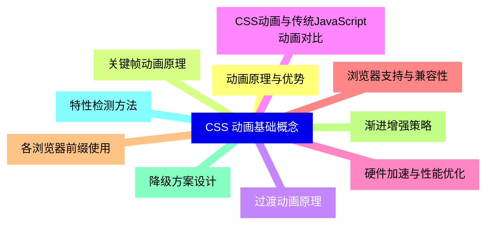
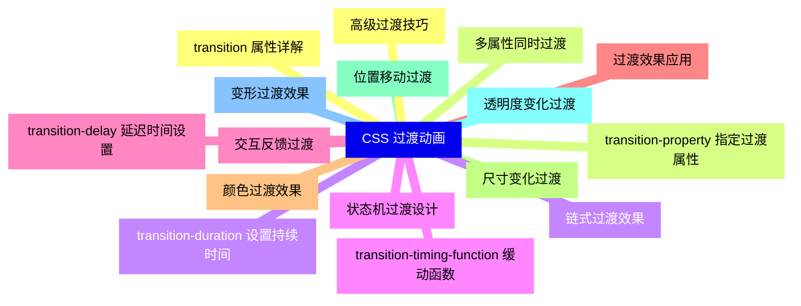
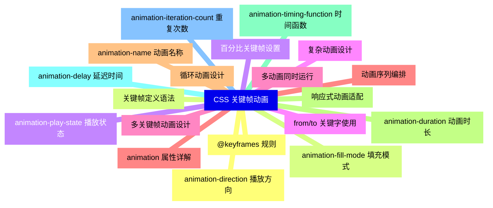
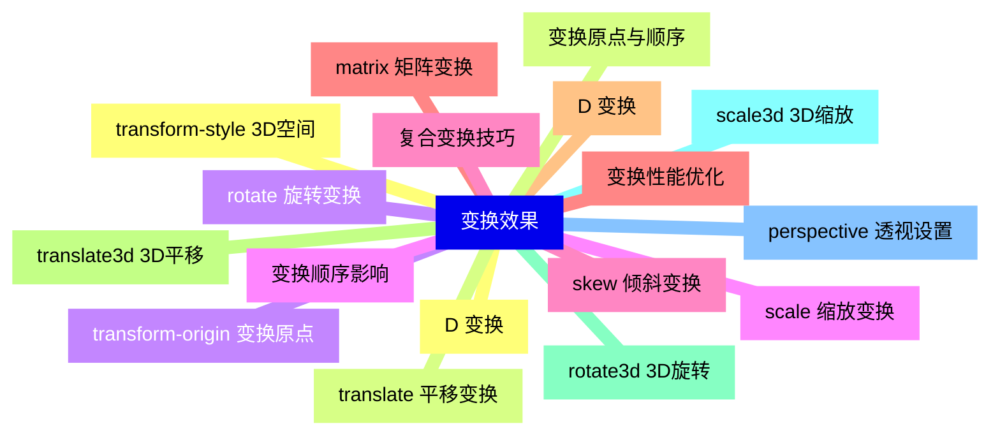
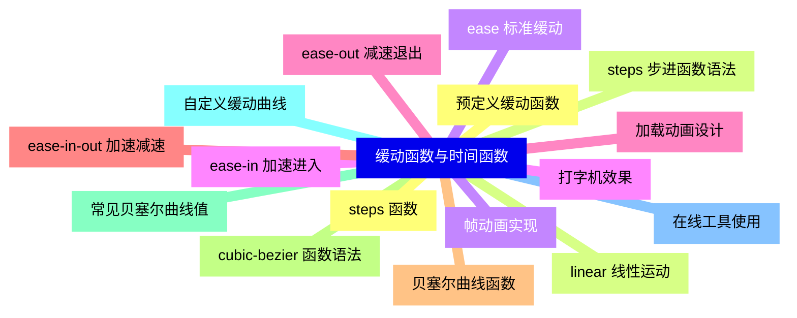
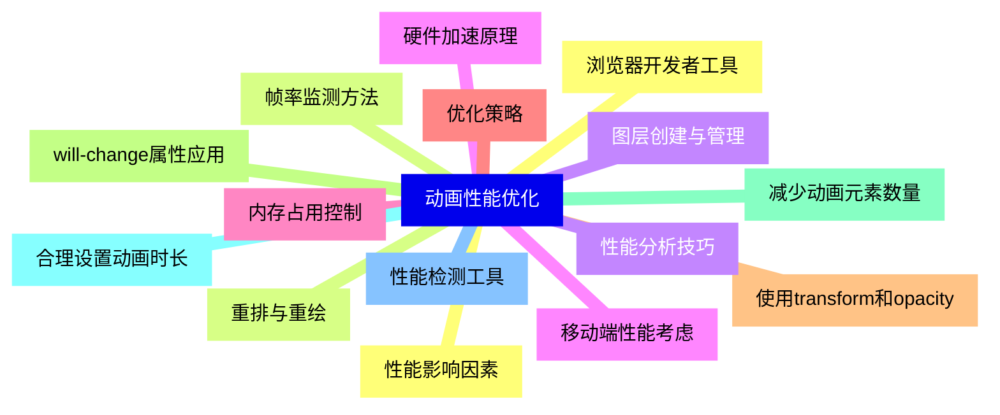
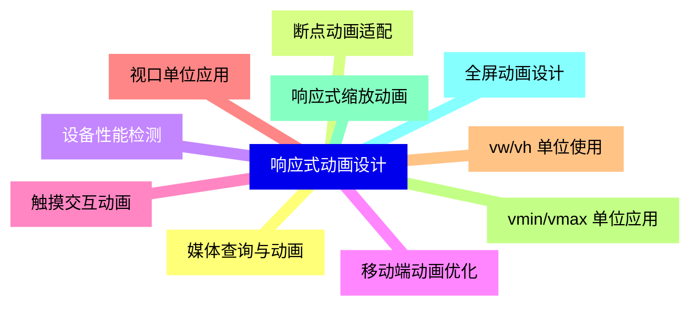
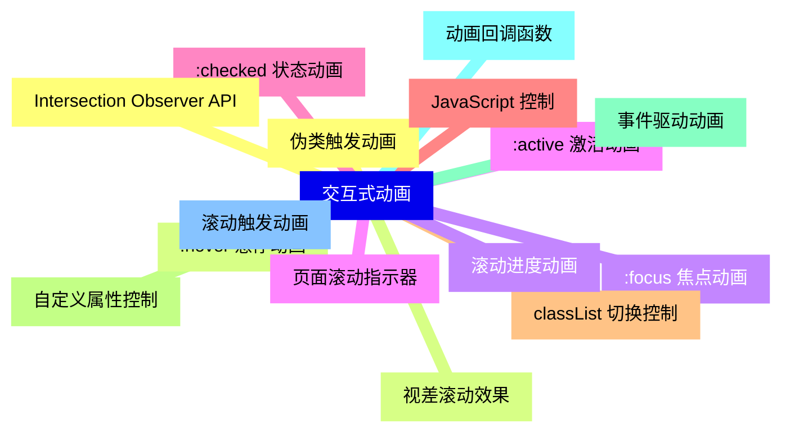
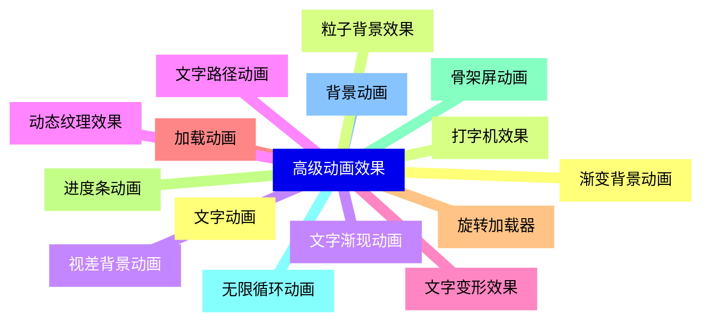
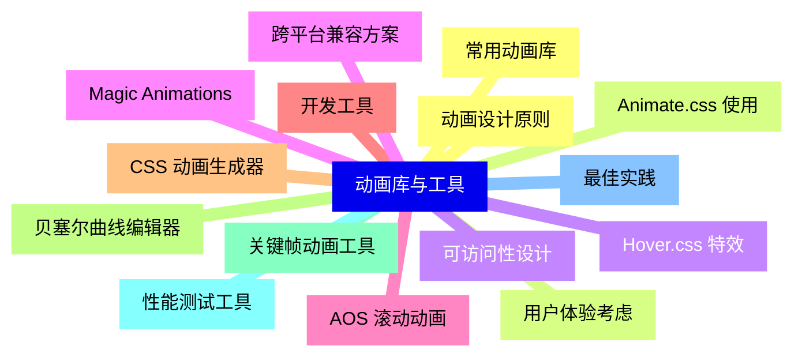


### 1 [CSS 动画基础概念](#1)
#### 1.1 [动画原理与优势](#1)
#### 1.2 [关键帧动画原理](#1)
#### 1.3 [过渡动画原理](#1)
#### 1.4 [CSS动画与传统JavaScript动画对比](#1)
#### 1.5 [硬件加速与性能优化](#1)
#### 1.6 [浏览器支持与兼容性](#1)
#### 1.7 [各浏览器前缀使用](#1)
#### 1.8 [渐进增强策略](#1)
#### 1.9 [降级方案设计](#1)
#### 1.10 [特性检测方法](#1)
### 2 [CSS 过渡动画](#2)
#### 2.1 [transition 属性详解](#2)
#### 2.2 [transition-property 指定过渡属性](#2)
#### 2.3 [transition-duration 设置持续时间](#2)
#### 2.4 [transition-timing-function 缓动函数](#2)
#### 2.5 [transition-delay 延迟时间设置](#2)
#### 2.6 [过渡效果应用](#2)
#### 2.7 [颜色过渡效果](#2)
#### 2.8 [尺寸变化过渡](#2)
#### 2.9 [位置移动过渡](#2)
#### 2.10 [透明度变化过渡](#2)
#### 2.11 [变形过渡效果](#2)
#### 2.12 [高级过渡技巧](#2)
#### 2.13 [多属性同时过渡](#2)
#### 2.14 [链式过渡效果](#2)
#### 2.15 [状态机过渡设计](#2)
#### 2.16 [交互反馈过渡](#2)
### 3 [CSS 关键帧动画](#3)
#### 3.1 [@keyframes 规则](#3)
#### 3.2 [关键帧定义语法](#3)
#### 3.3 [百分比关键帧设置](#3)
#### 3.4 [from/to 关键字使用](#3)
#### 3.5 [多关键帧动画设计](#3)
#### 3.6 [animation 属性详解](#3)
#### 3.7 [animation-name 动画名称](#3)
#### 3.8 [animation-duration 动画时长](#3)
#### 3.9 [animation-timing-function 时间函数](#3)
#### 3.10 [animation-delay 延迟时间](#3)
#### 3.11 [animation-iteration-count 重复次数](#3)
#### 3.12 [animation-direction 播放方向](#3)
#### 3.13 [animation-fill-mode 填充模式](#3)
#### 3.14 [animation-play-state 播放状态](#3)
#### 3.15 [复杂动画设计](#3)
#### 3.16 [多动画同时运行](#3)
#### 3.17 [动画序列编排](#3)
#### 3.18 [循环动画设计](#3)
#### 3.19 [响应式动画适配](#3)
### 4 [变换效果](#4)
#### 4.1 [D 变换](#4)
#### 4.2 [translate   平移变换](#4)
#### 4.3 [rotate   旋转变换](#4)
#### 4.4 [scale   缩放变换](#4)
#### 4.5 [skew   倾斜变换](#4)
#### 4.6 [matrix   矩阵变换](#4)
#### 4.7 [D 变换](#4)
#### 4.8 [translate3d   3D平移](#4)
#### 4.9 [rotate3d   3D旋转](#4)
#### 4.10 [scale3d   3D缩放](#4)
#### 4.11 [perspective 透视设置](#4)
#### 4.12 [transform-style 3D空间](#4)
#### 4.13 [变换原点与顺序](#4)
#### 4.14 [transform-origin 变换原点](#4)
#### 4.15 [变换顺序影响](#4)
#### 4.16 [复合变换技巧](#4)
#### 4.17 [变换性能优化](#4)
### 5 [缓动函数与时间函数](#5)
#### 5.1 [预定义缓动函数](#5)
#### 5.2 [linear 线性运动](#5)
#### 5.3 [ease 标准缓动](#5)
#### 5.4 [ease-in 加速进入](#5)
#### 5.5 [ease-out 减速退出](#5)
#### 5.6 [ease-in-out 加速减速](#5)
#### 5.7 [贝塞尔曲线函数](#5)
#### 5.8 [cubic-bezier   函数语法](#5)
#### 5.9 [常见贝塞尔曲线值](#5)
#### 5.10 [自定义缓动曲线](#5)
#### 5.11 [在线工具使用](#5)
#### 5.12 [steps   函数](#5)
#### 5.13 [steps   步进函数语法](#5)
#### 5.14 [帧动画实现](#5)
#### 5.15 [打字机效果](#5)
#### 5.16 [加载动画设计](#5)
### 6 [动画性能优化](#6)
#### 6.1 [性能影响因素](#6)
#### 6.2 [重排与重绘](#6)
#### 6.3 [图层创建与管理](#6)
#### 6.4 [硬件加速原理](#6)
#### 6.5 [内存占用控制](#6)
#### 6.6 [优化策略](#6)
#### 6.7 [使用transform和opacity](#6)
#### 6.8 [will-change属性应用](#6)
#### 6.9 [减少动画元素数量](#6)
#### 6.10 [合理设置动画时长](#6)
#### 6.11 [性能检测工具](#6)
#### 6.12 [浏览器开发者工具](#6)
#### 6.13 [帧率监测方法](#6)
#### 6.14 [性能分析技巧](#6)
#### 6.15 [移动端性能考虑](#6)
### 7 [响应式动画设计](#7)
#### 7.1 [媒体查询与动画](#7)
#### 7.2 [断点动画适配](#7)
#### 7.3 [设备性能检测](#7)
#### 7.4 [移动端动画优化](#7)
#### 7.5 [触摸交互动画](#7)
#### 7.6 [视口单位应用](#7)
#### 7.7 [vw/vh 单位使用](#7)
#### 7.8 [vmin/vmax 单位应用](#7)
#### 7.9 [响应式缩放动画](#7)
#### 7.10 [全屏动画设计](#7)
### 8 [交互式动画](#8)
#### 8.1 [伪类触发动画](#8)
#### 8.2 [:hover 悬停动画](#8)
#### 8.3 [:focus 焦点动画](#8)
#### 8.4 [:active 激活动画](#8)
#### 8.5 [:checked 状态动画](#8)
#### 8.6 [JavaScript 控制](#8)
#### 8.7 [classList 切换控制](#8)
#### 8.8 [自定义属性控制](#8)
#### 8.9 [事件驱动动画](#8)
#### 8.10 [动画回调函数](#8)
#### 8.11 [滚动触发动画](#8)
#### 8.12 [Intersection Observer API](#8)
#### 8.13 [视差滚动效果](#8)
#### 8.14 [滚动进度动画](#8)
#### 8.15 [页面滚动指示器](#8)
### 9 [高级动画效果](#9)
#### 9.1 [文字动画](#9)
#### 9.2 [打字机效果](#9)
#### 9.3 [文字渐现动画](#9)
#### 9.4 [文字路径动画](#9)
#### 9.5 [文字变形效果](#9)
#### 9.6 [加载动画](#9)
#### 9.7 [旋转加载器](#9)
#### 9.8 [进度条动画](#9)
#### 9.9 [骨架屏动画](#9)
#### 9.10 [无限循环动画](#9)
#### 9.11 [背景动画](#9)
#### 9.12 [渐变背景动画](#9)
#### 9.13 [粒子背景效果](#9)
#### 9.14 [视差背景动画](#9)
#### 9.15 [动态纹理效果](#9)
### 10 [动画库与工具](#10)
#### 10.1 [常用动画库](#10)
#### 10.2 [Animate.css 使用](#10)
#### 10.3 [Hover.css 特效](#10)
#### 10.4 [Magic Animations](#10)
#### 10.5 [AOS 滚动动画](#10)
#### 10.6 [开发工具](#10)
#### 10.7 [CSS 动画生成器](#10)
#### 10.8 [贝塞尔曲线编辑器](#10)
#### 10.9 [关键帧动画工具](#10)
#### 10.10 [性能测试工具](#10)
#### 10.11 [最佳实践](#10)
#### 10.12 [动画设计原则](#10)
#### 10.13 [用户体验考虑](#10)
#### 10.14 [可访问性设计](#10)
#### 10.15 [跨平台兼容方案](#10)




### 1 CSS 动画基础概念

---
### 1 CSS 动画基础概念
___
#### 1.1 动画原理与优势
___
#### 1.2 关键帧动画原理
___
#### 1.3 过渡动画原理
___
#### 1.4 CSS动画与传统JavaScript动画对比
___
#### 1.5 硬件加速与性能优化
___
#### 1.6 浏览器支持与兼容性
___
#### 1.7 各浏览器前缀使用
___
#### 1.8 渐进增强策略
___
#### 1.9 降级方案设计
___
#### 1.10 特性检测方法
### 2 CSS 过渡动画

---
### 2 CSS 过渡动画
___
#### 2.1 transition 属性详解
___
#### 2.2 transition-property 指定过渡属性
___
#### 2.3 transition-duration 设置持续时间
___
#### 2.4 transition-timing-function 缓动函数
___
#### 2.5 transition-delay 延迟时间设置
___
#### 2.6 过渡效果应用
___
#### 2.7 颜色过渡效果
___
#### 2.8 尺寸变化过渡
___
#### 2.9 位置移动过渡
___
#### 2.10 透明度变化过渡
___
#### 2.11 变形过渡效果
___
#### 2.12 高级过渡技巧
___
#### 2.13 多属性同时过渡
___
#### 2.14 链式过渡效果
___
#### 2.15 状态机过渡设计
___
#### 2.16 交互反馈过渡
### 3 CSS 关键帧动画

---
### 3 CSS 关键帧动画
___
#### 3.1 @keyframes 规则
___
#### 3.2 关键帧定义语法
___
#### 3.3 百分比关键帧设置
___
#### 3.4 from/to 关键字使用
___
#### 3.5 多关键帧动画设计
___
#### 3.6 animation 属性详解
___
#### 3.7 animation-name 动画名称
___
#### 3.8 animation-duration 动画时长
___
#### 3.9 animation-timing-function 时间函数
___
#### 3.10 animation-delay 延迟时间
___
#### 3.11 animation-iteration-count 重复次数
___
#### 3.12 animation-direction 播放方向
___
#### 3.13 animation-fill-mode 填充模式
___
#### 3.14 animation-play-state 播放状态
___
#### 3.15 复杂动画设计
___
#### 3.16 多动画同时运行
___
#### 3.17 动画序列编排
___
#### 3.18 循环动画设计
___
#### 3.19 响应式动画适配
### 4 变换效果

---
### 4 变换效果
___
#### 4.1 D 变换
___
#### 4.2 translate   平移变换
___
#### 4.3 rotate   旋转变换
___
#### 4.4 scale   缩放变换
___
#### 4.5 skew   倾斜变换
___
#### 4.6 matrix   矩阵变换
___
#### 4.7 D 变换
___
#### 4.8 translate3d   3D平移
___
#### 4.9 rotate3d   3D旋转
___
#### 4.10 scale3d   3D缩放
___
#### 4.11 perspective 透视设置
___
#### 4.12 transform-style 3D空间
___
#### 4.13 变换原点与顺序
___
#### 4.14 transform-origin 变换原点
___
#### 4.15 变换顺序影响
___
#### 4.16 复合变换技巧
___
#### 4.17 变换性能优化
### 5 缓动函数与时间函数

---
### 5 缓动函数与时间函数
___
#### 5.1 预定义缓动函数
___
#### 5.2 linear 线性运动
___
#### 5.3 ease 标准缓动
___
#### 5.4 ease-in 加速进入
___
#### 5.5 ease-out 减速退出
___
#### 5.6 ease-in-out 加速减速
___
#### 5.7 贝塞尔曲线函数
___
#### 5.8 cubic-bezier   函数语法
___
#### 5.9 常见贝塞尔曲线值
___
#### 5.10 自定义缓动曲线
___
#### 5.11 在线工具使用
___
#### 5.12 steps   函数
___
#### 5.13 steps   步进函数语法
___
#### 5.14 帧动画实现
___
#### 5.15 打字机效果
___
#### 5.16 加载动画设计
### 6 动画性能优化

---
### 6 动画性能优化
___
#### 6.1 性能影响因素
___
#### 6.2 重排与重绘
___
#### 6.3 图层创建与管理
___
#### 6.4 硬件加速原理
___
#### 6.5 内存占用控制
___
#### 6.6 优化策略
___
#### 6.7 使用transform和opacity
___
#### 6.8 will-change属性应用
___
#### 6.9 减少动画元素数量
___
#### 6.10 合理设置动画时长
___
#### 6.11 性能检测工具
___
#### 6.12 浏览器开发者工具
___
#### 6.13 帧率监测方法
___
#### 6.14 性能分析技巧
___
#### 6.15 移动端性能考虑
### 7 响应式动画设计

---
### 7 响应式动画设计
___
#### 7.1 媒体查询与动画
___
#### 7.2 断点动画适配
___
#### 7.3 设备性能检测
___
#### 7.4 移动端动画优化
___
#### 7.5 触摸交互动画
___
#### 7.6 视口单位应用
___
#### 7.7 vw/vh 单位使用
___
#### 7.8 vmin/vmax 单位应用
___
#### 7.9 响应式缩放动画
___
#### 7.10 全屏动画设计
### 8 交互式动画

---
### 8 交互式动画
___
#### 8.1 伪类触发动画
___
#### 8.2 :hover 悬停动画
___
#### 8.3 :focus 焦点动画
___
#### 8.4 :active 激活动画
___
#### 8.5 :checked 状态动画
___
#### 8.6 JavaScript 控制
___
#### 8.7 classList 切换控制
___
#### 8.8 自定义属性控制
___
#### 8.9 事件驱动动画
___
#### 8.10 动画回调函数
___
#### 8.11 滚动触发动画
___
#### 8.12 Intersection Observer API
___
#### 8.13 视差滚动效果
___
#### 8.14 滚动进度动画
___
#### 8.15 页面滚动指示器
### 9 高级动画效果

---
### 9 高级动画效果
___
#### 9.1 文字动画
___
#### 9.2 打字机效果
___
#### 9.3 文字渐现动画
___
#### 9.4 文字路径动画
___
#### 9.5 文字变形效果
___
#### 9.6 加载动画
___
#### 9.7 旋转加载器
___
#### 9.8 进度条动画
___
#### 9.9 骨架屏动画
___
#### 9.10 无限循环动画
___
#### 9.11 背景动画
___
#### 9.12 渐变背景动画
___
#### 9.13 粒子背景效果
___
#### 9.14 视差背景动画
___
#### 9.15 动态纹理效果
### 10 动画库与工具

---
### 10 动画库与工具
___
#### 10.1 常用动画库
___
#### 10.2 Animate.css 使用
___
#### 10.3 Hover.css 特效
___
#### 10.4 Magic Animations
___
#### 10.5 AOS 滚动动画
___
#### 10.6 开发工具
___
#### 10.7 CSS 动画生成器
___
#### 10.8 贝塞尔曲线编辑器
___
#### 10.9 关键帧动画工具
___
#### 10.10 性能测试工具
___
#### 10.11 最佳实践
___
#### 10.12 动画设计原则
___
#### 10.13 用户体验考虑
___
#### 10.14 可访问性设计
___
#### 10.15 跨平台兼容方案


### 1 CSS 动画基础概念{#1}

{}

<--->
{}
{}
{}
{}
{}
{}
{}
{}
{}
{}
{}
{}
{}
{}
{}
{}
{}
{}
{}
{}
{}

### 2 CSS 过渡动画{#2}

{}
{}
{}
{}
{}
{}
{}
{}
{}
{}
{}
{}
{}
{}
{}
{}
{}
{}
{}
{}
{}
{}
{}
{}
{}
{}
{}
{}
{}
{}
{}
{}
{}
<--->

{}

### 3 CSS 关键帧动画{#3}

{}

<--->
{}
{}
{}
{}
{}
{}
{}
{}
{}
{}
{}
{}
{}
{}
{}
{}
{}
{}
{}
{}
{}
{}
{}
{}
{}
{}
{}
{}
{}
{}
{}
{}
{}
{}
{}
{}
{}
{}
{}

### 4 变换效果{#4}

{}
{}
{}
{}
{}
{}
{}
{}
{}
{}
{}
{}
{}
{}
{}
{}
{}
{}
{}
{}
{}
{}
{}
{}
{}
{}
{}
{}
{}
{}
{}
{}
{}
{}
{}
<--->

{}

### 5 缓动函数与时间函数{#5}

{}

<--->
{}
{}
{}
{}
{}
{}
{}
{}
{}
{}
{}
{}
{}
{}
{}
{}
{}
{}
{}
{}
{}
{}
{}
{}
{}
{}
{}
{}
{}
{}
{}
{}
{}

### 6 动画性能优化{#6}

{}
{}
{}
{}
{}
{}
{}
{}
{}
{}
{}
{}
{}
{}
{}
{}
{}
{}
{}
{}
{}
{}
{}
{}
{}
{}
{}
{}
{}
{}
{}
<--->

{}

### 7 响应式动画设计{#7}

{}

<--->
{}
{}
{}
{}
{}
{}
{}
{}
{}
{}
{}
{}
{}
{}
{}
{}
{}
{}
{}
{}
{}

### 8 交互式动画{#8}

{}
{}
{}
{}
{}
{}
{}
{}
{}
{}
{}
{}
{}
{}
{}
{}
{}
{}
{}
{}
{}
{}
{}
{}
{}
{}
{}
{}
{}
{}
{}
<--->

{}

### 9 高级动画效果{#9}

{}

<--->
{}
{}
{}
{}
{}
{}
{}
{}
{}
{}
{}
{}
{}
{}
{}
{}
{}
{}
{}
{}
{}
{}
{}
{}
{}
{}
{}
{}
{}
{}
{}

### 10 动画库与工具{#10}

{}
{}
{}
{}
{}
{}
{}
{}
{}
{}
{}
{}
{}
{}
{}
{}
{}
{}
{}
{}
{}
{}
{}
{}
{}
{}
{}
{}
{}
{}
{}
<--->

{}
