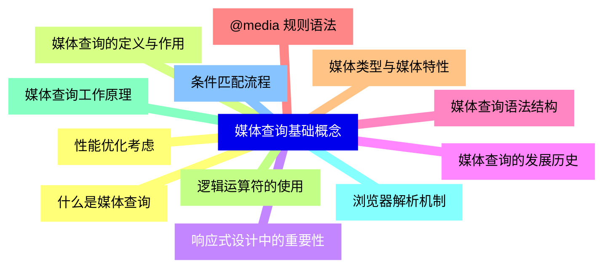
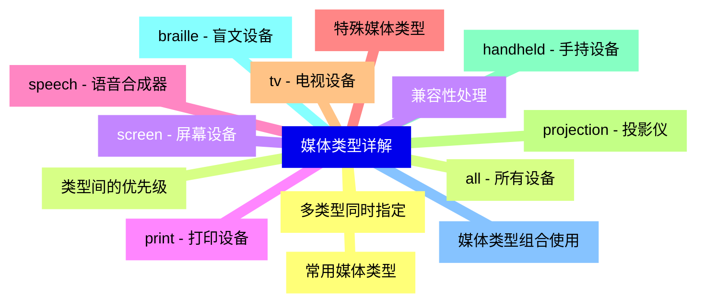
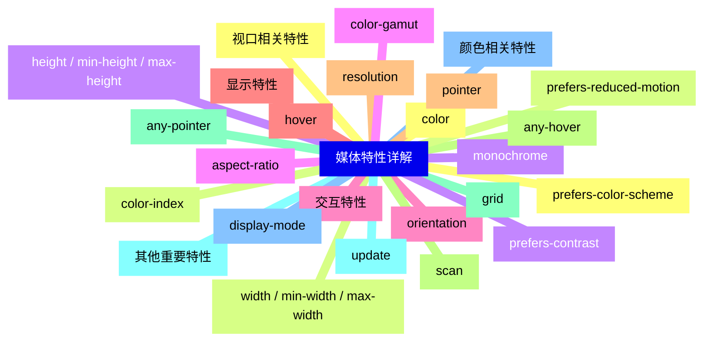
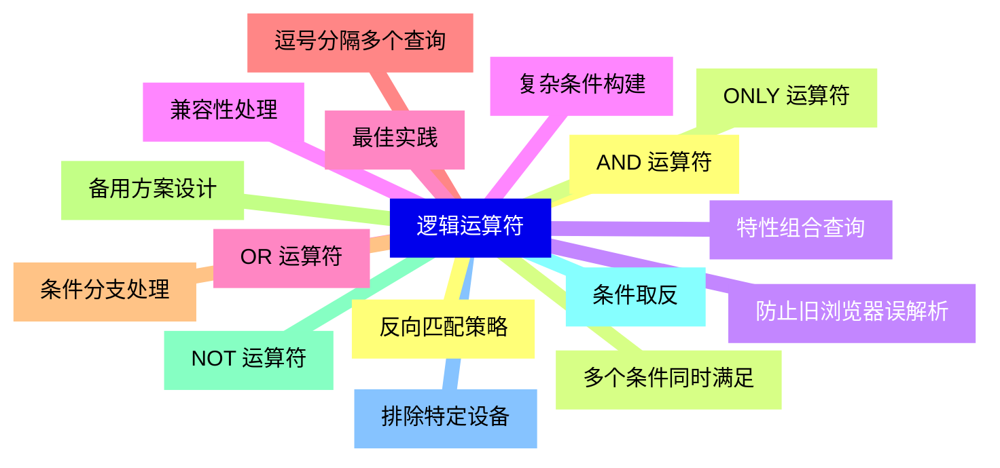
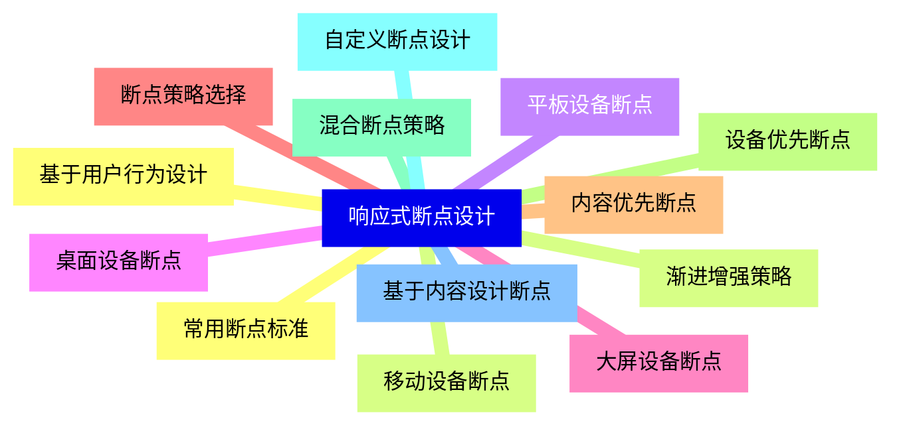
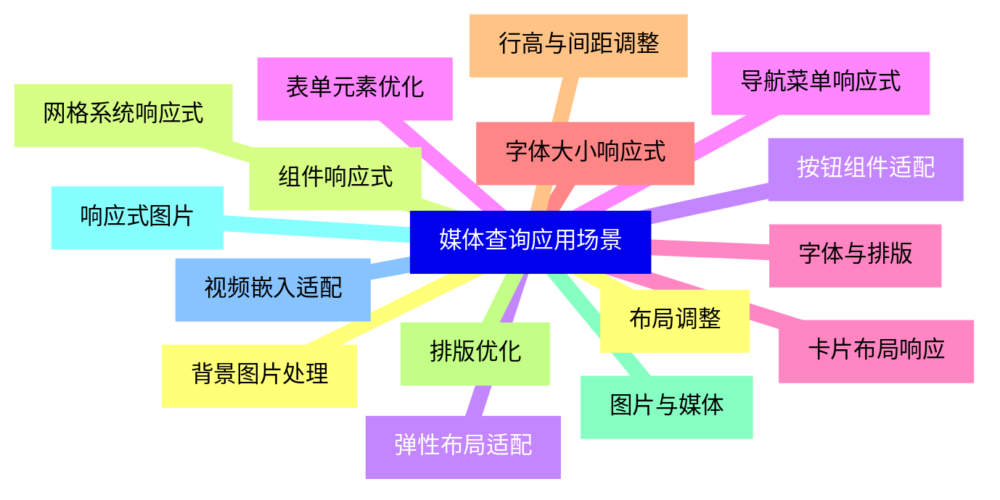
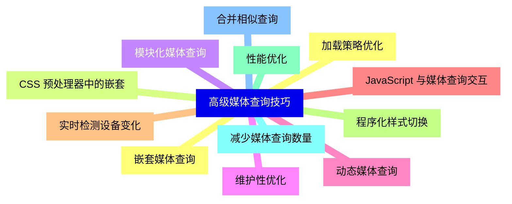
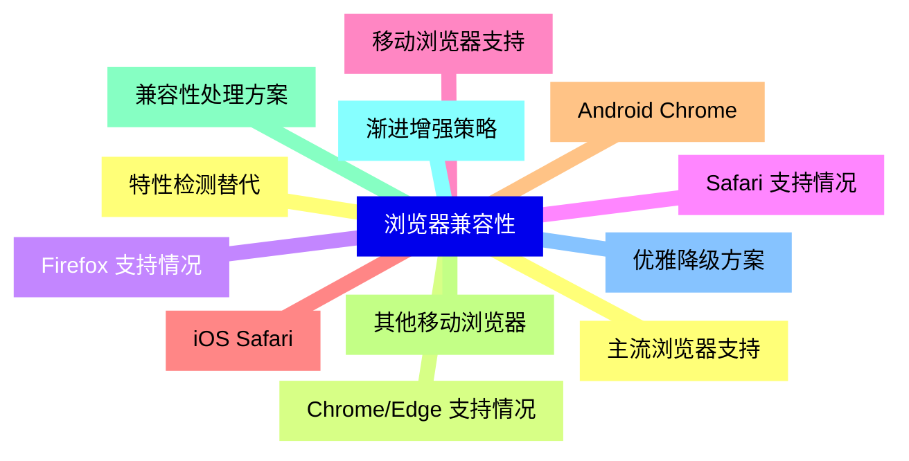
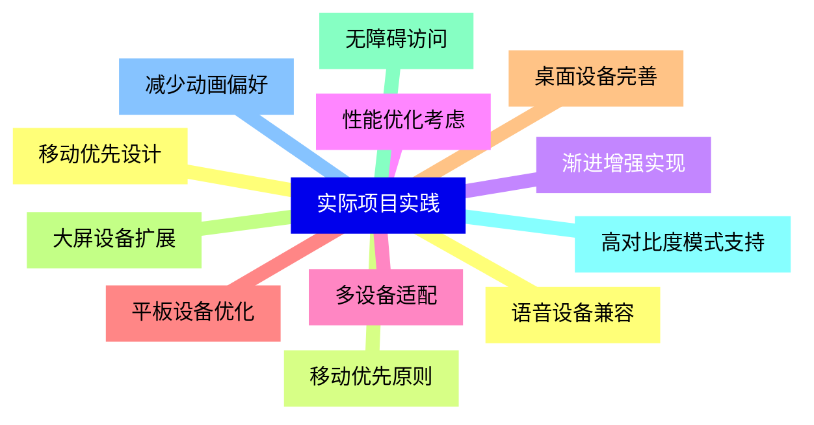
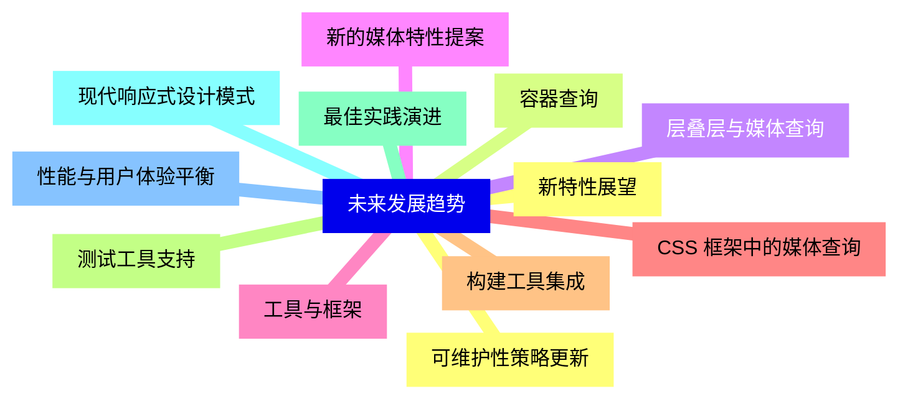


### 1 [媒体查询基础概念](#1)
#### 1.1 [什么是媒体查询](#1)
#### 1.2 [媒体查询的定义与作用](#1)
#### 1.3 [响应式设计中的重要性](#1)
#### 1.4 [媒体查询的发展历史](#1)
#### 1.5 [媒体查询语法结构](#1)
#### 1.6 [@media 规则语法](#1)
#### 1.7 [媒体类型与媒体特性](#1)
#### 1.8 [逻辑运算符的使用](#1)
#### 1.9 [媒体查询工作原理](#1)
#### 1.10 [浏览器解析机制](#1)
#### 1.11 [条件匹配流程](#1)
#### 1.12 [性能优化考虑](#1)
### 2 [媒体类型详解](#2)
#### 2.1 [常用媒体类型](#2)
#### 2.2 [all - 所有设备](#2)
#### 2.3 [screen - 屏幕设备](#2)
#### 2.4 [print - 打印设备](#2)
#### 2.5 [speech - 语音合成器](#2)
#### 2.6 [特殊媒体类型](#2)
#### 2.7 [tv - 电视设备](#2)
#### 2.8 [projection - 投影仪](#2)
#### 2.9 [handheld - 手持设备](#2)
#### 2.10 [braille - 盲文设备](#2)
#### 2.11 [媒体类型组合使用](#2)
#### 2.12 [多类型同时指定](#2)
#### 2.13 [类型间的优先级](#2)
#### 2.14 [兼容性处理](#2)
### 3 [媒体特性详解](#3)
#### 3.1 [视口相关特性](#3)
#### 3.2 [width / min-width / max-width](#3)
#### 3.3 [height / min-height / max-height](#3)
#### 3.4 [aspect-ratio](#3)
#### 3.5 [orientation](#3)
#### 3.6 [显示特性](#3)
#### 3.7 [resolution](#3)
#### 3.8 [scan](#3)
#### 3.9 [grid](#3)
#### 3.10 [update](#3)
#### 3.11 [颜色相关特性](#3)
#### 3.12 [color](#3)
#### 3.13 [color-index](#3)
#### 3.14 [monochrome](#3)
#### 3.15 [color-gamut](#3)
#### 3.16 [交互特性](#3)
#### 3.17 [hover](#3)
#### 3.18 [pointer](#3)
#### 3.19 [any-hover](#3)
#### 3.20 [any-pointer](#3)
#### 3.21 [其他重要特性](#3)
#### 3.22 [display-mode](#3)
#### 3.23 [prefers-color-scheme](#3)
#### 3.24 [prefers-reduced-motion](#3)
#### 3.25 [prefers-contrast](#3)
### 4 [逻辑运算符](#4)
#### 4.1 [AND 运算符](#4)
#### 4.2 [多个条件同时满足](#4)
#### 4.3 [特性组合查询](#4)
#### 4.4 [复杂条件构建](#4)
#### 4.5 [OR 运算符](#4)
#### 4.6 [逗号分隔多个查询](#4)
#### 4.7 [条件分支处理](#4)
#### 4.8 [备用方案设计](#4)
#### 4.9 [NOT 运算符](#4)
#### 4.10 [条件取反](#4)
#### 4.11 [排除特定设备](#4)
#### 4.12 [反向匹配策略](#4)
#### 4.13 [ONLY 运算符](#4)
#### 4.14 [防止旧浏览器误解析](#4)
#### 4.15 [兼容性处理](#4)
#### 4.16 [最佳实践](#4)
### 5 [响应式断点设计](#5)
#### 5.1 [常用断点标准](#5)
#### 5.2 [移动设备断点](#5)
#### 5.3 [平板设备断点](#5)
#### 5.4 [桌面设备断点](#5)
#### 5.5 [大屏设备断点](#5)
#### 5.6 [断点策略选择](#5)
#### 5.7 [内容优先断点](#5)
#### 5.8 [设备优先断点](#5)
#### 5.9 [混合断点策略](#5)
#### 5.10 [自定义断点设计](#5)
#### 5.11 [基于内容设计断点](#5)
#### 5.12 [基于用户行为设计](#5)
#### 5.13 [渐进增强策略](#5)
### 6 [媒体查询应用场景](#6)
#### 6.1 [布局调整](#6)
#### 6.2 [网格系统响应式](#6)
#### 6.3 [弹性布局适配](#6)
#### 6.4 [导航菜单响应式](#6)
#### 6.5 [字体与排版](#6)
#### 6.6 [字体大小响应式](#6)
#### 6.7 [行高与间距调整](#6)
#### 6.8 [排版优化](#6)
#### 6.9 [图片与媒体](#6)
#### 6.10 [响应式图片](#6)
#### 6.11 [视频嵌入适配](#6)
#### 6.12 [背景图片处理](#6)
#### 6.13 [组件响应式](#6)
#### 6.14 [按钮组件适配](#6)
#### 6.15 [表单元素优化](#6)
#### 6.16 [卡片布局响应](#6)
### 7 [高级媒体查询技巧](#7)
#### 7.1 [嵌套媒体查询](#7)
#### 7.2 [CSS 预处理器中的嵌套](#7)
#### 7.3 [模块化媒体查询](#7)
#### 7.4 [维护性优化](#7)
#### 7.5 [动态媒体查询](#7)
#### 7.6 [JavaScript 与媒体查询交互](#7)
#### 7.7 [实时检测设备变化](#7)
#### 7.8 [程序化样式切换](#7)
#### 7.9 [性能优化](#7)
#### 7.10 [减少媒体查询数量](#7)
#### 7.11 [合并相似查询](#7)
#### 7.12 [加载策略优化](#7)
### 8 [浏览器兼容性](#8)
#### 8.1 [主流浏览器支持](#8)
#### 8.2 [Chrome/Edge 支持情况](#8)
#### 8.3 [Firefox 支持情况](#8)
#### 8.4 [Safari 支持情况](#8)
#### 8.5 [移动浏览器支持](#8)
#### 8.6 [iOS Safari](#8)
#### 8.7 [Android Chrome](#8)
#### 8.8 [其他移动浏览器](#8)
#### 8.9 [兼容性处理方案](#8)
#### 8.10 [渐进增强策略](#8)
#### 8.11 [优雅降级方案](#8)
#### 8.12 [特性检测替代](#8)
### 9 [实际项目实践](#9)
#### 9.1 [移动优先设计](#9)
#### 9.2 [移动优先原则](#9)
#### 9.3 [渐进增强实现](#9)
#### 9.4 [性能优化考虑](#9)
#### 9.5 [多设备适配](#9)
#### 9.6 [平板设备优化](#9)
#### 9.7 [桌面设备完善](#9)
#### 9.8 [大屏设备扩展](#9)
#### 9.9 [无障碍访问](#9)
#### 9.10 [高对比度模式支持](#9)
#### 9.11 [减少动画偏好](#9)
#### 9.12 [语音设备兼容](#9)
### 10 [未来发展趋势](#10)
#### 10.1 [新特性展望](#10)
#### 10.2 [容器查询](#10)
#### 10.3 [层叠层与媒体查询](#10)
#### 10.4 [新的媒体特性提案](#10)
#### 10.5 [工具与框架](#10)
#### 10.6 [CSS 框架中的媒体查询](#10)
#### 10.7 [构建工具集成](#10)
#### 10.8 [测试工具支持](#10)
#### 10.9 [最佳实践演进](#10)
#### 10.10 [现代响应式设计模式](#10)
#### 10.11 [性能与用户体验平衡](#10)
#### 10.12 [可维护性策略更新](#10)




### 1 媒体查询基础概念

---
### 1 媒体查询基础概念
___
#### 1.1 什么是媒体查询
___
#### 1.2 媒体查询的定义与作用
___
#### 1.3 响应式设计中的重要性
___
#### 1.4 媒体查询的发展历史
___
#### 1.5 媒体查询语法结构
___
#### 1.6 @media 规则语法
___
#### 1.7 媒体类型与媒体特性
___
#### 1.8 逻辑运算符的使用
___
#### 1.9 媒体查询工作原理
___
#### 1.10 浏览器解析机制
___
#### 1.11 条件匹配流程
___
#### 1.12 性能优化考虑
### 2 媒体类型详解

---
### 2 媒体类型详解
___
#### 2.1 常用媒体类型
___
#### 2.2 all - 所有设备
___
#### 2.3 screen - 屏幕设备
___
#### 2.4 print - 打印设备
___
#### 2.5 speech - 语音合成器
___
#### 2.6 特殊媒体类型
___
#### 2.7 tv - 电视设备
___
#### 2.8 projection - 投影仪
___
#### 2.9 handheld - 手持设备
___
#### 2.10 braille - 盲文设备
___
#### 2.11 媒体类型组合使用
___
#### 2.12 多类型同时指定
___
#### 2.13 类型间的优先级
___
#### 2.14 兼容性处理
### 3 媒体特性详解

---
### 3 媒体特性详解
___
#### 3.1 视口相关特性
___
#### 3.2 width / min-width / max-width
___
#### 3.3 height / min-height / max-height
___
#### 3.4 aspect-ratio
___
#### 3.5 orientation
___
#### 3.6 显示特性
___
#### 3.7 resolution
___
#### 3.8 scan
___
#### 3.9 grid
___
#### 3.10 update
___
#### 3.11 颜色相关特性
___
#### 3.12 color
___
#### 3.13 color-index
___
#### 3.14 monochrome
___
#### 3.15 color-gamut
___
#### 3.16 交互特性
___
#### 3.17 hover
___
#### 3.18 pointer
___
#### 3.19 any-hover
___
#### 3.20 any-pointer
___
#### 3.21 其他重要特性
___
#### 3.22 display-mode
___
#### 3.23 prefers-color-scheme
___
#### 3.24 prefers-reduced-motion
___
#### 3.25 prefers-contrast
### 4 逻辑运算符

---
### 4 逻辑运算符
___
#### 4.1 AND 运算符
___
#### 4.2 多个条件同时满足
___
#### 4.3 特性组合查询
___
#### 4.4 复杂条件构建
___
#### 4.5 OR 运算符
___
#### 4.6 逗号分隔多个查询
___
#### 4.7 条件分支处理
___
#### 4.8 备用方案设计
___
#### 4.9 NOT 运算符
___
#### 4.10 条件取反
___
#### 4.11 排除特定设备
___
#### 4.12 反向匹配策略
___
#### 4.13 ONLY 运算符
___
#### 4.14 防止旧浏览器误解析
___
#### 4.15 兼容性处理
___
#### 4.16 最佳实践
### 5 响应式断点设计

---
### 5 响应式断点设计
___
#### 5.1 常用断点标准
___
#### 5.2 移动设备断点
___
#### 5.3 平板设备断点
___
#### 5.4 桌面设备断点
___
#### 5.5 大屏设备断点
___
#### 5.6 断点策略选择
___
#### 5.7 内容优先断点
___
#### 5.8 设备优先断点
___
#### 5.9 混合断点策略
___
#### 5.10 自定义断点设计
___
#### 5.11 基于内容设计断点
___
#### 5.12 基于用户行为设计
___
#### 5.13 渐进增强策略
### 6 媒体查询应用场景

---
### 6 媒体查询应用场景
___
#### 6.1 布局调整
___
#### 6.2 网格系统响应式
___
#### 6.3 弹性布局适配
___
#### 6.4 导航菜单响应式
___
#### 6.5 字体与排版
___
#### 6.6 字体大小响应式
___
#### 6.7 行高与间距调整
___
#### 6.8 排版优化
___
#### 6.9 图片与媒体
___
#### 6.10 响应式图片
___
#### 6.11 视频嵌入适配
___
#### 6.12 背景图片处理
___
#### 6.13 组件响应式
___
#### 6.14 按钮组件适配
___
#### 6.15 表单元素优化
___
#### 6.16 卡片布局响应
### 7 高级媒体查询技巧

---
### 7 高级媒体查询技巧
___
#### 7.1 嵌套媒体查询
___
#### 7.2 CSS 预处理器中的嵌套
___
#### 7.3 模块化媒体查询
___
#### 7.4 维护性优化
___
#### 7.5 动态媒体查询
___
#### 7.6 JavaScript 与媒体查询交互
___
#### 7.7 实时检测设备变化
___
#### 7.8 程序化样式切换
___
#### 7.9 性能优化
___
#### 7.10 减少媒体查询数量
___
#### 7.11 合并相似查询
___
#### 7.12 加载策略优化
### 8 浏览器兼容性

---
### 8 浏览器兼容性
___
#### 8.1 主流浏览器支持
___
#### 8.2 Chrome/Edge 支持情况
___
#### 8.3 Firefox 支持情况
___
#### 8.4 Safari 支持情况
___
#### 8.5 移动浏览器支持
___
#### 8.6 iOS Safari
___
#### 8.7 Android Chrome
___
#### 8.8 其他移动浏览器
___
#### 8.9 兼容性处理方案
___
#### 8.10 渐进增强策略
___
#### 8.11 优雅降级方案
___
#### 8.12 特性检测替代
### 9 实际项目实践

---
### 9 实际项目实践
___
#### 9.1 移动优先设计
___
#### 9.2 移动优先原则
___
#### 9.3 渐进增强实现
___
#### 9.4 性能优化考虑
___
#### 9.5 多设备适配
___
#### 9.6 平板设备优化
___
#### 9.7 桌面设备完善
___
#### 9.8 大屏设备扩展
___
#### 9.9 无障碍访问
___
#### 9.10 高对比度模式支持
___
#### 9.11 减少动画偏好
___
#### 9.12 语音设备兼容
### 10 未来发展趋势

---
### 10 未来发展趋势
___
#### 10.1 新特性展望
___
#### 10.2 容器查询
___
#### 10.3 层叠层与媒体查询
___
#### 10.4 新的媒体特性提案
___
#### 10.5 工具与框架
___
#### 10.6 CSS 框架中的媒体查询
___
#### 10.7 构建工具集成
___
#### 10.8 测试工具支持
___
#### 10.9 最佳实践演进
___
#### 10.10 现代响应式设计模式
___
#### 10.11 性能与用户体验平衡
___
#### 10.12 可维护性策略更新


### 1 媒体查询基础概念{#1}

{}

<--->
{}
{}
{}
{}
{}
{}
{}
{}
{}
{}
{}
{}
{}
{}
{}
{}
{}
{}
{}
{}
{}
{}
{}
{}
{}

### 2 媒体类型详解{#2}

{}
{}
{}
{}
{}
{}
{}
{}
{}
{}
{}
{}
{}
{}
{}
{}
{}
{}
{}
{}
{}
{}
{}
{}
{}
{}
{}
{}
{}
<--->

{}

### 3 媒体特性详解{#3}

{}

<--->
{}
{}
{}
{}
{}
{}
{}
{}
{}
{}
{}
{}
{}
{}
{}
{}
{}
{}
{}
{}
{}
{}
{}
{}
{}
{}
{}
{}
{}
{}
{}
{}
{}
{}
{}
{}
{}
{}
{}
{}
{}
{}
{}
{}
{}
{}
{}
{}
{}
{}
{}

### 4 逻辑运算符{#4}

{}
{}
{}
{}
{}
{}
{}
{}
{}
{}
{}
{}
{}
{}
{}
{}
{}
{}
{}
{}
{}
{}
{}
{}
{}
{}
{}
{}
{}
{}
{}
{}
{}
<--->

{}

### 5 响应式断点设计{#5}

{}

<--->
{}
{}
{}
{}
{}
{}
{}
{}
{}
{}
{}
{}
{}
{}
{}
{}
{}
{}
{}
{}
{}
{}
{}
{}
{}
{}
{}

### 6 媒体查询应用场景{#6}

{}
{}
{}
{}
{}
{}
{}
{}
{}
{}
{}
{}
{}
{}
{}
{}
{}
{}
{}
{}
{}
{}
{}
{}
{}
{}
{}
{}
{}
{}
{}
{}
{}
<--->

{}

### 7 高级媒体查询技巧{#7}

{}

<--->
{}
{}
{}
{}
{}
{}
{}
{}
{}
{}
{}
{}
{}
{}
{}
{}
{}
{}
{}
{}
{}
{}
{}
{}
{}

### 8 浏览器兼容性{#8}

{}
{}
{}
{}
{}
{}
{}
{}
{}
{}
{}
{}
{}
{}
{}
{}
{}
{}
{}
{}
{}
{}
{}
{}
{}
<--->

{}

### 9 实际项目实践{#9}

{}

<--->
{}
{}
{}
{}
{}
{}
{}
{}
{}
{}
{}
{}
{}
{}
{}
{}
{}
{}
{}
{}
{}
{}
{}
{}
{}

### 10 未来发展趋势{#10}

{}
{}
{}
{}
{}
{}
{}
{}
{}
{}
{}
{}
{}
{}
{}
{}
{}
{}
{}
{}
{}
{}
{}
{}
{}
<--->

{}
