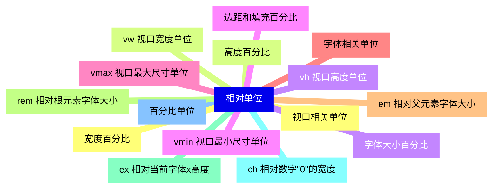
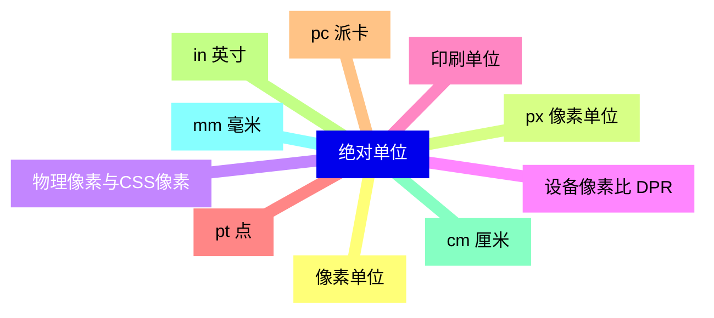
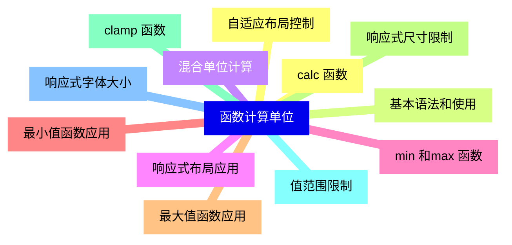
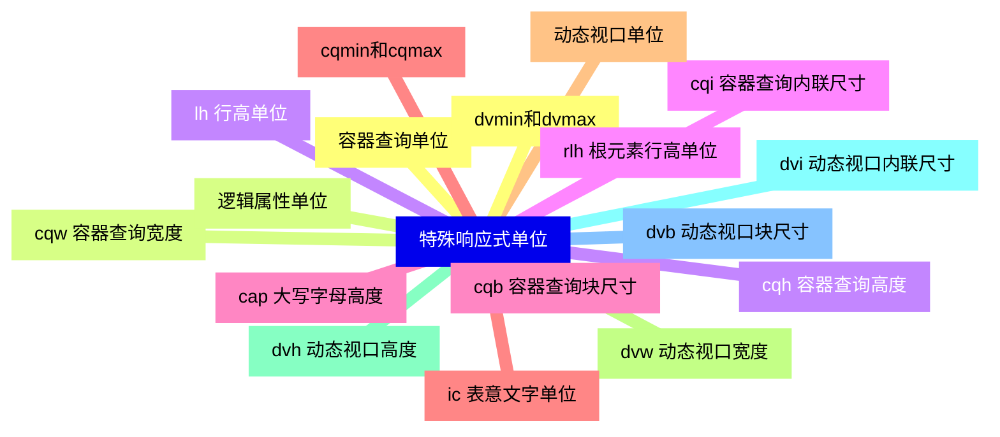
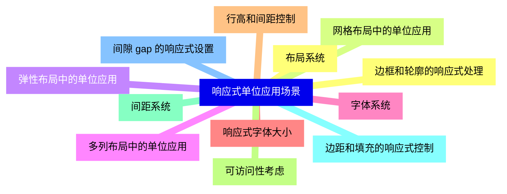
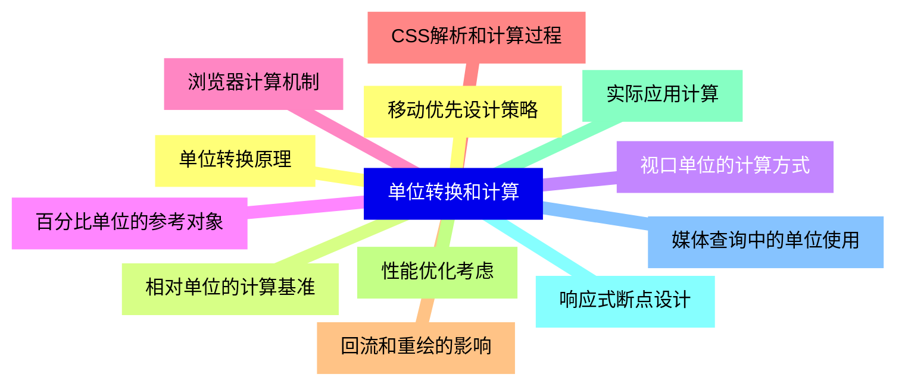
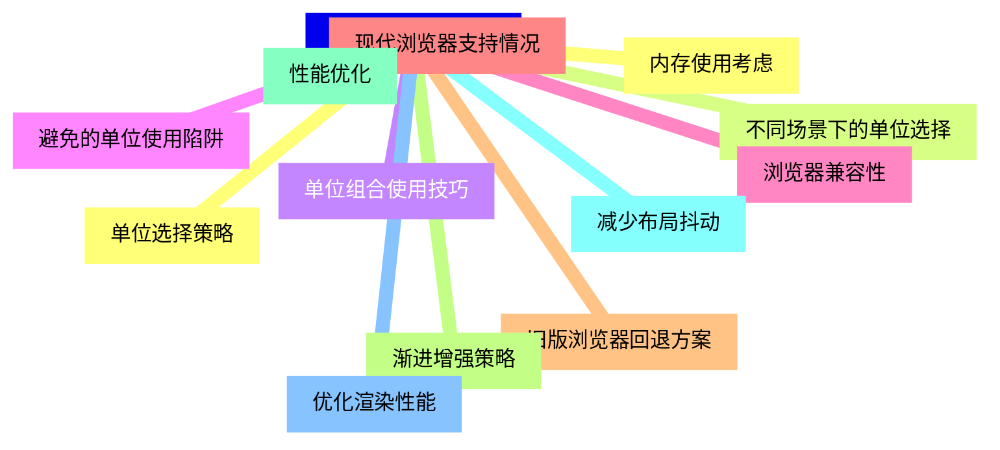
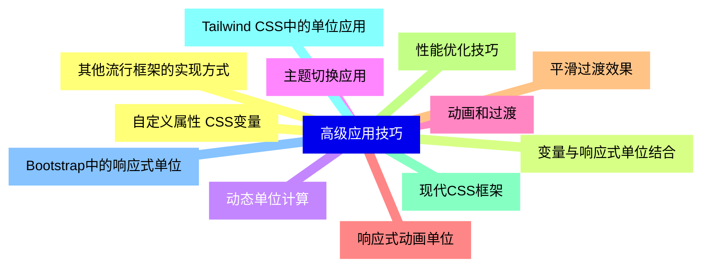


### 1 [相对单位](#1)
#### 1.1 [视口相关单位](#1)
#### 1.2 [vw 视口宽度单位](#1)
#### 1.3 [vh 视口高度单位](#1)
#### 1.4 [vmin 视口最小尺寸单位](#1)
#### 1.5 [vmax 视口最大尺寸单位](#1)
#### 1.6 [字体相关单位](#1)
#### 1.7 [em 相对父元素字体大小](#1)
#### 1.8 [rem 相对根元素字体大小](#1)
#### 1.9 [ex 相对当前字体x高度](#1)
#### 1.10 [ch 相对数字"0"的宽度](#1)
#### 1.11 [百分比单位](#1)
#### 1.12 [宽度百分比](#1)
#### 1.13 [高度百分比](#1)
#### 1.14 [字体大小百分比](#1)
#### 1.15 [边距和填充百分比](#1)
### 2 [绝对单位](#2)
#### 2.1 [像素单位](#2)
#### 2.2 [px 像素单位](#2)
#### 2.3 [物理像素与CSS像素](#2)
#### 2.4 [设备像素比 DPR](#2)
#### 2.5 [印刷单位](#2)
#### 2.6 [pt 点](#2)
#### 2.7 [pc 派卡](#2)
#### 2.8 [in 英寸](#2)
#### 2.9 [cm 厘米](#2)
#### 2.10 [mm 毫米](#2)
### 3 [函数计算单位](#3)
#### 3.1 [calc  函数](#3)
#### 3.2 [基本语法和使用](#3)
#### 3.3 [混合单位计算](#3)
#### 3.4 [响应式布局应用](#3)
#### 3.5 [min  和max  函数](#3)
#### 3.6 [最小值函数应用](#3)
#### 3.7 [最大值函数应用](#3)
#### 3.8 [响应式尺寸限制](#3)
#### 3.9 [clamp  函数](#3)
#### 3.10 [值范围限制](#3)
#### 3.11 [响应式字体大小](#3)
#### 3.12 [自适应布局控制](#3)
### 4 [特殊响应式单位](#4)
#### 4.1 [容器查询单位](#4)
#### 4.2 [cqw 容器查询宽度](#4)
#### 4.3 [cqh 容器查询高度](#4)
#### 4.4 [cqi 容器查询内联尺寸](#4)
#### 4.5 [cqb 容器查询块尺寸](#4)
#### 4.6 [cqmin和cqmax](#4)
#### 4.7 [动态视口单位](#4)
#### 4.8 [dvw 动态视口宽度](#4)
#### 4.9 [dvh 动态视口高度](#4)
#### 4.10 [dvi 动态视口内联尺寸](#4)
#### 4.11 [dvb 动态视口块尺寸](#4)
#### 4.12 [dvmin和dvmax](#4)
#### 4.13 [逻辑属性单位](#4)
#### 4.14 [lh 行高单位](#4)
#### 4.15 [rlh 根元素行高单位](#4)
#### 4.16 [cap 大写字母高度](#4)
#### 4.17 [ic 表意文字单位](#4)
### 5 [响应式单位应用场景](#5)
#### 5.1 [布局系统](#5)
#### 5.2 [网格布局中的单位应用](#5)
#### 5.3 [弹性布局中的单位应用](#5)
#### 5.4 [多列布局中的单位应用](#5)
#### 5.5 [字体系统](#5)
#### 5.6 [响应式字体大小](#5)
#### 5.7 [行高和间距控制](#5)
#### 5.8 [可访问性考虑](#5)
#### 5.9 [间距系统](#5)
#### 5.10 [边距和填充的响应式控制](#5)
#### 5.11 [间隙 gap 的响应式设置](#5)
#### 5.12 [边框和轮廓的响应式处理](#5)
### 6 [单位转换和计算](#6)
#### 6.1 [单位转换原理](#6)
#### 6.2 [相对单位的计算基准](#6)
#### 6.3 [视口单位的计算方式](#6)
#### 6.4 [百分比单位的参考对象](#6)
#### 6.5 [浏览器计算机制](#6)
#### 6.6 [CSS解析和计算过程](#6)
#### 6.7 [回流和重绘的影响](#6)
#### 6.8 [性能优化考虑](#6)
#### 6.9 [实际应用计算](#6)
#### 6.10 [响应式断点设计](#6)
#### 6.11 [媒体查询中的单位使用](#6)
#### 6.12 [移动优先设计策略](#6)
### 7 [最佳实践和兼容性](#7)
#### 7.1 [单位选择策略](#7)
#### 7.2 [不同场景下的单位选择](#7)
#### 7.3 [单位组合使用技巧](#7)
#### 7.4 [避免的单位使用陷阱](#7)
#### 7.5 [浏览器兼容性](#7)
#### 7.6 [现代浏览器支持情况](#7)
#### 7.7 [旧版浏览器回退方案](#7)
#### 7.8 [渐进增强策略](#7)
#### 7.9 [性能优化](#7)
#### 7.10 [减少布局抖动](#7)
#### 7.11 [优化渲染性能](#7)
#### 7.12 [内存使用考虑](#7)
### 8 [高级应用技巧](#8)
#### 8.1 [自定义属性 CSS变量](#8)
#### 8.2 [变量与响应式单位结合](#8)
#### 8.3 [动态单位计算](#8)
#### 8.4 [主题切换应用](#8)
#### 8.5 [动画和过渡](#8)
#### 8.6 [响应式动画单位](#8)
#### 8.7 [平滑过渡效果](#8)
#### 8.8 [性能优化技巧](#8)
#### 8.9 [现代CSS框架](#8)
#### 8.10 [Tailwind CSS中的单位应用](#8)
#### 8.11 [Bootstrap中的响应式单位](#8)
#### 8.12 [其他流行框架的实现方式](#8)




### 1 相对单位

---
### 1 相对单位
___
#### 1.1 视口相关单位
___
#### 1.2 vw 视口宽度单位
___
#### 1.3 vh 视口高度单位
___
#### 1.4 vmin 视口最小尺寸单位
___
#### 1.5 vmax 视口最大尺寸单位
___
#### 1.6 字体相关单位
___
#### 1.7 em 相对父元素字体大小
___
#### 1.8 rem 相对根元素字体大小
___
#### 1.9 ex 相对当前字体x高度
___
#### 1.10 ch 相对数字"0"的宽度
___
#### 1.11 百分比单位
___
#### 1.12 宽度百分比
___
#### 1.13 高度百分比
___
#### 1.14 字体大小百分比
___
#### 1.15 边距和填充百分比
### 2 绝对单位

---
### 2 绝对单位
___
#### 2.1 像素单位
___
#### 2.2 px 像素单位
___
#### 2.3 物理像素与CSS像素
___
#### 2.4 设备像素比 DPR
___
#### 2.5 印刷单位
___
#### 2.6 pt 点
___
#### 2.7 pc 派卡
___
#### 2.8 in 英寸
___
#### 2.9 cm 厘米
___
#### 2.10 mm 毫米
### 3 函数计算单位

---
### 3 函数计算单位
___
#### 3.1 calc  函数
___
#### 3.2 基本语法和使用
___
#### 3.3 混合单位计算
___
#### 3.4 响应式布局应用
___
#### 3.5 min  和max  函数
___
#### 3.6 最小值函数应用
___
#### 3.7 最大值函数应用
___
#### 3.8 响应式尺寸限制
___
#### 3.9 clamp  函数
___
#### 3.10 值范围限制
___
#### 3.11 响应式字体大小
___
#### 3.12 自适应布局控制
### 4 特殊响应式单位

---
### 4 特殊响应式单位
___
#### 4.1 容器查询单位
___
#### 4.2 cqw 容器查询宽度
___
#### 4.3 cqh 容器查询高度
___
#### 4.4 cqi 容器查询内联尺寸
___
#### 4.5 cqb 容器查询块尺寸
___
#### 4.6 cqmin和cqmax
___
#### 4.7 动态视口单位
___
#### 4.8 dvw 动态视口宽度
___
#### 4.9 dvh 动态视口高度
___
#### 4.10 dvi 动态视口内联尺寸
___
#### 4.11 dvb 动态视口块尺寸
___
#### 4.12 dvmin和dvmax
___
#### 4.13 逻辑属性单位
___
#### 4.14 lh 行高单位
___
#### 4.15 rlh 根元素行高单位
___
#### 4.16 cap 大写字母高度
___
#### 4.17 ic 表意文字单位
### 5 响应式单位应用场景

---
### 5 响应式单位应用场景
___
#### 5.1 布局系统
___
#### 5.2 网格布局中的单位应用
___
#### 5.3 弹性布局中的单位应用
___
#### 5.4 多列布局中的单位应用
___
#### 5.5 字体系统
___
#### 5.6 响应式字体大小
___
#### 5.7 行高和间距控制
___
#### 5.8 可访问性考虑
___
#### 5.9 间距系统
___
#### 5.10 边距和填充的响应式控制
___
#### 5.11 间隙 gap 的响应式设置
___
#### 5.12 边框和轮廓的响应式处理
### 6 单位转换和计算

---
### 6 单位转换和计算
___
#### 6.1 单位转换原理
___
#### 6.2 相对单位的计算基准
___
#### 6.3 视口单位的计算方式
___
#### 6.4 百分比单位的参考对象
___
#### 6.5 浏览器计算机制
___
#### 6.6 CSS解析和计算过程
___
#### 6.7 回流和重绘的影响
___
#### 6.8 性能优化考虑
___
#### 6.9 实际应用计算
___
#### 6.10 响应式断点设计
___
#### 6.11 媒体查询中的单位使用
___
#### 6.12 移动优先设计策略
### 7 最佳实践和兼容性

---
### 7 最佳实践和兼容性
___
#### 7.1 单位选择策略
___
#### 7.2 不同场景下的单位选择
___
#### 7.3 单位组合使用技巧
___
#### 7.4 避免的单位使用陷阱
___
#### 7.5 浏览器兼容性
___
#### 7.6 现代浏览器支持情况
___
#### 7.7 旧版浏览器回退方案
___
#### 7.8 渐进增强策略
___
#### 7.9 性能优化
___
#### 7.10 减少布局抖动
___
#### 7.11 优化渲染性能
___
#### 7.12 内存使用考虑
### 8 高级应用技巧

---
### 8 高级应用技巧
___
#### 8.1 自定义属性 CSS变量
___
#### 8.2 变量与响应式单位结合
___
#### 8.3 动态单位计算
___
#### 8.4 主题切换应用
___
#### 8.5 动画和过渡
___
#### 8.6 响应式动画单位
___
#### 8.7 平滑过渡效果
___
#### 8.8 性能优化技巧
___
#### 8.9 现代CSS框架
___
#### 8.10 Tailwind CSS中的单位应用
___
#### 8.11 Bootstrap中的响应式单位
___
#### 8.12 其他流行框架的实现方式


### 1 相对单位{#1}

{}

<--->
{}
{}
{}
{}
{}
{}
{}
{}
{}
{}
{}
{}
{}
{}
{}
{}
{}
{}
{}
{}
{}
{}
{}
{}
{}
{}
{}
{}
{}
{}
{}

### 2 绝对单位{#2}

{}
{}
{}
{}
{}
{}
{}
{}
{}
{}
{}
{}
{}
{}
{}
{}
{}
{}
{}
{}
{}
<--->

{}

### 3 函数计算单位{#3}

{}

<--->
{}
{}
{}
{}
{}
{}
{}
{}
{}
{}
{}
{}
{}
{}
{}
{}
{}
{}
{}
{}
{}
{}
{}
{}
{}

### 4 特殊响应式单位{#4}

{}
{}
{}
{}
{}
{}
{}
{}
{}
{}
{}
{}
{}
{}
{}
{}
{}
{}
{}
{}
{}
{}
{}
{}
{}
{}
{}
{}
{}
{}
{}
{}
{}
{}
{}
<--->

{}

### 5 响应式单位应用场景{#5}

{}

<--->
{}
{}
{}
{}
{}
{}
{}
{}
{}
{}
{}
{}
{}
{}
{}
{}
{}
{}
{}
{}
{}
{}
{}
{}
{}

### 6 单位转换和计算{#6}

{}
{}
{}
{}
{}
{}
{}
{}
{}
{}
{}
{}
{}
{}
{}
{}
{}
{}
{}
{}
{}
{}
{}
{}
{}
<--->

{}

### 7 最佳实践和兼容性{#7}

{}

<--->
{}
{}
{}
{}
{}
{}
{}
{}
{}
{}
{}
{}
{}
{}
{}
{}
{}
{}
{}
{}
{}
{}
{}
{}
{}

### 8 高级应用技巧{#8}

{}
{}
{}
{}
{}
{}
{}
{}
{}
{}
{}
{}
{}
{}
{}
{}
{}
{}
{}
{}
{}
{}
{}
{}
{}
<--->

{}
