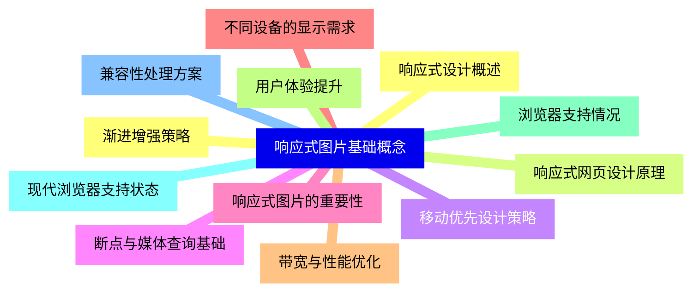
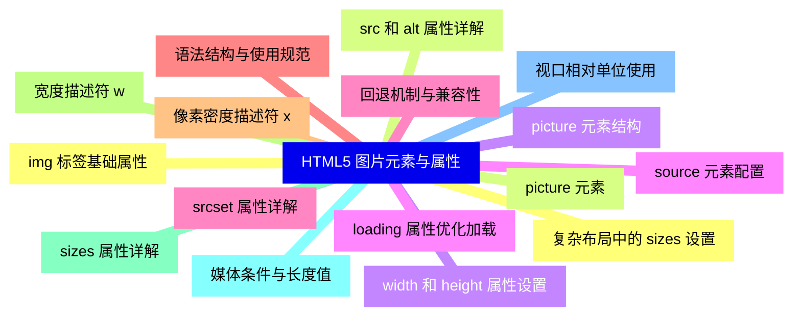
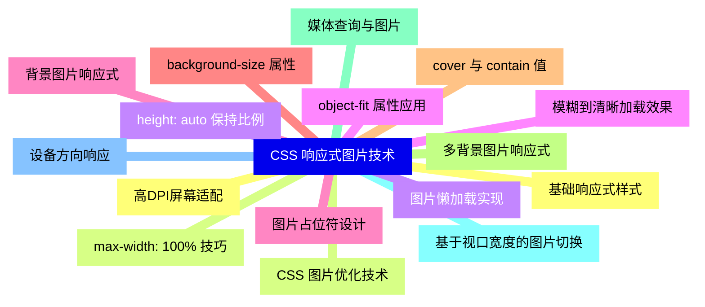
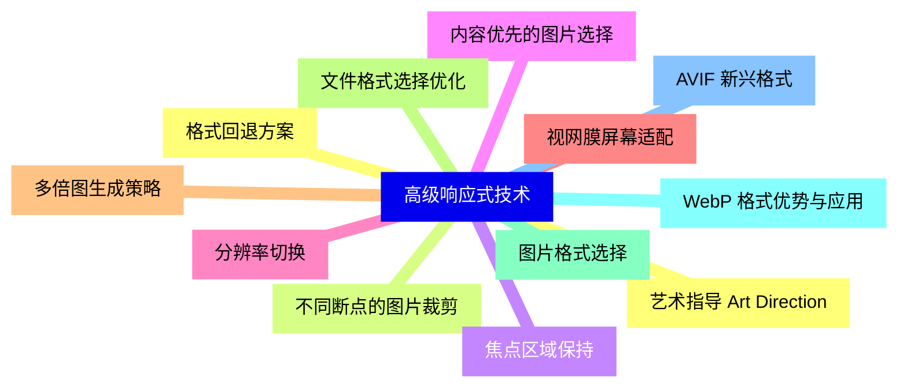
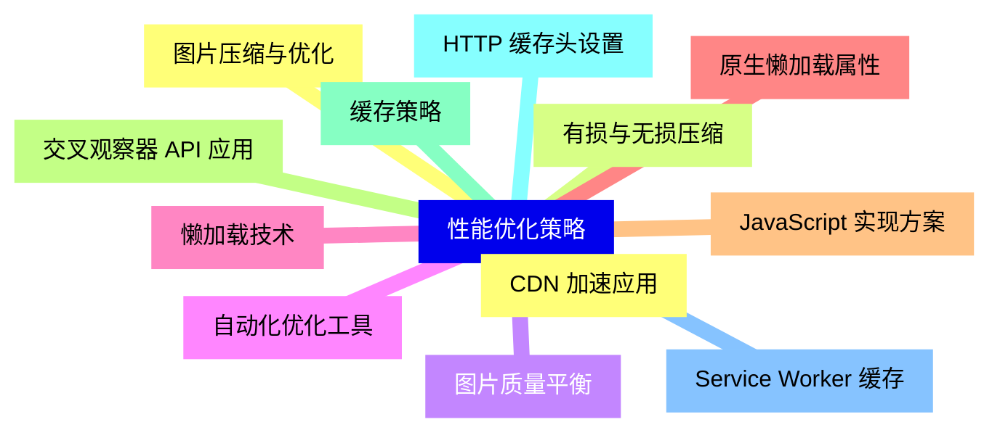
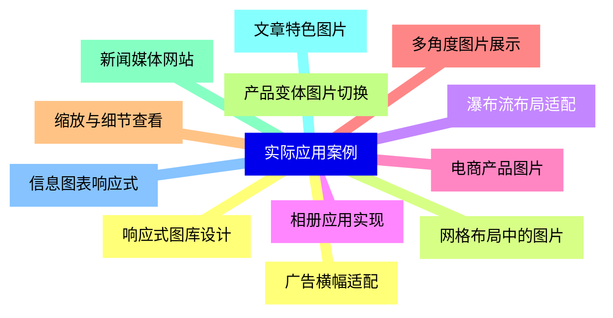
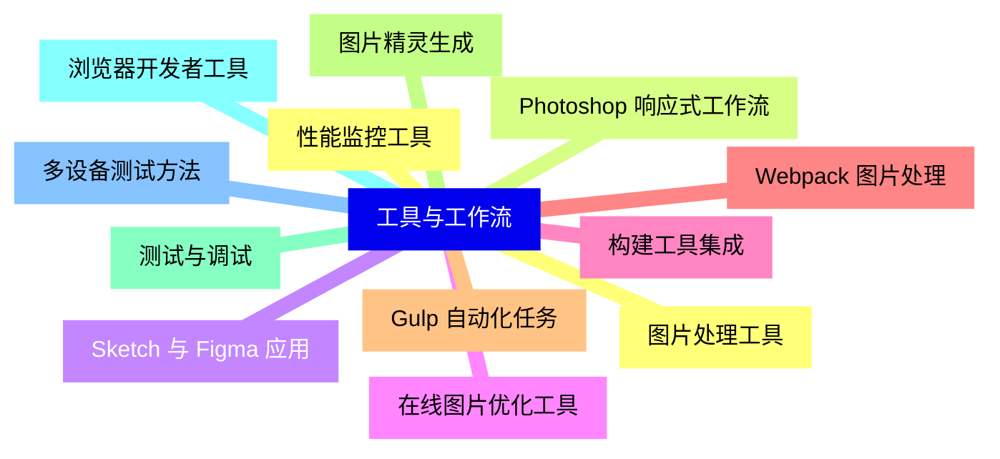
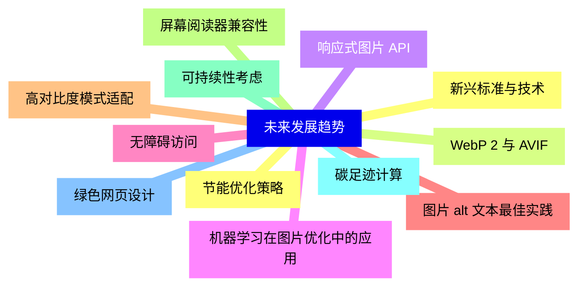


### 1 [响应式图片基础概念](#1)
#### 1.1 [响应式设计概述](#1)
#### 1.2 [响应式网页设计原理](#1)
#### 1.3 [移动优先设计策略](#1)
#### 1.4 [断点与媒体查询基础](#1)
#### 1.5 [响应式图片的重要性](#1)
#### 1.6 [不同设备的显示需求](#1)
#### 1.7 [带宽与性能优化](#1)
#### 1.8 [用户体验提升](#1)
#### 1.9 [浏览器支持情况](#1)
#### 1.10 [现代浏览器支持状态](#1)
#### 1.11 [兼容性处理方案](#1)
#### 1.12 [渐进增强策略](#1)
### 2 [HTML5 图片元素与属性](#2)
#### 2.1 [img 标签基础属性](#2)
#### 2.2 [src 和 alt 属性详解](#2)
#### 2.3 [width 和 height 属性设置](#2)
#### 2.4 [loading 属性优化加载](#2)
#### 2.5 [srcset 属性详解](#2)
#### 2.6 [语法结构与使用规范](#2)
#### 2.7 [像素密度描述符 x](#2)
#### 2.8 [宽度描述符 w](#2)
#### 2.9 [sizes 属性详解](#2)
#### 2.10 [媒体条件与长度值](#2)
#### 2.11 [视口相对单位使用](#2)
#### 2.12 [复杂布局中的 sizes 设置](#2)
#### 2.13 [picture 元素](#2)
#### 2.14 [picture 元素结构](#2)
#### 2.15 [source 元素配置](#2)
#### 2.16 [回退机制与兼容性](#2)
### 3 [CSS 响应式图片技术](#3)
#### 3.1 [基础响应式样式](#3)
#### 3.2 [max-width: 100% 技巧](#3)
#### 3.3 [height: auto 保持比例](#3)
#### 3.4 [object-fit 属性应用](#3)
#### 3.5 [背景图片响应式](#3)
#### 3.6 [background-size 属性](#3)
#### 3.7 [cover 与 contain 值](#3)
#### 3.8 [多背景图片响应式](#3)
#### 3.9 [媒体查询与图片](#3)
#### 3.10 [基于视口宽度的图片切换](#3)
#### 3.11 [设备方向响应](#3)
#### 3.12 [高DPI屏幕适配](#3)
#### 3.13 [CSS 图片优化技术](#3)
#### 3.14 [图片懒加载实现](#3)
#### 3.15 [模糊到清晰加载效果](#3)
#### 3.16 [图片占位符设计](#3)
### 4 [高级响应式技术](#4)
#### 4.1 [艺术指导 Art Direction](#4)
#### 4.2 [不同断点的图片裁剪](#4)
#### 4.3 [焦点区域保持](#4)
#### 4.4 [内容优先的图片选择](#4)
#### 4.5 [分辨率切换](#4)
#### 4.6 [视网膜屏幕适配](#4)
#### 4.7 [多倍图生成策略](#4)
#### 4.8 [文件格式选择优化](#4)
#### 4.9 [图片格式选择](#4)
#### 4.10 [WebP 格式优势与应用](#4)
#### 4.11 [AVIF 新兴格式](#4)
#### 4.12 [格式回退方案](#4)
### 5 [性能优化策略](#5)
#### 5.1 [图片压缩与优化](#5)
#### 5.2 [有损与无损压缩](#5)
#### 5.3 [图片质量平衡](#5)
#### 5.4 [自动化优化工具](#5)
#### 5.5 [懒加载技术](#5)
#### 5.6 [原生懒加载属性](#5)
#### 5.7 [JavaScript 实现方案](#5)
#### 5.8 [交叉观察器 API 应用](#5)
#### 5.9 [缓存策略](#5)
#### 5.10 [HTTP 缓存头设置](#5)
#### 5.11 [Service Worker 缓存](#5)
#### 5.12 [CDN 加速应用](#5)
### 6 [实际应用案例](#6)
#### 6.1 [响应式图库设计](#6)
#### 6.2 [网格布局中的图片](#6)
#### 6.3 [瀑布流布局适配](#6)
#### 6.4 [相册应用实现](#6)
#### 6.5 [电商产品图片](#6)
#### 6.6 [多角度图片展示](#6)
#### 6.7 [缩放与细节查看](#6)
#### 6.8 [产品变体图片切换](#6)
#### 6.9 [新闻媒体网站](#6)
#### 6.10 [文章特色图片](#6)
#### 6.11 [信息图表响应式](#6)
#### 6.12 [广告横幅适配](#6)
### 7 [工具与工作流](#7)
#### 7.1 [图片处理工具](#7)
#### 7.2 [Photoshop 响应式工作流](#7)
#### 7.3 [Sketch 与 Figma 应用](#7)
#### 7.4 [在线图片优化工具](#7)
#### 7.5 [构建工具集成](#7)
#### 7.6 [Webpack 图片处理](#7)
#### 7.7 [Gulp 自动化任务](#7)
#### 7.8 [图片精灵生成](#7)
#### 7.9 [测试与调试](#7)
#### 7.10 [浏览器开发者工具](#7)
#### 7.11 [多设备测试方法](#7)
#### 7.12 [性能监控工具](#7)
### 8 [未来发展趋势](#8)
#### 8.1 [新兴标准与技术](#8)
#### 8.2 [WebP 2 与 AVIF](#8)
#### 8.3 [响应式图片 API](#8)
#### 8.4 [机器学习在图片优化中的应用](#8)
#### 8.5 [无障碍访问](#8)
#### 8.6 [图片 alt 文本最佳实践](#8)
#### 8.7 [高对比度模式适配](#8)
#### 8.8 [屏幕阅读器兼容性](#8)
#### 8.9 [可持续性考虑](#8)
#### 8.10 [碳足迹计算](#8)
#### 8.11 [绿色网页设计](#8)
#### 8.12 [节能优化策略](#8)




### 1 响应式图片基础概念

---
### 1 响应式图片基础概念
___
#### 1.1 响应式设计概述
___
#### 1.2 响应式网页设计原理
___
#### 1.3 移动优先设计策略
___
#### 1.4 断点与媒体查询基础
___
#### 1.5 响应式图片的重要性
___
#### 1.6 不同设备的显示需求
___
#### 1.7 带宽与性能优化
___
#### 1.8 用户体验提升
___
#### 1.9 浏览器支持情况
___
#### 1.10 现代浏览器支持状态
___
#### 1.11 兼容性处理方案
___
#### 1.12 渐进增强策略
### 2 HTML5 图片元素与属性

---
### 2 HTML5 图片元素与属性
___
#### 2.1 img 标签基础属性
___
#### 2.2 src 和 alt 属性详解
___
#### 2.3 width 和 height 属性设置
___
#### 2.4 loading 属性优化加载
___
#### 2.5 srcset 属性详解
___
#### 2.6 语法结构与使用规范
___
#### 2.7 像素密度描述符 x
___
#### 2.8 宽度描述符 w
___
#### 2.9 sizes 属性详解
___
#### 2.10 媒体条件与长度值
___
#### 2.11 视口相对单位使用
___
#### 2.12 复杂布局中的 sizes 设置
___
#### 2.13 picture 元素
___
#### 2.14 picture 元素结构
___
#### 2.15 source 元素配置
___
#### 2.16 回退机制与兼容性
### 3 CSS 响应式图片技术

---
### 3 CSS 响应式图片技术
___
#### 3.1 基础响应式样式
___
#### 3.2 max-width: 100% 技巧
___
#### 3.3 height: auto 保持比例
___
#### 3.4 object-fit 属性应用
___
#### 3.5 背景图片响应式
___
#### 3.6 background-size 属性
___
#### 3.7 cover 与 contain 值
___
#### 3.8 多背景图片响应式
___
#### 3.9 媒体查询与图片
___
#### 3.10 基于视口宽度的图片切换
___
#### 3.11 设备方向响应
___
#### 3.12 高DPI屏幕适配
___
#### 3.13 CSS 图片优化技术
___
#### 3.14 图片懒加载实现
___
#### 3.15 模糊到清晰加载效果
___
#### 3.16 图片占位符设计
### 4 高级响应式技术

---
### 4 高级响应式技术
___
#### 4.1 艺术指导 Art Direction
___
#### 4.2 不同断点的图片裁剪
___
#### 4.3 焦点区域保持
___
#### 4.4 内容优先的图片选择
___
#### 4.5 分辨率切换
___
#### 4.6 视网膜屏幕适配
___
#### 4.7 多倍图生成策略
___
#### 4.8 文件格式选择优化
___
#### 4.9 图片格式选择
___
#### 4.10 WebP 格式优势与应用
___
#### 4.11 AVIF 新兴格式
___
#### 4.12 格式回退方案
### 5 性能优化策略

---
### 5 性能优化策略
___
#### 5.1 图片压缩与优化
___
#### 5.2 有损与无损压缩
___
#### 5.3 图片质量平衡
___
#### 5.4 自动化优化工具
___
#### 5.5 懒加载技术
___
#### 5.6 原生懒加载属性
___
#### 5.7 JavaScript 实现方案
___
#### 5.8 交叉观察器 API 应用
___
#### 5.9 缓存策略
___
#### 5.10 HTTP 缓存头设置
___
#### 5.11 Service Worker 缓存
___
#### 5.12 CDN 加速应用
### 6 实际应用案例

---
### 6 实际应用案例
___
#### 6.1 响应式图库设计
___
#### 6.2 网格布局中的图片
___
#### 6.3 瀑布流布局适配
___
#### 6.4 相册应用实现
___
#### 6.5 电商产品图片
___
#### 6.6 多角度图片展示
___
#### 6.7 缩放与细节查看
___
#### 6.8 产品变体图片切换
___
#### 6.9 新闻媒体网站
___
#### 6.10 文章特色图片
___
#### 6.11 信息图表响应式
___
#### 6.12 广告横幅适配
### 7 工具与工作流

---
### 7 工具与工作流
___
#### 7.1 图片处理工具
___
#### 7.2 Photoshop 响应式工作流
___
#### 7.3 Sketch 与 Figma 应用
___
#### 7.4 在线图片优化工具
___
#### 7.5 构建工具集成
___
#### 7.6 Webpack 图片处理
___
#### 7.7 Gulp 自动化任务
___
#### 7.8 图片精灵生成
___
#### 7.9 测试与调试
___
#### 7.10 浏览器开发者工具
___
#### 7.11 多设备测试方法
___
#### 7.12 性能监控工具
### 8 未来发展趋势

---
### 8 未来发展趋势
___
#### 8.1 新兴标准与技术
___
#### 8.2 WebP 2 与 AVIF
___
#### 8.3 响应式图片 API
___
#### 8.4 机器学习在图片优化中的应用
___
#### 8.5 无障碍访问
___
#### 8.6 图片 alt 文本最佳实践
___
#### 8.7 高对比度模式适配
___
#### 8.8 屏幕阅读器兼容性
___
#### 8.9 可持续性考虑
___
#### 8.10 碳足迹计算
___
#### 8.11 绿色网页设计
___
#### 8.12 节能优化策略


### 1 响应式图片基础概念{#1}

{}

<--->
{}
{}
{}
{}
{}
{}
{}
{}
{}
{}
{}
{}
{}
{}
{}
{}
{}
{}
{}
{}
{}
{}
{}
{}
{}

### 2 HTML5 图片元素与属性{#2}

{}
{}
{}
{}
{}
{}
{}
{}
{}
{}
{}
{}
{}
{}
{}
{}
{}
{}
{}
{}
{}
{}
{}
{}
{}
{}
{}
{}
{}
{}
{}
{}
{}
<--->

{}

### 3 CSS 响应式图片技术{#3}

{}

<--->
{}
{}
{{% details "max-width: 100% 技巧" %}}
{}
{}
{}
{}
{}
{}
{}
{}
{}
{}
{}
{}
{}
{}
{}
{}
{}
{}
{}
{}
{}
{}
{}
{}
{}
{}
{}
{}
{}
{}

### 4 高级响应式技术{#4}

{}
{}
{}
{}
{}
{}
{}
{}
{}
{}
{}
{}
{}
{}
{}
{}
{}
{}
{}
{}
{}
{}
{}
{}
{}
<--->

{}

### 5 性能优化策略{#5}

{}

<--->
{}
{}
{}
{}
{}
{}
{}
{}
{}
{}
{}
{}
{}
{}
{}
{}
{}
{}
{}
{}
{}
{}
{}
{}
{}

### 6 实际应用案例{#6}

{}
{}
{}
{}
{}
{}
{}
{}
{}
{}
{}
{}
{}
{}
{}
{}
{}
{}
{}
{}
{}
{}
{}
{}
{}
<--->

{}

### 7 工具与工作流{#7}

{}

<--->
{}
{}
{}
{}
{}
{}
{}
{}
{}
{}
{}
{}
{}
{}
{}
{}
{}
{}
{}
{}
{}
{}
{}
{}
{}

### 8 未来发展趋势{#8}

{}
{}
{}
{}
{}
{}
{}
{}
{}
{}
{}
{}
{}
{}
{}
{}
{}
{}
{}
{}
{}
{}
{}
{}
{}
<--->

{}
