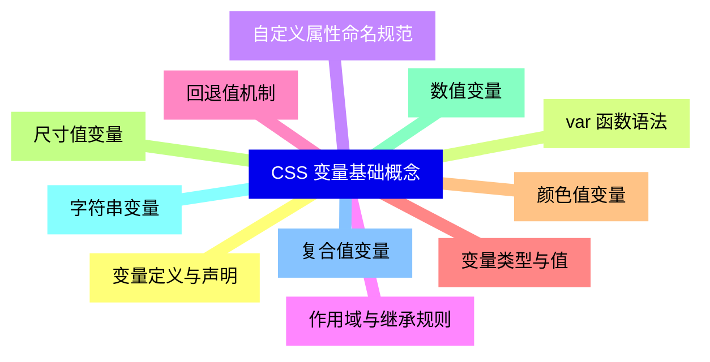
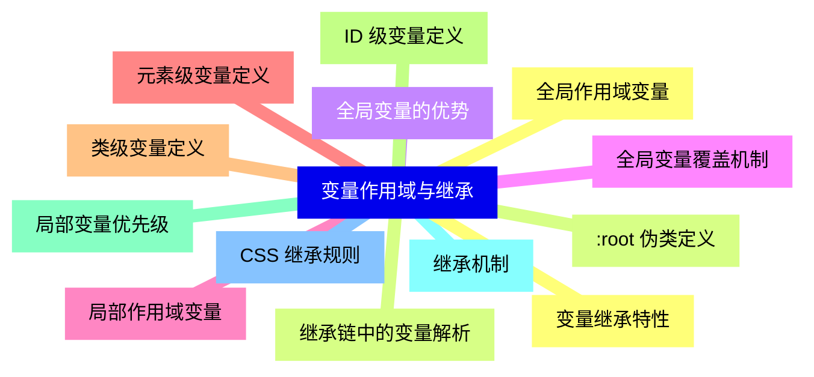
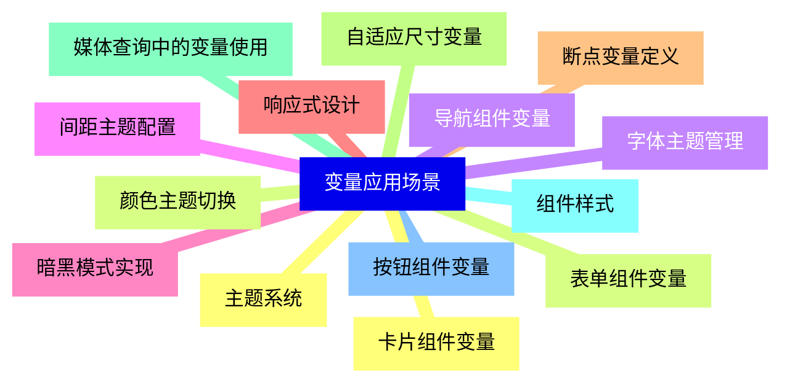
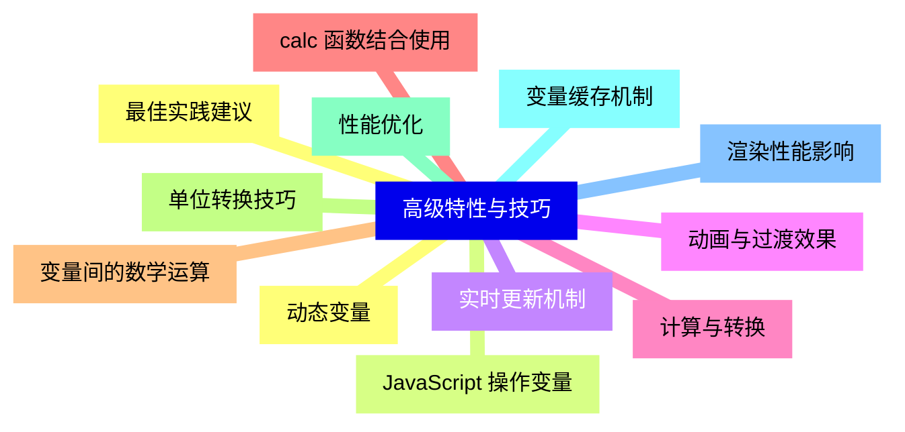
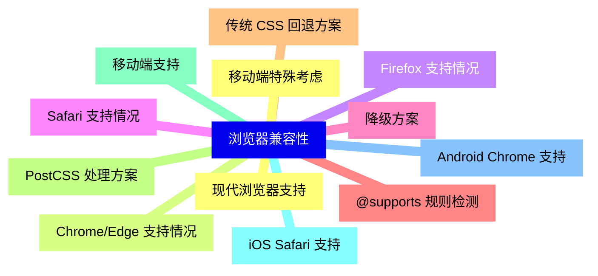
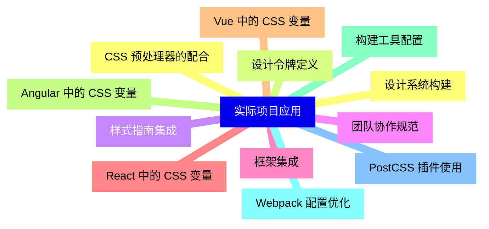
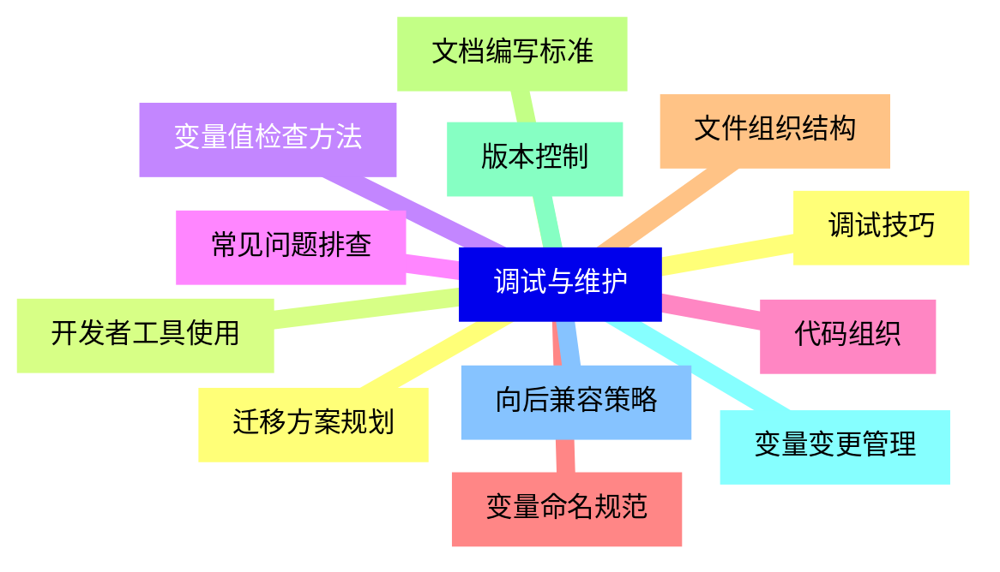


### 1 [CSS 变量基础概念](#1)
#### 1.1 [变量定义与声明](#1)
#### 1.2 [var   函数语法](#1)
#### 1.3 [自定义属性命名规范](#1)
#### 1.4 [作用域与继承规则](#1)
#### 1.5 [回退值机制](#1)
#### 1.6 [变量类型与值](#1)
#### 1.7 [颜色值变量](#1)
#### 1.8 [尺寸值变量](#1)
#### 1.9 [数值变量](#1)
#### 1.10 [字符串变量](#1)
#### 1.11 [复合值变量](#1)
### 2 [变量作用域与继承](#2)
#### 2.1 [全局作用域变量](#2)
#### 2.2 [:root 伪类定义](#2)
#### 2.3 [全局变量的优势](#2)
#### 2.4 [全局变量覆盖机制](#2)
#### 2.5 [局部作用域变量](#2)
#### 2.6 [元素级变量定义](#2)
#### 2.7 [类级变量定义](#2)
#### 2.8 [ID 级变量定义](#2)
#### 2.9 [局部变量优先级](#2)
#### 2.10 [继承机制](#2)
#### 2.11 [CSS 继承规则](#2)
#### 2.12 [变量继承特性](#2)
#### 2.13 [继承链中的变量解析](#2)
### 3 [变量应用场景](#3)
#### 3.1 [主题系统](#3)
#### 3.2 [颜色主题切换](#3)
#### 3.3 [字体主题管理](#3)
#### 3.4 [间距主题配置](#3)
#### 3.5 [暗黑模式实现](#3)
#### 3.6 [响应式设计](#3)
#### 3.7 [断点变量定义](#3)
#### 3.8 [自适应尺寸变量](#3)
#### 3.9 [媒体查询中的变量使用](#3)
#### 3.10 [组件样式](#3)
#### 3.11 [按钮组件变量](#3)
#### 3.12 [卡片组件变量](#3)
#### 3.13 [表单组件变量](#3)
#### 3.14 [导航组件变量](#3)
### 4 [高级特性与技巧](#4)
#### 4.1 [动态变量](#4)
#### 4.2 [JavaScript 操作变量](#4)
#### 4.3 [实时更新机制](#4)
#### 4.4 [动画与过渡效果](#4)
#### 4.5 [计算与转换](#4)
#### 4.6 [calc   函数结合使用](#4)
#### 4.7 [变量间的数学运算](#4)
#### 4.8 [单位转换技巧](#4)
#### 4.9 [性能优化](#4)
#### 4.10 [变量缓存机制](#4)
#### 4.11 [渲染性能影响](#4)
#### 4.12 [最佳实践建议](#4)
### 5 [浏览器兼容性](#5)
#### 5.1 [现代浏览器支持](#5)
#### 5.2 [Chrome/Edge 支持情况](#5)
#### 5.3 [Firefox 支持情况](#5)
#### 5.4 [Safari 支持情况](#5)
#### 5.5 [降级方案](#5)
#### 5.6 [@supports 规则检测](#5)
#### 5.7 [传统 CSS 回退方案](#5)
#### 5.8 [PostCSS 处理方案](#5)
#### 5.9 [移动端支持](#5)
#### 5.10 [iOS Safari 支持](#5)
#### 5.11 [Android Chrome 支持](#5)
#### 5.12 [移动端特殊考虑](#5)
### 6 [实际项目应用](#6)
#### 6.1 [设计系统构建](#6)
#### 6.2 [设计令牌定义](#6)
#### 6.3 [样式指南集成](#6)
#### 6.4 [团队协作规范](#6)
#### 6.5 [框架集成](#6)
#### 6.6 [React 中的 CSS 变量](#6)
#### 6.7 [Vue 中的 CSS 变量](#6)
#### 6.8 [Angular 中的 CSS 变量](#6)
#### 6.9 [构建工具配置](#6)
#### 6.10 [Webpack 配置优化](#6)
#### 6.11 [PostCSS 插件使用](#6)
#### 6.12 [CSS 预处理器的配合](#6)
### 7 [调试与维护](#7)
#### 7.1 [调试技巧](#7)
#### 7.2 [开发者工具使用](#7)
#### 7.3 [变量值检查方法](#7)
#### 7.4 [常见问题排查](#7)
#### 7.5 [代码组织](#7)
#### 7.6 [变量命名规范](#7)
#### 7.7 [文件组织结构](#7)
#### 7.8 [文档编写标准](#7)
#### 7.9 [版本控制](#7)
#### 7.10 [变量变更管理](#7)
#### 7.11 [向后兼容策略](#7)
#### 7.12 [迁移方案规划](#7)




### 1 CSS 变量基础概念

---
### 1 CSS 变量基础概念
___
#### 1.1 变量定义与声明
___
#### 1.2 var   函数语法
___
#### 1.3 自定义属性命名规范
___
#### 1.4 作用域与继承规则
___
#### 1.5 回退值机制
___
#### 1.6 变量类型与值
___
#### 1.7 颜色值变量
___
#### 1.8 尺寸值变量
___
#### 1.9 数值变量
___
#### 1.10 字符串变量
___
#### 1.11 复合值变量
### 2 变量作用域与继承

---
### 2 变量作用域与继承
___
#### 2.1 全局作用域变量
___
#### 2.2 :root 伪类定义
___
#### 2.3 全局变量的优势
___
#### 2.4 全局变量覆盖机制
___
#### 2.5 局部作用域变量
___
#### 2.6 元素级变量定义
___
#### 2.7 类级变量定义
___
#### 2.8 ID 级变量定义
___
#### 2.9 局部变量优先级
___
#### 2.10 继承机制
___
#### 2.11 CSS 继承规则
___
#### 2.12 变量继承特性
___
#### 2.13 继承链中的变量解析
### 3 变量应用场景

---
### 3 变量应用场景
___
#### 3.1 主题系统
___
#### 3.2 颜色主题切换
___
#### 3.3 字体主题管理
___
#### 3.4 间距主题配置
___
#### 3.5 暗黑模式实现
___
#### 3.6 响应式设计
___
#### 3.7 断点变量定义
___
#### 3.8 自适应尺寸变量
___
#### 3.9 媒体查询中的变量使用
___
#### 3.10 组件样式
___
#### 3.11 按钮组件变量
___
#### 3.12 卡片组件变量
___
#### 3.13 表单组件变量
___
#### 3.14 导航组件变量
### 4 高级特性与技巧

---
### 4 高级特性与技巧
___
#### 4.1 动态变量
___
#### 4.2 JavaScript 操作变量
___
#### 4.3 实时更新机制
___
#### 4.4 动画与过渡效果
___
#### 4.5 计算与转换
___
#### 4.6 calc   函数结合使用
___
#### 4.7 变量间的数学运算
___
#### 4.8 单位转换技巧
___
#### 4.9 性能优化
___
#### 4.10 变量缓存机制
___
#### 4.11 渲染性能影响
___
#### 4.12 最佳实践建议
### 5 浏览器兼容性

---
### 5 浏览器兼容性
___
#### 5.1 现代浏览器支持
___
#### 5.2 Chrome/Edge 支持情况
___
#### 5.3 Firefox 支持情况
___
#### 5.4 Safari 支持情况
___
#### 5.5 降级方案
___
#### 5.6 @supports 规则检测
___
#### 5.7 传统 CSS 回退方案
___
#### 5.8 PostCSS 处理方案
___
#### 5.9 移动端支持
___
#### 5.10 iOS Safari 支持
___
#### 5.11 Android Chrome 支持
___
#### 5.12 移动端特殊考虑
### 6 实际项目应用

---
### 6 实际项目应用
___
#### 6.1 设计系统构建
___
#### 6.2 设计令牌定义
___
#### 6.3 样式指南集成
___
#### 6.4 团队协作规范
___
#### 6.5 框架集成
___
#### 6.6 React 中的 CSS 变量
___
#### 6.7 Vue 中的 CSS 变量
___
#### 6.8 Angular 中的 CSS 变量
___
#### 6.9 构建工具配置
___
#### 6.10 Webpack 配置优化
___
#### 6.11 PostCSS 插件使用
___
#### 6.12 CSS 预处理器的配合
### 7 调试与维护

---
### 7 调试与维护
___
#### 7.1 调试技巧
___
#### 7.2 开发者工具使用
___
#### 7.3 变量值检查方法
___
#### 7.4 常见问题排查
___
#### 7.5 代码组织
___
#### 7.6 变量命名规范
___
#### 7.7 文件组织结构
___
#### 7.8 文档编写标准
___
#### 7.9 版本控制
___
#### 7.10 变量变更管理
___
#### 7.11 向后兼容策略
___
#### 7.12 迁移方案规划


### 1 CSS 变量基础概念{#1}

{}

<--->
{}
{}
{}
{}
{}
{}
{}
{}
{}
{}
{}
{}
{}
{}
{}
{}
{}
{}
{}
{}
{}
{}
{}

### 2 变量作用域与继承{#2}

{}
{}
{}
{}
{}
{}
{}
{}
{}
{}
{}
{}
{}
{}
{}
{}
{}
{}
{}
{}
{}
{}
{}
{}
{}
{}
{}
<--->

{}

### 3 变量应用场景{#3}

{}

<--->
{}
{}
{}
{}
{}
{}
{}
{}
{}
{}
{}
{}
{}
{}
{}
{}
{}
{}
{}
{}
{}
{}
{}
{}
{}
{}
{}
{}
{}

### 4 高级特性与技巧{#4}

{}
{}
{}
{}
{}
{}
{}
{}
{}
{}
{}
{}
{}
{}
{}
{}
{}
{}
{}
{}
{}
{}
{}
{}
{}
<--->

{}

### 5 浏览器兼容性{#5}

{}

<--->
{}
{}
{}
{}
{}
{}
{}
{}
{}
{}
{}
{}
{}
{}
{}
{}
{}
{}
{}
{}
{}
{}
{}
{}
{}

### 6 实际项目应用{#6}

{}
{}
{}
{}
{}
{}
{}
{}
{}
{}
{}
{}
{}
{}
{}
{}
{}
{}
{}
{}
{}
{}
{}
{}
{}
<--->

{}

### 7 调试与维护{#7}

{}

<--->
{}
{}
{}
{}
{}
{}
{}
{}
{}
{}
{}
{}
{}
{}
{}
{}
{}
{}
{}
{}
{}
{}
{}
{}
{}
