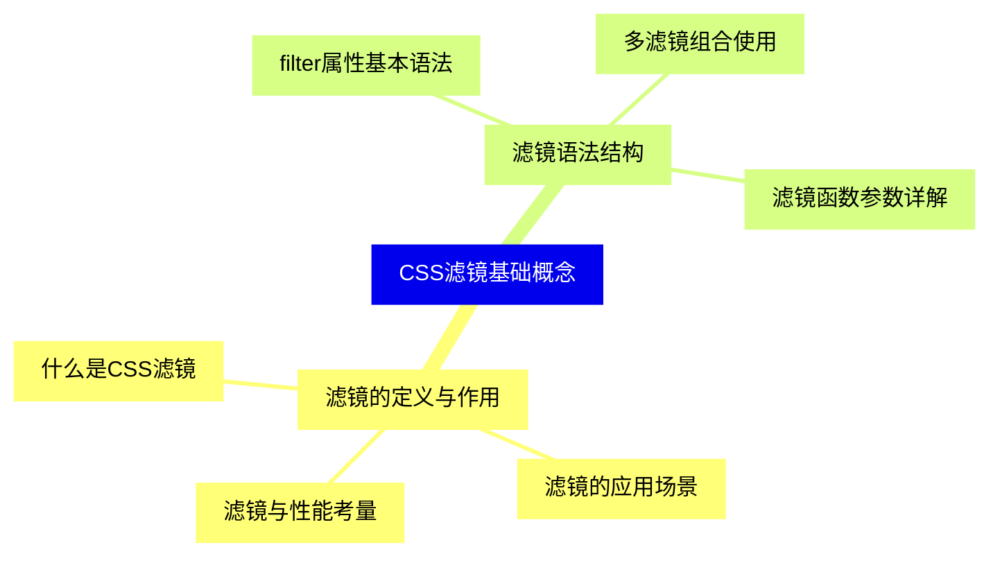
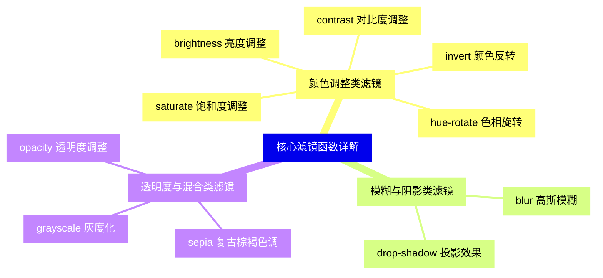
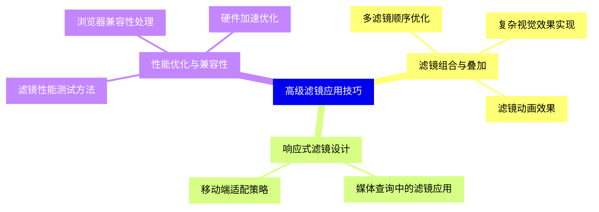
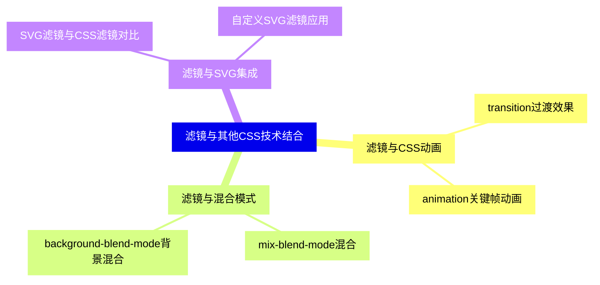
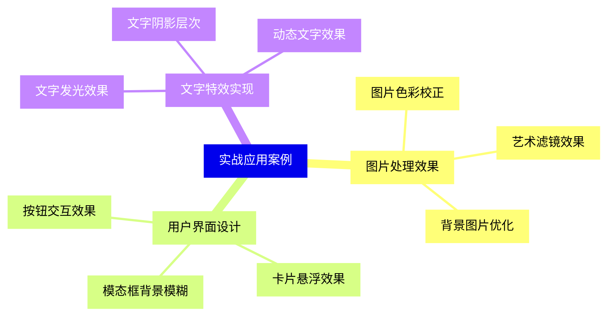
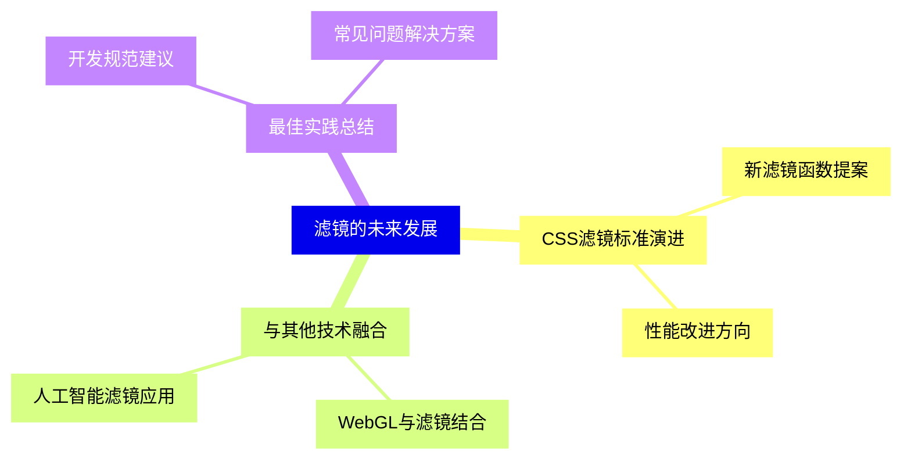


# 1 [CSS滤镜效果知识点目录](#1)
### 1.1 [CSS滤镜基础概念](#1)
#### 1.1.1 [滤镜的定义与作用](#1)
##### 1.1.1.1 [什么是CSS滤镜](#1)
##### 1.1.1.2 [滤镜的应用场景](#1)
##### 1.1.1.3 [滤镜与性能考量](#1)
#### 1.1.2 [滤镜语法结构](#1)
##### 1.1.2.1 [filter属性基本语法](#1)
##### 1.1.2.2 [多滤镜组合使用](#1)
##### 1.1.2.3 [滤镜函数参数详解](#1)
### 1.2 [核心滤镜函数详解](#1)
#### 1.2.1 [颜色调整类滤镜](#1)
##### 1.2.1.1 [brightness   亮度调整](#1)
##### 1.2.1.2 [contrast   对比度调整](#1)
##### 1.2.1.3 [saturate   饱和度调整](#1)
##### 1.2.1.4 [hue-rotate   色相旋转](#1)
##### 1.2.1.5 [invert   颜色反转](#1)
#### 1.2.2 [模糊与阴影类滤镜](#1)
##### 1.2.2.1 [blur   高斯模糊](#1)
##### 1.2.2.2 [drop-shadow   投影效果](#1)
#### 1.2.3 [透明度与混合类滤镜](#1)
##### 1.2.3.1 [opacity   透明度调整](#1)
##### 1.2.3.2 [grayscale   灰度化](#1)
##### 1.2.3.3 [sepia   复古棕褐色调](#1)
### 1.3 [高级滤镜应用技巧](#1)
#### 1.3.1 [滤镜组合与叠加](#1)
##### 1.3.1.1 [多滤镜顺序优化](#1)
##### 1.3.1.2 [复杂视觉效果实现](#1)
##### 1.3.1.3 [滤镜动画效果](#1)
#### 1.3.2 [响应式滤镜设计](#1)
##### 1.3.2.1 [媒体查询中的滤镜应用](#1)
##### 1.3.2.2 [移动端适配策略](#1)
#### 1.3.3 [性能优化与兼容性](#1)
##### 1.3.3.1 [滤镜性能测试方法](#1)
##### 1.3.3.2 [浏览器兼容性处理](#1)
##### 1.3.3.3 [硬件加速优化](#1)
### 1.4 [滤镜与其他CSS技术结合](#1)
#### 1.4.1 [滤镜与CSS动画](#1)
##### 1.4.1.1 [transition过渡效果](#1)
##### 1.4.1.2 [animation关键帧动画](#1)
#### 1.4.2 [滤镜与混合模式](#1)
##### 1.4.2.1 [mix-blend-mode混合](#1)
##### 1.4.2.2 [background-blend-mode背景混合](#1)
#### 1.4.3 [滤镜与SVG集成](#1)
##### 1.4.3.1 [SVG滤镜与CSS滤镜对比](#1)
##### 1.4.3.2 [自定义SVG滤镜应用](#1)
### 1.5 [实战应用案例](#1)
#### 1.5.1 [图片处理效果](#1)
##### 1.5.1.1 [图片色彩校正](#1)
##### 1.5.1.2 [艺术滤镜效果](#1)
##### 1.5.1.3 [背景图片优化](#1)
#### 1.5.2 [用户界面设计](#1)
##### 1.5.2.1 [按钮交互效果](#1)
##### 1.5.2.2 [卡片悬浮效果](#1)
##### 1.5.2.3 [模态框背景模糊](#1)
#### 1.5.3 [文字特效实现](#1)
##### 1.5.3.1 [文字发光效果](#1)
##### 1.5.3.2 [文字阴影层次](#1)
##### 1.5.3.3 [动态文字效果](#1)
### 1.6 [滤镜的未来发展](#1)
#### 1.6.1 [CSS滤镜标准演进](#1)
##### 1.6.1.1 [新滤镜函数提案](#1)
##### 1.6.1.2 [性能改进方向](#1)
#### 1.6.2 [与其他技术融合](#1)
##### 1.6.2.1 [WebGL与滤镜结合](#1)
##### 1.6.2.2 [人工智能滤镜应用](#1)
#### 1.6.3 [最佳实践总结](#1)
##### 1.6.3.1 [开发规范建议](#1)
##### 1.6.3.2 [常见问题解决方案](#1)




# 1 CSS滤镜效果知识点目录

### 1.1 CSS滤镜基础概念

---
### 1.1 CSS滤镜基础概念
___
#### 1.1.1 滤镜的定义与作用
___
##### 1.1.1.1 什么是CSS滤镜
___
##### 1.1.1.2 滤镜的应用场景
___
##### 1.1.1.3 滤镜与性能考量
___
#### 1.1.2 滤镜语法结构
___
##### 1.1.2.1 filter属性基本语法
___
##### 1.1.2.2 多滤镜组合使用
___
##### 1.1.2.3 滤镜函数参数详解
### 1.2 核心滤镜函数详解

---
### 1.2 核心滤镜函数详解
___
#### 1.2.1 颜色调整类滤镜
___
##### 1.2.1.1 brightness   亮度调整
___
##### 1.2.1.2 contrast   对比度调整
___
##### 1.2.1.3 saturate   饱和度调整
___
##### 1.2.1.4 hue-rotate   色相旋转
___
##### 1.2.1.5 invert   颜色反转
___
#### 1.2.2 模糊与阴影类滤镜
___
##### 1.2.2.1 blur   高斯模糊
___
##### 1.2.2.2 drop-shadow   投影效果
___
#### 1.2.3 透明度与混合类滤镜
___
##### 1.2.3.1 opacity   透明度调整
___
##### 1.2.3.2 grayscale   灰度化
___
##### 1.2.3.3 sepia   复古棕褐色调
### 1.3 高级滤镜应用技巧

---
### 1.3 高级滤镜应用技巧
___
#### 1.3.1 滤镜组合与叠加
___
##### 1.3.1.1 多滤镜顺序优化
___
##### 1.3.1.2 复杂视觉效果实现
___
##### 1.3.1.3 滤镜动画效果
___
#### 1.3.2 响应式滤镜设计
___
##### 1.3.2.1 媒体查询中的滤镜应用
___
##### 1.3.2.2 移动端适配策略
___
#### 1.3.3 性能优化与兼容性
___
##### 1.3.3.1 滤镜性能测试方法
___
##### 1.3.3.2 浏览器兼容性处理
___
##### 1.3.3.3 硬件加速优化
### 1.4 滤镜与其他CSS技术结合

---
### 1.4 滤镜与其他CSS技术结合
___
#### 1.4.1 滤镜与CSS动画
___
##### 1.4.1.1 transition过渡效果
___
##### 1.4.1.2 animation关键帧动画
___
#### 1.4.2 滤镜与混合模式
___
##### 1.4.2.1 mix-blend-mode混合
___
##### 1.4.2.2 background-blend-mode背景混合
___
#### 1.4.3 滤镜与SVG集成
___
##### 1.4.3.1 SVG滤镜与CSS滤镜对比
___
##### 1.4.3.2 自定义SVG滤镜应用
### 1.5 实战应用案例

---
### 1.5 实战应用案例
___
#### 1.5.1 图片处理效果
___
##### 1.5.1.1 图片色彩校正
___
##### 1.5.1.2 艺术滤镜效果
___
##### 1.5.1.3 背景图片优化
___
#### 1.5.2 用户界面设计
___
##### 1.5.2.1 按钮交互效果
___
##### 1.5.2.2 卡片悬浮效果
___
##### 1.5.2.3 模态框背景模糊
___
#### 1.5.3 文字特效实现
___
##### 1.5.3.1 文字发光效果
___
##### 1.5.3.2 文字阴影层次
___
##### 1.5.3.3 动态文字效果
### 1.6 滤镜的未来发展

---
### 1.6 滤镜的未来发展
___
#### 1.6.1 CSS滤镜标准演进
___
##### 1.6.1.1 新滤镜函数提案
___
##### 1.6.1.2 性能改进方向
___
#### 1.6.2 与其他技术融合
___
##### 1.6.2.1 WebGL与滤镜结合
___
##### 1.6.2.2 人工智能滤镜应用
___
#### 1.6.3 最佳实践总结
___
##### 1.6.3.1 开发规范建议
___
##### 1.6.3.2 常见问题解决方案


# 1 CSS滤镜效果知识点目录{#1}

### 1.1 CSS滤镜基础概念{#1}

{}

<--->
{}
{}
{}
{}
{}
{}
{}
{}
{}
{}
{}
{}
{}
{}
{}
{}
{}

### 1.2 核心滤镜函数详解{#1}

{}
{}
{}
{}
{}
{}
{}
{}
{}
{}
{}
{}
{}
{}
{}
{}
{}
{}
{}
{}
{}
{}
{}
{}
{}
{}
{}
<--->

{}

### 1.3 高级滤镜应用技巧{#1}

{}

<--->
{}
{}
{}
{}
{}
{}
{}
{}
{}
{}
{}
{}
{}
{}
{}
{}
{}
{}
{}
{}
{}
{}
{}

### 1.4 滤镜与其他CSS技术结合{#1}

{}
{}
{}
{}
{}
{}
{}
{}
{}
{}
{}
{}
{}
{}
{}
{}
{}
{}
{}
<--->

{}

### 1.5 实战应用案例{#1}

{}

<--->
{}
{}
{}
{}
{}
{}
{}
{}
{}
{}
{}
{}
{}
{}
{}
{}
{}
{}
{}
{}
{}
{}
{}
{}
{}

### 1.6 滤镜的未来发展{#1}

{}
{}
{}
{}
{}
{}
{}
{}
{}
{}
{}
{}
{}
{}
{}
{}
{}
{}
{}
<--->

{}
