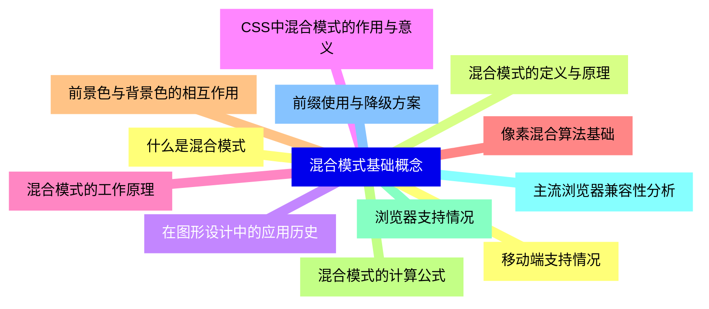
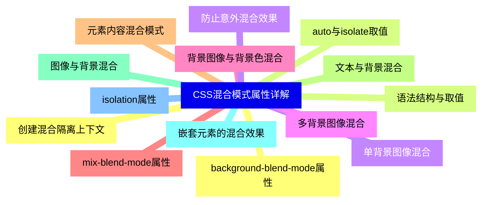
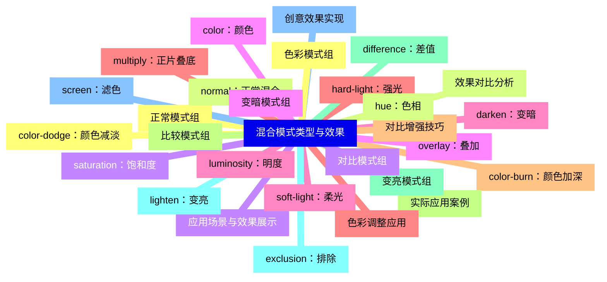
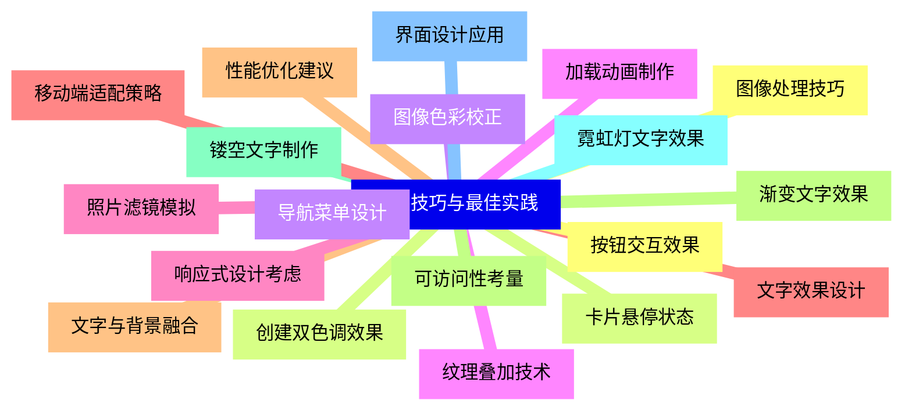
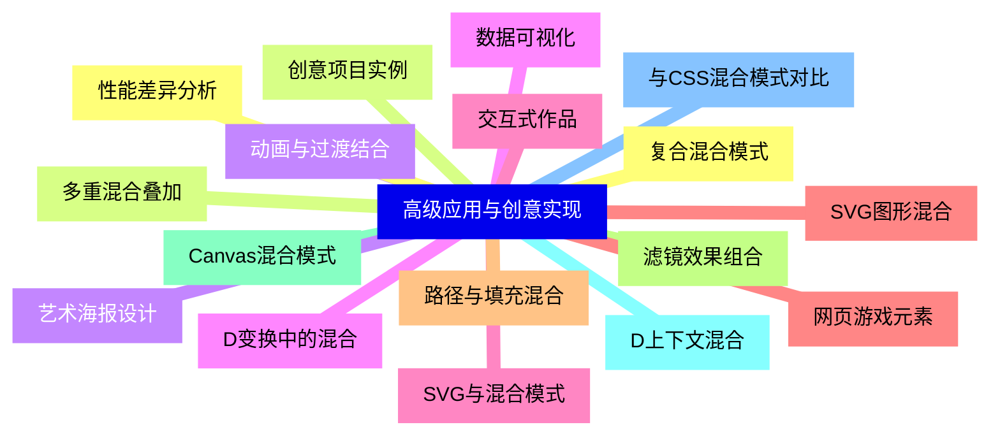
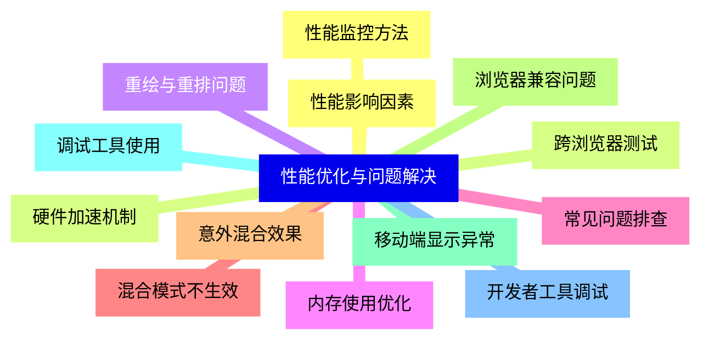
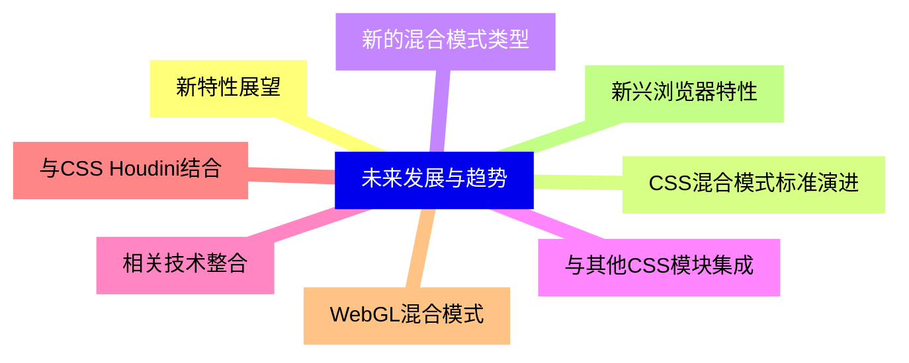


### 1 [混合模式基础概念](#1)
#### 1.1 [什么是混合模式](#1)
#### 1.2 [混合模式的定义与原理](#1)
#### 1.3 [在图形设计中的应用历史](#1)
#### 1.4 [CSS中混合模式的作用与意义](#1)
#### 1.5 [混合模式的工作原理](#1)
#### 1.6 [像素混合算法基础](#1)
#### 1.7 [前景色与背景色的相互作用](#1)
#### 1.8 [混合模式的计算公式](#1)
#### 1.9 [浏览器支持情况](#1)
#### 1.10 [主流浏览器兼容性分析](#1)
#### 1.11 [前缀使用与降级方案](#1)
#### 1.12 [移动端支持情况](#1)
### 2 [CSS混合模式属性详解](#2)
#### 2.1 [background-blend-mode属性](#2)
#### 2.2 [语法结构与取值](#2)
#### 2.3 [单背景图像混合](#2)
#### 2.4 [多背景图像混合](#2)
#### 2.5 [背景图像与背景色混合](#2)
#### 2.6 [mix-blend-mode属性](#2)
#### 2.7 [元素内容混合模式](#2)
#### 2.8 [文本与背景混合](#2)
#### 2.9 [图像与背景混合](#2)
#### 2.10 [嵌套元素的混合效果](#2)
#### 2.11 [isolation属性](#2)
#### 2.12 [创建混合隔离上下文](#2)
#### 2.13 [auto与isolate取值](#2)
#### 2.14 [防止意外混合效果](#2)
### 3 [混合模式类型与效果](#3)
#### 3.1 [正常模式组](#3)
#### 3.2 [normal：正常混合](#3)
#### 3.3 [应用场景与效果展示](#3)
#### 3.4 [变暗模式组](#3)
#### 3.5 [darken：变暗](#3)
#### 3.6 [multiply：正片叠底](#3)
#### 3.7 [color-burn：颜色加深](#3)
#### 3.8 [实际应用案例](#3)
#### 3.9 [变亮模式组](#3)
#### 3.10 [lighten：变亮](#3)
#### 3.11 [screen：滤色](#3)
#### 3.12 [color-dodge：颜色减淡](#3)
#### 3.13 [效果对比分析](#3)
#### 3.14 [对比模式组](#3)
#### 3.15 [overlay：叠加](#3)
#### 3.16 [soft-light：柔光](#3)
#### 3.17 [hard-light：强光](#3)
#### 3.18 [对比增强技巧](#3)
#### 3.19 [比较模式组](#3)
#### 3.20 [difference：差值](#3)
#### 3.21 [exclusion：排除](#3)
#### 3.22 [创意效果实现](#3)
#### 3.23 [色彩模式组](#3)
#### 3.24 [hue：色相](#3)
#### 3.25 [saturation：饱和度](#3)
#### 3.26 [color：颜色](#3)
#### 3.27 [luminosity：明度](#3)
#### 3.28 [色彩调整应用](#3)
### 4 [实用技巧与最佳实践](#4)
#### 4.1 [图像处理技巧](#4)
#### 4.2 [创建双色调效果](#4)
#### 4.3 [图像色彩校正](#4)
#### 4.4 [纹理叠加技术](#4)
#### 4.5 [照片滤镜模拟](#4)
#### 4.6 [文字效果设计](#4)
#### 4.7 [文字与背景融合](#4)
#### 4.8 [渐变文字效果](#4)
#### 4.9 [镂空文字制作](#4)
#### 4.10 [霓虹灯文字效果](#4)
#### 4.11 [界面设计应用](#4)
#### 4.12 [按钮交互效果](#4)
#### 4.13 [卡片悬停状态](#4)
#### 4.14 [导航菜单设计](#4)
#### 4.15 [加载动画制作](#4)
#### 4.16 [响应式设计考虑](#4)
#### 4.17 [移动端适配策略](#4)
#### 4.18 [性能优化建议](#4)
#### 4.19 [可访问性考量](#4)
### 5 [高级应用与创意实现](#5)
#### 5.1 [复合混合模式](#5)
#### 5.2 [多重混合叠加](#5)
#### 5.3 [动画与过渡结合](#5)
#### 5.4 [D变换中的混合](#5)
#### 5.5 [SVG与混合模式](#5)
#### 5.6 [SVG图形混合](#5)
#### 5.7 [路径与填充混合](#5)
#### 5.8 [滤镜效果组合](#5)
#### 5.9 [Canvas混合模式](#5)
#### 5.10 [D上下文混合](#5)
#### 5.11 [与CSS混合模式对比](#5)
#### 5.12 [性能差异分析](#5)
#### 5.13 [创意项目实例](#5)
#### 5.14 [艺术海报设计](#5)
#### 5.15 [数据可视化](#5)
#### 5.16 [交互式作品](#5)
#### 5.17 [网页游戏元素](#5)
### 6 [性能优化与问题解决](#6)
#### 6.1 [性能影响因素](#6)
#### 6.2 [硬件加速机制](#6)
#### 6.3 [重绘与重排问题](#6)
#### 6.4 [内存使用优化](#6)
#### 6.5 [常见问题排查](#6)
#### 6.6 [混合模式不生效](#6)
#### 6.7 [意外混合效果](#6)
#### 6.8 [浏览器兼容问题](#6)
#### 6.9 [移动端显示异常](#6)
#### 6.10 [调试工具使用](#6)
#### 6.11 [开发者工具调试](#6)
#### 6.12 [性能监控方法](#6)
#### 6.13 [跨浏览器测试](#6)
### 7 [未来发展与趋势](#7)
#### 7.1 [新特性展望](#7)
#### 7.2 [CSS混合模式标准演进](#7)
#### 7.3 [新的混合模式类型](#7)
#### 7.4 [与其他CSS模块集成](#7)
#### 7.5 [相关技术整合](#7)
#### 7.6 [与CSS Houdini结合](#7)
#### 7.7 [WebGL混合模式](#7)
#### 7.8 [新兴浏览器特性](#7)




### 1 混合模式基础概念

---
### 1 混合模式基础概念
___
#### 1.1 什么是混合模式
___
#### 1.2 混合模式的定义与原理
___
#### 1.3 在图形设计中的应用历史
___
#### 1.4 CSS中混合模式的作用与意义
___
#### 1.5 混合模式的工作原理
___
#### 1.6 像素混合算法基础
___
#### 1.7 前景色与背景色的相互作用
___
#### 1.8 混合模式的计算公式
___
#### 1.9 浏览器支持情况
___
#### 1.10 主流浏览器兼容性分析
___
#### 1.11 前缀使用与降级方案
___
#### 1.12 移动端支持情况
### 2 CSS混合模式属性详解

---
### 2 CSS混合模式属性详解
___
#### 2.1 background-blend-mode属性
___
#### 2.2 语法结构与取值
___
#### 2.3 单背景图像混合
___
#### 2.4 多背景图像混合
___
#### 2.5 背景图像与背景色混合
___
#### 2.6 mix-blend-mode属性
___
#### 2.7 元素内容混合模式
___
#### 2.8 文本与背景混合
___
#### 2.9 图像与背景混合
___
#### 2.10 嵌套元素的混合效果
___
#### 2.11 isolation属性
___
#### 2.12 创建混合隔离上下文
___
#### 2.13 auto与isolate取值
___
#### 2.14 防止意外混合效果
### 3 混合模式类型与效果

---
### 3 混合模式类型与效果
___
#### 3.1 正常模式组
___
#### 3.2 normal：正常混合
___
#### 3.3 应用场景与效果展示
___
#### 3.4 变暗模式组
___
#### 3.5 darken：变暗
___
#### 3.6 multiply：正片叠底
___
#### 3.7 color-burn：颜色加深
___
#### 3.8 实际应用案例
___
#### 3.9 变亮模式组
___
#### 3.10 lighten：变亮
___
#### 3.11 screen：滤色
___
#### 3.12 color-dodge：颜色减淡
___
#### 3.13 效果对比分析
___
#### 3.14 对比模式组
___
#### 3.15 overlay：叠加
___
#### 3.16 soft-light：柔光
___
#### 3.17 hard-light：强光
___
#### 3.18 对比增强技巧
___
#### 3.19 比较模式组
___
#### 3.20 difference：差值
___
#### 3.21 exclusion：排除
___
#### 3.22 创意效果实现
___
#### 3.23 色彩模式组
___
#### 3.24 hue：色相
___
#### 3.25 saturation：饱和度
___
#### 3.26 color：颜色
___
#### 3.27 luminosity：明度
___
#### 3.28 色彩调整应用
### 4 实用技巧与最佳实践

---
### 4 实用技巧与最佳实践
___
#### 4.1 图像处理技巧
___
#### 4.2 创建双色调效果
___
#### 4.3 图像色彩校正
___
#### 4.4 纹理叠加技术
___
#### 4.5 照片滤镜模拟
___
#### 4.6 文字效果设计
___
#### 4.7 文字与背景融合
___
#### 4.8 渐变文字效果
___
#### 4.9 镂空文字制作
___
#### 4.10 霓虹灯文字效果
___
#### 4.11 界面设计应用
___
#### 4.12 按钮交互效果
___
#### 4.13 卡片悬停状态
___
#### 4.14 导航菜单设计
___
#### 4.15 加载动画制作
___
#### 4.16 响应式设计考虑
___
#### 4.17 移动端适配策略
___
#### 4.18 性能优化建议
___
#### 4.19 可访问性考量
### 5 高级应用与创意实现

---
### 5 高级应用与创意实现
___
#### 5.1 复合混合模式
___
#### 5.2 多重混合叠加
___
#### 5.3 动画与过渡结合
___
#### 5.4 D变换中的混合
___
#### 5.5 SVG与混合模式
___
#### 5.6 SVG图形混合
___
#### 5.7 路径与填充混合
___
#### 5.8 滤镜效果组合
___
#### 5.9 Canvas混合模式
___
#### 5.10 D上下文混合
___
#### 5.11 与CSS混合模式对比
___
#### 5.12 性能差异分析
___
#### 5.13 创意项目实例
___
#### 5.14 艺术海报设计
___
#### 5.15 数据可视化
___
#### 5.16 交互式作品
___
#### 5.17 网页游戏元素
### 6 性能优化与问题解决

---
### 6 性能优化与问题解决
___
#### 6.1 性能影响因素
___
#### 6.2 硬件加速机制
___
#### 6.3 重绘与重排问题
___
#### 6.4 内存使用优化
___
#### 6.5 常见问题排查
___
#### 6.6 混合模式不生效
___
#### 6.7 意外混合效果
___
#### 6.8 浏览器兼容问题
___
#### 6.9 移动端显示异常
___
#### 6.10 调试工具使用
___
#### 6.11 开发者工具调试
___
#### 6.12 性能监控方法
___
#### 6.13 跨浏览器测试
### 7 未来发展与趋势

---
### 7 未来发展与趋势
___
#### 7.1 新特性展望
___
#### 7.2 CSS混合模式标准演进
___
#### 7.3 新的混合模式类型
___
#### 7.4 与其他CSS模块集成
___
#### 7.5 相关技术整合
___
#### 7.6 与CSS Houdini结合
___
#### 7.7 WebGL混合模式
___
#### 7.8 新兴浏览器特性


### 1 混合模式基础概念{#1}

{}

<--->
{}
{}
{}
{}
{}
{}
{}
{}
{}
{}
{}
{}
{}
{}
{}
{}
{}
{}
{}
{}
{}
{}
{}
{}
{}

### 2 CSS混合模式属性详解{#2}

{}
{}
{}
{}
{}
{}
{}
{}
{}
{}
{}
{}
{}
{}
{}
{}
{}
{}
{}
{}
{}
{}
{}
{}
{}
{}
{}
{}
{}
<--->

{}

### 3 混合模式类型与效果{#3}

{}

<--->
{}
{}
{}
{}
{}
{}
{}
{}
{}
{}
{}
{}
{}
{}
{}
{}
{}
{}
{}
{}
{}
{}
{}
{}
{}
{}
{}
{}
{}
{}
{}
{}
{}
{}
{}
{}
{}
{}
{}
{}
{}
{}
{}
{}
{}
{}
{}
{}
{}
{}
{}
{}
{}
{}
{}
{}
{}

### 4 实用技巧与最佳实践{#4}

{}
{}
{}
{}
{}
{}
{}
{}
{}
{}
{}
{}
{}
{}
{}
{}
{}
{}
{}
{}
{}
{}
{}
{}
{}
{}
{}
{}
{}
{}
{}
{}
{}
{}
{}
{}
{}
{}
{}
<--->

{}

### 5 高级应用与创意实现{#5}

{}

<--->
{}
{}
{}
{}
{}
{}
{}
{}
{}
{}
{}
{}
{}
{}
{}
{}
{}
{}
{}
{}
{}
{}
{}
{}
{}
{}
{}
{}
{}
{}
{}
{}
{}
{}
{}

### 6 性能优化与问题解决{#6}

{}
{}
{}
{}
{}
{}
{}
{}
{}
{}
{}
{}
{}
{}
{}
{}
{}
{}
{}
{}
{}
{}
{}
{}
{}
{}
{}
<--->

{}

### 7 未来发展与趋势{#7}

{}

<--->
{}
{}
{}
{}
{}
{}
{}
{}
{}
{}
{}
{}
{}
{}
{}
{}
{}
