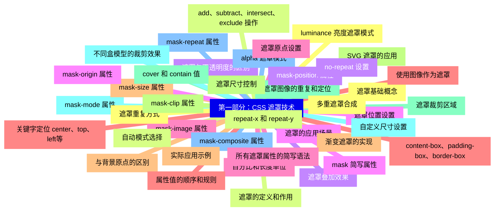
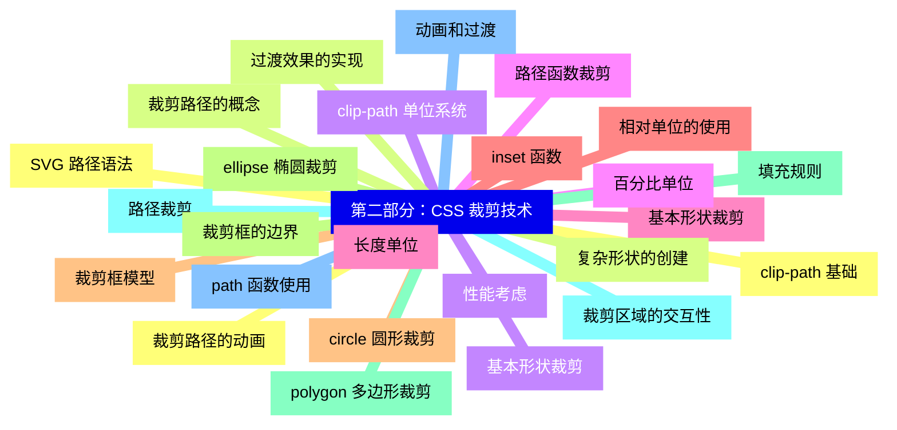
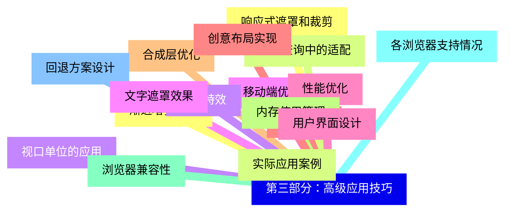
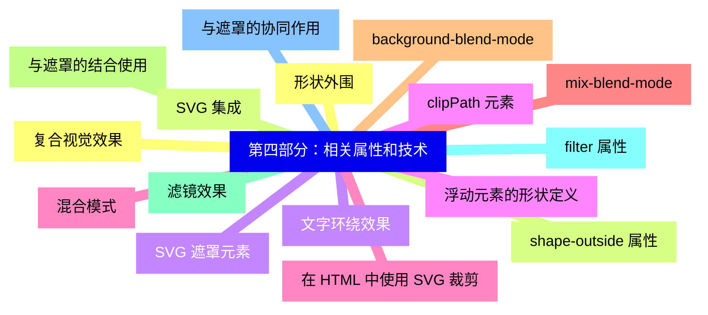
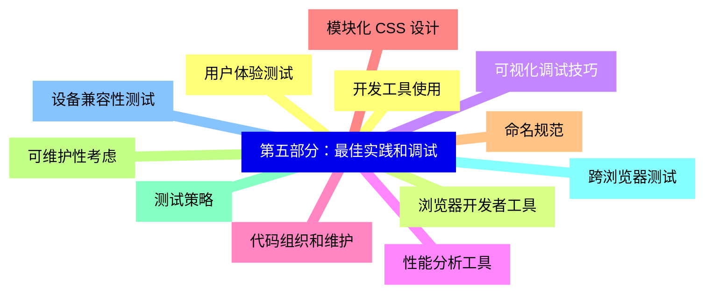


### 1 [第一部分：CSS 遮罩技术](#1)
#### 1.1 [遮罩基础概念](#1)
#### 1.2 [遮罩的定义和作用](#1)
#### 1.3 [遮罩与不透明度的区别](#1)
#### 1.4 [遮罩的应用场景](#1)
#### 1.5 [mask-image 属性](#1)
#### 1.6 [使用图像作为遮罩](#1)
#### 1.7 [渐变遮罩的实现](#1)
#### 1.8 [SVG 遮罩的应用](#1)
#### 1.9 [遮罩图像的重复和定位](#1)
#### 1.10 [mask-mode 属性](#1)
#### 1.11 [alpha 遮罩模式](#1)
#### 1.12 [luminance 亮度遮罩模式](#1)
#### 1.13 [自动模式选择](#1)
#### 1.14 [mask-position 属性](#1)
#### 1.15 [遮罩位置设置](#1)
#### 1.16 [百分比和长度单位](#1)
#### 1.17 [关键字定位 center、top、left等](#1)
#### 1.18 [mask-size 属性](#1)
#### 1.19 [遮罩尺寸控制](#1)
#### 1.20 [cover 和 contain 值](#1)
#### 1.21 [自定义尺寸设置](#1)
#### 1.22 [mask-repeat 属性](#1)
#### 1.23 [遮罩重复方式](#1)
#### 1.24 [repeat-x 和 repeat-y](#1)
#### 1.25 [no-repeat 设置](#1)
#### 1.26 [mask-origin 属性](#1)
#### 1.27 [遮罩原点设置](#1)
#### 1.28 [content-box、padding-box、border-box](#1)
#### 1.29 [与背景原点的区别](#1)
#### 1.30 [mask-clip 属性](#1)
#### 1.31 [遮罩裁剪区域](#1)
#### 1.32 [不同盒模型的裁剪效果](#1)
#### 1.33 [mask-composite 属性](#1)
#### 1.34 [多重遮罩合成](#1)
#### 1.35 [add、subtract、intersect、exclude 操作](#1)
#### 1.36 [遮罩叠加效果](#1)
#### 1.37 [mask 简写属性](#1)
#### 1.38 [所有遮罩属性的简写语法](#1)
#### 1.39 [属性值的顺序和规则](#1)
#### 1.40 [实际应用示例](#1)
### 2 [第二部分：CSS 裁剪技术](#2)
#### 2.1 [clip-path 基础](#2)
#### 2.2 [裁剪路径的概念](#2)
#### 2.3 [基本形状裁剪](#2)
#### 2.4 [路径函数裁剪](#2)
#### 2.5 [基本形状裁剪](#2)
#### 2.6 [inset   函数](#2)
#### 2.7 [circle   圆形裁剪](#2)
#### 2.8 [ellipse   椭圆裁剪](#2)
#### 2.9 [polygon   多边形裁剪](#2)
#### 2.10 [路径裁剪](#2)
#### 2.11 [path   函数使用](#2)
#### 2.12 [SVG 路径语法](#2)
#### 2.13 [复杂形状的创建](#2)
#### 2.14 [clip-path 单位系统](#2)
#### 2.15 [百分比单位](#2)
#### 2.16 [长度单位](#2)
#### 2.17 [相对单位的使用](#2)
#### 2.18 [裁剪框模型](#2)
#### 2.19 [裁剪框的边界](#2)
#### 2.20 [填充规则](#2)
#### 2.21 [裁剪区域的交互性](#2)
#### 2.22 [动画和过渡](#2)
#### 2.23 [裁剪路径的动画](#2)
#### 2.24 [过渡效果的实现](#2)
#### 2.25 [性能考虑](#2)
### 3 [第三部分：高级应用技巧](#3)
#### 3.1 [响应式遮罩和裁剪](#3)
#### 3.2 [媒体查询中的适配](#3)
#### 3.3 [视口单位的应用](#3)
#### 3.4 [移动端优化](#3)
#### 3.5 [性能优化](#3)
#### 3.6 [硬件加速](#3)
#### 3.7 [合成层优化](#3)
#### 3.8 [内存使用管理](#3)
#### 3.9 [浏览器兼容性](#3)
#### 3.10 [各浏览器支持情况](#3)
#### 3.11 [回退方案设计](#3)
#### 3.12 [渐进增强策略](#3)
#### 3.13 [实际应用案例](#3)
#### 3.14 [图像特效](#3)
#### 3.15 [文字遮罩效果](#3)
#### 3.16 [用户界面设计](#3)
#### 3.17 [创意布局实现](#3)
### 4 [第四部分：相关属性和技术](#4)
#### 4.1 [形状外围](#4)
#### 4.2 [shape-outside 属性](#4)
#### 4.3 [文字环绕效果](#4)
#### 4.4 [浮动元素的形状定义](#4)
#### 4.5 [混合模式](#4)
#### 4.6 [mix-blend-mode](#4)
#### 4.7 [background-blend-mode](#4)
#### 4.8 [与遮罩的结合使用](#4)
#### 4.9 [滤镜效果](#4)
#### 4.10 [filter 属性](#4)
#### 4.11 [与遮罩的协同作用](#4)
#### 4.12 [复合视觉效果](#4)
#### 4.13 [SVG 集成](#4)
#### 4.14 [SVG 遮罩元素](#4)
#### 4.15 [clipPath 元素](#4)
#### 4.16 [在 HTML 中使用 SVG 裁剪](#4)
### 5 [第五部分：最佳实践和调试](#5)
#### 5.1 [开发工具使用](#5)
#### 5.2 [浏览器开发者工具](#5)
#### 5.3 [可视化调试技巧](#5)
#### 5.4 [性能分析工具](#5)
#### 5.5 [代码组织和维护](#5)
#### 5.6 [模块化 CSS 设计](#5)
#### 5.7 [命名规范](#5)
#### 5.8 [可维护性考虑](#5)
#### 5.9 [测试策略](#5)
#### 5.10 [跨浏览器测试](#5)
#### 5.11 [设备兼容性测试](#5)
#### 5.12 [用户体验测试](#5)




### 1 第一部分：CSS 遮罩技术

---
### 1 第一部分：CSS 遮罩技术
___
#### 1.1 遮罩基础概念
___
#### 1.2 遮罩的定义和作用
___
#### 1.3 遮罩与不透明度的区别
___
#### 1.4 遮罩的应用场景
___
#### 1.5 mask-image 属性
___
#### 1.6 使用图像作为遮罩
___
#### 1.7 渐变遮罩的实现
___
#### 1.8 SVG 遮罩的应用
___
#### 1.9 遮罩图像的重复和定位
___
#### 1.10 mask-mode 属性
___
#### 1.11 alpha 遮罩模式
___
#### 1.12 luminance 亮度遮罩模式
___
#### 1.13 自动模式选择
___
#### 1.14 mask-position 属性
___
#### 1.15 遮罩位置设置
___
#### 1.16 百分比和长度单位
___
#### 1.17 关键字定位 center、top、left等
___
#### 1.18 mask-size 属性
___
#### 1.19 遮罩尺寸控制
___
#### 1.20 cover 和 contain 值
___
#### 1.21 自定义尺寸设置
___
#### 1.22 mask-repeat 属性
___
#### 1.23 遮罩重复方式
___
#### 1.24 repeat-x 和 repeat-y
___
#### 1.25 no-repeat 设置
___
#### 1.26 mask-origin 属性
___
#### 1.27 遮罩原点设置
___
#### 1.28 content-box、padding-box、border-box
___
#### 1.29 与背景原点的区别
___
#### 1.30 mask-clip 属性
___
#### 1.31 遮罩裁剪区域
___
#### 1.32 不同盒模型的裁剪效果
___
#### 1.33 mask-composite 属性
___
#### 1.34 多重遮罩合成
___
#### 1.35 add、subtract、intersect、exclude 操作
___
#### 1.36 遮罩叠加效果
___
#### 1.37 mask 简写属性
___
#### 1.38 所有遮罩属性的简写语法
___
#### 1.39 属性值的顺序和规则
___
#### 1.40 实际应用示例
### 2 第二部分：CSS 裁剪技术

---
### 2 第二部分：CSS 裁剪技术
___
#### 2.1 clip-path 基础
___
#### 2.2 裁剪路径的概念
___
#### 2.3 基本形状裁剪
___
#### 2.4 路径函数裁剪
___
#### 2.5 基本形状裁剪
___
#### 2.6 inset   函数
___
#### 2.7 circle   圆形裁剪
___
#### 2.8 ellipse   椭圆裁剪
___
#### 2.9 polygon   多边形裁剪
___
#### 2.10 路径裁剪
___
#### 2.11 path   函数使用
___
#### 2.12 SVG 路径语法
___
#### 2.13 复杂形状的创建
___
#### 2.14 clip-path 单位系统
___
#### 2.15 百分比单位
___
#### 2.16 长度单位
___
#### 2.17 相对单位的使用
___
#### 2.18 裁剪框模型
___
#### 2.19 裁剪框的边界
___
#### 2.20 填充规则
___
#### 2.21 裁剪区域的交互性
___
#### 2.22 动画和过渡
___
#### 2.23 裁剪路径的动画
___
#### 2.24 过渡效果的实现
___
#### 2.25 性能考虑
### 3 第三部分：高级应用技巧

---
### 3 第三部分：高级应用技巧
___
#### 3.1 响应式遮罩和裁剪
___
#### 3.2 媒体查询中的适配
___
#### 3.3 视口单位的应用
___
#### 3.4 移动端优化
___
#### 3.5 性能优化
___
#### 3.6 硬件加速
___
#### 3.7 合成层优化
___
#### 3.8 内存使用管理
___
#### 3.9 浏览器兼容性
___
#### 3.10 各浏览器支持情况
___
#### 3.11 回退方案设计
___
#### 3.12 渐进增强策略
___
#### 3.13 实际应用案例
___
#### 3.14 图像特效
___
#### 3.15 文字遮罩效果
___
#### 3.16 用户界面设计
___
#### 3.17 创意布局实现
### 4 第四部分：相关属性和技术

---
### 4 第四部分：相关属性和技术
___
#### 4.1 形状外围
___
#### 4.2 shape-outside 属性
___
#### 4.3 文字环绕效果
___
#### 4.4 浮动元素的形状定义
___
#### 4.5 混合模式
___
#### 4.6 mix-blend-mode
___
#### 4.7 background-blend-mode
___
#### 4.8 与遮罩的结合使用
___
#### 4.9 滤镜效果
___
#### 4.10 filter 属性
___
#### 4.11 与遮罩的协同作用
___
#### 4.12 复合视觉效果
___
#### 4.13 SVG 集成
___
#### 4.14 SVG 遮罩元素
___
#### 4.15 clipPath 元素
___
#### 4.16 在 HTML 中使用 SVG 裁剪
### 5 第五部分：最佳实践和调试

---
### 5 第五部分：最佳实践和调试
___
#### 5.1 开发工具使用
___
#### 5.2 浏览器开发者工具
___
#### 5.3 可视化调试技巧
___
#### 5.4 性能分析工具
___
#### 5.5 代码组织和维护
___
#### 5.6 模块化 CSS 设计
___
#### 5.7 命名规范
___
#### 5.8 可维护性考虑
___
#### 5.9 测试策略
___
#### 5.10 跨浏览器测试
___
#### 5.11 设备兼容性测试
___
#### 5.12 用户体验测试


### 1 第一部分：CSS 遮罩技术{#1}

{}

<--->
{}
{}
{}
{}
{}
{}
{}
{}
{}
{}
{}
{}
{}
{}
{}
{}
{}
{}
{}
{}
{}
{}
{}
{}
{}
{}
{}
{}
{}
{}
{}
{}
{}
{}
{}
{}
{}
{}
{}
{}
{}
{}
{}
{}
{}
{}
{}
{}
{}
{}
{}
{}
{}
{}
{}
{}
{}
{}
{}
{}
{}
{}
{}
{}
{}
{}
{}
{}
{}
{}
{}
{}
{}
{}
{}
{}
{}
{}
{}
{}
{}

### 2 第二部分：CSS 裁剪技术{#2}

{}
{}
{}
{}
{}
{}
{}
{}
{}
{}
{}
{}
{}
{}
{}
{}
{}
{}
{}
{}
{}
{}
{}
{}
{}
{}
{}
{}
{}
{}
{}
{}
{}
{}
{}
{}
{}
{}
{}
{}
{}
{}
{}
{}
{}
{}
{}
{}
{}
{}
{}
<--->

{}

### 3 第三部分：高级应用技巧{#3}

{}

<--->
{}
{}
{}
{}
{}
{}
{}
{}
{}
{}
{}
{}
{}
{}
{}
{}
{}
{}
{}
{}
{}
{}
{}
{}
{}
{}
{}
{}
{}
{}
{}
{}
{}
{}
{}

### 4 第四部分：相关属性和技术{#4}

{}
{}
{}
{}
{}
{}
{}
{}
{}
{}
{}
{}
{}
{}
{}
{}
{}
{}
{}
{}
{}
{}
{}
{}
{}
{}
{}
{}
{}
{}
{}
{}
{}
<--->

{}

### 5 第五部分：最佳实践和调试{#5}

{}

<--->
{}
{}
{}
{}
{}
{}
{}
{}
{}
{}
{}
{}
{}
{}
{}
{}
{}
{}
{}
{}
{}
{}
{}
{}
{}
