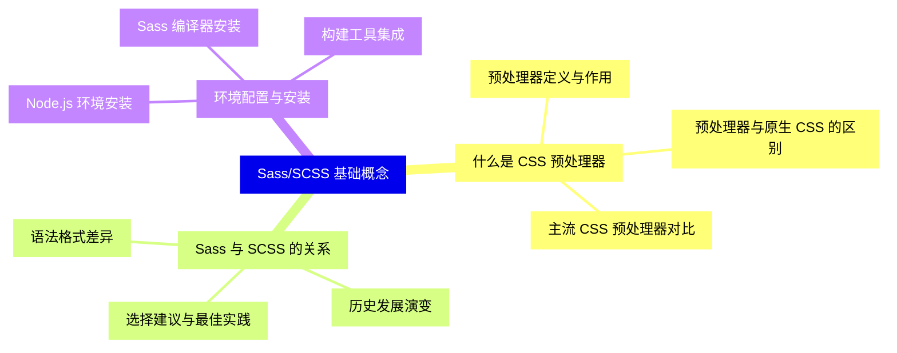
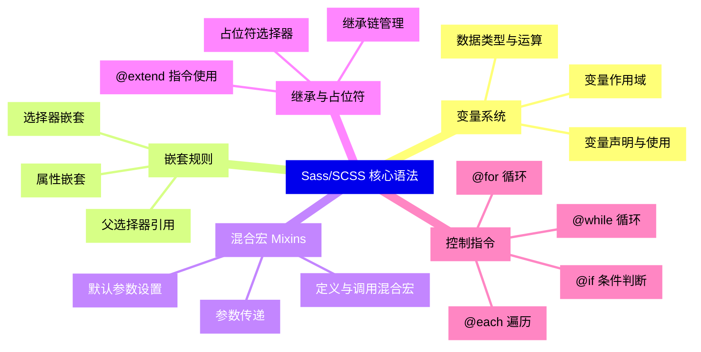
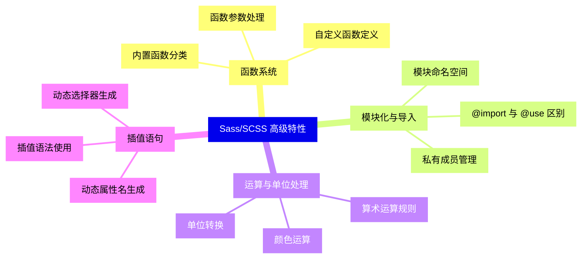
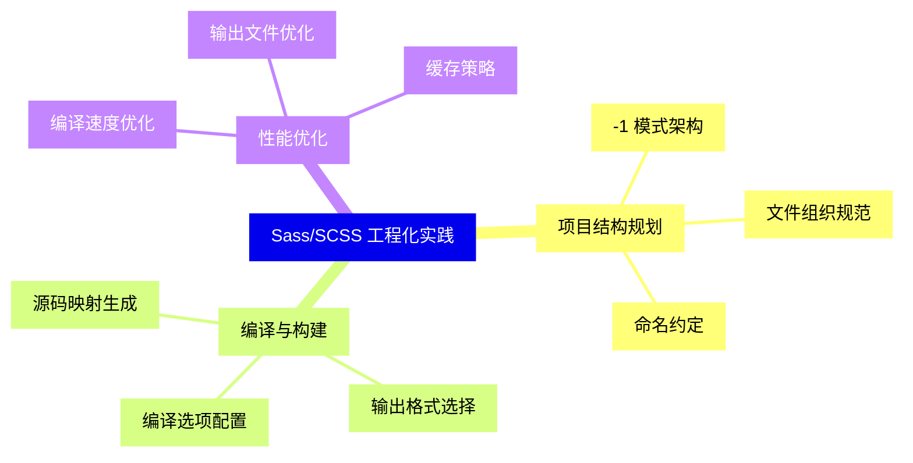
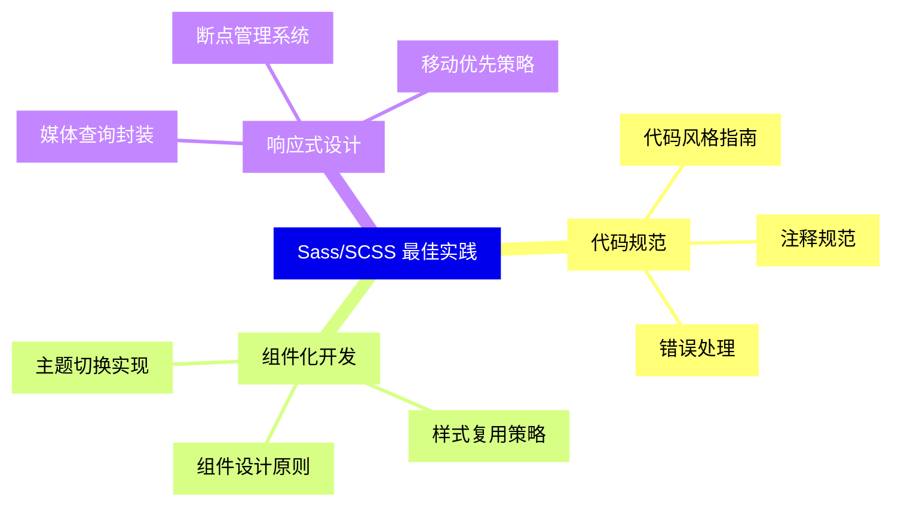
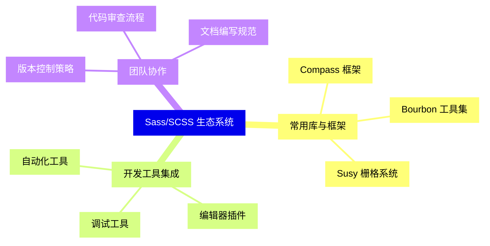
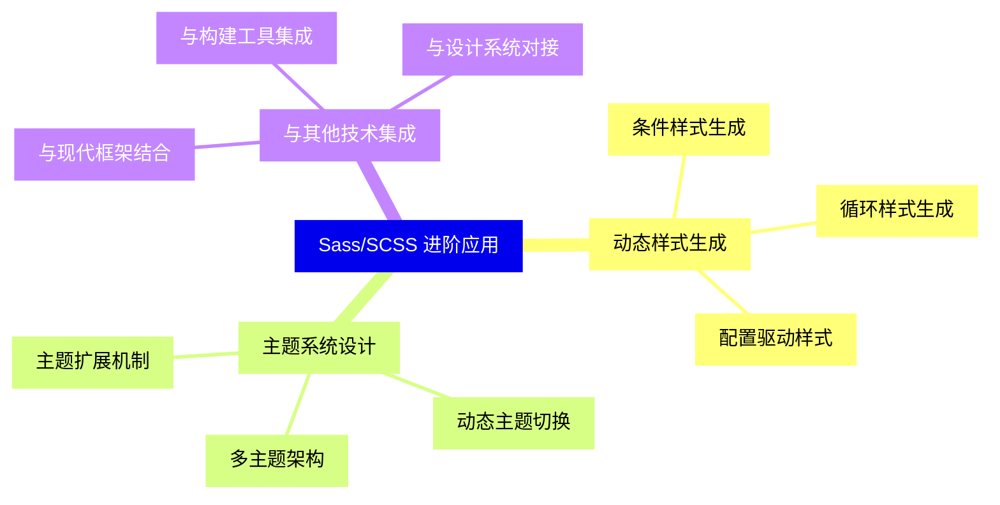


### 1 [Sass/SCSS 基础概念](#1)
#### 1.1 [什么是 CSS 预处理器](#1)
##### 1.1.1 [预处理器定义与作用](#1)
##### 1.1.2 [预处理器与原生 CSS 的区别](#1)
##### 1.1.3 [主流 CSS 预处理器对比](#1)
#### 1.2 [Sass 与 SCSS 的关系](#1)
##### 1.2.1 [语法格式差异](#1)
##### 1.2.2 [历史发展演变](#1)
##### 1.2.3 [选择建议与最佳实践](#1)
#### 1.3 [环境配置与安装](#1)
##### 1.3.1 [Node.js 环境安装](#1)
##### 1.3.2 [Sass 编译器安装](#1)
##### 1.3.3 [构建工具集成](#1)
### 2 [Sass/SCSS 核心语法](#2)
#### 2.1 [变量系统](#2)
##### 2.1.1 [变量声明与使用](#2)
##### 2.1.2 [变量作用域](#2)
##### 2.1.3 [数据类型与运算](#2)
#### 2.2 [嵌套规则](#2)
##### 2.2.1 [选择器嵌套](#2)
##### 2.2.2 [属性嵌套](#2)
##### 2.2.3 [父选择器引用](#2)
#### 2.3 [混合宏 Mixins](#2)
##### 2.3.1 [定义与调用混合宏](#2)
##### 2.3.2 [参数传递](#2)
##### 2.3.3 [默认参数设置](#2)
#### 2.4 [继承与占位符](#2)
##### 2.4.1 [@extend 指令使用](#2)
##### 2.4.2 [占位符选择器](#2)
##### 2.4.3 [继承链管理](#2)
#### 2.5 [控制指令](#2)
##### 2.5.1 [@if 条件判断](#2)
##### 2.5.2 [@for 循环](#2)
##### 2.5.3 [@each 遍历](#2)
##### 2.5.4 [@while 循环](#2)
### 3 [Sass/SCSS 高级特性](#3)
#### 3.1 [函数系统](#3)
##### 3.1.1 [内置函数分类](#3)
##### 3.1.2 [自定义函数定义](#3)
##### 3.1.3 [函数参数处理](#3)
#### 3.2 [模块化与导入](#3)
##### 3.2.1 [@import 与 @use 区别](#3)
##### 3.2.2 [模块命名空间](#3)
##### 3.2.3 [私有成员管理](#3)
#### 3.3 [运算与单位处理](#3)
##### 3.3.1 [算术运算规则](#3)
##### 3.3.2 [单位转换](#3)
##### 3.3.3 [颜色运算](#3)
#### 3.4 [插值语句](#3)
##### 3.4.1 [插值语法使用](#3)
##### 3.4.2 [动态选择器生成](#3)
##### 3.4.3 [动态属性名生成](#3)
### 4 [Sass/SCSS 工程化实践](#4)
#### 4.1 [项目结构规划](#4)
##### 4.1.1 [-1 模式架构](#4)
##### 4.1.2 [文件组织规范](#4)
##### 4.1.3 [命名约定](#4)
#### 4.2 [编译与构建](#4)
##### 4.2.1 [编译选项配置](#4)
##### 4.2.2 [输出格式选择](#4)
##### 4.2.3 [源码映射生成](#4)
#### 4.3 [性能优化](#4)
##### 4.3.1 [编译速度优化](#4)
##### 4.3.2 [输出文件优化](#4)
##### 4.3.3 [缓存策略](#4)
### 5 [Sass/SCSS 最佳实践](#5)
#### 5.1 [代码规范](#5)
##### 5.1.1 [代码风格指南](#5)
##### 5.1.2 [注释规范](#5)
##### 5.1.3 [错误处理](#5)
#### 5.2 [组件化开发](#5)
##### 5.2.1 [组件设计原则](#5)
##### 5.2.2 [样式复用策略](#5)
##### 5.2.3 [主题切换实现](#5)
#### 5.3 [响应式设计](#5)
##### 5.3.1 [媒体查询封装](#5)
##### 5.3.2 [断点管理系统](#5)
##### 5.3.3 [移动优先策略](#5)
### 6 [Sass/SCSS 生态系统](#6)
#### 6.1 [常用库与框架](#6)
##### 6.1.1 [Compass 框架](#6)
##### 6.1.2 [Bourbon 工具集](#6)
##### 6.1.3 [Susy 栅格系统](#6)
#### 6.2 [开发工具集成](#6)
##### 6.2.1 [编辑器插件](#6)
##### 6.2.2 [调试工具](#6)
##### 6.2.3 [自动化工具](#6)
#### 6.3 [团队协作](#6)
##### 6.3.1 [版本控制策略](#6)
##### 6.3.2 [代码审查流程](#6)
##### 6.3.3 [文档编写规范](#6)
### 7 [Sass/SCSS 进阶应用](#7)
#### 7.1 [动态样式生成](#7)
##### 7.1.1 [条件样式生成](#7)
##### 7.1.2 [循环样式生成](#7)
##### 7.1.3 [配置驱动样式](#7)
#### 7.2 [主题系统设计](#7)
##### 7.2.1 [多主题架构](#7)
##### 7.2.2 [动态主题切换](#7)
##### 7.2.3 [主题扩展机制](#7)
#### 7.3 [与其他技术集成](#7)
##### 7.3.1 [与现代框架结合](#7)
##### 7.3.2 [与构建工具集成](#7)
##### 7.3.3 [与设计系统对接](#7)




### 1 Sass/SCSS 基础概念

---
### 1 Sass/SCSS 基础概念
___
#### 1.1 什么是 CSS 预处理器
___
##### 1.1.1 预处理器定义与作用
___
##### 1.1.2 预处理器与原生 CSS 的区别
___
##### 1.1.3 主流 CSS 预处理器对比
___
#### 1.2 Sass 与 SCSS 的关系
___
##### 1.2.1 语法格式差异
___
##### 1.2.2 历史发展演变
___
##### 1.2.3 选择建议与最佳实践
___
#### 1.3 环境配置与安装
___
##### 1.3.1 Node.js 环境安装
___
##### 1.3.2 Sass 编译器安装
___
##### 1.3.3 构建工具集成
### 2 Sass/SCSS 核心语法

---
### 2 Sass/SCSS 核心语法
___
#### 2.1 变量系统
___
##### 2.1.1 变量声明与使用
___
##### 2.1.2 变量作用域
___
##### 2.1.3 数据类型与运算
___
#### 2.2 嵌套规则
___
##### 2.2.1 选择器嵌套
___
##### 2.2.2 属性嵌套
___
##### 2.2.3 父选择器引用
___
#### 2.3 混合宏 Mixins
___
##### 2.3.1 定义与调用混合宏
___
##### 2.3.2 参数传递
___
##### 2.3.3 默认参数设置
___
#### 2.4 继承与占位符
___
##### 2.4.1 @extend 指令使用
___
##### 2.4.2 占位符选择器
___
##### 2.4.3 继承链管理
___
#### 2.5 控制指令
___
##### 2.5.1 @if 条件判断
___
##### 2.5.2 @for 循环
___
##### 2.5.3 @each 遍历
___
##### 2.5.4 @while 循环
### 3 Sass/SCSS 高级特性

---
### 3 Sass/SCSS 高级特性
___
#### 3.1 函数系统
___
##### 3.1.1 内置函数分类
___
##### 3.1.2 自定义函数定义
___
##### 3.1.3 函数参数处理
___
#### 3.2 模块化与导入
___
##### 3.2.1 @import 与 @use 区别
___
##### 3.2.2 模块命名空间
___
##### 3.2.3 私有成员管理
___
#### 3.3 运算与单位处理
___
##### 3.3.1 算术运算规则
___
##### 3.3.2 单位转换
___
##### 3.3.3 颜色运算
___
#### 3.4 插值语句
___
##### 3.4.1 插值语法使用
___
##### 3.4.2 动态选择器生成
___
##### 3.4.3 动态属性名生成
### 4 Sass/SCSS 工程化实践

---
### 4 Sass/SCSS 工程化实践
___
#### 4.1 项目结构规划
___
##### 4.1.1 -1 模式架构
___
##### 4.1.2 文件组织规范
___
##### 4.1.3 命名约定
___
#### 4.2 编译与构建
___
##### 4.2.1 编译选项配置
___
##### 4.2.2 输出格式选择
___
##### 4.2.3 源码映射生成
___
#### 4.3 性能优化
___
##### 4.3.1 编译速度优化
___
##### 4.3.2 输出文件优化
___
##### 4.3.3 缓存策略
### 5 Sass/SCSS 最佳实践

---
### 5 Sass/SCSS 最佳实践
___
#### 5.1 代码规范
___
##### 5.1.1 代码风格指南
___
##### 5.1.2 注释规范
___
##### 5.1.3 错误处理
___
#### 5.2 组件化开发
___
##### 5.2.1 组件设计原则
___
##### 5.2.2 样式复用策略
___
##### 5.2.3 主题切换实现
___
#### 5.3 响应式设计
___
##### 5.3.1 媒体查询封装
___
##### 5.3.2 断点管理系统
___
##### 5.3.3 移动优先策略
### 6 Sass/SCSS 生态系统

---
### 6 Sass/SCSS 生态系统
___
#### 6.1 常用库与框架
___
##### 6.1.1 Compass 框架
___
##### 6.1.2 Bourbon 工具集
___
##### 6.1.3 Susy 栅格系统
___
#### 6.2 开发工具集成
___
##### 6.2.1 编辑器插件
___
##### 6.2.2 调试工具
___
##### 6.2.3 自动化工具
___
#### 6.3 团队协作
___
##### 6.3.1 版本控制策略
___
##### 6.3.2 代码审查流程
___
##### 6.3.3 文档编写规范
### 7 Sass/SCSS 进阶应用

---
### 7 Sass/SCSS 进阶应用
___
#### 7.1 动态样式生成
___
##### 7.1.1 条件样式生成
___
##### 7.1.2 循环样式生成
___
##### 7.1.3 配置驱动样式
___
#### 7.2 主题系统设计
___
##### 7.2.1 多主题架构
___
##### 7.2.2 动态主题切换
___
##### 7.2.3 主题扩展机制
___
#### 7.3 与其他技术集成
___
##### 7.3.1 与现代框架结合
___
##### 7.3.2 与构建工具集成
___
##### 7.3.3 与设计系统对接


### 1 Sass/SCSS 基础概念{#1}

{}

<--->
{}
{}
{}
{}
{}
{}
{}
{}
{}
{}
{}
{}
{}
{}
{}
{}
{}
{}
{}
{}
{}
{}
{}
{}
{}

### 2 Sass/SCSS 核心语法{#2}

{}
{}
{}
{}
{}
{}
{}
{}
{}
{}
{}
{}
{}
{}
{}
{}
{}
{}
{}
{}
{}
{}
{}
{}
{}
{}
{}
{}
{}
{}
{}
{}
{}
{}
{}
{}
{}
{}
{}
{}
{}
{}
{}
<--->

{}

### 3 Sass/SCSS 高级特性{#3}

{}

<--->
{}
{}
{}
{}
{}
{}
{}
{}
{}
{}
{}
{}
{}
{}
{}
{}
{}
{}
{}
{}
{}
{}
{}
{}
{}
{}
{}
{}
{}
{}
{}
{}
{}

### 4 Sass/SCSS 工程化实践{#4}

{}
{}
{}
{}
{}
{}
{}
{}
{}
{}
{}
{}
{}
{}
{}
{}
{}
{}
{}
{}
{}
{}
{}
{}
{}
<--->

{}

### 5 Sass/SCSS 最佳实践{#5}

{}

<--->
{}
{}
{}
{}
{}
{}
{}
{}
{}
{}
{}
{}
{}
{}
{}
{}
{}
{}
{}
{}
{}
{}
{}
{}
{}

### 6 Sass/SCSS 生态系统{#6}

{}
{}
{}
{}
{}
{}
{}
{}
{}
{}
{}
{}
{}
{}
{}
{}
{}
{}
{}
{}
{}
{}
{}
{}
{}
<--->

{}

### 7 Sass/SCSS 进阶应用{#7}

{}

<--->
{}
{}
{}
{}
{}
{}
{}
{}
{}
{}
{}
{}
{}
{}
{}
{}
{}
{}
{}
{}
{}
{}
{}
{}
{}
